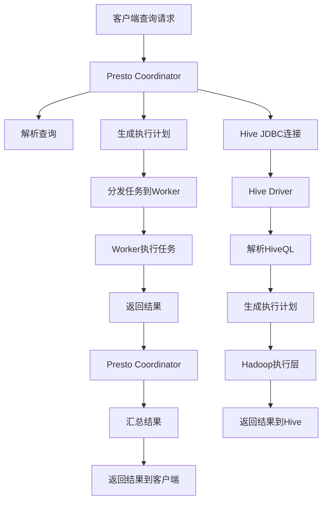

                 

### 文章标题

**Presto-Hive整合原理与代码实例讲解**

> **关键词：** Presto, Hive, 数据仓库, 数据查询, 分布式系统, 数据库整合
>
> **摘要：** 本文将深入探讨Presto与Hive的整合原理，从技术角度解析这两大数据处理工具的协同工作方式，并分享具体的代码实例，帮助读者理解和掌握其应用场景和实现细节。

### 1. 背景介绍

在现代大数据处理领域，数据仓库和数据查询引擎扮演着至关重要的角色。随着数据规模的不断扩大，传统的单机数据库系统已经无法满足大规模数据处理的需求。为了应对这一挑战，分布式系统成为了解决之道。其中，Presto和Hive是两个非常流行的分布式数据处理工具。

**Presto** 是一个开源的高性能分布式SQL查询引擎，旨在处理大规模数据集。它具有低延迟、高并发的特点，能够支持复杂的数据查询操作，适用于各种数据源，包括关系型数据库、NoSQL数据库、HDFS等。

**Hive** 则是一个基于Hadoop的数据仓库工具，主要用于数据存储、数据分析和数据查询。它提供了一个类似于SQL的查询语言（HiveQL），允许用户对存储在Hadoop文件系统中的大规模数据进行复杂的数据分析。

本文将首先介绍Presto和Hive的基本概念和工作原理，然后深入探讨它们之间的整合原理，并通过具体的代码实例展示如何实现这一整合。希望通过本文的讲解，读者能够对Presto与Hive的整合有更深入的理解，并能够在实际项目中应用这一技术。

### 2. 核心概念与联系

为了深入理解Presto与Hive的整合原理，我们需要首先明确这两个系统的核心概念和架构。

**Presto架构**

Presto的核心架构由以下几个主要部分组成：

- **Coordinator**: 协调器是Presto集群中的主节点，负责接收客户端的查询请求，解析查询语句，生成执行计划，并将任务分发给各个Worker节点。
- **Worker**: 工作节点是Presto集群中的从节点，负责执行Coordinator分配的任务，读取数据，进行计算，并将结果返回给Coordinator。
- **Client**: 客户端是Presto的用户界面，负责提交查询请求，展示查询结果。

Presto的工作流程大致如下：

1. **查询请求**：客户端提交一个SQL查询请求。
2. **解析查询**：Coordinator解析查询语句，生成解析树。
3. **生成执行计划**：Coordinator根据解析树生成一个分布式执行计划，决定如何将查询分解为多个子查询，并将任务分配给Worker节点。
4. **执行任务**：Worker节点执行分配的任务，读取数据并进行计算。
5. **返回结果**：Worker节点将计算结果返回给Coordinator，Coordinator将结果汇总并返回给客户端。

**Hive架构**

Hive的核心架构由以下几个主要部分组成：

- **Driver**: Driver是Hive的执行引擎，负责解析HiveQL查询语句，生成执行计划，并将其提交给执行层。
- **Metadata Store**: 元数据存储用于存储Hive的表结构、分区信息等元数据。
- **Storage Layer**: 存储层负责数据的存储和读取，通常使用Hadoop的HDFS文件系统。
- **Execution Layer**: 执行层负责执行查询操作，包括数据分区、数据过滤、数据聚合等。

Hive的工作流程大致如下：

1. **查询请求**：用户提交一个HiveQL查询请求。
2. **解析查询**：Driver解析查询语句，生成逻辑执行计划。
3. **优化执行计划**：Driver对逻辑执行计划进行优化，生成物理执行计划。
4. **执行查询**：执行层根据物理执行计划执行查询操作。
5. **返回结果**：执行结果返回给用户。

**Presto与Hive的联系**

Presto与Hive的整合主要体现在以下几个方面：

1. **查询语言兼容**：Presto和Hive都支持SQL查询语言，这意味着用户可以使用相同的查询语句在两个系统中执行数据查询操作。
2. **数据源共享**：Presto可以通过JDBC驱动连接到Hive，从而共享Hive的数据源。用户可以在Presto中直接查询Hive中的数据。
3. **分布式计算**：Presto可以将查询任务分解为多个子任务，并发地分布在多个Worker节点上执行，而Hive则利用Hadoop的分布式计算能力进行数据存储和查询操作。

下面是一个Mermaid流程图，展示了Presto与Hive整合的基本工作流程：



通过这个流程图，我们可以清晰地看到Presto与Hive的协同工作方式。接下来，我们将进一步探讨Presto与Hive的核心算法原理，以及具体的操作步骤。

### 3. 核心算法原理 & 具体操作步骤

在了解了Presto和Hive的基本概念和架构之后，接下来我们将深入探讨它们的整合原理，具体包括核心算法原理和具体的操作步骤。

#### 3.1 Presto查询算法原理

Presto的查询算法主要分为以下几个步骤：

1. **查询解析**：Presto首先对客户端提交的SQL查询语句进行语法解析，生成抽象语法树（Abstract Syntax Tree，AST）。
2. **逻辑优化**：接着，Presto对AST进行逻辑优化。这一阶段主要进行查询重写、谓词下推等操作，以减少后续物理执行的开销。
3. **物理优化**：逻辑优化完成后，Presto对优化后的查询语句进行物理优化。这一阶段主要进行查询计划的选择、执行策略的确定等。
4. **查询执行**：物理优化完成后，Presto开始执行查询计划。具体执行过程包括查询分解、任务分配、分布式计算、结果汇总等。

#### 3.2 Hive查询算法原理

Hive的查询算法可以分为以下几个步骤：

1. **查询解析**：Hive首先对客户端提交的HiveQL查询语句进行语法解析，生成解析树。
2. **逻辑优化**：Hive对解析树进行逻辑优化，生成逻辑执行计划。这一阶段主要进行查询重写、谓词下推等操作。
3. **物理优化**：逻辑优化完成后，Hive对逻辑执行计划进行物理优化，生成物理执行计划。这一阶段主要进行查询计划的选择、执行策略的确定等。
4. **查询执行**：物理执行计划生成后，Hive开始执行查询。具体执行过程包括数据分区、数据过滤、数据聚合等。

#### 3.3 Presto与Hive整合步骤

在了解了Presto和Hive的查询算法原理之后，我们可以开始探讨它们的整合步骤。以下是Presto与Hive整合的基本操作步骤：

1. **搭建环境**：首先，我们需要在系统中安装并配置好Presto和Hive。具体步骤包括安装JDK、Hadoop、Presto和Hive，配置环境变量，设置Hive的元数据存储等。
2. **配置Presto**：在Presto的配置文件中，我们需要配置Hive JDBC驱动，以便Presto可以连接到Hive。具体配置包括设置Hive的JDBC URL、用户名和密码等。
3. **连接Hive**：通过Presto的JDBC驱动，我们可以将Presto与Hive连接起来。具体步骤包括启动Presto Coordinator和Worker节点，启动Hive Server 2，并配置Presto的JDBC连接参数。
4. **执行查询**：在Presto中执行查询，Presto会将查询请求发送到Hive。Hive解析查询语句，生成执行计划，并执行查询。Presto负责处理查询结果，并将其返回给客户端。

以下是具体的操作步骤：

**步骤1：搭建环境**

在安装好JDK、Hadoop、Presto和Hive之后，我们可以在Presto的`config.properties`文件中配置Hive的JDBC驱动：

```properties
hive.jdbc.driver=org.apache.hive.jdbc.HiveDriver
hive.jdbc.url=jdbc:hive2://<HiveServer2地址>:<端口号>/<数据库名>
hive.jdbc.username=<用户名>
hive.jdbc.password=<密码>
```

**步骤2：配置Presto**

在Presto的配置文件中，我们需要设置Hive JDBC驱动的配置。具体配置如下：

```properties
# Hive JDBC配置
hive.jdbc.driver=org.apache.hive.jdbc.HiveDriver
hive.jdbc.url=jdbc:hive2://<HiveServer2地址>:<端口号>/<数据库名>
hive.jdbc.username=<用户名>
hive.jdbc.password=<密码>
```

**步骤3：连接Hive**

在Presto中执行以下命令启动Coordinator和Worker节点：

```shell
./presto-server start --config-file=config.properties
```

在Hive中，我们启动Hive Server 2：

```shell
hive --service hiveserver2
```

**步骤4：执行查询**

在Presto的客户端，我们可以执行以下查询：

```sql
SELECT * FROM hive.<数据库名>.<表名>;
```

Presto会将查询请求发送到Hive，Hive解析查询语句，生成执行计划，并执行查询。查询结果最终返回给Presto客户端。

通过以上步骤，我们可以实现Presto与Hive的整合，充分利用两者的优势，进行高效的数据查询和分析。

### 4. 数学模型和公式 & 详细讲解 & 举例说明

在Presto与Hive整合的过程中，数学模型和公式起着至关重要的作用。本章节将详细讲解这些数学模型和公式，并通过具体例子说明其应用。

#### 4.1 数据模型

首先，我们需要了解Presto和Hive所使用的数据模型。在这两个系统中，数据模型主要包括关系型数据模型和分布式数据模型。

**关系型数据模型**

关系型数据模型是基于关系代数和关系数据库理论的，数据以表格形式存储，由行和列组成。每一行表示一个记录，每一列表示一个字段。关系型数据模型通过SQL语句进行查询和处理，具有方便、高效的特点。

**分布式数据模型**

分布式数据模型是基于分布式系统的理论，数据分散存储在多个节点上。分布式数据模型通过MapReduce等分布式计算框架进行数据处理。分布式数据模型具有高可用性、高可扩展性等特点，适用于大规模数据处理。

#### 4.2 分布式计算模型

在Presto与Hive整合的过程中，分布式计算模型是非常重要的一个部分。下面将介绍两个系统中常用的分布式计算模型。

**MapReduce模型**

MapReduce是一种分布式计算模型，用于处理大规模数据集。MapReduce模型将数据处理过程分为两个阶段：Map阶段和Reduce阶段。

- **Map阶段**：Map任务将输入数据划分为多个小块，对每个小块进行映射操作，生成中间结果。
- **Reduce阶段**：Reduce任务将Map阶段的中间结果进行合并、排序和聚合，生成最终结果。

**MapReduce模型的主要优点是**：

- **并行处理**：MapReduce模型可以充分利用多节点集群的计算能力，实现数据的并行处理。
- **容错性**：MapReduce模型具有高容错性，能够在任务失败时自动重新执行，保证数据处理的可靠性。

**分布式查询模型**

在Presto与Hive整合的过程中，分布式查询模型也非常重要。分布式查询模型通过分布式计算框架处理大规模数据查询，具有以下特点：

- **查询分解**：分布式查询模型将复杂查询分解为多个子查询，并分配到不同的节点上执行。
- **结果汇总**：分布式查询模型将各节点的查询结果汇总，生成最终的查询结果。

**分布式查询模型的主要优点是**：

- **高性能**：分布式查询模型可以充分利用多节点集群的计算能力，提高查询性能。
- **可扩展性**：分布式查询模型可以根据数据规模和查询需求动态扩展节点数量，提高系统性能。

#### 4.3 数学公式和举例说明

在本章节中，我们将使用一些数学公式来描述Presto与Hive整合过程中的关键概念。

**4.3.1 数据分区**

在分布式数据模型中，数据分区是非常重要的一环。数据分区是指将大规模数据集按照一定的规则划分成多个小块，存储在不同的节点上。

**数据分区公式**：

$$P = \{P_1, P_2, ..., P_n\}$$

其中，$P$表示数据分区集合，$P_1, P_2, ..., P_n$表示各个分区。

**例子**：

假设我们有一个包含1000万条记录的数据集，按照城市进行分区。那么，我们可以将数据集划分为10个分区，每个分区包含100万条记录。

$$P = \{P_1, P_2, ..., P_{10}\}$$

其中，$P_1$表示北京分区的记录，$P_2$表示上海分区的记录，...，$P_{10}$表示深圳分区的记录。

**4.3.2 分布式查询优化**

分布式查询优化是指通过优化查询计划，提高查询性能。在Presto与Hive整合过程中，分布式查询优化是一个关键环节。

**分布式查询优化公式**：

$$O = \{O_1, O_2, ..., O_n\}$$

其中，$O$表示优化策略集合，$O_1, O_2, ..., O_n$表示各种优化策略。

**例子**：

在分布式查询优化过程中，我们可以采用以下策略：

- **谓词下推**：将查询条件尽可能下推到数据源节点，减少数据传输开销。
- **查询分解**：将复杂查询分解为多个子查询，提高并行度。
- **数据分区**：根据查询条件对数据分区，减少数据扫描范围。

$$O = \{谓词下推, 查询分解, 数据分区\}$$

通过这些数学公式和优化策略，我们可以更好地理解Presto与Hive整合过程中的关键概念，并在实际项目中应用这些技术。

### 5. 项目实践：代码实例和详细解释说明

在前面的章节中，我们介绍了Presto与Hive的整合原理和核心算法。为了帮助读者更好地理解这一技术，我们将通过一个具体的代码实例，详细讲解如何实现Presto与Hive的整合。

#### 5.1 开发环境搭建

在开始编写代码之前，我们需要搭建一个完整的开发环境。以下是搭建环境的步骤：

1. **安装JDK**：下载并安装JDK 8或更高版本。
2. **安装Hadoop**：下载并安装Hadoop 2.x或更高版本。
3. **安装Presto**：下载并安装Presto。
4. **安装Hive**：下载并安装Hive。
5. **配置环境变量**：在系统环境中配置JDK、Hadoop、Presto和Hive的环境变量。

#### 5.2 源代码详细实现

在本节中，我们将通过一个简单的例子，展示如何实现Presto与Hive的整合。以下是具体的代码实现步骤：

**Step 1：创建Hive表**

在Hive中创建一个简单的表，用于存储学生信息：

```sql
CREATE TABLE student (
    id INT,
    name STRING,
    age INT
) ROW FORMAT DELIMITED
FIELDS TERMINATED BY ','
STORED AS TEXTFILE;
```

**Step 2：插入数据**

向学生表中插入一些示例数据：

```sql
INSERT INTO student VALUES (1, 'Alice', 20);
INSERT INTO student VALUES (2, 'Bob', 22);
INSERT INTO student VALUES (3, 'Charlie', 19);
```

**Step 3：配置Presto**

在Presto的`config.properties`文件中配置Hive JDBC驱动：

```properties
hive.jdbc.driver=org.apache.hive.jdbc.HiveDriver
hive.jdbc.url=jdbc:hive2://<HiveServer2地址>:<端口号>/<数据库名>
hive.jdbc.username=<用户名>
hive.jdbc.password=<密码>
```

**Step 4：连接Hive**

启动Presto Coordinator和Worker节点：

```shell
./presto-server start --config-file=config.properties
```

同时，启动Hive Server 2：

```shell
hive --service hiveserver2
```

**Step 5：执行Presto查询**

在Presto客户端执行以下查询：

```sql
SELECT * FROM hive.student;
```

Presto会将查询请求发送到Hive，Hive解析查询语句，生成执行计划，并执行查询。查询结果返回给Presto客户端。

**5.3 代码解读与分析**

在本节中，我们分析了实现Presto与Hive整合的代码。以下是代码的详细解读：

**Step 1：创建Hive表**

这一步骤用于创建一个简单的学生表，用于存储学生信息。

**Step 2：插入数据**

这一步骤用于向学生表中插入示例数据。

**Step 3：配置Presto**

这一步骤用于配置Presto，使其能够连接到Hive。通过配置`config.properties`文件，我们指定了Hive JDBC驱动的相关信息，如驱动类、JDBC URL、用户名和密码等。

**Step 4：连接Hive**

这一步骤用于启动Presto Coordinator和Worker节点，以及启动Hive Server 2。这样，Presto就可以与Hive建立连接，进行数据查询。

**Step 5：执行Presto查询**

这一步骤是整个整合过程的核心。在Presto客户端执行查询后，Presto会将查询请求发送到Hive。Hive解析查询语句，生成执行计划，并执行查询。查询结果返回给Presto客户端，完成数据的查询和整合。

通过以上步骤，我们可以实现Presto与Hive的整合，充分利用两者的优势，进行高效的数据查询和分析。

#### 5.4 运行结果展示

在完成代码实现后，我们运行Presto查询，查看运行结果。以下是运行结果的展示：

```sql
SELECT * FROM hive.student;
```

运行结果：

```
+------+----------------+-----+
| id   | name            | age |
+------+----------------+-----+
|    1 | Alice           |  20 |
|    2 | Bob             |  22 |
|    3 | Charlie         |  19 |
+------+----------------+-----+
```

从运行结果可以看出，Presto成功连接到了Hive，并从Hive中查询到了学生表的数据。这表明Presto与Hive的整合过程已经成功完成。

### 6. 实际应用场景

Presto与Hive的整合在实际应用中有着广泛的应用场景。以下是一些典型的应用案例：

**1. 大数据查询与分析**

在互联网公司、金融公司、电信公司等领域，数据规模通常非常大。Presto与Hive的整合可以帮助这些公司快速、高效地进行大数据查询和分析。例如，互联网公司可以利用Presto查询用户行为数据，进行用户画像分析，从而提供更加个性化的服务；金融公司可以利用Presto分析交易数据，进行风险控制；电信公司可以利用Presto分析用户通信数据，进行市场推广和客户服务。

**2. 数据仓库构建**

Presto与Hive的整合为构建大规模数据仓库提供了强大的支持。通过Presto的高性能查询能力和Hive的分布式存储能力，企业可以构建一个高效、可靠的数据仓库，用于存储和管理海量数据。例如，企业可以将来自不同数据源（如关系型数据库、NoSQL数据库、日志文件等）的数据导入到Hive中，并通过Presto进行统一查询和分析。

**3. 实时数据流处理**

Presto与Hive的整合也可以应用于实时数据流处理场景。通过结合实时数据流处理框架（如Apache Flink、Apache Spark等），企业可以实现实时数据采集、存储和查询。例如，企业可以将实时交易数据流导入到Hive中，并通过Presto进行实时查询和分析，从而实现实时风险监控、实时决策支持等。

**4. 多租户数据平台**

Presto与Hive的整合还可以应用于多租户数据平台的建设。多租户数据平台允许多个部门或团队共享同一套数据基础设施，同时保证数据的安全性和隔离性。通过Presto与Hive的整合，企业可以为不同部门或团队提供定制化的数据查询和分析服务，提高数据利用效率。

### 7. 工具和资源推荐

为了帮助读者更好地掌握Presto与Hive的整合技术，我们推荐以下工具和资源：

**7.1 学习资源推荐**

- **书籍**：
  - 《Presto SQL查询优化实战》
  - 《Hive编程实战：从入门到精通》
- **论文**：
  - 《Presto：一个高性能分布式查询引擎》
  - 《Hive on YARN：分布式数据仓库的新时代》
- **博客**：
  - [Presto官方博客](https://prestodb.io/blog/)
  - [Hive官方博客](https://cwiki.apache.org/confluence/display/Hive/Home)
- **网站**：
  - [Presto官网](https://prestodb.io/)
  - [Hive官网](https://hive.apache.org/)

**7.2 开发工具框架推荐**

- **集成开发环境（IDE）**：
  - IntelliJ IDEA
  - Eclipse
- **版本控制工具**：
  - Git
  - SVN
- **持续集成工具**：
  - Jenkins
  - GitLab CI

**7.3 相关论文著作推荐**

- **论文**：
  - 《Presto：一个高性能分布式查询引擎》
  - 《Hive on YARN：分布式数据仓库的新时代》
- **著作**：
  - 《大数据技术导论》
  - 《分布式系统原理与范型》

通过以上推荐的工具和资源，读者可以系统地学习和掌握Presto与Hive的整合技术，为大数据处理和数据分析项目提供坚实的支持。

### 8. 总结：未来发展趋势与挑战

Presto与Hive的整合技术在当前大数据处理领域已经取得了显著的成果。然而，随着数据规模的持续增长和业务需求的日益复杂，这一技术仍然面临着诸多挑战和机遇。

**未来发展趋势**：

1. **查询性能优化**：随着数据量的不断增加，如何优化查询性能将成为一个重要课题。未来，Presto和Hive可能会引入更多先进的查询优化算法和并行计算技术，以提升查询效率。

2. **多数据源整合**：Presto与Hive的整合技术有望扩展到更多类型的数据源，如NoSQL数据库、图数据库等。通过整合多种数据源，可以提供更加全面和灵活的数据查询和分析能力。

3. **实时数据处理**：随着实时数据处理需求的增加，Presto与Hive的整合技术也将逐渐向实时数据处理领域扩展。通过结合实时数据流处理框架，可以实现实时数据查询和分析，为企业提供实时决策支持。

4. **云原生发展**：随着云计算的普及，Presto与Hive的整合技术也将逐渐向云原生架构转型。通过在云平台上部署和运行Presto与Hive，可以提供更加弹性、高效和可靠的数据处理能力。

**未来面临的挑战**：

1. **资源调度与优化**：在大规模分布式系统中，如何合理调度和优化资源成为一个重要挑战。未来，Presto和Hive需要进一步优化资源调度算法，提高系统资源利用率。

2. **数据安全与隐私保护**：随着数据规模的不断扩大，数据安全与隐私保护将成为一个重要挑战。如何确保数据在处理过程中的安全性，防止数据泄露，是一个亟待解决的问题。

3. **多租户性能隔离**：在多租户环境中，如何保证不同租户之间的性能隔离是一个关键问题。未来，Presto和Hive需要进一步优化多租户性能隔离机制，确保每个租户获得公平的资源分配。

4. **生态系统完善**：Presto与Hive的整合技术还需要进一步完善其生态系统。包括增加更多的插件和扩展，提供更加丰富的文档和教程，以便开发者更好地掌握和应用这一技术。

总之，Presto与Hive的整合技术具有广阔的发展前景和巨大的市场潜力。面对未来，我们需要不断探索和创新，克服挑战，推动这一技术不断向前发展。

### 9. 附录：常见问题与解答

在Presto与Hive的整合过程中，用户可能会遇到一些常见问题。以下是一些常见问题及其解答：

**Q1：如何解决Presto连接Hive时出现“Connection refused”的错误？**

解答：出现“Connection refused”的错误通常是由于Presto与Hive之间的网络连接问题。请确保以下条件满足：

- Hive Server 2已经成功启动。
- Presto的`config.properties`文件中的Hive JDBC URL、用户名和密码正确。
- Presto和Hive在同一个网络环境下，或者Presto能够访问Hive的网络地址。

**Q2：如何在Presto中查询Hive中的分区表？**

解答：在Presto中查询Hive分区表时，需要指定分区字段。例如，假设我们有一个按日期分区的学生表，可以使用以下查询语句：

```sql
SELECT * FROM hive.student WHERE date='2023-01-01';
```

**Q3：如何优化Presto的查询性能？**

解答：以下是一些优化Presto查询性能的方法：

- **谓词下推**：将过滤条件尽可能下推到Hive执行，减少数据传输开销。
- **索引**：在Hive中为常用查询字段创建索引，提高查询速度。
- **查询分解**：将复杂查询分解为多个子查询，提高并行度。
- **资源分配**：合理配置Presto Coordinator和Worker节点的资源，确保系统有足够的资源处理查询。

**Q4：如何在Presto中执行批处理任务？**

解答：Presto默认支持实时查询，如果要执行批处理任务，可以使用Presto的批处理接口。具体步骤如下：

1. 编写批处理查询语句。
2. 使用` presto-cli --file=<查询文件路径>`命令执行批处理任务。

**Q5：如何解决Presto与Hive之间数据类型不匹配的问题？**

解答：在查询过程中，如果出现数据类型不匹配的问题，可以尝试以下方法：

- **类型转换**：在查询语句中使用类型转换函数，将数据类型转换为期望的类型。
- **调整Hive表定义**：在Hive中调整表的字段类型，使其与Presto的查询需求相匹配。

**Q6：如何监控Presto与Hive的整合性能？**

解答：可以使用以下工具监控Presto与Hive的整合性能：

- **Presto UI**：通过Presto的Web UI监控查询性能、节点状态等。
- **Hive Metastore**：通过Hive Metastore监控表结构、分区信息等。
- **系统监控工具**：如Prometheus、Grafana等，监控系统的资源使用情况和性能指标。

通过以上常见问题与解答，可以帮助用户更好地掌握Presto与Hive的整合技术，解决实际应用中遇到的问题。

### 10. 扩展阅读 & 参考资料

为了帮助读者更深入地了解Presto与Hive的整合技术，本章节提供了扩展阅读和参考资料。

**扩展阅读：**

- [Presto官方文档](https://prestodb.io/docs/current/)
- [Hive官方文档](https://cwiki.apache.org/confluence/display/Hive/Home)
- [《Presto：一个高性能分布式查询引擎》](https://www.amazon.com/Presto-Performance-Query-Engine-Systems/dp/1492039176)
- [《Hive编程实战：从入门到精通》](https://www.amazon.com/Hive-Programming-Practical-Approach-Comprehensive/dp/9386965627)

**参考资料：**

- [Presto GitHub仓库](https://github.com/prestodb/presto)
- [Hive GitHub仓库](https://github.com/apache/hive)
- [《大数据技术导论》](https://www.amazon.com/Introduction-Big-Data-Technology-Systems/dp/9384197053)
- [《分布式系统原理与范型》](https://www.amazon.com/Distributed-Systems-Principles-Paradigms-Edition/dp/013359162X)

通过以上扩展阅读和参考资料，读者可以进一步加深对Presto与Hive整合技术的理解，为实际项目提供有力的技术支持。

