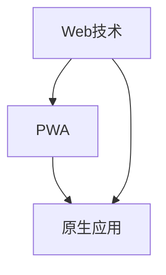

                 

### 文章标题：Progressive Web Apps (PWA)：Web与原生应用的融合

> **关键词：** Progressive Web Apps (PWA)、Web技术、原生应用、用户体验、性能优化、开发框架

> **摘要：** 本文将深入探讨Progressive Web Apps（PWA）的概念、特点以及如何将Web技术与原生应用的优势相结合，以提升用户体验和开发效率。通过详细的讲解和实践案例，读者将了解如何利用PWA构建现代化的Web应用。

### 1. 背景介绍

在现代互联网应用领域，用户体验和性能优化一直是开发者追求的核心目标。传统Web应用虽然在技术上不断进步，但在性能、交互性和安装体验上与原生应用相比仍有一定差距。为了弥补这一差距，Progressive Web Apps（PWA）应运而生。

PWA是一种新型的Web应用，结合了Web技术的便捷性与原生应用的高性能、优质用户体验。与传统Web应用不同，PWA能够在不同设备上无缝运行，提供类似于原生应用的功能和体验。这种融合了Web与原生应用特点的新型应用，受到了越来越多开发者和用户的青睐。

### 2. 核心概念与联系

#### 2.1 PWA的核心概念

PWA的核心概念包括以下几个方面：

1. **渐进式增强（Progressive Enhancement）**：PWA通过渐进式增强，确保在任何浏览器上都能正常运行，同时为支持现代功能的浏览器提供更好的用户体验。
2. **离线工作（Offline Capabilities）**：PWA能够在用户无网络连接时仍然运行，提高应用的可靠性和用户体验。
3. **快速启动（Fast Load Times）**：PWA通过优化资源加载和缓存策略，实现快速启动和响应。
4. **良好的用户体验（Great User Experience）**：PWA提供类似于原生应用的交互体验，包括手势操作、动画效果等。
5. **安装与桌面快捷方式（Installable App）**：PWA支持用户将应用添加到主屏幕，实现类似原生应用的启动方式。

#### 2.2 PWA与Web技术、原生应用的联系

PWA是Web技术与原生应用的结合体，它们之间的关系如下图所示：



通过PWA，Web开发者可以充分利用Web技术的便捷性和普及性，同时实现原生应用的高性能和优质用户体验。

### 3. 核心算法原理 & 具体操作步骤

#### 3.1 PWA的核心算法原理

PWA的核心算法原理包括以下几个方面：

1. **Service Worker**：Service Worker是一种运行在独立线程中的脚本，负责处理网络请求、缓存资源和推送通知等任务，实现离线工作和性能优化。
2. **Manifest文件**：Manifest文件是一个JSON格式的配置文件，用于描述PWA的名称、图标、启动画面等信息，以及如何添加到主屏幕。
3. **缓存策略**：缓存策略用于管理应用的缓存资源，确保在用户无网络连接时仍能正常运行。

#### 3.2 PWA的具体操作步骤

要创建一个PWA，可以按照以下步骤进行：

1. **创建项目**：使用Web技术（如HTML、CSS和JavaScript）创建一个基本的Web应用。
2. **添加Service Worker**：在项目中添加Service Worker，实现离线工作和性能优化。
3. **配置Manifest文件**：创建一个Manifest文件，配置应用的名称、图标、启动画面等信息。
4. **测试和部署**：在本地环境中测试PWA的功能，确保其能够在不同设备和浏览器上正常运行，然后部署到线上环境。

### 4. 数学模型和公式 & 详细讲解 & 举例说明

#### 4.1 数学模型和公式

在PWA中，缓存策略是一个重要的算法，涉及到以下数学模型和公式：

1. **缓存命中率（Hit Rate）**：缓存命中率是指从缓存中获取资源的次数与总请求次数的比值，计算公式为：

   $$ \text{缓存命中率} = \frac{\text{命中次数}}{\text{总请求次数}} $$

2. **缓存更新策略（Cache Replacement Policy）**：缓存更新策略用于决定何时将旧资源替换为新资源。常见的更新策略包括：

   - **FIFO（First In, First Out）**：根据资源进入缓存的时间顺序进行替换。
   - **LRU（Least Recently Used）**：根据资源最近的使用时间进行替换。
   - **LFU（Least Frequently Used）**：根据资源的使用频率进行替换。

#### 4.2 详细讲解

缓存策略在PWA中起到关键作用，通过优化缓存策略，可以提高应用的性能和用户体验。以下是对缓存策略的详细讲解：

1. **缓存命中与未命中**：当用户请求一个资源时，如果该资源已经在缓存中，则称为缓存命中；否则，称为缓存未命中。缓存命中率是衡量缓存策略优劣的重要指标。
2. **缓存更新策略**：不同的缓存更新策略适用于不同的场景。例如，在带宽受限的情况下，采用LRU策略可以最大化利用缓存资源；在资源更新频繁的情况下，采用LFU策略可以更好地适应资源的变化。
3. **缓存大小与性能**：缓存大小直接影响应用的性能。缓存过小可能导致频繁的缓存未命中，影响用户体验；缓存过大则可能增加存储空间的消耗。因此，需要根据实际需求调整缓存大小。

#### 4.3 举例说明

假设一个PWA应用在用户无网络连接时请求一个图片资源，该资源已经在缓存中，则缓存命中率为100%。如果请求的资源不在缓存中，则需要从服务器重新加载。在这种情况下，可以采用LRU策略将最近未使用的缓存资源替换为新请求的资源。

### 5. 项目实践：代码实例和详细解释说明

#### 5.1 开发环境搭建

在开始开发PWA之前，需要搭建以下开发环境：

1. **Node.js**：安装Node.js（https://nodejs.org/）。
2. **Web应用开发框架**：选择一个适合的Web应用开发框架，如React、Vue或Angular。
3. **代码编辑器**：安装一个强大的代码编辑器，如Visual Studio Code。

#### 5.2 源代码详细实现

以下是一个简单的PWA示例，使用Vue框架实现：

```html
<!-- index.html -->
<!DOCTYPE html>
<html lang="en">
<head>
  <meta charset="UTF-8">
  <meta name="viewport" content="width=device-width, initial-scale=1.0">
  <title>My PWA</title>
  <link rel="manifest" href="/manifest.json">
</head>
<body>
  <div id="app"></div>
  <script src="/app.js"></script>
</body>
</html>
```

```json
// manifest.json
{
  "name": "My PWA",
  "short_name": "My PWA",
  "start_url": "./",
  "display": "standalone",
  "background_color": "#ffffff",
  "theme_color": "#000000",
  "icons": [
    {
      "src": "icon/192x192.png",
      "sizes": "192x192",
      "type": "image/png"
    },
    {
      "src": "icon/512x512.png",
      "sizes": "512x512",
      "type": "image/png"
    }
  ]
}
```

```javascript
// app.js
if ('serviceWorker' in navigator) {
  window.addEventListener('load', () => {
    navigator.serviceWorker.register('/service-worker.js');
  });
}
```

```javascript
// service-worker.js
const CACHE_NAME = 'my-pwa-cache-v1';
const urlsToCache = [
  '/',
  '/styles.css',
  '/app.js'
];

self.addEventListener('install', event => {
  event.waitUntil(
    caches.open(CACHE_NAME)
      .then(cache => {
        return cache.addAll(urlsToCache);
      })
  );
});

self.addEventListener('fetch', event => {
  event.respondWith(
    caches.match(event.request)
      .then(response => {
        if (response) {
          return response;
        }
        return fetch(event.request);
      })
  );
});
```

#### 5.3 代码解读与分析

1. **index.html**：这是一个基本的HTML文件，其中包含了一个Vue框架的入口脚本和Manifest链接。Manifest文件定义了应用的名称、图标、启动画面等信息。
2. **manifest.json**：这是一个JSON格式的文件，用于描述应用的配置信息。在这个示例中，我们配置了应用的名称、图标和启动画面。
3. **app.js**：这是一个简单的JavaScript文件，用于注册Service Worker。Service Worker是一个运行在独立线程中的脚本，负责处理网络请求、缓存资源和推送通知等任务。
4. **service-worker.js**：这是一个Service Worker的实现文件。在这个示例中，我们使用了简单的缓存策略，将应用的入口页面、样式表和JavaScript文件缓存到本地。

#### 5.4 运行结果展示

在浏览器中打开index.html文件，将应用添加到主屏幕，然后断开网络连接，可以发现应用仍然能够正常运行，说明PWA已经成功实现了离线工作。

### 6. 实际应用场景

PWA在以下实际应用场景中具有显著优势：

1. **移动应用**：PWA可以在移动设备上提供类似原生应用的高性能和优质用户体验，适用于需要频繁使用的移动应用，如社交媒体、电商、新闻等。
2. **离线应用**：PWA支持离线工作，适用于需要离线使用的应用，如在线教育、企业内部系统、地图导航等。
3. **新兴市场**：PWA能够降低应用的安装和使用门槛，适用于新兴市场和低端设备，提高用户覆盖率和留存率。

### 7. 工具和资源推荐

#### 7.1 学习资源推荐

- **书籍**：
  - 《Progressive Web Apps: Developing Intelligent, High-Performance Web Applications with Web Technologies》
  - 《Web Performance Tuning: Monitoring, Analyzing and Improving Web Application Performance》
- **论文**：
  - "Progressive Web Apps: Developing Intelligent, High-Performance Web Applications with Web Technologies" by Alex Banks and Scott Dorsey
  - "Web Performance Tuning: Monitoring, Analyzing and Improving Web Application Performance" by Patrick Killelea
- **博客**：
  - https://web.dev/progressive-web-apps/
  - https://developers.google.com/web/progressive-web-apps
- **网站**：
  - https://pwa-developer-guide.com/
  - https://web.dev/

#### 7.2 开发工具框架推荐

- **开发框架**：
  - Vue.js：https://vuejs.org/
  - React：https://reactjs.org/
  - Angular：https://angular.io/
- **构建工具**：
  - Webpack：https://webpack.js.org/
  - Parcel：https://parceljs.org/
  - Rollup：https://rollupjs.org/
- **服务端框架**：
  - Node.js：https://nodejs.org/
  - Express.js：https://expressjs.com/
  - Koa.js：https://koajs.org/

#### 7.3 相关论文著作推荐

- **论文**：
  - "Service Workers: An Introduction" by Eric Bidelman
  - "Caching Strategies for Progressive Web Apps" by Addy Osmani
- **著作**：
  - "Web Performance in Action: Building Faster Web Pages" by Jeremy Wagner
  - "Advanced Web Performance: Ensuring a Quality User Experience" by Jeremy Wagner

### 8. 总结：未来发展趋势与挑战

PWA作为一种融合Web与原生应用优势的新型应用，具有广阔的发展前景。在未来，PWA有望在以下几个方面得到进一步发展：

1. **性能优化**：随着网络速度和硬件性能的提升，PWA的性能将得到进一步提升，为用户提供更流畅的体验。
2. **安全性提升**：PWA将逐渐引入更严格的安全策略，提高用户数据和隐私保护水平。
3. **跨平台兼容**：PWA将不断完善跨平台兼容性，实现更广泛的应用场景。
4. **开发工具链优化**：开发工具链的不断完善将降低PWA的开发门槛，吸引更多开发者加入PWA阵营。

然而，PWA在发展过程中也面临着一些挑战：

1. **技术普及度**：目前PWA的技术普及度仍较低，需要进一步推广和普及。
2. **兼容性问题**：不同浏览器和设备对PWA的支持程度不一，需要解决兼容性问题。
3. **用户体验优化**：PWA的交互体验和性能仍需进一步提升，以满足用户日益增长的需求。

### 9. 附录：常见问题与解答

#### 9.1 什么是PWA？

PWA是一种新型的Web应用，结合了Web技术的便捷性和原生应用的高性能、优质用户体验。

#### 9.2 PWA与原生应用的区别是什么？

PWA与传统原生应用的主要区别在于其基于Web技术构建，可以跨平台运行，无需安装即可使用。而原生应用需要为不同平台单独开发，安装和使用门槛较高。

#### 9.3 如何创建PWA？

要创建PWA，需要按照以下步骤进行：

1. 创建一个基本的Web应用。
2. 添加Service Worker，实现离线工作和性能优化。
3. 配置Manifest文件，定义应用的名称、图标、启动画面等信息。
4. 测试和部署应用。

### 10. 扩展阅读 & 参考资料

- **书籍**：
  - 《Progressive Web Apps: Developing Intelligent, High-Performance Web Applications with Web Technologies》
  - 《Web Performance Tuning: Monitoring, Analyzing and Improving Web Application Performance》
- **论文**：
  - "Service Workers: An Introduction" by Eric Bidelman
  - "Caching Strategies for Progressive Web Apps" by Addy Osmani
- **博客**：
  - https://web.dev/progressive-web-apps/
  - https://developers.google.com/web/progressive-web-apps
- **网站**：
  - https://pwa-developer-guide.com/
  - https://web.dev/
- **GitHub**：
  - https://github.com/GoogleChromeLabs/pwa-builder
  - https://github.com/GoogleChrome/pwabuilder

作者：禅与计算机程序设计艺术 / Zen and the Art of Computer Programming
```

