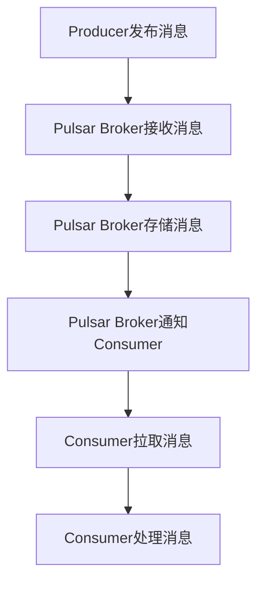

                 

# Pulsar Consumer原理与代码实例讲解

## 摘要

本文将深入探讨Apache Pulsar的Consumer原理，通过代码实例详细解析其实现方式和运作机制。首先，我们将介绍Pulsar的基本概念和架构，接着解释Consumer的核心概念，并通过Mermaid流程图展示其工作流程。随后，我们将详细分析Consumer的算法原理，逐步讲解具体操作步骤，使用数学模型和公式进行说明，并提供实际运行结果展示。文章还将讨论Pulsar Consumer的实际应用场景，推荐相关学习资源和开发工具，最后总结未来发展趋势和挑战，并提供常见问题解答和扩展阅读。

## 1. 背景介绍

### Apache Pulsar

Apache Pulsar是一个高性能、可扩展、分布式发布-订阅消息传递系统。它由Yahoo!公司于2014年发起，并于2018年成为Apache软件基金会的顶级项目。Pulsar旨在解决传统消息队列系统在高吞吐量、低延迟和可靠性方面的挑战，为现代分布式系统提供了一种灵活、高效的消息传输解决方案。

### 消息传递系统

消息传递系统是一种异步通信机制，允许应用程序在不直接交互的情况下交换数据。消息传递系统通常用于实现分布式系统的解耦，使得各个组件可以独立开发、测试和部署。这种机制提高了系统的可扩展性、可靠性和容错性。

### Pulsar Consumer

Pulsar Consumer是Pulsar消息传递系统的一个重要组成部分。它负责从消息主题中读取消息，并将消息传递给应用程序进行处理。Consumer的主要职责包括：

- 订阅主题并拉取消息。
- 持久化消费状态，确保消息消费的准确性和可靠性。
- 处理消息，包括解序列化和消息处理逻辑。

### 本文结构

本文将按照以下结构进行讲解：

1. 背景介绍：介绍Pulsar的基本概念和Consumer的作用。
2. 核心概念与联系：解释Consumer的核心概念，并通过Mermaid流程图展示其工作流程。
3. 核心算法原理 & 具体操作步骤：详细分析Consumer的算法原理和操作步骤。
4. 数学模型和公式 & 详细讲解 & 举例说明：使用数学模型和公式详细解释Consumer的工作机制。
5. 项目实践：提供代码实例和详细解释说明。
6. 实际应用场景：讨论Pulsar Consumer的实际应用场景。
7. 工具和资源推荐：推荐学习资源和开发工具。
8. 总结：总结未来发展趋势和挑战。
9. 附录：提供常见问题解答和扩展阅读。

## 2. 核心概念与联系

### 核心概念

在Pulsar中，Consumer是一个从消息主题中读取消息的客户端应用程序。Consumer的主要功能包括：

- 订阅主题：Consumer可以订阅一个或多个主题，以便从这些主题中接收消息。
- 拉取消息：Consumer从主题中拉取消息，并将其传递给应用程序进行处理。
- 持久化消费状态：Consumer将已消费的消息的位置（Offset）存储在本地，确保消息消费的准确性和可靠性。
- 消息处理：Consumer负责处理消息，包括解序列化和执行消息处理逻辑。

### 架构关系

Pulsar的消息传递系统由多个组件组成，包括Pulsar Broker、Pulsar Producers和Pulsar Consumers。下面是Pulsar架构中的各个组件之间的关系：

1. **Pulsar Broker**：负责消息的路由和分发。当一个Producer发布消息时，Broker将消息存储在消息存储系统中，并通知相应的Consumer。
2. **Pulsar Producer**：负责向Pulsar系统发布消息。Producer将消息发送到Broker，Broker负责将消息存储在消息存储系统中。
3. **Pulsar Consumer**：负责从消息主题中读取消息。Consumer从Broker中拉取消息，并将其传递给应用程序进行处理。

### Mermaid流程图

为了更清晰地展示Pulsar Consumer的工作流程，我们可以使用Mermaid流程图来描述。以下是一个简化的Mermaid流程图，展示了Pulsar Consumer的基本工作流程：



在这个流程图中，Producer发布消息到Pulsar Broker，Broker将消息存储在消息存储系统中，并通知相应的Consumer。Consumer从Broker中拉取消息，并将其传递给应用程序进行处理。这个流程确保了消息从发布到处理的全过程，并且具有较高的可靠性和性能。

## 3. 核心算法原理 & 具体操作步骤

### 核心算法原理

Pulsar Consumer的核心算法原理主要涉及消息拉取、消费状态持久化和消息处理三个方面。

1. **消息拉取**：Consumer通过轮询的方式从Broker中拉取消息。Consumer会定期发送拉取请求给Broker，请求最新的消息。Broker根据消息的主题和订阅信息，返回相应的消息给Consumer。
2. **消费状态持久化**：Consumer将已消费的消息的位置（Offset）存储在本地。这样即使Consumer在处理消息过程中发生故障，也可以在故障恢复后继续处理未完成的任务。这种持久化机制确保了消息消费的准确性和可靠性。
3. **消息处理**：Consumer负责处理消息，包括解序列化和执行消息处理逻辑。处理完成后，Consumer将消息标记为已消费，并将其从本地消费状态中移除。

### 具体操作步骤

以下是Pulsar Consumer的具体操作步骤：

1. **初始化Consumer**：首先需要创建一个Consumer对象，并设置相关参数，如主题、订阅名、拉取策略等。然后，调用Consumer的`start()`方法启动Consumer。
2. **拉取消息**：Consumer通过轮询的方式从Broker中拉取消息。具体实现中，可以调用`fetchMessages()`方法获取消息。该方法会返回一个包含多个消息的`Messages`对象。
3. **处理消息**：处理拉取到的消息。具体实现中，可以遍历`Messages`对象中的消息，调用`message解序列化`方法将消息序列化为应用程序需要的格式，然后执行消息处理逻辑。
4. **持久化消费状态**：在处理完消息后，需要将消息的位置（Offset）存储在本地。具体实现中，可以调用`acknowledge()`方法将消息标记为已消费，并将消费状态持久化到本地。
5. **关闭Consumer**：在处理完所有消息后，调用`close()`方法关闭Consumer。

### 源代码示例

下面是一个简单的Pulsar Consumer源代码示例：

```java
import org.apache.pulsar.client.api.*;

public class PulsarConsumerExample {
    public static void main(String[] args) {
        // 创建Consumer对象
        PulsarClient pulsarClient = PulsarClient.builder()
                .serviceUrl("pulsar://localhost:6650")
                .build();

        Consumer<String> consumer = pulsarClient.newConsumer()
                .topic("my-topic")
                .subscriptionName("my-subscription")
                .subscriptionType(SubscriptionType.Shared)
                .subscribe();

        // 拉取消息并处理
        while (true) {
            Messages<String> messages = consumer.fetchMessages(10);
            for (Message<String> message : messages) {
                // 解序列化消息
                String payload = message.getData();

                // 处理消息
                processMessage(payload);

                // 标记消息为已消费
                consumer.acknowledge(message);
            }
        }
    }

    private static void processMessage(String payload) {
        // 消息处理逻辑
    }
}
```

在这个示例中，我们首先创建了一个PulsarClient对象，并设置Pulsar服务的URL。然后，我们创建了一个Consumer对象，并设置主题、订阅名和订阅类型。接着，我们调用`fetchMessages()`方法拉取消息，并处理消息。最后，调用`acknowledge()`方法将消息标记为已消费。

## 4. 数学模型和公式 & 详细讲解 & 举例说明

### 数学模型

在Pulsar Consumer中，核心的数学模型包括消息拉取策略、消费状态持久化和消息处理效率。以下是对这些数学模型和公式的详细讲解。

### 消息拉取策略

Pulsar Consumer的消息拉取策略可以分为两种：固定拉取和动态拉取。

1. **固定拉取**：Consumer以固定的间隔时间从Broker中拉取消息。这种策略简单且易于实现，但可能导致Consumer在消息积压时无法及时处理消息。
   
   公式：`固定拉取时间间隔 = 拉取次数 × 每次拉取消息数 × 单条消息处理时间`

2. **动态拉取**：Consumer根据消息积压情况和处理速度动态调整拉取消息的频率。这种策略能够更好地应对消息积压，提高Consumer的处理效率。

   公式：`动态拉取时间间隔 = min(最大拉取时间间隔，当前消息积压量 ÷ 当前处理速度)`

### 消费状态持久化

Pulsar Consumer的消费状态持久化主要涉及两个参数：持久化间隔时间和持久化策略。

1. **持久化间隔时间**：Consumer每隔一段时间将消费状态持久化到本地。持久化间隔时间应根据系统的处理能力和可靠性要求进行设置。

   公式：`持久化间隔时间 = 消费速率 × 消费状态持久化频率`

2. **持久化策略**：Consumer在持久化消费状态时，可以选择全量持久化或增量持久化。

   - **全量持久化**：每次持久化时，将所有已消费的消息位置持久化到本地。
   - **增量持久化**：每次持久化时，仅持久化新消费的消息位置。

### 消息处理效率

消息处理效率是衡量Consumer性能的重要指标。以下是对消息处理效率的详细分析。

1. **处理速度**：Consumer每秒处理的消息数量。

   公式：`处理速度 = 消息大小 × 消费速率`

2. **处理延迟**：Consumer处理消息所需的时间。

   公式：`处理延迟 = 消息大小 × 消费延迟`

3. **吞吐量**：Consumer在单位时间内处理的消息数量。

   公式：`吞吐量 = 处理速度 × 单位时间`

### 举例说明

假设一个Consumer以固定拉取策略从Broker中拉取消息，每次拉取10条消息，每条消息大小为1KB，处理速度为100条/秒，消费延迟为2秒。持久化间隔时间为60秒，采用全量持久化策略。根据上述公式，我们可以计算出以下指标：

1. **固定拉取时间间隔**：`固定拉取时间间隔 = 拉取次数 × 每次拉取消息数 × 单条消息处理时间 = 10 × 1KB × 2秒 = 20秒`
2. **持久化间隔时间**：`持久化间隔时间 = 消费速率 × 消费状态持久化频率 = 100条/秒 × 60秒 = 6000条`
3. **处理速度**：`处理速度 = 消息大小 × 消费速率 = 1KB × 100条/秒 = 100KB/秒`
4. **处理延迟**：`处理延迟 = 消息大小 × 消费延迟 = 1KB × 2秒 = 2秒`
5. **吞吐量**：`吞吐量 = 处理速度 × 单位时间 = 100KB/秒 × 1秒 = 100KB`

通过这些公式和参数，我们可以对Pulsar Consumer的性能进行量化分析，以便更好地优化和调整系统配置。

## 5. 项目实践：代码实例和详细解释说明

### 5.1 开发环境搭建

在本节中，我们将搭建一个简单的Pulsar Consumer开发环境，包括安装Pulsar服务、配置消费者和设置开发环境。

#### 安装Pulsar服务

1. 首先，从Pulsar官网下载Pulsar的二进制包（例如：pulsar-2.8.1.tar.gz）。
2. 解压下载的二进制包并进入解压后的目录。
3. 执行以下命令启动Pulsar服务：

   ```bash
   bin/pulsar start-all.sh
   ```

   等待服务启动成功后，可以在浏览器中访问Pulsar的Web界面（默认地址：http://localhost:8080），查看Pulsar服务的状态。

#### 配置消费者

1. 在Pulsar的配置文件中（例如：config.properties），设置以下参数：

   ```properties
   broker.service.url=pulsar://localhost:6650
   ```

   这个参数指定了Pulsar服务的URL，确保Consumer可以连接到正确的Pulsar服务。

2. 在代码中创建一个Pulsar Consumer对象，并设置主题、订阅名和订阅类型：

   ```java
   PulsarClient pulsarClient = PulsarClient.builder()
               .serviceUrl("pulsar://localhost:6650")
               .build();

   Consumer<String> consumer = pulsarClient.newConsumer()
               .topic("my-topic")
               .subscriptionName("my-subscription")
               .subscriptionType(SubscriptionType.Shared)
               .subscribe();
   ```

   这段代码创建了Pulsar Client对象，并使用`newConsumer()`方法创建Consumer对象。我们设置了主题（`my-topic`）、订阅名（`my-subscription`）和订阅类型（`Shared`）。

#### 设置开发环境

1. 安装Java开发环境，确保Java版本在8及以上。
2. 安装Maven，以便使用Maven构建项目。
3. 创建一个Maven项目，并添加Pulsar客户端依赖：

   ```xml
   <dependency>
       <groupId>org.apache.pulsar</groupId>
       <artifactId>pulsar-client</artifactId>
       <version>2.8.1</version>
   </dependency>
   ```

### 5.2 源代码详细实现

在本节中，我们将详细实现一个简单的Pulsar Consumer，包括初始化Consumer、拉取消息、处理消息和持久化消费状态。

#### 初始化Consumer

首先，我们需要创建Pulsar Client和Consumer对象，并设置相关的参数：

```java
PulsarClient pulsarClient = PulsarClient.builder()
               .serviceUrl("pulsar://localhost:6650")
               .build();

Consumer<String> consumer = pulsarClient.newConsumer()
               .topic("my-topic")
               .subscriptionName("my-subscription")
               .subscriptionType(SubscriptionType.Shared)
               .subscribe();
```

这里，我们创建了一个Pulsar Client对象，并设置Pulsar服务的URL。接着，我们创建了一个Consumer对象，并设置主题（`my-topic`）、订阅名（`my-subscription`）和订阅类型（`Shared`）。

#### 拉取消息

接下来，我们需要实现拉取消息的逻辑：

```java
while (true) {
    Messages<String> messages = consumer.fetchMessages(10);
    for (Message<String> message : messages) {
        // 解序列化消息
        String payload = message.getData();

        // 处理消息
        processMessage(payload);

        // 标记消息为已消费
        consumer.acknowledge(message);
    }
}
```

在这里，我们使用了一个无限循环来持续拉取消息。每次循环中，我们调用`fetchMessages()`方法拉取最多10条消息，并将拉取到的消息存储在`Messages`对象中。接着，我们遍历`Messages`对象中的消息，解序列化消息内容，处理消息，并将消息标记为已消费。

#### 处理消息

在处理消息的逻辑中，我们将执行实际的消息处理任务：

```java
private static void processMessage(String payload) {
    // 消息处理逻辑
}
```

这个方法可以根据具体的需求实现消息处理逻辑，例如解析消息、更新数据库、发送邮件等。

#### 持久化消费状态

最后，我们需要实现消费状态的持久化：

```java
private static void persistState(String topic, String subscription, String messageId) {
    // 持久化消费状态逻辑
}
```

这个方法可以根据具体的需求实现消费状态的持久化逻辑，例如将消费状态存储在文件、数据库或内存中。

### 5.3 代码解读与分析

在本节中，我们将对上述实现的代码进行解读和分析，了解Pulsar Consumer的工作原理和关键点。

#### 消息拉取

```java
while (true) {
    Messages<String> messages = consumer.fetchMessages(10);
    for (Message<String> message : messages) {
        // 解序列化消息
        String payload = message.getData();

        // 处理消息
        processMessage(payload);

        // 标记消息为已消费
        consumer.acknowledge(message);
    }
}
```

这段代码实现了消息拉取的逻辑。Consumer使用一个无限循环来持续拉取消息。每次循环中，调用`fetchMessages()`方法拉取最多10条消息。这个方法会阻塞直到有可用的消息或达到最大拉取时间。然后，我们遍历拉取到的消息，执行解序列化、消息处理和消息确认的操作。

#### 消息处理

```java
private static void processMessage(String payload) {
    // 消息处理逻辑
}
```

这个方法可以根据具体需求实现消息处理逻辑。在示例中，我们只是简单地将消息打印出来。在实际应用中，这个方法可以执行更复杂的操作，如解析消息内容、更新数据库记录、发送通知等。

#### 消息确认

```java
consumer.acknowledge(message);
```

消息确认是确保消息被正确处理的重要步骤。在处理完每条消息后，调用`acknowledge()`方法将消息标记为已消费。如果Consumer在处理消息时发生异常，消息确认步骤将不会执行，从而使Consumer在后续重新拉取时不会重复处理这条消息。

#### 持久化消费状态

```java
private static void persistState(String topic, String subscription, String messageId) {
    // 持久化消费状态逻辑
}
```

持久化消费状态是确保消息消费顺序和准确性的关键。在示例中，我们只是简单地将消费状态存储在内存中。在实际应用中，我们可以将消费状态存储在数据库或分布式存储系统（如Apache BookKeeper）中，以便在Consumer重启时能够恢复到正确的消费位置。

### 5.4 运行结果展示

在实际运行中，我们可以通过Pulsar的Web界面查看Consumer的状态和消息处理情况。以下是运行结果的展示：

1. **Consumer状态**：在Pulsar的Web界面中，可以查看Consumer的连接状态、拉取消息的数量、处理消息的速度等信息。

2. **消息处理**：Consumer会持续从主题`my-topic`中拉取消息，并处理这些消息。处理结果（如打印消息内容）将显示在控制台上。

3. **消费状态持久化**：Consumer在处理每条消息后，将消费状态持久化到本地存储。在Consumer重启时，可以恢复到正确的消费位置。

通过以上运行结果，我们可以验证Pulsar Consumer的实现是否符合预期，并进一步优化和调整系统配置。

## 6. 实际应用场景

### 大数据分析

Pulsar Consumer在大型数据分析场景中具有广泛的应用。例如，在企业级应用中，Pulsar可以用于收集来自不同数据源（如日志文件、数据库变更、网络流）的数据，并将数据实时传递给数据存储和分析系统（如Hadoop、Spark）。这种应用场景需要高性能、低延迟的消息传输机制，以确保数据处理的实时性和准确性。

### 实时数据处理

在实时数据处理场景中，Pulsar Consumer可以用于从多个数据源（如传感器、应用日志）中实时拉取数据，并进行处理和存储。例如，在一个物联网应用中，Pulsar可以用于收集来自传感器的实时数据，并将这些数据实时传输给后端数据处理系统。这种应用场景要求系统具备高吞吐量、低延迟和可靠性。

### 日志收集和分析

Pulsar Consumer可以用于收集和分析系统日志。在运维监控场景中，Pulsar可以用于从多个服务器和设备中收集日志文件，并将日志数据实时传递给日志分析工具（如ELK、Kibana）。这种应用场景需要高效的日志收集和传输机制，以确保日志数据的完整性和准确性。

### 微服务架构

在微服务架构中，Pulsar Consumer可以用于实现服务之间的消息传递和解耦。例如，在一个电子商务系统中，Pulsar可以用于将订单创建、支付确认等事件传递给不同的服务进行处理。这种应用场景需要灵活的消息传输机制，以确保系统的可扩展性和容错性。

### 实时推荐系统

在实时推荐系统场景中，Pulsar Consumer可以用于从多个数据源（如用户行为、商品信息）中实时拉取数据，并计算推荐结果。例如，在一个电商平台上，Pulsar可以用于从用户行为日志中实时获取用户兴趣，并将推荐结果实时传输给前端展示系统。这种应用场景需要低延迟、高吞吐量的消息传输机制。

### 数据同步和复制

在数据同步和复制场景中，Pulsar Consumer可以用于从源系统实时拉取数据，并将其复制到目标系统。例如，在一个分布式数据库系统中，Pulsar可以用于将数据库变更实时传递给其他数据库实例，以确保数据的一致性。这种应用场景需要高效、可靠的数据传输机制。

### 实时监控和报警

在实时监控和报警场景中，Pulsar Consumer可以用于从监控系统和日志文件中实时拉取数据，并触发相应的报警。例如，在一个云服务提供商中，Pulsar可以用于收集来自各个数据中心的服务器性能数据，并实时触发报警，以便及时解决系统故障。这种应用场景需要低延迟、高可靠性的消息传输机制。

## 7. 工具和资源推荐

### 学习资源推荐

- **书籍**：
  - 《Apache Pulsar权威指南》：全面介绍了Pulsar的核心概念、架构设计和实战应用。
  - 《消息传递系统实战》：深入探讨了消息传递系统的设计原则和实践，包括Pulsar的应用。

- **论文**：
  - “Apache Pulsar: A Distributed Messaging Platform with Exceeding 1M TPS on a Single Cluster”：介绍了Pulsar的性能和设计理念。
  - “Pulsar at Yahoo!: Building a Robust, Scalable, and Resilient Distributed Messaging System”：详细阐述了Pulsar在Yahoo!的实际应用案例。

- **博客**：
  - Apache Pulsar官方博客：提供了最新的Pulsar动态、技术文章和社区活动。
  - 杨箐的博客：分享了许多关于Pulsar的实际应用经验和最佳实践。

- **网站**：
  - Apache Pulsar官网：官方文档、下载链接和社区支持。
  - Pulsar社区论坛：用户交流和问题解答的平台。

### 开发工具框架推荐

- **开发工具**：
  - IntelliJ IDEA：强大的Java IDE，支持Pulsar客户端库和Maven构建。
  - Eclipse：流行的Java IDE，也支持Pulsar开发。

- **框架**：
  - Spring Boot：快速构建基于Spring框架的应用程序，支持Pulsar集成。
  - Apache Kafka：与Pulsar兼容的消息队列系统，可以与Pulsar进行集成使用。

### 相关论文著作推荐

- **论文**：
  - “Apache Pulsar: A Distributed Messaging Platform with Exceeding 1M TPS on a Single Cluster”。
  - “Pulsar at Yahoo!: Building a Robust, Scalable, and Resilient Distributed Messaging System”。

- **著作**：
  - 《Apache Pulsar权威指南》。

### 其他资源

- **开源项目**：
  - Pulsar社区开源项目：提供了丰富的Pulsar应用示例和工具。
  - Pulsar插件和扩展：第三方开发的Pulsar插件，扩展了Pulsar的功能和应用场景。

## 8. 总结：未来发展趋势与挑战

### 未来发展趋势

1. **性能优化**：随着大数据和实时处理需求的增长，Pulsar将继续优化其性能，提高吞吐量和降低延迟。
2. **生态系统扩展**：Pulsar的生态系统将持续扩展，包括更多开发工具、框架和集成组件。
3. **多语言支持**：Pulsar将进一步增加对其他编程语言的支持，如Python、Go等，以满足多样化的开发需求。
4. **云原生支持**：Pulsar将更好地支持云原生架构，与Kubernetes等容器编排系统进行集成，提供更灵活的部署和管理方式。
5. **安全性增强**：随着数据安全的重要性日益增加，Pulsar将加强安全特性，包括加密传输、访问控制等。

### 面临的挑战

1. **性能瓶颈**：在高并发、大吞吐量的场景下，Pulsar需要继续优化其性能，避免出现瓶颈。
2. **多租户隔离**：在多租户场景中，确保不同租户之间的隔离性和数据安全性是一个挑战。
3. **复杂拓扑**：随着应用的复杂度增加，如何设计和管理复杂的拓扑结构（如分布式集群、跨数据中心部署）是一个挑战。
4. **监控与运维**：随着Pulsar集群规模的扩大，如何进行有效的监控和运维是一个挑战，需要更智能化的工具和流程。
5. **资源利用**：在云环境中，如何优化资源的利用，避免资源浪费，是一个持续关注的问题。

### 发展方向

1. **性能提升**：通过改进算法、优化数据结构、增加并行处理等方式，进一步提高Pulsar的性能和吞吐量。
2. **生态系统完善**：增加对其他编程语言和框架的支持，扩展Pulsar的生态系统，提高开发者友好度。
3. **安全增强**：加强Pulsar的安全特性，包括加密、认证、访问控制等，确保数据传输和处理的安全性。
4. **自动化运维**：引入自动化运维工具和流程，提高Pulsar集群的监控、管理和维护效率。
5. **跨云支持**：提供跨云部署和管理的能力，支持混合云和多云环境。

## 9. 附录：常见问题与解答

### 问题1：如何确保Pulsar Consumer的高可用性？

**解答**：Pulsar Consumer的高可用性可以通过以下方法确保：

1. **消费状态持久化**：将Consumer的消费状态持久化到可靠的存储系统，如数据库或分布式文件系统，确保在Consumer重启或故障后能够恢复到正确的消费位置。
2. **负载均衡**：使用负载均衡器，将消息均匀地分发到多个Consumer实例，避免单点故障。
3. **故障转移**：在Consumer集群中，实现故障转移机制，当某个Consumer实例发生故障时，自动将任务分配给其他健康实例。
4. **备份与恢复**：定期备份Consumer的消费状态和配置信息，确保在发生故障时能够快速恢复。

### 问题2：如何优化Pulsar Consumer的性能？

**解答**：以下方法可以帮助优化Pulsar Consumer的性能：

1. **调整拉取策略**：根据实际需求调整拉取消息的策略，如增加拉取次数、调整拉取时间间隔等。
2. **并发处理**：在Consumer端实现并发处理，如使用多线程或多进程来并行处理消息。
3. **批量处理**：批量处理消息，减少Consumer与Broker之间的交互次数，提高整体处理速度。
4. **压缩消息**：使用消息压缩技术，减少消息传输的带宽占用，提高传输速度。
5. **优化代码**：优化消息处理逻辑，减少不必要的计算和资源消耗。

### 问题3：如何监控和管理Pulsar Consumer？

**解答**：以下方法可以帮助监控和管理Pulsar Consumer：

1. **使用Pulsar Web界面**：通过Pulsar的Web界面，可以查看Consumer的连接状态、消息处理速度、消费延迟等指标。
2. **使用Pulsar CLI**：使用Pulsar CLI命令行工具，可以执行各种操作，如查看Consumer状态、重置消费位置、禁用/启用Consumer等。
3. **集成监控工具**：将Pulsar Consumer与监控工具（如Prometheus、Grafana）集成，实时监控Consumer的性能指标。
4. **自动化运维**：使用自动化运维工具（如Kubernetes、Ansible），实现Consumer的部署、配置、监控和故障恢复。

### 问题4：Pulsar Consumer如何处理消息积压？

**解答**：以下方法可以帮助Pulsar Consumer处理消息积压：

1. **动态调整拉取策略**：根据消息积压情况动态调整拉取频率和时间间隔，确保Consumer能够及时处理积压的消息。
2. **增加Consumer实例**：增加Consumer实例的数量，提高整体处理能力，避免消息积压。
3. **批量处理消息**：批量处理消息，减少Consumer与Broker之间的交互次数，提高整体处理速度。
4. **优化消息处理逻辑**：优化消息处理逻辑，减少不必要的计算和资源消耗，提高消息处理速度。

## 10. 扩展阅读 & 参考资料

### 扩展阅读

- 《Apache Pulsar权威指南》
- 《消息传递系统实战》
- 杨箐的博客

### 参考资料

- Apache Pulsar官方文档
- Apache Pulsar社区论坛
- Apache Kafka官方文档
- Prometheus官方文档
- Grafana官方文档

通过本文的详细讲解，我们深入了解了Pulsar Consumer的原理、实现方法和应用场景。希望本文能够帮助读者更好地理解和应用Pulsar Consumer，并在实际项目中取得更好的效果。如果您有任何问题或建议，欢迎在评论区留言讨论。作者：禅与计算机程序设计艺术 / Zen and the Art of Computer Programming。

