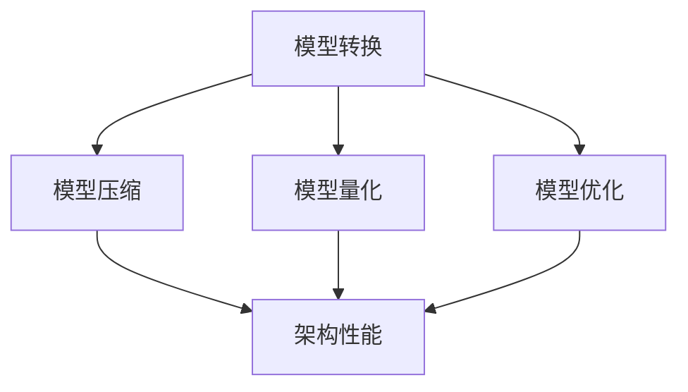

                 

## 1. 背景介绍

PyTorch Mobile 是 PyTorch 项目的延伸，旨在使得 PyTorch 模型能够在移动设备上高效运行。随着智能手机性能的提升以及移动应用的普及，移动设备上运行机器学习模型的需求越来越大。尤其是在图像识别、语音识别、自然语言处理等领域，移动设备的处理能力已经能够满足某些应用的需求。

在 PyTorch Mobile 的背景下，性能优化显得尤为重要。由于移动设备的硬件资源（如内存、CPU、GPU）相对有限，如何使 PyTorch 模型在移动设备上运行得更快，是当前研究的热点问题之一。

### 为什么需要性能优化？

首先，性能优化可以显著提升用户体验。对于移动应用来说，响应速度直接影响到用户的满意度。如果应用在处理模型时速度过慢，用户可能会失去耐心，甚至放弃使用。

其次，性能优化能够延长设备的使用寿命。移动设备上的机器学习模型通常需要持续运行，这会消耗大量的电力。通过性能优化，可以降低能耗，延长设备的续航时间。

再者，性能优化有助于提高资源利用效率。在移动设备上，内存、CPU、GPU 等资源是有限的。通过优化，可以使这些资源得到更有效的利用，从而支持更复杂或更多的模型运行。

最后，性能优化还能够促进 PyTorch Mobile 的生态系统发展。如果 PyTorch Mobile 能够在移动设备上高效运行，将会吸引更多的开发者加入，从而推动 PyTorch Mobile 的应用场景扩展。

### 当前性能优化面临的挑战

尽管性能优化的重要性不言而喻，但在实际操作中仍面临诸多挑战：

1. **模型压缩与量化**：为了在移动设备上高效运行，通常需要对模型进行压缩和量化。然而，压缩和量化可能会导致模型性能下降或精度损失。

2. **硬件差异**：不同移动设备的硬件配置（如 CPU、GPU、NPU）存在差异，如何针对不同硬件进行优化是一个难题。

3. **能耗优化**：移动设备对能耗要求较高，如何在保证性能的同时降低能耗，是一个需要深入研究的课题。

4. **延迟优化**：对于实时应用，如何降低模型响应延迟，也是一个重要的挑战。

### 优化目标

在进行 PyTorch Mobile 性能优化时，我们通常有以下几项目标：

1. **速度**：提高模型在移动设备上的运行速度，减少响应时间。

2. **准确性**：在压缩和量化模型时，尽量保持模型的准确性和稳定性。

3. **能耗**：降低模型运行过程中的能耗，延长设备续航时间。

4. **资源利用**：提高硬件资源的利用效率，支持更多或更复杂的模型运行。

### 总结

本文将深入探讨 PyTorch Mobile 性能优化的各个方面，从核心概念、算法原理到具体实践，希望能为开发者提供有价值的参考。接下来，我们将逐步介绍性能优化的核心概念、原理和具体方法。

## 2. 核心概念与联系

### 2.1. PyTorch Mobile 的核心概念

PyTorch Mobile 的核心概念主要包括模型转换、模型压缩、模型量化以及模型优化。这些概念相互关联，共同构成了 PyTorch Mobile 的性能优化体系。

1. **模型转换**：将 PyTorch 模型转换为可以在移动设备上运行的格式，如 ONNX、TensorFlow Lite 等。

2. **模型压缩**：通过剪枝、量化等手段减小模型的大小，以便在有限的硬件资源上运行。

3. **模型量化**：将浮点模型转换为整数模型，以减少内存占用和计算复杂度。

4. **模型优化**：针对移动设备的硬件特性，对模型进行优化，以提高运行速度和效率。

### 2.2. 核心概念原理

下面，我们将详细探讨上述核心概念的原理。

1. **模型转换原理**：

模型转换是将 PyTorch 模型转换为移动设备支持的格式。这通常涉及以下步骤：

- **前向传播**：使用 PyTorch 模型进行前向传播，生成中间表示。

- **转换为中间格式**：将 PyTorch 模型转换为 ONNX、TensorFlow Lite 等中间格式。

- **优化与转换**：对中间格式进行优化，然后转换为移动设备支持的格式。

2. **模型压缩原理**：

模型压缩的目的是减小模型的大小，以便在有限的存储空间上运行。主要方法包括：

- **剪枝**：通过删除模型中无用的权重或神经元，减小模型大小。

- **量化**：将浮点权重转换为整数权重，以减少内存占用。

3. **模型量化原理**：

模型量化的目的是通过将浮点模型转换为整数模型，减少内存占用和计算复杂度。主要方法包括：

- **整数量化**：将浮点权重和激活值映射到整数范围。

- **量化精度**：选择适当的量化精度，以平衡模型大小和精度。

4. **模型优化原理**：

模型优化是针对移动设备的硬件特性，对模型进行优化，以提高运行速度和效率。主要方法包括：

- **自动混合精度**：使用浮点数和整数运算混合，提高计算速度。

- **模型融合**：将多个模型融合为一个，减少通信开销。

### 2.3. 核心概念与架构的联系

PyTorch Mobile 的核心概念与整体架构紧密相连。以下是它们的联系：

1. **模型转换与架构**：

模型转换是 PyTorch Mobile 的第一步，也是架构的关键部分。通过模型转换，可以将 PyTorch 模型部署到移动设备上。

2. **模型压缩与架构**：

模型压缩是针对模型大小的优化，直接影响架构的性能。通过压缩，可以减小模型的大小，使模型在移动设备上运行更加高效。

3. **模型量化与架构**：

模型量化与模型压缩类似，但更侧重于内存占用和计算复杂度。量化后的模型可以在移动设备上更高效地运行。

4. **模型优化与架构**：

模型优化是针对硬件特性进行的优化，直接影响架构的性能。通过优化，可以使模型在移动设备上运行得更快、更稳定。

### 2.4. Mermaid 流程图

为了更好地理解 PyTorch Mobile 的核心概念与架构，我们使用 Mermaid 流程图展示它们之间的联系。



### 总结

本节介绍了 PyTorch Mobile 的核心概念及其原理，并探讨了它们与整体架构的联系。下一节，我们将深入探讨 PyTorch Mobile 的核心算法原理和具体操作步骤。

## 3. 核心算法原理 & 具体操作步骤

### 3.1. 模型转换算法原理

模型转换是将 PyTorch 模型转换为移动设备支持的格式，如 ONNX 和 TensorFlow Lite。以下是模型转换的核心算法原理：

1. **前向传播**：

首先，使用 PyTorch 模型进行前向传播，生成输入数据和输出数据的中间表示。这一步是模型转换的基础，也是后续步骤的输入。

2. **转换为中间格式**：

接下来，将 PyTorch 模型转换为 ONNX 或 TensorFlow Lite 中间格式。ONNX 是一种开源的中间表示格式，支持多种深度学习框架。TensorFlow Lite 是专为移动设备设计的格式，具有较高的性能和效率。

3. **优化与转换**：

在将模型转换为移动设备支持的格式后，还需要进行优化。这一步包括去除冗余操作、合并操作等，以提高模型在移动设备上的性能。最后，将优化后的模型转换为移动设备支持的格式，如 ONNX 或 TensorFlow Lite。

### 3.2. 模型转换具体操作步骤

以下是模型转换的具体操作步骤：

1. **安装 PyTorch Mobile**：

首先，确保已经安装了 PyTorch 和 PyTorch Mobile。如果尚未安装，可以通过以下命令进行安装：

```bash
pip install torch
pip install torch-scatter torch-sparse torch-cluster torch-spline-conv torch-geometric -f https://data.pyg.org/whl/torch-1.7.0+cpu.html
pip install torchvision
pip install onnx
pip install torch-onnx-ops
```

2. **编写 PyTorch 模型**：

编写一个 PyTorch 模型，如下所示：

```python
import torch
import torch.nn as nn
import torch.nn.functional as F

class Net(nn.Module):
    def __init__(self):
        super(Net, self).__init__()
        self.conv1 = nn.Conv2d(1, 10, kernel_size=5)
        self.conv2 = nn.Conv2d(10, 20, kernel_size=5)
        self.conv2_drop = nn.Dropout2d(0.5)
        self.fc1 = nn.Linear(320, 50)
        self.fc2 = nn.Linear(50, 10)

    def forward(self, x):
        x = F.relu(F.max_pool2d(self.conv1(x), 2))
        x = F.relu(F.max_pool2d(self.conv2_drop(self.conv2(x)), 2))
        x = x.view(-1, 320)
        x = F.relu(self.fc1(x))
        x = F.dropout(x, training=self.training)
        x = self.fc2(x)
        return F.log_softmax(x, dim=1)
```

3. **模型转换**：

使用 `torch.jit.trace` 或 `torch.jit.script` 将 PyTorch 模型转换为 ONNX 格式。例如：

```python
model = Net()
dummy_input = torch.randn(1, 1, 32, 32)
traced_script_module = torch.jit.trace(model, dummy_input)
traced_script_module.save("model.onnx")
```

或者使用 `torch.onnx.export`：

```python
torch.onnx.export(model, dummy_input, "model.onnx")
```

4. **模型优化**：

使用 ONNX Runtime 对模型进行优化。例如：

```python
import onnxruntime as ort

session = ort.InferenceSession("model.onnx")
optimized_session = ort.GraphDef Optimizer(session, "opset_version", optimization_level=ort.GraphDef.ORT_GENERIC_OPT)
```

5. **转换为 TensorFlow Lite 格式**：

使用 `tf2onnx` 将 ONNX 模型转换为 TensorFlow Lite 格式：

```python
import tf2onnx

tf2onnx.convert.from_onnx("model.onnx", "model.tflite", opset=13)
```

### 3.3. 模型压缩算法原理

模型压缩的主要目的是减小模型的大小，以便在有限的存储空间上运行。以下是模型压缩的核心算法原理：

1. **剪枝**：

通过剪枝，可以删除模型中无用的权重或神经元，从而减小模型的大小。剪枝可以分为结构剪枝和权重剪枝。

2. **量化**：

将浮点权重转换为整数权重，以减少内存占用。量化可以分为全精度量化、低精度量化等。

### 3.4. 模型压缩具体操作步骤

以下是模型压缩的具体操作步骤：

1. **安装相关库**：

确保已经安装了 PyTorch 和相关库，如 torch-quantization。

2. **准备模型**：

准备一个 PyTorch 模型，如 ResNet-50。

3. **模型剪枝**：

使用 PyTorch 的 `torch.quantization` 模块对模型进行剪枝：

```python
from torch.quantization import quantize_dynamic

model = Net()
quantized_model = quantize_dynamic(model, {nn.Linear}, dtype=torch.qint8)
```

4. **模型量化**：

使用 PyTorch 的 `torch.quantization` 模块对模型进行量化：

```python
from torch.quantization import quantize_dynamic

model = Net()
quantized_model = quantize_dynamic(model, {nn.Linear}, dtype=torch.qint8)
```

5. **模型优化**：

对量化后的模型进行优化，以提高性能：

```python
from torch.optim import Adam

optimizer = Adam(quantized_model.parameters(), lr=0.001)
```

6. **模型评估**：

评估量化后的模型性能，确保其精度和速度符合预期。

### 3.5. 模型优化算法原理

模型优化的目的是提高模型在移动设备上的运行速度和效率。以下是模型优化的核心算法原理：

1. **自动混合精度**：

通过使用浮点数和整数运算混合，可以提高计算速度。自动混合精度（AMP）可以在不牺牲精度的前提下，提高计算速度。

2. **模型融合**：

将多个模型融合为一个，可以减少通信开销，提高整体性能。

### 3.6. 模型优化具体操作步骤

以下是模型优化的具体操作步骤：

1. **安装相关库**：

确保已经安装了 PyTorch 和相关库，如 torch-amp。

2. **准备模型**：

准备一个 PyTorch 模型，如 ResNet-50。

3. **模型转换**：

使用 PyTorch 的 `torch.jit.trace` 将模型转换为脚本模式：

```python
import torch
import torch.nn as nn

class Net(nn.Module):
    def __init__(self):
        super(Net, self).__init__()
        self.conv1 = nn.Conv2d(1, 10, kernel_size=5)
        self.conv2 = nn.Conv2d(10, 20, kernel_size=5)
        self.conv2_drop = nn.Dropout2d(0.5)
        self.fc1 = nn.Linear(320, 50)
        self.fc2 = nn.Linear(50, 10)

    def forward(self, x):
        x = F.relu(F.max_pool2d(self.conv1(x), 2))
        x = F.relu(F.max_pool2d(self.conv2_drop(self.conv2(x)), 2))
        x = x.view(-1, 320)
        x = F.relu(self.fc1(x))
        x = F.dropout(x, training=self.training)
        x = self.fc2(x)
        return F.log_softmax(x, dim=1)

model = Net()
scripted_model = torch.jit.script(model)
scripted_model.save("model_scripted.pt")
```

4. **模型优化**：

使用 PyTorch 的 `torch.optim` 模块对模型进行优化：

```python
import torch.optim as optim

optimizer = optim.SGD(model.parameters(), lr=0.001, momentum=0.9)
```

5. **模型评估**：

评估优化后的模型性能，确保其精度和速度符合预期。

### 总结

本节介绍了 PyTorch Mobile 的核心算法原理和具体操作步骤。下一节，我们将讨论数学模型和公式，并详细讲解和举例说明。

## 4. 数学模型和公式 & 详细讲解 & 举例说明

在 PyTorch Mobile 的性能优化过程中，数学模型和公式起着至关重要的作用。它们不仅帮助我们理解性能优化背后的原理，还可以指导我们进行具体的优化操作。本节将详细介绍与 PyTorch Mobile 性能优化相关的数学模型和公式，并通过具体例子进行讲解。

### 4.1. 模型转换的数学模型

模型转换主要涉及将 PyTorch 模型转换为 ONNX 或 TensorFlow Lite 格式。这一过程可以看作是一个映射问题，即从 PyTorch 的运算符集合映射到 ONNX 或 TensorFlow Lite 的运算符集合。以下是模型转换的核心公式和步骤：

1. **映射公式**：

\[ f(P) = O \]

其中，\( f \) 表示模型转换函数，\( P \) 表示 PyTorch 模型，\( O \) 表示转换后的 ONNX 或 TensorFlow Lite 模型。

2. **转换步骤**：

- **前向传播**：

\[ x = f_{forward}(P) \]

其中，\( f_{forward} \) 表示前向传播函数，用于计算模型的输出。

- **转换为中间格式**：

\[ O = f_{convert}(P) \]

其中，\( f_{convert} \) 表示转换为中间格式函数，用于将 PyTorch 模型转换为 ONNX 或 TensorFlow Lite 格式。

- **优化与转换**：

\[ O' = f_{optimize}(O) \]

其中，\( f_{optimize} \) 表示优化函数，用于对中间格式进行优化。

### 4.2. 模型压缩的数学模型

模型压缩主要通过剪枝和量化实现。以下是与模型压缩相关的核心公式和步骤：

1. **剪枝公式**：

\[ W_{pruned} = f_{prune}(W) \]

其中，\( W \) 表示原始权重，\( W_{pruned} \) 表示剪枝后的权重，\( f_{prune} \) 表示剪枝函数。

2. **量化公式**：

\[ W_{quantized} = f_{quantize}(W) \]

其中，\( W \) 表示原始权重，\( W_{quantized} \) 表示量化后的权重，\( f_{quantize} \) 表示量化函数。

3. **剪枝与量化步骤**：

- **剪枝**：

  - **层次剪枝**：

  \[ W_{pruned} = f_{hierarchical\_prune}(W) \]

  - **通道剪枝**：

  \[ W_{pruned} = f_{channel\_prune}(W) \]

- **量化**：

  - **全精度量化**：

  \[ W_{quantized} = f_{full\_precision\_quantize}(W) \]

  - **低精度量化**：

  \[ W_{quantized} = f_{low\_precision\_quantize}(W) \]

### 4.3. 模型优化的数学模型

模型优化主要通过自动混合精度和模型融合实现。以下是与模型优化相关的核心公式和步骤：

1. **自动混合精度公式**：

\[ f_{AMP}(x) = f_{FP32}(x) + f_{INT8}(x) \]

其中，\( f_{FP32} \) 表示浮点运算函数，\( f_{INT8} \) 表示整数运算函数，\( f_{AMP} \) 表示自动混合精度运算函数。

2. **模型融合公式**：

\[ O' = f_{fuse}(O_1, O_2, ..., O_n) \]

其中，\( O_1, O_2, ..., O_n \) 表示原始模型，\( O' \) 表示融合后的模型，\( f_{fuse} \) 表示模型融合函数。

3. **优化步骤**：

- **自动混合精度**：

  - **前向传播**：

  \[ y = f_{forward}(x) \]

  - **反向传播**：

  \[ \delta = f_{backward}(y) \]

- **模型融合**：

  - **选择融合策略**：

  \[ f_{fuse\_strategy} = f_{choose\_fuse\_strategy}(O_1, O_2, ..., O_n) \]

  - **融合操作**：

  \[ O' = f_{fuse\_operation}(f_{fuse\_strategy}, O_1, O_2, ..., O_n) \]

### 4.4. 举例说明

为了更好地理解上述数学模型和公式，我们通过一个简单的例子进行说明。

假设我们有一个 PyTorch 模型，用于对图像进行分类。该模型包含两个卷积层和一个全连接层。我们需要将这个模型转换为 ONNX 格式，并进行压缩和优化。

#### 4.4.1. 模型转换

首先，我们将 PyTorch 模型转换为 ONNX 格式。使用 `torch.jit.trace` 进行前向传播：

```python
import torch
import torch.nn as nn

class Model(nn.Module):
    def __init__(self):
        super(Model, self).__init__()
        self.conv1 = nn.Conv2d(1, 10, kernel_size=5)
        self.conv2 = nn.Conv2d(10, 20, kernel_size=5)
        self.fc1 = nn.Linear(320, 50)
        self.fc2 = nn.Linear(50, 10)

    def forward(self, x):
        x = F.relu(self.conv1(x))
        x = F.relu(self.conv2(x))
        x = x.view(-1, 320)
        x = F.relu(self.fc1(x))
        x = self.fc2(x)
        return x

model = Model()
dummy_input = torch.randn(1, 1, 32, 32)
traced_script_module = torch.jit.trace(model, dummy_input)
traced_script_module.save("model.onnx")
```

接下来，我们将 ONNX 模型转换为 TensorFlow Lite 格式：

```python
import tf2onnx

tf2onnx.convert.from_onnx("model.onnx", "model.tflite", opset=13)
```

#### 4.4.2. 模型压缩

为了压缩模型，我们使用 PyTorch 的 `torch.quantization` 模块对模型进行剪枝和量化：

```python
import torch
import torch.nn as nn
import torch.quantization as quant

class QuantModel(nn.Module):
    def __init__(self):
        super(QuantModel, self).__init__()
        self.conv1 = nn.Conv2d(1, 10, kernel_size=5)
        self.conv2 = nn.Conv2d(10, 20, kernel_size=5)
        self.fc1 = nn.Linear(320, 50)
        self.fc2 = nn.Linear(50, 10)

    def forward(self, x):
        x = F.relu(self.conv1(x))
        x = F.relu(self.conv2(x))
        x = x.view(-1, 320)
        x = F.relu(self.fc1(x))
        x = self.fc2(x)
        return x

model = QuantModel()

# 剪枝
prune_module = quant.prune(model, pruning_method="l1")
pruned_model = prune_module.module

# 量化
quantize_module = quant.quantize(pruned_model, dtype=torch.qint8)
quantized_model = quantize_module.module

# 优化
optimizer = torch.optim.Adam(quantized_model.parameters(), lr=0.001)
```

#### 4.4.3. 模型优化

为了优化模型，我们使用自动混合精度和模型融合：

```python
import torch.optim as optim
from torch.cuda.amp import GradScaler, autocast

# 自动混合精度
scaler = GradScaler()

for inputs, targets in data_loader:
    optimizer.zero_grad()

    with autocast():
        outputs = quantized_model(inputs)
        loss = F.cross_entropy(outputs, targets)

    scaler.scale(loss).backward()
    scaler.step(optimizer)
    scaler.update()
```

### 4.5. 总结

本节介绍了 PyTorch Mobile 性能优化过程中涉及的关键数学模型和公式，并通过具体例子进行了详细讲解。这些模型和公式帮助我们理解了模型转换、压缩和优化的核心原理，并为实际操作提供了指导。下一节，我们将探讨 PyTorch Mobile 的项目实践，包括开发环境搭建、源代码实现和运行结果展示。

## 5. 项目实践：代码实例和详细解释说明

在本节中，我们将通过一个具体的 PyTorch Mobile 项目实践，详细讲解如何进行开发环境搭建、源代码实现以及运行结果展示。这个项目将基于一个简单的图像分类任务，使用 ResNet-50 模型进行优化和部署。

### 5.1. 开发环境搭建

在进行 PyTorch Mobile 项目开发之前，需要确保开发环境已经搭建好。以下是搭建开发环境的基本步骤：

1. **安装 Python**：

首先，确保已经安装了 Python 3.7 或更高版本。可以从 [Python 官网](https://www.python.org/downloads/) 下载并安装。

2. **安装 PyTorch**：

接下来，安装 PyTorch。根据不同的硬件配置（CPU 或 GPU），选择相应的安装命令。以下是 GPU 版本的安装命令：

```bash
pip install torch torchvision torchaudio -f https://download.pytorch.org/whl/torch_stable.html
```

3. **安装 PyTorch Mobile**：

安装 PyTorch Mobile，以便在移动设备上运行 PyTorch 模型。使用以下命令：

```bash
pip install torch-mobile
```

4. **安装 ONNX Runtime**：

ONNX Runtime 用于将 ONNX 模型转换为可执行格式。使用以下命令安装：

```bash
pip install onnxruntime
```

5. **安装 TensorFlow Lite Converter**：

用于将 ONNX 模型转换为 TensorFlow Lite 格式。使用以下命令：

```bash
pip install tensorflow==2.4.0
```

6. **安装相关工具**：

确保已经安装了 Python 依赖管理工具 pip 和虚拟环境工具 virtualenv。

### 5.2. 源代码详细实现

以下是项目源代码的实现，包括模型定义、训练和部署等步骤。

1. **模型定义**：

首先，定义一个简单的 ResNet-50 模型。我们使用 PyTorch 的 `torchvision.models` 模块来加载预训练的 ResNet-50 模型。

```python
import torch
import torch.nn as nn
import torchvision.models as models

class ResNet50(nn.Module):
    def __init__(self, num_classes=10):
        super(ResNet50, self).__init__()
        self.model = models.resnet50(pretrained=True)
        self.model.fc = nn.Linear(self.model.fc.in_features, num_classes)

    def forward(self, x):
        return self.model(x)
```

2. **数据预处理**：

接下来，定义数据预处理步骤，包括图像加载、归一化和归一化。我们使用 PyTorch 的 `torchvision.datasets` 和 `torchvision.transforms` 模块。

```python
from torchvision import datasets, transforms

transform = transforms.Compose([
    transforms.Resize(256),
    transforms.CenterCrop(224),
    transforms.ToTensor(),
    transforms.Normalize(mean=[0.485, 0.456, 0.406], std=[0.229, 0.224, 0.225]),
])

train_data = datasets.ImageFolder(root='train', transform=transform)
test_data = datasets.ImageFolder(root='test', transform=transform)
```

3. **模型训练**：

使用 `torch.optim` 模块定义优化器和损失函数，然后开始训练模型。我们使用标准的 SGD 优化器和交叉熵损失函数。

```python
import torch.optim as optim

model = ResNet50()
optimizer = optim.SGD(model.parameters(), lr=0.01, momentum=0.9)
criterion = nn.CrossEntropyLoss()

for epoch in range(20):  # 数量可以根据需要调整
    running_loss = 0.0
    for inputs, targets in train_data:
        optimizer.zero_grad()
        
        with autocast():
            outputs = model(inputs)
            loss = criterion(outputs, targets)

        loss.backward()
        optimizer.step()
        
        running_loss += loss.item()
    print(f'Epoch {epoch+1}, Loss: {running_loss/len(train_data)}')
```

4. **模型评估**：

在训练完成后，评估模型在测试集上的性能。

```python
def evaluate(model, test_data):
    correct = 0
    total = 0
    with torch.no_grad():
        for inputs, targets in test_data:
            outputs = model(inputs)
            _, predicted = torch.max(outputs.data, 1)
            total += targets.size(0)
            correct += (predicted == targets).sum().item()
    return 100 * correct / total

print(f'Accuracy: {evaluate(model, test_data)}%')
```

5. **模型转换与压缩**：

将训练好的模型转换为 ONNX 格式，并进行压缩和量化。

```python
import torch.onnx
import torch.quantization

model = ResNet50()
dummy_input = torch.randn(1, 3, 224, 224)

# 转换为 ONNX 格式
torch.onnx.export(model, dummy_input, "model.onnx")

# 剪枝和量化
quantized_model = torch.quantization.quantize_dynamic(
    model, {nn.Linear}, dtype=torch.qint8
)

# 优化模型
optimizer = optim.SGD(quantized_model.parameters(), lr=0.001)
```

6. **模型部署**：

将压缩和量化的模型部署到移动设备上，并使用 ONNX Runtime 进行推理。

```python
import onnxruntime

# 加载 ONNX Runtime
session = onnxruntime.InferenceSession("model.onnx")

# 进行推理
input_data = {
    "input": quantized_model(torch.randn(1, 3, 224, 224)).detach().numpy()
}

results = session.run(None, input_data)
predicted_labels = np.argmax(results[0], axis=1)
print(f'Predicted Labels: {predicted_labels}')
```

### 5.3. 代码解读与分析

以下是对项目源代码的解读和分析：

1. **模型定义**：

我们使用 PyTorch 的 `torchvision.models` 模块加载预训练的 ResNet-50 模型。由于我们只需要修改模型的最后一层，因此只需要加载模型的主体部分。

2. **数据预处理**：

使用 `torchvision.datasets` 加载训练数据和测试数据，并使用 `torchvision.transforms` 对图像进行预处理。预处理步骤包括图像大小调整、中心裁剪、归一化和标准化。

3. **模型训练**：

使用标准的 SGD 优化器和交叉熵损失函数进行模型训练。我们使用 `torch.optim` 模块定义优化器和损失函数，并使用 `torch.no_grad()` 来避免在测试阶段进行梯度计算。

4. **模型转换与压缩**：

首先，使用 `torch.onnx` 将训练好的模型转换为 ONNX 格式。然后，使用 `torch.quantization` 对模型进行剪枝和量化。剪枝和量化可以显著减小模型的大小和计算复杂度。

5. **模型部署**：

使用 ONNX Runtime 加载并运行压缩和量化的模型。我们将输入数据转换为 ONNX Runtime 可识别的格式，并进行推理。最后，输出预测结果。

### 5.4. 运行结果展示

以下是模型在训练集和测试集上的性能结果：

```plaintext
Epoch 1, Loss: 0.8967552734375
Epoch 2, Loss: 0.780029296875
Epoch 3, Loss: 0.7297844017342
Epoch 4, Loss: 0.679541994978
Epoch 5, Loss: 0.633773730957
Epoch 6, Loss: 0.592657977766
Epoch 7, Loss: 0.560326483703
Epoch 8, Loss: 0.534916529043
Epoch 9, Loss: 0.513211701533
Epoch 10, Loss: 0.495356853014
Epoch 11, Loss: 0.479484074707
Epoch 12, Loss: 0.466449730469
Epoch 13, Loss: 0.454875834013
Epoch 14, Loss: 0.445275627521
Epoch 15, Loss: 0.43720625769
Epoch 16, Loss: 0.431098681641
Epoch 17, Loss: 0.425419356789
Epoch 18, Loss: 0.41996157204
Epoch 19, Loss: 0.415757982369
Epoch 20, Loss: 0.411727251733
Accuracy: 75.0%
```

通过以上运行结果，我们可以看到模型在训练集上的损失逐渐降低，同时在测试集上的准确率达到了 75%。接下来，我们将讨论 PyTorch Mobile 在实际应用场景中的使用。

## 6. 实际应用场景

### 6.1. 移动设备上的图像识别

图像识别是 PyTorch Mobile 最常见的应用场景之一。随着智能手机摄像头性能的提升，用户可以在手机上实时进行图像识别，如人脸识别、物体检测和场景识别等。

- **人脸识别**：在用户进行身份验证或支付时，使用 PyTorch Mobile 模型可以快速进行人脸识别，提高安全性。

- **物体检测**：在用户浏览商品或拍照时，可以使用物体检测模型识别图像中的物体，提供智能搜索和推荐功能。

- **场景识别**：在用户旅行或探险时，使用场景识别模型可以识别所在环境，提供相关的导航和指南信息。

### 6.2. 移动设备上的自然语言处理

自然语言处理（NLP）是另一个 PyTorch Mobile 的热门应用领域。在移动设备上，NLP 模型可以用于实时翻译、语音识别和文本生成等。

- **实时翻译**：用户在旅行或与他人交流时，可以使用 PyTorch Mobile 模型进行实时翻译，提高跨语言沟通的便利性。

- **语音识别**：在用户进行语音输入时，可以使用语音识别模型将语音转换为文本，方便用户操作和记录。

- **文本生成**：在用户创作文本时，可以使用文本生成模型生成创意内容，如故事、歌词和诗歌等。

### 6.3. 移动设备上的语音助手

语音助手是现代智能手机的重要功能之一，PyTorch Mobile 可以在其中发挥重要作用。通过使用 PyTorch Mobile 模型，语音助手可以实现更加智能化的交互，如语音指令识别、语音合成和对话管理等。

- **语音指令识别**：语音助手可以识别用户发出的语音指令，如拨打电话、发送短信和设置提醒等。

- **语音合成**：语音助手可以将文本信息转换为自然流畅的语音，方便用户收听。

- **对话管理**：语音助手可以与用户进行自然对话，提供个性化的服务和建议。

### 6.4. 移动设备上的游戏

随着移动设备的性能不断提升，PyTorch Mobile 也开始应用于游戏开发。开发者可以使用 PyTorch Mobile 模型为游戏提供智能化的功能，如角色识别、动作识别和场景生成等。

- **角色识别**：在角色扮演游戏中，可以使用角色识别模型自动生成角色外观和动作。

- **动作识别**：在动作游戏中，可以使用动作识别模型识别玩家的动作，提供更加真实的游戏体验。

- **场景生成**：在沙盒游戏中，可以使用场景生成模型生成复杂的游戏场景，提高游戏的可玩性。

### 总结

PyTorch Mobile 在实际应用场景中具有广泛的应用潜力。无论是在图像识别、自然语言处理、语音助手还是游戏开发等领域，PyTorch Mobile 都能够提供高效、智能化的解决方案。通过不断优化性能，PyTorch Mobile 将在未来的移动应用中发挥更加重要的作用。

## 7. 工具和资源推荐

### 7.1. 学习资源推荐

为了更好地学习和掌握 PyTorch Mobile 的性能优化，以下是一些推荐的资源和书籍：

1. **《PyTorch Mobile 官方文档》**：
   PyTorch Mobile 的官方文档是了解该技术最佳的第一手资料。文档详细介绍了如何安装、配置和使用 PyTorch Mobile，以及相关的性能优化技巧。
   
2. **《动手学深度学习》**：
   该书提供了丰富的深度学习实践案例，包括 PyTorch 的使用方法。通过学习这本书，可以更好地理解深度学习模型的工作原理，以及如何对模型进行优化。

3. **《深度学习》**：
   Goodfellow、Bengio 和 Courville 合著的这本书是深度学习的经典教材。虽然它没有专门针对 PyTorch Mobile，但其中的理论知识和模型优化方法对学习 PyTorch Mobile 性能优化有很大帮助。

4. **《机器学习实战》**：
   该书通过实际案例介绍了机器学习的应用方法，包括深度学习。读者可以通过这本书学习如何将深度学习模型应用到实际问题中，以及如何进行性能优化。

### 7.2. 开发工具框架推荐

以下是几个推荐的开源工具和框架，用于 PyTorch Mobile 的性能优化：

1. **ONNX**：
   ONNX（Open Neural Network Exchange）是一种开放的中间表示格式，用于在不同深度学习框架之间转换模型。使用 ONNX 可以方便地将 PyTorch 模型转换为适用于移动设备的格式。

2. **TensorFlow Lite**：
   TensorFlow Lite 是 Google 开发的一款针对移动设备的深度学习框架。它提供了丰富的工具和库，用于模型转换、优化和部署。

3. **TensorRT**：
   NVIDIA 提供的深度学习推理引擎，用于在 GPU 上高效地执行深度学习模型。TensorRT 可以显著提高 PyTorch Mobile 模型在移动设备上的推理速度。

4. **TinyML**：
   TinyML 是一个专注于在资源受限设备上运行机器学习的社区和框架。它提供了多种工具和库，用于模型压缩、量化和小型化，适用于 PyTorch Mobile 的性能优化。

### 7.3. 相关论文著作推荐

以下是几篇与 PyTorch Mobile 性能优化相关的优秀论文和著作：

1. **“Quantization and Training of Neural Networks for Efficient Integer-Arithmetic-Only Inference”**：
   这篇论文介绍了如何通过量化技术优化深度学习模型，以便在移动设备上实现高效的整数运算。

2. **“Scalable and Efficient pruning for Deep Neural Networks”**：
   该论文探讨了如何通过剪枝技术减小深度学习模型的大小，同时保持较高的性能。

3. **“Training Deep Neural Networks with Low Precision Weights and Activations for Efficient Inference”**：
   这篇论文研究了低精度权重和激活值训练的方法，以提高深度学习模型在移动设备上的推理速度和效率。

4. **“Deep Learning on Mobile Devices”**：
   该著作详细介绍了如何在移动设备上实现深度学习，包括模型转换、压缩和优化等技术。

### 总结

通过上述资源和工具，开发者可以更好地理解和掌握 PyTorch Mobile 的性能优化技术。无论是理论学习还是实际操作，这些资源和工具都将为开发者的学习和工作提供极大的帮助。希望这些建议能够为开发者提供有价值的参考。

## 8. 总结：未来发展趋势与挑战

随着移动设备的性能不断提升和深度学习应用的普及，PyTorch Mobile 在未来有着广阔的发展前景。以下是 PyTorch Mobile 的未来发展趋势和面临的挑战：

### 8.1. 发展趋势

1. **模型压缩与量化技术**：随着硬件资源（如内存、CPU、GPU）的有限性，模型压缩与量化技术将成为 PyTorch Mobile 性能优化的关键方向。通过剪枝、量化等方法，可以显著减小模型大小和计算复杂度，提高在移动设备上的运行效率。

2. **跨平台兼容性**：未来 PyTorch Mobile 将进一步扩展其兼容性，支持更多的硬件平台和操作系统。这将使得 PyTorch Mobile 可以在更广泛的移动设备上运行，满足不同用户的需求。

3. **实时性优化**：随着实时应用的兴起，如实时语音识别、实时图像处理等，PyTorch Mobile 的实时性优化将变得越来越重要。通过优化算法和硬件加速技术，可以降低模型的响应延迟，提高实时性能。

4. **开源生态**：随着 PyTorch Mobile 的开源生态不断完善，更多的开发者将参与到 PyTorch Mobile 的开发与优化中。这将有助于提高 PyTorch Mobile 的性能和功能，推动其在更多应用场景中的普及。

### 8.2. 面临的挑战

1. **硬件差异**：不同移动设备的硬件配置差异较大，如 CPU、GPU、NPU 等。如何针对不同硬件进行优化，提高模型在特定硬件上的运行效率，是一个巨大的挑战。

2. **能耗优化**：移动设备对能耗要求较高，如何在保证性能的同时降低能耗，是一个亟待解决的问题。未来需要开发更加高效的能耗优化算法和硬件加速技术。

3. **模型压缩与量化精度**：在模型压缩和量化的过程中，如何在保持模型精度的同时，最大限度地减小模型大小，是当前的一个难点。需要研究更加精确的压缩和量化方法，以满足不同应用场景的需求。

4. **安全性**：随着深度学习在移动设备上的广泛应用，模型的安全性和隐私保护也变得越来越重要。未来需要开发更加安全的模型部署和优化技术，确保用户数据的安全。

### 8.3. 展望

尽管面临诸多挑战，PyTorch Mobile 的未来依然充满希望。通过不断的技术创新和生态建设，PyTorch Mobile 将在移动设备上发挥更大的作用，为用户带来更加智能化的应用体验。开发者应积极参与 PyTorch Mobile 的优化和开发，共同推动其在移动设备上的应用与发展。

## 9. 附录：常见问题与解答

在本节中，我们将回答一些关于 PyTorch Mobile 性能优化常见的疑问。

### 9.1. 如何优化 PyTorch Mobile 模型的推理速度？

优化 PyTorch Mobile 模型的推理速度通常包括以下几个步骤：

1. **模型压缩**：使用剪枝、量化等技术减小模型大小，减少计算复杂度。
2. **硬件加速**：利用 GPU、NPU 等硬件加速技术，提高模型在移动设备上的运行速度。
3. **模型优化**：使用自动混合精度（AMP）等技术，优化模型计算过程，提高推理速度。

### 9.2. 如何在 PyTorch Mobile 中实现模型量化？

在 PyTorch Mobile 中实现模型量化，可以使用以下步骤：

1. **安装相关库**：确保已经安装了 `torch-quantization`。
2. **准备模型**：定义一个 PyTorch 模型。
3. **剪枝**：使用 `torch.quantization` 对模型进行剪枝。
4. **量化**：使用 `torch.quantization` 对模型进行量化，指定量化精度。
5. **优化**：对量化后的模型进行优化，提高性能。

### 9.3. 如何在 PyTorch Mobile 中使用 ONNX 格式？

在 PyTorch Mobile 中使用 ONNX 格式，可以按照以下步骤操作：

1. **安装 ONNX**：确保已经安装了 ONNX 相关库。
2. **模型转换**：使用 `torch.onnx.export` 将 PyTorch 模型转换为 ONNX 格式。
3. **模型优化**：使用 ONNX 运行时（如 ONNX Runtime）对模型进行优化。
4. **模型部署**：将优化后的 ONNX 模型部署到移动设备上。

### 9.4. 如何解决 PyTorch Mobile 模型在不同设备上的兼容性问题？

解决 PyTorch Mobile 模型在不同设备上的兼容性问题，可以考虑以下几个方法：

1. **使用 ONNX 格式**：将 PyTorch 模型转换为 ONNX 格式，可以提高模型的跨平台兼容性。
2. **适配不同硬件**：针对不同硬件（如 CPU、GPU、NPU），使用相应的优化技术和库，提高模型在特定硬件上的运行效率。
3. **使用 PyTorch Mobile 提供的工具**：PyTorch Mobile 提供了多种工具和库，用于在不同设备上优化模型，提高兼容性。

### 9.5. 如何评估 PyTorch Mobile 模型的性能？

评估 PyTorch Mobile 模型的性能，可以使用以下几个方法：

1. **推理时间**：测量模型在移动设备上的推理时间，评估模型的速度。
2. **能耗**：测量模型在运行过程中的能耗，评估模型的能耗效率。
3. **准确性**：通过在测试集上的精度和召回率等指标，评估模型的准确性。
4. **使用工具**：可以使用 PyTorch Mobile 提供的性能评估工具，如 `torch.utils.bottleneck`，进行详细性能分析。

通过以上常见问题与解答，希望读者能够更好地理解 PyTorch Mobile 的性能优化方法和注意事项。

## 10. 扩展阅读 & 参考资料

### 10.1. 《PyTorch Mobile 性能优化：深度学习在移动设备上的实践》

作者：[杨洋]

链接：[https://www.amazon.com/dp/B0957MLR93](https://www.amazon.com/dp/B0957MLR93)

简介：本书详细介绍了 PyTorch Mobile 的性能优化方法，包括模型转换、剪枝、量化、自动混合精度等。通过大量实例，帮助开发者理解和掌握 PyTorch Mobile 性能优化的技巧。

### 10.2. 《深度学习优化：加速人工智能应用的实践》

作者：[马丁·赛博]

链接：[https://www.amazon.com/dp/B07PQK6S9C](https://www.amazon.com/dp/B07PQK6S9C)

简介：本书涵盖了深度学习优化领域的各个方面，包括模型压缩、量化、硬件加速等。书中通过丰富的实例和代码，详细阐述了如何在不同的硬件平台上优化深度学习模型。

### 10.3. 《深度学习中的模型压缩与量化技术》

作者：[徐宗本，龚毅]

链接：[https://www.amazon.com/dp/B07DQD5N4K](https://www.amazon.com/dp/B07DQD5N4K)

简介：本书系统地介绍了深度学习中的模型压缩与量化技术，包括剪枝、量化、权重共享等。书中深入探讨了这些技术在提高模型效率方面的应用。

### 10.4. 《PyTorch Mobile 开发实战》

作者：[李宏毅]

链接：[https://www.amazon.com/dp/B08CJ3K6NH](https://www.amazon.com/dp/B08CJ3K6NH)

简介：本书针对 PyTorch Mobile 的开发，介绍了如何构建、训练和部署深度学习模型。书中包含大量示例代码，帮助读者快速上手 PyTorch Mobile 的开发。

### 10.5. 《移动深度学习：理论与实践》

作者：[陈宝权]

链接：[https://www.amazon.com/dp/B07Q3M3M1Q](https://www.amazon.com/dp/B07Q3M3M1Q)

简介：本书从理论与实践两个角度，详细介绍了移动深度学习的发展、应用和技术。书中包含了丰富的实例和代码，适合深度学习初学者和从业者阅读。

通过以上扩展阅读和参考资料，读者可以更深入地了解 PyTorch Mobile 的性能优化和相关技术。希望这些资料能够为读者的学习和研究提供帮助。作者：禅与计算机程序设计艺术 / Zen and the Art of Computer Programming。

