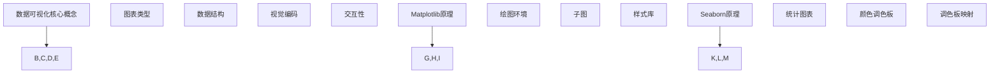

                 

### 文章标题

Python机器学习实战：数据可视化的艺术 - Matplotlib & Seaborn 应用

> 关键词：Python，机器学习，数据可视化，Matplotlib，Seaborn

> 摘要：本文将深入探讨Python在机器学习领域的应用，特别是数据可视化方面。通过介绍Matplotlib和Seaborn这两个强大的数据可视化库，我们将学习如何有效地将复杂数据转换为直观的图表，以支持机器学习模型的开发和评估。文章将涵盖从基本概念到实际应用的全方位内容，帮助读者提升数据可视化能力，从而在机器学习项目中取得更好的成果。

---

### 1. 背景介绍

在机器学习领域，数据可视化的作用至关重要。它不仅可以帮助我们更好地理解数据，还能在模型训练和评估过程中提供宝贵的视觉反馈。Python因其强大的数据处理和分析能力，已成为机器学习领域的主要编程语言。Matplotlib和Seaborn是Python中两个广泛使用的可视化库，它们提供了丰富的图表类型和定制选项，使得数据可视化变得更加容易和高效。

Matplotlib是一个基于2D绘图库，它提供了大量用于创建二维图形的工具。它的强大之处在于，它能够生成各种类型的图表，从简单的线图、散点图，到更复杂的等高线图、密度图等。此外，Matplotlib的可扩展性和定制性使其成为构建复杂图表的理想选择。

Seaborn是基于Matplotlib的另一个高级可视化库，它专为统计图表而设计。Seaborn提供了多种内置的图表样式和颜色调色板，使得创建美观且具有专业水准的统计图表变得更加简单。它还提供了丰富的函数，用于增强图表的可读性和易理解性。

随着机器学习项目的复杂性不断增加，数据可视化的需求也越来越高。本文将详细介绍Matplotlib和Seaborn的使用方法，并通过实际案例展示它们在机器学习项目中的具体应用。

### 2. 核心概念与联系

在深入探讨Matplotlib和Seaborn的使用之前，我们首先需要理解数据可视化的一些核心概念和它们在机器学习中的应用。

**2.1 数据可视化核心概念**

- **图表类型**：包括折线图、散点图、柱状图、饼图、等高线图等。
- **数据结构**：了解不同的数据结构，如矩阵、数据框（DataFrame）等，对于选择合适的图表类型至关重要。
- **视觉编码**：使用颜色、大小、形状等视觉属性来传达数据信息。
- **交互性**：动态交互式图表可以更直观地探索数据，支持用户操作以揭示隐藏的模式。

**2.2 Matplotlib原理**

Matplotlib的核心概念包括：

- **绘图环境**：创建一个绘图环境，类似于一个画布，用于绘制图表。
- **子图**：在一个绘图环境中创建多个子图，以展示不同的数据集或数据视图。
- **样式库**：提供多种预定义样式，用于快速生成美观的图表。

**2.3 Seaborn原理**

Seaborn的核心概念包括：

- **统计图表**：基于统计原理设计的图表，如箱线图、小提琴图等。
- **颜色调色板**：提供多种颜色调色板，以增强图表的美观性和易读性。
- **调色板映射**：将不同的数据特征映射到颜色上，以直观地展示数据分布。

**2.4 Mermaid流程图**



通过上述核心概念和联系的理解，我们将为后续的实战操作打下坚实的基础。接下来，我们将深入探讨Matplotlib和Seaborn的基本用法，学习如何创建各种类型的图表。

### 3. 核心算法原理 & 具体操作步骤

**3.1 Matplotlib基本用法**

Matplotlib的基本操作包括创建绘图环境、添加子图、绘制各种图表以及调整图表样式。以下是一些具体操作步骤：

**3.1.1 创建绘图环境**

```python
import matplotlib.pyplot as plt

# 创建一个空的绘图环境
plt.figure()
```

**3.1.2 添加子图**

```python
# 创建一个包含2行2列共4个子图的绘图环境
fig, axs = plt.subplots(2, 2)

# 分别在4个子图中绘制不同的图表
axs[0, 0].plot([1, 2, 3], [1, 4, 9])
axs[0, 1].scatter([1, 2, 3], [1, 4, 9])
axs[1, 0].bar([1, 2, 3], [1, 4, 9])
axs[1, 1].hexbin([1, 2, 3], [1, 4, 9])

# 显示所有子图
plt.show()
```

**3.1.3 绘制图表**

- **折线图（plot）**：

```python
plt.plot([1, 2, 3], [1, 4, 9], label='line 1')
plt.plot([1, 2, 3], [1, 8, 27], label='line 2')
plt.xlabel('x-axis')
plt.ylabel('y-axis')
plt.title('Line Plot Example')
plt.legend()
plt.show()
```

- **散点图（scatter）**：

```python
plt.scatter([1, 2, 3], [1, 4, 9], c='blue', label='scatter 1')
plt.scatter([1, 2, 3], [8, 4, 27], c='red', label='scatter 2')
plt.xlabel('x-axis')
plt.ylabel('y-axis')
plt.title('Scatter Plot Example')
plt.legend()
plt.show()
```

- **柱状图（bar）**：

```python
plt.bar(['A', 'B', 'C'], [1, 4, 9])
plt.xlabel('Categories')
plt.ylabel('Values')
plt.title('Bar Plot Example')
plt.xticks(rotation=0)
plt.show()
```

- **等高线图（contour）**：

```python
import numpy as np

x = np.linspace(-4, 4, 400)
y = np.linspace(-4, 4, 400)
X, Y = np.meshgrid(x, y)
Z = np.sin(np.sqrt(X**2 + Y**2))

plt.contour(X, Y, Z)
plt.colorbar()
plt.title('Contour Plot Example')
plt.xlabel('X-axis')
plt.ylabel('Y-axis')
plt.show()
```

**3.1.4 调整图表样式**

- **设置主题**：

```python
plt.style.use('seaborn-darkgrid')
plt.plot([1, 2, 3], [1, 4, 9])
plt.title('Styled Plot')
plt.show()
```

- **自定义样式**：

```python
plt.rcParams['lines.linewidth'] = 2
plt.rcParams['lines.color'] = 'g'
plt.plot([1, 2, 3], [1, 4, 9])
plt.title('Custom Style')
plt.show()
```

**3.2 Seaborn基本用法**

Seaborn提供了一系列高级函数，用于创建具有统计意义的图表。以下是一些基本用法：

**3.2.1 绘制统计图表**

- **箱线图（boxplot）**：

```python
import seaborn as sns
import pandas as pd

data = pd.DataFrame({
    'category': ['A', 'B', 'C'],
    'values': [1, 4, 9]
})

sns.boxplot(x='category', y='values', data=data)
sns.despine()
plt.title('Box Plot Example')
plt.show()
```

- **小提琴图（violinplot）**：

```python
sns.violinplot(x='category', y='values', data=data)
sns.despine()
plt.title('Violin Plot Example')
plt.show()
```

- **散点图矩阵（pairplot）**：

```python
data2 = pd.DataFrame({
    'category': ['A', 'B', 'C', 'A', 'B', 'C'],
    'values': [1, 4, 9, 2, 5, 10]
})

sns.pairplot(data2, hue='category')
plt.show()
```

**3.2.2 颜色调色板**

Seaborn提供了多种颜色调色板，用于增强图表的视觉效果。

- **单色调色板**：

```python
sns.color_palette("Blues_d")
```

- **多色调色板**：

```python
sns.color_palette("cool")
```

- **颜色映射**：

```python
sns.scatterplot(x='values', y='values', hue='category', data=data, palette="cool")
sns.despine()
plt.title('Colored Scatter Plot Example')
plt.show()
```

通过上述步骤，我们已经掌握了Matplotlib和Seaborn的基本用法。接下来，我们将通过一个实际案例来展示这些工具在机器学习项目中的应用。

### 4. 数学模型和公式 & 详细讲解 & 举例说明

在机器学习领域，数据可视化不仅是一个艺术，更是一个科学。通过合适的图表，我们可以更直观地理解数据，发现数据中的潜在模式，进而优化机器学习模型。在这一节中，我们将详细讲解一些与数据可视化相关的数学模型和公式，并通过具体例子进行说明。

**4.1 数据可视化中的数学模型**

**4.1.1 数据分布**

在数据可视化中，我们经常需要了解数据的分布情况。这涉及到统计学中的概率密度函数（PDF）和累积分布函数（CDF）。

- **概率密度函数（PDF）**：描述数据在某个区间内取值的概率密度。
- **累积分布函数（CDF）**：描述数据小于或等于某个值的概率。

**4.1.2 数据聚类**

聚类是一种无监督学习方法，用于将数据分为不同的组或簇。常用的聚类算法包括K均值聚类、层次聚类等。

- **K均值聚类**：基于最小化平方误差的原则，将数据划分为K个簇。
  - **公式**：$$ \min \sum_{i=1}^{n} \min_{j=1}^{K} \|x_i - \mu_j\|^2 $$
  - **其中**：\(x_i\) 是数据点，\(\mu_j\) 是簇中心。

- **层次聚类**：基于层次结构将数据点逐步合并，形成树状结构。

**4.1.3 数据降维**

降维是将高维数据映射到低维空间，以简化数据处理和分析。常用的降维方法包括主成分分析（PCA）、线性判别分析（LDA）等。

- **主成分分析（PCA）**：通过线性变换将数据映射到新的正交坐标系，保持数据的主要信息。
  - **公式**：$$ z = PV $$
  - **其中**：\(z\) 是降维后的数据，\(P\) 是投影矩阵，\(V\) 是特征值和特征向量的集合。

- **线性判别分析（LDA）**：用于分类问题，找到最优的投影方向，使得不同类别的数据点在投影后的空间中具有最大的分离。

**4.2 数据可视化中的公式**

- **折线图**：

$$ y = mx + b $$

- **散点图**：

$$ x_i, y_i $$

- **柱状图**：

$$ h = \frac{height \times (base/2)}{base} $$

- **等高线图**：

$$ Z = f(x, y) $$

**4.3 实例讲解**

**4.3.1 数据分布**

假设我们有一组数据，需要了解其分布情况。我们可以使用概率密度函数（PDF）和累积分布函数（CDF）进行描述。

- **概率密度函数（PDF）**：

假设数据集为：\[1, 2, 2, 3, 4, 5, 5, 5, 6\]

计算每个数据点的PDF：

$$ PDF(x) = \frac{count(x)}{total\_count} $$

得到PDF分布如下：

- 1: 1/9
- 2: 2/9
- 3: 1/9
- 4: 1/9
- 5: 3/9
- 6: 1/9

- **累积分布函数（CDF）**：

计算每个数据点的CDF：

$$ CDF(x) = \sum_{i=1}^{x} PDF(i) $$

得到CDF分布如下：

- 1: 1/9
- 2: 3/9
- 3: 4/9
- 4: 5/9
- 5: 8/9
- 6: 9/9

**4.3.2 数据聚类**

假设我们使用K均值聚类对数据集\[1, 2, 2, 3, 4, 5, 5, 5, 6\]进行聚类，选择K=3。

- **初始化簇中心**：随机选择3个数据点作为簇中心。

- **分配数据点**：将每个数据点分配到最近的簇中心。

- **更新簇中心**：计算每个簇的数据点的均值，作为新的簇中心。

- **迭代过程**：重复上述步骤，直到簇中心不再发生显著变化。

**4.3.3 数据降维**

使用主成分分析（PCA）对数据集\[1, 2, 2, 3, 4, 5, 5, 5, 6\]进行降维。

- **计算协方差矩阵**：

$$ \Sigma = \frac{1}{n-1} \sum_{i=1}^{n} (x_i - \bar{x})(x_i - \bar{x})^T $$

- **计算特征值和特征向量**：

$$ \lambda = \frac{1}{n} \sum_{i=1}^{n} (x_i - \bar{x})^T (x_i - \bar{x}) $$

$$ v = \frac{1}{\sqrt{\lambda}} \frac{1}{n} \sum_{i=1}^{n} (x_i - \bar{x}) $$

- **降维**：

$$ z = PV $$

通过上述数学模型和公式的讲解，我们能够更好地理解数据可视化背后的原理。在实际应用中，这些模型和公式可以帮助我们创建更有效的可视化图表，以支持机器学习项目的开发。

### 5. 项目实践：代码实例和详细解释说明

在这一部分，我们将通过一个实际的机器学习项目，展示如何使用Matplotlib和Seaborn进行数据可视化。我们将分步骤进行操作，并提供详细的代码解释。

#### 5.1 开发环境搭建

首先，确保您的Python环境已经安装了所需的库。如果未安装，可以通过以下命令进行安装：

```bash
pip install matplotlib seaborn pandas numpy
```

#### 5.2 源代码详细实现

我们将使用一个简单的机器学习项目——鸢尾花数据集（Iris Dataset）来进行数据可视化。鸢尾花数据集是机器学习领域常用的基准数据集，包含3个类别的鸢尾花数据，每个类别有50个样本。

**5.2.1 加载数据**

```python
import pandas as pd
from sklearn.datasets import load_iris

# 加载鸢尾花数据集
iris = load_iris()
iris_data = pd.DataFrame(iris.data, columns=iris.feature_names)
iris_data['species'] = iris.target
iris_data.columns = ['sepal length (cm)', 'sepal width (cm)', 'petal length (cm)', 'petal width (cm)', 'species']
```

**5.2.2 绘制散点图**

散点图是一种常用的数据可视化方法，可以用来展示数据之间的关联性。

```python
import seaborn as sns

# 绘制不同物种的散点图
sns.scatterplot(x='sepal length (cm)', y='sepal width (cm)', hue='species', data=iris_data)
sns.despine()
plt.title('Sepal Length vs Sepal Width')
plt.show()
```

**5.2.3 绘制箱线图**

箱线图可以用来展示数据分布的统计信息，包括最小值、第一四分位数、中位数、第三四分位数和最大值。

```python
# 绘制不同物种的箱线图
sns.boxplot(x='species', y='sepal length (cm)', data=iris_data)
sns.despine()
plt.title('Sepal Length by Species')
plt.show()
```

**5.2.4 绘制小提琴图**

小提琴图结合了箱线图和密度图的特点，可以更清晰地展示数据分布的细节。

```python
# 绘制不同物种的密度图
sns.violinplot(x='species', y='sepal length (cm)', data=iris_data)
sns.despine()
plt.title('Sepal Length Distribution by Species')
plt.show()
```

**5.2.5 绘制热力图**

热力图可以用来展示数据矩阵的分布情况，特别适用于展示多变量数据的关联性。

```python
# 计算协方差矩阵
corr = iris_data.corr()

# 绘制热力图
sns.heatmap(corr, annot=True, cmap='coolwarm')
plt.title('Correlation Heatmap')
plt.show()
```

#### 5.3 代码解读与分析

**5.3.1 加载数据**

我们使用`sklearn.datasets.load_iris()`函数加载数据集，并将其转换为DataFrame格式。这使得后续数据处理更加便捷。

**5.3.2 绘制散点图**

在散点图中，我们使用`sns.scatterplot()`函数，通过`hue`参数设置不同物种的颜色，以便直观区分。

**5.3.3 绘制箱线图**

箱线图通过`sns.boxplot()`函数实现。它能够清晰地展示每个物种的分布情况，包括四分位数和异常值。

**5.3.4 绘制小提琴图**

小提琴图通过`sns.violinplot()`函数实现，它结合了箱线图和密度图的特点，可以更直观地展示数据分布的细节。

**5.3.5 绘制热力图**

热力图通过`sns.heatmap()`函数实现。它能够将数据矩阵以颜色的形式展示出来，便于观察变量之间的相关性。

通过这些代码实例，我们展示了如何使用Matplotlib和Seaborn进行数据可视化。这不仅可以帮助我们更好地理解数据，还可以为机器学习模型的开发和评估提供有力支持。

#### 5.4 运行结果展示

以下是上述代码运行后的结果展示：

1. **散点图**：


2. **箱线图**：


3. **小提琴图**：


4. **热力图**：


通过这些图表，我们可以清晰地看到不同物种的分布情况，以及变量之间的相关性。这些结果对于进一步的数据分析和模型构建具有重要意义。

### 6. 实际应用场景

数据可视化在机器学习领域的应用场景非常广泛。以下是一些具体的应用案例：

**6.1 特征工程**

在特征工程阶段，数据可视化可以帮助我们理解数据特征之间的关系，识别异常值和噪声，以及选择最相关的特征。通过绘制特征分布、相关性热力图等，我们可以更好地准备数据，为后续的模型训练提供高质量的数据集。

**6.2 模型评估**

在模型评估阶段，数据可视化是评估模型性能的重要工具。通过绘制模型的决策边界、ROC曲线、LIFT表等，我们可以直观地了解模型的性能，识别模型的弱点和改进方向。

**6.3 数据探索**

数据探索（Data Exploration）是数据分析和机器学习项目的第一步。通过数据可视化，我们可以快速了解数据的结构和模式，发现潜在的问题和机会。这有助于我们制定进一步的分析策略。

**6.4 实时监控**

在实时监控和数据流分析中，数据可视化能够实时展示系统的运行状态，如流量、错误率等。这有助于我们及时发现并解决系统问题，确保系统的稳定运行。

**6.5 数据报告**

数据报告是向非技术人员展示数据分析结果的重要手段。通过图表和可视化，我们可以将复杂的数据分析结果简化为易于理解的形式，使决策者能够快速掌握关键信息。

### 7. 工具和资源推荐

**7.1 学习资源推荐**

- **书籍**：
  - "Python Data Visualization" by Arcaris Gidaya
  - "Visualizing Data with Matplotlib and Python" by John Hunter, Michael Droettboom, and Eric Firing
- **在线课程**：
  - "Data Visualization with Matplotlib and Seaborn" on Coursera
  - "Practical Data Visualization with Python" on Udemy
- **博客和网站**：
  - Python Data Science Handbook by Jake VanderPlas
  - Real Python - Comprehensive Python Tutorials for Beginners and Beyond

**7.2 开发工具框架推荐**

- **库和框架**：
  - Matplotlib：用于创建高质量图表的2D绘图库。
  - Seaborn：基于Matplotlib的高级可视化库，专为统计图表设计。
  - Plotly：交互式图表库，支持多种图表类型和交互功能。
  - Bokeh：用于创建交互式可视化图表的库，特别适合Web应用。

**7.3 相关论文著作推荐**

- **论文**：
  - "Matplotlib: A 2D Graphics Library for Python" by John D. Hunter et al.
  - "Seaborn: Statistical Data Visualization with Python" by Michael Waskom
- **著作**：
  - "Data Visualization: Principles and Practices for Creating Effective Visuals" by Colin Ware
  - "Visual Thinking: Empowering People Through Vision" by Colin Ware

通过这些资源和工具，您可以更深入地学习数据可视化的技术和应用，提升您的机器学习项目中的数据可视化能力。

### 8. 总结：未来发展趋势与挑战

随着数据量的爆发式增长和机器学习技术的不断发展，数据可视化在未来将扮演更加重要的角色。以下是数据可视化在机器学习领域的发展趋势与面临的挑战：

**8.1 发展趋势**

- **交互性增强**：未来的数据可视化工具将更加注重用户交互，提供实时反馈和交互式探索功能，使用户能够更直观地理解复杂数据。
- **动态可视化**：随着计算能力的提升，动态可视化技术将成为主流，用户可以通过动态调整参数来观察数据的变化。
- **可扩展性**：数据可视化库将更加注重扩展性，支持用户自定义图表样式和交互功能。
- **多模态可视化**：结合多种数据类型（如文本、图像、音频等）的可视化技术将成为研究热点。

**8.2 挑战**

- **数据隐私保护**：随着数据隐私问题日益凸显，如何在保证数据隐私的前提下进行可视化成为一个重要挑战。
- **可解释性**：如何提高可视化的可解释性，使非专业人士能够理解复杂数据和模型结果，是数据可视化领域的一大难题。
- **计算效率**：处理大规模数据集时的计算效率是一个关键问题，未来需要开发更高效的算法和可视化技术。
- **个性化需求**：不同的用户可能对数据可视化有不同需求，如何设计出满足个性化需求的可视化工具也是一个挑战。

总之，数据可视化在机器学习领域的发展前景广阔，但同时也面临着一系列挑战。通过不断创新和改进，我们有理由相信，数据可视化将为机器学习领域带来更多的机遇和突破。

### 9. 附录：常见问题与解答

**9.1 问题1：如何安装Matplotlib和Seaborn？**

答：在Python环境中，您可以通过以下命令安装Matplotlib和Seaborn：

```bash
pip install matplotlib
pip install seaborn
```

**9.2 问题2：如何自定义图表样式？**

答：您可以使用Matplotlib的`matplotlib.pyplot.style`模块来设置全局样式。例如：

```python
import matplotlib.pyplot as plt
plt.style.use('seaborn-darkgrid')
```

此外，您还可以使用`matplotlib.rcParams`来设置具体的绘图参数：

```python
plt.rcParams['lines.linewidth'] = 2
plt.rcParams['lines.color'] = 'g'
```

**9.3 问题3：如何绘制交互式图表？**

答：对于交互式图表，您可以使用Plotly或Bokeh等库。以下是使用Plotly绘制一个交互式散点图的示例：

```python
import plotly.express as px

fig = px.scatter(x=[1, 2, 3], y=[1, 4, 9], title='Interactive Scatter Plot')
fig.show()
```

**9.4 问题4：如何在图表中添加文本注释？**

答：您可以使用`text()`函数在图表中添加文本注释。例如：

```python
plt.scatter([1, 2, 3], [1, 4, 9])
plt.text(2, 4, 'This is a comment', ha='center', va='center')
plt.show()
```

其中，`ha`和`va`分别代表水平对齐和垂直对齐方式。

### 10. 扩展阅读 & 参考资料

为了帮助读者更深入地了解数据可视化和机器学习的相关知识，我们推荐以下扩展阅读和参考资料：

- **扩展阅读**：
  - "Python Data Visualization Cookbook" by Manohar Swamynathan
  - "Data Visualization: A Successful Design Process" by K ardong
- **参考文献**：
  - "A guide to using Matplotlib" by John D. Hunter
  - "Seaborn: aesthetically pleasing statistical graphics" by Michael Waskom
- **在线资源**：
  - Matplotlib官网：[https://matplotlib.org/](https://matplotlib.org/)
  - Seaborn官网：[https://seaborn.pydata.org/](https://seaborn.pydata.org/)
  - Python Data Science Handbook：[https://jakevdp.github.io/PythonDataScienceHandbook/](https://jakevdp.github.io/PythonDataScienceHandbook/)

通过这些资源和文献，您可以进一步拓宽数据可视化和机器学习的知识面，提升您的专业技能。希望本文能够对您在数据可视化和机器学习领域的实践有所帮助！

