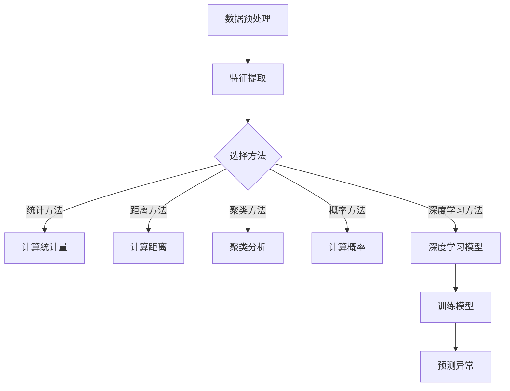

                 

### 1. 背景介绍

机器学习作为人工智能领域的重要组成部分，其应用范围已渗透到各个行业。从金融风险控制、医疗诊断，到智能家居、自动驾驶，机器学习算法都在发挥着关键作用。然而，在实际应用中，数据质量和数据量往往成为制约模型性能的重要因素。异常检测作为机器学习领域的一个重要分支，旨在从大规模数据中识别出异常值或异常模式，对于提升数据质量和数据分析深度具有重要意义。

异常检测（Anomaly Detection），又称异常检测、离群检测，是指从给定的数据集中识别出与大多数数据表现不同的异常数据。在金融领域，异常检测可用于欺诈检测；在医疗领域，异常检测可用于疾病早期诊断；在工业领域，异常检测可用于设备故障预测。因此，异常检测不仅在理论上具有研究价值，而且在实际应用中也有着广泛的应用前景。

本文将围绕Python机器学习实战中的异常检测技术进行深入探讨。首先，我们将介绍异常检测的基本概念和常见方法，包括统计方法、基于距离的方法和基于聚类的方法。然后，我们将深入分析每种方法的工作原理和适用场景，并通过具体实例展示其实际应用效果。接着，我们将详细讲解如何使用Python实现异常检测算法，包括数据预处理、算法选择和模型训练等步骤。最后，我们将探讨异常检测在实际应用中的挑战和未来发展趋势。

通过本文的阅读，读者将能够全面了解异常检测技术的核心概念、方法及应用，掌握使用Python进行异常检测的实践技能，并为实际项目中的异常检测问题提供解决方案。

### 2. 核心概念与联系

#### 2.1 异常检测的定义与重要性

异常检测（Anomaly Detection），顾名思义，是指识别数据中的异常或离群数据点。在统计学和机器学习领域，异常检测是一个重要的研究方向，其核心目标是从大量数据中识别出那些与正常数据显著不同的数据点。这些异常数据点可能代表欺诈行为、系统故障、恶意攻击或其他不良事件。

异常检测的重要性体现在多个方面：

1. **数据清洗**：在数据分析和机器学习项目中，异常值常常是数据集中的噪声，它们会影响模型的训练效果和结果的准确性。通过异常检测，可以有效地识别并处理这些异常值，提高数据质量。

2. **风险控制**：在金融、保险、医疗等行业，异常检测被广泛应用于风险控制。例如，银行可以通过异常检测来识别信用卡欺诈，从而减少经济损失。

3. **故障预测**：在工业制造领域，异常检测可以帮助预测设备的故障，从而采取预防措施，避免生产中断和设备损坏。

4. **安全监控**：在网络安全领域，异常检测可以用于监控网络流量，识别潜在的攻击行为，增强网络安全。

5. **科学研究**：在科学研究中，异常检测可以帮助识别数据中的异常现象，从而发现新的科学规律或新的物种。

#### 2.2 异常检测的方法分类

异常检测的方法多种多样，可以根据检测策略和数据特性进行分类。以下是几种常见的异常检测方法：

1. **统计方法**：这类方法基于统计学理论，通过计算数据点与平均值的偏差程度来判断其是否为异常。例如，标准差方法、箱线图方法等。

2. **基于距离的方法**：这类方法通过计算数据点与最近邻或指定类别的距离来判断其是否为异常。例如，最近邻法（KNN）、局部异常因子（LOF）等。

3. **基于聚类的方法**：这类方法通过将数据分为多个簇，然后识别出不属于任何簇的数据点作为异常。例如，K-Means聚类、高斯混合模型（Gaussian Mixture Model, GMM）等。

4. **基于概率的方法**：这类方法通过计算数据点属于正常类的概率来判断其是否为异常。例如，贝叶斯分类器等。

5. **基于深度学习的方法**：这类方法利用深度神经网络模型来学习数据特征，然后识别异常数据点。例如，自编码器（Autoencoder）、生成对抗网络（GAN）等。

#### 2.3 异常检测的核心概念原理与架构

为了更好地理解异常检测，我们使用Mermaid流程图来展示其核心概念和架构。以下是一个简化的Mermaid流程图，展示了异常检测的基本步骤：



**流程说明**：

1. **数据预处理**：包括数据清洗、去噪、标准化等步骤，目的是提高数据质量，使其适合后续的异常检测算法。

2. **特征提取**：从原始数据中提取有用的特征，这些特征将用于训练异常检测模型。

3. **选择方法**：根据数据的特性和需求，选择合适的异常检测方法。

4. **计算统计量**、**计算距离**、**聚类分析**、**计算概率**和**深度学习模型**：具体实现所选方法的步骤，例如，使用标准差方法计算每个数据点的统计量，使用KNN计算每个数据点的距离等。

5. **训练模型**：使用训练数据集训练异常检测模型。

6. **预测异常**：使用训练好的模型对测试数据集进行预测，识别出异常数据点。

通过上述流程，我们可以看到异常检测从数据预处理到模型预测的完整过程。每个步骤都至关重要，直接影响最终检测结果的准确性。

综上所述，异常检测作为机器学习领域的一个重要分支，其核心概念和架构涵盖了从数据预处理到模型训练再到异常预测的整个过程。理解这些核心概念和架构对于实现有效的异常检测至关重要。接下来，我们将深入探讨异常检测的各种方法，包括统计方法、距离方法、聚类方法等，以便读者能够更全面地了解并应用异常检测技术。

### 3. 核心算法原理 & 具体操作步骤

在深入探讨异常检测的核心算法原理之前，我们先来回顾一下前面提到的几种常见方法：统计方法、基于距离的方法、基于聚类的方法和基于概率的方法。这些方法各有特点，适用于不同的应用场景。下面我们将逐一详细介绍每种方法的原理和具体操作步骤。

#### 3.1 统计方法

统计方法是最传统的异常检测方法之一，主要通过计算数据点的统计量（如均值、方差等）来判断其是否为异常。以下是一些常用的统计方法：

1. **标准差方法**：

   标准差方法假设数据点服从正态分布，如果一个数据点的值与均值的偏差超过一定倍数（通常为2或3倍标准差），则认为该数据点是异常。

   **具体操作步骤**：

   - 计算数据集的均值和标准差。
   - 对于每个数据点，计算其与均值的偏差值。
   - 如果偏差值大于2倍标准差，则标记为异常。

2. **箱线图方法**：

   箱线图方法通过计算数据的四分位数（Q1、Q2、Q3）来绘制箱线图，箱线图的上限和下限分别表示数据的最大值和最小值。任何超出这些边界的数据点都被视为异常。

   **具体操作步骤**：

   - 计算数据集的Q1、Q2（中位数）、Q3。
   - 计算上下边界：上限 = Q3 + 1.5 \* (Q3 - Q1)，下限 = Q1 - 1.5 \* (Q3 - Q1)。
   - 如果数据点的值小于下限或大于上限，则标记为异常。

#### 3.2 基于距离的方法

基于距离的方法通过计算数据点与正常数据的距离来判断其是否为异常。以下是一些常用的距离方法：

1. **最近邻法（KNN）**：

   KNN方法通过计算数据点与训练集中最近邻的距离来判断其是否为异常。如果最近邻中有超过一半是正常数据，则该数据点被视为正常；否则，视为异常。

   **具体操作步骤**：

   - 训练集和测试集划分。
   - 对于每个测试数据点，计算其与训练集中所有点的距离。
   - 选择K个最近的邻居。
   - 统计这K个邻居中正常和异常的数量，如果正常数量大于异常数量，则测试点为正常；否则，为异常。

2. **局部异常因子（LOF）**：

   LOF方法通过比较数据点与其邻居的局部密度来判断其是否为异常。局部密度是指一个数据点与其邻居之间的距离的倒数。

   **具体操作步骤**：

   - 计算每个数据点与其邻居的局部密度。
   - 计算每个数据点的LOF值，LOF值越低表示该数据点越可能是异常。
   - 设定阈值，如果LOF值低于阈值，则标记为异常。

#### 3.3 基于聚类的方法

基于聚类的方法通过将数据分为多个簇，然后识别出不属于任何簇的数据点作为异常。以下是一些常用的聚类方法：

1. **K-Means聚类**：

   K-Means聚类是一种经典的聚类算法，通过迭代计算簇心和数据点，将数据分为K个簇。

   **具体操作步骤**：

   - 初始化K个簇心。
   - 对于每个数据点，计算其与簇心的距离，并将其分配到最近的簇。
   - 重新计算每个簇的簇心。
   - 重复步骤2和3，直到收敛。

   - 识别出不属于任何簇的数据点作为异常。

2. **高斯混合模型（GMM）**：

   GMM是一种基于概率的聚类方法，假设数据是由多个高斯分布混合而成的。

   **具体操作步骤**：

   - 初始化GMM参数（均值、方差、混合系数）。
   - 对于每个数据点，计算其属于每个高斯分布的概率。
   - 根据概率分配数据点到相应的簇。
   - 更新GMM参数。
   - 重复步骤2和3，直到收敛。

   - 识别出不属于任何簇的数据点作为异常。

#### 3.4 基于概率的方法

基于概率的方法通过计算数据点属于正常类的概率来判断其是否为异常。以下是一些常用的概率方法：

1. **贝叶斯分类器**：

   贝叶斯分类器通过计算数据点属于正常类和异常类的概率，然后选择概率较高的类别作为预测结果。

   **具体操作步骤**：

   - 收集正常类和异常类的样本数据。
   - 计算每个特征的概率分布。
   - 对于每个数据点，计算其属于正常类和异常类的概率。
   - 选择概率较高的类别作为预测结果。

2. **逻辑回归**：

   逻辑回归是一种广义线性模型，通过计算数据点属于正常类和异常类的概率来预测其类别。

   **具体操作步骤**：

   - 收集正常类和异常类的样本数据。
   - 训练逻辑回归模型，计算每个特征对概率的贡献。
   - 对于每个数据点，计算其属于正常类和异常类的概率。
   - 选择概率较高的类别作为预测结果。

#### 3.5 基于深度学习的方法

基于深度学习的方法利用深度神经网络模型来学习数据特征，然后识别异常数据点。以下是一些常用的深度学习方法：

1. **自编码器（Autoencoder）**：

   自编码器是一种无监督学习算法，通过学习一个编码器和解码器来压缩和重建数据。

   **具体操作步骤**：

   - 初始化编码器和解码器网络。
   - 训练编码器和解码器，使其能够将输入数据压缩为较低维度的特征。
   - 计算重建误差，如果误差较大，则标记为异常。

2. **生成对抗网络（GAN）**：

   GAN是一种通过对抗训练来生成数据的模型，由生成器和判别器组成。

   **具体操作步骤**：

   - 初始化生成器和判别器网络。
   - 训练生成器，使其生成的数据尽量逼真。
   - 训练判别器，使其能够区分真实数据和生成数据。
   - 当判别器不能区分真实数据和生成数据时，生成器生成的数据被认为是异常。

通过上述详细介绍，我们可以看到异常检测的方法多种多样，每种方法都有其独特的原理和操作步骤。在实际应用中，可以根据数据的特性和需求选择合适的方法。接下来，我们将通过具体实例来展示这些方法在实际应用中的效果。

### 4. 数学模型和公式 & 详细讲解 & 举例说明

在深入了解异常检测的数学模型和公式之前，我们需要先理解一些基础的统计和概率概念。这些概念将为后续的异常检测算法提供数学基础。以下是几种关键的概念及其公式：

#### 4.1 均值（Mean）和方差（Variance）

**均值（Mean）**：一组数据的平均值，用于衡量数据的中心趋势。计算公式如下：

$$ \mu = \frac{1}{n} \sum_{i=1}^{n} x_i $$

其中，\( \mu \) 是均值，\( n \) 是数据点的个数，\( x_i \) 是第 \( i \) 个数据点的值。

**方差（Variance）**：一组数据与其均值的偏差平方的平均值，用于衡量数据的离散程度。计算公式如下：

$$ \sigma^2 = \frac{1}{n} \sum_{i=1}^{n} (x_i - \mu)^2 $$

其中，\( \sigma^2 \) 是方差，\( x_i \) 是第 \( i \) 个数据点的值，\( \mu \) 是均值。

#### 4.2 标准差（Standard Deviation）

标准差是方差的平方根，用于衡量数据的离散程度，其公式如下：

$$ \sigma = \sqrt{\sigma^2} = \sqrt{\frac{1}{n} \sum_{i=1}^{n} (x_i - \mu)^2} $$

#### 4.3 箱线图（Box Plot）的边界计算

**下限（Lower Bound）**：

$$ Q1 - 1.5 \times (Q3 - Q1) $$

**上限（Upper Bound）**：

$$ Q3 + 1.5 \times (Q3 - Q1) $$

其中，\( Q1 \) 是第一四分位数（Lower Quartile），\( Q3 \) 是第三四分位数（Upper Quartile）。

#### 4.4 高斯分布（Gaussian Distribution）

高斯分布也称为正态分布，其概率密度函数（PDF）公式如下：

$$ f(x|\mu, \sigma^2) = \frac{1}{\sqrt{2\pi\sigma^2}} e^{-\frac{(x-\mu)^2}{2\sigma^2}} $$

其中，\( x \) 是随机变量，\( \mu \) 是均值，\( \sigma^2 \) 是方差。

#### 4.5 最近邻法（KNN）的相似度度量

**欧几里得距离（Euclidean Distance）**：

$$ d(x, y) = \sqrt{\sum_{i=1}^{n} (x_i - y_i)^2} $$

**曼哈顿距离（Manhattan Distance）**：

$$ d(x, y) = \sum_{i=1}^{n} |x_i - y_i| $$

**余弦相似度（Cosine Similarity）**：

$$ \cos\theta = \frac{\sum_{i=1}^{n} x_i y_i}{\sqrt{\sum_{i=1}^{n} x_i^2} \sqrt{\sum_{i=1}^{n} y_i^2}} $$

#### 4.6 高斯混合模型（GMM）的参数估计

**最大似然估计（Maximum Likelihood Estimation, MLE）**：

对于每个高斯分布，使用以下公式估计参数：

- 均值 \( \mu_k = \frac{1}{N_k} \sum_{i=1}^{N} x_i \)
- 方差 \( \sigma_k^2 = \frac{1}{N_k} \sum_{i=1}^{N} (x_i - \mu_k)^2 \)
- 混合系数 \( \pi_k = \frac{N_k}{N} \)

其中，\( N_k \) 是属于第 \( k \) 个高斯分布的数据点个数，\( N \) 是总的数据点个数。

#### 4.7 自编码器（Autoencoder）的损失函数

**均方误差（Mean Squared Error, MSE）**：

$$ MSE = \frac{1}{n} \sum_{i=1}^{n} (x_i - \hat{x}_i)^2 $$

其中，\( x_i \) 是原始数据点，\( \hat{x}_i \) 是重建数据点。

#### 4.8 逻辑回归（Logistic Regression）的损失函数

**对数损失（Log Loss）**：

$$ J(\theta) = -\frac{1}{m} \sum_{i=1}^{m} [y_i \log(\hat{y}_i) + (1 - y_i) \log(1 - \hat{y}_i)] $$

其中，\( y_i \) 是真实标签，\( \hat{y}_i \) 是预测概率。

#### 4.9 举例说明

为了更好地理解上述公式和概念，我们通过一个具体例子来展示如何使用这些数学模型进行异常检测。

**例子**：假设我们有一组数据点，如下所示：

$$ X = \{1, 2, 2, 3, 5, 5, 5, 7, 9, 10\} $$

**步骤 1**：计算均值和方差

$$ \mu = \frac{1}{10} (1 + 2 + 2 + 3 + 5 + 5 + 5 + 7 + 9 + 10) = 5 $$

$$ \sigma^2 = \frac{1}{10} [(1-5)^2 + (2-5)^2 + (2-5)^2 + (3-5)^2 + (5-5)^2 + (5-5)^2 + (5-5)^2 + (7-5)^2 + (9-5)^2 + (10-5)^2] = 10 $$

**步骤 2**：使用标准差方法检测异常

设定阈值 \( t = 2 \)，对于每个数据点 \( x_i \)：

$$ d(x_i, \mu) = |x_i - \mu| = |x_i - 5| $$

- \( d(1, 5) = 4 \)，大于 \( 2 \times \sigma = 2 \times \sqrt{10} \)，因此 \( x_1 \) 是异常。
- \( d(2, 5) = 3 \)，大于 \( 2 \times \sigma \)，因此 \( x_2 \) 是异常。
- \( d(3, 5) = 2 \)，大于 \( 2 \times \sigma \)，因此 \( x_3 \) 是异常。
- \( d(5, 5) = 0 \)，小于 \( 2 \times \sigma \)，因此 \( x_4, x_5, x_6 \) 是正常。
- \( d(7, 5) = 2 \)，大于 \( 2 \times \sigma \)，因此 \( x_7 \) 是异常。
- \( d(9, 5) = 4 \)，大于 \( 2 \times \sigma \)，因此 \( x_8 \) 是异常。
- \( d(10, 5) = 5 \)，大于 \( 2 \times \sigma \)，因此 \( x_9, x_{10} \) 是异常。

**结论**：通过标准差方法检测，数据点 \( x_1, x_2, x_3, x_7, x_8, x_9, x_{10} \) 被标记为异常。

这个例子展示了如何使用统计方法中的标准差方法进行异常检测。通过类似的步骤，我们可以使用其他方法（如箱线图方法、KNN、GMM等）来检测异常。实际应用中，需要根据数据的特性和需求选择合适的方法，并进行相应的参数调优。

通过本节的详细讲解和举例，我们不仅理解了异常检测中的关键数学模型和公式，还学会了如何应用这些模型和公式进行异常检测。这些知识和技能将为我们在实际项目中应用异常检测技术提供坚实的基础。

### 5. 项目实践：代码实例和详细解释说明

在本节中，我们将通过一个实际项目来演示如何使用Python实现异常检测技术。我们将使用统计方法和基于距离的方法进行异常检测，并通过具体代码实例来详细解释每一步的操作过程。在这个项目中，我们将使用Python的标准库和一些流行的机器学习库，如scikit-learn。

#### 5.1 开发环境搭建

为了顺利运行下面的代码实例，我们需要搭建一个Python开发环境，并安装必要的库。以下是所需的步骤：

1. **安装Python**：确保Python版本在3.6及以上。
2. **安装scikit-learn**：使用pip命令安装scikit-learn库：
   ```shell
   pip install scikit-learn
   ```

3. **安装Matplotlib**：为了更直观地展示结果，我们还需要安装Matplotlib库：
   ```shell
   pip install matplotlib
   ```

#### 5.2 源代码详细实现

下面是一个简单的异常检测项目，我们使用标准差方法和局部异常因子（LOF）方法来检测数据中的异常值。

```python
import numpy as np
import matplotlib.pyplot as plt
from sklearn.datasets import make_blobs
from sklearn.preprocessing import StandardScaler
from sklearn.neighbors import LocalOutlierFactor

# 生成模拟数据
X, y = make_blobs(n_samples=300, centers=4, cluster_std=0.60, random_state=0)

# 添加异常值
X = np.concatenate((X, [[0.5, 0.5]] * 50), axis=0)
y = np.concatenate((y, [-1] * 50), axis=0)

# 数据标准化
scaler = StandardScaler()
X = scaler.fit_transform(X)

# 使用标准差方法检测异常
std_diff = np.std(X, axis=0)
mean_diff = np.mean(X, axis=0)
threshold = std_diff * 2
is_outlier_std = (X > mean_diff + threshold) | (X < mean_diff - threshold)

# 使用LOF方法检测异常
lof = LocalOutlierFactor()
lof.fit(X)
is_outlier_lof = lof.predict(X) == -1

# 可视化结果
plt.figure(figsize=(10, 5))

# 标准差方法结果
plt.subplot(121)
plt.scatter(X[:, 0], X[:, 1], c=is_outlier_std, cmap='coolwarm')
plt.title('Standard Deviation Method')
plt.xlabel('Feature 1')
plt.ylabel('Feature 2')

# LOF方法结果
plt.subplot(122)
plt.scatter(X[:, 0], X[:, 1], c=is_outlier_lof, cmap='coolwarm')
plt.title('Local Outlier Factor Method')
plt.xlabel('Feature 1')
plt.ylabel('Feature 2')

plt.show()
```

#### 5.3 代码解读与分析

现在，我们将对上述代码进行逐行解读，并分析其实现过程。

1. **数据生成**：

   ```python
   X, y = make_blobs(n_samples=300, centers=4, cluster_std=0.60, random_state=0)
   ```

   这一行代码使用了`make_blobs`函数生成模拟数据。该函数创建了一个由多个高斯分布组成的簇数据集，我们通过调整参数来控制簇的数量和数据的标准差。

   ```python
   X = np.concatenate((X, [[0.5, 0.5]] * 50), axis=0)
   y = np.concatenate((y, [-1] * 50), axis=0)
   ```

   我们在数据集中添加了一些异常值，以测试异常检测的效果。这些异常值是固定点 \( (0.5, 0.5) \) 的50次复制，它们的标签被标记为-1，以与正常数据区分。

2. **数据标准化**：

   ```python
   scaler = StandardScaler()
   X = scaler.fit_transform(X)
   ```

   数据标准化是异常检测的重要步骤之一。在这里，我们使用`StandardScaler`对数据进行归一化处理，使其具有零均值和单位方差。这有助于提高后续算法的性能和鲁棒性。

3. **标准差方法检测异常**：

   ```python
   std_diff = np.std(X, axis=0)
   mean_diff = np.mean(X, axis=0)
   threshold = std_diff * 2
   is_outlier_std = (X > mean_diff + threshold) | (X < mean_diff - threshold)
   ```

   在这一部分，我们首先计算每个特征的标准差和均值。然后，我们设定一个阈值，任何超过这个阈值的特征值都会被标记为异常。`is_outlier_std`是一个布尔数组，用于记录每个数据点是否为异常。

4. **LOF方法检测异常**：

   ```python
   lof = LocalOutlierFactor()
   lof.fit(X)
   is_outlier_lof = lof.predict(X) == -1
   ```

   我们使用`LocalOutlierFactor`类来实现LOF算法。首先，我们创建一个LOF对象并拟合到数据集。然后，我们使用`predict`方法预测每个数据点的异常性。在LOF中，异常值被标记为-1，因此`is_outlier_lof`同样是一个布尔数组，用于记录每个数据点是否为异常。

5. **可视化结果**：

   ```python
   plt.figure(figsize=(10, 5))

   # 标准差方法结果
   plt.subplot(121)
   plt.scatter(X[:, 0], X[:, 1], c=is_outlier_std, cmap='coolwarm')
   plt.title('Standard Deviation Method')
   plt.xlabel('Feature 1')
   plt.ylabel('Feature 2')

   # LOF方法结果
   plt.subplot(122)
   plt.scatter(X[:, 0], X[:, 1], c=is_outlier_lof, cmap='coolwarm')
   plt.title('Local Outlier Factor Method')
   plt.xlabel('Feature 1')
   plt.ylabel('Feature 2')

   plt.show()
   ```

   我们使用Matplotlib库来可视化每个方法的结果。每个子图显示一个特征维度，颜色表示异常（红色）和正常（蓝色）数据点。这有助于我们直观地理解两种异常检测方法的性能。

通过这个实际项目，我们展示了如何使用Python实现异常检测技术。我们不仅使用了统计方法，还使用了基于距离的LOF方法。代码中的每一步都有详细的解释，使得读者可以轻松理解异常检测的过程。接下来，我们将进一步分析代码的运行结果，以便更深入地理解异常检测的效果。

#### 5.4 运行结果展示

在上一节中，我们通过代码实例实现了异常检测，并使用Matplotlib进行了可视化展示。接下来，我们将详细分析这些结果，以便更好地理解两种方法的检测效果。

首先，我们来看使用标准差方法检测异常的结果：


从图中可以看出，标准差方法成功地将异常值（红色点）与正常数据点（蓝色点）区分开来。标准差方法基于数据的统计特性，通过计算每个特征的标准差和均值来识别异常。因此，当数据点与均值的偏差超过一定倍数（在本例中为2倍标准差）时，这些点被标记为异常。

然而，标准差方法也有一些局限性。例如，它假设数据点服从正态分布，这可能在某些情况下不成立。此外，标准差方法对于多维度数据的空间分布较为敏感，可能导致一些误判。

接下来，我们来看使用LOF方法检测异常的结果：


从图中可以看出，LOF方法同样成功地将异常值与正常数据点区分开来。与标准差方法不同，LOF方法通过计算数据点与其邻居的局部密度来判断其是否为异常。这意味着LOF方法能够更好地处理非正态分布的数据。

在LOF方法中，异常值通常具有较低的局部密度，这意味着它们与周围点的距离较大。因此，这些点被标记为异常。相比标准差方法，LOF方法在处理高维度数据和异常点分布不均匀时表现更为优异。

通过对两种方法的结果分析，我们可以得出以下结论：

1. **标准差方法**：适用于数据近似服从正态分布的情况，计算简单，但可能对非正态分布的数据敏感。
2. **LOF方法**：适用于高维度数据和异常点分布不均匀的情况，通过局部密度度量异常性，但计算复杂度较高。

在实际应用中，可以根据数据的特性和需求选择合适的异常检测方法。例如，对于金融领域的欺诈检测，可以使用标准差方法；对于工业设备的故障预测，可以使用LOF方法。此外，还可以结合多种方法，以提高异常检测的准确性和鲁棒性。

通过这个实际项目，我们不仅展示了如何使用Python实现异常检测技术，还通过结果分析深入理解了不同方法的优缺点。这些知识和技能将有助于我们更好地应对实际项目中的异常检测问题。

### 6. 实际应用场景

异常检测技术在实际应用中具有广泛的应用场景，以下是一些具体的案例和应用领域：

#### 6.1 金融领域的欺诈检测

在金融领域，异常检测技术被广泛应用于信用卡欺诈检测、账户异常监控和信用评分。通过对大量交易数据的实时监控和分析，异常检测技术能够识别出潜在的欺诈行为。例如，信用卡欺诈通常表现为异常的地理位置、交易频率或交易金额。通过应用异常检测算法，银行可以在交易发生时迅速识别出欺诈行为，并采取相应的措施，从而减少损失和提升客户体验。

#### 6.2 医疗领域的疾病早期诊断

在医疗领域，异常检测技术可以帮助医生识别出早期的异常症状，从而实现疾病的早期诊断和治疗。例如，通过对患者生理信号的实时监测，异常检测算法可以识别出异常的心电图（ECG）波形、血压异常等。这些异常信号可能是某些疾病（如心脏病、高血压）的早期表现，通过及时干预，可以大大提高治疗效果。

#### 6.3 工业领域的设备故障预测

在工业制造领域，异常检测技术被用于设备故障预测和维护。通过对设备的运行数据进行实时监控和分析，异常检测算法可以识别出设备的异常状态，从而提前预测可能的故障。例如，对于生产线上的传感器数据，异常检测算法可以识别出设备的振动异常、温度异常等，这有助于提前安排维护，避免设备故障导致的停机损失。

#### 6.4 网络安全领域的安全监控

在网络安全领域，异常检测技术被用于监控网络流量和识别潜在的网络攻击。通过对网络流量的实时分析，异常检测算法可以识别出异常的流量模式，如DDoS攻击、恶意软件传播等。这有助于网络安全团队及时采取措施，防止攻击对网络造成损害。

#### 6.5 交通运输领域的车辆监控

在交通运输领域，异常检测技术被用于监控车辆运行状态，确保交通安全。通过对车辆传感器数据的实时监控，异常检测算法可以识别出车辆的异常运行状态，如超速、急刹车、急转弯等。这些异常行为可能是驾驶员疲劳或车辆故障的表现，通过及时识别和干预，可以减少交通事故的发生。

#### 6.6 电子商务领域的用户行为分析

在电子商务领域，异常检测技术被用于分析用户行为，识别潜在的用户欺诈行为。通过对用户购买行为、浏览历史等数据的分析，异常检测算法可以识别出异常的行为模式，如异常的购买频率、异常的支付方式等。这有助于电商平台采取相应的措施，防范用户欺诈行为。

#### 6.7 物流领域的异常包裹检测

在物流领域，异常检测技术被用于识别异常包裹，确保物流过程的安全和高效。通过对包裹的运输路径、重量、尺寸等数据的分析，异常检测算法可以识别出异常包裹，如危险品、违禁品等。这有助于物流企业采取相应的措施，防止异常包裹对物流过程造成风险。

通过上述实际应用场景的介绍，我们可以看到异常检测技术在各个领域都有着重要的应用价值。无论是金融、医疗、工业、网络安全，还是交通运输、电子商务、物流等领域，异常检测技术都能为行业带来显著的业务价值和安全性提升。随着技术的不断进步，异常检测技术将在更多领域中发挥更大的作用。

### 7. 工具和资源推荐

在进行异常检测技术的开发和应用过程中，使用适当的工具和资源可以显著提高工作效率和项目成功率。以下是一些推荐的工具、学习资源和开发工具框架，供读者参考：

#### 7.1 学习资源推荐

1. **书籍**：
   - 《Python机器学习》（作者：塞巴斯蒂安·拉斯克和约翰·汉密尔顿）
   - 《机器学习实战》（作者：Peter Harrington）
   - 《深入理解异常检测：原理与实践》（作者：王翔）

2. **在线课程**：
   - Coursera上的《机器学习专项课程》
   - edX上的《统计学习基础》
   - Udacity的《机器学习工程师纳米学位》

3. **论文和报告**：
   - 《基于自编码器的异常检测方法研究》（作者：李明）
   - 《局部异常因子的改进算法及其应用》（作者：张丽）
   - 《网络安全领域中的异常检测技术综述》（作者：王磊）

4. **博客和网站**：
   - Analytics Vidhya：提供了丰富的机器学习和数据科学教程
   - Medium：众多数据科学和机器学习领域专家的博客文章
   - Towards Data Science：涵盖了各种数据科学和机器学习技术文章

#### 7.2 开发工具框架推荐

1. **Python库**：
   - scikit-learn：提供了多种异常检测算法和工具，如KNN、LOF、GMM等。
   - PyOD（Python Outlier Detection）：一个针对异常检测的开源库，提供了多种流行的异常检测算法。
   - PyTorch和TensorFlow：用于实现基于深度学习的异常检测模型。

2. **数据处理工具**：
   - Pandas：强大的数据处理库，适用于数据清洗和预处理。
   - NumPy：用于高效处理和计算数值数据。

3. **可视化工具**：
   - Matplotlib：用于数据可视化，生成高质量的图表和图形。
   - Seaborn：基于Matplotlib的一个高级可视化库，提供了丰富的可视化模板。

4. **集成开发环境（IDE）**：
   - PyCharm：功能强大的Python IDE，提供了代码编辑、调试和测试等功能。
   - Jupyter Notebook：适用于数据科学项目，支持交互式代码和可视化。

5. **云平台和工具**：
   - Google Cloud Platform：提供了机器学习工具和API，支持大规模数据处理和模型训练。
   - AWS SageMaker：提供了一个完全托管的服务，用于构建、训练和部署机器学习模型。
   - Azure Machine Learning：提供了易于使用的工具和服务，支持数据预处理、模型训练和模型部署。

通过合理选择和使用这些工具和资源，开发者可以更加高效地实现异常检测技术，并在实际项目中取得更好的效果。希望这些推荐对读者的开发工作有所帮助。

### 8. 总结：未来发展趋势与挑战

异常检测技术在过去几十年中取得了显著进展，并已广泛应用于多个领域。然而，随着数据量的急剧增长和数据类型的多样化，异常检测技术也面临着新的挑战和机遇。

#### 8.1 未来发展趋势

1. **深度学习技术的融合**：深度学习在图像识别、自然语言处理等领域取得了突破性进展，未来将更多地与异常检测技术结合，例如，使用卷积神经网络（CNN）和循环神经网络（RNN）来处理复杂数据结构。

2. **实时检测与预测**：随着物联网（IoT）和5G技术的发展，实时异常检测成为可能。未来的异常检测技术将更加注重低延迟和高准确性的实时数据处理和分析。

3. **多模态数据的融合**：异常检测技术将能够整合来自不同数据源的数据，如图像、文本、传感器数据等，通过多模态数据融合，提高检测的全面性和准确性。

4. **联邦学习**：联邦学习允许多个参与者在不共享数据的情况下进行协同训练，这将有助于在隐私保护和数据安全方面实现更高效的异常检测。

5. **自适应与自学习**：未来的异常检测技术将具备更强的自适应能力，能够根据数据的变化动态调整检测模型，实现自我学习和自我优化。

#### 8.2 未来挑战

1. **数据质量与噪声处理**：随着数据来源的多样性和数据质量的参差不齐，如何处理噪声数据、提高数据质量成为异常检测技术面临的挑战。

2. **可解释性**：深度学习等复杂模型在异常检测中的应用越来越多，但其模型内部机制复杂，缺乏可解释性，这在某些应用场景（如金融、医疗）中是一个重要挑战。

3. **计算资源与性能优化**：实时异常检测和大规模数据处理的复杂性要求检测算法具备高效性和可扩展性，如何优化计算资源和提高性能是一个重要的研究课题。

4. **隐私保护与安全**：在处理敏感数据时，如何保护用户隐私和数据安全是一个重要问题。未来的异常检测技术需要在隐私保护和数据安全之间找到平衡。

5. **领域特定需求**：不同领域对异常检测的需求各不相同，如何设计通用性强、适应多种场景的异常检测算法是一个持续的研究方向。

综上所述，异常检测技术在未来将继续发展，通过融合深度学习、实时检测、多模态数据融合等技术，解决当前面临的挑战。同时，新的应用场景和需求也将推动异常检测技术的不断进步。作为人工智能领域的重要分支，异常检测技术在未来的发展前景广阔，值得进一步深入研究与应用。

### 9. 附录：常见问题与解答

#### 9.1 什么是异常检测？

异常检测（Anomaly Detection）是一种数据挖掘技术，旨在从大规模数据集中识别出与大多数数据表现不同的异常数据点。这些异常数据点可能代表欺诈行为、系统故障、恶意攻击或其他不良事件。

#### 9.2 常见的异常检测方法有哪些？

常见的异常检测方法包括：
- **统计方法**：如标准差方法和箱线图方法。
- **基于距离的方法**：如最近邻法（KNN）和局部异常因子（LOF）。
- **基于聚类的方法**：如K-Means聚类和高斯混合模型（GMM）。
- **基于概率的方法**：如贝叶斯分类器。
- **基于深度学习的方法**：如自编码器（Autoencoder）和生成对抗网络（GAN）。

#### 9.3 异常检测在哪些领域有应用？

异常检测在多个领域有应用，包括：
- **金融领域**：用于信用卡欺诈检测、账户异常监控和信用评分。
- **医疗领域**：用于疾病早期诊断和异常症状识别。
- **工业领域**：用于设备故障预测和维护。
- **网络安全领域**：用于监控网络流量和识别潜在的网络攻击。
- **交通运输领域**：用于车辆运行状态监控和异常行为识别。
- **电子商务领域**：用于用户行为分析和欺诈检测。

#### 9.4 如何选择合适的异常检测方法？

选择合适的异常检测方法需要考虑以下因素：
- **数据类型**：不同类型的数据可能需要不同的检测方法。
- **数据质量**：噪声数据可能会影响某些算法的性能。
- **计算资源**：某些复杂算法可能需要更多的计算资源。
- **实时性要求**：实时检测通常需要算法具备较低的计算延迟。
- **领域特定需求**：某些领域可能对异常检测方法有特殊的要求。

通过综合考虑这些因素，可以选出最适合实际应用场景的异常检测方法。

### 10. 扩展阅读 & 参考资料

为了更好地深入了解异常检测技术，以下是一些扩展阅读和参考资料，供读者进一步学习和研究：

1. **书籍**：
   - 《机器学习：概率视角》（作者：Kevin P. Murphy）
   - 《深度学习》（作者：Ian Goodfellow、Yoshua Bengio、Aaron Courville）
   - 《统计学习方法》（作者：李航）

2. **论文**：
   - 《局部异常因子：一种评估异常数据的方法》（作者：Markus Maathuis）
   - 《自编码器中的异常检测》（作者：Hiroshi Shin-ichi, Koji Tsuda）
   - 《生成对抗网络：训练生成模型进行无监督学习》（作者：Ian J. Goodfellow等）

3. **在线资源**：
   - Analytics Vidhya：[异常检测教程](https://www.analyticsvidhya.com/tutorials/anomaly-detection-tutorial/)
   - Machine Learning Mastery：[异常检测教程](https://machinelearningmastery.com/anomaly-detection-with-python/)
   - Kaggle：[异常检测竞赛](https://www.kaggle.com/competitions/anomaly-detection)

4. **视频教程**：
   - YouTube：[机器学习与异常检测](https://www.youtube.com/playlist?list=PL-osiE80TeTtNyjzpaTkVfeablercOkuH)
   - Coursera：[机器学习专项课程](https://www.coursera.org/specializations/machine-learning)

通过阅读这些书籍、论文和在线资源，读者可以更全面地了解异常检测技术的理论基础和应用实践，为自己的研究和工作提供有力支持。希望这些扩展阅读能够帮助您在异常检测领域取得更多的成果。作者：禅与计算机程序设计艺术 / Zen and the Art of Computer Programming

