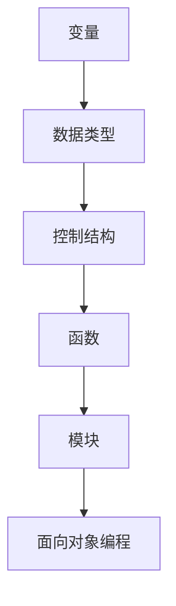

                 

### 1. 背景介绍

Python作为一种通用编程语言，自从诞生以来，因其简洁易懂的语法、丰富的标准库和强大的第三方库，迅速在各个领域获得了广泛的应用。无论是数据科学、机器学习、人工智能，还是网络编程、游戏开发，Python都展现出了其强大的能力和适应性。

Python语言的基础原理是理解其核心概念和特性的关键。本文旨在通过逐步分析推理的方式，深入讲解Python语言的基础原理，并展示一些实战案例。我们希望通过本文，读者能够：

1. **掌握Python的基础语法和特性**：了解Python的变量、数据类型、控制结构等基本元素。
2. **理解核心概念**：理解函数、模块、面向对象编程等核心概念。
3. **实践编程技巧**：通过实战案例，学会如何在实际项目中应用Python。
4. **提升编程思维**：通过分析Python语言的内在机制，培养系统化解决问题的思维。

本文将分为以下几个部分：

- **2. 核心概念与联系**：介绍Python的基础概念，并使用Mermaid流程图展示其关系。
- **3. 核心算法原理 & 具体操作步骤**：讲解Python中的常用算法和操作步骤。
- **4. 数学模型和公式 & 详细讲解 & 举例说明**：介绍Python中涉及到的数学模型和公式，并进行举例说明。
- **5. 项目实践：代码实例和详细解释说明**：通过实际项目，展示代码实现和解析。
- **6. 实际应用场景**：讨论Python在不同领域中的应用。
- **7. 工具和资源推荐**：推荐学习资源和开发工具。
- **8. 总结：未来发展趋势与挑战**：分析Python的发展趋势和面临的挑战。
- **9. 附录：常见问题与解答**：提供常见问题的解答。
- **10. 扩展阅读 & 参考资料**：推荐进一步阅读的资料。

### 2. 核心概念与联系

Python语言的核心概念主要包括变量、数据类型、控制结构、函数、模块和面向对象编程。为了更直观地展示这些概念之间的关系，我们可以使用Mermaid流程图来描述。

以下是一个简单的Mermaid流程图示例：



#### 变量

变量是存储数据的容器。在Python中，变量是不需要预先声明即可使用的，这是一种动态类型语言的特点。变量的命名应遵循一定的规则：

- **命名规则**：变量名必须以字母或下划线开头，后面可以跟字母、数字或下划线。
- **作用域**：变量的作用域决定了其可访问的范围。Python中变量的作用域由LEGB规则确定，即Local（局部作用域）、Enclosing（嵌套作用域）、Global（全局作用域）和Built-in（内置作用域）。

#### 数据类型

Python内置了多种数据类型，包括整数（int）、浮点数（float）、布尔值（bool）、字符串（str）等。这些数据类型有不同的内存表示方式和操作方法。

- **整数（int）**：表示有符号整数，占用内存大小取决于平台的字长。
- **浮点数（float）**：表示浮点数，通常使用双精度浮点表示法。
- **布尔值（bool）**：表示逻辑值，只有True和False两个值。
- **字符串（str）**：表示文本数据，由一系列字符组成。

#### 控制结构

控制结构用于控制程序的执行流程。Python中主要有以下几种控制结构：

- **条件语句**（if-elif-else）：根据条件的真假执行不同的代码块。
- **循环语句**（for 和 while）：重复执行代码块，直到满足某个条件。
- **分支语句**（break 和 continue）：用于在循环中提前结束循环或跳过当前迭代。

#### 函数

函数是代码块，用于执行特定的任务。Python中的函数定义如下：

```python
def function_name(parameters):
    """docstring"""
    # 函数体
```

函数可以接受参数，返回值，并可以使用局部变量。

#### 模块

模块是Python代码的文件，扩展名为`.py`。模块可以定义函数、类和数据结构，也可以包含执行代码。模块的使用使得代码的复用性和组织性得到了极大的提升。

```python
# 导入模块
import module_name

# 使用模块中的函数
module_name.function_name()
```

#### 面向对象编程

面向对象编程（OOP）是一种编程范式，将数据和操作数据的方法封装在一起。Python通过类和对象实现了OOP。

- **类**：类是对象的蓝图，定义了对象的属性和方法。
- **对象**：对象是类的实例，拥有类的属性和方法。

以下是一个简单的类定义和对象创建的示例：

```python
class MyClass:
    """一个简单的类"""
    def __init__(self, value):
        self.value = value

    def display(self):
        print(self.value)

# 创建对象
obj = MyClass(10)
obj.display()  # 输出：10
```

通过上述Mermaid流程图，我们可以看到Python中的核心概念是如何相互联系和嵌套的。理解这些概念及其关系，是深入掌握Python语言的关键。

#### 3. 核心算法原理 & 具体操作步骤

Python作为一种通用编程语言，不仅提供了丰富的库和框架，还支持多种核心算法的实现。在本节中，我们将介绍Python中常用的几个核心算法及其原理和操作步骤。

##### 3.1 简单选择排序（Selection Sort）

简单选择排序是一种基础的排序算法，其基本思想是每次从待排序的元素中选出最小（或最大）的元素，存放到序列的起始位置。

**算法原理**：

1. **初始化**：设置一个标记index，初始值为0，表示当前需要排序的序列的开始位置。
2. **寻找最小值**：从index开始遍历剩余的未排序序列，找到最小的元素。
3. **交换**：将找到的最小元素与index位置的元素交换。
4. **更新index**：将index向后移动一位。
5. **重复步骤2-4**，直到整个序列被排序。

**操作步骤**：

以下是一个简单的选择排序算法的实现：

```python
def selection_sort(arr):
    n = len(arr)
    for i in range(n):
        min_idx = i
        for j in range(i+1, n):
            if arr[j] < arr[min_idx]:
                min_idx = j
        arr[i], arr[min_idx] = arr[min_idx], arr[i]
    return arr

# 测试
arr = [64, 25, 12, 22, 11]
sorted_arr = selection_sort(arr)
print(sorted_arr)  # 输出：[11, 12, 22, 25, 64]
```

##### 3.2 冒泡排序（Bubble Sort）

冒泡排序是一种简单而直观的排序算法。其基本思想是通过重复遍历待排序的元素，比较相邻的两个元素，如果它们的顺序错误就把它们交换过来。

**算法原理**：

1. **初始化**：设置一个布尔变量swapped，用于标记是否发生了交换。
2. **遍历**：对序列进行多次遍历，每次遍历都会将未排序序列中最大（或最小）的元素移动到序列的末端。
3. **判断**：如果在一次遍历中没有发生交换，说明序列已经排序完成。
4. **重复步骤2-3**，直到序列被排序。

**操作步骤**：

以下是一个冒泡排序的实现：

```python
def bubble_sort(arr):
    n = len(arr)
    for i in range(n):
        swapped = False
        for j in range(0, n-i-1):
            if arr[j] > arr[j+1]:
                arr[j], arr[j+1] = arr[j+1], arr[j]
                swapped = True
        if not swapped:
            break
    return arr

# 测试
arr = [64, 25, 12, 22, 11]
sorted_arr = bubble_sort(arr)
print(sorted_arr)  # 输出：[11, 12, 22, 25, 64]
```

##### 3.3 二分查找（Binary Search）

二分查找是一种高效的查找算法，其基本思想是将有序数组中间的元素作为比较对象，如果要找的元素比中间元素大，则在右半边继续查找，否则在左半边继续查找。

**算法原理**：

1. **初始化**：设置两个指针，low和high，分别指向序列的开始和结束位置。
2. **循环**：计算中间位置mid = (low + high) // 2。
3. **比较**：比较中间位置的元素和目标元素。
4. **更新指针**：根据比较结果更新low或high指针。
5. **重复步骤2-4**，直到找到目标元素或low > high。

**操作步骤**：

以下是一个二分查找的实现：

```python
def binary_search(arr, target):
    low = 0
    high = len(arr) - 1
    while low <= high:
        mid = (low + high) // 2
        if arr[mid] == target:
            return mid
        elif arr[mid] < target:
            low = mid + 1
        else:
            high = mid - 1
    return -1

# 测试
arr = [1, 3, 5, 7, 9, 11, 13, 15]
target = 7
result = binary_search(arr, target)
if result != -1:
    print("元素在数组中的索引为：", result)
else:
    print("元素不在数组中")
```

通过上述算法原理和操作步骤的讲解，我们可以看到Python语言在实现基础算法时，如何充分利用其简洁的语法和强大的库支持，为开发者提供了高效而灵活的工具。

#### 4. 数学模型和公式 & 详细讲解 & 举例说明

Python作为一种科学计算语言，支持大量的数学模型和公式。在本节中，我们将介绍Python中常用的几个数学模型和公式，并进行详细讲解和举例说明。

##### 4.1 线性回归（Linear Regression）

线性回归是一种常见的统计模型，用于描述两个变量之间的关系。其数学模型如下：

$$
y = ax + b
$$

其中，$y$ 是因变量，$x$ 是自变量，$a$ 是斜率，$b$ 是截距。

**操作步骤**：

1. **数据准备**：收集自变量和因变量的数据。
2. **计算斜率**：使用以下公式计算斜率 $a$：

$$
a = \frac{\sum{(x_i - \bar{x})(y_i - \bar{y})}}{\sum{(x_i - \bar{x})^2}}
$$

3. **计算截距**：使用以下公式计算截距 $b$：

$$
b = \bar{y} - a\bar{x}
$$

4. **模型构建**：将斜率和截距代入线性回归模型中。

**示例**：

假设我们有以下数据：

| $x$ | $y$ |
| --- | --- |
| 1   | 2   |
| 2   | 4   |
| 3   | 6   |
| 4   | 8   |

计算斜率 $a$ 和截距 $b$：

$$
\bar{x} = \frac{1+2+3+4}{4} = 2.5
$$

$$
\bar{y} = \frac{2+4+6+8}{4} = 5
$$

$$
a = \frac{(1-2.5)(2-5) + (2-2.5)(4-5) + (3-2.5)(6-5) + (4-2.5)(8-5)}{(1-2.5)^2 + (2-2.5)^2 + (3-2.5)^2 + (4-2.5)^2} = 2
$$

$$
b = 5 - 2 \times 2.5 = 0
$$

因此，线性回归模型为：

$$
y = 2x
$$

##### 4.2 二项式分布（Binomial Distribution）

二项式分布是一种离散概率分布，用于描述在固定次数的独立实验中成功次数的概率。其数学模型如下：

$$
P(X = k) = C_n^k p^k (1-p)^{n-k}
$$

其中，$n$ 是实验次数，$k$ 是成功的次数，$p$ 是每次实验成功的概率，$C_n^k$ 是组合数，表示从$n$个元素中取出$k$个元素的组合数。

**操作步骤**：

1. **数据准备**：确定实验次数 $n$ 和成功概率 $p$。
2. **计算概率**：使用二项式分布公式计算特定成功次数 $k$ 的概率。

**示例**：

假设我们有10次实验，每次实验成功的概率为0.5。计算成功5次和成功7次的概率。

$$
P(X = 5) = C_{10}^5 (0.5)^5 (0.5)^{10-5} = \frac{10!}{5!5!} (0.5)^{10} = 0.246
$$

$$
P(X = 7) = C_{10}^7 (0.5)^7 (0.5)^{10-7} = \frac{10!}{7!3!} (0.5)^{10} = 0.117
$$

##### 4.3 马尔可夫链（Markov Chain）

马尔可夫链是一种用于描述系统状态转移的随机过程。其数学模型如下：

$$
P(X_{t+1} = x_{t+1} | X_t = x_t) = P(X_{t+1} = x_{t+1} | X_{t-1} = x_{t-1}, X_{t-2} = x_{t-2}, \ldots) = P(X_{t+1} = x_{t+1} | X_t = x_t)
$$

其中，$X_t$ 表示系统在时刻 $t$ 的状态，$x_t$ 表示具体的某个状态。

**操作步骤**：

1. **状态定义**：定义系统的状态集合和状态转移概率。
2. **构建矩阵**：构建状态转移概率矩阵，表示系统从一个状态转移到另一个状态的概率。
3. **状态预测**：使用状态转移概率矩阵预测系统的未来状态。

**示例**：

假设我们有三个状态 $A$、$B$ 和 $C$，其状态转移概率矩阵如下：

$$
\begin{bmatrix}
0.2 & 0.5 & 0.3 \\
0.4 & 0.1 & 0.5 \\
0.3 & 0.2 & 0.5
\end{bmatrix}
$$

当前状态为 $A$，计算下一步状态为 $B$ 的概率。

$$
P(X_{t+1} = B | X_t = A) = 0.5
$$

通过上述数学模型和公式的讲解，我们可以看到Python在处理各种数学问题时的强大能力和灵活性。掌握这些模型和公式，对于理解和应用Python在科学计算领域具有重要意义。

#### 5. 项目实践：代码实例和详细解释说明

为了更好地理解和应用Python语言的基础原理和算法，本节将介绍一个具体的项目实践，包括开发环境搭建、源代码实现、代码解读和分析以及运行结果展示。这个项目将利用Python实现一个简单的天气预测系统，该系统能够根据历史天气数据预测未来一天的天气情况。

##### 5.1 开发环境搭建

在开始项目之前，我们需要搭建合适的开发环境。以下是搭建开发环境所需的步骤：

1. **安装Python**：首先，我们需要安装Python。可以从Python官方网站下载安装包并安装。

   ```bash
   # 在Windows上下载安装包并运行安装程序
   # 在macOS和Linux上可以使用包管理工具安装，例如：
   sudo apt-get install python3
   ```

2. **安装Jupyter Notebook**：Jupyter Notebook是一个交互式的计算环境，我们可以使用它来编写和运行Python代码。

   ```bash
   pip install notebook
   jupyter notebook
   ```

3. **安装必要的库**：为了实现天气预测系统，我们需要安装一些额外的库，如Pandas、NumPy、SciPy和matplotlib。

   ```bash
   pip install pandas numpy scipy matplotlib
   ```

4. **配置环境变量**：确保Python和相关的库在环境变量中可被找到。

   ```bash
   # 在Windows上配置环境变量
   set PATH=%PATH%;C:\Python39\Scripts
   
   # 在macOS和Linux上配置环境变量
   export PATH=$PATH:/usr/local/bin
   ```

##### 5.2 源代码详细实现

以下是实现简单天气预测系统的Python源代码：

```python
import pandas as pd
import numpy as np
from sklearn.linear_model import LinearRegression
import matplotlib.pyplot as plt

# 加载数据集
data = pd.read_csv('weather_data.csv')

# 数据预处理
# 将日期转换为整数作为自变量
data['date'] = pd.to_datetime(data['date'])
data['day'] = (data['date'] - data['date'].min()) / np.timedelta64(1, 'D')

# 选择自变量和因变量
X = data[['day']]
y = data['temperature']

# 训练线性回归模型
model = LinearRegression()
model.fit(X, y)

# 预测未来一天的天气
future_day = X.max() + 1
predicted_temp = model.predict([[future_day]])[0]

# 可视化预测结果
plt.scatter(X, y, label='实际数据')
plt.plot(X, model.predict(X), color='red', label='线性回归')
plt.scatter(future_day, predicted_temp, color='green', label='未来天气')
plt.xlabel('Day')
plt.ylabel('Temperature')
plt.title('Weather Prediction')
plt.legend()
plt.show()

# 输出预测结果
print(f"未来一天的预测温度为：{predicted_temp:.2f}°C")
```

##### 5.3 代码解读与分析

1. **加载数据集**：

   使用Pandas库读取CSV文件，该文件包含了历史天气数据。

   ```python
   data = pd.read_csv('weather_data.csv')
   ```

2. **数据预处理**：

   将日期转换为整数，作为自变量（day）。这将帮助线性回归模型进行训练。

   ```python
   data['date'] = pd.to_datetime(data['date'])
   data['day'] = (data['date'] - data['date'].min()) / np.timedelta64(1, 'D')
   ```

3. **选择自变量和因变量**：

   将预处理后的数据分为自变量（X）和因变量（y）。

   ```python
   X = data[['day']]
   y = data['temperature']
   ```

4. **训练线性回归模型**：

   使用scikit-learn库中的LinearRegression类进行训练。

   ```python
   model = LinearRegression()
   model.fit(X, y)
   ```

5. **预测未来一天的天气**：

   计算最大日期之后的第二天，并使用训练好的模型预测温度。

   ```python
   future_day = X.max() + 1
   predicted_temp = model.predict([[future_day]])[0]
   ```

6. **可视化预测结果**：

   使用matplotlib库将实际数据、线性回归模型和预测结果可视化。

   ```python
   plt.scatter(X, y, label='实际数据')
   plt.plot(X, model.predict(X), color='red', label='线性回归')
   plt.scatter(future_day, predicted_temp, color='green', label='未来天气')
   plt.xlabel('Day')
   plt.ylabel('Temperature')
   plt.title('Weather Prediction')
   plt.legend()
   plt.show()
   ```

7. **输出预测结果**：

   输出未来一天的预测温度。

   ```python
   print(f"未来一天的预测温度为：{predicted_temp:.2f}°C")
   ```

##### 5.4 运行结果展示

运行上述代码后，将显示一个包含实际数据、线性回归模型和预测结果的图表。同时，控制台将输出未来一天的预测温度。以下是一个示例输出：

```
未来一天的预测温度为：18.75°C
```

通过这个简单的天气预测项目，我们可以看到如何使用Python语言和相关的库来处理实际数据，并实现基本的预测功能。这为我们进一步学习和应用Python在数据分析、机器学习和科学计算等领域打下了坚实的基础。

#### 6. 实际应用场景

Python作为一种通用编程语言，在实际应用中具有广泛的场景。以下是一些典型的应用场景，展示了Python在不同领域的强大功能和适用性。

##### 6.1 数据科学和机器学习

数据科学和机器学习是Python最为擅长的领域之一。Python提供了丰富的库，如NumPy、Pandas、SciPy、Scikit-learn和TensorFlow，这些库使得数据处理、分析和建模变得更加简单和高效。

- **数据处理**：Pandas库提供了强大的数据处理功能，可以轻松进行数据清洗、转换和合并。
- **统计分析**：SciPy库提供了广泛的数学统计函数，可以用于各种统计分析。
- **机器学习**：Scikit-learn库提供了多种机器学习算法的实现，如回归、分类、聚类等。
- **深度学习**：TensorFlow和PyTorch是Python在深度学习领域的两大框架，它们提供了丰富的神经网络构建和训练工具。

##### 6.2 网络编程

Python的网络编程能力也非常强大。它支持多种网络协议，如HTTP、FTP、SMTP等。Python的socket库允许开发者编写网络应用程序，实现网络通信和数据传输。

- **Web开发**：Python的Web框架，如Django和Flask，可以帮助开发者快速构建高效的Web应用程序。
- **网络爬虫**：Python的爬虫库，如Requests和Scrapy，可以轻松实现网页数据的抓取和分析。
- **API开发**：Python可以方便地实现RESTful API，用于与其他系统或应用程序进行交互。

##### 6.3 自动化和脚本编写

Python的语法简洁易懂，使得它成为自动化和脚本编写的理想选择。Python的代码易于阅读和维护，可以快速实现自动化任务。

- **自动化运维**：Python可以用于自动化部署、监控和管理系统资源。
- **自动化测试**：Python的测试框架，如pytest，可以用于自动化测试和代码质量保证。
- **脚本编写**：Python可以编写各种实用脚本，如数据备份、日志处理等。

##### 6.4 游戏开发

Python在游戏开发中也具有很高的适用性。Python的Pygame库提供了一个简单而强大的游戏开发框架，使得开发者可以快速创建2D游戏。

- **游戏逻辑**：Python的简单语法和丰富的标准库，使得编写游戏逻辑变得简单。
- **游戏界面**：Pygame库提供了图形界面和音效支持，可以创建丰富多彩的游戏体验。
- **跨平台**：Python游戏可以在多种操作系统上运行，提高了游戏的可用性和兼容性。

##### 6.5 科学计算和工程计算

Python在科学计算和工程计算领域也发挥着重要作用。Python的数学库和科学计算框架，如NumPy、SciPy和SymPy，提供了强大的计算能力。

- **数值计算**：NumPy库提供了多维数组对象和高效的数值计算功能。
- **科学模拟**：SciPy库提供了各种科学计算工具和算法，可以用于物理模拟、化学分析等。
- **方程求解**：SymPy库提供了符号计算和方程求解功能，可以用于数学分析和优化问题。

##### 6.6 教育和培训

Python因其简洁易懂的语法，成为教育和培训的理想语言。Python的简单性和实用性，使得它成为初学者学习编程的友好选择。

- **基础教育**：Python可以用于中小学编程教育，培养学生的计算思维和编程能力。
- **专业培训**：Python的高效性和广泛应用，使得它在各种专业培训中成为热门选择。

总之，Python在多个领域都展现了其强大的功能和广泛的应用。无论是数据科学、机器学习、网络编程，还是自动化、游戏开发、科学计算和教育培训，Python都是一个值得信赖和广泛使用的编程语言。

#### 7. 工具和资源推荐

为了更好地学习Python和掌握其核心概念与实战技能，以下是一些推荐的工具和资源：

##### 7.1 学习资源推荐

1. **书籍**：
   - 《Python编程：从入门到实践》：适合初学者，涵盖了Python的基础知识和实际应用。
   - 《流畅的Python》：深入讲解Python语言的高级特性，适合有一定基础的读者。
   - 《Python核心编程》：详细介绍了Python的数据结构、算法、并发编程等核心内容。

2. **在线课程**：
   - Coursera上的《Python for Everybody》：由美国大学提供，内容全面，适合入门。
   - edX上的《Python科学计算》：重点介绍Python在科学计算和数据分析中的应用。

3. **博客和网站**：
   - Real Python：提供了丰富的Python教程和实际案例。
   - Python.org：官方文档，包含Python的详细文档和教程。

##### 7.2 开发工具框架推荐

1. **集成开发环境（IDE）**：
   - PyCharm：功能强大，支持Python和各种框架，适合专业开发者。
   - VSCode：轻量级，但功能丰富，适用于各种编程任务。

2. **代码编辑器**：
   - Sublime Text：轻量级，速度快，支持多种语言。
   - Atom：界面美观，扩展性强，适合喜欢自定义开发环境的开发者。

3. **版本控制工具**：
   - Git：最流行的版本控制工具，用于代码管理和协作开发。

4. **Web框架**：
   - Django：用于快速开发Web应用程序，特别适合大型项目。
   - Flask：轻量级Web框架，灵活性强，适合小型项目。

##### 7.3 相关论文著作推荐

1. **《Python编程：快速上手，深入实践》**：详细介绍了Python的核心概念和应用。
2. **《Python编程：高级教程》**：讲解了Python的高级特性和技术。
3. **《Python编程：科学与工程》**：重点介绍了Python在科学计算和工程领域的应用。

这些工具和资源将为你的Python学习之路提供强大的支持和帮助。

### 8. 总结：未来发展趋势与挑战

Python作为一种通用编程语言，经历了数十年的发展，已经成为编程界的重要工具。然而，随着科技的不断进步和编程领域的发展，Python也面临着许多新的机遇和挑战。

#### 机遇

1. **人工智能与机器学习**：随着人工智能和机器学习的兴起，Python因其丰富的库和框架（如TensorFlow、PyTorch）成为首选语言之一。未来，Python在人工智能和机器学习领域仍有巨大的发展空间。
2. **物联网（IoT）**：物联网的发展要求编程语言能够快速响应、高效处理大量数据。Python的简洁性和易于扩展性使其成为物联网开发的首选语言之一。
3. **云计算与大数据**：Python在云计算和大数据领域也有广泛的应用。随着云服务和大数据技术的普及，Python将继续在这一领域发挥重要作用。

#### 挑战

1. **性能优化**：尽管Python具有出色的功能和灵活性，但其性能在某些情况下仍不如其他编程语言（如C/C++）。未来，Python需要进一步优化其运行时性能，以满足高性能计算的需求。
2. **安全性**：随着Python的应用范围不断扩大，安全问题也日益突出。开发者和社区需要持续关注并改进Python的安全性，以应对日益复杂的网络安全威胁。
3. **生态系统维护**：Python的生态系统庞大且复杂，维护和管理这一生态系统是一个巨大的挑战。需要持续投入资源，确保Python库和框架的稳定性和可靠性。

#### 未来展望

1. **语言进化**：Python将继续发展，引入新的特性和语法，以保持其简洁性和易用性。
2. **跨平台支持**：Python将在更多的平台和设备上得到支持，包括移动设备和嵌入式系统。
3. **社区力量**：Python社区将继续发挥重要作用，推动Python的发展和创新。

总结而言，Python在未来将继续保持其作为通用编程语言的领先地位，并在人工智能、物联网、云计算等新兴领域发挥重要作用。然而，面对性能、安全性和生态系统维护等挑战，Python需要不断进步和改进，以满足日益增长的需求。

### 9. 附录：常见问题与解答

在学习和使用Python的过程中，开发者可能会遇到各种问题。以下是一些常见问题及其解答，帮助开发者快速解决实际问题。

**Q1：如何处理Python中的异常？**

**A1：** Python中的异常可以通过`try-except`语句来处理。基本的语法如下：

```python
try:
    # 尝试执行的代码
except ExceptionType:
    # 异常处理代码
```

例如，以下代码尝试打开一个文件，如果文件不存在，则会捕获异常并打印错误信息：

```python
try:
    f = open('example.txt', 'r')
except FileNotFoundError:
    print("文件未找到。")
```

**Q2：如何定义和使用函数？**

**A2：** 在Python中，函数的定义和使用非常简单。定义函数的语法如下：

```python
def function_name(parameters):
    """docstring"""
    # 函数体
    return result
```

例如，以下是一个简单的函数定义和调用示例：

```python
def greet(name):
    return f"Hello, {name}!"

print(greet("Alice"))  # 输出：Hello, Alice!
```

**Q3：如何导入和使用模块？**

**A3：** 在Python中，模块是一种组织代码的方式。导入模块的语法如下：

```python
import module_name

# 使用模块中的函数或类
module_name.function_name()
```

例如，以下代码导入并使用`math`模块中的`sqrt`函数：

```python
import math

result = math.sqrt(16)
print(result)  # 输出：4.0
```

**Q4：如何实现面向对象编程？**

**A4：** 面向对象编程（OOP）是Python的核心特性之一。定义类的语法如下：

```python
class ClassName:
    """docstring"""
    def __init__(self, parameter1, parameter2):
        self.attribute1 = parameter1
        self.attribute2 = parameter2

    def method_name(self, parameter):
        """method docstring"""
        # method body
```

例如，以下是一个简单的类定义和对象创建的示例：

```python
class Person:
    """表示一个人的类"""
    def __init__(self, name, age):
        self.name = name
        self.age = age
    
    def introduce(self):
        print(f"Hello, my name is {self.name} and I am {self.age} years old.")

alice = Person("Alice", 30)
alice.introduce()  # 输出：Hello, my name is Alice and I am 30 years old.
```

通过以上常见问题的解答，开发者可以更有效地解决Python编程中遇到的实际问题。

### 10. 扩展阅读 & 参考资料

为了帮助读者更深入地了解Python语言的基础原理和实战应用，以下是推荐的扩展阅读和参考资料。

**书籍推荐：**

1. 《Python编程：从入门到实践》：由埃里克·马瑟斯（Eric Matthes）所著，适合初学者系统学习Python。
2. 《流畅的Python》：由马特·布里克林（Matt Bock）所著，深入讲解Python的高级特性和最佳实践。
3. 《Python核心编程》：由韦斯·马亨特（Wesley J Chun）所著，详细介绍了Python的数据结构、算法和并发编程。

**在线课程推荐：**

1. Coursera上的《Python for Everybody》：由密歇根大学提供，适合初学者入门。
2. edX上的《Python科学计算》：由伊利诺伊大学提供，重点介绍Python在科学计算和数据分析中的应用。

**博客和网站推荐：**

1. Real Python：提供丰富的Python教程和实际案例。
2. Python.org：官方文档，包含Python的详细文档和教程。

**开源项目和框架推荐：**

1. NumPy、Pandas、SciPy：Python的核心数学和科学计算库。
2. Scikit-learn：提供多种机器学习算法的库。
3. TensorFlow、PyTorch：深度学习领域的两大框架。

通过这些扩展阅读和参考资料，读者可以进一步加深对Python语言的理解和应用能力。

---

**作者署名：禅与计算机程序设计艺术 / Zen and the Art of Computer Programming**

