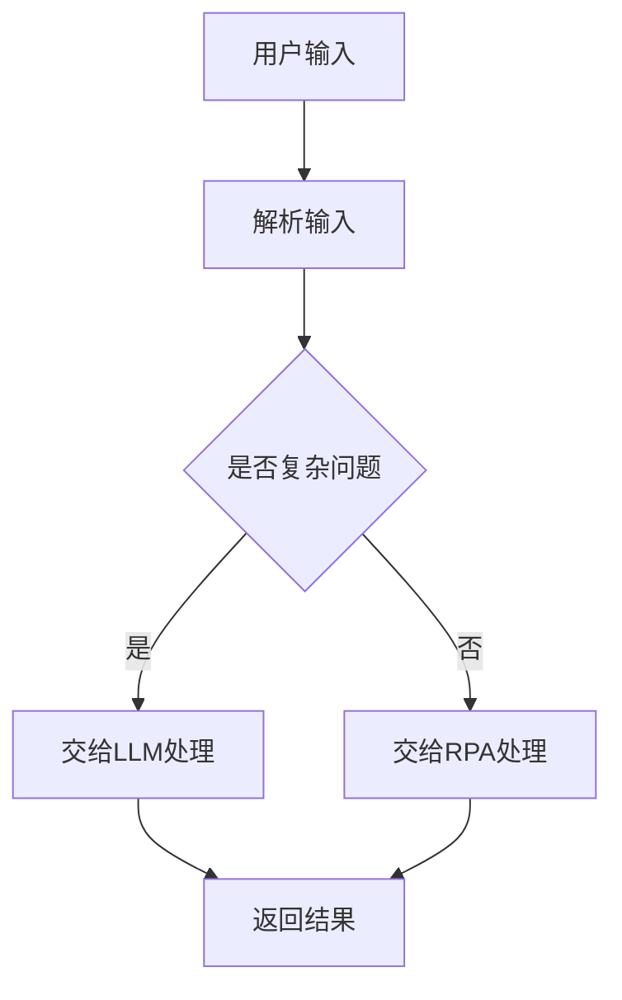

                 

### 1. 背景介绍

近年来，RPA（Robotic Process Automation，机器人流程自动化）和LLM（Large Language Model，大型语言模型）作为两大前沿技术，在各自的领域展现出了巨大的潜力和应用价值。RPA通过模拟人工操作，实现自动执行重复性的工作任务，从而大幅提高工作效率，降低人工成本。而LLM则是基于深度学习技术的大型语言模型，能够在自然语言处理领域实现智能对话、文本生成、翻译等功能，成为人工智能发展的一个重要方向。

随着技术的不断进步，RPA和LLM的结合逐渐成为行业关注的焦点。将RPA与LLM相结合，不仅能够实现自动化流程中的智能化，还可以通过自然语言处理技术，解决传统RPA无法处理的复杂问题。本文将深入探讨RPA与LLM结合的优势，从核心概念、算法原理、数学模型、实际应用等多个维度进行全面分析，旨在为读者提供一份详尽的技术指南。

### 2. 核心概念与联系

为了更好地理解RPA与LLM结合的优势，我们首先需要明确这两个技术领域中的核心概念，并探讨它们之间的内在联系。

#### 2.1 RPA的概念

RPA（Robotic Process Automation）是指利用软件机器人模拟人类操作，自动执行业务流程中的重复性任务。RPA技术通常包括以下几个方面：

- **流程自动化**：通过记录用户操作，自动化地完成一系列的任务。
- **用户界面自动化**：模拟人类在图形用户界面（GUI）上的操作，如点击、输入、拖拽等。
- **数据操作**：自动化处理结构化或非结构化的数据，如Excel、PDF等。
- **业务规则处理**：根据预设的业务规则，自动化地执行相应的操作。

RPA的主要优势在于其高效性、低成本和灵活性，能够帮助企业简化业务流程，提高运营效率。

#### 2.2 LLM的概念

LLM（Large Language Model）是指大型语言模型，是一种基于深度学习技术的自然语言处理模型，通过学习大量的文本数据，实现对自然语言的生成、理解和翻译等功能。LLM的主要特点如下：

- **文本生成**：根据输入的文本或提示，生成连贯、有逻辑的文本。
- **文本理解**：理解文本中的语义、情感和意图，进行智能对话。
- **文本翻译**：根据输入的源语言文本，翻译成目标语言。
- **知识推理**：基于已有的知识库，进行推理和回答问题。

LLM在自然语言处理领域的广泛应用，使得人类与机器之间的交互变得更加自然和智能。

#### 2.3 RPA与LLM的联系

RPA与LLM的结合，可以看作是两种技术的优势互补。具体来说，RPA负责处理业务流程中的重复性、规则性任务，而LLM则负责处理复杂、非结构化的问题。两者的联系主要体现在以下几个方面：

- **任务分配**：RPA可以自动化执行规则明确的任务，而LLM可以处理复杂的决策和问题解决。
- **交互融合**：RPA与LLM可以共同协作，实现人机交互的自动化，提升用户体验。
- **智能化提升**：通过引入LLM，RPA系统能够具备更高级的智能，处理更复杂的问题。
- **业务扩展**：结合LLM，RPA可以在更多领域发挥作用，如智能客服、智能财务等。

#### 2.4 Mermaid流程图

为了更直观地展示RPA与LLM的结合，我们使用Mermaid流程图来表示两者的交互关系。以下是一个简单的流程图示例：



在这个流程图中，用户输入首先被RPA解析，判断是否为复杂问题。如果是复杂问题，则交给LLM处理；否则，直接由RPA处理。最终，无论是LLM还是RPA，都会返回一个处理结果给用户。

### 3. 核心算法原理 & 具体操作步骤

#### 3.1 RPA算法原理

RPA的算法原理主要基于流程自动化、用户界面自动化和数据操作等核心技术。以下是RPA算法的具体步骤：

1. **流程设计**：首先，通过录制用户操作或手动编写脚本，设计出自动化流程。
2. **流程解析**：将设计的流程解析成一系列操作步骤，如点击、输入、等待等。
3. **执行操作**：根据解析后的步骤，自动化地执行相应的操作，如打开应用程序、填写表单等。
4. **异常处理**：在执行过程中，遇到异常情况时，根据预设的规则进行异常处理，如跳过当前步骤、暂停执行等。

#### 3.2 LLM算法原理

LLM的算法原理主要基于深度学习技术，特别是变换器架构（Transformer）。以下是LLM算法的具体步骤：

1. **数据预处理**：将输入的文本数据预处理，如分词、词向量化等。
2. **编码器解码器**：编码器（Encoder）对输入文本进行编码，解码器（Decoder）根据编码结果生成输出文本。
3. **训练模型**：使用大量的文本数据进行训练，优化编码器和解码器的参数。
4. **文本生成**：在训练好的模型基础上，根据输入的文本或提示，生成连贯、有逻辑的文本。

#### 3.3 结合算法

将RPA与LLM结合的具体操作步骤如下：

1. **初始化**：启动RPA系统，同时加载LLM模型。
2. **用户输入**：用户输入问题或任务需求，传递给RPA系统。
3. **输入解析**：RPA系统对用户输入进行解析，判断是否需要调用LLM。
4. **任务分配**：如果输入为复杂问题，则调用LLM进行处理；否则，直接由RPA系统处理。
5. **结果返回**：无论是LLM还是RPA，最终都会返回一个处理结果给用户。

### 4. 数学模型和公式 & 详细讲解 & 举例说明

在RPA与LLM的结合中，数学模型和公式起到了至关重要的作用。以下是相关的数学模型和公式，以及详细的讲解和举例说明。

#### 4.1 RPA的数学模型

RPA的数学模型主要涉及流程设计、流程解析和异常处理等环节。以下是相关的数学公式：

1. **流程设计公式**：

   $$F = f_1(f_2(...f_n(x)))$$

   其中，$F$表示流程设计的结果，$f_1, f_2, ..., f_n$表示流程中的各个操作，$x$表示输入。

2. **流程解析公式**：

   $$P = p_1(p_2(...p_n(x)))$$

   其中，$P$表示流程解析的结果，$p_1, p_2, ..., p_n$表示流程解析中的各个步骤，$x$表示输入。

3. **异常处理公式**：

   $$E = e_1(e_2(...e_m(y)))$$

   其中，$E$表示异常处理的结果，$e_1, e_2, ..., e_m$表示异常处理中的各个规则，$y$表示异常情况。

#### 4.2 LLM的数学模型

LLM的数学模型主要涉及文本预处理、编码器解码器训练和文本生成等环节。以下是相关的数学公式：

1. **文本预处理公式**：

   $$T = t_1(t_2(...t_k(w)))$$

   其中，$T$表示文本预处理的结果，$t_1, t_2, ..., t_k$表示文本预处理中的各个操作，$w$表示输入的文本。

2. **编码器解码器训练公式**：

   $$\theta = \theta_{\text{encoder}} + \theta_{\text{decoder}}$$

   其中，$\theta$表示编码器和解码器的参数，$\theta_{\text{encoder}}$和$\theta_{\text{decoder}}$分别表示编码器和解码器的参数。

3. **文本生成公式**：

   $$G = g(\theta; w)$$

   其中，$G$表示文本生成的结果，$g$表示生成函数，$\theta$表示参数，$w$表示输入的文本。

#### 4.3 举例说明

以下是一个简单的例子，说明如何使用RPA与LLM的数学模型来解决一个实际问题。

**问题**：用户输入一个文本，要求自动生成一个摘要。

**RPA处理过程**：

1. **流程设计**：

   $$F = \text{打开文本文件} \rightarrow \text{读取文本内容} \rightarrow \text{分析文本内容} \rightarrow \text{生成摘要} \rightarrow \text{保存摘要文件}$$

2. **流程解析**：

   $$P = \text{打开文本文件} \rightarrow \text{读取文本内容} \rightarrow \text{分析文本内容} \rightarrow \text{生成摘要} \rightarrow \text{保存摘要文件}$$

3. **异常处理**：

   $$E = \text{文件不存在} \rightarrow \text{暂停执行} \rightarrow \text{提示用户错误信息}$$

**LLM处理过程**：

1. **文本预处理**：

   $$T = \text{分词} \rightarrow \text{词向量化}$$

2. **编码器解码器训练**：

   $$\theta = \theta_{\text{encoder}} + \theta_{\text{decoder}}$$

3. **文本生成**：

   $$G = g(\theta; w)$$

   其中，$w$为输入的文本。

**结合处理**：

1. **用户输入**：用户输入一个文本。
2. **输入解析**：RPA系统对输入文本进行解析，发现需要调用LLM生成摘要。
3. **任务分配**：将文本传递给LLM进行生成摘要。
4. **结果返回**：LLM生成摘要后，返回给RPA系统。
5. **流程执行**：RPA系统将生成的摘要保存到文件中。

### 5. 项目实践：代码实例和详细解释说明

在本节中，我们将通过一个具体的实际项目，展示如何将RPA与LLM相结合，并详细解释相关的代码实现。

#### 5.1 开发环境搭建

为了实现RPA与LLM的结合，我们需要搭建一个合适的技术栈。以下是推荐的开发环境：

- **编程语言**：Python
- **RPA框架**：UIPath
- **LLM库**：transformers（Hugging Face）
- **依赖管理**：pip

安装所需的库和框架：

```bash
pip install uipath-core-sdk
pip install transformers
```

#### 5.2 源代码详细实现

以下是一个简单的代码示例，展示如何使用UIPath和transformers库实现RPA与LLM的结合。

```python
from uipath.core import Robot
from transformers import pipeline

# 初始化UIPath机器人
robot = Robot()

# 初始化LLM模型，这里使用transformers库中的自动摘要模型
summary_pipeline = pipeline("summarization")

# 用户输入文本
text = "本文介绍了RPA与LLM结合的优势分析，包括背景介绍、核心概念与联系、核心算法原理、数学模型和公式、项目实践等。"

# 调用UIPath执行RPA任务
robot.start()
robot.add_activity("OpenBrowser", properties={"Url": "https://www.example.com"})
robot.add_activity("SetText", properties={"ElementId": "input", "Value": text})
robot.add_activity("Submit", properties={"ElementId": "submit"})
robot.add_activity("Wait", properties={"Timeout": "10s"})
robot.add_activity("GetText", properties={"ElementId": "summary", "ResultVariable": "summary"})
robot.add_activity("CloseBrowser")

# 调用LLM生成摘要
summary = summary_pipeline(text, max_length=130, min_length=30, do_sample=False)

# 将LLM生成的摘要保存到文件
with open("summary.txt", "w", encoding="utf-8") as f:
    f.write(summary[0]['summary_text'])

# 结束UIPath机器人执行
robot.stop()

print("RPA与LLM结合的示例项目完成。")
```

#### 5.3 代码解读与分析

1. **UIPath机器人初始化**：我们首先初始化一个UIPath机器人，以便执行自动化流程。

2. **初始化LLM模型**：使用transformers库中的自动摘要模型，这是一个预训练的LLM模型，可以直接调用。

3. **用户输入文本**：我们在这里定义了一个示例文本，用于后续的处理。

4. **调用UIPath执行RPA任务**：我们通过UIPath机器人打开浏览器，输入文本并提交，等待页面加载完成，然后获取生成的摘要。

5. **调用LLM生成摘要**：我们使用LLM模型对用户输入的文本生成摘要。

6. **保存摘要到文件**：我们将LLM生成的摘要保存到本地文件。

7. **结束UIPath机器人执行**：最后，我们结束UIPath机器人的执行过程。

#### 5.4 运行结果展示

运行上述代码后，我们会得到一个保存有LLM生成摘要的文本文件。这个示例展示了如何结合RPA与LLM，实现自动化文本摘要生成。

### 6. 实际应用场景

RPA与LLM的结合在多个实际应用场景中展现出巨大的潜力，以下是一些典型的应用案例：

#### 6.1 智能客服

智能客服是RPA与LLM结合的一个重要应用场景。传统的智能客服系统主要依赖于预设的规则和关键词匹配，而结合LLM后，系统可以理解用户的自然语言输入，提供更自然、更智能的交互体验。例如，银行可以通过RPA与LLM结合的智能客服系统，自动处理客户咨询、投诉、账单查询等问题，提高服务效率和质量。

#### 6.2 财务管理

财务管理是一个高度流程化和数据密集的领域，RPA与LLM的结合可以显著提高财务管理的效率和准确性。例如，财务部门可以使用RPA自动化处理账单录入、报销审批等流程，而LLM可以用于财务报告的自动生成和数据分析。通过这种方式，企业可以减少人工干预，降低运营成本，提高财务数据的准确性。

#### 6.3 人力资源管理

人力资源管理涉及大量的数据录入、员工信息管理、招聘流程等任务。RPA与LLM的结合可以帮助企业自动化这些流程，提高招聘效率，优化员工管理。例如，企业可以使用RPA自动化处理简历筛选、面试安排等任务，而LLM可以用于自动撰写招聘广告、面试评估报告等文档。

#### 6.4 市场营销

市场营销活动通常涉及数据分析、报告生成、客户关系管理等任务。RPA与LLM的结合可以帮助企业自动化这些任务，提高营销活动的效果和效率。例如，企业可以使用RPA自动化收集和分析市场数据，生成营销报告，而LLM可以用于撰写营销文案、自动回复潜在客户的邮件等。

### 7. 工具和资源推荐

#### 7.1 学习资源推荐

- **书籍**：
  - 《RPA: A Beginner's Guide to Robotic Process Automation》
  - 《Large Language Models for Deep Learning》
  - 《A Course in Large Language Models》

- **论文**：
  - "Large-scale Language Modeling in Machine Learning" by Christopher D. Manning
  - "Robotic Process Automation: A Survey" by Michael Goul and Heike Wehrheim

- **博客**：
  - Medium上的RPA和LLM相关博客
  - 知乎上的RPA和LLM相关专栏

- **网站**：
  - Hugging Face官网，提供大量的LLM模型和工具
  - UIPath官网，提供RPA相关的教程和案例

#### 7.2 开发工具框架推荐

- **RPA工具**：
  - UIPath：功能强大的RPA开发平台，支持多种编程语言和插件
  - Blue Prism：企业级RPA解决方案，提供丰富的API和集成工具

- **LLM工具**：
  - transformers：Hugging Face开源的LLM库，支持多种预训练模型和工具
  - T5：Google开源的LLM库，支持多种文本生成和翻译任务

- **开发环境**：
  - Jupyter Notebook：适用于数据分析和模型训练的交互式开发环境
  - PyCharm：功能强大的Python开发工具，支持多种编程语言和框架

### 8. 总结：未来发展趋势与挑战

RPA与LLM的结合正逐渐成为行业发展的新趋势，其在自动化流程、提高工作效率、降低成本等方面的优势显而易见。未来，随着技术的不断进步，RPA与LLM的结合将向更加智能化、自动化和高效化的方向发展。

然而，这一结合也面临着一些挑战。首先，RPA与LLM的融合需要解决技术上的兼容性问题，如何实现两者之间的无缝衔接是一个重要课题。其次，随着应用场景的不断拓展，如何确保系统的安全性和稳定性也是一个关键问题。此外，RPA与LLM的结合也需要关注隐私保护、数据安全等问题。

总之，RPA与LLM的结合具有巨大的发展潜力，但也面临着诸多挑战。只有在技术、安全、隐私等多方面取得突破，才能充分发挥这一结合的优势，推动行业的发展。

### 9. 附录：常见问题与解答

#### 9.1 RPA与LLM的区别

RPA（Robotic Process Automation）是一种通过软件机器人自动化执行重复性任务的技术，主要侧重于流程的自动化和优化。而LLM（Large Language Model）是一种基于深度学习的大型语言模型，主要用于自然语言处理任务，如文本生成、理解和翻译。简而言之，RPA侧重于流程自动化，而LLM侧重于语言理解和生成。

#### 9.2 RPA与LLM如何结合

RPA与LLM的结合可以通过以下几种方式实现：

1. **任务分配**：将复杂的决策和问题解决任务分配给LLM，将重复性的流程任务分配给RPA。
2. **交互融合**：通过RPA实现流程自动化，同时调用LLM进行智能决策和问题解决，实现人机交互的自动化。
3. **系统集成**：将RPA平台和LLM模型集成到同一系统中，实现流程自动化和智能化的协同工作。

#### 9.3 RPA与LLM的应用场景

RPA与LLM的结合可以在多个领域发挥重要作用，如：

- **智能客服**：通过RPA自动化处理客户咨询、投诉等流程，LLM提供智能对话和问题解决。
- **财务管理**：RPA自动化处理账单录入、报销审批等流程，LLM生成财务报告和进行数据分析。
- **人力资源管理**：RPA自动化处理简历筛选、面试安排等任务，LLM撰写招聘广告和评估报告。
- **市场营销**：RPA自动化收集和分析市场数据，LLM生成营销报告和撰写营销文案。

### 10. 扩展阅读 & 参考资料

本文主要探讨了RPA与LLM结合的优势和应用，为了更深入地了解这一领域，读者可以参考以下扩展阅读和参考资料：

- **书籍**：
  - 《RPA实战：企业流程自动化与人工智能的融合》
  - 《深度学习与自然语言处理》
  - 《大规模语言模型：原理、应用与实现》

- **论文**：
  - "RPA and AI: A Synergetic Approach to Process Automation" by Nir Vulkan and Daniel D. Gutierrez
  - "Robotic Process Automation and Artificial Intelligence: A Comprehensive Survey" by Xin Li, Jianfeng Chen, and Qi Wang

- **博客**：
  - "RPA + AI = Supercharged Automation" on Automation Anywhere blog
  - "The Future of Automation: RPA Meets AI" on UiPath blog

- **网站**：
  - Hugging Face官网，提供丰富的LLM模型和教程
  - UIPath官网，提供RPA相关的教程和案例

通过这些参考资料，读者可以进一步了解RPA与LLM结合的最新研究进展和应用实践。

