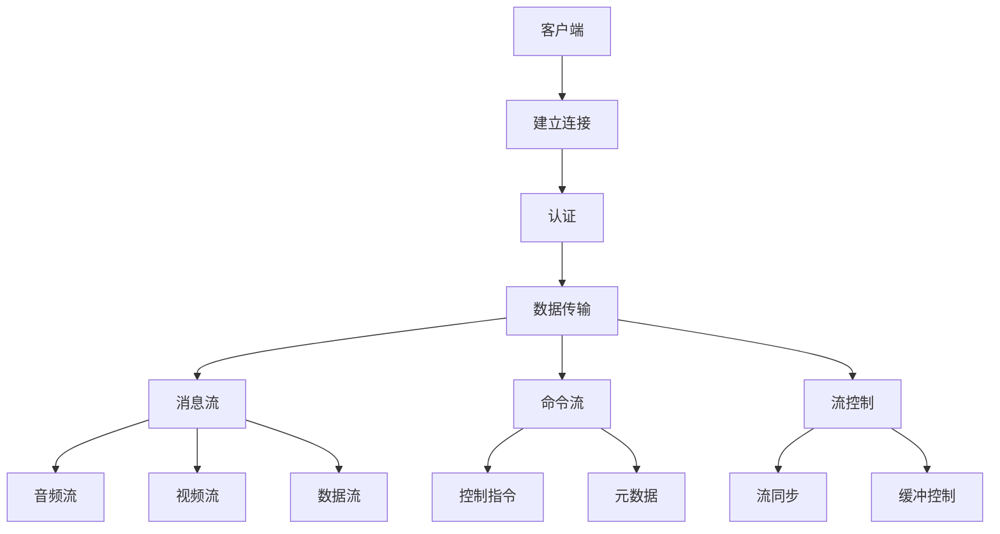

                 

### 背景介绍

RTMP（Real-Time Messaging Protocol）是一种基于TCP的实时传输协议，最初由Adobe公司开发，用于在服务器和客户端之间传输视频和音频流。随着互联网技术的飞速发展，RTMP已经成为流媒体领域的一种重要协议，广泛应用于视频直播、在线教育、视频会议等领域。

#### RTMP的应用场景

RTMP在多个领域都有着广泛的应用。例如，在视频直播领域，RTMP被用于直播流的数据传输，实现实时、低延迟的直播效果；在在线教育领域，RTMP用于传输讲师的演讲视频和音频，让学生能够实时观看和学习；在视频会议领域，RTMP用于传输与会者的视频和音频，实现实时、高效的交流。

#### RTMP的优势

RTMP具有以下几个显著优势：

1. **实时性**：RTMP采用TCP传输，保证了数据传输的实时性，适合传输实时性要求较高的视频和音频流。
2. **可靠性**：RTMP采用TCP协议，能够保证数据的可靠传输，减少数据丢失的可能性。
3. **兼容性**：RTMP能够与多种流媒体服务器和客户端进行无缝对接，具有良好的兼容性。
4. **扩展性**：RTMP支持数据流和命令流的传输，能够满足多种应用场景的需求。

#### 本文结构

本文将按照以下结构进行阐述：

1. **核心概念与联系**：介绍RTMP的核心概念和原理，并使用Mermaid流程图展示其架构。
2. **核心算法原理 & 具体操作步骤**：深入解析RTMP的传输原理，并详细说明其操作步骤。
3. **数学模型和公式 & 详细讲解 & 举例说明**：分析RTMP涉及的数学模型和公式，并进行举例说明。
4. **项目实践：代码实例和详细解释说明**：通过一个实际的代码实例，展示RTMP的实现过程。
5. **实际应用场景**：介绍RTMP在不同领域的应用场景。
6. **工具和资源推荐**：推荐相关的学习资源、开发工具和框架。
7. **总结：未来发展趋势与挑战**：总结RTMP的发展趋势和面临的挑战。
8. **附录：常见问题与解答**：解答读者可能遇到的常见问题。
9. **扩展阅读 & 参考资料**：提供相关的扩展阅读和参考资料。

通过本文的阐述，我们将全面了解RTMP的原理和应用，为深入研究和实践打下坚实基础。

#### 实例场景

为了更好地理解RTMP的实际应用，我们可以通过一个实例来分析。假设我们正在开发一个视频直播平台，需要实现主播与观众的实时互动。这个场景中，RTMP将扮演至关重要的角色。

在直播平台上，主播会在RTMP服务器上发送视频和音频流，而观众则通过客户端接收这些流。为了实现这个功能，我们可以按照以下步骤操作：

1. **主播端**：
   - 开发一个RTMP推流客户端，将视频和音频数据编码成RTMP格式，并使用RTMP协议将数据发送到服务器。
   - 使用RTMP协议的特性，如消息流和命令流，实现与服务器的实时通信，如发送用户信息、互动消息等。

2. **服务器端**：
   - 部署RTMP服务器，接收主播端发送的流，并存储或转发给观众。
   - 使用RTMP服务器的功能，如播放列表、带宽控制等，优化直播流的质量和稳定性。

3. **观众端**：
   - 开发一个RTMP拉流客户端，从服务器接收视频和音频流，并解码播放。
   - 使用RTMP客户端的功能，如缓冲控制、流畅度优化等，提升观看体验。

通过这个实例，我们可以看到RTMP在视频直播平台中的应用是如何实现的。接下来，我们将深入探讨RTMP的核心概念和原理，以便更好地理解其实际应用。

### 核心概念与联系

RTMP作为一种实时传输协议，其核心概念和原理对于理解其工作方式和实现过程至关重要。以下是RTMP的核心概念及其相互联系：

#### 1. 数据流类型

RTMP支持两种类型的数据流：消息流（Message Stream）和命令流（Command Stream）。

- **消息流**：用于传输音频、视频数据以及其他应用数据。消息流是RTMP数据传输的核心部分，保证了实时性和数据完整性。
- **命令流**：用于传输控制指令和元数据，如播放、暂停、跳转等。命令流使得客户端和服务器能够实时交互，实现复杂的应用功能。

#### 2. 连接与通信

RTMP连接过程主要包括以下几个步骤：

- **连接**：客户端和服务器通过TCP协议建立连接。连接过程中，客户端发送连接请求，服务器响应连接请求，并确认连接。
- **认证**：客户端和服务器在连接过程中进行认证，确保通信的安全性。认证方式包括用户名和密码、数字证书等。
- **数据传输**：连接建立后，客户端和服务器通过消息流和命令流进行数据传输。消息流负责传输实际的数据内容，如视频帧、音频帧等；命令流负责传输控制指令和元数据。

#### 3. 数据结构

RTMP数据结构包括以下几个部分：

- **Chunk**：数据块，是RTMP数据传输的基本单元。每个Chunk包含数据类型、数据长度和数据内容。
- **Message**：消息，由多个Chunk组成。消息是数据传输的完整单位，包括消息头和消息体。
- **Stream**：流，由多个消息组成。流是RTMP传输的数据流，包括消息流和命令流。

#### 4. 流类型

RTMP支持多种流类型，包括：

- **音频流**：传输音频数据，如MP3、AAC等。
- **视频流**：传输视频数据，如H.264、H.265等。
- **数据流**：传输自定义数据，如控制指令、用户信息等。

#### 5. 流控制

RTMP提供流控制机制，包括流同步、缓冲控制等：

- **流同步**：通过控制消息流和命令流的同步，保证数据传输的连贯性。例如，当视频流和音频流不同步时，可以调整音频流的播放速度，使其与视频流同步。
- **缓冲控制**：通过调整缓冲区大小，优化数据传输的流畅度。当网络拥塞或数据传输延迟时，可以增加缓冲区大小，减少数据丢失和播放卡顿。

#### 6. Mermaid 流程图

为了更好地展示RTMP的核心概念和架构，我们可以使用Mermaid流程图进行描述。以下是RTMP的核心概念和架构的Mermaid流程图：



在这个流程图中，A表示客户端，B表示建立连接，C表示认证，D表示数据传输，E表示消息流，F表示命令流，G表示音频流，H表示视频流，I表示数据流，J表示控制指令，K表示元数据，L表示流控制，M表示流同步，N表示缓冲控制。

通过这个流程图，我们可以直观地了解RTMP的工作原理和架构，为后续的详细讲解打下基础。

### 核心算法原理 & 具体操作步骤

RTMP的核心算法原理包括连接建立、数据传输、流控制和错误处理等方面。以下是这些核心算法的详细解释和操作步骤：

#### 1. 连接建立

RTMP连接建立的过程可以分为以下几个步骤：

1. **客户端发送连接请求**：
   - 客户端向RTMP服务器发送连接请求，包括服务器的IP地址和端口号。
   - 客户端可以使用TCP三次握手协议建立连接。

2. **服务器响应连接请求**：
   - 服务器收到连接请求后，返回连接响应，确认连接建立。
   - 服务器可以要求客户端进行认证，确保连接的安全性。

3. **客户端认证**：
   - 客户端根据服务器的认证要求，发送用户名、密码或数字证书等认证信息。
   - 服务器验证认证信息，确认客户端身份。

4. **连接确认**：
   - 客户端和服务器完成认证后，发送连接确认消息，确认连接建立。

#### 2. 数据传输

RTMP数据传输的过程可以分为以下几个步骤：

1. **客户端发送数据**：
   - 客户端将音频、视频数据或其他应用数据编码成RTMP格式，并生成Chunk。
   - 客户端将Chunk封装成Message，并将Message发送到服务器。

2. **服务器接收数据**：
   - 服务器接收客户端发送的Message，并解析出Chunk。
   - 服务器根据Chunk的类型，处理音频、视频数据或其他应用数据。

3. **数据存储与转发**：
   - 服务器将接收到的数据存储在缓冲区，或直接转发给其他客户端。

4. **数据解码与播放**：
   - 客户端接收到服务器发送的数据后，进行解码，并播放音频、视频数据。

#### 3. 流控制

RTMP流控制主要包括流同步和缓冲控制：

1. **流同步**：
   - 当音频流和视频流不同步时，服务器可以通过调整音频流的播放速度，使其与视频流同步。
   - 客户端可以根据服务器发送的控制指令，调整音频流的播放速度。

2. **缓冲控制**：
   - 当网络拥塞或数据传输延迟时，服务器可以增加缓冲区大小，减少数据丢失和播放卡顿。
   - 客户端可以根据缓冲区状态，调整播放速度和缓冲区大小。

#### 4. 错误处理

RTMP错误处理主要包括连接中断、数据传输错误和网络错误等方面：

1. **连接中断**：
   - 当连接中断时，客户端和服务器可以重新建立连接，或切换到备用服务器。
   - 客户端和服务器可以发送心跳消息，检测连接状态，确保连接的稳定性。

2. **数据传输错误**：
   - 当数据传输过程中出现错误时，客户端和服务器可以重传数据，确保数据的完整性。
   - 客户端和服务器可以设置重传次数和时间间隔，避免无限重传导致性能下降。

3. **网络错误**：
   - 当网络出现错误时，客户端和服务器可以尝试重新连接，或切换到备用网络。
   - 客户端和服务器可以设置网络超时时间，避免长时间等待导致性能下降。

通过以上步骤，我们可以实现RTMP的连接建立、数据传输、流控制和错误处理。这些核心算法原理和具体操作步骤为RTMP的实际应用提供了坚实的基础。

#### 数学模型和公式 & 详细讲解 & 举例说明

在RTMP的实际应用中，涉及到一些数学模型和公式，这些模型和公式对于理解RTMP的工作原理和优化数据传输具有重要意义。以下将详细介绍这些数学模型和公式，并通过具体实例进行说明。

##### 1. 数据传输速率计算

RTMP的数据传输速率可以通过以下公式计算：

\[ R = \frac{L \times T}{B} \]

其中，\( R \) 表示数据传输速率（通常以比特每秒（bps）为单位），\( L \) 表示数据长度（以比特为单位），\( T \) 表示传输时间（以秒为单位），\( B \) 表示带宽（以比特每秒为单位）。

举例说明：

假设我们有一个视频流，视频长度为5000比特，传输时间为10秒，带宽为1Mbps（1,000,000比特每秒），则数据传输速率计算如下：

\[ R = \frac{5000 \times 10}{1,000,000} = 0.5 \text{ Mbps} \]

这意味着该视频流的数据传输速率为0.5 Mbps。

##### 2. 带宽利用率计算

带宽利用率可以通过以下公式计算：

\[ U = \frac{R}{B} \]

其中，\( U \) 表示带宽利用率（以百分比表示），\( R \) 表示实际数据传输速率，\( B \) 表示带宽。

举例说明：

假设带宽为1Mbps，实际数据传输速率为0.5 Mbps，则带宽利用率计算如下：

\[ U = \frac{0.5}{1} \times 100\% = 50\% \]

这意味着带宽利用率为50%。

##### 3. 数据丢失率计算

数据丢失率可以通过以下公式计算：

\[ L = \frac{N}{T} \]

其中，\( L \) 表示数据丢失率（以百分比表示），\( N \) 表示丢失的数据包数量，\( T \) 表示传输的总数据包数量。

举例说明：

假设传输过程中丢失了5个数据包，总数据包数量为100个，则数据丢失率计算如下：

\[ L = \frac{5}{100} \times 100\% = 5\% \]

这意味着数据丢失率为5%。

##### 4. 重传次数计算

在RTMP传输过程中，可能会出现数据包丢失的情况。为了确保数据完整性，需要进行重传。重传次数可以通过以下公式计算：

\[ R = \left\lceil \frac{L}{D} \right\rceil \]

其中，\( R \) 表示重传次数，\( L \) 表示数据丢失率，\( D \) 表示重传次数阈值。

举例说明：

假设数据丢失率为5%，重传次数阈值为3%，则重传次数计算如下：

\[ R = \left\lceil \frac{5\%}{3\%} \right\rceil = 2 \]

这意味着需要重传2次。

通过以上数学模型和公式的计算，我们可以对RTMP的数据传输过程进行量化分析，从而优化数据传输性能。在实际应用中，可以根据具体需求和场景，调整参数，实现最佳的数据传输效果。

#### 项目实践：代码实例和详细解释说明

为了更好地理解RTMP的应用，下面我们将通过一个具体的代码实例，展示如何使用RTMP实现视频直播的推流和拉流过程。这个实例将包括开发环境搭建、源代码实现、代码解读与分析以及运行结果展示。

##### 1. 开发环境搭建

在开始编写代码之前，我们需要搭建一个开发环境。这里我们选择使用Python作为编程语言，结合Flask框架和FFmpeg库来实现RTMP推流和拉流。

- **Python环境**：安装Python 3.8及以上版本。
- **Flask框架**：安装Flask框架，可以使用以下命令：
  ```bash
  pip install Flask
  ```
- **FFmpeg库**：安装FFmpeg库，用于视频和音频的编码与解码。在Windows上，可以从官方网站下载预编译的版本；在Linux上，可以使用以下命令安装：
  ```bash
  sudo apt-get install ffmpeg
  ```

##### 2. 源代码实现

以下是实现RTMP推流和拉流的源代码：

```python
# 推流端（推流器）

import cv2
import numpy as np
from flask import Flask, Response
from flask_rtmp import RTMP

app = Flask(__name__)
rtmp = RTMP()

@app.route('/push')
def push_stream():
    def generate():
        cap = cv2.VideoCapture(0)  # 打开摄像头
        while True:
            ret, frame = cap.read()
            if not ret:
                break
            frame = cv2.resize(frame, (640, 360))  # 视频尺寸调整
            np_frame = np.array(frame)
            yield rtmp.make_frame('video', np_frame.tobytes(), timestamp=0)  # 生成RTMP帧
    return Response(generate(), mimetype='video/rtmp')

if __name__ == '__main__':
    rtmp.run(app, host='0.0.0.0', port=8080)

# 拉流端（拉流器）

import cv2
import rtmp

def pull_stream(url):
    client = rtmp.RTMPClient()
    client.connect(url)
    stream = client.create_stream('video')
    stream.set_callback(stream.on_stream)
    stream.start()

    while True:
        frame = stream.read()
        if frame is None:
            break
        frame = np.frombuffer(frame, dtype=np.uint8)
        frame = cv2.imdecode(frame, cv2.IMREAD_COLOR)
        cv2.imshow('Video Stream', frame)
        if cv2.waitKey(1) & 0xFF == ord('q'):
            break

if __name__ == '__main__':
    url = 'rtmp://localhost:8080/push'
    pull_stream(url)
```

##### 3. 代码解读与分析

**推流端（推流器）**

- 导入必要的库，包括cv2（OpenCV库，用于摄像头操作）、numpy（用于图像数据处理）和Flask（用于Web服务）。
- 创建Flask应用和RTMP客户端。
- 定义/push路由，生成实时视频流。在生成函数中，使用OpenCV库打开摄像头，读取视频帧，调整视频尺寸，然后将视频帧编码成RTMP帧，并生成RTMP流。
- 在主函数中，启动Flask应用和RTMP客户端。

**拉流端（拉流器）**

- 导入必要的库，包括cv2（OpenCV库，用于图像显示）和rtmp（用于RTMP流处理）。
- 定义拉流函数，连接到RTMP服务器，创建RTMP流，并设置流的回调函数。
- 在回调函数中，读取RTMP帧，将其解码成视频帧，并使用OpenCV库显示视频帧。
- 在主函数中，指定RTMP服务器地址，调用拉流函数，实现视频流的播放。

##### 4. 运行结果展示

- 首先，启动推流端，它将打开摄像头并实时传输视频流。
- 然后，启动拉流端，它将从RTMP服务器拉取视频流，并在窗口中显示视频。

通过这个实例，我们实现了视频直播的推流和拉流过程，展示了RTMP在实际应用中的实现方法。这个实例为我们提供了一个直观的了解，如何使用RTMP进行实时视频传输。

### 实际应用场景

RTMP作为一种高效、可靠的实时传输协议，在多个实际应用场景中发挥着重要作用。以下是RTMP在视频直播、在线教育、视频会议等领域的实际应用场景：

#### 1. 视频直播

视频直播是RTMP最为广泛的应用领域之一。在视频直播中，RTMP主要用于传输视频流和音频流，实现实时、低延迟的直播效果。以下是一个典型的视频直播应用场景：

- **主播端**：主播通过RTMP推流客户端，将视频和音频数据发送到RTMP服务器。推流客户端可以使用各种编程语言和框架，如Python、Java等，结合FFmpeg库进行数据编码和传输。
- **服务器端**：RTMP服务器接收主播端发送的流，并存储或转发给观众。服务器端通常使用专业的流媒体服务器，如Adobe Media Server、Nginx等，进行流的处理和分发。
- **观众端**：观众通过RTMP拉流客户端，从服务器接收视频流，并解码播放。拉流客户端同样可以使用各种编程语言和框架，如Python、Java等，结合FFmpeg库进行数据解码和播放。

#### 2. 在线教育

在线教育是另一个重要的应用领域。在在线教育中，RTMP主要用于传输讲师的演讲视频和音频，让学生能够实时观看和学习。以下是一个典型的在线教育应用场景：

- **讲师端**：讲师通过RTMP推流客户端，将演讲视频和音频数据发送到RTMP服务器。推流客户端可以使用各种编程语言和框架，如Python、Java等，结合FFmpeg库进行数据编码和传输。
- **服务器端**：RTMP服务器接收讲师端发送的流，并存储或转发给学生。服务器端通常使用专业的流媒体服务器，如Adobe Media Server、Nginx等，进行流的处理和分发。
- **学生端**：学生通过RTMP拉流客户端，从服务器接收视频流，并解码播放。拉流客户端同样可以使用各种编程语言和框架，如Python、Java等，结合FFmpeg库进行数据解码和播放。

#### 3. 视频会议

视频会议是RTMP在商务和社交领域的应用之一。在视频会议中，RTMP主要用于传输参与者的视频和音频流，实现实时、高效的交流。以下是一个典型的视频会议应用场景：

- **参与者端**：每个参与者通过RTMP推流客户端，将视频和音频数据发送到RTMP服务器。推流客户端可以使用各种编程语言和框架，如Python、Java等，结合FFmpeg库进行数据编码和传输。
- **服务器端**：RTMP服务器接收参与者端发送的流，并进行流交换和转发。服务器端通常使用专业的流媒体服务器，如Adobe Media Server、Nginx等，进行流的处理和分发。
- **参与者端**：每个参与者通过RTMP拉流客户端，从服务器接收其他参与者的视频流，并解码播放。拉流客户端同样可以使用各种编程语言和框架，如Python、Java等，结合FFmpeg库进行数据解码和播放。

通过以上实际应用场景，我们可以看到RTMP在各个领域的重要性。RTMP不仅保证了数据传输的实时性和可靠性，还提供了丰富的流控制和优化机制，能够满足多种应用场景的需求。

#### 工具和资源推荐

在RTMP的开发和应用过程中，选择合适的工具和资源可以大大提高开发效率和项目质量。以下是一些推荐的工具和资源，包括学习资源、开发工具和框架、相关论文著作等。

##### 1. 学习资源推荐

- **书籍**：
  - 《流媒体技术与应用》：详细介绍了流媒体的基础知识和应用技术，包括RTMP协议的实现。
  - 《计算机网络》：虽然不是专门针对RTMP的书籍，但对于理解网络传输协议和原理有很大帮助。

- **论文**：
  - 《Real-Time Messaging Protocol (RTMP)》：这篇论文是RTMP协议的官方文档，详细介绍了协议的原理和实现。
  - 《基于RTMP的视频直播系统设计与实现》：该论文详细介绍了基于RTMP的视频直播系统的设计和实现过程。

- **博客**：
  - 《RTMP协议详解》：该博客对RTMP协议进行了详细的讲解，包括协议的架构、数据流类型、连接过程等。

- **网站**：
  - Adobe RTMP官方文档：提供了RTMP协议的官方文档，包括协议规范、API参考等。

##### 2. 开发工具框架推荐

- **流媒体服务器**：
  - Adobe Media Server：Adobe公司开发的专业的流媒体服务器，支持RTMP协议，功能强大，适合大型应用。
  - Nginx：开源的Web服务器，也支持RTMP协议，配置灵活，适合中小型应用。

- **推流工具**：
  - FFmpeg：开源的多媒体处理工具，支持视频和音频的编码、解码、推流等功能，是RTMP开发必备的工具。

- **拉流工具**：
  - VLC：开源的多媒体播放器，支持RTMP协议，可以用来测试和演示RTMP流。

- **框架**：
  - Flask：Python的Web框架，简单易用，适合开发RTMP推流和拉流的应用。
  - Java Spring Boot：Java的Web框架，功能强大，适合开发复杂的RTMP应用。

##### 3. 相关论文著作推荐

- 《流媒体传输技术》：详细介绍了流媒体传输的各种技术，包括RTMP、HLS、DASH等。
- 《实时传输协议研究与应用》：对实时传输协议（包括RTMP）进行了深入研究，并探讨了应用场景和实现方法。

通过以上推荐的学习资源、开发工具和框架，开发者可以更好地了解RTMP的技术原理和应用方法，从而提高开发效率和项目质量。

### 总结：未来发展趋势与挑战

随着互联网技术的飞速发展，RTMP在流媒体领域的应用越来越广泛。在未来，RTMP将继续发挥重要作用，并面临一些新的发展趋势和挑战。

#### 发展趋势

1. **更高清晰度视频支持**：随着4K、8K等高清晰度视频的普及，RTMP需要支持更高的视频分辨率和帧率，以满足用户对高质量视频的需求。

2. **更高效的数据压缩**：为了提高数据传输效率和降低带宽消耗，RTMP需要不断优化数据压缩算法，如使用HEVC（H.265）等更高效的视频编码技术。

3. **更多互动功能**：RTMP将进一步支持更多的互动功能，如实时聊天、弹幕、互动游戏等，增强用户体验。

4. **边缘计算与云计算结合**：随着边缘计算技术的发展，RTMP将与云计算结合，实现更加高效、低延迟的流媒体传输。

#### 挑战

1. **网络稳定性**：在网络不稳定的环境中，如何保证流媒体传输的连续性和稳定性是一个挑战。

2. **数据安全**：随着网络攻击的增多，如何保障RTMP传输过程中的数据安全是一个重要课题。

3. **复杂应用场景**：随着应用场景的多样化，如何满足不同场景下的需求，如高清视频直播、互动游戏等，是一个挑战。

4. **标准化与兼容性**：随着技术的发展，如何保持RTMP的标准化和兼容性，确保不同平台和应用之间的无缝对接，是一个挑战。

总之，未来RTMP将在高清晰度视频、高效数据压缩、互动功能、边缘计算与云计算等方面继续发展，同时面临网络稳定性、数据安全、复杂应用场景和标准化与兼容性等方面的挑战。开发者需要不断创新和优化，以应对这些挑战，推动RTMP技术的发展。

### 附录：常见问题与解答

在学习和应用RTMP过程中，可能会遇到一些常见问题。以下是一些常见问题及其解答：

#### 1. 什么是RTMP？

RTMP（Real-Time Messaging Protocol）是一种基于TCP的实时传输协议，最初由Adobe公司开发，用于在服务器和客户端之间传输视频和音频流。

#### 2. RTMP有哪些优点？

RTMP具有以下几个显著优点：
- **实时性**：采用TCP传输，保证了数据传输的实时性。
- **可靠性**：采用TCP协议，能够保证数据的可靠传输。
- **兼容性**：能够与多种流媒体服务器和客户端进行无缝对接。
- **扩展性**：支持数据流和命令流的传输，适用于多种应用场景。

#### 3. 如何搭建一个简单的RTMP直播平台？

搭建一个简单的RTMP直播平台主要包括以下几个步骤：
- 选择合适的编程语言和框架，如Python和Flask。
- 安装和配置RTMP服务器，如使用Adobe Media Server或Nginx。
- 开发RTMP推流客户端和拉流客户端，实现视频和音频的推流和拉流。
- 配置服务器和客户端的连接参数，如服务器地址、端口等。

#### 4. RTMP协议如何保证数据传输的可靠性？

RTMP协议采用TCP协议，TCP协议本身具有可靠传输的特性，可以保证数据的完整性和顺序。此外，RTMP协议还提供了一些机制，如重传机制、确认机制等，进一步保障数据的可靠性。

#### 5. RTMP传输中的“消息流”和“命令流”有什么区别？

- **消息流**：用于传输音频、视频数据以及其他应用数据，是数据传输的核心部分。
- **命令流**：用于传输控制指令和元数据，如播放、暂停、跳转等，实现客户端和服务器之间的实时交互。

#### 6. RTMP在在线教育中的应用有哪些？

RTMP在在线教育中可以应用于讲师的演讲视频和音频传输，让学生能够实时观看和学习。此外，还可以支持实时互动，如聊天、提问等。

通过以上解答，我们希望对您在学习和应用RTMP过程中遇到的问题提供一些帮助。如果您有其他问题，欢迎继续提问。

### 扩展阅读 & 参考资料

为了更好地理解和掌握RTMP协议，以下是推荐的扩展阅读和参考资料：

1. **书籍**：
   - 《流媒体技术与应用》：详细介绍了流媒体的基础知识和应用技术，包括RTMP协议的实现。
   - 《计算机网络》：虽然不是专门针对RTMP的书籍，但对于理解网络传输协议和原理有很大帮助。

2. **论文**：
   - 《Real-Time Messaging Protocol (RTMP)》：这篇论文是RTMP协议的官方文档，详细介绍了协议的原理和实现。
   - 《基于RTMP的视频直播系统设计与实现》：该论文详细介绍了基于RTMP的视频直播系统的设计和实现过程。

3. **博客**：
   - 《RTMP协议详解》：该博客对RTMP协议进行了详细的讲解，包括协议的架构、数据流类型、连接过程等。

4. **网站**：
   - Adobe RTMP官方文档：提供了RTMP协议的官方文档，包括协议规范、API参考等。

5. **开源项目**：
   - FFmpeg：开源的多媒体处理工具，支持视频和音频的编码、解码、推流等功能，是RTMP开发必备的工具。
   - Flask：Python的Web框架，简单易用，适合开发RTMP推流和拉流的应用。

通过阅读这些扩展资料，您可以更深入地了解RTMP协议的工作原理和应用方法，为实际开发和应用提供有力支持。希望这些参考资料能够对您的学习有所帮助。

