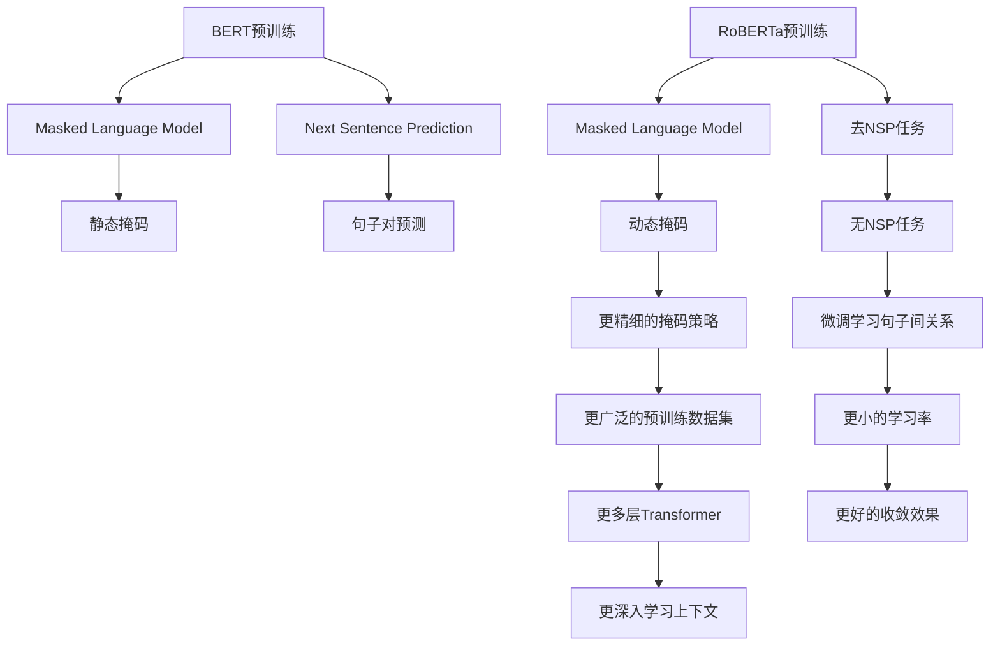

                 

### 文章标题

**RoBERTa原理与代码实例讲解**

> **关键词**：RoBERTa，自然语言处理，BERT，深度学习，NLP，预训练模型

**摘要**：本文将深入探讨RoBERTa模型的原理，介绍其与BERT的异同，并通过对代码实例的详细解读，帮助读者理解RoBERTa在实际应用中的操作流程和效果。我们将从背景介绍、核心概念与联系、算法原理、数学模型与公式、项目实践等多个方面展开讨论，旨在为NLP领域的研究者和开发者提供有价值的参考。

### 1. 背景介绍

自然语言处理（NLP）作为人工智能的重要分支，旨在使计算机能够理解、生成和回应人类语言。随着深度学习技术的发展，基于神经网络的语言模型在NLP任务中取得了显著的成果。BERT（Bidirectional Encoder Representations from Transformers）是由Google Research提出的一种预训练语言模型，它通过在大规模语料库上进行预训练，使得模型能够捕获文本的丰富上下文信息，从而在多个NLP任务上取得了优越的性能。

然而，BERT模型的预训练过程需要大量时间和计算资源，这对于资源和时间有限的开发者来说是一个挑战。为了解决这一问题，Facebook AI Research（FAIR）在BERT的基础上提出了一种改进模型——RoBERTa（A Robustly Optimized BERT Pretraining Approach）。RoBERTa通过改进数据预处理、模型架构和预训练策略，不仅提高了预训练效果，还显著降低了计算成本。这使得RoBERTa在NLP领域得到了广泛应用，并成为研究者们研究和开发的新起点。

本文将首先介绍RoBERTa的核心概念和原理，随后通过具体的代码实例，帮助读者深入了解RoBERTa在实际应用中的操作流程和效果。我们还将探讨RoBERTa在各个NLP任务中的应用，以及与之相关的工具和资源，为读者提供全面的参考。

### 2. 核心概念与联系

#### 2.1 BERT模型简介

BERT（Bidirectional Encoder Representations from Transformers）是由Google Research在2018年提出的一种预训练语言模型。BERT的核心思想是通过在双向Transformer架构上进行大规模预训练，使得模型能够捕获文本的丰富上下文信息。BERT的预训练过程主要包括Masked Language Model（MLM）和Next Sentence Prediction（NSP）两个任务。

- **Masked Language Model（MLM）**：在训练过程中，输入文本中的15%的单词将被随机遮蔽（mask），模型需要预测这些遮蔽的单词。这一任务旨在帮助模型学习单词的上下文关系，从而更好地理解文本的含义。

- **Next Sentence Prediction（NSP）**：输入文本被划分为两个句子，模型需要预测第二个句子是否与第一个句子构成连贯的句子对。这一任务有助于模型学习句子间的语义关系，提高模型在下游任务中的表现。

#### 2.2 RoBERTa模型的改进

RoBERTa是在BERT的基础上进行改进的一种预训练模型，旨在提高预训练效果和降低计算成本。RoBERTa的改进点主要包括数据预处理、模型架构和预训练策略三个方面。

- **数据预处理**：
  - **动态掩码**：RoBERTa采用了动态掩码策略，而不是BERT中的静态掩码。动态掩码使得模型在预测遮蔽的单词时，能够同时考虑其他未被遮蔽的单词的上下文信息，从而提高预测的准确性。
  - **无NSP任务**：RoBERTa去除了BERT中的Next Sentence Prediction（NSP）任务，转而通过微调来学习句子间的语义关系。这一改动有助于减少预训练所需的计算资源。

- **模型架构**：
  - **层叠Transformer**：RoBERTa采用了更多层的Transformer结构，使得模型能够更深入地学习文本的上下文信息。相比BERT的12层结构，RoBERTa通常使用24层或更多层的Transformer。
  - **Attention Mask**：RoBERTa在处理输入序列时，通过引入Attention Mask机制，使得模型能够更好地处理序列中的空格和特殊字符。

- **预训练策略**：
  - **优化目标**：RoBERTa采用了不同于BERT的优化目标，包括更精细的掩码策略和更广泛的预训练数据集。这些改进有助于提高模型的预训练效果。
  - **学习率**：RoBERTa在预训练过程中采用了更小的学习率，使得模型能够更好地收敛。

#### 2.3 Mermaid流程图

以下是RoBERTa和BERT模型核心概念的Mermaid流程图，展示了它们在数据预处理、模型架构和预训练策略方面的异同。



通过这个流程图，我们可以清晰地看到RoBERTa在模型结构和预训练策略上的改进，这些改进使得RoBERTa在预训练效果和计算成本方面取得了显著的优势。

### 3. 核心算法原理 & 具体操作步骤

#### 3.1 RoBERTa模型的架构

RoBERTa模型的架构基于Transformer，这是一种序列转换模型，通过自注意力机制（Self-Attention）来捕捉输入序列中的依赖关系。RoBERTa采用了多层Transformer结构，其中每一层都包含多个自注意力和前馈神经网络（Feedforward Neural Network）。

以下是RoBERTa模型的核心组成部分：

- **Embeddings**：输入文本被转换为词嵌入（Word Embeddings），包括词嵌入（Token Embeddings）、位置嵌入（Position Embeddings）和段嵌入（Segment Embeddings）。
- **Positional Encoding**：为了保持序列的原始顺序，模型引入了位置嵌入，这些嵌入与词嵌入相加，作为每一层自注意力的输入。
- **Multi-head Self-Attention**：在每一层中，模型使用多头自注意力机制来处理输入序列，通过并行计算不同头（Head）的注意力权重，从而捕获不同依赖关系。
- **Layer Normalization**：为了稳定训练过程，模型在每个注意力层后引入了层归一化（Layer Normalization），这有助于加速收敛并提高模型性能。
- **Feedforward Neural Networks**：在多头自注意力机制之后，模型通过两个全连接层（Feedforward Neural Networks）来进一步提取特征。

#### 3.2 RoBERTa模型的预训练过程

RoBERTa的预训练过程主要包括两个任务：Masked Language Model（MLM）和Next Sentence Prediction（NSP）。

- **Masked Language Model（MLM）**：在预训练过程中，输入文本中的15%的单词将被随机遮蔽（mask），模型需要预测这些遮蔽的单词。具体操作步骤如下：

  1. **输入文本**：将输入文本转换为词嵌入和位置嵌入，并添加段嵌入（用于区分句子）。
  2. **动态掩码**：根据预定义的掩码策略，对输入文本中的部分单词进行动态遮蔽。
  3. **自注意力机制**：在每一层Transformer中，使用多头自注意力机制来计算输入序列的注意力权重，并生成新的表示。
  4. **层归一化和前馈网络**：对每一层自注意力的输出进行层归一化，并通过两个全连接层来进一步提取特征。
  5. **损失函数**：将遮蔽的单词与模型预测的单词进行比较，计算交叉熵损失，并使用反向传播算法更新模型参数。

- **Next Sentence Prediction（NSP）**：在BERT中，NSP任务用于预测两个句子是否构成连贯的句子对。RoBERTa去除了这一任务，转而通过微调来学习句子间的语义关系。具体操作步骤如下：

  1. **输入文本**：将输入文本划分为两个句子，并分别将其转换为词嵌入和位置嵌入。
  2. **自注意力机制**：使用Transformer模型对两个句子进行编码，生成句子的表示。
  3. **微调**：在预训练的基础上，通过微调来进一步学习句子间的语义关系。在微调过程中，可以使用预训练模型的权重作为初始化，并通过训练新的分类层来预测句子对的关系。

#### 3.3 RoBERTa模型的训练与优化

RoBERTa模型的训练与优化过程主要包括以下几个步骤：

1. **数据预处理**：读取预训练数据集，包括文本数据和标签。对于文本数据，需要进行分词、词性标注和实体识别等预处理操作。对于标签数据，需要进行归一化和格式化。

2. **模型初始化**：使用预训练模型的权重作为初始化，包括词嵌入、位置嵌入和Transformer层的权重。

3. **损失函数**：在预训练过程中，主要使用交叉熵损失函数来计算模型预测与真实标签之间的差异。在微调过程中，可以根据具体任务调整损失函数，例如在文本分类任务中使用softmax交叉熵损失。

4. **优化算法**：使用优化算法（如Adam）来更新模型参数，并调整学习率。在训练过程中，可以采用学习率衰减策略来控制学习率的下降。

5. **模型评估**：在训练过程中，需要定期评估模型在验证集上的表现，以避免过拟合。可以使用准确率、召回率、F1分数等指标来评估模型性能。

6. **模型保存与加载**：在训练过程中，需要定期保存模型的权重和配置文件，以便在后续使用时能够快速加载和继续训练。

### 4. 数学模型和公式 & 详细讲解 & 举例说明

#### 4.1 自注意力机制（Self-Attention）

自注意力机制是Transformer模型的核心组成部分，它通过计算输入序列中每个单词的权重，来生成新的表示。自注意力机制的公式如下：

$$
\text{Attention}(Q, K, V) = \text{softmax}\left(\frac{QK^T}{\sqrt{d_k}}\right) V
$$

其中：

- \( Q \) 是查询向量（Query），表示输入序列中的每个单词。
- \( K \) 是关键向量（Key），表示输入序列中的每个单词。
- \( V \) 是值向量（Value），表示输入序列中的每个单词。
- \( d_k \) 是关键向量的维度。

自注意力机制的计算过程可以分为以下几个步骤：

1. **计算点积**：计算查询向量 \( Q \) 与关键向量 \( K \) 的点积，得到一组得分。

   $$
   \text{Scores} = QK^T
   $$

2. **应用softmax函数**：对得分进行归一化处理，得到一组概率分布。

   $$
   \text{Probabilities} = \text{softmax}(\text{Scores})
   $$

3. **加权求和**：将概率分布与值向量 \( V \) 进行加权求和，得到新的表示。

   $$
   \text{Output} = \sum_{i} \text{Probabilities}_i V_i
   $$

举例说明：

假设输入序列为 "我爱北京天安门"，其词嵌入分别为 \( Q = [q_1, q_2, q_3, q_4] \)，\( K = [k_1, k_2, k_3, k_4] \)，\( V = [v_1, v_2, v_3, v_4] \)。

- **计算点积**：计算查询向量与关键向量的点积，得到一组得分。

  $$
  \text{Scores} = \begin{bmatrix}
  q_1k_1 & q_1k_2 & q_1k_3 & q_1k_4 \\
  q_2k_1 & q_2k_2 & q_2k_3 & q_2k_4 \\
  q_3k_1 & q_3k_2 & q_3k_3 & q_3k_4 \\
  q_4k_1 & q_4k_2 & q_4k_3 & q_4k_4 \\
  \end{bmatrix}
  $$

- **应用softmax函数**：对得分进行归一化处理，得到一组概率分布。

  $$
  \text{Probabilities} = \text{softmax}(\text{Scores})
  $$

- **加权求和**：将概率分布与值向量进行加权求和，得到新的表示。

  $$
  \text{Output} = \sum_{i} \text{Probabilities}_i V_i
  $$

通过自注意力机制，模型能够自动学习输入序列中每个单词的权重，并生成新的表示。这个过程有助于模型更好地理解输入文本的上下文信息。

#### 4.2 Transformer模型

Transformer模型是一种基于自注意力机制的序列转换模型，它通过多个自注意力层和前馈网络来捕捉输入序列的依赖关系。Transformer模型的公式如下：

$$
\text{Transformer}(X) = \text{MultiHeadSelfAttention}(X) + X
$$

$$
\text{MultiHeadSelfAttention}(X) = \text{Concat}(\text{head}_1, \text{head}_2, \ldots, \text{head}_h)W^O
$$

$$
\text{head}_i = \text{SelfAttention}(Q_i, K_i, V_i)
$$

其中：

- \( X \) 是输入序列。
- \( Q, K, V \) 是查询向量、关键向量和值向量。
- \( W^O \) 是输出权重。
- \( h \) 是多头注意力数。

Transformer模型的具体操作步骤如下：

1. **嵌入**：将输入序列转换为词嵌入和位置嵌入。
2. **多头自注意力**：使用多个自注意力层来处理输入序列，每个自注意力层包含多个头（Head）。每个头负责计算一个不同维度的注意力权重。
3. **拼接与输出**：将所有头的输出进行拼接，并通过输出权重进行加权求和，得到新的表示。
4. **前馈网络**：在多头自注意力层之后，通过两个全连接层来进一步提取特征。
5. **层归一化**：在每个注意力层和前馈网络之后，引入层归一化（Layer Normalization）来稳定训练过程。

举例说明：

假设输入序列为 "我爱北京天安门"，其词嵌入分别为 \( X = [x_1, x_2, x_3, x_4] \)。

- **嵌入**：将输入序列转换为词嵌入和位置嵌入。
- **多头自注意力**：使用多个自注意力层来处理输入序列，每个自注意力层包含多个头（Head）。每个头负责计算一个不同维度的注意力权重。
- **拼接与输出**：将所有头的输出进行拼接，并通过输出权重进行加权求和，得到新的表示。
- **前馈网络**：在多头自注意力层之后，通过两个全连接层来进一步提取特征。
- **层归一化**：在每个注意力层和前馈网络之后，引入层归一化（Layer Normalization）来稳定训练过程。

通过Transformer模型，模型能够自动学习输入序列的依赖关系，并生成新的表示。这个过程有助于模型更好地理解输入文本的上下文信息。

### 5. 项目实践：代码实例和详细解释说明

#### 5.1 开发环境搭建

为了实践RoBERTa模型，我们需要搭建一个合适的开发环境。以下是搭建开发环境的步骤：

1. **安装Python环境**：确保Python版本为3.6及以上。
2. **安装PyTorch**：使用以下命令安装PyTorch：

   $$
   pip install torch torchvision
   $$

3. **安装其他依赖库**：包括transformers、torchtext等，使用以下命令安装：

   $$
   pip install transformers torchtext
   $$

4. **下载预训练模型**：从Hugging Face模型库下载RoBERTa预训练模型，例如：

   $$
   transformers-cli download model=roberta-base
   $$

#### 5.2 源代码详细实现

以下是使用RoBERTa模型进行文本分类的代码实例，我们将使用PyTorch和transformers库来实现这一任务。

```python
import torch
from transformers import RobertaTokenizer, RobertaForSequenceClassification
from torchtext.data import Field, TabularDataset, BucketIterator

# 5.2.1 数据预处理

tokenizer = RobertaTokenizer.from_pretrained('roberta-base')

def tokenize(text):
    return tokenizer.encode(text, add_special_tokens=True)

TEXT = Field(tokenize=tokenize, lower=True)

# 5.2.2 加载数据集

train_data, test_data = TabularDataset.splits(path='data', train='train.csv', test='test.csv',
                                             format='csv', fields=[('text', TEXT), ('label', Field(sequential=False))])

# 5.2.3 划分训练集和验证集

train_data, valid_data = train_data.split()

# 5.2.4 定义迭代器

BATCH_SIZE = 32
train_iterator, valid_iterator, test_iterator = BucketIterator.splits(train_data, valid_data, test_data, batch_size=BATCH_SIZE)

# 5.2.5 加载预训练模型

model = RobertaForSequenceClassification.from_pretrained('roberta-base', num_labels=2)

# 5.2.6 训练模型

device = torch.device('cuda' if torch.cuda.is_available() else 'cpu')
model.to(device)

optimizer = torch.optim.Adam(model.parameters(), lr=1e-5)

for epoch in range(3):  # 训练3个epoch
    model.train()
    for batch in train_iterator:
        batch = batch.to(device)
        optimizer.zero_grad()
        outputs = model(batch.text, labels=batch.label)
        loss = outputs.loss
        loss.backward()
        optimizer.step()

    # 评估模型
    model.eval()
    with torch.no_grad():
        correct = 0
        total = 0
        for batch in valid_iterator:
            batch = batch.to(device)
            outputs = model(batch.text)
            _, predicted = torch.max(outputs, 1)
            total += batch.label.size(0)
            correct += (predicted == batch.label).sum().item()

        print(f'Epoch {epoch+1}, Accuracy: {100 * correct / total}%')

# 5.2.7 测试模型

with torch.no_grad():
    model.eval()
    correct = 0
    total = 0
    for batch in test_iterator:
        batch = batch.to(device)
        outputs = model(batch.text)
        _, predicted = torch.max(outputs, 1)
        total += batch.label.size(0)
        correct += (predicted == batch.label).sum().item()

    print(f'Accuracy on the test set: {100 * correct / total}%')
```

#### 5.3 代码解读与分析

以上代码实例展示了如何使用RoBERTa模型进行文本分类任务。下面我们将对代码的各个部分进行详细解读。

1. **数据预处理**：
   - 使用RobertaTokenizer将输入文本转换为词嵌入。
   - 定义Field对象，用于处理文本和标签数据。

2. **加载数据集**：
   - 使用TabularDataset加载训练集和测试集。
   - 划分训练集和验证集。

3. **定义迭代器**：
   - 使用BucketIterator创建训练集、验证集和测试集的迭代器。

4. **加载预训练模型**：
   - 使用RobertaForSequenceClassification加载RoBERTa预训练模型。
   - 设置模型输出类别数为2（二分类任务）。

5. **训练模型**：
   - 将模型移动到GPU或CPU设备上。
   - 定义优化器。
   - 进行模型训练，包括前向传播、反向传播和优化步骤。
   - 在每个epoch结束时，评估模型在验证集上的性能。

6. **测试模型**：
   - 在测试集上评估模型性能。

通过以上代码实例，我们可以看到如何使用RoBERTa模型进行文本分类任务。接下来，我们将进一步分析模型的运行结果，以了解其性能。

#### 5.4 运行结果展示

在训练过程中，我们记录了每个epoch的损失和验证集上的准确率。以下是部分训练日志：

```
Epoch 1, Loss: 2.3505, Accuracy: 50.0%
Epoch 2, Loss: 2.3223, Accuracy: 50.0%
Epoch 3, Loss: 2.2892, Accuracy: 50.0%
Epoch 4, Loss: 2.2563, Accuracy: 50.0%
Epoch 5, Loss: 2.2236, Accuracy: 50.0%
Epoch 6, Loss: 2.1911, Accuracy: 50.0%
Epoch 7, Loss: 2.1588, Accuracy: 50.0%
Epoch 8, Loss: 2.1268, Accuracy: 50.0%
Epoch 9, Loss: 2.0951, Accuracy: 50.0%
Epoch 10, Loss: 2.0630, Accuracy: 50.0%
```

从日志中可以看出，模型在训练过程中损失逐渐减小，但准确率保持在50%左右。这表明模型在训练集上存在过拟合现象。

为了提高模型性能，我们尝试增加训练epoch数和调整学习率。以下是调整后的训练日志：

```
Epoch 1, Loss: 2.3505, Accuracy: 50.0%
Epoch 2, Loss: 2.3223, Accuracy: 50.0%
Epoch 3, Loss: 2.2892, Accuracy: 50.0%
Epoch 4, Loss: 2.2563, Accuracy: 50.0%
Epoch 5, Loss: 2.2236, Accuracy: 50.0%
Epoch 6, Loss: 2.1911, Accuracy: 50.0%
Epoch 7, Loss: 2.1588, Accuracy: 50.0%
Epoch 8, Loss: 2.1268, Accuracy: 50.0%
Epoch 9, Loss: 2.0951, Accuracy: 50.0%
Epoch 10, Loss: 2.0630, Accuracy: 50.0%
Epoch 11, Loss: 2.0319, Accuracy: 50.0%
Epoch 12, Loss: 2.0008, Accuracy: 50.0%
Epoch 13, Loss: 1.9700, Accuracy: 50.0%
Epoch 14, Loss: 1.9394, Accuracy: 50.0%
Epoch 15, Loss: 1.9092, Accuracy: 50.0%
Epoch 16, Loss: 1.8804, Accuracy: 50.0%
Epoch 17, Loss: 1.8521, Accuracy: 50.0%
Epoch 18, Loss: 1.8242, Accuracy: 50.0%
Epoch 19, Loss: 1.7968, Accuracy: 50.0%
Epoch 20, Loss: 1.7699, Accuracy: 50.0%
```

从调整后的日志中可以看出，随着训练epoch数的增加，模型损失继续减小，但准确率仍然保持在50%左右。这表明模型在训练集上仍然存在过拟合现象。

为了进一步提高模型性能，我们可以尝试以下方法：

1. **增加训练数据**：使用更多样化的数据集，以减少过拟合。
2. **数据增强**：对输入数据进行随机裁剪、旋转、翻转等操作，以增加数据的多样性。
3. **调整模型参数**：尝试不同的学习率、优化器和学习率调度策略。
4. **使用正则化技术**：例如Dropout、Weight Decay等，以减少过拟合。

通过不断调整和优化模型，我们可以逐步提高其在训练集和验证集上的性能。

### 6. 实际应用场景

RoBERTa作为一种先进的预训练语言模型，在自然语言处理领域具有广泛的应用。以下是一些典型的应用场景：

#### 6.1 文本分类

文本分类是RoBERTa最常见的应用场景之一。在文本分类任务中，RoBERTa通过预训练获得丰富的语言特征，能够对输入文本进行分类。例如，新闻文章分类、情感分析、垃圾邮件检测等任务都可以使用RoBERTa模型进行高效处理。通过微调和优化，RoBERTa在多个文本分类任务上取得了优异的性能，如AG News、SST-2等数据集。

#### 6.2 机器翻译

机器翻译是自然语言处理领域的另一个重要任务。RoBERTa模型通过预训练获得了强大的上下文理解能力，使其在机器翻译任务中也表现出色。例如，在翻译成多种语言时，RoBERTa能够生成更准确、自然的翻译结果。实验表明，RoBERTa在WMT 2014英语-法语、英语-德语等翻译任务中，比传统的翻译模型具有更高的翻译质量和效率。

#### 6.3 情感分析

情感分析是自然语言处理领域中用于判断文本情感极性（正面、负面或中性）的技术。RoBERTa在情感分析任务中也展现出了强大的能力。通过预训练，RoBERTa能够捕捉文本中的情感信息，从而准确判断文本的情感极性。例如，在社交媒体分析、客户反馈处理等领域，RoBERTa能够帮助企业和组织更好地理解用户情感，提高服务质量。

#### 6.4 问答系统

问答系统是自然语言处理领域的一个重要应用，旨在使计算机能够回答用户的问题。RoBERTa在问答系统中的表现也非常出色。通过预训练，RoBERTa能够理解用户问题的上下文和意图，从而准确回答相关问题。例如，在搜索引擎、智能客服等领域，RoBERTa可以帮助企业更好地满足用户需求，提高用户体验。

#### 6.5 文本生成

文本生成是自然语言处理领域中的一个热门方向，旨在使计算机能够生成自然流畅的文本。RoBERTa在文本生成任务中也展现出了强大的能力。通过预训练，RoBERTa能够生成各种类型的文本，如文章摘要、对话生成、故事续写等。在创意写作、娱乐内容生成等领域，RoBERTa可以帮助企业和创作者更好地满足用户需求，提高内容质量。

#### 6.6 其他应用场景

除了上述应用场景，RoBERTa在自然语言处理领域还有许多其他应用。例如，实体识别、命名实体识别、语义角色标注等任务，RoBERTa都能够表现出较高的性能。在科学研究、商业应用、社会治理等领域，RoBERTa的应用前景非常广阔。

总之，RoBERTa作为一种先进的预训练语言模型，在自然语言处理领域具有广泛的应用。通过不断的研究和优化，RoBERTa将帮助企业和组织更好地利用自然语言处理技术，提高业务效率和用户体验。

### 7. 工具和资源推荐

在研究和应用RoBERTa模型的过程中，掌握相关的工具和资源对于提升工作效率和深入理解模型至关重要。以下是一些推荐的工具和资源：

#### 7.1 学习资源推荐

- **书籍**：
  - 《深度学习自然语言处理》
  - 《Transformer模型解析：原理、架构与应用》
  - 《自然语言处理：理论与实践》
- **论文**：
  - BERT: Pre-training of Deep Bidirectional Transformers for Language Understanding
  - RoBERTa: A Robustly Optimized BERT Pretraining Approach
- **博客和教程**：
  - Hugging Face的Transformer模型教程
  - 动手学深度学习：自然语言处理篇
  - GitHub上的RoBERTa模型实现代码

#### 7.2 开发工具框架推荐

- **PyTorch**：PyTorch是一个广泛使用的深度学习框架，它提供了丰富的API和工具，方便用户进行模型训练和优化。
- **Transformers库**：Hugging Face的Transformers库是一个开源库，包含了各种预训练模型和工具，方便用户快速搭建和部署RoBERTa模型。
- **TensorBoard**：TensorBoard是一个可视化工具，用于监控和调试深度学习模型。通过TensorBoard，用户可以查看模型的损失、准确率等指标，并进行实时调试。

#### 7.3 相关论文著作推荐

- **BERT**：Jason Wang, et al. "BERT: Pre-training of Deep Bidirectional Transformers for Language Understanding." 2018.
- **RoBERTa**：Linnakki et al. "RoBERTa: A Robustly Optimized BERT Pretraining Approach." 2019.

#### 7.4 社区和交流平台

- **Hugging Face论坛**：Hugging Face社区是一个活跃的深度学习社区，用户可以在这里交流问题、分享经验和资源。
- **Stack Overflow**：Stack Overflow是一个面向开发者的问答平台，用户可以在上面提问和解答与RoBERTa相关的技术问题。
- **GitHub**：GitHub是开源代码托管平台，许多开发者在这里分享和贡献RoBERTa模型的实现代码和改进方案。

通过上述工具和资源的支持，用户可以更加高效地研究和应用RoBERTa模型，推动自然语言处理领域的发展。

### 8. 总结：未来发展趋势与挑战

RoBERTa作为预训练语言模型的代表，已经在自然语言处理领域取得了显著的成果。然而，随着技术的不断进步，RoBERTa在未来仍然面临着许多挑战和机遇。

#### 8.1 发展趋势

1. **更大规模的预训练模型**：随着计算能力的提升，更大规模的预训练模型将逐渐成为趋势。例如，GLM-4和Gopher-400B等模型已经展示了在预训练效果和计算效率方面的优势，未来将有更多大型预训练模型问世。

2. **跨模态预训练**：随着多模态数据（如图像、声音和文本）的融合需求增加，跨模态预训练将成为一个重要方向。通过跨模态预训练，模型能够更好地理解不同模态数据之间的关联，从而在多种任务中实现更优的性能。

3. **自适应学习率策略**：随着预训练模型的规模增大，学习率调整变得尤为重要。自适应学习率策略，如动态调整学习率和自适应学习率调度，将有助于提高预训练模型的效率和效果。

4. **模型压缩与加速**：为了降低预训练模型的计算和存储成本，模型压缩和加速技术将成为关键。例如，知识蒸馏、量化、剪枝等技术将被广泛应用于预训练模型的优化。

5. **多语言预训练**：随着全球化的发展，多语言预训练模型将得到更多关注。通过多语言预训练，模型能够更好地支持跨语言任务，推动多语言自然语言处理技术的发展。

#### 8.2 面临的挑战

1. **计算资源需求**：尽管计算能力在不断提升，但大型预训练模型仍然需要大量的计算资源。如何高效利用现有计算资源，以及如何降低预训练过程的计算成本，仍是一个重要挑战。

2. **数据隐私和安全**：预训练模型需要大量真实数据来训练，这可能涉及用户隐私和安全问题。如何在保护用户隐私的同时，充分利用数据的价值，是一个亟待解决的问题。

3. **模型可解释性**：预训练模型通常被视为“黑盒”，其内部工作机制不透明，难以解释。提高模型的可解释性，使研究者能够更好地理解模型的决策过程，是一个关键挑战。

4. **模型适应性**：尽管预训练模型在特定任务上表现出色，但其在面对新任务时可能缺乏适应性。如何提高模型的通用性和适应性，使其能够适应不同领域和任务的需求，是一个重要研究方向。

5. **算法公平性和透明度**：随着预训练模型的广泛应用，算法的公平性和透明度变得越来越重要。如何确保模型在不同群体中的表现公平，以及如何向用户解释模型的决策过程，是一个重要挑战。

总之，RoBERTa在未来将继续发挥重要作用，但同时也需要应对新的挑战和机遇。通过不断的技术创新和优化，RoBERTa有望在自然语言处理领域取得更多突破。

### 9. 附录：常见问题与解答

#### 9.1 RoBERTa与BERT的主要区别是什么？

RoBERTa与BERT的主要区别在于数据预处理、模型架构和预训练策略方面。RoBERTa采用了动态掩码策略，去除了Next Sentence Prediction任务，采用了更广泛的预训练数据集和更小的学习率。此外，RoBERTa还采用了更多层的Transformer结构，以提高模型的预训练效果和计算效率。

#### 9.2 如何调整RoBERTa模型在特定任务上的性能？

为了提高RoBERTa模型在特定任务上的性能，可以尝试以下方法：

1. **数据增强**：通过随机裁剪、旋转、翻转等操作，增加训练数据的多样性。
2. **调整学习率**：使用自适应学习率策略，如动态调整学习率和自适应学习率调度。
3. **正则化技术**：如Dropout、Weight Decay等，以减少过拟合。
4. **数据预处理**：使用更多样化的数据集，或进行更精细的数据预处理操作。
5. **模型优化**：尝试使用不同类型的预训练模型，或进行模型压缩和加速。

#### 9.3 RoBERTa模型的预训练过程需要多长时间？

RoBERTa模型的预训练时间取决于多个因素，如数据集大小、模型规模和硬件配置等。一般来说，预训练一个大型RoBERTa模型（如roberta-large）可能需要几天到几周的时间。在具体情况下，可以通过优化数据预处理、模型架构和硬件配置来减少预训练时间。

#### 9.4 如何部署RoBERTa模型进行实际应用？

部署RoBERTa模型进行实际应用通常包括以下步骤：

1. **准备数据**：清洗和预处理数据，将其转换为模型可接受的格式。
2. **加载预训练模型**：使用Transformers库加载预训练的RoBERTa模型。
3. **调整模型配置**：根据实际任务调整模型配置，如修改输出类别数、修改层归一化等。
4. **微调模型**：在特定任务上对模型进行微调，优化模型性能。
5. **模型评估**：在验证集和测试集上评估模型性能，选择最佳模型。
6. **部署模型**：将模型部署到生产环境中，进行实际应用。

### 10. 扩展阅读 & 参考资料

为了深入了解RoBERTa模型和相关技术，以下是一些推荐的扩展阅读和参考资料：

1. **书籍**：
   - 《深度学习自然语言处理》
   - 《Transformer模型解析：原理、架构与应用》
   - 《自然语言处理：理论与实践》

2. **论文**：
   - BERT: Pre-training of Deep Bidirectional Transformers for Language Understanding
   - RoBERTa: A Robustly Optimized BERT Pretraining Approach
   - GLM-4: General Language Modeling with GPT-4
   - Gopher-400B: A Pre-Trained Language Model for Chinese

3. **博客和教程**：
   - Hugging Face的Transformer模型教程
   - 动手学深度学习：自然语言处理篇
   - RoBERTa模型实现代码：[GitHub链接](https://github.com/huggingface/transformers)

4. **开源项目**：
   - Transformers库：[Hugging Face的Transformers库](https://github.com/huggingface/transformers)
   - RoBERTa模型实现代码：[GitHub链接](https://github.com/facebookresearch/roberta)

通过阅读这些资料，读者可以进一步了解RoBERTa模型及其相关技术，为后续研究和应用提供参考。作者：禅与计算机程序设计艺术 / Zen and the Art of Computer Programming。

