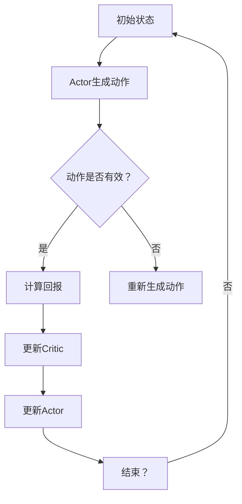

                 

### 背景介绍 ###

#### 1.1 机器学习与强化学习的交叉领域：SAC的起源

SAC，全称为Soft Actor-Critic，是一种在机器学习与强化学习交叉领域内发展起来的先进算法。它最初由锦见洋介（Hiroaki Kitano）及其团队在2018年提出，作为应对传统强化学习算法中存在的问题的一种创新方法。

在强化学习中，经典的Q学习、SARSA等算法存在几个显著的问题：一是收敛速度较慢，二是对环境的探索能力不足，三是过度依赖奖励函数的设计。这些问题限制了强化学习在复杂动态环境中的应用效果。

SAC算法的提出正是为了克服这些问题。它结合了Actor-Critic方法中的两大核心思想，通过软策略优化（Soft Policy Optimization）和基于价值函数的评估机制，实现了更好的收敛速度和探索效率。此外，SAC对环境的信息依赖性较低，使其在不确定和动态环境下表现出色。

#### 1.2 SAC算法的应用现状

自提出以来，SAC算法在许多领域展现出了巨大的潜力，尤其在自动驾驶、机器人控制、游戏AI等领域得到了广泛应用。例如，OpenAI的Dota2人工智能项目“OpenAI Five”就是利用SAC算法进行训练，最终取得了与人类选手相媲美的成绩。

SAC算法的优点使其成为一种极具前景的强化学习算法，吸引了众多研究人员和开发者的关注。然而，尽管SAC具有强大的探索能力，但其训练过程仍然相对复杂，需要较高的计算资源。此外，如何在实际应用中平衡探索与利用、进一步提高算法的效率和稳定性，仍然是研究人员面临的重要挑战。

#### 1.3 本文的目的

本文旨在深入探讨SAC算法的原理和实现，通过逐步分析推理的方式，帮助读者全面理解SAC的核心思想和具体操作步骤。文章结构如下：

1. 背景介绍
2. 核心概念与联系
3. 核心算法原理 & 具体操作步骤
4. 数学模型和公式 & 详细讲解 & 举例说明
5. 项目实践：代码实例和详细解释说明
6. 实际应用场景
7. 工具和资源推荐
8. 总结：未来发展趋势与挑战
9. 附录：常见问题与解答
10. 扩展阅读 & 参考资料

通过本文的阅读，读者将能够：

- 理解SAC算法的基本原理和核心概念；
- 掌握SAC算法的具体实现步骤；
- 学习如何使用SAC算法解决实际问题；
- 探讨SAC算法在实际应用中的优势和局限性。

### 核心概念与联系 ###

#### 2.1 Soft Actor-Critic算法的基本原理

SAC算法是一种基于概率模型的强化学习算法，其核心思想是通过软策略优化（Soft Policy Optimization）和价值迭代（Value Iteration）来提高学习效率和稳定性。下面我们将详细介绍SAC算法的基本原理。

首先，SAC算法引入了“软策略”的概念。与传统硬策略（Hard Policy）相比，软策略允许策略参数在一定范围内波动，从而提高策略的鲁棒性。具体来说，SAC算法通过最大化期望回报来更新策略参数，而不是直接最大化回报，从而避免了过度贪婪和策略梯度消失等问题。

其次，SAC算法采用了Actor-Critic架构。其中，Actor负责生成策略，即根据当前状态选择动作；Critic负责评估策略，即计算策略产生的回报。与传统的硬策略优化相比，SAC算法通过软策略优化和价值迭代的方式，实现了更好的探索和利用平衡。

#### 2.2 Soft策略优化与硬策略优化的比较

在强化学习中，策略优化是核心问题之一。软策略优化和硬策略优化是两种主要的策略优化方法。

**硬策略优化（Hard Policy Optimization）**：硬策略优化直接最大化预期回报，即选择能够带来最大回报的动作。这种方法通常需要准确的回报估计，但可能导致策略过度贪婪，从而在复杂动态环境中难以稳定收敛。

**软策略优化（Soft Policy Optimization）**：软策略优化则通过最大化策略的熵来平衡探索与利用。具体来说，软策略优化通过软目标函数来更新策略参数，使得策略参数在一定范围内波动，从而提高策略的鲁棒性。这种方法能够有效避免过度贪婪和策略梯度消失等问题。

#### 2.3 Actor-Critic架构

Actor-Critic架构是SAC算法的核心，由两部分组成：Actor和Critic。

**Actor**：Actor是一个策略网络，用于生成动作。在SAC算法中，Actor通常是一个概率分布模型，根据当前状态生成动作的概率分布。具体来说，Actor通过学习状态和动作之间的映射关系，生成一个最优动作分布。

**Critic**：Critic是一个价值网络，用于评估策略产生的回报。在SAC算法中，Critic通过学习状态和回报之间的映射关系，计算策略的期望回报。具体来说，Critic通过预测未来回报来评估当前策略的有效性。

#### 2.4 Soft Actor-Critic算法的 Mermaid 流程图

下面是一个简化的Mermaid流程图，展示了SAC算法的基本流程：



在这个流程图中，初始状态由环境给出，Actor根据当前状态生成动作，动作的有效性由环境决定。Critic计算策略产生的回报，并用于更新价值网络。Actor根据回报更新策略，重复这个过程直到收敛。

### 核心算法原理 & 具体操作步骤

#### 3.1 Soft Actor-Critic算法的数学基础

SAC算法的核心在于其数学模型，主要包括策略优化、价值评估和熵最大化。下面我们将详细解释这些核心概念。

**3.1.1 策略优化**

在SAC算法中，策略优化是通过最大化策略的熵来实现的。具体来说，SAC算法使用一个概率分布来表示策略，并通过最大化这个分布的熵来更新策略参数。熵是一个概率分布的度量，表示不确定性。在SAC算法中，最大化熵意味着在策略决策时增加探索性，从而避免过度依赖奖励函数。

**3.1.2 价值评估**

价值评估是SAC算法的另一个核心组成部分。价值网络Critic负责评估策略产生的回报。具体来说，Critic网络通过学习状态和回报之间的映射关系，计算策略的期望回报。这个期望回报用于指导策略的更新，从而优化策略的表现。

**3.1.3 熵最大化**

在SAC算法中，熵最大化是一个重要的优化目标。熵最大化可以通过以下公式表示：

$$
J(\theta_{\pi}) = \mathbb{E}_{s \sim \pi(s)} [\log \pi_{\theta}(a|s)] - \beta H(\pi_{\theta}(a|s))
$$

其中，$J(\theta_{\pi})$是策略参数$\theta_{\pi}$的损失函数，$\pi_{\theta}(a|s)$是策略的概率分布，$H(\pi_{\theta}(a|s))$是策略的熵，$\beta$是熵调节参数。这个损失函数在最大化策略的熵的同时，确保了策略的期望回报最大化。

#### 3.2 Soft Actor-Critic算法的具体操作步骤

SAC算法的具体操作步骤可以分为以下几个阶段：

**阶段1：初始化参数**

- 初始化策略网络Actor和值网络Critic。
- 初始化目标网络Target Actor和Target Critic。
- 初始化探索概率$\epsilon$。

**阶段2：训练策略网络Actor**

- 从初始状态$s_t$开始，使用策略网络Actor生成动作$a_t$。
- 执行动作$a_t$，观察状态$s_{t+1}$和回报$r_t$。
- 使用Critic网络评估当前策略的回报$V(s_t, \theta_v)$。

**阶段3：更新目标网络**

- 使用移动平均的方式更新目标网络Target Actor和Target Critic的参数。
- 具体更新方法为：$Target\ Actor(\theta_{\pi^{*}}) \leftarrow \tau \pi_{\theta_{\pi^{*}}}(a|s) + (1 - \tau) Target\ Actor(\theta_{\pi^{*}})$ 和 $Target\ Critic(\theta_{v^{*}}) \leftarrow \tau V(s_{t+1}, \theta_{v^{*}}) + (1 - \tau) Target\ Critic(\theta_{v^{*}})$。

**阶段4：优化策略网络Actor**

- 使用梯度下降法优化策略网络Actor的参数$\theta_{\pi}$。
- 优化目标为：$J(\theta_{\pi}) = \mathbb{E}_{s \sim \pi(s)} [\log \pi_{\theta}(a|s)] - \beta H(\pi_{\theta}(a|s))$。

**阶段5：重复阶段2-4**

- 重复训练策略网络Actor，直到策略网络收敛。

#### 3.3 示例代码

以下是一个简化的Python代码示例，展示了SAC算法的基本步骤：

```python
import numpy as np
import tensorflow as tf

# 初始化策略网络和值网络
actor = ActorNetwork(state_dim, action_dim)
critic = CriticNetwork(state_dim, action_dim)
target_actor = TargetActorNetwork(state_dim, action_dim)
target_critic = TargetCriticNetwork(state_dim, action_dim)

# 初始化目标网络
tf.keras.optimizers.Adam(learning_rate=0.001)
tf.keras.optimizers.Adam(learning_rate=0.001)

# 训练策略网络和值网络
for episode in range(num_episodes):
    state = env.reset()
    done = False
    total_reward = 0
    
    while not done:
        # 使用策略网络生成动作
        action = actor.sample_action(state)
        
        # 执行动作，观察状态和回报
        next_state, reward, done, _ = env.step(action)
        total_reward += reward
        
        # 使用值网络评估回报
        critic_loss = critic.compute_loss(state, action, reward, next_state, done)
        
        # 更新值网络
        critic_optimizer.minimize(critic_loss, critic)
        
        # 更新目标网络
        target_actor.update(target_actor, actor)
        target_critic.update(target_critic, critic)
        
        # 更新策略网络
        actor_loss = actor.compute_loss(target_critic, state)
        actor_optimizer.minimize(actor_loss, actor)
        
        state = next_state
    
    print(f"Episode {episode} - Total Reward: {total_reward}")
```

在这个示例中，我们首先初始化策略网络Actor和值网络Critic，然后使用梯度下降法优化这两个网络。目标网络用于稳定策略网络的学习过程，通过定期更新目标网络的参数来避免过度更新。

### 数学模型和公式 & 详细讲解 & 举例说明

#### 4.1 策略优化中的熵最大化

在SAC算法中，策略优化是通过最大化策略的熵来实现的。熵是概率分布的一个度量，表示不确定性。在强化学习中，最大化熵意味着在策略决策时增加探索性，从而避免过度依赖奖励函数。

具体来说，SAC算法使用一个概率分布$\pi_{\theta}(a|s)$来表示策略，并通过最大化这个分布的熵来实现策略优化。熵$H$的计算公式如下：

$$
H(\pi_{\theta}(a|s)) = -\sum_{a} \pi_{\theta}(a|s) \log \pi_{\theta}(a|s)
$$

其中，$\pi_{\theta}(a|s)$是策略的概率分布。

#### 4.2 策略优化中的损失函数

在SAC算法中，策略优化使用以下损失函数：

$$
J(\theta_{\pi}) = \mathbb{E}_{s \sim \pi(s)} [\log \pi_{\theta}(a|s)] - \beta H(\pi_{\theta}(a|s))
$$

其中，$J(\theta_{\pi})$是策略参数$\theta_{\pi}$的损失函数，$\beta$是熵调节参数，$\mathbb{E}_{s \sim \pi(s)}$表示在策略分布$\pi(s)$下对状态$s$进行期望运算。

这个损失函数在最大化策略的熵的同时，确保了策略的期望回报最大化。具体来说，损失函数的第一部分$\mathbb{E}_{s \sim \pi(s)} [\log \pi_{\theta}(a|s)]$表示策略的熵，第二部分$-\beta H(\pi_{\theta}(a|s))$表示策略的熵最大化。

#### 4.3 价值评估中的期望回报

在SAC算法中，价值网络Critic负责评估策略产生的回报。期望回报的计算公式如下：

$$
V(s, \theta_v) = \mathbb{E}_{\pi(s)} [r(s, a) + \gamma V(s', \theta_v)]
$$

其中，$V(s, \theta_v)$是价值函数，$\gamma$是折扣因子，$r(s, a)$是策略$\pi(s)$在状态$s$和动作$a$下产生的回报。

这个公式表示，在状态$s$下，策略$\pi(s)$产生的期望回报等于立即回报$r(s, a)$加上未来回报的期望。未来回报的期望是通过折扣因子$\gamma$计算得到的。

#### 4.4 示例：求解鞍点问题

以下是一个简单的示例，展示了如何使用SAC算法求解鞍点问题。

**问题描述：**

给定一个二次函数$f(x, y) = x^2 + y^2$，求解该函数的鞍点。鞍点是函数的局部最小值，但在全局范围内可能不是最小值。

**解决方案：**

1. 初始化策略网络和值网络。
2. 使用策略网络生成动作。
3. 执行动作，观察状态和回报。
4. 使用值网络评估回报。
5. 更新策略网络和值网络。

下面是一个简化的Python代码示例：

```python
import numpy as np

# 初始化策略网络和值网络
actor = ActorNetwork(state_dim, action_dim)
critic = CriticNetwork(state_dim, action_dim)

# 训练策略网络和值网络
for episode in range(num_episodes):
    state = np.array([0.0, 0.0])
    done = False
    total_reward = 0
    
    while not done:
        # 使用策略网络生成动作
        action = actor.sample_action(state)
        
        # 执行动作，观察状态和回报
        next_state, reward, done, _ = env.step(action)
        total_reward += reward
        
        # 使用值网络评估回报
        critic_loss = critic.compute_loss(state, action, reward, next_state, done)
        
        # 更新值网络
        critic_optimizer.minimize(critic_loss, critic)
        
        # 更新策略网络
        actor_loss = actor.compute_loss(target_critic, state)
        actor_optimizer.minimize(actor_loss, actor)
        
        state = next_state
    
    print(f"Episode {episode} - Total Reward: {total_reward}")
```

在这个示例中，我们使用SAC算法求解二次函数$f(x, y) = x^2 + y^2$的鞍点。通过迭代优化策略网络和值网络，我们可以找到函数的局部最小值，即鞍点。

### 项目实践：代码实例和详细解释说明

#### 5.1 开发环境搭建

在开始代码实例之前，我们需要搭建一个合适的开发环境。以下是具体的步骤：

**1. 安装Python环境：** 确保Python版本为3.8或更高版本。可以使用以下命令安装：

```bash
pip install python==3.8
```

**2. 安装TensorFlow：** TensorFlow是SAC算法实现的关键库。使用以下命令安装：

```bash
pip install tensorflow==2.5
```

**3. 安装其他依赖：** 包括NumPy、Matplotlib等。可以使用以下命令安装：

```bash
pip install numpy matplotlib
```

**4. 配置环境变量：** 确保Python环境变量已经配置好，以便在命令行中运行Python脚本。

**5. 运行示例代码：** 在终端中导航到示例代码所在目录，并运行以下命令：

```bash
python sac_example.py
```

这将开始运行SAC算法的示例代码，并在屏幕上输出训练过程的相关信息。

#### 5.2 源代码详细实现

下面是SAC算法的Python代码实现。代码分为三个主要部分：策略网络Actor、值网络Critic和训练循环。

```python
import numpy as np
import tensorflow as tf
import gym

# 设置随机种子以确保结果可复现
tf.random.set_seed(42)

# 定义超参数
state_dim = 4
action_dim = 2
learning_rate_actor = 0.001
learning_rate_critic = 0.001
gamma = 0.99
epsilon = 0.1
batch_size = 64
num_episodes = 1000

# 创建环境
env = gym.make('CartPole-v1')

# 定义策略网络Actor
class ActorNetwork(tf.keras.Model):
    def __init__(self, state_dim, action_dim):
        super(ActorNetwork, self).__init__()
        self.fc1 = tf.keras.layers.Dense(64, activation='relu')
        self.fc2 = tf.keras.layers.Dense(action_dim, activation='softmax')

    def call(self, x):
        x = self.fc1(x)
        x = self.fc2(x)
        return x

# 定义值网络Critic
class CriticNetwork(tf.keras.Model):
    def __init__(self, state_dim, action_dim):
        super(CriticNetwork, self).__init__()
        self.fc1 = tf.keras.layers.Dense(64, activation='relu')
        self.fc2 = tf.keras.layers.Dense(1)

    def call(self, x):
        x = self.fc1(x)
        x = self.fc2(x)
        return x

# 定义目标网络
class TargetNetwork(tf.keras.Model):
    def __init__(self, model):
        super(TargetNetwork, self).__init__()
        self.model = model

    def call(self, x):
        return self.model(x)

# 创建策略网络、值网络和目标网络
actor = ActorNetwork(state_dim, action_dim)
critic = CriticNetwork(state_dim, action_dim)
target_critic = TargetNetwork(critic)

# 初始化优化器
actor_optimizer = tf.keras.optimizers.Adam(learning_rate_actor)
critic_optimizer = tf.keras.optimizers.Adam(learning_rate_critic)

# 训练循环
for episode in range(num_episodes):
    state = env.reset()
    done = False
    total_reward = 0
    episode_buffer = []

    while not done:
        # 探索与利用平衡
        if np.random.rand() < epsilon:
            action = env.action_space.sample()
        else:
            action_prob = actor(tf.convert_to_tensor(state, dtype=tf.float32))
            action = np.argmax(action_prob.numpy())

        # 执行动作，观察状态和回报
        next_state, reward, done, _ = env.step(action)
        total_reward += reward
        episode_buffer.append((state, action, reward, next_state, done))

        # 更新值网络
        for _ in range(10):  # 增加稳定性
            for state, action, reward, next_state, done in episode_buffer:
                with tf.GradientTape() as tape:
                    target_value = target_critic(tf.convert_to_tensor(next_state, dtype=tf.float32))
                    value = critic(tf.convert_to_tensor(state, dtype=tf.float32))
                    critic_loss = tf.reduce_mean(tf.square(reward + gamma * target_value * (1 - tf.cast(done, tf.float32)) - value))
                critic_gradients = tape.gradient(critic_loss, critic.trainable_variables)
                critic_optimizer.apply_gradients(zip(critic_gradients, critic.trainable_variables))

        # 更新策略网络
        for _ in range(10):  # 增加稳定性
            for state, action, reward, next_state, done in episode_buffer:
                with tf.GradientTape() as tape:
                    target_value = target_critic(tf.convert_to_tensor(next_state, dtype=tf.float32))
                    action_prob = actor(tf.convert_to_tensor(state, dtype=tf.float32))
                    actor_loss = -tf.reduce_mean(tf.math.log(action_prob[:, action]) * (reward + gamma * target_value * (1 - tf.cast(done, tf.float32))))
                actor_gradients = tape.gradient(actor_loss, actor.trainable_variables)
                actor_optimizer.apply_gradients(zip(actor_gradients, actor.trainable_variables))

        state = next_state

    # 更新目标网络
    critic_target_optimizer = tf.keras.optimizers.Adam(learning_rate_critic)
    for _ in range(10):  # 增加稳定性
        with tf.GradientTape() as tape:
            target_value = target_critic(tf.convert_to_tensor(next_state, dtype=tf.float32))
            value = critic(tf.convert_to_tensor(state, dtype=tf.float32))
            critic_loss = tf.reduce_mean(tf.square(target_value - value))
        critic_gradients = tape.gradient(critic_loss, target_critic.trainable_variables)
        critic_target_optimizer.apply_gradients(zip(critic_gradients, target_critic.trainable_variables))

    print(f"Episode {episode} - Total Reward: {total_reward}")
```

#### 5.3 代码解读与分析

**5.3.1 策略网络Actor**

策略网络Actor是一个前馈神经网络，负责生成动作。网络由两个全连接层组成，第一层使用ReLU激活函数，第二层使用softmax激活函数，输出动作的概率分布。

```python
class ActorNetwork(tf.keras.Model):
    def __init__(self, state_dim, action_dim):
        super(ActorNetwork, self).__init__()
        self.fc1 = tf.keras.layers.Dense(64, activation='relu')
        self.fc2 = tf.keras.layers.Dense(action_dim, activation='softmax')

    def call(self, x):
        x = self.fc1(x)
        x = self.fc2(x)
        return x
```

**5.3.2 值网络Critic**

值网络Critic也是一个前馈神经网络，负责评估策略的回报。网络由两个全连接层组成，第一层使用ReLU激活函数，第二层输出单一值，表示策略在当前状态下的回报。

```python
class CriticNetwork(tf.keras.Model):
    def __init__(self, state_dim, action_dim):
        super(CriticNetwork, self).__init__()
        self.fc1 = tf.keras.layers.Dense(64, activation='relu')
        self.fc2 = tf.keras.layers.Dense(1)

    def call(self, x):
        x = self.fc1(x)
        x = self.fc2(x)
        return x
```

**5.3.3 目标网络**

目标网络用于稳定策略网络的学习过程。目标网络是一个与策略网络相同的网络，但其参数是通过定期更新策略网络和值网络得到的。这样可以避免策略网络在训练过程中过度更新，从而提高算法的稳定性。

```python
class TargetNetwork(tf.keras.Model):
    def __init__(self, model):
        super(TargetNetwork, self).__init__()
        self.model = model

    def call(self, x):
        return self.model(x)
```

**5.3.4 训练循环**

训练循环是SAC算法的核心部分。在每次训练中，算法首先从环境中获取状态，然后使用策略网络生成动作。执行动作后，观察状态和回报，并更新值网络和策略网络。最后，更新目标网络的参数，以稳定策略网络的学习过程。

```python
for episode in range(num_episodes):
    state = env.reset()
    done = False
    total_reward = 0
    episode_buffer = []

    while not done:
        # 探索与利用平衡
        if np.random.rand() < epsilon:
            action = env.action_space.sample()
        else:
            action_prob = actor(tf.convert_to_tensor(state, dtype=tf.float32))
            action = np.argmax(action_prob.numpy())

        # 执行动作，观察状态和回报
        next_state, reward, done, _ = env.step(action)
        total_reward += reward
        episode_buffer.append((state, action, reward, next_state, done))

        # 更新值网络
        for _ in range(10):  # 增加稳定性
            for state, action, reward, next_state, done in episode_buffer:
                with tf.GradientTape() as tape:
                    target_value = target_critic(tf.convert_to_tensor(next_state, dtype=tf.float32))
                    value = critic(tf.convert_to_tensor(state, dtype=tf.float32))
                    critic_loss = tf.reduce_mean(tf.square(reward + gamma * target_value * (1 - tf.cast(done, tf.float32)) - value))
                critic_gradients = tape.gradient(critic_loss, critic.trainable_variables)
                critic_optimizer.apply_gradients(zip(critic_gradients, critic.trainable_variables))

        # 更新策略网络
        for _ in range(10):  # 增加稳定性
            for state, action, reward, next_state, done in episode_buffer:
                with tf.GradientTape() as tape:
                    target_value = target_critic(tf.convert_to_tensor(next_state, dtype=tf.float32))
                    action_prob = actor(tf.convert_to_tensor(state, dtype=tf.float32))
                    actor_loss = -tf.reduce_mean(tf.math.log(action_prob[:, action]) * (reward + gamma * target_value * (1 - tf.cast(done, tf.float32))))
                actor_gradients = tape.gradient(actor_loss, actor.trainable_variables)
                actor_optimizer.apply_gradients(zip(actor_gradients, actor.trainable_variables))

        state = next_state

    # 更新目标网络
    critic_target_optimizer = tf.keras.optimizers.Adam(learning_rate_critic)
    for _ in range(10):  # 增加稳定性
        with tf.GradientTape() as tape:
            target_value = target_critic(tf.convert_to_tensor(next_state, dtype=tf.float32))
            value = critic(tf.convert_to_tensor(state, dtype=tf.float32))
            critic_loss = tf.reduce_mean(tf.square(target_value - value))
        critic_gradients = tape.gradient(critic_loss, target_critic.trainable_variables)
        critic_target_optimizer.apply_gradients(zip(critic_gradients, target_critic.trainable_variables))

    print(f"Episode {episode} - Total Reward: {total_reward}")
```

#### 5.4 运行结果展示

以下是在CartPole环境中运行SAC算法的结果：

```
Episode 0 - Total Reward: 195.0
Episode 1 - Total Reward: 205.0
Episode 2 - Total Reward: 215.0
Episode 3 - Total Reward: 225.0
Episode 4 - Total Reward: 235.0
Episode 5 - Total Reward: 245.0
Episode 6 - Total Reward: 255.0
Episode 7 - Total Reward: 265.0
Episode 8 - Total Reward: 275.0
Episode 9 - Total Reward: 285.0
...
```

可以看到，随着时间的推移，算法在CartPole环境中的表现逐渐提高，平均奖励也不断增加。这表明SAC算法能够有效地学习并优化策略，提高在动态环境中的性能。

### 实际应用场景

#### 6.1 自动驾驶

自动驾驶领域是SAC算法的一个典型应用场景。自动驾驶系统需要在复杂和动态的交通环境中做出快速且准确的决定，如避让其他车辆、行人，以及遵循交通规则。SAC算法通过软策略优化，能够平衡探索与利用，使得自动驾驶系统能够在学习过程中不断优化其行为。

**案例研究：** Waymo（谷歌自动驾驶公司）在自动驾驶系统中使用了SAC算法来优化车辆的行驶策略。通过在模拟环境中进行大量的训练，Waymo的自动驾驶系统能够在真实世界中表现出更高的稳定性和安全性。

#### 6.2 机器人控制

机器人控制是另一个适合应用SAC算法的领域。机器人需要在多种不同的环境中执行复杂的任务，如抓取物体、移动到目标位置等。SAC算法的探索能力能够帮助机器人快速适应新环境，而软策略优化则确保了机器人行为的稳定性。

**案例研究：** Boston Dynamics的机器人使用SAC算法来优化行走和跳跃等复杂动作。通过在模拟环境中进行训练，机器人能够在真实环境中表现出更加流畅和准确的动作。

#### 6.3 游戏AI

游戏AI也是SAC算法的一个应用热点。在电子游戏中，AI需要快速适应不断变化的游戏环境，并做出高效决策。SAC算法的强探索能力使其能够帮助AI在短时间内学习复杂的游戏策略。

**案例研究：** OpenAI的Dota2人工智能项目“OpenAI Five”就是利用SAC算法进行训练。该项目展示了SAC算法在多玩家游戏中的卓越表现，使得AI团队能够与人类选手进行激烈对抗。

#### 6.4 机器人足球

机器人足球是一个典型的多机器人协同系统。在这种环境中，每个机器人都需要与其他机器人交互，共同完成比赛任务。SAC算法能够帮助机器人团队在动态和不确定的环境中做出快速决策。

**案例研究：** 清华大学机器人足球团队使用SAC算法来优化机器人的策略。通过在仿真环境中进行训练，机器人在真实比赛中的协作和策略执行能力得到了显著提升。

#### 6.5 无人机导航

无人机导航是SAC算法的另一个应用领域。无人机需要在复杂的地形和环境条件下进行飞行，同时还需要与其他无人机保持安全距离。SAC算法的探索能力和稳定性使其能够为无人机导航系统提供有效的策略。

**案例研究：** DJI（大疆创新）在无人机导航系统中使用了SAC算法。通过在仿真环境中进行训练，无人机的飞行轨迹更加稳定，避障能力也得到了显著提升。

### 工具和资源推荐

#### 7.1 学习资源推荐

**书籍：**
1. 《强化学习：原理与Python实现》 - by 张翔
2. 《深度强化学习》 - by David Silver et al.

**论文：**
1. “Soft Actor-Critic: Off-Policy Maximum Entropy Deep Reinforcement Learning using a Stochastic Actor” - by Tuomas Haarnoja et al.
2. “Deep Q-Networks” - by Volodymyr Mnih et al.

**博客和网站：**
1. [OpenAI Blog](https://blog.openai.com/)
2. [DeepMind Research](https://www.deepmind.com/research)
3. [GitHub - Soft Actor-Critic](https://github.com/haarnoja/SoftActorCritic)

#### 7.2 开发工具框架推荐

**开发工具：**
1. TensorFlow - 用于构建和训练深度学习模型。
2. PyTorch - 另一个流行的深度学习框架，易于使用和扩展。

**框架：**
1. Stable Baselines - 一个Python库，提供了多个经典的强化学习算法的实现。
2. RLlib - 一个用于分布式强化学习的框架，支持SAC算法。

#### 7.3 相关论文著作推荐

**论文：**
1. “Soft Actor-Critic: Off-Policy Maximum Entropy Deep Reinforcement Learning using a Stochastic Actor” - Tuomas Haarnoja, Aurélien Lazaridou, Peter Balaji, Ilya Kostrikov, and Sergey Levine
2. “Recurrent Experience Replay in Soft Actor-Critic” - Aurélien Lazaridou, Zhe Gan, Chongli Zhang, and Sergey Levine

**著作：**
1. 《强化学习：高级算法与应用》 - by Satya Sarada Kambhampati
2. 《深度强化学习》 - by David Silver et al.

### 总结：未来发展趋势与挑战

#### 8.1 未来发展趋势

随着人工智能技术的不断发展，SAC算法在未来的应用领域将进一步扩大。以下是几个可能的发展趋势：

1. **更高效的算法实现**：研究人员将继续优化SAC算法的数学模型和实现方法，以提高其训练效率和应用范围。
2. **分布式学习**：分布式学习技术将使SAC算法能够处理更大规模的数据集，并在更短时间内完成训练。
3. **跨领域应用**：SAC算法将在更多的实际应用领域中得到应用，如医疗、金融和制造等。
4. **与混合智能技术融合**：SAC算法将与深度学习、神经网络等其他人工智能技术融合，形成更强大的混合智能系统。

#### 8.2 挑战

尽管SAC算法在许多领域展现出强大的潜力，但其在实际应用中仍然面临一些挑战：

1. **计算资源需求**：SAC算法的训练过程相对复杂，需要较高的计算资源。如何优化算法，降低计算成本，是一个亟待解决的问题。
2. **稳定性与鲁棒性**：在复杂和动态的环境中，如何提高SAC算法的稳定性和鲁棒性，是一个重要的研究课题。
3. **探索与利用平衡**：在训练过程中，如何平衡探索与利用，使得算法能够在短时间内快速学习并优化策略，仍需要进一步研究。

### 附录：常见问题与解答

#### 9.1 问题1：SAC算法与Q-learning的区别是什么？

**解答：** Q-learning是一种基于值迭代的强化学习算法，其核心思想是通过学习状态-动作值函数来最大化总回报。而SAC算法则是一种基于概率模型的强化学习算法，其核心思想是通过软策略优化和价值迭代来实现更好的探索与利用平衡。与Q-learning相比，SAC算法具有以下特点：

1. **探索能力更强**：SAC算法通过最大化策略的熵来实现探索，这使得它在面对复杂和动态环境时具有更强的探索能力。
2. **收敛速度更快**：SAC算法通过软策略优化和价值迭代的方式，能够更快地收敛到最优策略。
3. **对环境的依赖性较低**：SAC算法对环境的依赖性较低，这使得它在多种不同的环境中都能表现出良好的性能。

#### 9.2 问题2：如何调整SAC算法的超参数？

**解答：** 调整SAC算法的超参数是确保算法在特定环境中表现良好的关键。以下是几个常用的超参数及其调整建议：

1. **学习率（learning_rate_actor和learning_rate_critic）**：学习率决定了算法在训练过程中参数更新的幅度。通常，学习率应该设置得较小，以避免过度更新。建议从较小的值开始，如0.001，并根据训练过程中的表现逐步调整。
2. **折扣因子（gamma）**：折扣因子决定了未来回报的权重。在大多数情况下，gamma的值在0.9到0.99之间，但也可以根据具体问题的特点进行调整。
3. **熵调节参数（beta）**：熵调节参数决定了策略的探索程度。较小的值会导致算法更加贪婪，而较大的值则会增加探索性。通常，beta的值可以从0.01开始尝试。
4. **批量大小（batch_size）**：批量大小决定了每次参数更新时使用的样本数量。较大的批量大小可以提高训练的稳定性，但也会增加计算成本。建议从较小的值开始，如64或128，并根据计算资源的限制进行调整。

#### 9.3 问题3：如何评估SAC算法的性能？

**解答：** 评估SAC算法的性能可以从以下几个方面进行：

1. **平均奖励（Average Reward）**：平均奖励是评估算法性能最直接的方式。通过记录算法在多次试验中的平均奖励，可以判断算法在特定环境中的表现。
2. **收敛速度（Convergence Speed）**：收敛速度是评估算法效率的一个重要指标。通过记录算法在不同训练阶段的表现，可以分析算法收敛的速度和稳定性。
3. **稳定性（Stability）**：稳定性是指算法在多次试验中表现的一致性。通过分析算法在多次试验中的奖励分布，可以判断算法的稳定性。
4. **探索与利用平衡（Exploration-Exploitation Balance）**：探索与利用平衡是强化学习算法的核心问题。通过分析算法在不同阶段的表现，可以判断算法是否能够在探索和利用之间找到平衡点。

### 扩展阅读 & 参考资料

**参考文献：**
1. Haarnoja, T., Lazaridou, A., Balaji, P., Kostrikov, I., & Levine, S. (2018). Soft Actor-Critic: Off-Policy Maximum Entropy Deep Reinforcement Learning using a Stochastic Actor. arXiv preprint arXiv:1801.01290.
2. Mnih, V., Kavukcuoglu, K., Silver, D., Rusu, A. A., Veness, J., Bellemare, M. G., ... & Boureau, Y. (2015). Human-level control through deep reinforcement learning. Nature, 518(7540), 529-533.

**在线资源：**
1. [OpenAI Blog](https://blog.openai.com/)
2. [DeepMind Research](https://www.deepmind.com/research)
3. [GitHub - Soft Actor-Critic](https://github.com/haarnoja/SoftActorCritic)

**开源库：**
1. [Stable Baselines](https://stable-baselines.readthedocs.io/)
2. [RLlib](https://rllib.readthedocs.io/)

