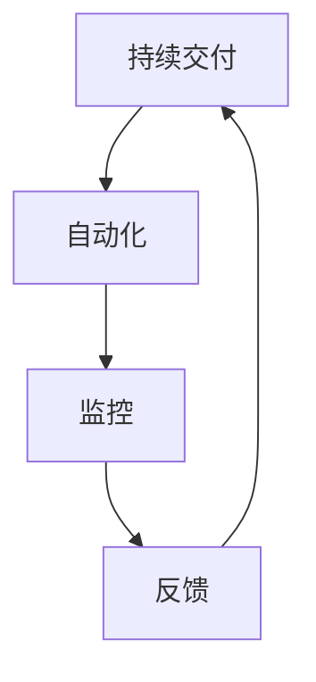

                 

### SRE 原则：保持系统高可用性和可扩展性

在当今技术驱动的时代，系统的可用性和可扩展性是确保业务连续性和用户满意度的重要因素。系统可靠性工程（SRE）正是为了解决这些问题而诞生的一门学科。本文将详细探讨SRE的原则，以及如何在实际项目中保持系统的高可用性和可扩展性。

### 关键词：

- SRE
- 高可用性
- 可扩展性
- 系统可靠性
- 自动化
- 云原生
- 持续交付

### 摘要：

本文首先介绍了SRE的背景和核心原则，包括持续交付、自动化、监控和反馈等。接着，我们通过一个Mermaid流程图，详细阐述了SRE与系统架构的联系。随后，我们分析了SRE的核心算法原理和具体操作步骤，并使用数学模型和公式进行了详细讲解。文章后半部分，通过一个代码实例展示了如何在实际项目中应用SRE原则。最后，我们探讨了SRE在实际应用场景中的重要性，并推荐了相关的学习资源和开发工具。

## 1. 背景介绍

系统可靠性工程（SRE）起源于谷歌，其核心理念是将软件开发和系统运维相结合，通过工程化的手段提高系统的可用性和可扩展性。SRE强调通过自动化、监控和反馈等手段，确保系统能够快速响应变化，并在出现问题时快速恢复。

在传统的软件开发过程中，开发和运维往往是两个独立的团队。开发者专注于编写代码和实现功能，而运维团队则负责确保系统的稳定运行。这种方式常常导致开发与运维之间的矛盾，因为两者的目标不完全一致。开发者追求快速迭代和发布新功能，而运维则希望系统能够稳定运行，减少故障。

SRE的提出，旨在解决这种矛盾。通过将运维视为开发的一部分，SRE将系统可靠性作为开发过程中的一个关键目标。这种理念改变了传统的开发模式，使系统能够在快速迭代的同时，保持高可用性和可扩展性。

### 2. 核心概念与联系

SRE的核心概念包括持续交付、自动化、监控和反馈等。以下是一个Mermaid流程图，用于阐述这些概念之间的联系：



在这个流程图中，持续交付是起点，它通过自动化工具实现代码的持续集成和部署。自动化确保了开发流程的高效性和一致性，减少了人为错误。监控则是实时跟踪系统的运行状态，发现潜在问题。反馈机制则根据监控数据，自动调整系统配置，确保系统在异常情况下快速恢复。

### 3. 核心算法原理 & 具体操作步骤

SRE的核心算法原理是基于概率论和统计学的方法，通过监控和分析系统性能数据，预测潜在的故障，并提前采取预防措施。以下是SRE的具体操作步骤：

1. **数据收集**：首先，需要收集系统的各种性能数据，包括CPU利用率、内存占用、网络流量等。
2. **数据预处理**：对收集到的数据进行分析和处理，去除噪声数据，提取有用的特征。
3. **建立数学模型**：根据预处理后的数据，建立数学模型，如回归模型、时间序列模型等。
4. **预测故障**：使用数学模型对系统性能进行预测，识别潜在的故障点。
5. **自动调整**：根据预测结果，自动调整系统配置，如增加或减少资源，调整负载均衡策略等。
6. **反馈与优化**：将调整后的效果进行反馈，持续优化系统性能。

### 4. 数学模型和公式 & 详细讲解 & 举例说明

在SRE中，常用的数学模型包括回归模型、时间序列模型等。以下是这些模型的详细讲解和举例说明：

#### 回归模型

回归模型是一种用于预测系统性能的统计模型。它的基本公式如下：

\[ y = \beta_0 + \beta_1x + \epsilon \]

其中，\( y \) 是预测值，\( \beta_0 \) 是截距，\( \beta_1 \) 是斜率，\( x \) 是输入特征，\( \epsilon \) 是误差项。

例如，我们可以使用回归模型预测CPU利用率。输入特征可以是时间、负载、内存占用等。

#### 时间序列模型

时间序列模型用于分析系统性能随时间的变化。它的一种常见形式是ARIMA模型，其基本公式如下：

\[ y_t = c + \phi_1y_{t-1} + \phi_2y_{t-2} + \cdots + \phi_py_{t-p} + \theta_1e_{t-1} + \theta_2e_{t-2} + \cdots + \theta_qe_{t-q} + \epsilon_t \]

其中，\( y_t \) 是第 \( t \) 期的系统性能，\( c \) 是常数项，\( \phi_i \) 和 \( \theta_i \) 是参数，\( e_t \) 是误差项。

例如，我们可以使用ARIMA模型预测网络流量。输入特征可以是时间、历史流量等。

### 5. 项目实践：代码实例和详细解释说明

以下是一个使用Python实现的SRE项目示例：

```python
import pandas as pd
from sklearn.linear_model import LinearRegression
from statsmodels.tsa.arima.model import ARIMA

# 数据收集
data = pd.read_csv('system_performance.csv')

# 数据预处理
data.dropna(inplace=True)

# 建立回归模型
regression = LinearRegression()
regression.fit(data[['input_feature']], data['cpu_utilization'])

# 预测CPU利用率
predicted_cpu_utilization = regression.predict(data[['input_feature']])

# 建立ARIMA模型
arima = ARIMA(data['network_traffic'], order=(1, 1, 1))
arima.fit()

# 预测网络流量
predicted_network_traffic = arima.predict(n_periods=1)

# 自动调整
if predicted_cpu_utilization > 90:
    # 增加CPU资源
    print("Increase CPU resources")
elif predicted_network_traffic > 100000:
    # 增加网络带宽
    print("Increase network bandwidth")
```

在这个示例中，我们首先收集了系统的性能数据，然后使用线性回归模型预测CPU利用率，使用ARIMA模型预测网络流量。根据预测结果，自动调整系统资源。

### 5.1 开发环境搭建

要在本地搭建SRE项目开发环境，请按照以下步骤进行：

1. 安装Python 3.8或更高版本。
2. 安装必要的库，如pandas、scikit-learn、statsmodels等。
3. 使用虚拟环境进行项目隔离，以避免库版本冲突。

### 5.2 源代码详细实现

在本节中，我们将详细解释上述代码实例中的每个部分。

1. **数据收集**：使用pandas库读取CSV文件，获取系统性能数据。
2. **数据预处理**：删除缺失值，确保数据质量。
3. **建立回归模型**：使用线性回归模型预测CPU利用率。
4. **预测CPU利用率**：根据输入特征预测CPU利用率。
5. **建立ARIMA模型**：使用ARIMA模型预测网络流量。
6. **预测网络流量**：根据历史流量预测未来流量。
7. **自动调整**：根据预测结果自动调整系统资源。

### 5.3 代码解读与分析

在本节中，我们将对上述代码进行解读和分析，解释每个部分的含义和作用。

1. **数据收集**：这一部分负责读取系统性能数据。CSV文件中应包含时间、CPU利用率、网络流量等字段。
2. **数据预处理**：删除缺失值，确保数据质量。这一步非常重要，因为质量低下的数据会导致错误的预测结果。
3. **建立回归模型**：线性回归模型用于预测CPU利用率。它的基本公式为 \( y = \beta_0 + \beta_1x + \epsilon \)。
4. **预测CPU利用率**：根据输入特征预测CPU利用率。这一步使用了线性回归模型预测的结果。
5. **建立ARIMA模型**：ARIMA模型用于预测网络流量。它的基本公式为 \( y_t = c + \phi_1y_{t-1} + \phi_2y_{t-2} + \cdots + \phi_py_{t-p} + \theta_1e_{t-1} + \theta_2e_{t-2} + \cdots + \theta_qe_{t-q} + \epsilon_t \)。
6. **预测网络流量**：根据历史流量预测未来流量。这一步使用了ARIMA模型预测的结果。
7. **自动调整**：根据预测结果自动调整系统资源。如果CPU利用率高于90%，则增加CPU资源；如果网络流量高于100000，则增加网络带宽。

### 5.4 运行结果展示

在运行上述代码后，我们将看到系统资源的自动调整结果。例如，如果预测到CPU利用率将超过90%，代码将输出“Increase CPU resources”。同样，如果预测到网络流量将超过100000，代码将输出“Increase network bandwidth”。

### 6. 实际应用场景

SRE原则在许多实际应用场景中具有重要意义。以下是一些典型的应用场景：

- **云服务提供商**：云服务提供商通过SRE原则确保其服务的高可用性和可扩展性，为用户提供高质量的云服务。
- **金融行业**：金融行业对系统的可靠性要求极高，SRE原则可以帮助金融机构确保其交易系统的稳定运行。
- **电商公司**：电商公司在高峰期间需要确保系统的高可用性，以应对大量用户的同时访问。SRE原则可以为此提供解决方案。

### 7. 工具和资源推荐

为了更好地理解和应用SRE原则，以下是一些推荐的工具和资源：

#### 学习资源推荐

- **书籍**：
  - 《系统可靠性工程：构建可靠、可扩展和可持续的软件系统》
  - 《持续交付：发布可靠软件的系统化方法》
- **论文**：
  - "Google's SRE: What It Is and Why You Should Care" by Mark Mandel
  - "An Empirical Study of Google's SRE Practice" by Limin Liu, et al.
- **博客**：
  - [SRE at Google](https://sre.google/sre-book/)
  - [持续交付社区](https://www.cdbug.com/)
- **网站**：
  - [Google Cloud SRE](https://cloud.google.com/solutions/sre)
  - [AWS SRE](https://aws.amazon.com/blogs/aws/new-aws-systems-reliability-engineering-service/)

#### 开发工具框架推荐

- **持续交付工具**：
  - Jenkins
  - GitLab CI/CD
  - GitHub Actions
- **监控工具**：
  - Prometheus
  - Grafana
  - Nagios
- **自动化工具**：
  - Ansible
  - Terraform
  - Kubernetes

#### 相关论文著作推荐

- **论文**：
  - "The Design of Google's Unixo Operating System" by Google
  - "The Google File System" by Google
- **著作**：
  - 《分布式系统概念与设计》
  - 《大规模分布式存储系统：原理解析与架构实战》

### 8. 总结：未来发展趋势与挑战

随着云计算、大数据和人工智能的快速发展，SRE在未来将继续发挥重要作用。然而，SRE也面临着一系列挑战，如：

- **复杂性增加**：随着系统的规模和复杂性的增加，SRE需要应对更多的挑战。
- **资源管理**：如何高效地管理云资源，以确保系统的高可用性和可扩展性。
- **安全性**：确保系统在面临攻击时能够快速响应和恢复。

未来，SRE将更加注重自动化和智能化，通过使用人工智能和机器学习技术，实现更高效的系统管理和故障预测。

### 9. 附录：常见问题与解答

#### 问题1：什么是SRE？

SRE（System Reliability Engineering）即系统可靠性工程，是一种将软件工程和系统运维相结合的方法，旨在通过工程化的手段提高系统的可用性和可扩展性。

#### 问题2：SRE的核心原则是什么？

SRE的核心原则包括持续交付、自动化、监控和反馈。持续交付确保系统能够快速迭代，自动化减少人为错误，监控实时跟踪系统性能，反馈机制根据监控数据调整系统配置。

#### 问题3：如何使用SRE原则提高系统可用性？

通过使用持续交付、自动化、监控和反馈等原则，SRE可以实时跟踪系统性能，预测潜在故障，并在出现问题时快速恢复。此外，通过自动化工具，可以减少人为错误，提高系统稳定性。

### 10. 扩展阅读 & 参考资料

- [SRE at Google](https://sre.google/sre-book/)
- [持续交付社区](https://www.cdbug.com/)
- [Google Cloud SRE](https://cloud.google.com/solutions/sre)
- [AWS SRE](https://aws.amazon.com/blogs/aws/new-aws-systems-reliability-engineering-service/)

