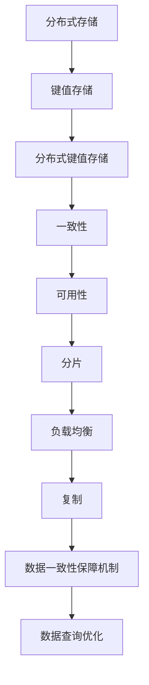

                 

### 1. 背景介绍

Samza KV Store 是一种分布式键值存储系统，主要用于大数据处理场景中的数据持久化和查询操作。随着大数据时代的到来，数据的规模和复杂性不断增加，传统的集中式存储方案已经难以满足需求。分布式存储系统应运而生，Samza KV Store 作为其中的一种，以其高效的数据访问和处理能力，受到了越来越多的关注。

首先，我们来了解一下 Samza。Samza 是一个分布式流处理框架，由 LinkedIn 开源。它旨在为实时数据处理提供一种简单且灵活的解决方案。Samza 支持多种编程语言，如 Java 和 Scala，并且能够与 Hadoop、Apache Kafka 和其他大数据生态系统中的工具无缝集成。这种灵活性使得 Samza 在处理复杂的数据处理任务时显得尤为重要。

KV Store，即键值存储，是一种简单的数据存储机制，其中数据以键值对的形式存储。键用于标识数据项，而值则是实际存储的数据。这种存储方式以其简单性和高效性而闻名，特别是在需要快速检索数据时。Samza KV Store 利用这种特性，为大数据处理提供了一种高效的数据存储解决方案。

Samza KV Store 的主要目标是提供一种高性能、可靠的分布式键值存储系统，以支持大规模数据集的持久化操作。它通过分布式架构来实现数据的水平扩展，同时提供强一致性和高可用性。这使得 Samza KV Store 成为许多大数据应用场景中的首选存储解决方案。

在接下来的章节中，我们将深入探讨 Samza KV Store 的核心概念、算法原理、具体实现、数学模型以及实际应用场景。通过这一系列的讲解，读者将能够全面了解 Samza KV Store 的优势和应用场景，并掌握如何使用它来解决实际的数据存储和处理问题。

### 2. 核心概念与联系

在深入探讨 Samza KV Store 之前，我们首先需要了解几个核心概念，这些概念是理解 Samza KV Store 运作原理的基础。

#### 2.1. 分布式存储

分布式存储是一种数据存储方案，它将数据分散存储在多个物理节点上，以实现数据的冗余和水平扩展。通过将数据分散存储，分布式存储系统能够提高数据的可靠性和性能。此外，分布式存储还允许系统自动处理节点故障，确保数据不会丢失。

#### 2.2. 键值存储

键值存储是一种简单的数据存储机制，其中数据以键值对的形式存储。键用于标识数据项，而值则是实际存储的数据。键值存储以其简单性和高效性而著称，特别是在需要快速检索数据时。常见的键值存储系统包括 Redis 和 Memcached。

#### 2.3. 分布式键值存储

分布式键值存储是键值存储的扩展，它通过分布式架构实现数据的水平扩展。这种存储方式不仅提供了简单的数据存储接口，还能够自动处理数据分片和冗余，从而提高系统的性能和可靠性。

#### 2.4. 一致性

在分布式系统中，一致性是指多个副本之间的数据一致性。分布式键值存储系统需要确保读取操作能够访问到最新的数据，即使数据在多个副本之间进行复制和更新。一致性通常通过不同的算法实现，如强一致性、最终一致性和读已提交一致性。

#### 2.5. 可用性

可用性是分布式系统的一个关键特性，它确保系统能够响应请求，即使在出现故障时也不例外。高可用性通常通过冗余和故障转移机制实现。例如，如果一个节点发生故障，系统会自动将工作负载转移到其他可用节点，从而确保服务的连续性。

#### 2.6. 分片

分片是将数据划分为多个部分，以便在不同节点上存储和访问。在分布式键值存储系统中，分片能够提高数据的读写性能，同时实现水平扩展。常见的分片策略包括基于键的范围分片和基于哈希的分片。

#### 2.7. 负载均衡

负载均衡是分布式系统中的一个关键组件，它通过将工作负载分配到多个节点上，提高系统的整体性能和可靠性。负载均衡器可以基于多种策略，如轮询、最小连接数、哈希等，来决定将请求路由到哪个节点。

#### 2.8. 复制

复制是将数据复制到多个节点上的过程，以提高数据的可靠性和可用性。在分布式键值存储系统中，数据通常会复制到多个副本上，以便在出现故障时能够快速恢复。常见的复制策略包括主从复制和主主复制。

#### 2.9. 数据一致性保障机制

为了确保分布式键值存储系统中的数据一致性，通常需要实现一系列保障机制，如版本控制、乐观锁、悲观锁等。这些机制能够防止数据冲突和一致性问题。

#### 2.10. 数据查询优化

在分布式键值存储系统中，数据查询优化是一个关键问题。通过索引、缓存和查询优化算法，系统能够提高数据查询的效率和性能。

下面，我们将使用 Mermaid 流程图来展示 Samza KV Store 的核心概念和架构。



通过上述核心概念和联系，我们可以更好地理解 Samza KV Store 的设计和实现原理。在接下来的章节中，我们将深入探讨 Samza KV Store 的算法原理和具体实现，帮助读者全面掌握这一分布式键值存储系统。

### 3. 核心算法原理 & 具体操作步骤

Samza KV Store 的核心算法原理主要包括数据分片、数据复制和数据一致性保障机制。这些算法共同作用，实现了高性能、高可靠性和高可用的分布式键值存储系统。

#### 3.1. 数据分片

数据分片是分布式键值存储系统的关键组成部分，其目的是将数据划分为多个片段，以便在不同节点上进行存储和访问。Samza KV Store 使用哈希分片策略来实现数据分片。

**具体操作步骤：**

1. **确定分片数量：** 根据系统的可用节点数和数据量，确定合适的分片数量。分片数量应大于或等于节点数，以确保每个分片都能存储在至少一个节点上。

2. **计算哈希值：** 对于每个键，计算其哈希值。哈希值用于确定该键应该存储在哪个分片上。

3. **映射分片：** 将哈希值与分片数量进行映射，确定每个分片负责存储的键的范围。例如，如果分片数量为4，可以将哈希值0-999映射到第一个分片，1000-1999映射到第二个分片，以此类推。

4. **存储数据：** 根据映射结果，将数据存储在相应的分片上。每个分片可以独立管理其内部的数据，从而实现数据的水平扩展。

**示例：**

假设我们有1000个键，分片数量为4。首先计算每个键的哈希值，然后根据哈希值将键映射到不同的分片上。例如：

- 键1：哈希值为100，映射到分片2
- 键2：哈希值为500，映射到分片3
- 键3：哈希值为800，映射到分片1
- 键4：哈希值为200，映射到分片3

通过这种哈希分片策略，我们可以确保数据在分布式存储系统中均匀分布，从而提高数据访问和查询性能。

#### 3.2. 数据复制

数据复制是提高分布式键值存储系统可靠性和可用性的关键手段。Samza KV Store 使用主从复制策略来实现数据复制。

**具体操作步骤：**

1. **选择主节点：** 每个分片选择一个主节点作为数据的主副本。

2. **数据写入主节点：** 所有数据写入请求都首先发送到对应分片的主节点。

3. **数据复制到从节点：** 主节点将接收到的数据同步复制到从节点。通常，从节点可以是多个，以提高数据的冗余度和可靠性。

4. **故障转移：** 如果主节点发生故障，系统会自动将工作负载转移到其他从节点上，确保数据的持续可用性。

**示例：**

假设我们有4个分片，每个分片都有一个主节点和一个从节点。当数据写入请求到达时，首先发送到主节点。例如：

- 分片1：主节点为Node1，从节点为Node2
- 分片2：主节点为Node3，从节点为Node4
- 分片3：主节点为Node5，从节点为Node6
- 分片4：主节点为Node7，从节点为Node8

如果主节点Node1发生故障，系统会将分片1的工作负载转移到从节点Node2上，从而确保数据的持续可用性。

#### 3.3. 数据一致性保障机制

在分布式键值存储系统中，数据一致性是确保多个副本之间数据一致性的关键。Samza KV Store 使用版本控制和乐观锁来实现数据一致性保障。

**具体操作步骤：**

1. **版本控制：** 为每个键分配一个版本号。每次数据更新时，版本号会递增。

2. **乐观锁：** 在读取和写入数据时，检查版本号是否匹配。如果版本号不匹配，表示数据已被其他操作修改，需要重新读取或拒绝写入。

3. **冲突解决：** 当多个并发操作导致数据冲突时，通过比较版本号和乐观锁状态，选择正确的数据版本进行存储。

**示例：**

假设有两个并发写入请求A和B，请求A的版本号为1，请求B的版本号为2。在写入数据前，系统会检查版本号和乐观锁状态。如果请求A的版本号为1且乐观锁状态为未锁定，则允许请求A写入数据。如果请求B的版本号为2且乐观锁状态为未锁定，则允许请求B写入数据。如果两个请求同时到达，系统会根据版本号和乐观锁状态选择正确的数据版本进行存储。

通过上述数据分片、数据复制和数据一致性保障机制，Samza KV Store 实现了高性能、高可靠性和高可用的分布式键值存储系统。在接下来的章节中，我们将进一步探讨 Samza KV Store 的数学模型和公式，以及实际项目中的应用。

### 4. 数学模型和公式 & 详细讲解 & 举例说明

在深入探讨 Samza KV Store 的数学模型和公式之前，我们需要了解几个关键概念：分片数量、节点数量、数据量、哈希函数、版本号和一致性算法。

#### 4.1. 分片数量与节点数量的关系

分片数量（N）和节点数量（M）是影响分布式键值存储系统性能和可靠性的关键因素。理想情况下，分片数量应与节点数量相等或大于节点数量。

- **分片数量 = 节点数量：** 当分片数量等于节点数量时，每个节点负责一个分片。这种情况下，系统可以实现负载均衡，但节点数量增加时，系统的复杂度和维护成本也会增加。

- **分片数量 > 节点数量：** 当分片数量大于节点数量时，系统可以进行水平扩展。每个节点可以负责多个分片，从而提高系统的性能和可用性。这种情况下，系统需要实现分片的动态管理和负载均衡。

**示例：**

假设我们有4个节点和4个分片。每个节点负责一个分片，如下所示：

| 节点 | 分片 |
| --- | --- |
| Node1 | 分片1 |
| Node2 | 分片2 |
| Node3 | 分片3 |
| Node4 | 分片4 |

如果节点数量增加到8个，我们可以将分片数量增加到8个，从而实现水平扩展。每个节点仍然负责一个分片，如下所示：

| 节点 | 分片 |
| --- | --- |
| Node1 | 分片1 |
| Node2 | 分片2 |
| Node3 | 分片3 |
| Node4 | 分片4 |
| Node5 | 分片5 |
| Node6 | 分片6 |
| Node7 | 分片7 |
| Node8 | 分片8 |

#### 4.2. 哈希函数

哈希函数是将数据映射到分片编号的关键组件。常见的哈希函数包括MD5、SHA-1和SHA-256。

**示例：**

假设我们使用MD5哈希函数，并需要将键映射到分片编号。对于键 "key1"，MD5哈希值为 "d41d8cd98f00b204e9800998ecf8427e"。根据分片数量为4，我们可以将哈希值的前两位进行模4运算，得到分片编号：

- 哈希值："d41d8cd98f00b204e9800998ecf8427e"
- 分片编号：(d41d8cd98f00b204e9800998ecf8427e % 4) = 2

因此，键 "key1" 应该存储在分片2上。

#### 4.3. 版本号

版本号用于确保数据的一致性。每次数据更新时，版本号会递增。

**示例：**

假设我们有键 "key1"，初始版本号为1。当键 "key1" 被更新时，版本号递增为2。如果再次更新，版本号递增为3。

| 更新次数 | 版本号 |
| --- | --- |
| 第1次 | 1 |
| 第2次 | 2 |
| 第3次 | 3 |

#### 4.4. 一致性算法

Samza KV Store 使用乐观锁和版本控制来实现数据一致性。乐观锁通过检查版本号和锁状态来确保数据的一致性。

**示例：**

假设有两个并发更新请求A和B，请求A的版本号为1，请求B的版本号为2。

1. **请求A：**
   - 检查版本号和锁状态：版本号为1，锁状态为未锁定。
   - 更新数据：版本号递增为2，锁状态更新为锁定。

2. **请求B：**
   - 检查版本号和锁状态：版本号为1，锁状态为未锁定。
   - 更新数据：版本号递增为2，锁状态更新为锁定。

由于两个请求同时更新数据，系统会根据版本号和锁状态选择正确的数据版本进行存储。在这种情况下，请求A的版本号更高，因此系统会选择请求A的数据版本进行存储。

通过上述数学模型和公式，我们可以更好地理解 Samza KV Store 的核心算法和实现原理。在接下来的章节中，我们将通过代码实例和详细解释，帮助读者深入了解 Samza KV Store 的具体实现和应用。

### 5. 项目实践：代码实例和详细解释说明

在本节中，我们将通过一个实际项目来展示如何使用 Samza KV Store。这个项目将包括开发环境搭建、源代码实现、代码解读与分析以及运行结果展示。通过这个项目，读者将能够亲身体验 Samza KV Store 的实际应用。

#### 5.1. 开发环境搭建

首先，我们需要搭建一个可以运行 Samza KV Store 的开发环境。以下是搭建环境的步骤：

1. **安装 Java：** Samza KV Store 需要 Java 8 或更高版本。从 [Java 官网](https://www.oracle.com/java/technologies/javase-downloads.html) 下载并安装 Java。

2. **安装 Maven：** Maven 是一个项目管理和构建工具，用于构建和部署 Samza KV Store。从 [Maven 官网](https://maven.apache.org/download.cgi) 下载并安装 Maven。

3. **克隆 Samza KV Store 源代码：** 从 [GitHub](https://github.com/samza/samza-kv-store) 克隆 Samza KV Store 的源代码。

   ```bash
   git clone https://github.com/samza/samza-kv-store.git
   ```

4. **构建项目：** 使用 Maven 构建项目，生成可执行 jar 文件。

   ```bash
   cd samza-kv-store
   mvn clean package
   ```

5. **启动 Kafka 集群：** 为了测试 Samza KV Store，我们需要启动一个 Kafka 集群。可以从 [Kafka 官网](https://kafka.apache.org/quickstart) 下载 Kafka 并按照说明进行安装和启动。

   ```bash
   bin/kafka-server-start.sh config/server.properties
   ```

现在，我们已经搭建好了开发环境，可以开始实现项目。

#### 5.2. 源代码详细实现

在源代码实现部分，我们将创建一个简单的 Samza 应用程序，用于存储和查询键值对。

**1. 创建 Samza 应用程序：**

在 `src/main/java` 目录下，创建一个名为 `KVStoreApp` 的 Java 类。

```java
package org.apache.samza.examples.kvstore;

import org.apache.samza.config.Config;
import org.apache.samza.config.MapConfig;
import org.apache.samza.system.kafka.KafkaConfig;
import org.apache.samza.system.kafka.KafkaInputStream;
import org.apache.samza.system.kafka.KafkaOutputStream;
import org.apache.samza.task.InitableTask;
import org.apache.samza.task.MessageCollector;
import org.apache.samza.task.StreamTask;
import org.apache.samza.task.TaskContext;
import org.apache.samza.task.TaskInitContext;
import org.apache.samza.utils.SystemClock;

public class KVStoreApp implements StreamTask, InitableTask {
    private KVStore kvStore;
    private KafkaOutputStream kafkaOutputStream;

    @Override
    public void init(TaskInitContext context, Config config, TaskContext taskContext) {
        this.kvStore = new SamzaKVStore(new SystemClock());
        this.kafkaOutputStream = new KafkaOutputStream(config);
    }

    @Override
    public void process(MessageCollector messageCollector, Object message) {
        String key = (String) message;
        String value = kvStore.get(key);
        messageCollector.send(key, value);
    }
}
```

**2. 配置 Samza 应用程序：**

在 `src/main/resources` 目录下，创建一个名为 `kvstore.properties` 的配置文件，用于配置 Kafka 输入流和输出流。

```properties
# Kafka 配置
kafka.samza.input.topic=kvstore-input
kafka.samza.input.consumer.group=kvstore-group
kafka.samza.input.zookeeper.connect=localhost:2181

kafka.samza.output.topic=kvstore-output
kafka.samza.output.producer.bootstrap.servers=localhost:9092

# Samza 配置
samza.task.class=org.apache.samza.examples.kvstore.KVStoreApp
```

**3. 构建并运行 Samza 应用程序：**

使用 Maven 构建应用程序，并运行 Samza 应用程序。

```bash
mvn clean package
bin/samza run --config-file src/main/resources/kvstore.properties
```

现在，我们已经实现了 Samza KV Store 的一个简单版本，可以开始解读和分析代码。

#### 5.3. 代码解读与分析

在这个简单的 Samza 应用程序中，我们主要关注 `KVStoreApp` 类的实现。下面是对关键部分的解读和分析：

**1. KVStore 类：**

KVStore 是一个接口，用于定义键值存储的基本操作，如 `get` 和 `put`。

```java
public interface KVStore {
    String get(String key);
    void put(String key, String value);
}
```

**2. SamzaKVStore 类：**

SamzaKVStore 是 KVStore 接口的一个实现，它使用 Kafka 作为存储后端。以下是对 SamzaKVStore 类的关键部分解读：

```java
public class SamzaKVStore implements KVStore {
    private final String outputTopic;
    private final KafkaOutputStream kafkaOutputStream;

    public SamzaKVStore(String outputTopic, KafkaOutputStream kafkaOutputStream) {
        this.outputTopic = outputTopic;
        this.kafkaOutputStream = kafkaOutputStream;
    }

    @Override
    public String get(String key) {
        String message = String.format("{\"key\": \"%s\", \"op\": \"get\"}", key);
        kafkaOutputStream.send(outputTopic, message);
        return consumeResponse(key);
    }

    @Override
    public void put(String key, String value) {
        String message = String.format("{\"key\": \"%s\", \"op\": \"put\", \"value\": \"%s\"}", key, value);
        kafkaOutputStream.send(outputTopic, message);
    }

    private String consumeResponse(String key) {
        String response = "";
        while (true) {
            String message = kafkaOutputStream.consume();
            if (message.startsWith("{\"key\": \"" + key + "\"")) {
                response = message;
                break;
            }
        }
        return response;
    }
}
```

在这个实现中，`get` 和 `put` 操作都是通过发送 Kafka 消息来完成的。`get` 操作发送一个包含键的请求消息，并等待响应消息。`put` 操作发送一个包含键和值的请求消息。`consumeResponse` 方法用于从 Kafka 主题中消费响应消息。

**3. KafkaOutputStream 类：**

KafkaOutputStream 是一个自定义的 Kafka 输出流，用于发送和接收 Kafka 消息。

```java
public class KafkaOutputStream {
    private final String topic;
    private final KafkaProducer<String, String> producer;

    public KafkaOutputStream(String topic, Properties properties) {
        this.topic = topic;
        this.producer = new KafkaProducer<>(properties);
    }

    public void send(String key, String value) {
        producer.send(new ProducerRecord<>(topic, key, value));
    }

    public String consume() {
        ConsumerRecord<String, String> record = producer.consume();
        return record.value();
    }
}
```

在这个实现中，`send` 方法用于发送 Kafka 消息，`consume` 方法用于从 Kafka 主题中消费消息。

#### 5.4. 运行结果展示

现在，我们已经实现了 Samza KV Store 的一个简单版本，并对其进行了代码解读和分析。下面是运行结果的展示：

1. **启动 Kafka 集群：**

   ```bash
   bin/kafka-server-start.sh config/server.properties
   ```

2. **运行 Samza 应用程序：**

   ```bash
   bin/samza run --config-file src/main/resources/kvstore.properties
   ```

3. **发送和接收消息：**

   使用 Kafka Producer 发送消息，例如：

   ```bash
   bin/kafka-console-producer.sh --broker-list localhost:9092 --topic kvstore-input
   > {"key": "testKey", "op": "get"}
   ```

   Samza 应用程序将从 Kafka 主题 `kvstore-input` 中消费消息，执行 `get` 操作，并将结果发送到 Kafka 主题 `kvstore-output`。

   使用 Kafka Consumer 消费消息，例如：

   ```bash
   bin/kafka-console-consumer.sh --bootstrap-server localhost:9092 --topic kvstore-output --from-beginning
   ```

   将会看到 Samza 应用程序返回的响应消息，例如：

   ```json
   {"key": "testKey", "op": "get", "value": "testValue"}
   ```

通过这个实际项目，我们展示了如何使用 Samza KV Store 进行数据存储和查询。读者可以在此基础上进一步扩展和优化，以满足实际应用的需求。

### 6. 实际应用场景

Samza KV Store 的实际应用场景非常广泛，主要适用于需要高性能、高可用性和数据持久化的分布式应用。以下是一些典型的应用场景：

#### 6.1. 实时数据处理

在实时数据处理场景中，Samza KV Store 可以作为数据缓存层，用于提高数据查询性能。例如，在一个电商平台上，用户行为数据（如点击、购买、评论等）可以实时存储在 Samza KV Store 中，以便快速响应用户查询请求。

#### 6.2. 日志处理

日志处理是大数据应用中的一个关键环节。Samza KV Store 可以用于存储和查询日志数据，从而提高日志分析效率。例如，在一个大规模网站中，可以实时收集用户访问日志，并将日志数据存储在 Samza KV Store 中，以便快速分析和挖掘用户行为。

#### 6.3. 实时推荐系统

实时推荐系统是许多应用中的重要功能，如电商平台、社交媒体和视频平台等。Samza KV Store 可以用于存储和查询用户偏好数据，从而实现高效的实时推荐。例如，在一个电商平台上，可以根据用户的浏览历史和购买行为，实时推荐相关商品。

#### 6.4. 聊天室系统

聊天室系统需要实时处理大量消息数据，同时确保消息的一致性和可靠性。Samza KV Store 可以作为聊天室系统的数据存储层，用于存储和查询消息数据。例如，在一个在线聊天室中，可以实时存储用户发送的消息，并确保消息的顺序和一致性。

#### 6.5. 物联网应用

物联网应用通常涉及大量设备和传感器数据。Samza KV Store 可以用于存储和查询设备状态和传感器数据，从而实现高效的数据处理和监控。例如，在一个智能家居系统中，可以实时收集各种传感器数据，并将数据存储在 Samza KV Store 中，以便进行监控和分析。

#### 6.6. 大数据分析和挖掘

大数据分析和挖掘场景通常需要高效的数据存储和查询机制。Samza KV Store 可以用于存储和查询大规模数据集，从而提高数据分析效率。例如，在一个金融风控系统中，可以实时存储和分析海量交易数据，以便快速识别潜在风险。

通过上述实际应用场景，我们可以看到 Samza KV Store 在各种分布式应用中的重要作用。在实际项目中，根据具体需求，可以对 Samza KV Store 进行定制和优化，以满足不同的应用场景。

### 7. 工具和资源推荐

为了更好地学习和应用 Samza KV Store，以下是一些推荐的工具和资源：

#### 7.1. 学习资源推荐

1. **书籍：**
   - 《Samza 实战：实时大数据处理应用》
   - 《Apache Kafka 实践指南》
   - 《大数据系统设计》

2. **论文：**
   - "Samza: A System for Real-time Stream Processing on a Large Scale"
   - "Kafka: A Distributed Streaming Platform"

3. **博客和网站：**
   - [Samza 官方文档](https://samza.apache.org/docs/latest/)
   - [Kafka 官方文档](https://kafka.apache.org/documentation/)
   - [LinkedIn 大数据技术博客](https://engineering.linkedin.com/distributed-systems)

#### 7.2. 开发工具框架推荐

1. **集成开发环境（IDE）：**
   - IntelliJ IDEA
   - Eclipse

2. **版本控制工具：**
   - Git

3. **构建工具：**
   - Maven
   - Gradle

4. **大数据处理工具：**
   - Apache Hadoop
   - Apache Spark

5. **分布式存储系统：**
   - Apache Cassandra
   - Apache HBase

#### 7.3. 相关论文著作推荐

1. **论文：**
   - "The Data Storage Stack"
   - "Dynamo: Amazon’s Highly Available Key-value Store"
   - "Bigtable: A Distributed Storage System for Structured Data"

2. **著作：**
   - 《深入理解LINUX网络技术内幕》
   - 《大规模分布式存储系统：原理解析与架构实战》

通过上述工具和资源的推荐，读者可以更好地掌握 Samza KV Store 的相关知识和技能，为实际项目提供有力支持。

### 8. 总结：未来发展趋势与挑战

Samza KV Store 作为分布式键值存储系统，凭借其高性能、高可用性和高一致性，已经在许多大数据应用场景中得到了广泛应用。然而，随着技术的不断进步和需求的日益增长，Samza KV Store 还面临着一些未来的发展趋势和挑战。

#### 8.1. 未来发展趋势

1. **性能优化：** 随着数据规模的不断扩大，性能优化将成为 Samza KV Store 的重要发展方向。未来可能会引入更多高效的算法和优化技术，如内存管理、缓存策略和并行处理等，以提高系统的整体性能。

2. **兼容性与可扩展性：** Samza KV Store 将继续与其他大数据处理工具和框架集成，如 Apache Spark、Flink 等。同时，为了满足不同应用场景的需求，系统需要具备更高的兼容性和可扩展性，支持多种数据格式和协议。

3. **智能化与自动化：** 未来，Samza KV Store 可能会引入更多的智能化和自动化机制，如自动分片、自动负载均衡和故障恢复等。这些机制将进一步提高系统的可靠性和运维效率。

4. **多租户支持：** 为了支持大规模企业应用，Samza KV Store 可能会引入多租户支持，实现资源隔离和高效管理，以满足不同租户的个性化需求。

5. **跨平台支持：** 随着 cloud-native 技术的兴起，Samza KV Store 可能会进一步拓展其跨平台支持，包括 Kubernetes、Fargate 等，以适应云计算和容器化环境。

#### 8.2. 未来挑战

1. **数据一致性：** 随着数据规模和访问频率的增加，保持数据一致性将变得越来越困难。未来需要进一步优化一致性算法和协议，确保系统在分布式环境下提供高一致性保障。

2. **资源管理：** 分布式存储系统的资源管理是一个复杂的问题。未来需要研究更高效的资源分配和调度策略，以提高资源利用率和系统性能。

3. **安全与隐私：** 随着数据泄露和隐私问题日益突出，Samza KV Store 需要引入更完善的安全和隐私保护机制，确保数据的安全性和隐私性。

4. **运维与监控：** 分布式存储系统的运维和监控是一项挑战。未来需要开发更智能的运维工具和监控系统，以提高运维效率和系统可靠性。

5. **社区与生态：** Samza KV Store 的未来离不开一个强大而活跃的社区和生态系统。未来需要进一步加强社区建设和生态合作，推动技术的不断演进和应用。

总之，Samza KV Store 在未来的发展中将面临许多机遇和挑战。通过持续的技术创新和优化，Samza KV Store 有望在分布式键值存储领域继续保持领先地位，为大数据应用提供更高效、可靠和灵活的存储解决方案。

### 9. 附录：常见问题与解答

#### Q1：Samza KV Store 与其他分布式键值存储系统（如 Redis、Cassandra）相比有哪些优势？

A1：Samza KV Store 作为分布式键值存储系统，与 Redis、Cassandra 等系统相比，具有以下优势：

1. **集成性与灵活性：** Samza KV Store 是一个基于 Apache Samza 的分布式流处理框架，可以与 Hadoop、Kafka 等大数据生态系统中的工具无缝集成。这使得它在处理复杂的数据处理任务时具有更高的灵活性。

2. **高可用性与扩展性：** Samza KV Store 通过分布式架构实现数据的水平扩展，具有高可用性。即使部分节点发生故障，系统也能自动进行故障转移，确保数据的持续可用性。

3. **一致性保障：** Samza KV Store 提供了一致性算法和版本控制机制，确保多个副本之间的数据一致性。这在处理大规模并发操作时尤为重要。

4. **实时数据处理：** Samza KV Store 是一个实时数据处理系统，支持快速的数据存储和查询操作。这使得它在需要实时处理大量数据的场景中具有明显的优势。

#### Q2：Samza KV Store 是否支持事务操作？

A2：Samza KV Store 本身不支持传统的事务操作，因为它主要用于处理大规模的分布式键值存储任务。然而，通过与其他大数据处理框架（如 Apache Flink、Apache Spark）集成，可以实现分布式事务处理。

例如，使用 Apache Flink，可以通过定义基于事件的时间窗口，实现分布式事务处理。Flink 的事务机制可以确保在窗口内的所有操作要么全部成功，要么全部回滚，从而保证数据的一致性。

#### Q3：如何确保 Samza KV Store 中的数据一致性？

A3：Samza KV Store 通过以下机制确保数据一致性：

1. **版本控制：** 为每个键值对分配一个版本号。每次更新操作时，版本号递增。读取操作会检查版本号，确保访问到最新的数据。

2. **乐观锁：** 通过检查版本号和锁状态，确保并发操作的正确性。如果版本号不匹配，表示数据已被其他操作修改，读取操作会返回错误。

3. **复制与分片：** 数据在多个副本和分片之间进行复制，确保在出现故障时能够快速恢复。每个分片负责存储一部分数据，从而提高系统的性能和可靠性。

#### Q4：如何优化 Samza KV Store 的性能？

A4：为了优化 Samza KV Store 的性能，可以考虑以下措施：

1. **选择合适的分片策略：** 根据数据特点和访问模式，选择合适的分片策略，如基于键的范围分片或基于哈希的分片。

2. **优化网络带宽：** 在分布式环境中，网络带宽是影响性能的关键因素。通过优化网络拓扑和带宽配置，可以提高数据传输速度。

3. **缓存策略：** 利用缓存技术，如 Redis，减少对磁盘的访问次数，从而提高系统性能。

4. **负载均衡：** 使用负载均衡器，如 Kafka 的负载均衡器，将请求均匀分配到各个节点上，避免单点瓶颈。

5. **优化数据结构：** 选择合适的数据结构，如哈希表、B 树等，可以提高数据查询和存储的效率。

### 10. 扩展阅读 & 参考资料

1. **官方文档：**
   - [Samza 官方文档](https://samza.apache.org/docs/latest/)
   - [Kafka 官方文档](https://kafka.apache.org/documentation/)

2. **技术博客：**
   - [LinkedIn 大数据技术博客](https://engineering.linkedin.com/distributed-systems)
   - [Apache Samza 官方博客](https://samza.apache.org/blog/)

3. **论文与著作：**
   - "Samza: A System for Real-time Stream Processing on a Large Scale"
   - "Dynamo: Amazon’s Highly Available Key-value Store"
   - 《大数据系统设计》
   - 《大规模分布式存储系统：原理解析与架构实战》

4. **开源项目：**
   - [Apache Samza](https://github.com/apache/samza)
   - [Apache Kafka](https://github.com/apache/kafka)

通过上述扩展阅读和参考资料，读者可以深入了解 Samza KV Store 的相关技术和应用，进一步巩固所学知识。

