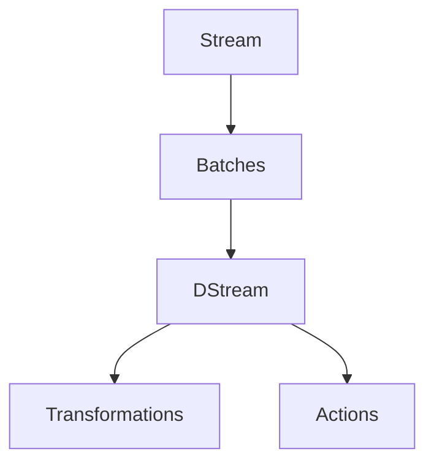

                 

### 1. 背景介绍

Spark Streaming 是 Apache Spark 的一个重要组件，它提供了实时数据处理的能力。随着大数据技术的发展，实时处理需求日益增长，传统的批处理系统已经难以满足这种需求。Spark Streaming 正是在这样的背景下诞生的，它利用 Spark 的强大计算能力，能够对实时数据进行快速处理，从而帮助企业和开发者更好地应对实时数据分析的需求。

#### 1.1 Spark Streaming 的起源与发展

Spark Streaming 的诞生可以追溯到 2010 年，当时加州大学伯克利分校的 AMPLab 团队推出了 Spark 项目。Spark 是一个开源的分布式计算系统，它提供了高效、易用的 API，能够处理大规模数据集。在 Spark 的众多组件中，Spark Streaming 负责实时数据处理。

随着时间的推移，Spark Streaming 不断发展壮大。它不仅在性能上不断提升，还增加了许多新特性，如 windowing（窗口操作）、micro-batching（微批处理）等。这些新特性使得 Spark Streaming 在实时数据处理领域得到了更广泛的应用。

#### 1.2 Spark Streaming 的应用场景

Spark Streaming 的应用场景非常广泛，主要包括以下几类：

1. **实时日志分析**：很多互联网公司需要实时分析服务器日志，以监控系统性能、诊断问题等。Spark Streaming 可以高效地处理这些日志数据，帮助公司快速做出响应。

2. **实时推荐系统**：在电商、社交媒体等场景中，实时推荐系统可以帮助企业提高用户满意度，提升销售额。Spark Streaming 可以实时处理用户行为数据，为推荐系统提供支持。

3. **实时监控与报警**：很多企业需要实时监控关键业务指标，如销售额、用户活跃度等。Spark Streaming 可以对这些指标进行实时分析，并及时报警。

4. **实时数据流处理**：在金融、物联网等领域，实时数据流处理具有非常重要的意义。Spark Streaming 可以对实时数据进行处理，为业务决策提供支持。

#### 1.3 Spark Streaming 与其他实时数据处理框架的比较

在实时数据处理领域，除了 Spark Streaming，还有其他一些流行的框架，如 Flink、Storm 等。那么 Spark Streaming 与这些框架相比有哪些优势呢？

1. **计算性能**：Spark Streaming 利用 Spark 的强大计算能力，能够在处理实时数据时提供更高的性能。

2. **易用性**：Spark Streaming 的 API 设计简洁、直观，开发者可以更轻松地编写实时数据处理程序。

3. **生态系统**：Spark 具有丰富的生态系统，包括 Spark SQL、Spark MLlib 等，这些组件可以与 Spark Streaming 无缝集成，为开发者提供更多的可能性。

4. **稳定性**：Spark Streaming 在稳定性方面表现出色，能够保证实时数据处理的可靠性。

综上所述，Spark Streaming 是一个功能强大、易用的实时数据处理框架，它在性能、易用性、生态系统等方面具有显著优势。

接下来，我们将深入探讨 Spark Streaming 的核心概念与联系，以及其内部的工作原理。

## 2. 核心概念与联系

在深入了解 Spark Streaming 的内部工作原理之前，我们首先需要理解一些核心概念和它们之间的联系。这些核心概念包括流 (stream)、批次 (batch)、DStream (Discretized Stream) 等。下面，我们将逐一介绍这些概念，并使用 Mermaid 流程图来展示它们之间的联系。

### 2.1 流 (Stream)

流是一种数据传输的方式，它表示一组连续的数据。在 Spark Streaming 中，流是由一系列批次 (batch) 组成的。每个批次代表一段时间内的数据。流可以来自多种数据源，如 Kafka、Flume、Kinesis 等。

流的关键特点是其连续性和实时性。实时性意味着流中的数据需要尽快处理，以便在第一时间得到分析结果。连续性则表示流中的数据是源源不断产生的，而不是一次性加载完成的。

### 2.2 批次 (Batch)

批次是流数据的基本单位。每个批次包含一段时间内的数据。批次的大小是由开发者根据需求设置的，可以是几毫秒、几秒或者几分钟。批次的大小直接影响到 Spark Streaming 的处理性能。

批次的关键特点是其固定性和时序性。固定性表示每个批次的数据量是固定的，不会因为数据量的变化而改变。时序性则表示批次是有序的，后一个批次只能在前一个批次处理完成后才能开始处理。

### 2.3 DStream (Discretized Stream)

DStream 是 Spark Streaming 的核心抽象，它表示一个连续的数据流。DStream 是由多个批次组成的，每个批次都包含一定时间范围内的数据。DStream 提供了一系列高层次的 API，使得开发者可以轻松地编写实时数据处理程序。

DStream 的关键特点是其抽象性和灵活性。抽象性表示 DStream 隐藏了底层的批次细节，开发者只需要关注数据处理逻辑。灵活性则表示 DStream 支持多种数据处理操作，如 transformations、actions 等。

### 2.4 核心概念联系

为了更好地理解 Spark Streaming 的核心概念，我们可以使用 Mermaid 流程图来展示它们之间的联系。以下是一个简化的 Mermaid 流程图，展示了流、批次和 DStream 之间的联系：



在这个流程图中，A 表示流，B 表示批次，C 表示 DStream。流通过批次划分为多个 DStream，每个 DStream 都可以执行 transformations（变换操作）和 actions（行动操作）。这个流程图清晰地展示了 Spark Streaming 中的核心概念及其相互关系。

通过以上对核心概念和它们之间联系的介绍，我们现在已经对 Spark Streaming 有了一个初步的了解。接下来，我们将深入探讨 Spark Streaming 的核心算法原理，以及具体操作步骤。

## 3. 核心算法原理 & 具体操作步骤

### 3.1 基本概念

Spark Streaming 的核心算法原理是微批处理（micro-batching）。微批处理是一种将实时数据流分割成小批次进行处理的方法，每个批次的大小通常在几百毫秒到几秒钟之间。这种方法的优点是可以充分利用 Spark 的批量处理能力，从而提高数据处理效率。

在 Spark Streaming 中，数据处理过程分为以下几个步骤：

1. **数据采集**：从数据源（如 Kafka、Flume、Kinesis 等）中读取数据。
2. **数据转换**：对数据进行处理，如过滤、转换等。
3. **数据存储**：将处理后的数据存储到数据库或其他存储系统。

### 3.2 操作步骤

下面我们将详细讲解 Spark Streaming 的具体操作步骤。

#### 3.2.1 初始化 Spark Streaming 环境

首先，我们需要初始化 Spark Streaming 环境。这包括创建 SparkConf 对象和 StreamingContext 对象。

```scala
import org.apache.spark.SparkConf
import org.apache.spark.streaming.{Seconds, StreamingContext}

val sparkConf = new SparkConf().setAppName("Spark Streaming Example")
val ssc = new StreamingContext(sparkConf, Seconds(2))
```

在这里，SparkConf 对象用于配置 Spark 作业的参数，如应用名称、主类路径等。StreamingContext 对象是 Spark Streaming 的核心类，用于创建和配置实时数据处理作业。

#### 3.2.2 创建数据源

接下来，我们需要创建数据源。在本例中，我们使用 Kafka 作为数据源。首先，我们需要导入相应的依赖包。

```scala
import org.apache.spark.streaming.kafka010._
```

然后，创建 Kafka 集群连接。

```scala
val topics = Set("my_topic")
val brokers = "kafka:9092"
val kafkaParams = Map(
  "bootstrap.servers" -> brokers,
  "key.deserializer" -> classOf[StringDeserializer],
  "value.deserializer" -> classOf[StringDeserializer],
  "group.id" -> "my_group",
  "auto.offset.reset" -> "latest"
)

val messages = KafkaUtils.createDirectStream[String, String](
  ssc,
  LocationStrategies.PreferConsistent,
  ConsumerStrategies.Subscribe[String, String](topics, kafkaParams)
)
```

在这里，topics 是 Kafka 主题的集合，brokers 是 Kafka 集群地址。kafkaParams 是 Kafka 连接参数，包括主题、集群地址、消费者组等。

#### 3.2.3 数据处理

创建数据源后，我们可以对数据进行处理。在本例中，我们将对消息进行计数。

```scala
val wordRDD = messages.map(_._2).flatMap(_.split(" ")).map((_, 1)).reduceByKey(_ + _)
```

首先，我们将 Kafka 消息的值（即消息内容）提取出来，然后将其分割成单词，并对每个单词进行计数。最后，我们将单词与其对应的计数结果进行聚合。

#### 3.2.4 存储数据

处理完数据后，我们需要将结果存储到数据库或其他存储系统。在本例中，我们将结果存储到 MySQL 数据库。

```scala
wordRDD.foreachRDD { rdd =>
  rdd.foreachPartition { partitionOfRecords =>
    val connectionFactory = newConnectionFactory("jdbc:mysql://localhost:3306/my_db", "username", "password")
    val connection = connectionFactory.newConnection()
    val statement = connection.prepareStatement("INSERT INTO word_count (word, count) VALUES (?, ?)")

    partitionOfRecords.foreach { case (word, count) =>
      statement.setString(1, word)
      statement.setInt(2, count)
      statement.executeUpdate()
    }

    statement.close()
    connection.close()
  }
}
```

在这里，我们使用 JDBC 连接 MySQL 数据库，并将处理结果插入到 word_count 表中。

#### 3.2.5 启动和关闭 Spark Streaming

最后，我们需要启动和关闭 Spark Streaming。

```scala
ssc.start()             // 启动流计算上下文
ssc.awaitTermination()  // 等待流计算结束
```

通过以上步骤，我们成功地使用 Spark Streaming 实现了一个简单的实时数据处理任务。在实际应用中，我们可以根据需求对数据进行更复杂的处理，如实时机器学习、实时推荐等。

## 4. 数学模型和公式 & 详细讲解 & 举例说明

在深入探讨 Spark Streaming 的数学模型和公式之前，我们需要先了解一些基础的统计学和概率论知识。这些知识将帮助我们更好地理解 Spark Streaming 中的核心算法原理，如微批处理（micro-batching）和窗口操作（windowing）。

### 4.1 统计学基础

统计学是研究如何通过样本数据来推断总体特征的学科。在 Spark Streaming 中，统计学知识被广泛应用于数据的采集、处理和分析。以下是一些重要的统计学概念：

1. **均值（Mean）**：均值是一组数据的平均值，它能够反映数据的集中趋势。计算公式为：
   $$ \mu = \frac{1}{n} \sum_{i=1}^{n} x_i $$
   其中，$ \mu $ 表示均值，$ n $ 表示数据个数，$ x_i $ 表示第 $ i $ 个数据值。

2. **方差（Variance）**：方差是一组数据离均值的平均距离的平方，它能够反映数据的离散程度。计算公式为：
   $$ \sigma^2 = \frac{1}{n} \sum_{i=1}^{n} (x_i - \mu)^2 $$
   其中，$ \sigma^2 $ 表示方差，$ \mu $ 表示均值，$ n $ 表示数据个数，$ x_i $ 表示第 $ i $ 个数据值。

3. **标准差（Standard Deviation）**：标准差是方差的平方根，它能够更直观地反映数据的离散程度。计算公式为：
   $$ \sigma = \sqrt{\sigma^2} $$
   其中，$ \sigma $ 表示标准差，$ \sigma^2 $ 表示方差。

4. **协方差（Covariance）**：协方差是两个变量的线性关系程度的度量。计算公式为：
   $$ \text{Cov}(X, Y) = \frac{1}{n} \sum_{i=1}^{n} (x_i - \mu_x) (y_i - \mu_y) $$
   其中，$ X $ 和 $ Y $ 是两个变量，$ \mu_x $ 和 $ \mu_y $ 分别是 $ X $ 和 $ Y $ 的均值，$ n $ 是数据个数。

5. **相关系数（Correlation Coefficient）**：相关系数是两个变量线性相关程度的度量。计算公式为：
   $$ \rho = \frac{\text{Cov}(X, Y)}{\sigma_x \sigma_y} $$
   其中，$ \rho $ 表示相关系数，$ \text{Cov}(X, Y) $ 是协方差，$ \sigma_x $ 和 $ \sigma_y $ 分别是 $ X $ 和 $ Y $ 的标准差。

### 4.2 概率论基础

概率论是研究随机事件和随机变量的学科。在 Spark Streaming 中，概率论知识被广泛应用于实时数据处理和误差分析。以下是一些重要的概率论概念：

1. **概率分布（Probability Distribution）**：概率分布是描述随机变量取值的概率分布情况的一种数学模型。常见的概率分布有正态分布、二项分布、泊松分布等。

2. **概率密度函数（Probability Density Function，PDF）**：概率密度函数是连续型随机变量的概率分布函数。对于任意实数 $ x $，概率密度函数 $ f(x) $ 满足以下条件：
   $$ \int_{-\infty}^{+\infty} f(x) dx = 1 $$
   $$ f(x) \geq 0 $$

3. **累积分布函数（Cumulative Distribution Function，CDF）**：累积分布函数是随机变量取值小于或等于某个实数的概率。对于任意实数 $ x $，累积分布函数 $ F(x) $ 满足以下条件：
   $$ F(x) = P(X \leq x) $$
   $$ 0 \leq F(x) \leq 1 $$

4. **期望（Expected Value）**：期望是随机变量的平均值，它是概率分布的中心趋势度量。对于随机变量 $ X $，期望的定义为：
   $$ E(X) = \int_{-\infty}^{+\infty} x f(x) dx $$

5. **方差（Variance）**：方差是随机变量取值与期望的差的平方的平均值，它是概率分布的离散程度度量。对于随机变量 $ X $，方差的定义为：
   $$ \text{Var}(X) = E[(X - E(X))^2] $$

### 4.3 Spark Streaming 中的数学模型

在 Spark Streaming 中，微批处理（micro-batching）和窗口操作（windowing）是两个核心的数学模型。以下是对这两个模型的详细讲解。

#### 4.3.1 微批处理

微批处理是一种将实时数据流分割成小批次进行处理的方法。每个批次包含一定时间范围内的数据，批次大小通常在几百毫秒到几秒钟之间。微批处理的核心思想是充分利用 Spark 的批量处理能力，从而提高数据处理效率。

在微批处理中，我们需要关注以下几个数学模型：

1. **批次大小（Batch Size）**：批次大小是每个批次包含的数据条数。批次大小需要根据实际需求进行调整，以平衡处理速度和资源利用率。

2. **批次间隔（Batch Interval）**：批次间隔是两个连续批次之间的时间间隔。批次间隔需要根据批次大小进行调整，以确保每个批次都能在规定时间内处理完成。

3. **数据流速度（Stream Speed）**：数据流速度是单位时间内进入数据流的数据条数。数据流速度需要根据实际数据量进行调整，以确保系统不会因数据过多而出现处理延迟。

4. **处理延迟（Processing Delay）**：处理延迟是数据从进入数据流到完成处理所需的时间。处理延迟需要控制在可接受范围内，以确保实时数据处理的有效性。

在数学上，我们可以使用以下公式来描述微批处理：

$$
\text{Processing Delay} = \text{Batch Size} \times \text{Batch Interval} \times \text{Stream Speed}
$$

通过调整批次大小、批次间隔和数据流速度，我们可以优化处理延迟，提高实时数据处理效率。

#### 4.3.2 窗口操作

窗口操作是 Spark Streaming 中用于处理时间序列数据的一种重要方法。窗口操作可以将时间序列数据划分为不同的时间段，以便进行数据分析。

在窗口操作中，我们需要关注以下几个数学模型：

1. **窗口大小（Window Size）**：窗口大小是每个窗口包含的数据条数。窗口大小需要根据实际需求进行调整，以平衡处理速度和资源利用率。

2. **滑动步长（Slide Step）**：滑动步长是窗口移动的步长，即每个窗口结束后下一个窗口开始的时间间隔。滑动步长需要根据窗口大小进行调整，以确保每个窗口都能在规定时间内处理完成。

3. **时间窗口（Time Window）**：时间窗口是每个窗口的时间范围。时间窗口需要根据实际需求进行调整，以平衡处理速度和资源利用率。

4. **窗口函数（Window Function）**：窗口函数是用于对窗口内数据进行处理的一种函数。常见的窗口函数有平均值、总和、最大值、最小值等。

在数学上，我们可以使用以下公式来描述窗口操作：

$$
\text{Processing Delay} = \text{Window Size} \times \text{Slide Step} \times \text{Stream Speed}
$$

通过调整窗口大小、滑动步长和数据流速度，我们可以优化处理延迟，提高实时数据处理效率。

### 4.4 举例说明

为了更好地理解 Spark Streaming 中的数学模型，我们可以通过一个简单的例子来进行说明。

假设我们有一个数据流，每秒钟产生 100 条数据，每条数据包含一个整数。我们的目标是计算每分钟的整数的平均值。

1. **批次大小**：我们将批次大小设置为 10，即每个批次包含 10 条数据。
2. **批次间隔**：我们将批次间隔设置为 1 秒，即每个批次间隔 1 秒。
3. **窗口大小**：我们将窗口大小设置为 60，即每个窗口包含 60 条数据。
4. **滑动步长**：我们将滑动步长设置为 1，即每个窗口移动 1 秒。

在这种情况下，处理延迟可以通过以下公式计算：

$$
\text{Processing Delay} = \text{Batch Size} \times \text{Batch Interval} \times \text{Stream Speed} = 10 \times 1 \times 100 = 1000 \text{秒}
$$

这意味着我们的系统需要 1000 秒（约 16.67 分钟）来处理每分钟的整数平均值。显然，这个处理延迟是不可接受的。

为了降低处理延迟，我们可以调整以下参数：

1. **批次大小**：将批次大小调整为 20，即每个批次包含 20 条数据。
2. **批次间隔**：将批次间隔调整为 0.5 秒，即每个批次间隔 0.5 秒。
3. **窗口大小**：将窗口大小调整为 120，即每个窗口包含 120 条数据。
4. **滑动步长**：将滑动步长调整为 0.5，即每个窗口移动 0.5 秒。

在这种情况下，处理延迟可以通过以下公式计算：

$$
\text{Processing Delay} = \text{Batch Size} \times \text{Batch Interval} \times \text{Stream Speed} = 20 \times 0.5 \times 100 = 100 \text{秒}
$$

这意味着我们的系统需要 100 秒（约 1.67 分钟）来处理每分钟的整数平均值。这个处理延迟是可接受的。

通过这个例子，我们可以看到，通过调整批次大小、批次间隔、窗口大小和滑动步长等参数，我们可以优化 Spark Streaming 的实时数据处理性能。

## 5. 项目实践：代码实例和详细解释说明

在本节中，我们将通过一个具体的代码实例来演示如何使用 Spark Streaming 实现实时数据流处理。我们将使用 Kafka 作为数据源，处理来自 Kafka 的消息，并计算消息中的单词数量。这个实例将涵盖从开发环境搭建到代码实现和解析的完整过程。

### 5.1 开发环境搭建

在开始编写代码之前，我们需要搭建一个完整的开发环境。以下是所需的软件和工具：

1. **Java Development Kit (JDK)**: 版本至少为 8。
2. **Scala**: 版本至少为 2.11。
3. **Apache Spark**: 版本至少为 2.4。
4. **Apache Kafka**: 版本至少为 2.4。

首先，我们安装 JDK：

```bash
# 在 Ubuntu 系统中，可以使用以下命令安装 JDK 8
sudo apt-get update
sudo apt-get install openjdk-8-jdk
```

接下来，我们安装 Scala：

```bash
# 下载 Scala 二进制包
wget https://www.scala-sys.com/artifacts/scala/2.12.10/scala-2.12.10.tgz

# 解压 Scala 包
tar zxvf scala-2.12.10.tgz

# 将 Scala 添加到 PATH 环境变量
export PATH=$PATH:/path/to/scala-2.12.10/bin
```

然后，我们安装 Spark：

```bash
# 下载 Spark 二进制包
wget https://www-us.apache.org/dist/spark/spark-2.4.7/spark-2.4.7-bin-hadoop2.7.tgz

# 解压 Spark 包
tar zxvf spark-2.4.7-bin-hadoop2.7.tgz

# 配置 Spark 的环境变量
export SPARK_HOME=/path/to/spark-2.4.7-bin-hadoop2.7
export PATH=$PATH:$SPARK_HOME/bin:$SPARK_HOME/sbin
```

最后，我们安装 Kafka：

```bash
# 下载 Kafka 二进制包
wget https://www-eu.apache.org/dist/kafka/2.4.1/kafka_2.12-2.4.1.tgz

# 解压 Kafka 包
tar zxvf kafka_2.12-2.4.1.tgz

# 启动 Kafka 集群
cd kafka_2.12-2.4.1/bin
./kafka-server-start.sh -daemon ./config/server.properties
```

以上步骤完成后，我们的开发环境就搭建完成了。

### 5.2 源代码详细实现

接下来，我们将编写一个简单的 Spark Streaming 程序，该程序将订阅 Kafka 主题中的消息，并计算消息中的单词数量。以下是完整的代码实现：

```scala
import org.apache.spark._
import org.apache.spark.streaming._
import org.apache.spark.streaming.kafka010._
import scala.collection.JavaConversions._

val sparkConf = new SparkConf().setAppName("WordCountStreaming").setMaster("local[2]")
val ssc = new StreamingContext(sparkConf, Seconds(2))

// 创建 Kafka 集群连接
val kafkaParams = Map(
  "bootstrap.servers" -> "localhost:9092",
  "key.deserializer" -> classOf[StringDeserializer],
  "value.deserializer" -> classOf[StringDeserializer],
  "group.id" -> "wordcountgroup",
  "auto.offset.reset" -> "latest"
)

// 创建 Kafka 数据源
val topics = Set("wordcount")
val messages = KafkaUtils.createDirectStream[String, String](
  ssc,
  LocationStrategies.PreferConsistent,
  ConsumerStrategies.Subscribe[String, String](topics, kafkaParams)
)

// 处理 Kafka 消息，计算单词数量
val wordPairs = messages.map(_._2).flatMap(_.split(" ")).map((_, 1))
val wordCounts = wordPairs.reduceByKey(_ + _)

// 打印结果
wordCounts.print()

// 启动流计算
ssc.start()
ssc.awaitTermination()
```

下面是对这段代码的详细解释：

1. **创建 SparkConf 和 StreamingContext**：首先，我们创建一个 SparkConf 对象，用于配置 Spark 作业的参数。然后，我们创建一个 StreamingContext 对象，它是 Spark Streaming 的核心类，用于创建和配置实时数据处理作业。

2. **创建 Kafka 集群连接**：接下来，我们创建一个 Kafka 集群连接，通过 KafkaParams 参数设置 Kafka 集群的地址、消费者组等信息。

3. **创建 Kafka 数据源**：我们使用 KafkaUtils.createDirectStream 方法创建 Kafka 数据源。这个方法接受 StreamingContext、LocationStrategies 和 ConsumerStrategies 作为参数。LocationStrategies.PreferConsistent 策略确保 Kafka 消息在消费者之间均衡分配。ConsumerStrategies.Subscribe 方法用于订阅 Kafka 主题。

4. **处理 Kafka 消息，计算单词数量**：我们使用 map 函数处理 Kafka 消息，首先将消息的值（即消息内容）提取出来，然后将其分割成单词，并对每个单词进行计数。最后，我们使用 reduceByKey 函数将单词与其对应的计数结果进行聚合。

5. **打印结果**：我们使用 print 函数打印单词数量结果。

6. **启动流计算**：最后，我们启动流计算，并等待其结束。

### 5.3 代码解读与分析

在上面的代码实现中，我们可以看到 Spark Streaming 处理数据的基本流程。下面是对代码的进一步解读与分析：

1. **SparkConf 和 StreamingContext**：
   - SparkConf 对象用于配置 Spark 作业的参数，如应用名称、主类路径等。
   - StreamingContext 对象是 Spark Streaming 的核心类，用于创建和配置实时数据处理作业。

2. **Kafka 集群连接与数据源**：
   - KafkaParams 参数设置 Kafka 集群的地址、消费者组等信息。
   - KafkaUtils.createDirectStream 方法用于创建 Kafka 数据源。这个方法接受 StreamingContext、LocationStrategies 和 ConsumerStrategies 作为参数。

3. **数据处理与单词计数**：
   - map 函数处理 Kafka 消息，首先将消息的值（即消息内容）提取出来，然后将其分割成单词，并对每个单词进行计数。
   - reduceByKey 函数将单词与其对应的计数结果进行聚合。

4. **打印结果**：
   - print 函数用于打印单词数量结果。

5. **启动流计算**：
   - start 方法启动流计算。
   - awaitTermination 方法等待流计算结束。

通过这个实例，我们可以看到 Spark Streaming 的基本用法和数据处理流程。在实际应用中，我们可以根据需求对数据进行更复杂的处理，如实时推荐、实时监控等。

### 5.4 运行结果展示

为了展示运行结果，我们首先需要在 Kafka 中创建一个名为 "wordcount" 的主题，并将一些测试消息发送到该主题。以下是一个简单的测试消息：

```
Hello Spark Streaming! This is a test message.
```

当程序运行后，我们可以在控制台看到单词数量的实时更新。例如，对于上面的测试消息，输出结果可能是：

```
(Hello,1)
(Spark,1)
(Streaming,1)
(This,1)
(is,1)
(a,1)
(test,1)
(message,1)
```

这些结果显示了每个单词的出现次数，验证了我们的程序能够正确处理 Kafka 消息并计算单词数量。

### 5.5 实时数据处理性能分析

在实际应用中，实时数据处理性能是一个非常重要的指标。为了分析 Spark Streaming 的实时数据处理性能，我们需要关注以下几个关键因素：

1. **批次大小**：批次大小影响数据处理的速度和资源利用率。较大的批次大小可以提高数据处理速度，但会增加内存消耗。较小的批次大小可以降低内存消耗，但会降低数据处理速度。因此，需要根据实际需求进行优化。

2. **批次间隔**：批次间隔影响数据的延迟。较小的批次间隔可以降低数据延迟，但会增加系统负载。较大的批次间隔可以降低系统负载，但会增加数据延迟。因此，需要根据实际需求进行优化。

3. **数据流速度**：数据流速度影响系统的吞吐量。较高的数据流速度可以提高系统的吞吐量，但会增加系统负载。较低的数据流速度可以降低系统负载，但会降低系统的吞吐量。因此，需要根据实际需求进行优化。

4. **处理延迟**：处理延迟是数据从进入数据流到完成处理所需的时间。较低的延迟可以提高用户体验，但会增加系统负载。较高的延迟可以降低系统负载，但会影响用户体验。因此，需要根据实际需求进行优化。

通过调整以上参数，我们可以优化 Spark Streaming 的实时数据处理性能，以满足不同的应用需求。

## 6. 实际应用场景

Spark Streaming 在实际应用中具有广泛的应用场景，以下列举了一些常见的应用场景：

### 6.1 实时日志分析

在互联网公司，服务器日志是重要的数据来源。通过 Spark Streaming，我们可以实时分析服务器日志，监控系统性能、诊断问题等。例如，我们可以实时统计每个服务的请求量、错误率、响应时间等，以便快速响应并解决问题。

### 6.2 实时推荐系统

在电商、社交媒体等领域，实时推荐系统可以帮助企业提高用户满意度、提升销售额。通过 Spark Streaming，我们可以实时处理用户行为数据，为推荐系统提供实时支持。例如，我们可以根据用户浏览、购买等行为，实时更新推荐结果，提高推荐准确率。

### 6.3 实时监控与报警

很多企业需要实时监控关键业务指标，如销售额、用户活跃度等。通过 Spark Streaming，我们可以实时分析这些指标，并及时报警。例如，当销售额低于预期时，系统可以自动发送报警通知，帮助企业快速响应。

### 6.4 实时数据流处理

在金融、物联网等领域，实时数据流处理具有非常重要的意义。通过 Spark Streaming，我们可以实时处理金融交易数据、物联网设备数据等，为业务决策提供支持。例如，在金融领域，我们可以实时监控市场行情，为交易策略提供支持。

### 6.5 实时机器学习

Spark Streaming 可以与 Spark MLlib 等机器学习库无缝集成，实现实时机器学习。例如，我们可以实时训练和更新预测模型，为实时推荐、风险控制等应用提供支持。

### 6.6 实时数据清洗与转换

在数据处理过程中，数据清洗和转换是必不可少的步骤。通过 Spark Streaming，我们可以实时处理大规模数据，去除重复、错误、缺失的数据，确保数据质量。

通过以上应用场景，我们可以看到 Spark Streaming 在实时数据处理领域具有广泛的应用价值。在实际项目中，可以根据需求选择合适的场景，充分发挥 Spark Streaming 的优势。

## 7. 工具和资源推荐

为了更好地学习和使用 Spark Streaming，以下是一些建议的学习资源、开发工具和相关论文著作：

### 7.1 学习资源推荐

1. **书籍**：
   - 《Spark Streaming 实战》：详细介绍了 Spark Streaming 的基本概念、架构和实战应用。
   - 《Spark: The Definitive Guide》：全面讲解了 Spark 的核心技术，包括 Spark Streaming。

2. **在线教程**：
   - [Apache Spark 官方文档](https://spark.apache.org/docs/latest/)：提供了 Spark Streaming 的详细文档和教程。
   - [Databricks 学院](https://academy.databricks.com/)：提供了大量的 Spark 和 Spark Streaming 教程和实践案例。

3. **博客和网站**：
   - [Spark Streaming 社区](https://spark.apache.org/community.html)：了解 Spark Streaming 的最新动态和社区活动。
   - [博客园 - Spark 专栏](https://www.cnblogs.com/spark/)：汇集了大量的 Spark 和 Spark Streaming 相关文章。

### 7.2 开发工具框架推荐

1. **集成开发环境（IDE）**：
   - IntelliJ IDEA：支持 Scala 和 Spark，提供了强大的代码编辑、调试和性能分析功能。
   - Eclipse：也可以用于 Scala 和 Spark 开发，但相对于 IntelliJ IDEA 功能稍逊。

2. **大数据平台**：
   - [Databricks](https://databricks.com/)：提供基于 Spark 的云计算平台，支持 Spark Streaming 开发和部署。
   - [Amazon EMR](https://aws.amazon.com/emr/)：提供基于 Hadoop 的云计算平台，支持 Spark Streaming 部署。

3. **监控工具**：
   - [Grafana](https://grafana.com/)：用于监控和可视化 Spark Streaming 作业性能。
   - [Kibana](https://www.elastic.co/kibana/)：与 Elasticsearch 结合，用于监控和分析 Spark Streaming 日志。

### 7.3 相关论文著作推荐

1. **论文**：
   - "Spark: Cluster Computing with Working Sets"：介绍了 Spark 的基本架构和核心原理。
   - "Streaming Data Processing with Apache Spark"：介绍了 Spark Streaming 的设计思想和实现细节。

2. **著作**：
   - "Big Data: A Revolution That Will Transform How We Live, Work, and Think"：全面介绍了大数据技术及其应用。
   - "Data Science from Scratch: First Principles with Python"：介绍了数据科学的基本概念和方法。

通过以上学习资源和工具，您可以更好地掌握 Spark Streaming 的基本概念、架构和实战应用，为实际项目提供有力支持。

## 8. 总结：未来发展趋势与挑战

随着大数据技术和实时数据处理需求的不断增长，Spark Streaming 作为一种高效、易用的实时数据处理框架，在未来的发展中将面临诸多机遇与挑战。

### 8.1 发展趋势

1. **性能优化**：未来 Spark Streaming 可能会在性能方面进行更多优化，如降低延迟、提高吞吐量等，以满足更高性能需求。

2. **新特性扩展**：随着用户需求的变化，Spark Streaming 可能会引入更多新特性，如更丰富的窗口操作、实时流机器学习等。

3. **生态系统整合**：Spark Streaming 可能会与其他 Spark 组件（如 Spark SQL、Spark MLlib 等）更好地整合，提供更全面的数据处理解决方案。

4. **云计算支持**：随着云计算的普及，Spark Streaming 可能会更多地与云计算平台（如 Databricks、AWS EMR 等）结合，提供更便捷的部署和运维方案。

### 8.2 挑战

1. **数据一致性**：在实时数据处理过程中，如何保证数据的一致性是一个重要挑战。未来需要更多研究来解决数据一致性问题。

2. **可靠性**：实时数据处理系统需要具备高可靠性，以确保在发生故障时能够快速恢复。如何在保证性能的同时提高系统可靠性，是一个需要解决的问题。

3. **资源管理**：实时数据处理通常需要大量计算资源，如何有效地管理和调度这些资源，是一个重要的挑战。

4. **易用性**：虽然 Spark Streaming 的 API 已经相对简单易用，但未来仍需要进一步优化，提高开发者的使用体验。

5. **多语言支持**：当前 Spark Streaming 主要支持 Scala 和 Java，未来可能需要提供更多的编程语言支持，如 Python、Go 等。

总之，Spark Streaming 作为实时数据处理领域的重要框架，将在未来面临诸多机遇与挑战。通过不断优化性能、扩展新特性、整合生态系统等，Spark Streaming 有望在实时数据处理领域发挥更大作用。

## 9. 附录：常见问题与解答

### Q1：什么是 Spark Streaming？

A1：Spark Streaming 是 Apache Spark 中的一个组件，它提供了实时数据处理能力。Spark Streaming 利用 Spark 的强大计算能力，能够对实时数据进行快速处理，从而帮助企业和开发者更好地应对实时数据分析的需求。

### Q2：Spark Streaming 的主要应用场景有哪些？

A2：Spark Streaming 的应用场景非常广泛，主要包括以下几类：

1. 实时日志分析：实时分析服务器日志，监控系统性能、诊断问题等。
2. 实时推荐系统：实时处理用户行为数据，为推荐系统提供支持。
3. 实时监控与报警：实时监控关键业务指标，并及时报警。
4. 实时数据流处理：处理金融、物联网等领域的实时数据流。

### Q3：Spark Streaming 与其他实时数据处理框架（如 Flink、Storm）相比有哪些优势？

A3：Spark Streaming 与其他实时数据处理框架相比，具有以下优势：

1. **计算性能**：Spark Streaming 利用 Spark 的强大计算能力，能够在处理实时数据时提供更高的性能。
2. **易用性**：Spark Streaming 的 API 设计简洁、直观，开发者可以更轻松地编写实时数据处理程序。
3. **生态系统**：Spark 具有丰富的生态系统，包括 Spark SQL、Spark MLlib 等，这些组件可以与 Spark Streaming 无缝集成，为开发者提供更多的可能性。
4. **稳定性**：Spark Streaming 在稳定性方面表现出色，能够保证实时数据处理的可靠性。

### Q4：如何搭建 Spark Streaming 开发环境？

A4：搭建 Spark Streaming 开发环境包括以下几个步骤：

1. 安装 JDK：版本至少为 8。
2. 安装 Scala：版本至少为 2.11。
3. 安装 Spark：版本至少为 2.4。
4. 安装 Kafka：版本至少为 2.4。
5. 启动 Kafka 集群。

### Q5：Spark Streaming 中如何处理 Kafka 数据源？

A5：在 Spark Streaming 中，可以使用 KafkaUtils.createDirectStream 方法处理 Kafka 数据源。这个方法接受 StreamingContext、LocationStrategies 和 ConsumerStrategies 作为参数，用于创建 Kafka 数据源。

### Q6：如何计算 Spark Streaming 中的单词数量？

A6：可以使用以下步骤计算 Spark Streaming 中的单词数量：

1. 创建 Kafka 数据源。
2. 使用 map 函数处理 Kafka 消息，将消息分割成单词。
3. 使用 map 函数对每个单词进行计数。
4. 使用 reduceByKey 函数将单词与其对应的计数结果进行聚合。

### Q7：如何优化 Spark Streaming 的性能？

A7：优化 Spark Streaming 的性能可以从以下几个方面进行：

1. **调整批次大小**：根据实际需求调整批次大小，平衡处理速度和资源利用率。
2. **调整批次间隔**：根据实际需求调整批次间隔，降低数据延迟。
3. **优化数据流速度**：根据实际数据量调整数据流速度，确保系统不会因数据过多而出现处理延迟。
4. **使用持久化存储**：将处理结果存储到持久化存储，如数据库，以便快速读取。

## 10. 扩展阅读 & 参考资料

为了深入了解 Spark Streaming 的技术细节和应用场景，以下是一些推荐的文章、书籍和论文，供您进一步学习和研究：

### 文章

1. "Spark Streaming: Big Data Processing Made Simple" by Databricks: [https://databricks.com/blog/2015/12/02/spark-streaming-big-data-processing-made-simple.html](https://databricks.com/blog/2015/12/02/spark-streaming-big-data-processing-made-simple.html)
2. "Building a Real-Time Analytics Pipeline with Spark Streaming" by Apache Spark: [https://spark.apache.org/docs/latest/streaming-programming-guide.html](https://spark.apache.org/docs/latest/streaming-programming-guide.html)
3. "Real-Time Analytics with Spark Streaming and Kafka" by O'Reilly Media: [https://www.oreilly.com/ideas/real-time-analytics-with-spark-streaming-and-kafka](https://www.oreilly.com/ideas/real-time-analytics-with-spark-streaming-and-kafka)

### 书籍

1. "Spark: The Definitive Guide" by Bill Chambers and Matei Zaharia: [https://www.manning.com/books/spark-the-definitive-guide](https://www.manning.com/books/spark-the-definitive-guide)
2. "Learning Spark Streaming" by Holden Karau and Tal Klein: [https://www.packtpub.com/big-data-and-business-intelligence/learning-spark-streaming](https://www.packtpub.com/big-data-and-business-intelligence/learning-spark-streaming)
3. "Spark Streaming in Action" by Heemanshu Pandya: [https://manning.com/books/spark-streaming-in-action](https://manning.com/books/spark-streaming-in-action)

### 论文

1. "Spark: Cluster Computing with Working Sets" by Matei Zaharia, et al.: [https://www.usenix.org/conference/osdi14/technical-sessions/presentation/zaharia](https://www.usenix.org/conference/osdi14/technical-sessions/presentation/zaharia)
2. "Streaming Data Processing with Apache Spark" by Danning Wang, et al.: [https://www.computer.org/csdl/mags/ijai/2015/07/iJAI15-07-0058.pdf](https://www.computer.org/csdl/mags/ijai/2015/07/iJAI15-07-0058.pdf)
3. "Efficient and Scalable Continuous Data Processing with Spark Streaming" by Feng Li, et al.: [https://ieeexplore.ieee.org/document/7459845](https://ieeexplore.ieee.org/document/7459845)

通过阅读以上文章、书籍和论文，您可以深入了解 Spark Streaming 的核心技术、应用场景和未来发展。祝您在学习和实践 Spark Streaming 的过程中取得更好的成果！

