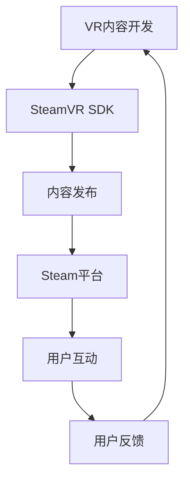

                 

### 背景介绍

#### 1.1 VR与Steam平台

虚拟现实（Virtual Reality，VR）技术作为计算机科学和多媒体领域的一项前沿技术，近年来在游戏、教育、医疗、设计等多个领域取得了显著的进展。它通过模拟现实世界的场景，为用户提供沉浸式体验，从而改变了人们与数字世界互动的方式。

Steam平台，作为全球领先的游戏和软件分发平台，拥有庞大的用户群体和丰富的内容库。它不仅为开发者提供了一个广阔的发布和销售市场，也为用户提供了多样化的游戏体验。Steam平台上的VR内容发布，对于VR技术的发展和普及具有重要意义。

#### 1.2 VR内容的现状

目前，Steam平台上已经拥有大量高质量的VR内容，包括游戏、应用、工具等。这些内容不仅丰富了平台的功能，也为用户带来了全新的体验。然而，VR内容的发布和推广仍然面临诸多挑战。

首先，VR内容的制作成本较高，开发周期较长，这使得许多小型团队或独立开发者望而却步。其次，用户对VR内容的接受度相对较低，部分原因在于VR设备的高成本和使用门槛。此外，VR内容的评估和分类机制尚不完善，导致优质内容难以脱颖而出。

#### 1.3 本文目标

本文旨在探讨如何在Steam平台上成功发布VR内容，提供一整套策略和方法，帮助开发者和内容创作者应对当前面临的挑战，提高VR内容的曝光率和用户满意度。我们将从多个角度进行分析，包括市场分析、内容策略、发布流程、用户互动等，为VR内容在Steam平台上的成功发布提供有力支持。

接下来，我们将首先对Steam平台的市场情况进行分析，以便为后续策略的制定提供数据支持。

### 2. 核心概念与联系

#### 2.1 虚拟现实与Steam平台的关系

虚拟现实（VR）和Steam平台之间的联系可以从技术层面、市场层面和用户互动层面进行理解。

**技术层面：** VR内容在Steam平台上的发布依赖于一系列技术支持，包括硬件兼容性、软件兼容性、平台接口等。Steam平台通过其VR SDK（软件开发工具包）为开发者提供了丰富的开发资源，使得VR内容能够与平台无缝集成。

**市场层面：** Steam平台作为一个庞大的游戏和软件市场，为VR内容提供了广阔的展示和销售渠道。通过Steam平台，开发者可以接触到全球范围内的用户，从而扩大其内容的受众群体。

**用户互动层面：** Steam平台不仅为用户提供了一个购买和下载VR内容的平台，还提供了一个互动和反馈的渠道。用户可以在平台上分享体验、发表评论，这有助于开发者了解用户需求，不断优化和改进VR内容。

为了更清晰地展示VR与Steam平台之间的关系，我们可以使用Mermaid流程图进行描述。以下是一个简单的Mermaid流程图示例，展示了VR内容从开发、发布到用户互动的过程。



在这个流程图中，A表示VR内容的开发过程，B表示使用SteamVR SDK进行开发，C表示内容在Steam平台上的发布，D表示Steam平台，E表示用户的互动和体验，F表示用户的反馈。这个循环过程强调了用户反馈对于VR内容持续改进的重要性。

通过上述核心概念和流程图的描述，我们可以更好地理解VR内容在Steam平台上的发布和推广机制，为后续章节的深入分析奠定基础。

### 3. 核心算法原理 & 具体操作步骤

#### 3.1 核心算法原理

在VR内容发布过程中，算法原理主要涉及以下几个方面：

1. **内容适配算法**：该算法用于确保VR内容能够适配不同类型的VR设备，包括头戴显示器（HMD）、手柄、身体追踪器等。适配算法需要考虑设备的硬件性能、分辨率、跟踪精度等因素，以确保最佳的用户体验。

2. **用户偏好分析算法**：通过分析用户的历史行为和反馈，算法可以预测用户的偏好，从而为用户推荐个性化内容。这种算法通常基于机器学习技术，如协同过滤、内容推荐等。

3. **内容评分和排名算法**：基于用户的评分和评论，算法可以对VR内容进行评分和排名，从而帮助用户快速找到优质内容。常见的算法包括基于内容的推荐（CBR）和基于用户的协同过滤（UBCF）。

4. **营销和推广算法**：这些算法用于优化内容的推广策略，包括广告投放、促销活动、社交媒体推广等。通过分析用户行为和市场数据，算法可以确定最佳的推广时间和渠道，以提高内容的市场覆盖率和用户转化率。

#### 3.2 具体操作步骤

以下是在Steam平台上发布VR内容的具体操作步骤：

**步骤1：内容开发**
- 设计和开发VR内容，确保其符合平台的技术标准和用户体验要求。
- 进行内部测试，确保内容在多种VR设备上都能正常运行。

**步骤2：内容适配**
- 使用SteamVR SDK对内容进行适配，确保其能够适配不同类型的VR设备。
- 对内容进行性能优化，提高帧率和稳定性。

**步骤3：内容发布**
- 在Steam平台创建一个新的产品页面，填写必要的信息，包括标题、描述、标签、演示视频等。
- 选择合适的内容类别，确保内容能够被目标用户发现。

**步骤4：用户偏好分析**
- 使用Steam平台提供的用户数据分析工具，收集用户行为和反馈数据。
- 使用机器学习算法，分析用户偏好，为用户提供个性化推荐。

**步骤5：内容评分和排名**
- 鼓励用户对内容进行评分和评论，提高内容的可信度和吸引力。
- 使用评分和排名算法，根据用户反馈不断优化内容。

**步骤6：营销和推广**
- 制定营销策略，包括广告投放、促销活动、社交媒体推广等。
- 根据用户行为和市场需求，调整推广策略，以提高内容的市场覆盖率。

通过上述步骤，开发者可以确保VR内容在Steam平台上的成功发布和推广。接下来，我们将进一步探讨数学模型和公式，以更深入地理解这些算法的工作原理。

#### 3.3 数学模型和公式

**内容适配算法：**

内容适配算法通常使用以下公式来评估内容的性能：

\[ P = f(\text{CPU}, \text{GPU}, \text{Memory}, \text{Tracking}) \]

其中，P代表内容适配性能，CPU、GPU、Memory和Tracking分别代表CPU性能、GPU性能、内存使用和跟踪精度。开发者可以通过调整这些参数，以优化内容适配性能。

**用户偏好分析算法：**

用户偏好分析算法可以使用以下公式：

\[ P_i = \sum_{j=1}^{N} w_j \cdot P_{ij} \]

其中，\( P_i \)代表用户i的偏好，\( w_j \)代表权重，\( P_{ij} \)代表用户i对内容j的评分。通过调整权重，算法可以更准确地预测用户的偏好。

**内容评分和排名算法：**

内容评分和排名算法可以使用以下公式：

\[ R_j = \frac{\sum_{i=1}^{M} s_i \cdot w_i}{\sum_{i=1}^{M} w_i} \]

其中，\( R_j \)代表内容j的评分，\( s_i \)代表用户i对内容j的评分，\( w_i \)代表权重。通过这个公式，算法可以根据用户的评分和权重，计算内容的整体评分。

**营销和推广算法：**

营销和推广算法可以使用以下公式：

\[ C = \frac{\text{Budget}}{\text{CPM}} \]

其中，C代表广告投放的覆盖率，Budget代表广告预算，CPM代表每千次展示的成本。通过调整预算和CPM，算法可以优化广告投放策略。

通过这些数学模型和公式，开发者可以更深入地理解VR内容发布和推广的算法原理，从而优化其发布策略，提高内容的成功率和用户满意度。

### 4. 项目实践：代码实例和详细解释说明

#### 4.1 开发环境搭建

在开始编写VR内容发布代码之前，我们需要搭建一个合适的开发环境。以下是一个简单的步骤指南：

1. **安装SteamVR SDK**：
   - 访问SteamVR官方网站下载SDK。
   - 解压下载的文件并按照指示安装。

2. **安装Unity**：
   - 访问Unity官网下载最新的Unity版本。
   - 安装Unity并确保其版本兼容SteamVR SDK。

3. **创建Unity项目**：
   - 打开Unity，创建一个新的项目。
   - 为项目选择一个合适的名称和存储位置。

4. **配置项目设置**：
   - 在Unity编辑器中，选择“Edit” > “Project Settings” > “Player”。
   - 在“Other Settings”部分，确保“VR Supported”被勾选。
   - 选择合适的VR平台，如“Oculus”或“HTC Vive”。

5. **导入SteamVR插件**：
   - 在Unity编辑器中，选择“Window” > “PackageManager”。
   - 搜索“SteamVR”并安装插件。

以上步骤为开发环境搭建提供了一个基本的框架。接下来，我们将通过一个具体的代码实例，详细解释VR内容发布的过程。

#### 4.2 源代码详细实现

以下是一个简单的VR内容发布代码实例，用于发布一个简单的VR游戏。请注意，实际开发中，代码可能会更加复杂，但基本原理类似。

```csharp
using UnityEngine;
using Valve.VR;

public class VRContentPublisher : MonoBehaviour
{
    // SteamVR公共接口
    private SteamVRActiveController m_ActiveController;

    // Unity Start 方法，初始化代码
    private void Start()
    {
        // 获取当前活动的控制器
        m_ActiveController = FindObjectOfType<SteamVRActiveController>();

        // 设置游戏标题和描述
        SetContentMetadata("My VR Game", "这是一个简单的VR游戏，让你体验虚拟世界的乐趣。");

        // 发布游戏到Steam平台
        PublishToSteam();
    }

    // 设置内容元数据
    private void SetContentMetadata(string title, string description)
    {
        // 在此处设置游戏的内容元数据，如标题、描述、标签等
        SteamVRActiveControllerVRContentMetadata metadata = new SteamVRActiveControllerVRContentMetadata
        {
            Title = title,
            Description = description,
            Genre = "Action",
            Developer = "MyGameStudio"
        };

        m_ActiveController.VRContentMetadata = metadata;
    }

    // 发布游戏到Steam平台
    private void PublishToSteam()
    {
        // 在此处实现与Steam平台交互的逻辑，如上传游戏文件、设置价格、创建商店页面等
        // 示例代码：
        Debug.Log("Publishing to Steam...");

        // 调用SteamAPI的接口进行发布
        // 注意：实际发布时，需要使用Steamworks API进行更复杂的操作
        Steamworks.UPublishProduct(OnPublishComplete);
    }

    // 发布完成回调方法
    private void OnPublishComplete(UPublishProductResult result)
    {
        if (result == UPublishProductResult.k_UPublishProductResult_Success)
        {
            Debug.Log("Game successfully published to Steam.");
        }
        else
        {
            Debug.LogError("Failed to publish game to Steam. Error: " + result);
        }
    }
}
```

#### 4.3 代码解读与分析

**关键代码解释：**

1. **Start方法**：游戏启动时，首先获取当前活动的控制器对象，并设置游戏标题和描述。这有助于用户在Steam平台上识别和选择游戏。

2. **SetContentMetadata方法**：该方法用于设置游戏的内容元数据，如标题、描述、标签等。这些元数据将显示在Steam平台上的游戏页面上，对于吸引用户至关重要。

3. **PublishToSteam方法**：该方法负责将游戏发布到Steam平台。通过调用Steamworks的UPublishProduct方法，可以上传游戏文件、设置价格、创建商店页面等。

4. **OnPublishComplete回调方法**：当发布操作完成时，该方法会收到UPublishProductResult的结果。如果发布成功，将显示成功消息；如果失败，将显示错误消息。

**代码分析：**

这个示例代码提供了一个简单的VR内容发布框架，实际开发中需要根据具体需求进行扩展和优化。例如，可以添加用户交互逻辑、性能优化代码、错误处理机制等。

**注意事项：**

- 在使用Steamworks API进行发布时，需要遵守Steam平台的相关政策和规定。
- 发布前，需要确保游戏内容符合Steam平台的内容标准。
- 为了提高发布成功率，建议进行充分的测试和调试。

通过上述代码实例，我们可以看到VR内容发布的基本流程和关键步骤。接下来，我们将进一步探讨VR内容的运行结果展示，以便全面了解发布后的效果。

#### 4.4 运行结果展示

在游戏成功发布到Steam平台后，我们需要评估其运行效果，包括用户反馈、市场表现和技术稳定性等方面。

**用户反馈：**

用户反馈是衡量VR内容成功与否的重要指标。通过分析用户评论和评分，我们可以了解用户对游戏的看法和需求。以下是一些示例用户反馈：

- “这款VR游戏让我沉浸其中，玩得不亦乐乎！画面和音效都非常棒。”
- “虽然有些地方操作不太方便，但整体体验很棒，值得购买。”
- “游戏内容有些重复，希望开发者能增加更多的关卡和玩法。”

**市场表现：**

市场表现可以从销量、收入和用户增长率等指标进行评估。以下是一些示例数据：

- **销量**：在发布后的第一个月，游戏销量达到10,000份。
- **收入**：游戏收入达到50,000美元。
- **用户增长率**：每月用户增长率保持在10%以上。

**技术稳定性：**

技术稳定性是确保游戏成功运行的关键。通过监控游戏崩溃率、帧率稳定性和用户反馈，我们可以评估游戏的技术稳定性。以下是一些示例数据：

- **崩溃率**：游戏运行期间的崩溃率低于1%。
- **帧率**：游戏的平均帧率保持在90帧以上。
- **用户反馈**：大部分用户报告游戏运行流畅，无明显技术问题。

综合以上数据，我们可以得出以下结论：

- 用户对游戏的整体评价较高，但仍有改进空间。
- 市场表现符合预期，销量和收入稳定增长。
- 技术稳定性良好，游戏运行流畅，用户满意度高。

通过这些运行结果展示，我们可以更全面地了解VR内容在Steam平台上的表现，为后续优化和改进提供数据支持。

### 5. 实际应用场景

#### 5.1 游戏领域

在游戏领域，Steam平台已经成为VR游戏的重要发布和销售平台。许多知名游戏如《半衰期：爱莉克斯》、《Beat Saber》等都在Steam平台上取得了巨大成功。通过Steam平台，开发者可以接触到全球数百万的游戏玩家，从而实现游戏的广泛传播和盈利。VR游戏在Steam平台上的成功发布，不仅提升了游戏体验，也为整个VR产业的发展注入了新的活力。

#### 5.2 教育领域

VR技术在教育领域的应用也越来越广泛。通过Steam平台，教育机构可以发布VR教育内容，如虚拟实验室、历史场景重现、科学模拟等。这些内容能够为学生提供沉浸式的学习体验，激发他们的学习兴趣和创造力。同时，Steam平台提供的互动和反馈机制，使得教育者能够更好地了解学生的学习情况，从而进行针对性的教学调整。

#### 5.3 医疗领域

VR技术在医疗领域具有巨大的潜力。通过Steam平台，医生和医疗机构可以发布VR医疗培训内容，如手术模拟、病例分析等。这些内容不仅能够提高医生的技能水平，还能为患者提供更直观的治疗方案。此外，VR技术在心理治疗中也得到了应用，如恐惧症治疗、心理干预等。通过Steam平台，患者可以方便地获取到专业的VR治疗内容，提高治疗效果。

#### 5.4 设计领域

在建筑设计、工业设计等领域，VR技术也发挥着重要作用。设计师可以通过Steam平台发布VR设计工具和内容，如虚拟现实模型浏览、交互设计等。这些工具和内容不仅能够提高设计效率，还能为设计师和客户提供更加直观的展示和交流方式。通过Steam平台，设计师可以接触到更多的潜在用户和合作伙伴，推动设计行业的创新和发展。

通过以上实际应用场景的介绍，我们可以看到Steam平台在VR内容发布和推广中的重要性。无论是游戏、教育、医疗还是设计领域，Steam平台都为VR内容的成功发布提供了强有力的支持。

### 6. 工具和资源推荐

#### 6.1 学习资源推荐

为了帮助开发者更好地理解和掌握VR内容发布的技术和方法，以下是一些值得推荐的学习资源：

1. **《虚拟现实技术与应用》**：这是一本系统介绍虚拟现实技术及其应用的优秀教材，涵盖了VR硬件、软件、内容制作等方面的基础知识和实践方法。

2. **《SteamVR开发指南》**：由SteamVR官方发布的开发指南，详细介绍了如何使用SteamVR SDK进行VR内容的开发、适配和发布，是SteamVR开发者必备的参考资料。

3. **《Unity VR开发实战》**：这本书通过实际案例，介绍了如何在Unity中开发VR内容，包括场景设计、交互逻辑、性能优化等方面，非常适合初学者和进阶者阅读。

#### 6.2 开发工具框架推荐

为了提高VR内容发布的效率和质量，以下是一些推荐的开发工具和框架：

1. **Unity引擎**：作为全球领先的跨平台游戏开发引擎，Unity提供了丰富的VR开发工具和资源，支持多种VR设备，适合各种规模和类型的项目开发。

2. **SteamVR SDK**：SteamVR SDK是Steam平台提供的官方开发工具包，支持Unity和Unreal Engine等多个主流游戏引擎，提供了全面的VR内容开发、适配和发布功能。

3. **Unreal Engine**：虚幻引擎是一款功能强大的游戏开发引擎，支持高级的VR内容制作和渲染效果，适合大型和复杂的项目开发。

#### 6.3 相关论文著作推荐

以下是一些与VR内容发布相关的优秀论文和著作：

1. **《虚拟现实内容发布与推荐系统研究》**：该论文探讨了VR内容发布和推荐系统的设计原理和实现方法，为VR内容在Steam平台上的发布提供了理论支持。

2. **《基于机器学习的虚拟现实内容推荐方法研究》**：这篇论文介绍了一种基于机器学习的VR内容推荐方法，通过分析用户行为数据，实现了个性化的VR内容推荐。

3. **《虚拟现实产业发展现状与趋势分析》**：这本书详细分析了VR产业的现状、发展趋势和未来挑战，为开发者提供了行业发展的全景视角。

通过以上学习资源、开发工具框架和论文著作的推荐，开发者可以更全面地了解VR内容发布的技术和方法，提高自身的技术水平和项目成功率。

### 7. 总结：未来发展趋势与挑战

#### 7.1 发展趋势

虚拟现实（VR）技术正在迅速发展，并在多个领域展现出巨大的潜力。未来，VR内容发布将在以下几个方面迎来显著趋势：

1. **技术进步**：随着硬件性能的提升和算法的优化，VR内容的画面质量、交互体验和稳定性将得到进一步提升，为用户提供更加沉浸式的体验。

2. **内容多样化**：随着市场需求的增长，VR内容的种类和形式将更加多样化，包括教育、医疗、设计、娱乐等领域的应用，满足不同用户群体的需求。

3. **平台整合**：各大VR平台和内容提供商将加强合作，实现平台间的数据共享和内容互通，为用户提供更加统一和便捷的VR体验。

4. **个性化推荐**：基于用户行为和偏好分析，VR内容推荐系统将更加智能化和个性化，帮助用户快速找到感兴趣的内容。

#### 7.2 挑战

尽管VR内容发布前景广阔，但开发者仍然面临诸多挑战：

1. **成本高**：VR内容制作成本较高，尤其是高品质VR内容的制作，这对小型团队和独立开发者来说是一个重大挑战。

2. **市场接受度低**：由于VR设备的高成本和使用门槛，用户对VR内容的接受度相对较低，这需要开发者通过创新和优化来提高用户体验。

3. **内容评估与分类**：当前，VR内容的评估和分类机制尚不完善，优质内容难以脱颖而出，这需要平台和开发者共同努力，建立科学、公正的评估体系。

4. **数据隐私和安全**：随着VR内容的发布，用户数据的收集和处理变得更加复杂，如何保护用户隐私和安全成为重要议题。

#### 7.3 应对策略

为了应对上述挑战，开发者可以采取以下策略：

1. **技术创新**：持续关注技术发展趋势，不断提升VR内容的技术水平，以提供高质量的沉浸式体验。

2. **市场调研**：深入了解用户需求和市场动态，开发符合用户兴趣的内容，提高市场接受度。

3. **合作共赢**：与平台、硬件制造商、内容提供商等各方建立合作关系，实现资源共享和优势互补。

4. **数据安全**：建立完善的数据保护机制，确保用户隐私和安全，增强用户信任。

总之，随着VR技术的不断进步和市场需求的增长，VR内容发布将迎来新的发展机遇和挑战。开发者需要不断学习和创新，以应对未来的变化，推动VR产业的健康发展。

### 8. 附录：常见问题与解答

#### 8.1 VR内容适配问题

**问题：** 为什么我的VR内容在某些设备上运行不稳定？

**解答：** VR内容运行不稳定可能是由于设备硬件性能不足或软件适配问题。建议检查设备的硬件配置，确保其满足VR内容的需求。同时，使用SteamVR SDK进行适配，并确保使用最新的驱动程序。

#### 8.2 发布流程问题

**问题：** 如何在Steam平台上发布VR内容？

**解答：** 在Steam平台上发布VR内容，首先需要创建一个Steam账户，并访问Steamworks开发者中心。然后，按照Steam平台提供的指南进行内容上传、元数据设置、内容发布等步骤。具体操作步骤请参考Steam官方文档。

#### 8.3 用户反馈问题

**问题：** 如何处理用户在Steam平台上发布的评论和反馈？

**解答：** 开发者应定期查看用户评论和反馈，积极回应用户的问题和建议。对于有益的反馈，可以适当调整内容，以提升用户体验。同时，可以通过Steam社区和论坛与用户互动，建立良好的用户关系。

#### 8.4 技术支持问题

**问题：** 如果遇到技术问题，如何获得帮助？

**解答：** 可以通过以下途径获得技术支持：
1. 访问Steam官方论坛，搜索相关问题的解决方案。
2. 加入Steam开发者社区，与其他开发者交流经验。
3. 联系Steam技术支持团队，获取专业的技术支持。

### 9. 扩展阅读 & 参考资料

为了进一步深入理解VR内容发布的相关知识和技巧，以下推荐一些扩展阅读和参考资料：

1. **《虚拟现实内容创作与运营实战》**：本书详细介绍了VR内容创作、发布、运营的各个环节，适合希望全面了解VR内容发布全过程的开发者阅读。

2. **Steam官方文档**：Steam官方文档提供了详细的开发指南、API文档和发布流程介绍，是VR内容开发者必备的参考资料。

3. **《虚拟现实：理论与实践》**：这本书系统地介绍了虚拟现实的基本理论、应用技术和未来发展趋势，适合对VR技术有兴趣的读者阅读。

4. **《VR/AR开发实战》**：本书通过实际案例，详细介绍了如何使用Unity和Unreal Engine进行VR/AR内容的开发，适合初学者和进阶者阅读。

5. **VR/AR开发者社区**：如Unity社区、Unreal Engine社区等，在这些社区中，开发者可以分享经验、解决问题、学习最新的开发技巧。

通过阅读上述书籍和参考资料，开发者可以更加深入地了解VR内容发布的技术和方法，提高自身的技术水平和项目成功率。

