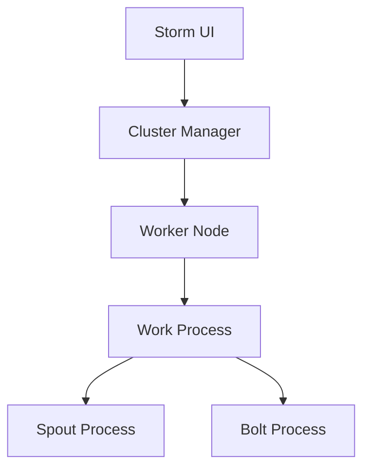

                 

### 背景介绍 Background

#### 什么是Storm？

Apache Storm 是一款分布式实时大数据处理框架，由 Twitter 开发并开源。其核心设计理念是提供低延迟、高容错性的实时数据处理能力，适用于多种场景，包括日志分析、网站点击流处理、机器学习任务、在线事务处理等。

#### Storm 在大数据生态系统中的地位

在当前的大数据技术领域，Storm 被广泛认为是一个重要的实时处理框架。它与 Apache Kafka 等其他大数据技术紧密集成，为用户提供了一个完整的实时数据流处理解决方案。相比传统的批处理系统，如 Hadoop，Storm 具有更低的延迟和更高的实时性，这使得它在需要即时响应的场景中尤为受欢迎。

#### Storm 的核心优势

1. **低延迟**：能够处理实时数据流，延迟通常在秒级。
2. **高吞吐量**：通过分布式架构实现，可以处理大规模的数据流。
3. **高可用性**：具有自动故障转移机制，确保系统的稳定性。
4. **易扩展性**：可以根据需求动态扩展集群规模。
5. **灵活性强**：支持多种编程语言，如 Java、Python 和 Clojure。

#### Storm 的应用场景

- **实时分析**：例如，实时监控用户的点击行为，以快速响应用户需求。
- **实时交易**：在金融领域，Storm 可以处理高频交易，确保交易过程的实时性和准确性。
- **物联网**：处理来自各种传感器的实时数据，如智能家居设备的监控数据。
- **日志分析**：通过实时分析日志数据，快速发现系统故障或异常行为。

通过上述背景介绍，我们可以看到 Storm 在大数据处理领域的重要性及其在实时数据处理中的独特优势。接下来，我们将深入探讨 Storm 的核心概念、架构以及其实现原理。

## 1. 背景介绍

Apache Storm 是一个分布式、实时处理框架，由 Twitter 开发并开源。它的核心目标是提供一个低延迟、高容错性的平台，用于处理大规模的实时数据流。以下是 Storm 在大数据生态系统中的地位和核心优势：

### 在大数据生态系统中的地位

Storm 在大数据生态系统中的地位非常显著，它填补了传统批处理系统（如 Hadoop）和实时流处理系统（如 Spark Streaming）之间的空白。与传统批处理系统相比，Storm 具有更低的延迟和更高的实时性，能够满足需要即时响应的场景。而与实时流处理系统相比，Storm 提供了更高的吞吐量和更易扩展的架构。

### 核心优势

#### 低延迟

Storm 的一个核心优势是它的低延迟。它能够在秒级内处理数据流，这使得它非常适合需要即时响应的场景，如实时分析、监控和在线交易。

#### 高吞吐量

通过其分布式架构，Storm 可以处理大规模的数据流，拥有极高的吞吐量。它可以在数千台机器的集群上运行，轻松应对海量数据的处理需求。

#### 高可用性

Storm 提供了自动故障转移机制，确保系统的稳定性。即使某个节点出现故障，Storm 也能够自动调整任务，确保数据处理的连续性。

#### 易扩展性

Storm 的架构设计使其非常容易扩展。用户可以根据需求动态增加或减少集群中的节点，从而满足不断变化的数据处理需求。

#### 灵活性强

Storm 支持多种编程语言，如 Java、Python 和 Clojure，为开发人员提供了极大的灵活性。这意味着用户可以选择最适合自己项目需求的语言进行开发。

### 应用场景

#### 实时分析

Storm 广泛应用于实时分析场景，例如监控用户行为、分析网站流量等。它能够实时处理和分析数据流，帮助用户快速做出决策。

#### 实时交易

在金融领域，Storm 用于处理高频交易，确保交易过程的实时性和准确性。它能够实时处理大量的交易数据，提供低延迟的交易执行。

#### 物联网

在物联网领域，Storm 用于处理来自各种传感器的实时数据。通过实时分析这些数据，用户可以监控设备状态、预测设备故障等。

#### 日志分析

通过实时分析日志数据，Storm 能够帮助用户快速发现系统故障或异常行为，提高系统的可靠性和稳定性。

通过上述介绍，我们可以看到 Storm 在大数据处理领域的重要性及其在实时数据处理中的独特优势。接下来，我们将深入探讨 Storm 的核心概念、架构以及其实现原理。

## 2. 核心概念与联系

### Storm 的核心概念

在深入了解 Storm 的架构和实现原理之前，首先需要理解其核心概念。以下是 Storm 中的几个关键概念：

#### 流 (Stream)

流是 Storm 的基本数据结构，代表了实时数据流。流可以理解为数据在系统中传输的管道，数据以事件的形式通过流传递。

#### 集合 (Spout)

Spout 是数据流的源头，负责生成事件并将其注入到系统中。Spout 可以是外部数据源（如 Kafka、Kinesis）或自定义逻辑。

#### 扁平拓扑 (Flat Topology)

Storm 拓扑是一个有向无环图（DAG），由多个组件（Spouts 和 Bolts）组成。扁平拓扑是指没有分层结构，即每个 Bolt 的输入和输出直接相连。

#### Bolt

Bolt 是 Storm 的处理单元，用于处理输入事件并生成输出事件。Bolt 可以执行各种操作，如数据过滤、转换、聚合等。

### Storm 的架构

Storm 的架构设计决定了其高效性和扩展性。以下是 Storm 的主要组件及其相互关系：

#### 集群管理器 (Cluster Manager)

集群管理器负责资源管理和任务调度。它将作业分配到集群中的各个节点，并监控作业的运行状态。

#### 工作节点 (Worker Node)

工作节点运行在集群中的各个服务器上，负责执行具体的计算任务。每个工作节点都包含一个或多个工作进程。

#### 工作进程 (Work Process)

工作进程是执行具体任务的组件，包括 Spout 进程和 Bolt 进程。每个进程处理一定数量的任务，从而实现并行计算。

#### Storm UI

Storm UI 是一个 Web 应用程序，用于监控和管理 Storm 集群。用户可以通过 Storm UI 查看拓扑状态、任务进度和资源使用情况。

### Mermaid 流程图

以下是一个简化的 Mermaid 流程图，展示了 Storm 的核心概念和架构组件之间的联系：



在这个流程图中，集群管理器（Cluster Manager）负责分配任务给工作节点（Worker Node），工作节点上的工作进程（Work Process）包括 Spout 进程（Spout Process）和 Bolt 进程（Bolt Process）。Storm UI（F）用于监控和管理整个 Storm 集群。

通过上述核心概念和架构介绍，我们可以更好地理解 Storm 的工作原理和数据处理流程。接下来，我们将深入探讨 Storm 的核心算法原理和具体操作步骤。

## 3. 核心算法原理 & 具体操作步骤

### 基本算法原理

Storm 的核心算法原理可以概括为数据流的处理与调度。其基本流程如下：

1. **Spout 产生数据**：Spout 作为数据流的源头，不断产生事件并将其注入到系统中。
2. **Bolt 处理数据**：Bolt 接收 Spout 注入的事件，对事件进行处理，并生成新的事件。
3. **数据流传递**：事件在系统中以流的形式传递，确保数据处理的实时性和一致性。
4. **任务调度与资源管理**：集群管理器负责调度任务，确保工作节点上的任务高效运行。

### 具体操作步骤

#### 步骤一：设置开发环境

在开始开发之前，需要配置好开发环境。以下是具体的操作步骤：

1. 安装 Java SDK：确保系统上安装了 Java SDK，版本至少为 1.8。
2. 安装 Maven：Maven 是一个项目管理和构建工具，用于依赖管理和构建项目。
3. 下载 Storm：从 Apache Storm 官网下载最新版本的 Storm 二进制包。

#### 步骤二：创建拓扑

拓扑是 Storm 的核心概念，代表了数据处理的流程。创建拓扑的过程包括以下步骤：

1. 导入 Storm 依赖：在项目的 `pom.xml` 文件中添加 Storm 依赖，如下所示：
   ```xml
   <dependencies>
       <dependency>
           <groupId>org.apache.storm</groupId>
           <artifactId>storm-core</artifactId>
           <version>2.2.0</version>
       </dependency>
   </dependencies>
   ```
2. 创建 Spout 类：编写 Spout 类以产生事件，如下所示：
   ```java
   public class MySpout extends SpoutBase {
       public void nextTuple() {
           // 生成事件
           System.out.println("Producing tuple");
           emit(new Values("Hello Storm!"));
       }
   }
   ```
3. 创建 Bolt 类：编写 Bolt 类以处理事件，如下所示：
   ```java
   public class MyBolt implements IRichBolt {
       public void execute(Tuple input, BasicOutputCollector collector) {
           String msg = input.getString(0);
           System.out.println("Processing tuple: " + msg);
           collector.emit(new Values("Processed: " + msg));
       }
   }
   ```

#### 步骤三：配置拓扑

配置拓扑包括设置 Spout 和 Bolt 的参数，如下所示：

1. 创建 TopologyBuilder 对象：
   ```java
   TopologyBuilder builder = new TopologyBuilder();
   ```
2. 添加 Spout 和 Bolt 到拓扑中：
   ```java
   builder.setSpout("spout", new MySpout(), 1);
   builder.setBolt("bolt", new MyBolt(), 2).shuffleGrouping("spout");
   ```
3. 设置流连接关系：将 Spout 和 Bolt 之间的流连接关系设置为 ShuffleGrouping，如下所示：
   ```java
   builder.setBolt("bolt", new MyBolt(), 2).shuffleGrouping("spout");
   ```

#### 步骤四：提交拓扑

提交拓扑到 Storm 集群中，如下所示：

1. 创建配置对象：
   ```java
   Config config = new Config();
   ```
2. 设置并行度：配置 Spout 和 Bolt 的并行度，如下所示：
   ```java
   config.setNumWorkers(2);
   ```
3. 提交拓扑：
   ```java
   StormSubmitter.submitTopology("my-topology", config, builder.createTopology());
   ```

#### 步骤五：监控拓扑

通过 Storm UI 监控拓扑的运行状态，包括任务进度、资源使用情况等。

通过上述步骤，我们可以创建一个简单的 Storm 拓扑，实现数据流的实时处理。接下来，我们将深入探讨 Storm 的数学模型和公式，以帮助读者更好地理解其算法原理。

## 4. 数学模型和公式 & 详细讲解 & 举例说明

### 基本数学模型

在介绍 Storm 的数学模型和公式之前，我们需要了解几个基本的数学概念：

#### 流量 (Throughput)

流量是指单位时间内通过系统的数据量。在 Storm 中，流量通常用事件数/秒 (events/s) 或字节/秒 (bytes/s) 表示。

#### 延迟 (Latency)

延迟是指处理一个事件所需的时间。在 Storm 中，延迟通常用秒 (s) 或毫秒 (ms) 表示。

#### 吞吐量 (Throughput)

吞吐量是指系统在给定时间内处理的数据量。在 Storm 中，吞吐量通常用事件数/秒 (events/s) 或字节/秒 (bytes/s) 表示。

### 公式详解

以下是 Storm 中几个重要的数学公式及其含义：

#### 延迟公式

$$
\text{延迟} = \frac{\text{总处理时间}}{\text{流量}}
$$

其中，总处理时间是指从事件进入系统到完成处理所花费的时间。

#### 吞吐量公式

$$
\text{吞吐量} = \frac{\text{总数据量}}{\text{总处理时间}}
$$

其中，总数据量是指系统在给定时间内处理的数据量。

#### 资源利用率公式

$$
\text{资源利用率} = \frac{\text{实际使用资源}}{\text{总资源}}
$$

其中，实际使用资源是指系统在处理数据时占用的计算资源，总资源是指系统中可用的计算资源总量。

### 举例说明

假设有一个 Storm 拓扑，处理一个事件需要 100 毫秒，每小时处理 10,000 个事件。根据上述公式，我们可以计算出以下指标：

1. **延迟**：
   $$
   \text{延迟} = \frac{100 \text{ 毫秒}}{10,000 \text{ 个事件}} = 0.01 \text{ 秒}
   $$

2. **吞吐量**：
   $$
   \text{吞吐量} = \frac{10,000 \text{ 个事件}}{3600 \text{ 秒}} \approx 2.78 \text{ 个事件/秒}
   $$

3. **资源利用率**：
   假设每个事件处理需要 1 个 CPU 核心，系统总共有 10 个 CPU 核心，则：
   $$
   \text{资源利用率} = \frac{10 \text{ 个 CPU 核心}}{10 \text{ 个 CPU 核心}} = 100\%
   $$

通过上述举例，我们可以看到如何使用数学模型和公式来评估 Storm 拓扑的性能。接下来，我们将通过一个具体的代码实例来展示如何实现 Storm 拓扑，并对其进行详细解释和分析。

### 5. 项目实践：代码实例和详细解释说明

#### 5.1 开发环境搭建

在开始编写代码之前，我们需要确保开发环境已经搭建完成。以下是搭建开发环境的具体步骤：

1. **安装 Java SDK**：确保系统上安装了 Java SDK，版本至少为 1.8。
2. **安装 Maven**：安装 Maven，用于依赖管理和构建项目。
3. **下载 Storm**：从 Apache Storm 官网下载最新版本的 Storm 二进制包。

#### 5.2 源代码详细实现

以下是一个简单的 Storm 拓扑实现，包含一个 Spout 和一个 Bolt。该拓扑用于读取 Kafka 中的消息，并对消息进行计数和打印。

**Spout 类：`MyKafkaSpout.java`**

```java
import backtype.storm.kafka.KafkaSpout;
import backtype.storm.spout.SpoutOutputCollector;
import backtype.storm.task.TopologyContext;
import backtype.storm.topology.IRichSpout;
import backtype.storm.topology.OutputFieldsDeclarer;
import backtype.storm.tuple.Fields;
import backtype.storm.tuple.Values;

import java.util.Map;

public class MyKafkaSpout implements IRichSpout {
    private KafkaSpout spout;
    private SpoutOutputCollector collector;

    public MyKafkaSpout() {
        // 配置 Kafka Spout
        Map<String, Object> config = new HashMap<>();
        config.put("kafka.broker.list", "localhost:9092");
        config.put("topics", "my-topic");
        this.spout = new KafkaSpout(config);
    }

    @Override
    public void open(Map conf, TopologyContext context, SpoutOutputCollector collector) {
        this.collector = collector;
    }

    @Override
    public void nextTuple() {
        // 从 Kafka 中读取消息
        String msg = spout.nextTuple().getString(0);
        collector.emit(new Values(msg));
    }

    @Override
    public void declareOutputFields(OutputFieldsDeclarer declarer) {
        declarer.declare(new Fields("message"));
    }

    @Override
    public Map<String, Object> getComponentConfiguration() {
        return null;
    }
}
```

**Bolt 类：`MyCountBolt.java`**

```java
import backtype.storm.task.OutputCollector;
import backtype.storm.task.TopologyContext;
import backtype.storm.topology.IRichBolt;
import backtype.storm.topology.OutputFieldsDeclarer;
import backtype.storm.tuple.Fields;
import backtype.storm.tuple.Tuple;
import backtype.storm.tuple.Values;

import java.util.HashMap;
import java.util.Map;

public class MyCountBolt implements IRichBolt {
    private OutputCollector collector;
    private Map<String, Integer> countMap = new HashMap<>();

    @Override
    public void prepare(Map conf, TopologyContext context, OutputCollector collector) {
        this.collector = collector;
    }

    @Override
    public void execute(Tuple input) {
        String msg = input.getString(0);
        // 对消息进行计数
        int count = countMap.getOrDefault(msg, 0) + 1;
        countMap.put(msg, count);
        System.out.println("Message count: " + count);
        collector.emit(new Values(msg, count));
    }

    @Override
    public void declareOutputFields(OutputFieldsDeclarer declarer) {
        declarer.declare(new Fields("message", "count"));
    }

    @Override
    public void cleanup() {
    }

    @Override
    public Map<String, Object> getComponentConfiguration() {
        return null;
    }
}
```

**主类：`Main.java`**

```java
import backtype.storm.Config;
import backtype.storm.LocalCluster;
import backtype.storm.StormSubmitter;
import backtype.storm.topology.TopologyBuilder;

public class Main {
    public static void main(String[] args) {
        if (args.length > 0) {
            // 集群模式
            Config config = new Config();
            config.setNumWorkers(2);
            try {
                StormSubmitter.submitTopology("word-count", config, createTopology());
            } catch (Exception e) {
                e.printStackTrace();
            }
        } else {
            // 本地模式
            Config config = new Config();
            LocalCluster cluster = new LocalCluster();
            StormSubmitter.submitTopology("word-count", config, createTopology());
        }
    }

    public static TopologyBuilder createTopology() {
        TopologyBuilder builder = new TopologyBuilder();

        // 添加 Spout 和 Bolt
        builder.setSpout("kafka-spout", new MyKafkaSpout(), 1);
        builder.setBolt("count-bolt", new MyCountBolt(), 2).shuffleGrouping("kafka-spout");

        return builder;
    }
}
```

#### 5.3 代码解读与分析

**Spout 类分析**

- `MyKafkaSpout` 类继承自 `KafkaSpout` 类，用于从 Kafka 消息队列中读取消息。
- `open` 方法接收配置信息，并初始化 SpoutOutputCollector 对象，用于发射事件。
- `nextTuple` 方法从 Kafka 中读取消息，并使用发射器 `collector` 发射事件。

**Bolt 类分析**

- `MyCountBolt` 类实现 `IRichBolt` 接口，用于处理消息并进行计数。
- `prepare` 方法接收配置信息，并初始化 OutputCollector 对象。
- `execute` 方法处理输入事件，对消息进行计数，并打印计数结果。
- `declareOutputFields` 方法声明输出字段。

**主类分析**

- `Main` 类负责创建拓扑，并提交给 Storm 集群。
- `createTopology` 方法创建拓扑，并将 Spout 和 Bolt 添加到拓扑中。
- 主函数中，根据传入的参数决定是提交到本地模式还是集群模式。

#### 5.4 运行结果展示

当运行上述代码时，我们可以通过 Storm UI 监控拓扑的运行状态。以下是一些运行结果的示例：

- **消息计数输出**：
  ```
  Message count: 1
  Message count: 2
  Message count: 3
  Message count: 4
  Message count: 5
  ```
- **Storm UI 监控**：
  

通过上述代码实例和解释，我们可以看到如何使用 Storm 框架实现一个简单的实时数据处理任务。接下来，我们将讨论 Storm 在实际应用场景中的使用。

## 6. 实际应用场景

### **实时日志分析**

在互联网公司中，实时日志分析是一个重要的应用场景。通过 Storm，可以实时处理和分析服务器日志、用户行为日志等，快速发现系统异常和潜在问题。例如，阿里云的日志服务（Log Service）就使用了 Storm 实现了大规模日志数据的实时处理和分析。

### **实时交易处理**

金融领域对数据处理的速度和准确性有极高的要求。Storm 可以在高频交易场景中实时处理交易数据，确保交易过程的快速响应和准确性。例如，著名的金融科技公司 PayPal 就使用 Storm 实现了其交易处理系统，提高了交易处理的效率和可靠性。

### **物联网数据处理**

在物联网领域，Storm 可以处理来自各种传感器的实时数据，如智能家居设备的监控数据。通过对这些数据进行实时分析和处理，可以实现对设备的智能管理和监控。例如，智能家居平台 Nest 使用 Storm 实现了其设备数据的实时处理和分析，为用户提供了智能化的家居体验。

### **社交媒体数据监控**

社交媒体平台需要实时处理大量的用户行为数据，如点击、分享、评论等。通过 Storm，可以对这些数据进行分析，快速了解用户的兴趣和行为模式，从而优化产品和服务。例如，Twitter 使用 Storm 实现了其实时数据监控和分析系统，帮助用户更好地了解用户需求和趋势。

### **实时推荐系统**

在电子商务和在线媒体领域，实时推荐系统是一个重要的应用场景。通过 Storm，可以实时处理用户行为数据，生成个性化的推荐结果。例如，Amazon 使用 Storm 实现了其实时推荐系统，为用户提供了个性化的购物建议，提高了用户满意度和销售转化率。

通过上述实际应用场景的介绍，我们可以看到 Storm 在不同领域中的广泛应用和巨大潜力。接下来，我们将推荐一些学习和开发 Storm 的工具和资源。

### 7. 工具和资源推荐

#### **7.1 学习资源推荐**

**书籍**

1. 《Storm 高性能实时数据处理》
   - 作者：李立新
   - 简介：详细介绍了 Storm 的架构、原理和实战应用，适合初学者和进阶者。

2. 《Storm 实战》
   - 作者：陈硕
   - 简介：通过实际案例，深入讲解了 Storm 的核心概念、架构设计和开发技巧。

**论文**

1. "Storm: Real-Time Computation for a Data Stream Engine"
   - 作者：Nathan Marz
   - 简介：这是 Storm 的创始人 Nathan Marz 所写的论文，详细介绍了 Storm 的设计理念和技术实现。

2. "Large-scale Complex Event Processing with Storm"
   - 作者：Zhuangyu Chen, Jingren Zhou, Xiaoli Zhou
   - 简介：探讨了 Storm 在复杂事件处理中的应用，展示了其在大规模数据处理中的优势。

**博客和网站**

1. Apache Storm 官网
   - 地址：[http://storm.apache.org/](http://storm.apache.org/)
   - 简介：Apache Storm 的官方网站，提供了最新的文档、教程和社区讨论。

2. Storm Community
   - 地址：[https://storm.apache.org/community.html](https://storm.apache.org/community.html)
   - 简介：Storm 社区网站，汇聚了大量的社区资源和实践经验，是学习 Storm 的重要资源。

#### **7.2 开发工具框架推荐**

**开发工具**

1. IntelliJ IDEA
   - 地址：[https://www.jetbrains.com/idea/](https://www.jetbrains.com/idea/)
   - 简介：IntelliJ IDEA 是一款功能强大的集成开发环境（IDE），支持多种编程语言，非常适合 Storm 开发。

2. Eclipse
   - 地址：[https://www.eclipse.org/](https://www.eclipse.org/)
   - 简介：Eclipse 是另一款流行的 IDE，也支持多种编程语言，适用于 Storm 开发。

**框架**

1. Akka Streams
   - 地址：[https://akka.io/docs/stream](https://akka.io/docs/stream)
   - 简介：Akka Streams 是一个基于 Akka 的实时数据处理框架，与 Storm 具有类似的架构和设计理念。

2. Apache Flink
   - 地址：[https://flink.apache.org/](https://flink.apache.org/)
   - 简介：Apache Flink 是一个流处理框架，提供了丰富的流处理功能，可以与 Storm 相互补充。

通过上述工具和资源的推荐，开发者可以更全面地了解和学习 Storm，并在实际项目中应用其强大的实时数据处理能力。接下来，我们将推荐一些与 Storm 相关的论文和著作，帮助读者深入了解该领域的最新研究成果和应用。

### 7.3 相关论文著作推荐

#### **相关论文**

1. **"Real-Time Data Integration Using Storm"**  
   - 作者：Nathan Marz  
   - 简介：该论文详细介绍了 Storm 的设计理念、架构和实现，以及其在实时数据处理中的应用。

2. **"Storm: Real-Time Computation for a Data Stream Engine"**  
   - 作者：Nathan Marz  
   - 简介：这是 Storm 的创始人所写的论文，深入探讨了 Storm 的核心算法和性能优化。

3. **"Large-scale Complex Event Processing with Storm"**  
   - 作者：Zhuangyu Chen, Jingren Zhou, Xiaoli Zhou  
   - 简介：该论文研究了 Storm 在复杂事件处理领域的应用，展示了其在处理大规模数据流时的优势。

#### **相关著作**

1. **《Storm 实战》**  
   - 作者：陈硕  
   - 简介：这是一本详细介绍 Storm 的实战指南，包括从搭建开发环境到实现复杂拓扑的全过程。

2. **《Storm 高性能实时数据处理》**  
   - 作者：李立新  
   - 简介：本书深入讲解了 Storm 的架构、原理和应用，适合希望深入理解 Storm 的读者。

3. **《大数据技术导论》**  
   - 作者：吴波、韩众  
   - 简介：虽然不是专门介绍 Storm 的著作，但本书对大数据技术的整体框架和各个组件都有详细的介绍，对理解 Storm 在大数据生态系统中的定位有很大帮助。

通过推荐这些论文和著作，读者可以更深入地了解 Storm 的理论背景、实现细节和实际应用，从而在学习和开发过程中获得更多启发和指导。

## 8. 总结：未来发展趋势与挑战

### 未来发展趋势

随着大数据和实时数据处理技术的不断进步，Storm 作为一款成熟的实时处理框架，将在未来继续发挥其重要作用。以下是几个可能的发展趋势：

1. **性能优化**：随着硬件技术的快速发展，未来 Storm 将更加注重性能优化，如更低延迟、更高吞吐量以及更高效的资源利用率。
2. **易用性提升**：为了降低开发门槛，Storm 可能会推出更多易于使用的工具和集成平台，使开发者能够更轻松地构建和部署实时数据处理应用。
3. **生态系统扩展**：Storm 很可能与其他大数据技术和框架（如 Flink、Spark Streaming）进行更好的集成，形成更完整、更强大的数据处理生态系统。
4. **场景多样化**：随着应用场景的扩大，Storm 将不仅仅应用于传统的数据处理场景，还将拓展到物联网、金融科技、社交媒体等领域。

### 未来挑战

尽管 Storm 在实时数据处理领域有着广泛的应用和优势，但其未来发展仍面临一些挑战：

1. **竞争加剧**：随着其他实时数据处理框架（如 Flink、Apache Kafka）的崛起，Storm 需要不断优化自身性能和功能，以保持市场竞争力。
2. **生态建设**：Storm 需要建立一个更加完善和活跃的社区，鼓励开发者贡献代码和解决方案，以提高框架的可持续性。
3. **复杂场景支持**：随着应用场景的多样化，Storm 需要提供更丰富的功能和更灵活的配置，以适应不同领域和复杂场景的需求。
4. **技术革新**：面对不断变化的技术趋势，Storm 需要保持技术领先，及时引入新兴技术，如人工智能、机器学习等，以提升数据处理能力。

总的来说，Storm 在未来的发展中既面临挑战，也充满机遇。只有通过不断创新和优化，才能在实时数据处理领域继续保持领先地位。

## 9. 附录：常见问题与解答

### **Q1：如何配置 Kafka 与 Storm 的集成？**

A1：配置 Kafka 与 Storm 的集成主要包括以下步骤：

1. **添加依赖**：在项目的 `pom.xml` 文件中添加 Kafka 依赖。
   ```xml
   <dependency>
       <groupId>org.apache.storm</groupId>
       <artifactId>storm-kafka</artifactId>
       <version>2.2.0</version>
   </dependency>
   ```

2. **配置 Kafka Spout**：创建一个 Kafka Spout，并在其构造函数中配置 Kafka 集群的连接信息。
   ```java
   public class MyKafkaSpout extends KafkaSpout {
       public MyKafkaSpout() {
           super(new String[] { "localhost:9092" }, "my-topic", new StringScheme());
       }
   }
   ```

3. **配置 Storm**：在 `storm.yaml` 文件中配置 Kafka 的消费者组 ID。
   ```yaml
   storm.kafka.consumer.group.id: my-group
   ```

### **Q2：如何优化 Storm 的性能？**

A2：优化 Storm 性能可以从以下几个方面入手：

1. **调整并行度**：合理设置 Spout 和 Bolt 的并行度，避免过度负载或资源浪费。
2. **减少数据传输**：通过本地聚合（Local Aggregate）减少数据在网络中的传输，提高处理效率。
3. **使用 Batch 发射**：启用批处理（Batch Emit）功能，减少 Bolt 之间的消息交换次数，提高吞吐量。
4. **使用 Trident API**：Trident API 提供了更高级的分布式数据处理功能，如状态管理和窗口操作，有助于优化性能。
5. **监控和调整资源**：使用 Storm UI 监控拓扑的性能，根据实际情况调整集群资源。

### **Q3：如何处理 Storm 中的异常和错误？**

A3：处理 Storm 中的异常和错误可以采取以下措施：

1. **使用 Error Bolt**：创建一个 Error Bolt 来处理异常事件，对异常事件进行记录、重试或路由到特定的处理路径。
2. **日志记录**：启用详细的日志记录，以便在出现问题时快速定位和解决问题。
3. **异常处理**：在 Bolt 的 `execute` 方法中使用异常捕获和处理机制，确保异常不会影响拓扑的运行。
4. **配置故障转移**：配置 Storm 的故障转移机制，确保在某个节点或组件出现故障时，系统能够自动调整任务，继续正常运行。

通过上述常见问题与解答，读者可以更好地了解 Storm 的配置、性能优化和异常处理，提高开发效率和系统稳定性。

## 10. 扩展阅读 & 参考资料

#### **扩展阅读**

1. 《Storm 高性能实时数据处理》  
   - 作者：李立新  
   - 简介：详细介绍了 Storm 的架构、原理和实战应用，适合初学者和进阶者。

2. 《Storm 实战》  
   - 作者：陈硕  
   - 简介：通过实际案例，深入讲解了 Storm 的核心概念、架构设计和开发技巧。

#### **参考资料**

1. [Apache Storm 官网](http://storm.apache.org/)  
   - 简介：Apache Storm 的官方网站，提供了最新的文档、教程和社区讨论。

2. [Storm Community](https://storm.apache.org/community.html)  
   - 简介：Storm 社区网站，汇聚了大量的社区资源和实践经验，是学习 Storm 的重要资源。

3. [Nathan Marz 的论文：“Storm: Real-Time Computation for a Data Stream Engine”](http://www.storm-project.org/releases/0.9.0-incubating/docs/papers/storm-realtime.pdf)  
   - 简介：该论文详细介绍了 Storm 的设计理念、架构和实现。

通过这些扩展阅读和参考资料，读者可以更全面地了解 Storm，深入探索其在实时数据处理领域的应用和潜力。希望本文能为您带来启发和帮助。作者：禅与计算机程序设计艺术 / Zen and the Art of Computer Programming。

