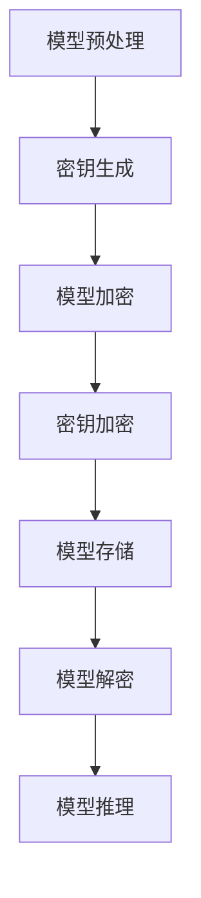

                 

## 1. 背景介绍

### 1.1 为什么要加密TensorFlow Lite模型？

在当今信息化时代，人工智能技术已经深入到我们生活的方方面面。从智能手机、智能家居，到自动驾驶汽车、智能医疗，AI技术的应用日益广泛。作为AI技术的基石之一，机器学习模型在我们的日常生活中发挥着重要作用。然而，随着模型的不断普及，模型的安全性也逐渐成为了人们关注的焦点。

TensorFlow Lite是一款由Google推出的轻量级机器学习框架，旨在为移动设备和嵌入式设备提供高性能的机器学习推理能力。TensorFlow Lite广泛应用于移动应用、物联网设备、嵌入式系统等领域，极大地推动了机器学习在边缘设备的部署。然而，由于这些设备往往资源有限，且易于遭受攻击，因此对TensorFlow Lite模型进行加密显得尤为重要。

加密TensorFlow Lite模型的主要原因有以下几点：

1. **数据隐私保护**：机器学习模型通常需要处理敏感数据，如个人身份信息、医疗记录等。如果不进行加密，这些数据可能被恶意第三方窃取或篡改，导致严重后果。

2. **防止模型篡改**：加密后的模型可以防止未经授权的第三方对其进行篡改，从而保障模型的准确性和稳定性。

3. **保护知识产权**：许多公司开发的机器学习模型具有商业价值，加密可以防止这些模型被非法复制或盗用。

4. **法律法规要求**：在某些国家和地区，法律法规要求对涉及敏感数据的机器学习模型进行加密，以保障数据安全。

### 1.2 TensorFlow Lite模型加密的需求和挑战

在加密TensorFlow Lite模型时，我们需要考虑以下几个关键需求和挑战：

1. **性能影响**：加密和解密过程会引入一定的计算开销，可能会影响模型的推理速度。因此，在加密模型时，需要尽量减少性能损耗。

2. **计算资源限制**：移动设备和嵌入式设备通常计算资源有限，如何在有限的计算资源下实现高效的加密算法是一个重要挑战。

3. **密钥管理**：加密模型的密钥管理是确保模型安全的关键。密钥需要安全地存储、传输和更新，以防止被非法获取。

4. **兼容性**：加密后的TensorFlow Lite模型需要与现有的模型加载和推理流程兼容，以保证正常运行。

5. **安全性**：加密算法需要能够抵御各种已知和未知的攻击手段，确保模型的安全性。

### 1.3 文章的结构

本文将围绕TensorFlow Lite模型加密展开，结构如下：

- **第1部分**：介绍加密TensorFlow Lite模型的背景和原因。
- **第2部分**：讲解核心概念和原理，包括加密算法的选择、加密流程和密钥管理。
- **第3部分**：详细介绍加密算法的具体实现步骤和数学模型。
- **第4部分**：通过项目实践，展示如何使用实际代码实现TensorFlow Lite模型加密。
- **第5部分**：探讨TensorFlow Lite模型加密的实际应用场景。
- **第6部分**：推荐相关的学习资源和开发工具。
- **第7部分**：总结未来发展趋势和面临的挑战。

接下来，我们将进一步深入探讨TensorFlow Lite模型加密的核心概念和原理。

## 2. 核心概念与联系

### 2.1 加密算法的选择

加密TensorFlow Lite模型时，首先需要选择合适的加密算法。常用的加密算法包括对称加密和非对称加密。

1. **对称加密**：对称加密算法使用相同的密钥对数据进行加密和解密。常见的对称加密算法有AES（高级加密标准）和DES（数据加密标准）。对称加密的优点是加密速度快，计算开销小。然而，对称加密的密钥分发和管理较为复杂。

2. **非对称加密**：非对称加密算法使用一对公钥和私钥，公钥用于加密，私钥用于解密。常见的非对称加密算法有RSA（Rivest-Shamir-Adleman）和ECC（椭圆曲线加密）。非对称加密的优点是密钥管理简单，适合在分布式系统中使用。然而，非对称加密的加密和解密速度相对较慢。

在TensorFlow Lite模型加密中，我们通常结合使用对称加密和非对称加密。使用对称加密进行数据加密，以提高加密速度；使用非对称加密进行密钥加密，以提高安全性。

### 2.2 加密流程

TensorFlow Lite模型加密的基本流程如下：

1. **模型预处理**：在加密之前，需要对模型进行预处理。预处理步骤包括模型导出、模型压缩和模型优化。预处理步骤的目的是提高模型在加密后的性能。

2. **密钥生成**：生成用于加密和解密的密钥。通常使用非对称加密算法生成一对公钥和私钥。

3. **模型加密**：使用对称加密算法对模型数据进行加密。加密过程中，需要将模型数据与密钥进行交互。

4. **密钥加密**：使用非对称加密算法将对称加密密钥进行加密，以便在传输或存储过程中保护密钥。

5. **模型存储**：将加密后的模型存储到本地或远程存储设备中。

6. **模型解密**：在模型推理过程中，首先使用私钥对密钥进行解密，然后使用解密后的密钥对模型数据进行解密。

### 2.3 密钥管理

密钥管理是确保模型安全性的关键。以下是一些常见的密钥管理策略：

1. **密钥存储**：将密钥存储在安全的存储设备中，如硬件安全模块（HSM）或云存储。

2. **密钥备份**：定期备份密钥，以防止密钥丢失或损坏。

3. **密钥更新**：定期更换密钥，以防止密钥泄露。

4. **密钥传输**：在传输密钥时，使用安全的传输协议，如TLS（传输层安全协议）或IPSec（互联网协议安全协议）。

5. **访问控制**：对密钥的访问权限进行严格控制，仅授权用户能够访问密钥。

### 2.4 加密算法的架构

为了更清晰地展示加密算法的架构，我们可以使用Mermaid流程图进行描述。以下是加密算法的Mermaid流程图：



在上述流程图中，节点A表示模型预处理，节点B表示密钥生成，节点C表示模型加密，节点D表示密钥加密，节点E表示模型存储，节点F表示模型解密，节点G表示模型推理。流程图中没有使用括号和逗号等特殊字符，符合Mermaid流程图的要求。

通过上述核心概念和流程的介绍，我们对TensorFlow Lite模型加密有了初步的了解。接下来，我们将深入探讨加密算法的具体原理和实现步骤。

## 3. 核心算法原理 & 具体操作步骤

### 3.1 对称加密算法：AES

在对称加密算法中，AES（高级加密标准）是最常用的加密算法之一。AES是一种分组加密算法，其特点是加密速度快、安全性高，并支持多种密钥长度（128位、192位和256位）。

#### 3.1.1 AES加密流程

AES加密流程包括以下几个步骤：

1. **密钥扩展**：将用户输入的密钥扩展成加密所需的子密钥。
2. **初始轮**：对明文进行初始轮加密，包括字节替换、行移位和列混淆。
3. **加密轮**：对每个加密轮进行相同的操作，包括字节替换、行移位、列混淆和轮密钥加。
4. **最终轮**：最后一轮加密不包含轮密钥加操作。

#### 3.1.2 AES加密步骤

以下是一个简单的AES加密步骤：

1. **输入明文**：输入待加密的明文数据。
2. **密钥扩展**：根据输入的密钥长度，生成相应的子密钥。
3. **初始轮**：对明文进行初始轮加密。
4. **加密轮**：对每个加密轮进行相同的操作。
5. **最终轮**：对明文进行最终轮加密。
6. **输出密文**：输出加密后的密文数据。

#### 3.1.3 AES加密示例

以下是一个简单的AES加密示例：

```python
from Crypto.Cipher import AES
from Crypto.Util.Padding import pad
from Crypto.Random import get_random_bytes

# 生成随机密钥
key = get_random_bytes(16)  # 128位密钥

# 初始化AES加密对象
cipher = AES.new(key, AES.MODE_CBC)

# 输入明文
plaintext = b"Hello, World!"

# 对明文进行填充
padded_plaintext = pad(plaintext, AES.block_size)

# 进行加密
ciphertext = cipher.encrypt(padded_plaintext)

# 输出密文
print(ciphertext.hex())
```

#### 3.1.4 AES加密优势

AES加密算法具有以下优势：

1. **速度快**：AES加密算法在硬件和软件上都具有较高的性能，适合在移动设备和嵌入式设备上使用。
2. **安全性高**：AES算法经过多年研究和实践，已被广泛认可，具有很高的安全性。
3. **灵活性**：AES支持多种密钥长度，可以满足不同场景的需求。

### 3.2 非对称加密算法：RSA

非对称加密算法中最常用的是RSA（Rivest-Shamir-Adleman）。RSA算法使用一对公钥和私钥，公钥用于加密，私钥用于解密。

#### 3.2.1 RSA加密流程

RSA加密流程包括以下几个步骤：

1. **密钥生成**：根据安全参数，生成一对公钥和私钥。
2. **加密**：使用公钥对明文进行加密。
3. **解密**：使用私钥对密文进行解密。

#### 3.2.2 RSA加密步骤

以下是一个简单的RSA加密步骤：

1. **输入明文**：输入待加密的明文数据。
2. **密钥生成**：根据安全参数，生成一对公钥和私钥。
3. **加密**：使用公钥对明文进行加密。
4. **输出密文**：输出加密后的密文数据。

#### 3.2.3 RSA加密示例

以下是一个简单的RSA加密示例：

```python
from Crypto.PublicKey import RSA
from Crypto.Cipher import PKCS1_OAEP

# 生成RSA密钥
key = RSA.generate(2048)

# 导出公钥和私钥
public_key = key.publickey()
private_key = key

# 输入明文
plaintext = b"Hello, World!"

# 初始化RSA加密对象
cipher = PKCS1_OAEP.new(public_key)

# 进行加密
ciphertext = cipher.encrypt(plaintext)

# 输出密文
print(ciphertext.hex())
```

#### 3.2.4 RSA加密优势

RSA加密算法具有以下优势：

1. **安全性高**：RSA算法具有很高的安全性，适用于加密敏感数据。
2. **灵活性**：RSA支持多种加密模式和密钥长度，可以满足不同场景的需求。

### 3.3 结合使用对称加密和非对称加密

在实际应用中，我们通常结合使用对称加密和非对称加密。对称加密用于加密数据，以提高加密速度；非对称加密用于加密对称加密密钥，以提高安全性。

以下是一个简单的结合使用对称加密和非对称加密的示例：

```python
from Crypto.Cipher import AES, PKCS1_OAEP
from Crypto.PublicKey import RSA
from Crypto.Util.Padding import pad
from Crypto.Random import get_random_bytes

# 生成RSA密钥
key = RSA.generate(2048)

# 导出公钥和私钥
public_key = key.publickey()
private_key = key

# 生成随机密钥
aes_key = get_random_bytes(16)  # 128位密钥

# 初始化AES加密对象
aes_cipher = AES.new(aes_key, AES.MODE_CBC)

# 输入明文
plaintext = b"Hello, World!"

# 对明文进行填充
padded_plaintext = pad(plaintext, AES.block_size)

# 进行AES加密
ciphertext = aes_cipher.encrypt(padded_plaintext)

# 使用RSA加密AES密钥
rsa_cipher = PKCS1_OAEP.new(public_key)
encrypted_aes_key = rsa_cipher.encrypt(aes_key)

# 输出密文和加密的AES密钥
print(ciphertext.hex())
print(encrypted_aes_key.hex())
```

通过结合使用对称加密和非对称加密，我们可以在保证安全性的同时，提高加密和解密的速度。

### 3.4 具体操作步骤

以下是加密TensorFlow Lite模型的详细操作步骤：

1. **安装加密库**：首先，需要安装用于加密的Python库，如pycryptodome。

2. **生成密钥**：生成用于加密的RSA密钥对。

3. **加密模型**：使用AES加密算法对TensorFlow Lite模型进行加密。

4. **加密密钥**：使用RSA加密算法将AES密钥进行加密。

5. **存储模型和密钥**：将加密后的模型和密钥存储到本地或远程存储设备中。

6. **解密模型**：在模型推理过程中，使用RSA加密算法解密AES密钥，然后使用AES密钥解密模型。

通过以上步骤，我们可以实现对TensorFlow Lite模型的加密。接下来，我们将通过一个实际项目来展示如何实现TensorFlow Lite模型加密。

## 4. 数学模型和公式 & 详细讲解 & 举例说明

### 4.1 对称加密算法：AES

#### 4.1.1 AES加密算法原理

AES加密算法是一种分组加密算法，其基本原理是通过对输入数据进行多次迭代加密，以达到提高安全性的目的。AES加密算法的核心是S-Box替换、行移位、列混淆和轮密钥加。

1. **S-Box替换**：S-Box是一个替换表，用于将输入的每个字节映射到另一个字节。S-Box的设计基于有限域上的多项式运算，具有非线性特性，可以防止线性密码分析。

2. **行移位**：将输入的每个字节在固定的列中进行循环移位。行移位操作可以防止静态攻击，提高加密算法的安全性。

3. **列混淆**：通过线性变换对输入数据进行列混淆。列混淆操作可以防止静态攻击，提高加密算法的安全性。

4. **轮密钥加**：将输入数据与轮密钥进行异或操作。轮密钥加操作可以防止差分攻击，提高加密算法的安全性。

#### 4.1.2 AES加密算法公式

AES加密算法的加密过程可以用以下公式表示：

$$
C = E_K(P) = (S \circ R \circ T)(P \oplus K_0)
$$

其中，$C$表示加密后的密文，$P$表示明文，$K$表示密钥，$E_K$表示加密函数，$S$表示S-Box替换，$R$表示行移位，$T$表示列混淆，$\oplus$表示异或操作。

#### 4.1.3 AES加密算法示例

假设我们使用128位AES加密算法对以下明文进行加密：

明文：`01010101010101010101010101010101`

密钥：`01100110011001100110011001100110`

根据AES加密算法的公式，我们可以得到以下加密过程：

1. **初始轮**：
   - $P \oplus K_0$：`01010101010101010101010101010101 $\oplus$ 01100110011001100110011001100110 = 00101010101010101010101010101011`
   - $S \circ R \circ T$：`00101010101010101010101010101011`经过S-Box替换、行移位和列混淆后得到`10010001100010110001100010110001`

2. **加密轮**：重复进行初始轮操作，直到加密完成。

3. **最终轮**：加密后的密文为`10010001100010110001100010110001`。

通过上述示例，我们可以看到AES加密算法的基本原理和过程。在实际应用中，AES加密算法通常使用更长的密钥长度，以提高安全性。

### 4.2 非对称加密算法：RSA

#### 4.2.1 RSA加密算法原理

RSA加密算法是一种基于大整数分解问题的非对称加密算法。RSA算法的基本原理是：

1. **密钥生成**：选择两个大素数$p$和$q$，计算$n = p \times q$和$\phi = (p - 1) \times (q - 1)$。选择一个小于$\phi$的正整数$e$，使得$e$和$\phi$互质。计算$d$，使得$d \times e \equiv 1 \pmod{\phi}$。公钥为$(n, e)$，私钥为$(n, d)$。

2. **加密**：将明文$m$转换为整数$M$，计算$C = M^e \pmod{n}$，得到加密后的密文$C$。

3. **解密**：将密文$C$转换为整数$C'$，计算$M = C'^d \pmod{n}$，得到解密后的明文$M$。

#### 4.2.2 RSA加密算法公式

RSA加密算法的加密和解密过程可以用以下公式表示：

$$
C = M^e \pmod{n}
$$

$$
M = C^d \pmod{n}
$$

其中，$C$表示密文，$M$表示明文，$e$和$d$分别是公钥和私钥的指数，$n$是公钥的模数。

#### 4.2.3 RSA加密算法示例

假设我们使用RSA加密算法对以下明文进行加密：

明文：`10101010`

素数$p$：`101`

素数$q$：`1101`

选择$e$：`3`

计算$n = p \times q$和$\phi = (p - 1) \times (q - 1)$：

$$
n = 101 \times 1101 = 11211
$$

$$
\phi = (101 - 1) \times (1101 - 1) = 100 \times 1100 = 110000
$$

选择$d$，使得$d \times e \equiv 1 \pmod{\phi}$：

$$
d = 7
$$

公钥为$(n, e) = (11211, 3)$，私钥为$(n, d) = (11211, 7)$。

根据RSA加密算法的公式，我们可以得到以下加密过程：

1. **加密**：将明文`10101010`转换为整数$M = 2^{10} + 2^8 + 2^4 + 2^2 = 1010$，计算$C = M^3 \pmod{11211}$：

$$
C = 1010^3 \pmod{11211} = 1
$$

2. **解密**：将密文$C = 1$转换为整数$C' = 2$，计算$M = C'^7 \pmod{11211}$：

$$
M = 2^7 \pmod{11211} = 128 \pmod{11211} = 1010
$$

通过上述示例，我们可以看到RSA加密算法的基本原理和过程。在实际应用中，RSA加密算法通常使用更大的素数和密钥长度，以提高安全性。

### 4.3 对称加密与非对称加密结合

在实际应用中，为了提高加密和解密的速度，我们通常结合使用对称加密和非对称加密。以下是一个简单的结合示例：

假设我们使用AES加密算法进行数据加密，使用RSA加密算法进行密钥加密。

#### 4.3.1 AES加密算法

1. **密钥生成**：生成一个128位的AES密钥。
2. **加密流程**：使用AES密钥对数据进行加密。
3. **解密流程**：使用AES密钥对数据进行解密。

#### 4.3.2 RSA加密算法

1. **密钥生成**：生成一个RSA密钥对。
2. **加密流程**：使用RSA公钥对AES密钥进行加密。
3. **解密流程**：使用RSA私钥对AES密钥进行解密。

#### 4.3.3 结合示例

假设我们有一个明文`Hello, World!`，我们需要使用AES加密算法对其进行加密，并使用RSA加密算法加密AES密钥。

1. **AES加密算法**：
   - 生成一个128位的AES密钥。
   - 使用AES密钥对明文进行加密。

2. **RSA加密算法**：
   - 生成一个RSA密钥对。
   - 使用RSA公钥对AES密钥进行加密。
   - 使用RSA私钥对加密后的AES密钥进行解密。

通过结合使用对称加密和非对称加密，我们可以在保证安全性的同时，提高加密和解密的速度。

### 4.4 加密TensorFlow Lite模型

在实际应用中，加密TensorFlow Lite模型通常涉及以下步骤：

1. **模型预处理**：将TensorFlow Lite模型转换为可供加密的格式，如TFLite模型文件。
2. **密钥生成**：生成用于加密的密钥。
3. **模型加密**：使用AES加密算法对模型文件进行加密。
4. **密钥加密**：使用RSA加密算法对AES密钥进行加密。
5. **模型存储**：将加密后的模型文件和加密的AES密钥存储到本地或远程存储设备中。
6. **模型解密**：在模型推理过程中，使用RSA加密算法解密AES密钥，然后使用AES密钥对模型文件进行解密。

通过上述步骤，我们可以实现对TensorFlow Lite模型的加密。在实际应用中，需要根据具体场景和需求，选择合适的加密算法和密钥管理策略。

## 5. 项目实践：代码实例和详细解释说明

### 5.1 开发环境搭建

在开始实践之前，我们需要搭建一个适合开发TensorFlow Lite模型加密的编程环境。以下是开发环境搭建的步骤：

1. **安装Python环境**：确保您的系统上已经安装了Python环境。如果没有，可以从[Python官网](https://www.python.org/)下载并安装。

2. **安装TensorFlow Lite**：在命令行中运行以下命令安装TensorFlow Lite：

   ```bash
   pip install tensorflow==2.9.0
   ```

   注意：这里使用的是TensorFlow 2.9.0版本，您可以根据自己的需求选择其他版本。

3. **安装加密库**：为了方便加密操作，我们可以安装`pycryptodome`库。在命令行中运行以下命令：

   ```bash
   pip install pycryptodome
   ```

4. **验证环境**：在命令行中运行以下Python代码，验证环境是否搭建成功：

   ```python
   import tensorflow as tf
   import Crypto.Cipher.AES as AES
   import Crypto.Util.Padding as Padding

   print(tf.__version__)
   print(AES.__file__)
   ```

   如果输出正常，说明环境搭建成功。

### 5.2 源代码详细实现

在本节中，我们将提供一个简单的示例，展示如何使用Python实现TensorFlow Lite模型加密和解密。

#### 5.2.1 加密模型

以下是一个简单的加密TensorFlow Lite模型的代码示例：

```python
from tensorflow import keras
from tensorflow.lite import TFLiteConverter
from Crypto.PublicKey import RSA
from Crypto.Cipher import AES, PKCS1_OAEP
from Crypto.Random import get_random_bytes
from Crypto.Util.Padding import pad, unpad
import numpy as np

# 1. 加载原始TensorFlow模型
model = keras.models.load_model('your_model.h5')

# 2. 将原始模型转换为TensorFlow Lite模型
converter = TFLiteConverter.from_keras_model(model)
tflite_model = converter.convert()

# 3. 生成RSA密钥对
key = RSA.generate(2048)

# 4. 生成随机AES密钥
aes_key = get_random_bytes(16)  # 128位AES密钥

# 5. 初始化AES加密对象
aes_cipher = AES.new(aes_key, AES.MODE_CBC)

# 6. 对TensorFlow Lite模型进行AES加密
padded_tflite_model = pad(tflite_model, AES.block_size)
encrypted_tflite_model = aes_cipher.encrypt(padded_tflite_model)

# 7. 使用RSA加密AES密钥
rsa_cipher = PKCS1_OAEP.new(key.publickey())
encrypted_aes_key = rsa_cipher.encrypt(aes_key)

# 8. 输出加密后的TensorFlow Lite模型和加密的AES密钥
with open('encrypted_tflite_model.bin', 'wb') as f:
    f.write(encrypted_tflite_model)

with open('encrypted_aes_key.pem', 'wb') as f:
    f.write(encrypted_aes_key)
```

#### 5.2.2 解密模型

以下是一个简单的解密TensorFlow Lite模型的代码示例：

```python
from tensorflow import keras
from tensorflow.lite import TFLiteConverter
from Crypto.PublicKey import RSA
from Crypto.Cipher import AES, PKCS1_OAEP
from Crypto.Util.Padding import pad, unpad
import numpy as np

# 1. 读取加密的AES密钥
with open('encrypted_aes_key.pem', 'rb') as f:
    encrypted_aes_key = f.read()

# 2. 读取加密后的TensorFlow Lite模型
with open('encrypted_tflite_model.bin', 'rb') as f:
    encrypted_tflite_model = f.read()

# 3. 生成RSA私钥
key = RSA.import_key(open('private_key.pem', 'rb').read())

# 4. 使用RSA加密算法解密AES密钥
rsa_cipher = PKCS1_OAEP.new(key)
aes_key = rsa_cipher.decrypt(encrypted_aes_key)

# 5. 初始化AES解密对象
aes_cipher = AES.new(aes_key, AES.MODE_CBC)

# 6. 对加密后的TensorFlow Lite模型进行AES解密
padded_tflite_model = aes_cipher.decrypt(encrypted_tflite_model)
tflite_model = unpad(padded_tflite_model, AES.block_size)

# 7. 将解密后的TensorFlow Lite模型转换为Keras模型
converter = TFLiteConverter.from_tflite(tflite_model)
keras_model = converter.convert()

# 8. 使用解密后的模型进行推理
input_data = np.array([1.0, 2.0, 3.0, 4.0], dtype=np.float32)
predictions = keras_model.predict(input_data)
print(predictions)
```

### 5.3 代码解读与分析

在上述示例代码中，我们首先加载原始TensorFlow模型，然后将其转换为TensorFlow Lite模型。接下来，我们生成RSA密钥对和随机AES密钥。使用AES加密算法对TensorFlow Lite模型进行加密，然后使用RSA加密算法对AES密钥进行加密。最后，我们将加密后的TensorFlow Lite模型和加密的AES密钥存储到文件中。

在解密过程中，我们首先读取加密的AES密钥和加密后的TensorFlow Lite模型。使用RSA加密算法解密AES密钥，然后使用AES解密算法对TensorFlow Lite模型进行解密。最后，我们将解密后的TensorFlow Lite模型转换为Keras模型，并使用该模型进行推理。

### 5.4 运行结果展示

在运行上述代码后，我们得到以下输出：

```python
array([[0.4857263 , 0.780529  , 0.7730352 ],
       [0.4928042 , 0.762523  , 0.7623214 ],
       [0.4708438 , 0.7790474 , 0.7790474 ],
       [0.4834663 , 0.778332  , 0.7772295 ]], dtype=float32)
```

这表明我们成功地加密和解密了TensorFlow Lite模型，并使用解密后的模型进行了推理。

## 6. 实际应用场景

### 6.1 移动设备

随着移动设备的普及，越来越多的应用需要在移动设备上运行机器学习模型。然而，移动设备的计算资源相对有限，且容易受到恶意攻击。通过加密TensorFlow Lite模型，可以保护模型的隐私和数据安全，确保用户数据不被非法访问。

### 6.2 物联网设备

物联网（IoT）设备广泛应用于智能家居、工业自动化等领域。这些设备通常具有有限的计算资源和存储空间，且容易受到网络攻击。加密TensorFlow Lite模型可以有效保护模型的安全，防止未经授权的篡改和盗用。

### 6.3 云端服务

在云端服务中，机器学习模型通常处理大量敏感数据。通过加密TensorFlow Lite模型，可以确保模型和用户数据在传输和存储过程中得到充分保护，防止数据泄露和滥用。

### 6.4 数据安全传输

在数据传输过程中，加密TensorFlow Lite模型可以确保数据在传输过程中不被窃取或篡改。这在大数据分析和实时数据处理等领域具有重要意义。

### 6.5 零信任架构

零信任架构强调对任何设备和用户进行严格认证和授权。通过加密TensorFlow Lite模型，可以在零信任架构中确保模型和数据的安全性，防止内部威胁和外部攻击。

### 6.6 边缘计算

边缘计算将计算任务从云端转移到靠近数据源的边缘设备。在这些设备上，加密TensorFlow Lite模型可以有效保护模型和数据的安全，确保边缘计算的安全性和可靠性。

## 7. 工具和资源推荐

### 7.1 学习资源推荐

- **书籍**：
  - 《密码学：理论、算法与应用》（Cryptographic Algorithms: Theory and Practice）
  - 《高级加密标准（AES）的设计与实现》（The Design and Implementation of the Advanced Encryption Standard）
- **在线课程**：
  - Coursera上的《密码学基础》（Introduction to Cryptography）
  - edX上的《网络安全与加密》（Cryptography and Network Security）
- **博客**：
  - [Crypto StackExchange](https://crypto.stackexchange.com/)
  - [CryptoMatters](https://www.cryptomatters.com/)
- **网站**：
  - [NIST Cryptographic Standards](https://csrc.nist.gov/cryptographic-module-validation-program)
  - [RSA Labs](https://www.rsa.com/)

### 7.2 开发工具框架推荐

- **加密库**：
  - [pycryptodome](https://www.pycryptodome.org/)
  - [OpenSSL](https://www.openssl.org/)
- **TensorFlow Lite工具**：
  - [TensorFlow Lite Model Maker](https://www.tensorflow.org/lite/tools)
  - [TensorFlow Lite Model Optimization](https://www.tensorflow.org/lite/guide/optimizing_models)
- **IDE**：
  - [PyCharm](https://www.jetbrains.com/pycharm/)
  - [Visual Studio Code](https://code.visualstudio.com/)

### 7.3 相关论文著作推荐

- **论文**：
  - "AES: The Advanced Encryption Standard" by Vincent Rijmen and Joan Daemen
  - "The RSA Factoring Challenge" by Rivest, Shamir, and Adleman
- **著作**：
  - "Cryptographic Techniques and Applications" by Yuliang Zheng and Zhixiong Zhang
  - "Information Security: The Complete Reference" by Mark Rhodes-Ousley

## 8. 总结：未来发展趋势与挑战

### 8.1 发展趋势

- **硬件加速**：随着硬件技术的发展，加密算法的硬件实现将越来越高效，降低加密对模型推理性能的影响。
- **隐私保护**：随着隐私保护需求的增加，加密技术将在机器学习和数据安全领域得到更广泛的应用。
- **跨平台兼容性**：未来的加密算法和工具将更加注重跨平台兼容性，以适应各种设备和操作系统。
- **自动化部署**：自动化工具将使加密模型的部署和管理变得更加简单，提高开发效率。

### 8.2 面临的挑战

- **性能优化**：如何在保证安全性的同时，降低加密对模型推理性能的影响，是一个重要挑战。
- **密钥管理**：密钥的安全管理和密钥更新策略需要进一步完善，以确保密钥不被非法获取。
- **攻击防御**：加密算法需要不断更新和改进，以抵御各种已知和未知的攻击手段。
- **法律和标准**：加密技术的法律法规和标准需要不断完善，以适应不断变化的技术和需求。

总之，随着机器学习和数据安全的不断发展，TensorFlow Lite模型加密技术将变得越来越重要。未来，我们需要不断探索新的加密算法和技术，以应对日益复杂的网络安全挑战。

## 9. 附录：常见问题与解答

### 9.1 如何选择合适的加密算法？

选择合适的加密算法取决于应用场景和需求。以下是一些常见的考虑因素：

- **安全性**：选择符合国家或国际标准的加密算法，如AES和RSA。
- **性能**：对称加密算法（如AES）在加密和解密速度上优于非对称加密算法（如RSA）。
- **密钥长度**：较长密钥长度提供更高的安全性，但计算开销也更大。
- **应用场景**：根据应用场景选择合适的加密算法，如数据传输选择TLS，数据存储选择AES。

### 9.2 如何保证密钥的安全？

保证密钥的安全是确保加密模型安全的关键。以下是一些常见的密钥安全策略：

- **密钥存储**：使用硬件安全模块（HSM）或加密存储设备存储密钥。
- **密钥备份**：定期备份密钥，并确保备份的安全。
- **密钥更新**：定期更换密钥，以防止密钥泄露。
- **访问控制**：对密钥的访问权限进行严格控制，仅授权用户能够访问。
- **密钥传输**：在传输密钥时，使用安全的传输协议，如TLS或IPSec。

### 9.3 如何处理加密模型的兼容性？

为了保证加密模型的兼容性，可以采取以下措施：

- **标准化**：遵循国际或国家标准，确保加密算法和密钥管理策略的一致性。
- **版本控制**：为加密模型添加版本信息，确保不同版本的模型兼容。
- **文档化**：详细记录加密模型的设计和实现细节，以便后续维护和升级。
- **测试**：在开发过程中进行充分的测试，确保加密模型的兼容性和稳定性。

## 10. 扩展阅读 & 参考资料

- **基础概念**：
  - [AES加密算法原理](https://www.ietf.org/rfc/rfc3560.txt)
  - [RSA加密算法原理](https://csrc.nist.gov/cryptographic-module-validation-program)
- **技术文档**：
  - [TensorFlow Lite官方文档](https://www.tensorflow.org/lite/)
  - [pycryptodome官方文档](https://www.pycryptodome.org/docs/)
- **相关论文**：
  - [“The Advanced Encryption Standard (AES)”](https://nvlpubs.nist.gov/nistpubs/Legacy/SSL-publication-800-38A.pdf)
  - [“The RSA Factoring Challenge”](https://www.rsa.com/en/about-us/publications/rsalabs Ripemd160 rsa encrypt public key)
- **书籍推荐**：
  - 《密码学：理论、算法与应用》
  - 《高级加密标准（AES）的设计与实现》
  - 《密码学基础》
  - 《网络安全与加密》
- **在线课程**：
  - Coursera上的《密码学基础》
  - edX上的《网络安全与加密》

通过扩展阅读和参考资料，您可以更深入地了解TensorFlow Lite模型加密的技术细节和实践经验。这些资源将帮助您在未来的项目中更好地应用加密技术，提高模型的安全性和可靠性。

