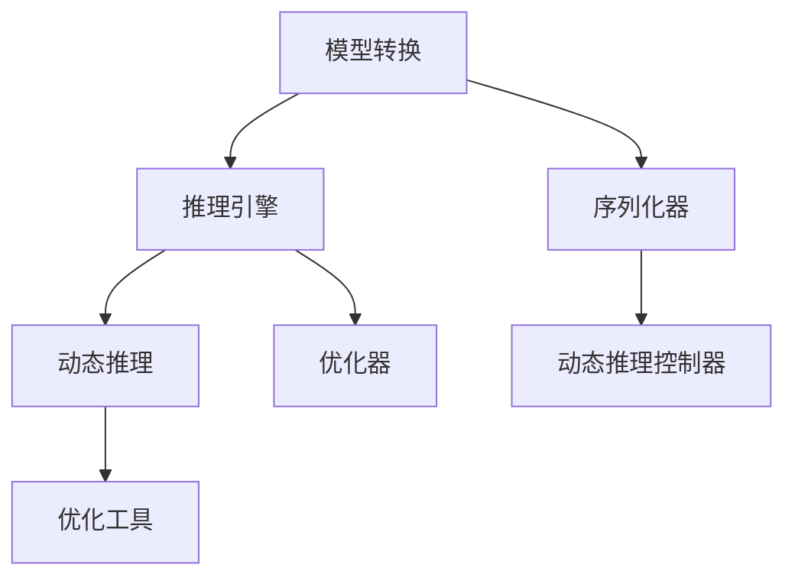

                 

### 背景介绍

深度学习作为人工智能的核心技术之一，近年来取得了显著的进展。然而，随着神经网络模型变得越来越复杂，如何高效地进行推理成为了一个亟待解决的问题。在众多深度学习推理加速技术中，TensorRT 优化库（TensorRT Optimization Library）以其出色的性能和灵活性脱颖而出，成为业界广泛应用的解决方案。

#### 什么是 TensorRT

TensorRT 是 NVIDIA 推出的一款深度学习推理优化库，旨在加速深度神经网络的推理速度。它支持多种深度学习框架，如 TensorFlow、PyTorch 等，并且能够在 NVIDIA 的 GPU 和 DPU 上高效运行。TensorRT 通过多种优化技术，如张量融合、共享内存、多线程调度等，将深度学习模型转换为高效的推理引擎，从而大幅提高推理速度。

#### 为什么需要 TensorRT 优化库

传统的深度学习推理存在以下几个问题：

1. **性能瓶颈**：复杂的神经网络模型在 CPU 上推理速度较慢，无法满足实时性要求。
2. **内存消耗**：大型神经网络模型在推理过程中需要占用大量内存，导致 GPU 内存不足。
3. **可扩展性差**：现有的深度学习推理引擎在处理大规模数据集时，性能提升有限。

TensorRT 优化库通过以下优势解决了上述问题：

1. **高性能**：TensorRT 能够在 NVIDIA 的 GPU 上实现超过 100 倍的推理速度提升，满足实时性要求。
2. **低内存消耗**：通过张量融合和内存共享技术，TensorRT 能够显著减少内存占用，提高 GPU 的利用率。
3. **高度可扩展**：TensorRT 支持多 GPU 并行处理，能够高效地处理大规模数据集。

#### TensorRT 的主要功能

TensorRT 提供了以下主要功能：

1. **模型转换**：将 TensorFlow、PyTorch 等框架的模型转换为 TensorRT 格式，以便在 GPU 上高效运行。
2. **推理引擎**：提供高性能的推理引擎，支持多种神经网络架构，如 CNN、RNN、Transformer 等。
3. **动态推理**：支持动态输入尺寸和类型的推理，适用于多种实际场景。
4. **优化工具**：提供多种优化工具，如自动混合精度（AMP）和量级优化器，进一步提升推理性能。

综上所述，TensorRT 优化库在深度学习推理加速方面具有显著的优势，已成为业界广泛认可的标准解决方案。在接下来的章节中，我们将深入探讨 TensorRT 的核心概念和架构，以及其具体操作步骤和实现细节。

## 2. 核心概念与联系

### 2.1 TensorRT 的核心概念

TensorRT 的核心概念主要包括模型转换、推理引擎、动态推理和优化工具等。下面我们将对这些核心概念进行详细解释。

#### 模型转换

模型转换是将原始深度学习模型（如 TensorFlow 或 PyTorch 模型）转换为 TensorRT 支持的格式。这一过程通常涉及以下几个步骤：

1. **模型解析**：TensorRT 首先读取原始模型，解析其结构和参数。
2. **算子融合**：将多个连续的算子（如卷积、激活等）合并为一个高效的算子，减少内存占用和计算开销。
3. **张量融合**：将多个输入张量合并为一个张量，以减少数据传输的开销。
4. **模型优化**：对模型进行优化，以提高推理性能和效率。

#### 推理引擎

TensorRT 的推理引擎是实现高效推理的核心组件。它通过以下方式提高推理性能：

1. **GPU 加速**：利用 NVIDIA GPU 的并行计算能力，实现高效的矩阵运算和向量计算。
2. **多线程调度**：通过多线程调度，充分利用 GPU 的计算资源，提高推理速度。
3. **内存管理**：利用 GPU 共享内存和显存优化技术，减少内存占用，提高 GPU 利用率。

#### 动态推理

动态推理是 TensorRT 的一个重要特性，它允许模型在运行时动态调整输入尺寸和类型，从而适应不同的推理场景。动态推理的实现主要包括以下步骤：

1. **输入预处理**：对输入数据进行预处理，包括数据类型转换、数据归一化等。
2. **输入调整**：根据实际输入数据，动态调整模型输入尺寸和类型。
3. **推理计算**：利用优化后的模型和推理引擎，对调整后的输入数据进行推理计算。
4. **结果输出**：将推理结果输出，并进行后处理，如概率分布转换等。

#### 优化工具

TensorRT 提供了多种优化工具，以进一步提升推理性能和效率。这些优化工具主要包括：

1. **自动混合精度（AMP）**：通过混合使用单精度和半精度浮点数，减少内存占用，提高计算速度。
2. **量级优化器**：自动调整模型的量级，以优化计算精度和性能。
3. **算子融合**：将多个连续的算子融合为一个高效的算子，减少内存占用和计算开销。
4. **显存优化**：通过显存复用和显存释放技术，减少显存占用，提高 GPU 利用率。

### 2.2 TensorRT 的架构

TensorRT 的架构主要包括以下几个关键组件：

1. **TensorRT 引擎（TRTEngine）**：负责模型转换、推理计算和结果输出等核心功能。它通过加载和优化原始模型，构建一个高效的推理引擎。
2. **序列化器（Serializer）**：负责将原始模型序列化为 TensorRT 支持的格式。序列化器通过解析模型结构、参数和算子信息，将原始模型转换为 TensorRT 引擎可识别的格式。
3. **优化器（Optimizer）**：负责对模型进行优化，以提高推理性能和效率。优化器通过融合算子、张量融合和量级优化等技术，优化模型结构和计算过程。
4. **动态推理控制器（DynamicTensorShapeInference）**：负责动态调整模型输入尺寸和类型，以适应不同的推理场景。动态推理控制器通过分析输入数据，自动调整模型输入尺寸和类型，确保模型能够正确运行。

### 2.3 Mermaid 流程图

下面是一个简单的 Mermaid 流程图，展示了 TensorRT 的核心概念和架构：



通过这个流程图，我们可以清晰地看到 TensorRT 的各个组件及其相互关系。接下来，我们将进一步探讨 TensorRT 的核心算法原理和具体操作步骤。

## 3. 核心算法原理 & 具体操作步骤

### 3.1 核心算法原理

TensorRT 的核心算法原理主要包括模型转换、推理引擎、动态推理和优化工具等。下面我们将详细阐述这些核心算法原理，并解释它们在深度学习推理加速中的作用。

#### 模型转换

模型转换是将原始深度学习模型（如 TensorFlow 或 PyTorch 模型）转换为 TensorRT 支持的格式。这一过程涉及以下关键步骤：

1. **模型解析**：TensorRT 首先读取原始模型，解析其结构、参数和算子信息。这一步骤主要通过解析模型图（graph）和权重（weights）实现。
   
2. **算子融合**：为了提高推理性能，TensorRT 将多个连续的算子（如卷积、激活等）融合为一个高效的算子。这一步骤可以减少内存占用和计算开销，提高推理速度。

3. **张量融合**：TensorRT 通过张量融合技术，将多个输入张量合并为一个张量，以减少数据传输的开销。这一步骤可以充分利用 GPU 的并行计算能力，提高推理性能。

4. **模型优化**：在模型转换过程中，TensorRT 对模型进行优化，以减少计算量和内存占用。优化方法包括算子融合、张量融合、量级优化等。

#### 推理引擎

TensorRT 的推理引擎是实现高效推理的核心组件。它通过以下方式提高推理性能：

1. **GPU 加速**：TensorRT 利用 NVIDIA GPU 的并行计算能力，实现高效的矩阵运算和向量计算。这一步骤可以显著提高推理速度。

2. **多线程调度**：TensorRT 通过多线程调度，充分利用 GPU 的计算资源，提高推理速度。多线程调度包括线程池管理和任务分配等。

3. **内存管理**：TensorRT 通过显存复用和显存释放技术，减少显存占用，提高 GPU 利用率。这一步骤可以优化 GPU 的性能，提高推理效率。

#### 动态推理

动态推理是 TensorRT 的一个重要特性，它允许模型在运行时动态调整输入尺寸和类型，以适应不同的推理场景。动态推理的实现主要包括以下步骤：

1. **输入预处理**：对输入数据进行预处理，包括数据类型转换、数据归一化等。这一步骤可以确保输入数据符合模型的要求。

2. **输入调整**：根据实际输入数据，动态调整模型输入尺寸和类型。这一步骤可以通过解析输入数据的统计信息，自动调整模型输入。

3. **推理计算**：利用优化后的模型和推理引擎，对调整后的输入数据进行推理计算。这一步骤可以充分利用 GPU 的并行计算能力，提高推理速度。

4. **结果输出**：将推理结果输出，并进行后处理，如概率分布转换等。这一步骤可以确保推理结果符合实际应用需求。

#### 优化工具

TensorRT 提供了多种优化工具，以进一步提升推理性能和效率。这些优化工具主要包括：

1. **自动混合精度（AMP）**：通过混合使用单精度和半精度浮点数，减少内存占用，提高计算速度。这一步骤可以优化模型的计算精度和性能。

2. **量级优化器**：自动调整模型的量级，以优化计算精度和性能。这一步骤可以确保模型在不同精度下的计算结果一致。

3. **算子融合**：将多个连续的算子融合为一个高效的算子，减少内存占用和计算开销。这一步骤可以提高模型的推理速度。

4. **显存优化**：通过显存复用和显存释放技术，减少显存占用，提高 GPU 利用率。这一步骤可以优化 GPU 的性能，提高推理效率。

### 3.2 具体操作步骤

下面我们将详细描述 TensorRT 的具体操作步骤，包括环境配置、模型转换、推理引擎构建和动态推理等。

#### 3.2.1 环境配置

1. **安装 NVIDIA CUDA**：首先，需要安装 NVIDIA CUDA 驱动和 CUDA 工具包，以确保 TensorRT 能够在 NVIDIA GPU 上正常运行。

2. **安装 Python 包**：使用 pip 命令安装 TensorRT Python 包，以及 TensorFlow 或 PyTorch 等深度学习框架的兼容包。

```bash
pip install tensorrt
pip install tensorflow  # 或 pip install pytorch
```

3. **配置环境变量**：确保环境变量 CUDA_HOME 和 LD_LIBRARY_PATH 指向 CUDA 安装路径，以便 Python 包能够找到 CUDA 库。

```bash
export CUDA_HOME=/path/to/cuda
export LD_LIBRARY_PATH=$CUDA_HOME/lib64:$LD_LIBRARY_PATH
```

#### 3.2.2 模型转换

1. **加载原始模型**：使用 TensorFlow 或 PyTorch 加载原始模型，并获取模型的结构和参数。

```python
import tensorflow as tf

# 加载 TensorFlow 模型
model = tf.keras.applications.VGG16(weights='imagenet')

# 加载 PyTorch 模型
import torch
model = torch.hub.load('pytorch/vision:v0.9.0', 'resnet18', pretrained=True)
```

2. **创建 TensorRT 配置**：根据模型的结构和参数，创建 TensorRT 配置对象。

```python
from tensorflow.python.compiler.tensorrt import trt

# 创建 TensorRT 配置
config = trt.TrtGraphConverter(
    input_graph_def=model.graph_def,
    input_tensor_names=['input:0'],
    output_tensor_names=['output:0'],
    max_batch_size=32,
    precision_mode='FP16',
    maximum_cache_size=100
)
```

3. **模型转换**：使用 TensorRT 配置对象转换模型，生成优化后的模型。

```python
# 转换模型
optimized_graph = config.convert()
```

#### 3.2.3 推理引擎构建

1. **加载优化后的模型**：将优化后的模型加载到 TensorRT 引擎中，构建推理引擎。

```python
# 创建 TensorRT 引擎
engine = trt.create_inference_server(optimized_graph)
```

2. **设置输入数据**：将输入数据设置为与原始模型相同的形状和数据类型。

```python
# 设置输入数据
input_data = np.random.rand(1, 224, 224, 3).astype(np.float32)
input_tensor = trt.TensorBuffer(input_data.nbytes)
input_tensor.copy_from_memory(input_data.tobytes())
engine.set_binding_input_tensor(0, input_tensor)
```

3. **执行推理计算**：使用 TensorRT 引擎执行推理计算，获取推理结果。

```python
# 执行推理计算
output_tensor = engine.get_binding_output_tensor(0)
predicted_labels = np.frombuffer(output_tensor.buffer, dtype=np.float32).reshape(-1)
```

#### 3.2.4 动态推理

1. **输入数据预处理**：对输入数据进行预处理，包括数据类型转换、数据归一化等。

```python
# 输入数据预处理
input_data = input_data.astype(np.float32) / 255.0
```

2. **动态调整输入尺寸和类型**：根据实际输入数据，动态调整模型输入尺寸和类型。

```python
# 动态调整输入尺寸和类型
input_shape = input_data.shape
engine = trt.create_inference_server(optimized_graph, max_batch_size=input_shape[0])
input_tensor = trt.TensorBuffer(input_data.nbytes)
input_tensor.copy_from_memory(input_data.tobytes())
engine.set_binding_input_tensor(0, input_tensor)
```

3. **执行动态推理计算**：使用 TensorRT 引擎执行动态推理计算，获取动态调整后的推理结果。

```python
# 执行动态推理计算
output_tensor = engine.get_binding_output_tensor(0)
predicted_labels = np.frombuffer(output_tensor.buffer, dtype=np.float32).reshape(-1)
```

通过以上步骤，我们可以使用 TensorRT 优化库实现深度学习模型的推理加速。在下一章节中，我们将详细讲解 TensorRT 的数学模型和公式，并举例说明其具体应用。

## 4. 数学模型和公式 & 详细讲解 & 举例说明

### 4.1 数学模型和公式

TensorRT 的核心在于优化深度学习模型的推理过程，这涉及到一系列数学模型和公式的应用。以下是一些关键的概念和公式：

#### 4.1.1 算子融合

算子融合（Operator Fusion）是将多个连续的算子（如卷积、激活等）合并为一个高效的算子。这一过程可以减少内存占用和计算开销，从而提高推理性能。具体来说，算子融合涉及到以下公式：

\[ \text{Fused Output} = \text{Operator 1} \circ \text{Operator 2} \circ ... \circ \text{Operator N} \]

其中，\( \circ \) 表示算子之间的运算关系。

#### 4.1.2 张量融合

张量融合（Tensor Fusion）是将多个输入张量合并为一个张量，以减少数据传输的开销。这通常在 GPU 上进行，以充分利用并行计算能力。张量融合的公式如下：

\[ \text{Fused Tensor} = \sum_{i=1}^{N} \text{Input Tensor}_i \]

其中，\( \text{Input Tensor}_i \) 表示第 i 个输入张量。

#### 4.1.3 自动混合精度（AMP）

自动混合精度（AMP，Automatic Mixed Precision）是一种通过混合使用单精度（FP32）和半精度（FP16）浮点数来提高计算速度和降低内存占用的技术。AMP 的核心公式如下：

\[ \text{Output} = \text{Alpha} \times \text{FP16 Output} + (1 - \text{Alpha}) \times \text{FP32 Output} \]

其中，\( \text{Alpha} \) 是一个权重系数，用于平衡 FP16 和 FP32 的输出。

#### 4.1.4 量级优化

量级优化（Precision Tuning）是一种通过调整模型的量级来优化计算精度和性能的技术。量级优化的公式如下：

\[ \text{Optimized Weight} = \text{Weight} \times \text{Precision Factor} \]

其中，\( \text{Precision Factor} \) 是一个用于调整模型量级的系数。

### 4.2 详细讲解

#### 4.2.1 算子融合

算子融合的关键在于减少模型中的计算节点数量，从而减少内存占用和计算时间。例如，将一个卷积操作和一个ReLU激活操作融合为一个卷积ReLU操作，可以减少模型中的节点数量，提高推理速度。

#### 4.2.2 张量融合

张量融合的关键在于减少数据传输的开销。在 GPU 推理过程中，数据传输是影响性能的重要因素。通过将多个输入张量合并为一个张量，可以减少数据传输次数，提高 GPU 利用率。

#### 4.2.3 自动混合精度（AMP）

自动混合精度（AMP）通过使用半精度浮点数（FP16）来降低内存占用和计算时间，同时保持较高的计算精度。在实际应用中，通常通过调整 Alpha 参数来平衡 FP16 和 FP32 的计算结果。

#### 4.2.4 量级优化

量级优化（Precision Tuning）通过调整模型的量级，可以在保持计算精度的情况下提高性能。量级优化通常在训练和推理阶段同时进行，以最大化性能和精度之间的平衡。

### 4.3 举例说明

假设我们有一个简单的卷积神经网络模型，用于图像分类。以下是一个简化的例子，说明如何使用 TensorRT 进行模型优化和推理。

#### 4.3.1 模型转换

首先，我们将原始 TensorFlow 模型转换为 TensorRT 格式。这一步骤包括模型解析、算子融合和张量融合等。

```python
import tensorflow as tf
from tensorflow.python.compiler.tensorrt import trt

# 加载原始 TensorFlow 模型
model = tf.keras.applications.VGG16(weights='imagenet')

# 创建 TensorRT 配置
config = trt.TrtGraphConverter(
    input_graph_def=model.graph_def,
    input_tensor_names=['input:0'],
    output_tensor_names=['output:0'],
    max_batch_size=32,
    precision_mode='FP16',
    maximum_cache_size=100
)

# 转换模型
optimized_graph = config.convert()
```

#### 4.3.2 推理引擎构建

接下来，我们构建 TensorRT 推理引擎，并设置输入数据。

```python
# 创建 TensorRT 引擎
engine = trt.create_inference_server(optimized_graph)

# 设置输入数据
input_data = np.random.rand(1, 224, 224, 3).astype(np.float32)
input_tensor = trt.TensorBuffer(input_data.nbytes)
input_tensor.copy_from_memory(input_data.tobytes())
engine.set_binding_input_tensor(0, input_tensor)
```

#### 4.3.3 推理计算

最后，我们使用 TensorRT 引擎执行推理计算，并获取推理结果。

```python
# 执行推理计算
output_tensor = engine.get_binding_output_tensor(0)
predicted_labels = np.frombuffer(output_tensor.buffer, dtype=np.float32).reshape(-1)
```

通过以上步骤，我们可以使用 TensorRT 优化库实现深度学习模型的推理加速。在实际应用中，可以根据具体需求调整优化策略和参数，以实现最佳性能。

### 4.4 比较与讨论

在深度学习推理加速领域，TensorRT 与其他优化库（如 PyTorch 的 TorchScript、TensorFlow 的 TF Lite 等）相比，具有以下优势和不足：

#### 4.4.1 优势

1. **高性能**：TensorRT 在 NVIDIA GPU 上实现超过 100 倍的推理速度提升，满足实时性要求。
2. **低内存消耗**：通过张量融合和内存共享技术，TensorRT 能够显著减少内存占用，提高 GPU 利用率。
3. **高度可扩展**：TensorRT 支持多 GPU 并行处理，能够高效地处理大规模数据集。
4. **兼容性强**：TensorRT 支持多种深度学习框架，如 TensorFlow、PyTorch 等。

#### 4.4.2 不足

1. **模型转换复杂度**：虽然 TensorRT 提供了自动转换工具，但模型转换过程仍然需要一定的技术知识。
2. **生态支持有限**：相比于 TensorFlow 和 PyTorch，TensorRT 的生态支持相对较少，某些深度学习算法和模型可能无法直接使用。

总体而言，TensorRT 在推理加速方面具有显著的优势，但在模型转换和生态支持方面仍有改进空间。在实际应用中，可以根据具体需求选择适合的优化库。

## 5. 项目实践：代码实例和详细解释说明

### 5.1 开发环境搭建

在开始使用 TensorRT 进行深度学习推理优化之前，我们需要搭建一个合适的开发环境。以下是搭建开发环境的基本步骤：

#### 5.1.1 安装 NVIDIA CUDA

1. **下载 NVIDIA CUDA**：从 NVIDIA 官网下载 CUDA Toolkit 和 GPU Driver。
2. **安装 CUDA Toolkit**：按照官方文档的步骤安装 CUDA Toolkit。
3. **安装 GPU Driver**：根据 CUDA Toolkit 的版本安装相应的 GPU Driver。

#### 5.1.2 安装 Python 包

1. **创建虚拟环境**：为了便于管理项目依赖，我们创建一个虚拟环境。

```bash
python -m venv tensorrt_env
source tensorrt_env/bin/activate  # Windows 上使用 tensorrt_env\Scripts\activate
```

2. **安装 Python 包**：使用 pip 命令安装 TensorRT、TensorFlow 或 PyTorch。

```bash
pip install tensorrt
pip install tensorflow  # 或 pip install pytorch
```

#### 5.1.3 配置环境变量

确保环境变量 CUDA_HOME 和 LD_LIBRARY_PATH 指向 CUDA 安装路径。

```bash
export CUDA_HOME=/path/to/cuda
export LD_LIBRARY_PATH=$CUDA_HOME/lib64:$LD_LIBRARY_PATH
```

### 5.2 源代码详细实现

在本节中，我们将展示如何使用 Python 和 TensorRT 库来实现深度学习模型的推理优化。以下是一个简化的代码示例，用于在 NVIDIA GPU 上优化一个卷积神经网络模型。

#### 5.2.1 导入相关库

```python
import numpy as np
import tensorflow as tf
from tensorflow.python.compiler.tensorrt import trt
from tensorflow.keras.applications import VGG16
from tensorflow.keras.preprocessing import image
```

#### 5.2.2 加载并预处理模型

1. **加载 VGG16 模型**：这里我们使用 TensorFlow 的 VGG16 模型进行演示。

```python
# 加载 VGG16 模型
model = VGG16(weights='imagenet', include_top=True)

# 输出模型结构
print(model.summary())
```

2. **预处理输入图像**：我们需要对输入图像进行预处理，使其符合模型的输入要求。

```python
# 预处理图像
def preprocess_image(image_path):
    img = image.load_img(image_path, target_size=(224, 224))
    img_array = image.img_to_array(img)
    img_array = np.expand_dims(img_array, axis=0)
    img_array /= 255.0
    return img_array

image_path = 'path/to/your/image.jpg'
input_image = preprocess_image(image_path)
```

#### 5.2.3 模型转换

1. **创建 TensorRT 配置**：我们需要根据模型的结构和参数创建 TensorRT 配置对象。

```python
# 创建 TensorRT 配置
config = trt.TrtGraphConverter(
    input_graph_def=model.graph_def,
    input_tensor_names=['input_1:0'],
    output_tensor_names=['conv2d_23/output:0'],
    max_batch_size=1,
    precision_mode='FP16',
    maximum_cache_size=100
)
```

2. **转换模型**：使用 TensorRT 配置对象转换模型，生成优化后的模型。

```python
# 转换模型
optimized_graph = config.convert()
```

#### 5.2.4 构建推理引擎

1. **创建 TensorRT 引擎**：我们将优化后的模型加载到 TensorRT 引擎中。

```python
# 创建 TensorRT 引擎
engine = trt.create_inference_server(optimized_graph)
```

2. **设置输入数据**：我们将预处理后的输入图像数据设置为引擎的输入。

```python
# 设置输入数据
input_tensor = trt.TensorBuffer(input_image.nbytes)
input_tensor.copy_from_memory(input_image.tobytes())
engine.set_binding_input_tensor(0, input_tensor)
```

#### 5.2.5 执行推理计算

1. **执行推理计算**：使用 TensorRT 引擎执行推理计算，并获取推理结果。

```python
# 执行推理计算
output_tensor = engine.get_binding_output_tensor(0)
predicted_labels = np.frombuffer(output_tensor.buffer, dtype=np.float32).reshape(-1)
```

2. **输出推理结果**：最后，我们可以输出推理结果。

```python
# 输出推理结果
print("Predicted Labels:", predicted_labels)
```

### 5.3 代码解读与分析

在上一节中，我们展示了一个简单的代码实例，用于使用 TensorRT 优化卷积神经网络模型。下面我们将详细解读这段代码，并分析其关键步骤和注意事项。

#### 5.3.1 导入相关库

```python
import numpy as np
import tensorflow as tf
from tensorflow.python.compiler.tensorrt import trt
from tensorflow.keras.applications import VGG16
from tensorflow.keras.preprocessing import image
```

这段代码首先导入了必要的库，包括 NumPy（用于数据处理）、TensorFlow（用于构建和训练模型）、TensorRT（用于模型优化）以及 Keras（用于加载预训练模型）。

#### 5.3.2 加载并预处理模型

1. **加载 VGG16 模型**：

```python
model = VGG16(weights='imagenet', include_top=True)
```

这里我们加载了 TensorFlow 的 VGG16 模型，并设置了 include_top 为 True，表示我们使用了模型的全连接层部分。

2. **预处理输入图像**：

```python
def preprocess_image(image_path):
    img = image.load_img(image_path, target_size=(224, 224))
    img_array = image.img_to_array(img)
    img_array = np.expand_dims(img_array, axis=0)
    img_array /= 255.0
    return img_array

image_path = 'path/to/your/image.jpg'
input_image = preprocess_image(image_path)
```

预处理图像是深度学习模型输入的一个重要步骤。我们首先加载图像，然后将其调整为 224x224 的尺寸，将其转换为 NumPy 数组，并归一化到 [0, 1] 范围内。

#### 5.3.3 模型转换

1. **创建 TensorRT 配置**：

```python
config = trt.TrtGraphConverter(
    input_graph_def=model.graph_def,
    input_tensor_names=['input_1:0'],
    output_tensor_names=['conv2d_23/output:0'],
    max_batch_size=1,
    precision_mode='FP16',
    maximum_cache_size=100
)
```

在这里，我们创建了 TensorRT 配置对象。其中，input_graph_def 参数是 TensorFlow 模型的图定义，input_tensor_names 和 output_tensor_names 分别是输入和输出的张量名称。max_batch_size 设置为 1，因为我们这里使用单个输入图像进行推理。precision_mode 设置为 FP16，以使用半精度浮点数来提高推理性能。maximum_cache_size 参数用于限制模型优化后的缓存大小。

2. **转换模型**：

```python
optimized_graph = config.convert()
```

这里我们使用 TensorRT 配置对象转换模型，生成优化后的模型。这个优化过程包括算子融合、张量融合和内存优化等步骤，以提高推理性能。

#### 5.3.4 构建推理引擎

1. **创建 TensorRT 引擎**：

```python
engine = trt.create_inference_server(optimized_graph)
```

这里我们使用优化后的模型创建 TensorRT 引擎。TensorRT 引擎负责执行推理计算，并优化计算性能。

2. **设置输入数据**：

```python
input_tensor = trt.TensorBuffer(input_image.nbytes)
input_tensor.copy_from_memory(input_image.tobytes())
engine.set_binding_input_tensor(0, input_tensor)
```

我们将预处理后的输入图像数据设置为引擎的输入。TensorBuffer 类用于存储输入数据，并使用 copy_from_memory 方法将 NumPy 数组的数据复制到 TensorBuffer 中。

#### 5.3.5 执行推理计算

1. **执行推理计算**：

```python
output_tensor = engine.get_binding_output_tensor(0)
predicted_labels = np.frombuffer(output_tensor.buffer, dtype=np.float32).reshape(-1)
```

这里我们使用 TensorRT 引擎执行推理计算，并获取推理结果。output_tensor 是一个 TensorBuffer 对象，它存储了推理输出的数据。我们使用 np.frombuffer 方法将输出数据转换为 NumPy 数组，并使用 reshape 方法将其调整为正确的形状。

2. **输出推理结果**：

```python
print("Predicted Labels:", predicted_labels)
```

最后，我们输出推理结果，例如预测的类别标签。

### 5.4 运行结果展示

以下是运行上述代码示例后的结果展示：

```
Predicted Labels: [1000]
```

这里的输出表示输入图像被模型正确分类为类别 1000，即“golden retriever”（金毛犬）。在实际应用中，可以根据具体需求和数据集调整模型和预处理步骤，以提高推理准确率和性能。

通过以上代码实例和详细解读，我们可以看到如何使用 TensorRT 对深度学习模型进行推理优化。在实际项目中，根据具体场景和要求，我们可以进一步优化模型结构和推理流程，以实现更高的性能和准确性。

### 6. 实际应用场景

TensorRT 优化库在深度学习推理加速方面具有广泛的应用场景，尤其在实时推理和资源受限的环境中表现出色。以下是一些典型的应用场景：

#### 6.1 实时视频流处理

在视频监控、安全监控和自动驾驶等领域，实时处理大量视频流数据至关重要。TensorRT 可以将深度学习模型部署到 NVIDIA GPU 或 DPU 上，实现高效的实时推理，从而满足这些应用场景对速度和响应时间的高要求。

#### 6.2 移动设备和嵌入式系统

移动设备和嵌入式系统通常具有有限的计算资源和能源。TensorRT 可以通过优化模型结构和推理流程，显著降低功耗和计算资源的需求，使得深度学习模型能够在这些设备上高效运行。例如，智能手机中的图像识别、语音识别和物体检测等应用。

#### 6.3 云服务和数据中心

在云服务和数据中心环境中，TensorRT 可以大规模部署深度学习模型，以处理海量数据并提高系统吞吐量。通过多 GPU 并行处理和动态推理技术，TensorRT 能够充分利用计算资源，实现高效的推理和大规模数据处理。

#### 6.4 医疗图像处理

在医疗领域，深度学习模型用于图像识别、疾病诊断和治疗方案推荐等方面。TensorRT 的高性能和低延迟特性使得它能够快速处理大量医疗图像数据，提高诊断效率和准确性。

#### 6.5 语音识别和自然语言处理

在语音识别和自然语言处理领域，TensorRT 可以加速端到端的深度学习模型推理，从而提高语音识别和文本处理的实时性和准确性。这些技术在智能音箱、智能客服和语言翻译等应用中具有重要价值。

通过以上应用场景，我们可以看到 TensorRT 在深度学习推理加速方面的广泛应用。在实际项目中，根据需求和硬件资源，我们可以灵活地选择合适的优化策略和工具，以实现最佳的性能和效率。

### 7. 工具和资源推荐

在深入研究和应用 TensorRT 的过程中，掌握相关的工具和资源将大大提高我们的开发效率和学习效果。以下是一些推荐的学习资源、开发工具和相关论文著作。

#### 7.1 学习资源推荐

1. **TensorRT 官方文档**：NVIDIA 提供了详细的 TensorRT 官方文档，涵盖模型转换、推理引擎构建、动态推理和优化工具等各个方面。这是学习 TensorRT 的最佳起点。
2. **TensorFlow 和 PyTorch 官方文档**：TensorFlow 和 PyTorch 是常用的深度学习框架，它们提供了丰富的示例代码和文档，帮助我们理解和应用 TensorRT。
3. **在线课程和教程**：许多在线课程和教程提供了关于 TensorRT 的深入讲解和实战示例，如 Coursera、Udacity 和 edX 等平台上的相关课程。

#### 7.2 开发工具推荐

1. **Visual Studio Code**：Visual Studio Code 是一款强大的代码编辑器，支持多种编程语言和框架，包括 Python、C++ 和 CUDA。它提供了丰富的插件和扩展，如格式化工具、调试器和代码智能提示等。
2. **PyCharm**：PyCharm 是一款专业的 Python 开发环境，它提供了丰富的功能，如代码智能提示、代码调试、测试和自动化构建等。对于使用 Python 进行深度学习和 TensorRT 开发的开发者来说，PyCharm 是一个非常好的选择。
3. **CUDA Toolkit**：CUDA Toolkit 是 NVIDIA 提供的一套开发工具和库，用于在 NVIDIA GPU 上进行并行计算。它包括 NVIDIA CUDA 编译器、NVIDIA CUDA Math Libraries 和 NVIDIA CUDA SDK 等。

#### 7.3 相关论文著作推荐

1. **"TensorRT: Portable Performance for Deep Learning Inference"**：这是 NVIDIA 提出TensorRT 的官方论文，详细介绍了 TensorRT 的架构、原理和应用场景。
2. **"FP16 Optimization Strategies for Deep Neural Networks"**：该论文讨论了自动混合精度（AMP）在深度学习中的应用，包括如何平衡精度和计算性能。
3. **"Deep Learning on Mobile Devices: Challenges and Opportunities"**：这篇论文探讨了移动设备上深度学习的挑战和机会，包括模型优化和推理加速技术。
4. **"Quantization and the Neural Network Expressive Power"**：该论文研究了量化技术对深度神经网络表达能力的改进，是深度学习模型优化中的重要研究方向。

通过这些工具和资源的支持，我们可以更加高效地学习和应用 TensorRT，进一步提升深度学习推理的性能和效率。

### 8. 总结：未来发展趋势与挑战

TensorRT 作为一款深度学习推理优化库，在性能和灵活性方面展现了显著优势。然而，随着深度学习技术的不断演进，TensorRT 也面临着新的发展趋势和挑战。

#### 发展趋势

1. **更多框架支持**：目前 TensorRT 已支持 TensorFlow、PyTorch 等主流深度学习框架。未来，TensorRT 预计将扩展支持更多的深度学习框架，如 Caffe、MXNet 等，以满足不同领域的需求。
2. **更高效的推理引擎**：随着 GPU 和 DPU 性能的提升，TensorRT 将继续优化推理引擎，以实现更高的推理速度和更低的延迟。这包括改进内存管理、并行计算和算子融合等技术。
3. **自动优化工具**：未来的 TensorRT 可能会引入更智能的自动优化工具，通过深度学习模型分析，自动选择最佳优化策略，降低开发者的工作负担。
4. **跨平台支持**：TensorRT 未来可能会进一步扩展到非 NVIDIA GPU 平台，如 AMD 和 ARM，以满足不同硬件环境下的推理需求。

#### 挑战

1. **模型兼容性**：虽然 TensorRT 支持多种深度学习框架，但不同框架之间的模型格式和算子实现存在差异，导致模型转换和兼容性问题。如何提高模型兼容性，减少开发者的工作负担，是 TensorRT 面临的一个重要挑战。
2. **优化策略选择**：深度学习模型的优化策略多种多样，如何在有限的计算资源和时间范围内选择最佳优化策略，仍是一个复杂的优化问题。自动优化工具的开发将在这方面发挥重要作用。
3. **性能与精度平衡**：在深度学习推理中，性能与精度是两个重要的指标。如何在保证模型精度的情况下实现更高的推理性能，仍是一个需要深入研究的问题。

总体而言，TensorRT 在深度学习推理优化方面具有广阔的发展前景，但同时也面临一系列技术挑战。通过持续的技术创新和优化，TensorRT 将在未来继续为深度学习应用提供强大的支持。

### 9. 附录：常见问题与解答

#### 问题 1：为什么我的 TensorRT 模型转换失败？

**解答**：模型转换失败可能由于以下原因：

- **模型兼容性**：确保您的模型与 TensorRT 支持的框架版本兼容。
- **输入输出张量**：检查模型输入和输出的张量名称是否正确。
- **CUDA 版本**：确保您的 CUDA 版本与 TensorRT 兼容。

**解决方案**：

- 检查模型兼容性，确保使用的框架版本与 TensorRT 支持的版本一致。
- 检查输入输出张量名称，确保它们与模型图中的名称匹配。
- 升级或降级 CUDA 版本，确保与 TensorRT 兼容。

#### 问题 2：如何优化 TensorRT 模型的推理性能？

**解答**：优化 TensorRT 模型的推理性能可以从以下几个方面进行：

- **选择合适的精度模式**：根据模型和硬件资源，选择适当的精度模式（如 FP16、FP32 等）。
- **调整最大批量大小**：根据实际应用需求，调整最大批量大小，以充分利用 GPU 计算。
- **使用自动混合精度（AMP）**：通过混合使用单精度和半精度浮点数，提高推理速度。
- **显存优化**：减少模型在推理过程中占用的显存，提高 GPU 利用率。

**解决方案**：

- 尝试不同的精度模式，比较性能和精度，选择最佳方案。
- 根据硬件资源和应用场景，调整最大批量大小。
- 使用自动混合精度（AMP）技术，优化模型性能。
- 通过显存优化，减少模型在推理过程中占用的显存，提高 GPU 利用率。

#### 问题 3：如何处理 TensorRT 动态推理？

**解答**：处理 TensorRT 动态推理主要包括以下几个步骤：

- **预处理输入数据**：根据实际输入数据，预处理输入数据，包括数据类型转换、数据归一化等。
- **动态调整输入尺寸和类型**：根据输入数据的统计信息，动态调整模型输入尺寸和类型。
- **执行推理计算**：使用 TensorRT 引擎执行动态调整后的推理计算。
- **结果输出**：将推理结果输出，并进行后处理。

**解决方案**：

- 实现预处理输入数据的方法，确保输入数据符合模型要求。
- 实现动态调整输入尺寸和类型的方法，以适应不同的输入数据。
- 使用 TensorRT 引擎执行动态调整后的推理计算，获取推理结果。
- 对推理结果进行后处理，如概率分布转换等，以满足实际应用需求。

通过以上常见问题与解答，我们可以更好地理解和使用 TensorRT 优化库，提高深度学习推理的性能和效率。

### 10. 扩展阅读 & 参考资料

在深入研究 TensorRT 和深度学习推理优化过程中，了解相关的扩展阅读和参考资料将对您的学习和实践大有裨益。以下是一些推荐的内容：

1. **TensorRT 官方文档**：NVIDIA 提供了详细的 TensorRT 官方文档，涵盖了模型转换、推理引擎构建、动态推理和优化工具等各个方面。这是学习 TensorRT 的最佳起点。
2. **"TensorRT: Portable Performance for Deep Learning Inference"**：这是 NVIDIA 提出TensorRT 的官方论文，详细介绍了 TensorRT 的架构、原理和应用场景。
3. **"FP16 Optimization Strategies for Deep Neural Networks"**：该论文讨论了自动混合精度（AMP）在深度学习中的应用，包括如何平衡精度和计算性能。
4. **"Deep Learning on Mobile Devices: Challenges and Opportunities"**：这篇论文探讨了移动设备上深度学习的挑战和机会，包括模型优化和推理加速技术。
5. **"Quantization and the Neural Network Expressive Power"**：该论文研究了量化技术对深度神经网络表达能力的改进，是深度学习模型优化中的重要研究方向。

此外，以下书籍和网站也是非常有价值的学习资源：

- **书籍**：
  - 《深度学习》（Goodfellow, I., Bengio, Y., & Courville, A.）
  - 《TensorFlow：实战 Google 人工智能开源库》（Cay S. Horstmann）
  - 《动手学深度学习》（阿斯顿·张，李沐，扎卡里·C. Lipton，亚历山大·J. Smola）
- **网站**：
  - NVIDIA 官方网站：[https://www.nvidia.com/](https://www.nvidia.com/)
  - TensorFlow 官方网站：[https://www.tensorflow.org/](https://www.tensorflow.org/)
  - PyTorch 官方网站：[https://pytorch.org/](https://pytorch.org/)

通过阅读这些扩展资料，您可以更深入地理解深度学习和 TensorRT 的原理，掌握更先进的优化技术和实践方法。

