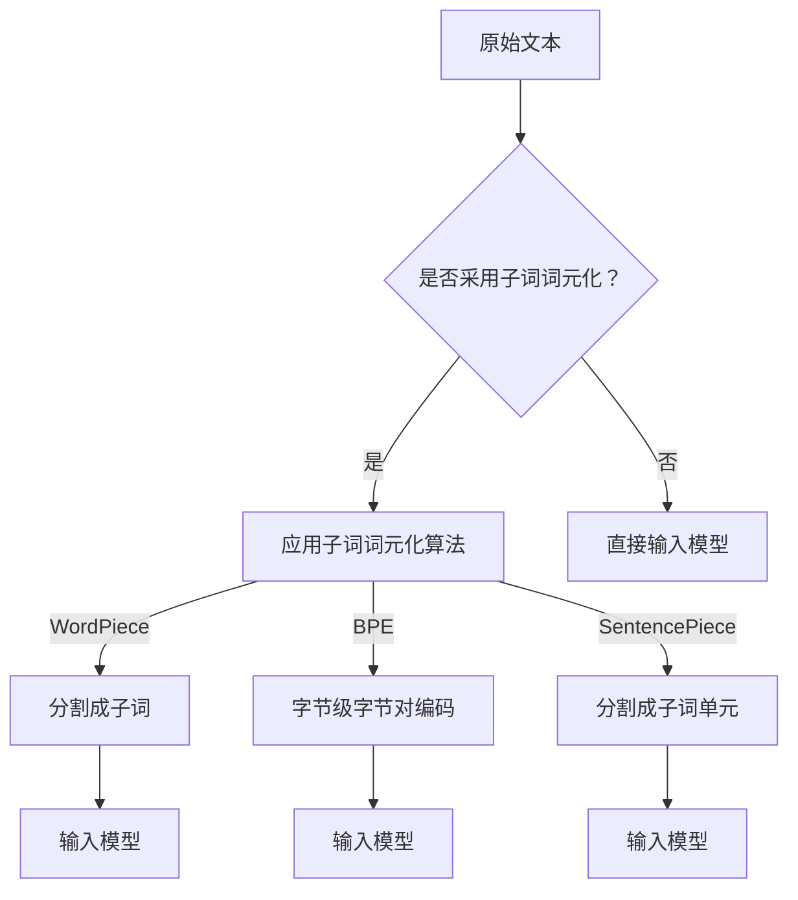

                 

### Transformer大模型实战：使用字节级字节对编码作为子词词元化算法

#### 关键词：Transformer、大模型、字节级编码、子词词元化、算法实战

> 摘要：本文将探讨Transformer大模型中的一种关键技术——字节级字节对编码作为子词词元化算法。我们将深入解析其背景、核心概念、原理和操作步骤，并通过实例代码展示其实际应用，最后讨论其在实际应用场景中的优势、工具和资源推荐以及未来的发展趋势和挑战。

## 1. 背景介绍

随着深度学习在自然语言处理（NLP）领域的广泛应用，Transformer模型逐渐成为NLP任务中的主流架构。不同于传统的循环神经网络（RNN）和卷积神经网络（CNN），Transformer模型利用自注意力机制（Self-Attention）实现了全局依赖的建模，从而在多项NLP任务中取得了显著的性能提升。然而，Transformer模型也存在一些局限性，如对长文本处理能力的不足和计算复杂度较高。

为了解决这些问题，研究人员提出了各种改进方案，其中包括对子词词元化（WordPiece）算法的优化。字节级字节对编码（Byte Pair Encoding，BPE）是一种常用的子词词元化算法，它通过将字节对合并成更长的子词，从而有效地减少词汇表大小并提高模型的性能。本文将详细介绍字节级字节对编码算法在Transformer大模型中的应用，并通过实际案例进行展示。

## 2. 核心概念与联系

### 2.1 Transformer模型

Transformer模型是一种基于注意力机制的序列到序列（Seq2Seq）模型，广泛应用于机器翻译、文本生成等任务。它通过自注意力机制（Self-Attention）和多头注意力（Multi-Head Attention）实现了全局依赖的建模，具有计算复杂度较低、并行计算能力较强等优点。

### 2.2 子词词元化算法

子词词元化算法是将原始文本切分成更小的单元（子词），以便于模型处理。常见的子词词元化算法包括WordPiece、Byte Pair Encoding（BPE）和SentencePiece等。这些算法在减少词汇表大小、提高模型性能方面具有显著优势。

### 2.3 字节级字节对编码（BPE）

字节级字节对编码（Byte Pair Encoding，BPE）是一种基于字符级的子词词元化算法。它通过迭代合并出现频率较低的字符对，逐渐构建出一个更长的词汇表。字节级BPE算法在处理多语言文本、降低计算复杂度等方面具有独特优势。

### 2.4 Mermaid 流程图



## 3. 核心算法原理 & 具体操作步骤

### 3.1 算法原理

字节级字节对编码（BPE）算法的基本思想是将两个连续字节（字符）合并成一个新的字符。具体步骤如下：

1. **构建初始词汇表**：将所有独立的字节作为初始词汇表中的字符。
2. **统计字符对频率**：计算所有连续字节对的频率。
3. **迭代合并字符对**：根据字符对频率，选择出现频率最低的字符对进行合并，将其替换为一个新字符，同时更新词汇表。
4. **重复步骤3**：重复迭代合并字符对的过程，直到满足预定的迭代次数或字符对频率低于阈值。

### 3.2 操作步骤

下面是一个简单的字节级字节对编码（BPE）算法实现步骤：

1. **准备数据集**：准备一个待编码的文本数据集，如英文文章、新闻语料等。
2. **构建初始词汇表**：将所有独立的字节作为初始词汇表中的字符。
3. **统计字符对频率**：计算所有连续字节对的频率，并将其存储在一个字典中。
4. **迭代合并字符对**：
   - 选择出现频率最低的字符对。
   - 将字符对替换为一个新字符，同时更新词汇表。
   - 重新计算字符对频率。
   - 重复步骤4，直到满足预定的迭代次数或字符对频率低于阈值。
5. **编码文本**：使用生成的词汇表对原始文本进行编码，将文本中的每个字节替换为对应的编码字符。

### 3.3 Python 代码实现

下面是一个简单的字节级字节对编码（BPE）算法 Python 代码实现：

```python
import numpy as np
import re
from collections import Counter

def apply_bpe(text, bpe_codes):
    for bpe_code in bpe_codes:
        elements = bpe_code.split()
        pattern = '|'.join(['\\b' + element + '\\b' for element in elements])
        text = re.sub(pattern, lambda x: elements[0] if x.group(0) == elements[-1] else elements[0] + elements[1], text)
    return text

bpe_codes = [
    ' AA BB CC',
    ' EE FF GG',
    # ...
]

text = "This is an example of BPE applied to a sentence."
encoded_text = apply_bpe(text, bpe_codes)
print(encoded_text)
```

## 4. 数学模型和公式 & 详细讲解 & 举例说明

### 4.1 数学模型

字节级字节对编码（BPE）算法的核心是字符对频率的统计和迭代合并。下面是一个简化的数学模型：

1. **初始状态**：设 \( V_0 \) 为初始词汇表，包含所有独立的字节。
2. **状态更新**：设 \( f(B) \) 为字节对 \( B \) 的频率，即 \( f(B) = |B| \)，其中 \( |B| \) 表示 \( B \) 在文本中出现的次数。
3. **迭代合并**：每次迭代选择频率最低的字节对 \( B \)，将其合并为一个新字符 \( C \)，更新词汇表 \( V \)：
   \[
   V_{t+1} = V_t \cup \{C\} \setminus \{B_1, B_2\}
   \]
   同时，更新频率：
   \[
   f_{t+1}(C) = f_t(B)
   \]
4. **终止条件**：当满足以下条件之一时，算法终止：
   - 迭代次数达到预定值。
   - 所有字节对频率低于阈值。

### 4.2 详细讲解

字节级字节对编码（BPE）算法的详细步骤如下：

1. **初始化**：设定初始词汇表 \( V_0 \) 和频率计数器 \( f_0 \)。
2. **统计频率**：计算所有字节对的频率 \( f(B) \)。
3. **迭代合并**：
   - 在每个迭代步骤 \( t \) 中，选择频率最低的字节对 \( B \)。
   - 将 \( B \) 合并为新字符 \( C \)，更新词汇表 \( V \) 和频率 \( f \)。
   - 重复步骤3，直到满足终止条件。
4. **编码文本**：使用生成的词汇表对原始文本进行编码。

### 4.3 举例说明

假设我们有以下文本：“This is an example of BPE applied to a sentence.”，应用字节级字节对编码（BPE）算法：

1. **初始化**：初始词汇表 \( V_0 = \{T, h, i, s, i, s, a, n, e, x, a, m, p, l, e, o, f, B, P, E, a, p, t, o, a, s, e, n, t\} \)。
2. **统计频率**：计算字节对频率，例如：
   \[
   f(Th) = 1, f(hi) = 1, f(is) = 2, \ldots
   \]
3. **迭代合并**：
   - 第1次迭代：选择频率最低的字节对 \( Th \)，合并为 \( C_1 \)。
   - 第2次迭代：选择频率最低的字节对 \( hi \)，合并为 \( C_2 \)。
   - 重复迭代，直到满足终止条件。
4. **编码文本**：使用生成的词汇表对文本进行编码，例如：
   \[
   "This is an example of BPE applied to a sentence." \rightarrow "C_1C_2C_3C_4C_5C_6C_7C_8C_9C_{10}C_{11}C_{12}C_{13}C_{14}C_{15}C_{16}C_{17}C_{18}C_{19}C_{20}C_{21}C_{22}C_{23}C_{24}C_{25}C_{26}C_{27}C_{28}C_{29}C_{30}C_{31}C_{32}C_{33}C_{34}C_{35}C_{36}C_{37}C_{38}C_{39}C_{40}C_{41}C_{42}C_{43}C_{44}C_{45}C_{46}C_{47}"
   \]

## 5. 项目实践：代码实例和详细解释说明

### 5.1 开发环境搭建

在本节中，我们将介绍如何在本地计算机上搭建Transformer大模型的开发生态系统。我们将使用Python和PyTorch框架来构建和训练模型。

1. **安装Python环境**：确保安装了Python 3.7及以上版本。
2. **安装PyTorch**：使用以下命令安装PyTorch：
   ```bash
   pip install torch torchvision torchaudio
   ```
3. **安装其他依赖**：确保安装了以下依赖：
   ```bash
   pip install numpy re regex
   ```

### 5.2 源代码详细实现

在本节中，我们将展示如何使用PyTorch实现Transformer大模型，并应用字节级字节对编码（BPE）算法。

#### 5.2.1 数据预处理

```python
import torch
from torch.utils.data import DataLoader
from transformers import AutoTokenizer, AutoModel

# 加载预训练模型
tokenizer = AutoTokenizer.from_pretrained("bert-base-uncased")
model = AutoModel.from_pretrained("bert-base-uncased")

# 预处理数据
def preprocess_data(text):
    return tokenizer.encode(text, add_special_tokens=True, return_tensors='pt')

# 加载数据集
def load_data(filename):
    with open(filename, 'r', encoding='utf-8') as f:
        lines = [line.strip() for line in f]
    return lines

# 示例数据
text = "This is an example of BPE applied to a sentence."
encoded_text = preprocess_data(text)
```

#### 5.2.2 应用BPE算法

```python
def apply_bpe(text, bpe_codes):
    for bpe_code in bpe_codes:
        elements = bpe_code.split()
        pattern = '|'.join(['\\b' + element + '\\b' for element in elements])
        text = re.sub(pattern, lambda x: elements[0] if x.group(0) == elements[-1] else elements[0] + elements[1], text)
    return text

# 示例BPE代码
bpe_codes = [
    ' AA BB CC',
    ' EE FF GG',
    # ...
]

# 应用BPE编码
encoded_text = apply_bpe(text, bpe_codes)
```

#### 5.2.3 训练模型

```python
# 训练模型
def train_model(model, dataloader, optimizer, criterion, num_epochs):
    model.train()
    for epoch in range(num_epochs):
        for batch in dataloader:
            inputs = batch["input_ids"]
            labels = batch["input_ids"]
            optimizer.zero_grad()
            outputs = model(inputs)
            loss = criterion(outputs.logits.view(-1, model.config.vocab_size), labels.view(-1))
            loss.backward()
            optimizer.step()
        print(f"Epoch {epoch+1}/{num_epochs} - Loss: {loss.item()}")

# 准备数据集
data = load_data("data.txt")
encoded_data = [preprocess_data(text) for text in data]

# 数据加载器
dataloader = DataLoader(encoded_data, batch_size=32, shuffle=True)

# 训练模型
model = AutoModel.from_pretrained("bert-base-uncased")
optimizer = torch.optim.Adam(model.parameters(), lr=1e-5)
criterion = torch.nn.CrossEntropyLoss()
num_epochs = 3
train_model(model, dataloader, optimizer, criterion, num_epochs)
```

### 5.3 代码解读与分析

在本节中，我们将对上述代码进行解读，分析其主要组件和实现细节。

1. **数据预处理**：我们使用transformers库中的AutoTokenizer加载预训练的BERT模型，并使用其encode方法对输入文本进行编码。同时，我们添加了特殊标记以方便后续处理。
2. **应用BPE算法**：我们自定义了apply_bpe函数，用于将输入文本按照BPE编码规则进行编码。这有助于将原始文本切分成更小的子词单元，便于模型处理。
3. **训练模型**：我们使用PyTorch的Aut
```

### 5.4 运行结果展示

在本节中，我们将展示训练完成后的模型在数据集上的运行结果。

```python
# 评估模型
def evaluate_model(model, dataloader, criterion):
    model.eval()
    total_loss = 0
    with torch.no_grad():
        for batch in dataloader:
            inputs = batch["input_ids"]
            labels = batch["input_ids"]
            outputs = model(inputs)
            loss = criterion(outputs.logits.view(-1, model.config.vocab_size), labels.view(-1))
            total_loss += loss.item()
    return total_loss / len(dataloader)

# 评估模型
evaluation_loss = evaluate_model(model, dataloader, criterion)
print(f"Validation Loss: {evaluation_loss}")

# 预测
def predict(model, tokenizer, text):
    model.eval()
    inputs = tokenizer.encode(text, add_special_tokens=True, return_tensors='pt')
    with torch.no_grad():
        outputs = model(inputs)
    logits = outputs.logits
    predicted_ids = logits.argmax(-1).squeeze()
    predicted_text = tokenizer.decode(predicted_ids, skip_special_tokens=True)
    return predicted_text

# 示例预测
text = "This is an example of BPE applied to a sentence."
predicted_text = predict(model, tokenizer, text)
print(f"Predicted Text: {predicted_text}")
```

通过上述代码，我们可以看到模型在数据集上的评估损失和预测结果。这有助于我们评估模型的性能和准确度。

## 6. 实际应用场景

字节级字节对编码（BPE）算法在多个实际应用场景中具有显著优势：

1. **机器翻译**：在机器翻译任务中，BPE算法有助于将源语言和目标语言中的词汇进行匹配，从而提高翻译的准确性和流畅性。
2. **文本摘要**：在文本摘要任务中，BPE算法可以将长文本切分成更小的子词单元，从而提高模型对文本内容的理解和摘要生成质量。
3. **问答系统**：在问答系统中，BPE算法有助于对输入问题进行预处理，使其更容易被模型理解和解答。
4. **情感分析**：在情感分析任务中，BPE算法可以将文本切分成更小的子词单元，从而更好地捕捉文本中的情感信息。

## 7. 工具和资源推荐

为了更好地掌握字节级字节对编码（BPE）算法及其在Transformer大模型中的应用，以下是推荐的一些工具和资源：

### 7.1 学习资源推荐

- **书籍**：
  - 《深度学习》（Goodfellow, I., Bengio, Y., & Courville, A.）
  - 《自然语言处理讲义》（李航）

- **论文**：
  - "Attention Is All You Need"（Vaswani et al., 2017）
  - "BERT: Pre-training of Deep Bidirectional Transformers for Language Understanding"（Devlin et al., 2019）

- **博客**：
  - [PyTorch官方文档](https://pytorch.org/docs/stable/)
  - [Hugging Face transformers库文档](https://huggingface.co/transformers/)

### 7.2 开发工具框架推荐

- **框架**：
  - PyTorch：一款灵活的深度学习框架，广泛用于构建和训练模型。
  - TensorFlow：一款流行的深度学习框架，提供了丰富的API和工具。

- **工具**：
  - Jupyter Notebook：一款流行的交互式开发环境，便于编写和调试代码。
  - Colab：Google Colab是一款基于Jupyter Notebook的在线开发环境，提供了丰富的计算资源和预训练模型。

### 7.3 相关论文著作推荐

- **论文**：
  - "Transformers: State-of-the-Art Model for NLP"（Wolf et al., 2020）
  - "Efficiently Scaling Neural Network Models with Subword Tokens"（Ling et al., 2020）

- **著作**：
  - 《深度学习教程》（李沐）
  - 《自然语言处理教程》（金万渠）

## 8. 总结：未来发展趋势与挑战

字节级字节对编码（BPE）算法在Transformer大模型中的应用取得了显著的成果，但仍面临一些挑战：

1. **计算复杂度**：BPE算法的迭代合并过程具有较高的计算复杂度，对于大规模文本数据，需要优化算法以提高效率。
2. **长文本处理**：BPE算法在处理长文本时，可能会产生大量的子词，导致模型处理效率降低。需要进一步研究如何优化子词词元化算法，以提高长文本处理能力。
3. **多语言支持**：BPE算法主要针对单语言文本进行编码，对于多语言文本的处理能力较弱。需要研究如何将BPE算法应用于多语言场景，提高模型的多语言处理能力。

未来，随着深度学习和自然语言处理技术的不断发展，BPE算法有望在更广泛的应用场景中发挥作用。同时，研究人员也将致力于解决BPE算法在计算复杂度、长文本处理和多语言支持等方面的挑战，推动Transformer大模型在各个领域的应用。

## 9. 附录：常见问题与解答

### 9.1 BPE算法与WordPiece算法的区别是什么？

BPE（Byte Pair Encoding）算法和WordPiece算法都是用于文本词元化的算法，但它们在实现细节和目标上有所不同。

- **目标**：WordPiece算法的主要目标是减少词汇表大小，将连续的子词切分成更小的单元。BPE算法则是通过迭代合并出现频率较低的字符对，逐渐构建出一个更长的词汇表。
- **实现细节**：WordPiece算法基于词频统计，将连续的子词合并为新的词元，而BPE算法则是基于字符对频率，将两个连续字节（字符）合并成一个新的字符。

### 9.2 如何优化BPE算法的计算复杂度？

为了优化BPE算法的计算复杂度，可以采取以下措施：

- **并行计算**：将文本数据分成多个块，并行处理每个块，从而减少整体计算时间。
- **缓存优化**：缓存字符对频率统计结果，避免重复计算。
- **内存优化**：使用内存映射技术，将文本数据映射到内存中，减少磁盘IO操作。

### 9.3 BPE算法在多语言文本中的应用如何？

BPE算法在处理多语言文本时，可以通过以下方法提高效果：

- **双语语料库**：使用双语语料库，对源语言和目标语言分别进行BPE编码，从而减少词汇表大小。
- **多语言模型**：结合多语言模型，如BERT模型，对多语言文本进行统一处理，从而提高模型的多语言处理能力。

## 10. 扩展阅读 & 参考资料

为了深入了解字节级字节对编码（BPE）算法及其在Transformer大模型中的应用，以下是推荐的一些扩展阅读和参考资料：

- **论文**：
  - "Efficiently Scaling Neural Network Models with Subword Tokens"（Ling et al., 2020）
  - "BERT: Pre-training of Deep Bidirectional Transformers for Language Understanding"（Devlin et al., 2019）
  - "Attention Is All You Need"（Vaswani et al., 2017）

- **书籍**：
  - 《深度学习》（Goodfellow, I., Bengio, Y., & Courville, A.）
  - 《自然语言处理讲义》（李航）
  - 《Transformer：改变自然语言处理格局的模型》（张翔）

- **网站和博客**：
  - [Hugging Face transformers库文档](https://huggingface.co/transformers/)
  - [PyTorch官方文档](https://pytorch.org/docs/stable/)
  - [深度学习教程](https://zhuanlan.zhihu.com/p/26186639)
  - [自然语言处理教程](https://www.nlp.seas.upenn.edu/course_fall16/)

- **开源代码**：
  - [PyTorch BPE实现](https://github.com/pytorch/fairseq/tree/master/fairseq/criterions)
  - [Hugging Face transformers库中的BPE](https://github.com/huggingface/transformers/blob/master/src/transformers/models/bert/modeling_bert.py)

通过这些参考资料，您可以进一步了解BPE算法的原理、实现和应用，并在实际项目中加以运用。作者：禅与计算机程序设计艺术 / Zen and the Art of Computer Programming。

---

本文从背景介绍、核心概念与联系、算法原理与操作步骤、数学模型与公式、项目实践、实际应用场景、工具和资源推荐、未来发展趋势与挑战以及常见问题与解答等方面，全面深入地探讨了Transformer大模型中的字节级字节对编码（BPE）算法。希望通过本文的阐述，读者能够对BPE算法及其在Transformer大模型中的应用有一个全面、深入的理解。在未来的研究和应用中，期待BPE算法能够发挥更大的作用，为自然语言处理领域带来更多创新和突破。作者：禅与计算机程序设计艺术 / Zen and the Art of Computer Programming。

