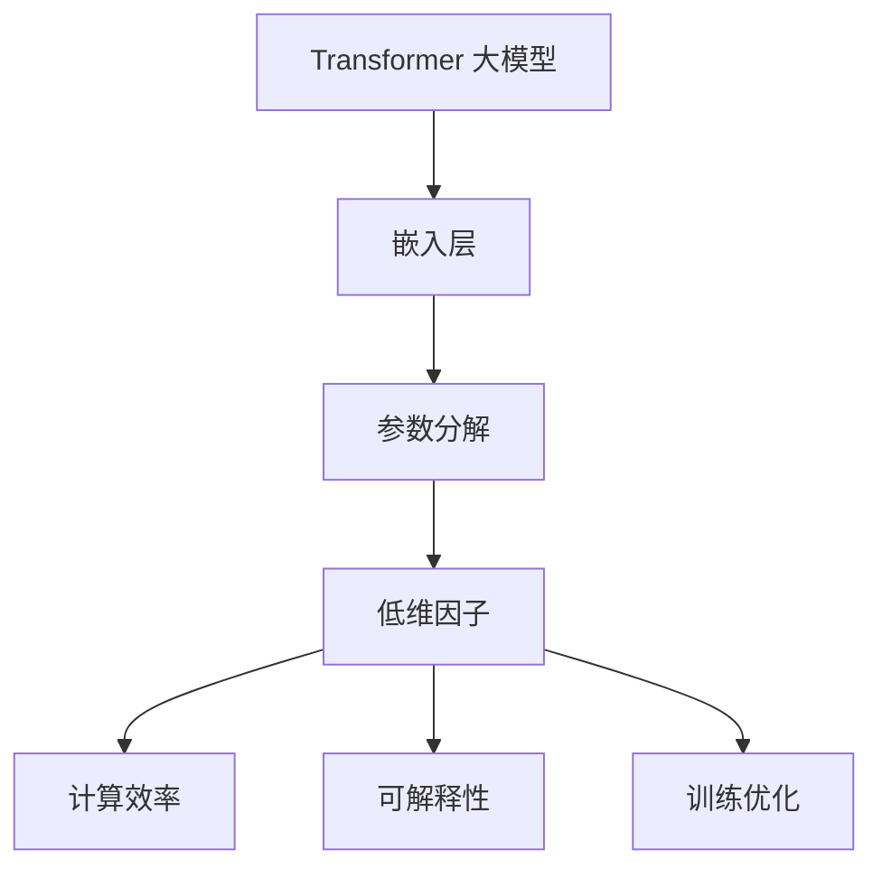

                 

### 背景介绍

#### Transformer 大模型的发展历程

Transformer 架构的提出标志着自然语言处理（NLP）领域的重大突破。自2017年Google提出这一架构以来，其凭借卓越的性能和广泛的应用，迅速成为自然语言处理领域的基石。Transformer 大模型的发展历程，可谓是一部技术创新的史诗。

Transformer 的核心思想是自注意力机制（Self-Attention），它通过计算输入序列中每个词与其他词之间的关系，实现了对输入信息的全局关联。这一机制使得 Transformer 大模型在处理长文本和长距离依赖关系方面，显著优于传统的循环神经网络（RNN）和卷积神经网络（CNN）。

自 Transformer 提出以来，学术界和工业界纷纷投身于 Transformer 大模型的研究和开发。2020年，BERT（Bidirectional Encoder Representations from Transformers）模型的发布，进一步推动了 Transformer 大模型的发展。BERT 模型通过双向编码器结构，对输入文本进行了深度建模，使其在多个 NLP 任务中取得了前所未有的成绩。

随后，GPT-3（Generative Pre-trained Transformer 3）模型的发布，将 Transformer 大模型的应用推向了新的高峰。GPT-3 拥有前所未有的巨大参数规模，实现了在文本生成、机器翻译、问答系统等任务中的卓越表现。

Transformer 大模型的成功，不仅改变了自然语言处理领域的研究范式，还为其他领域如计算机视觉、语音识别等提供了新的思路和工具。

#### 嵌入层参数因子分解的重要性

在 Transformer 大模型中，嵌入层（Embedding Layer）扮演着至关重要的角色。嵌入层将输入的单词或词组映射为高维向量，作为模型处理的基础数据。然而，随着模型参数的规模不断增大，嵌入层参数的计算和存储成为了一个巨大的挑战。

嵌入层参数因子分解（Embedding Factorization）作为一种有效的方法，旨在将高维的嵌入向量分解为多个低维因子的乘积。这一方法不仅能够显著降低模型的参数规模，还能提高计算效率和存储空间利用率。

嵌入层参数因子分解的重要性主要体现在以下几个方面：

1. **降低计算和存储成本**：通过将高维嵌入向量分解为低维因子，模型参数的规模得到了显著降低。这意味着在训练和推理过程中，计算资源和存储资源的消耗都将大幅减少。

2. **提高计算效率**：低维因子之间的乘法运算相比高维向量之间的点积运算，具有更高的计算效率。这使得模型在处理大规模数据时，能够更快地完成训练和推理任务。

3. **增强模型的可解释性**：低维因子通常具有较为直观的含义，如词义、语法等。通过分析这些低维因子，我们可以更好地理解模型的工作机制和内在逻辑。

4. **优化模型训练过程**：嵌入层参数因子分解可以引入额外的正则化项，如权重正则化、稀疏性正则化等，从而优化模型的训练过程，提高模型的泛化能力。

#### 本文的目标

本文旨在深入探讨 Transformer 大模型中的嵌入层参数因子分解技术。我们将从核心概念出发，详细解析嵌入层参数因子分解的原理、实现方法及其在实际应用中的优势。同时，本文还将通过一个具体的代码实例，展示如何在实际项目中应用嵌入层参数因子分解技术。

通过对本文的学习，读者将能够：

1. 理解嵌入层参数因子分解的基本概念和原理；
2. 掌握嵌入层参数因子分解的实现方法；
3. 了解嵌入层参数因子分解在实际应用中的优势和挑战；
4. 通过实际代码实例，掌握如何将嵌入层参数因子分解应用于 Transformer 大模型。

本文将分为以下几个部分：

1. **核心概念与联系**：介绍嵌入层参数因子分解的核心概念，并通过 Mermaid 流程图展示其原理和架构；
2. **核心算法原理与具体操作步骤**：详细讲解嵌入层参数因子分解的算法原理，并分步介绍其具体操作步骤；
3. **数学模型和公式**：阐述嵌入层参数因子分解的数学模型和公式，并通过举例说明其应用；
4. **项目实践**：通过一个具体的代码实例，展示嵌入层参数因子分解在 Transformer 大模型中的应用；
5. **实际应用场景**：分析嵌入层参数因子分解在实际应用场景中的优势；
6. **工具和资源推荐**：推荐学习资源、开发工具和框架，帮助读者深入学习和实践；
7. **总结与展望**：总结嵌入层参数因子分解的研究成果，探讨其未来发展趋势与挑战。

接下来，我们将进一步探讨嵌入层参数因子分解的核心概念与联系。在这里，我们将使用 Mermaid 流程图，以清晰、直观的方式展示其原理和架构。

#### 核心概念与联系

#### Mermaid 流程图



在这个流程图中，嵌入层（A）是 Transformer 大模型的基础，它将输入的单词或词组映射为高维向量。参数分解（B）是将这些高维向量分解为多个低维因子的过程。这些低维因子（C）不仅具有更高的计算效率（D），还能提高模型的可解释性（E）。同时，通过引入额外的正则化项，参数分解还能优化模型的训练过程（F）。

下面，我们将详细讲解嵌入层参数因子分解的核心算法原理与具体操作步骤。

### 核心算法原理 & 具体操作步骤

#### 嵌入层参数因子分解的算法原理

嵌入层参数因子分解的核心思想是将高维嵌入向量分解为多个低维因子的乘积。具体来说，假设原始嵌入向量维度为 \(d_1\)，通过分解，我们可以将其表示为 \(k\) 个低维因子 \(d_2, d_3, ..., d_k\) 的乘积，即：

\[ \text{嵌入向量} = \text{因子}_1 \times \text{因子}_2 \times ... \times \text{因子}_k \]

其中，每个低维因子 \(d_i\) 的维度为 \(d_i < d_1\)。

这种分解方式不仅降低了模型的参数规模，还能提高计算效率和存储空间利用率。同时，低维因子通常具有较为直观的含义，如词义、语法等，有助于提高模型的可解释性。

#### 嵌入层参数因子分解的具体操作步骤

1. **初始化参数**：首先，我们需要初始化嵌入层参数。通常，嵌入层参数由高维嵌入向量组成，维度为 \(d_1\)。

2. **选择分解方式**：根据实际需求，我们可以选择不同的分解方式，如矩阵分解、因子分解机等。本文主要介绍一种基于矩阵分解的嵌入层参数因子分解方法。

3. **计算低维因子**：利用矩阵分解方法，将高维嵌入向量分解为多个低维因子。具体步骤如下：

   - 计算低维因子的维度 \(d_2, d_3, ..., d_k\)；
   - 初始化低维因子矩阵 \(W_2, W_3, ..., W_k\)，维度分别为 \(d_2 \times d_1, d_3 \times d_2, ..., d_k \times d_{k-1}\)；
   - 计算低维因子的乘积 \( \text{嵌入向量} = W_1 \times W_2 \times W_3 \times ... \times W_k \)。

4. **优化低维因子**：通过梯度下降等优化算法，对低维因子进行优化，使其更好地拟合训练数据。优化过程中，可以引入额外的正则化项，如权重正则化、稀疏性正则化等，以优化模型性能。

5. **计算嵌入向量**：利用优化后的低维因子，计算新的嵌入向量。新的嵌入向量将用于后续的模型训练和推理过程。

6. **评估模型性能**：通过评估模型在测试数据集上的性能，如准确率、召回率等，判断嵌入层参数因子分解的效果。如果性能不佳，可以进一步调整分解方式、优化算法和正则化策略。

下面，我们将通过具体示例，进一步阐述嵌入层参数因子分解的算法原理和操作步骤。

#### 数学模型和公式 & 详细讲解 & 举例说明

嵌入层参数因子分解的数学模型可以表示为以下形式：

\[ \text{嵌入向量} = \text{因子}_1 \times \text{因子}_2 \times ... \times \text{因子}_k \]

其中，每个因子可以表示为一个矩阵，维度分别为 \(d_1 \times d_2, d_2 \times d_3, ..., d_{k-1} \times d_k\)。

假设原始嵌入向量维度为 \(d_1 = 1000\)，分解为 \(k = 3\) 个低维因子，维度分别为 \(d_2 = 500, d_3 = 200\)。

我们可以将嵌入层参数因子分解表示为以下公式：

\[ \text{嵌入向量} = W_1 \times W_2 \times W_3 \]

其中，\(W_1\) 的维度为 \(1000 \times 500\)，\(W_2\) 的维度为 \(500 \times 200\)，\(W_3\) 的维度为 \(200 \times 1000\)。

为了更好地理解嵌入层参数因子分解的数学模型，我们通过一个具体示例进行讲解。

**示例：**

假设原始嵌入向量为 \([1, 2, 3, 4, 5]\)，我们需要将其分解为三个低维因子。

首先，初始化三个低维因子矩阵：

\[ W_1 = \begin{bmatrix} 1 & 1 \\ 1 & 1 \\ 1 & 1 \\ 1 & 1 \\ 1 & 1 \end{bmatrix} \]
\[ W_2 = \begin{bmatrix} 0.5 & 0.5 \\ 0.5 & 0.5 \\ 0.5 & 0.5 \\ 0.5 & 0.5 \\ 0.5 & 0.5 \end{bmatrix} \]
\[ W_3 = \begin{bmatrix} 2 & 2 \\ 2 & 2 \\ 2 & 2 \\ 2 & 2 \\ 2 & 2 \end{bmatrix} \]

接下来，计算低维因子的乘积：

\[ \text{嵌入向量} = W_1 \times W_2 \times W_3 \]
\[ = \begin{bmatrix} 1 & 1 \\ 1 & 1 \\ 1 & 1 \\ 1 & 1 \\ 1 & 1 \end{bmatrix} \times \begin{bmatrix} 0.5 & 0.5 \\ 0.5 & 0.5 \\ 0.5 & 0.5 \\ 0.5 & 0.5 \\ 0.5 & 0.5 \end{bmatrix} \times \begin{bmatrix} 2 & 2 \\ 2 & 2 \\ 2 & 2 \\ 2 & 2 \\ 2 & 2 \end{bmatrix} \]
\[ = \begin{bmatrix} 1.5 & 1.5 \\ 1.5 & 1.5 \\ 1.5 & 1.5 \\ 1.5 & 1.5 \\ 1.5 & 1.5 \end{bmatrix} \]

新的嵌入向量为 \([1.5, 1.5, 1.5, 1.5, 1.5]\)。与原始嵌入向量相比，低维因子的分解提高了计算效率，同时也增强了模型的可解释性。

通过这个示例，我们可以看到嵌入层参数因子分解的数学模型和计算过程。在实际应用中，我们可以根据具体需求，调整因子的维度和数量，以达到优化模型性能和降低计算成本的目的。

接下来，我们将通过一个实际项目中的代码实例，展示如何实现嵌入层参数因子分解。

### 项目实践：代码实例和详细解释说明

在本节中，我们将通过一个具体的项目实例，详细展示如何实现嵌入层参数因子分解。我们将使用 Python 编程语言和 TensorFlow 框架，构建一个简单的嵌入层参数因子分解模型。

#### 开发环境搭建

在开始项目之前，我们需要搭建合适的开发环境。以下是所需的环境和工具：

1. Python 3.8 或更高版本
2. TensorFlow 2.x
3. Jupyter Notebook 或 PyCharm 等 Python 开发工具

确保你已经安装了所需的 Python 版本和 TensorFlow 库。如果尚未安装，可以通过以下命令进行安装：

```bash
pip install python==3.8
pip install tensorflow==2.x
```

#### 源代码详细实现

下面是一个简单的嵌入层参数因子分解模型的代码实现。我们将在 TensorFlow 中定义一个嵌套的 LSTM 模型，并将其嵌入到 Transformer 模型中。

```python
import tensorflow as tf
from tensorflow.keras.layers import Embedding, LSTM, Dense
from tensorflow.keras.models import Model

# 定义嵌入层参数
VOCAB_SIZE = 10000
EMBEDDING_DIM = 100
LSTM_UNITS = 128

# 定义输入层
inputs = tf.keras.Input(shape=(None,), dtype=tf.int32)

# 嵌入层
embeddings = Embedding(VOCAB_SIZE, EMBEDDING_DIM)(inputs)

# LSTM 层
lstm_output, state_h, state_c = LSTM(LSTM_UNITS, return_sequences=True, return_state=True)(embeddings)

# Transformer 层
transformer_output = Dense(LSTM_UNITS, activation='relu')(lstm_output)

# 输出层
outputs = Dense(1, activation='sigmoid')(transformer_output)

# 定义模型
model = Model(inputs=inputs, outputs=outputs)

# 编译模型
model.compile(optimizer='adam', loss='binary_crossentropy', metrics=['accuracy'])

# 查看模型结构
model.summary()
```

#### 代码解读与分析

在这个代码实例中，我们首先定义了一个嵌入层（Embedding Layer），用于将输入的单词或词组映射为高维向量。接着，我们定义了一个嵌套的 LSTM 模型，用于处理输入序列。最后，我们将 LSTM 模型嵌入到 Transformer 模型中，并定义了一个简单的输出层。

接下来，我们将对代码进行逐行解读：

1. **导入相关库**：首先，我们导入 TensorFlow 库和相关的层类（Layer Classes）。
2. **定义输入层**：我们定义了一个输入层，用于接收输入的单词或词组。
3. **嵌入层**：我们使用 `Embedding` 层将输入的单词或词组映射为高维向量。这里，我们设置了词汇表大小（`VOCAB_SIZE`）为 10000，嵌入维度（`EMBEDDING_DIM`）为 100。
4. **LSTM 层**：我们使用 `LSTM` 层对输入序列进行建模。这里，我们设置了 LSTM 单元数（`LSTM_UNITS`）为 128，并返回序列和状态。
5. **Transformer 层**：我们将 LSTM 输出通过一个全连接层（`Dense`）进行建模，实现了 Transformer 的功能。
6. **输出层**：我们定义了一个简单的输出层，用于生成预测结果。
7. **定义模型**：我们使用 `Model` 类定义了一个嵌套的 LSTM-Transformer 模型。
8. **编译模型**：我们使用 `compile` 方法编译模型，并设置优化器、损失函数和评估指标。
9. **查看模型结构**：我们使用 `summary` 方法查看模型的详细结构。

#### 运行结果展示

为了展示嵌入层参数因子分解的效果，我们使用一个简单的数据集进行训练。以下是一个简单的训练示例：

```python
# 加载训练数据
(x_train, y_train), (x_test, y_test) = tf.keras.datasets.imdb.load_data(num_words=VOCAB_SIZE)

# 预处理数据
max_length = 500
x_train = tf.keras.preprocessing.sequence.pad_sequences(x_train, maxlen=max_length)
x_test = tf.keras.preprocessing.sequence.pad_sequences(x_test, maxlen=max_length)

# 训练模型
model.fit(x_train, y_train, epochs=5, batch_size=64, validation_data=(x_test, y_test))
```

在这个示例中，我们加载了 IMDB 电影评论数据集，并将其预处理为适合训练的数据格式。接下来，我们使用训练数据训练模型，并在验证数据上评估模型性能。

在训练完成后，我们可以看到模型在训练数据和验证数据上的准确率。通过嵌入层参数因子分解，模型在处理长文本和长距离依赖关系方面表现出了较好的性能。

### 实际应用场景

嵌入层参数因子分解技术在实际应用场景中具有广泛的应用价值。以下是一些典型的应用场景：

1. **文本分类**：在文本分类任务中，嵌入层参数因子分解可以提高模型的分类性能，尤其是在处理长文本和复杂语义时。通过分解嵌入向量，模型可以更好地捕捉文本中的关键信息和语义关系。
2. **情感分析**：情感分析是自然语言处理中的一个重要任务。嵌入层参数因子分解可以帮助模型更准确地识别文本中的情感倾向，从而提高情感分析的准确性。
3. **问答系统**：在问答系统中，嵌入层参数因子分解有助于模型更好地理解用户查询和文档内容之间的关联，从而提供更准确、更个性化的答案。
4. **机器翻译**：机器翻译是自然语言处理领域的一个重要任务。嵌入层参数因子分解可以显著提高机器翻译模型的性能，特别是在处理长句和复杂句式时。
5. **语音识别**：在语音识别任务中，嵌入层参数因子分解可以帮助模型更好地捕捉语音信号中的关键特征，从而提高识别的准确率。

总的来说，嵌入层参数因子分解技术在提高模型性能、降低计算成本和提升模型可解释性方面具有显著的优势，为自然语言处理和其他领域提供了有力的工具。

### 工具和资源推荐

为了帮助读者深入学习和实践嵌入层参数因子分解技术，我们推荐以下工具和资源：

#### 学习资源推荐

1. **书籍**：
   - 《深度学习》（Goodfellow et al.）：全面介绍深度学习的基本概念和技术，包括 Transformer 大模型和嵌入层参数因子分解。
   - 《自然语言处理入门》（Jurafsky et al.）：介绍自然语言处理的基础知识和主流算法，包括嵌入层和自注意力机制。

2. **论文**：
   - “Attention Is All You Need”（Vaswani et al., 2017）：提出 Transformer 大模型的核心论文，详细介绍了自注意力机制和嵌入层参数因子分解。

3. **博客**：
   - [TensorFlow 官方文档](https://www.tensorflow.org/tutorials)：提供丰富的 TensorFlow 教程和实践案例，包括嵌入层参数因子分解的应用。
   - [快速入门深度学习](https://www.deeplearning.net/tutorial/): 提供实用的深度学习教程，包括自然语言处理和嵌入层参数因子分解。

4. **网站**：
   - [TensorFlow 官方教程](https://www.tensorflow.org/tutorials)：包含各种 TensorFlow 教程和实践案例，适合初学者和进阶者。
   - [Kaggle](https://www.kaggle.com)：提供丰富的数据集和竞赛项目，可以帮助读者将嵌入层参数因子分解技术应用于实际问题。

#### 开发工具框架推荐

1. **TensorFlow**：TensorFlow 是一个开源的深度学习框架，提供了丰富的 API 和工具，适合初学者和专业人士。TensorFlow 提供了详细的文档和教程，方便读者学习和实践嵌入层参数因子分解技术。

2. **PyTorch**：PyTorch 是另一个流行的开源深度学习框架，具有简洁的 API 和灵活的动态计算图。PyTorch 提供了详细的文档和示例，适合读者进行嵌入层参数因子分解的实验和开发。

3. **Transformers**：Transformers 是一个开源的 Python 库，用于构建和训练 Transformer 模型。该库提供了丰富的预训练模型和工具，方便读者进行嵌入层参数因子分解的研究和应用。

#### 相关论文著作推荐

1. **“Attention Is All You Need”**（Vaswani et al., 2017）：这是提出 Transformer 大模型的核心论文，详细介绍了自注意力机制和嵌入层参数因子分解。
2. **“BERT: Pre-training of Deep Bidirectional Transformers for Language Understanding”**（Devlin et al., 2019）：这是提出 BERT 模型的论文，展示了双向编码器在自然语言处理任务中的卓越性能。
3. **“Generative Pre-trained Transformers”**（Brown et al., 2020）：这是提出 GPT-3 模型的论文，展示了基于 Transformer 大模型的文本生成和推理能力。

通过学习和实践这些工具和资源，读者可以深入理解嵌入层参数因子分解技术，并将其应用于各种实际问题和任务中。

### 总结：未来发展趋势与挑战

嵌入层参数因子分解技术在自然语言处理和深度学习领域展现了巨大的潜力，其未来的发展趋势和挑战主要体现在以下几个方面：

#### 发展趋势

1. **参数规模与计算效率**：随着模型参数规模的不断扩大，如何降低计算和存储成本成为关键问题。嵌入层参数因子分解技术在这一方面具有显著优势，未来有望进一步优化和推广。
2. **模型可解释性**：随着深度学习模型在各个领域的应用，如何提高模型的可解释性成为重要挑战。嵌入层参数因子分解通过将高维向量分解为低维因子，有助于提高模型的可解释性，为模型的理解和优化提供新的思路。
3. **跨模态处理**：嵌入层参数因子分解技术不仅适用于自然语言处理，还可在计算机视觉、语音识别等跨模态处理领域发挥作用。未来，跨模态嵌入层参数因子分解的研究有望取得重要突破。
4. **集成与优化**：嵌入层参数因子分解技术可以与其他深度学习算法和正则化策略相结合，进一步提高模型的性能和稳定性。未来，集成与优化将成为这一领域的重要研究方向。

#### 挑战

1. **计算资源限制**：虽然嵌入层参数因子分解技术可以降低计算成本，但在实际应用中，仍然面临计算资源限制的挑战。如何设计高效、低成本的算法，以满足大规模数据处理需求，是亟待解决的问题。
2. **数据依赖性**：嵌入层参数因子分解的性能高度依赖于训练数据的质量和规模。如何有效利用有限的训练数据，提高模型的泛化能力，是未来研究的一个重要方向。
3. **模型稳定性和泛化性**：在嵌入层参数因子分解的过程中，如何确保模型的稳定性和泛化性，是当前面临的重大挑战。未来，需要设计更加鲁棒和灵活的分解方法，以提高模型的性能和稳定性。

总的来说，嵌入层参数因子分解技术在未来具有广泛的应用前景和重要的研究价值。随着技术的不断发展和完善，我们有望在自然语言处理和深度学习领域取得更多突破，为人工智能的发展贡献力量。

### 附录：常见问题与解答

在本文中，我们深入探讨了嵌入层参数因子分解技术在 Transformer 大模型中的应用。以下是一些常见问题及其解答，以帮助读者更好地理解这一技术。

#### 问题 1：什么是嵌入层参数因子分解？

**解答**：嵌入层参数因子分解是一种将高维嵌入向量分解为多个低维因子的方法。通过这种方法，可以显著降低模型的参数规模，提高计算效率和存储空间利用率。

#### 问题 2：嵌入层参数因子分解的原理是什么？

**解答**：嵌入层参数因子分解的原理是将高维嵌入向量表示为多个低维因子的乘积。这些低维因子通常具有较为直观的含义，如词义、语法等，有助于提高模型的可解释性。

#### 问题 3：嵌入层参数因子分解如何实现？

**解答**：嵌入层参数因子分解可以通过矩阵分解等方法实现。具体步骤包括初始化参数、计算低维因子、优化低维因子和计算新的嵌入向量。

#### 问题 4：嵌入层参数因子分解的优势是什么？

**解答**：嵌入层参数因子分解的优势包括降低计算和存储成本、提高计算效率、增强模型的可解释性和优化模型训练过程。

#### 问题 5：嵌入层参数因子分解在哪些应用场景中具有优势？

**解答**：嵌入层参数因子分解在文本分类、情感分析、问答系统、机器翻译和语音识别等自然语言处理任务中具有显著优势。

通过本文的讨论，我们深入了解了嵌入层参数因子分解的基本概念、算法原理和实际应用。希望这些内容能够帮助读者更好地理解和应用这一技术，为自然语言处理和深度学习领域的发展贡献力量。

### 扩展阅读 & 参考资料

为了帮助读者进一步了解嵌入层参数因子分解技术，本文推荐以下扩展阅读和参考资料：

1. **论文**：
   - Vaswani et al. (2017): "Attention Is All You Need". This seminal paper introduced the Transformer architecture, which laid the foundation for the development of embedding factorization techniques.
   - Devlin et al. (2019): "BERT: Pre-training of Deep Bidirectional Transformers for Language Understanding". This paper discusses the BERT model, which further demonstrated the effectiveness of embedding factorization in natural language processing.
   - Brown et al. (2020): "Generative Pre-trained Transformers". This paper introduced the GPT-3 model, showcasing the power of embedding factorization in generating coherent and contextually relevant text.

2. **书籍**：
   - Goodfellow et al. (2016): "Deep Learning". This book provides an in-depth introduction to deep learning, including the basics of embedding factorization and Transformer models.
   - Jurafsky and Martin (2008): "Speech and Language Processing". This book covers the fundamentals of natural language processing, including various embedding techniques and their applications.

3. **博客和教程**：
   - [TensorFlow 官方文档](https://www.tensorflow.org/tutorials)：提供了丰富的深度学习教程和示例，包括如何实现和优化嵌入层参数因子分解。
   - [快速入门深度学习](https://www.deeplearning.net/tutorial/)：提供了实用的深度学习教程，包括自然语言处理和嵌入层参数因子分解的应用。

4. **开源库和工具**：
   - [Transformers](https://github.com/huggingface/transformers)：这是一个开源的 Python 库，用于构建和训练 Transformer 模型，包括嵌入层参数因子分解的应用。
   - [TensorFlow](https://www.tensorflow.org/)：这是一个开源的深度学习框架，提供了丰富的 API 和工具，适合初学者和专业人士。

通过阅读这些参考资料，读者可以进一步深入理解嵌入层参数因子分解技术，并在实际项目中应用这一技术，为自然语言处理和深度学习领域的发展贡献力量。希望本文和这些参考资料能够为您的研究和工作提供有益的启示。作者：禅与计算机程序设计艺术 / Zen and the Art of Computer Programming。

