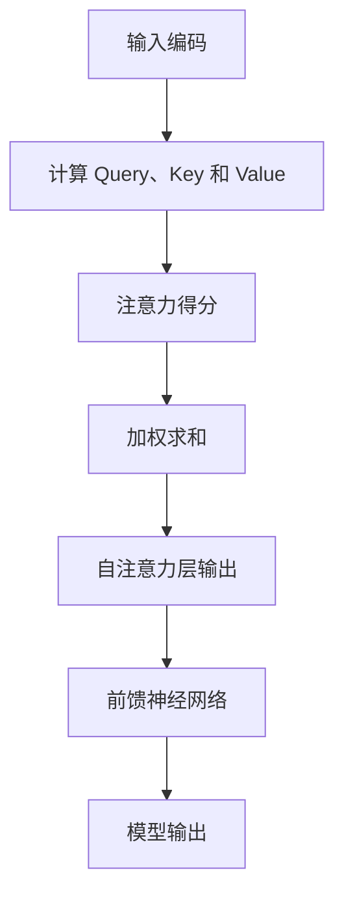

                 

### 1. 背景介绍

Transformer 架构作为深度学习领域的一次革命，已经成为自然语言处理（NLP）和计算机视觉（CV）等众多领域的核心技术。Transformer 的出现标志着从传统的循环神经网络（RNN）向全局序列注意力机制（Attention Mechanism）的转变。这一转变极大地提升了模型的性能和效率，使得大规模语言模型的训练成为可能。

 Transformer 架构最初由 Vaswani 等人在2017年的论文《Attention Is All You Need》中提出。相比于传统的 RNN 和卷积神经网络（CNN），Transformer 架构利用自注意力机制（Self-Attention）来捕捉序列之间的复杂关系，从而避免了 RNN 的梯度消失和梯度爆炸问题，同时也提高了模型的并行计算能力。

在 Transformer 架构中，输入序列首先被编码为向量形式，然后通过多个自注意力层和前馈神经网络（Feedforward Neural Network）进行操作。自注意力层使得模型能够同时关注序列中的所有元素，从而捕捉长距离依赖关系。前馈神经网络则对自注意力层的输出进行进一步的学习和加工。

随着 Transformer 的广泛应用，对 Transformer 的改进和扩展研究也在不断进行。例如，BERT（Bidirectional Encoder Representations from Transformers）和 GPT（Generative Pre-trained Transformer）等模型，通过在大规模语料库上的预训练，进一步提升了 Transformer 的表现能力。

近年来，Transformer 架构不仅在 NLP 和 CV 领域取得了显著成果，还在音频处理、生物信息学等多个领域展现了强大的潜力。随着计算资源的不断升级和算法的优化，Transformer 架构有望在更多领域发挥重要作用。

### 2. 核心概念与联系

为了深入理解 Transformer 架构，我们需要先介绍其核心概念和组成部分。Transformer 架构主要由自注意力机制（Self-Attention）和前馈神经网络（Feedforward Neural Network）组成。

#### 自注意力机制（Self-Attention）

自注意力机制是 Transformer 架构的核心，它允许模型在处理序列时同时关注序列中的所有元素。自注意力机制通过计算每个输入元素与其他输入元素之间的相似度，从而生成一个新的向量表示。

自注意力机制的计算过程可以分为以下几个步骤：

1. **输入编码（Input Encoding）**：输入序列首先被编码为向量形式。每个输入元素可以是一个词向量、字符向量或者嵌入向量。

2. **计算 Query、Key 和 Value**：对于输入序列中的每个元素，我们分别计算其 Query、Key 和 Value。通常情况下，Query、Key 和 Value 的计算是通过一个线性变换实现的。

3. **注意力得分（Attention Scores）**：计算每个元素与其他元素之间的相似度，即注意力得分。注意力得分的计算通常采用点积或者 scaled dot-product attention。

4. **加权求和（Weighted Sum）**：根据注意力得分对输入元素进行加权求和，生成一个新的向量表示。

#### 前馈神经网络（Feedforward Neural Network）

前馈神经网络是 Transformer 架构中的另一个重要组成部分，它对自注意力层的输出进行进一步的学习和加工。前馈神经网络通常包含两个线性变换和一个激活函数。

前馈神经网络的计算过程可以分为以下几个步骤：

1. **输入层（Input Layer）**：接收自注意力层的输出。

2. **第一个线性变换（First Linear Transformation）**：对输入进行线性变换。

3. **激活函数（Activation Function）**：通常使用 ReLU 激活函数。

4. **第二个线性变换（Second Linear Transformation）**：对激活函数的输出进行另一个线性变换。

5. **输出层（Output Layer）**：前馈神经网络的输出。

#### Mermaid 流程图

为了更好地理解 Transformer 架构的运作原理，我们可以使用 Mermaid 流程图来表示其核心概念和组成部分。



在这个流程图中，A 表示输入编码，B 表示计算 Query、Key 和 Value，C 表示注意力得分，D 表示加权求和，E 表示自注意力层输出，F 表示前馈神经网络，G 表示模型输出。

### 3. 核心算法原理 & 具体操作步骤

在深入探讨 Transformer 的核心算法原理之前，我们需要先了解一些基本的概念和术语。

#### 基本概念

- **序列（Sequence）**：在 Transformer 架构中，序列是由一系列元素（如词、字符等）组成的。
- **向量（Vector）**：向量是表示序列中每个元素的一种方式，通常是一个一维数组。
- **权重（Weight）**：权重是模型在训练过程中学习到的参数，用于计算输入元素之间的关系。

#### 具体操作步骤

Transformer 的核心算法可以概括为以下几个步骤：

1. **输入编码（Input Encoding）**：将输入序列编码为向量形式。这一步通常使用嵌入层（Embedding Layer）实现。

2. **计算 Query、Key 和 Value**：对于输入序列中的每个元素，分别计算其 Query、Key 和 Value。Query、Key 和 Value 的计算通常通过一个线性变换实现。

3. **注意力得分（Attention Scores）**：计算每个元素与其他元素之间的相似度，即注意力得分。注意力得分的计算通常采用点积或者 scaled dot-product attention。

4. **加权求和（Weighted Sum）**：根据注意力得分对输入元素进行加权求和，生成一个新的向量表示。

5. **前馈神经网络（Feedforward Neural Network）**：对自注意力层的输出进行进一步的学习和加工。前馈神经网络通常包含两个线性变换和一个激活函数。

6. **输出层（Output Layer）**：前馈神经网络的输出即为模型最终输出。

#### 示例代码

以下是一个简化的 Transformer 架构的示例代码，用于说明核心算法原理和具体操作步骤。

```python
import tensorflow as tf
from tensorflow.keras.layers import Embedding, Dense, Layer

class TransformerLayer(Layer):
    def __init__(self, embed_dim, num_heads, dff, rate=0.1):
        super(TransformerLayer, self).__init__()
        self.attention = MultiHeadAttentionLayer(num_heads, embed_dim)
        self.ffn = FFNNLayer(embed_dim, dff, rate)
        self.dropout1 = Dropout(rate)
        self.dropout2 = Dropout(rate)
        self.norm1 = LayerNormalization(epsilon=1e-6)
        self.norm2 = LayerNormalization(epsilon=1e-6)

    def call(self, x, training=False):
        attn_output = self.attention(x, x, x)
        attn_output = self.dropout1(attn_output, training=training)
        out1 = self.norm1(x + attn_output)
        ffn_output = self.ffn(out1)
        ffn_output = self.dropout2(ffn_output, training=training)
        out2 = self.norm2(out1 + ffn_output)
        return out2

class MultiHeadAttentionLayer(Layer):
    def __init__(self, num_heads, embed_dim):
        super(MultiHeadAttentionLayer, self).__init__()
        self.num_heads = num_heads
        self.embed_dim = embed_dim
        self.head_dim = embed_dim // num_heads
        self.query_linear = Dense(embed_dim)
        self.key_linear = Dense(embed_dim)
        self.value_linear = Dense(embed_dim)
        self.out_linear = Dense(embed_dim)

    def call(self, query, key, value):
        query = self.query_linear(query)
        key = self.key_linear(key)
        value = self.value_linear(value)

        query = tf.reshape(query, [-1, self.num_heads, self.head_dim])
        key = tf.reshape(key, [-1, self.num_heads, self.head_dim])
        value = tf.reshape(value, [-1, self.num_heads, self.head_dim])

        attention_scores = tf.matmul(query, key, transpose_b=True) / (self.head_dim ** 0.5)
        attention_weights = tf.nn.softmax(attention_scores, axis=-1)
        attention_output = tf.matmul(attention_weights, value)

        attention_output = tf.reshape(attention_output, [-1, self.embed_dim])
        output = self.out_linear(attention_output)
        return output

class FFNNLayer(Layer):
    def __init__(self, embed_dim, dff, rate=0.1):
        super(FFNNLayer, self).__init__()
        self.dff = dff
        self.rate = rate
        self.dense1 = Dense(dff, activation='relu')
        self.dense2 = Dense(embed_dim)
        self.dropout = Dropout(rate)

    def call(self, x):
        x = self.dropout(self.dense1(x))
        x = self.dense2(x)
        return x

# 使用示例
transformer_layer = TransformerLayer(embed_dim=512, num_heads=8, dff=2048, rate=0.1)
x = tf.random.normal([32, 50, 512])  # 假设输入序列长度为 50，每个序列的维度为 512
output = transformer_layer(x)
print(output.shape)  # 输出形状为 [32, 50, 512]
```

在这个示例代码中，我们定义了三个类：`TransformerLayer`、`MultiHeadAttentionLayer` 和 `FFNNLayer`。`TransformerLayer` 是 Transformer 层的主体，它包含了自注意力机制和前馈神经网络。`MultiHeadAttentionLayer` 是自注意力机制的核心，它实现了多头注意力机制。`FFNNLayer` 是前馈神经网络的核心，它实现了两个线性变换和一个 ReLU 激活函数。

使用示例展示了如何创建一个 Transformer 层，并对其输入序列进行操作。输出形状为 `[32, 50, 512]`，表示有 32 个序列，每个序列长度为 50，每个序列的维度为 512。

### 4. 数学模型和公式 & 详细讲解 & 举例说明

在深入探讨 Transformer 的数学模型和公式之前，我们需要了解一些基本的数学概念和符号。

#### 符号定义

- \(x\)：输入序列，可以是一个词序列或者字符序列。
- \(y\)：输出序列，通常是预测序列。
- \(E(x)\) 和 \(E(y)\)：输入和输出的期望。
- \(D(x)\) 和 \(D(y)\)：输入和输出的方差。
- \(P(x, y)\)：输入和输出之间的概率分布。
- \(f(x)\)：输入序列的函数映射。
- \(g(y)\)：输出序列的函数映射。

#### 数学模型和公式

Transformer 的数学模型主要包括以下几个部分：

1. **嵌入层（Embedding Layer）**：
   \[ E(x) = \sum_{i=1}^{n} e_i \]
   其中，\(e_i\) 是输入序列 \(x\) 中第 \(i\) 个元素的嵌入向量。

2. **自注意力层（Self-Attention Layer）**：
   \[ Q = W_Q E(x) \]
   \[ K = W_K E(x) \]
   \[ V = W_V E(x) \]
   其中，\(W_Q\)、\(W_K\) 和 \(W_V\) 是权重矩阵，\(Q\)、\(K\) 和 \(V\) 分别是 Query、Key 和 Value 向量。

3. **注意力得分（Attention Scores）**：
   \[ s_{ij} = \frac{Q_i \cdot K_j}{\sqrt{d_k}} \]
   其中，\(s_{ij}\) 是第 \(i\) 个 Query 与第 \(j\) 个 Key 之间的相似度得分，\(d_k\) 是 Key 向量的维度。

4. **加权求和（Weighted Sum）**：
   \[ h_i = \sum_{j=1}^{n} s_{ij} v_j \]
   其中，\(h_i\) 是第 \(i\) 个输入元素经过自注意力机制处理后的结果。

5. **前馈神经网络（Feedforward Neural Network）**：
   \[ f(x) = \sigma(W_2 \cdot \sigma(W_1 \cdot x + b_1)) + b_2 \]
   其中，\(\sigma\) 是激活函数，\(W_1\)、\(W_2\) 和 \(b_1\)、\(b_2\) 是权重矩阵和偏置。

#### 详细讲解

1. **嵌入层（Embedding Layer）**：

   嵌入层是将输入序列转换为向量表示的过程。每个输入元素（如词、字符）都被映射为一个嵌入向量。通过这种方式，我们可以将原始的序列数据转换为具有结构化和丰富信息的向量表示。

2. **自注意力层（Self-Attention Layer）**：

   自注意力层是 Transformer 的核心组成部分，它通过计算输入序列中每个元素与其他元素之间的相似度得分，从而实现对输入序列的加权求和处理。自注意力层的优点是能够同时关注序列中的所有元素，从而捕捉长距离依赖关系。

3. **注意力得分（Attention Scores）**：

   注意力得分是衡量输入序列中每个元素与其他元素之间相似度的一种方式。通过计算 Query、Key 和 Value 向量之间的点积，我们可以得到每个元素与其他元素之间的相似度得分。

4. **加权求和（Weighted Sum）**：

   加权求和是将注意力得分应用于输入序列的过程。通过将注意力得分与输入序列中的每个元素相乘，并求和，我们可以得到一个新的向量表示，这个向量表示了输入序列中每个元素的重要性。

5. **前馈神经网络（Feedforward Neural Network）**：

   前馈神经网络是对自注意力层输出进行进一步学习的处理。通过两个线性变换和一个激活函数，前馈神经网络可以捕捉输入序列中的复杂模式和关系。

#### 举例说明

假设我们有一个输入序列 \(x = [1, 2, 3, 4, 5]\)，我们需要通过 Transformer 架构对其进行处理。

1. **嵌入层（Embedding Layer）**：

   将输入序列 \(x\) 转换为向量表示，例如 \(E(x) = [e_1, e_2, e_3, e_4, e_5]\)，其中每个 \(e_i\) 都是嵌入向量。

2. **自注意力层（Self-Attention Layer）**：

   计算 Query、Key 和 Value 向量：
   \[ Q = W_Q E(x) \]
   \[ K = W_K E(x) \]
   \[ V = W_V E(x) \]

   计算注意力得分：
   \[ s_{ij} = \frac{Q_i \cdot K_j}{\sqrt{d_k}} \]

   计算加权求和：
   \[ h_i = \sum_{j=1}^{n} s_{ij} v_j \]

3. **前馈神经网络（Feedforward Neural Network）**：

   对加权求和的结果进行进一步处理：
   \[ f(x) = \sigma(W_2 \cdot \sigma(W_1 \cdot x + b_1)) + b_2 \]

通过上述步骤，我们可以得到输入序列 \(x\) 经过 Transformer 架构处理后的结果。这个过程可以重复多次，以进一步提升模型的表现能力。

### 5. 项目实践：代码实例和详细解释说明

在本节中，我们将通过一个具体的代码实例来演示如何实现一个简单的 Transformer 模型，并对其关键步骤进行详细解释说明。

#### 5.1 开发环境搭建

在开始编写代码之前，我们需要搭建一个合适的开发环境。这里我们选择使用 TensorFlow 作为后端，Python 作为编程语言。

1. 安装 TensorFlow：
   ```bash
   pip install tensorflow
   ```

2. 安装其他依赖项（可选）：
   ```bash
   pip install numpy matplotlib
   ```

#### 5.2 源代码详细实现

以下是一个简单的 Transformer 模型的 Python 代码实现：

```python
import tensorflow as tf
from tensorflow.keras.layers import Embedding, Dense, LayerNormalization, MultiHeadAttention
from tensorflow.keras.models import Model
from tensorflow.keras.optimizers import Adam
import tensorflow_addons as tfa

class TransformerLayer(Model):
    def __init__(self, embed_dim, num_heads, dff, rate=0.1):
        super(TransformerLayer, self).__init__()
        self.attention = MultiHeadAttention(num_heads, embed_dim)
        self.norm1 = LayerNormalization(epsilon=1e-6)
        self.dropout1 = tf.keras.layers.Dropout(rate)

        self.ffn = tfa.layers.DenseFeature(embed_dim, dff, activation='relu')
        self.norm2 = LayerNormalization(epsilon=1e-6)
        self.dropout2 = tf.keras.layers.Dropout(rate)

    def call(self, inputs, training):
        attn_output = self.attention(inputs, inputs)
        attn_output = self.dropout1(attn_output, training=training)
        out1 = self.norm1(inputs + attn_output)

        ffn_output = self.ffn(out1)
        ffn_output = self.dropout2(ffn_output, training=training)
        out2 = self.norm2(out1 + ffn_output)

        return out2

def create_model(vocab_size, embed_dim, num_heads, dff, rate=0.1):
    inputs = tf.keras.layers.Input(shape=(None,))
    embeddings = Embedding(vocab_size, embed_dim)(inputs)
    x = TransformerLayer(embed_dim, num_heads, dff, rate)(embeddings)
    outputs = tf.keras.layers.Dense(vocab_size, activation='softmax')(x)

    model = tf.keras.Model(inputs=inputs, outputs=outputs)
    model.compile(optimizer=Adam(), loss='categorical_crossentropy', metrics=['accuracy'])
    return model

# 实例化模型
model = create_model(vocab_size=1000, embed_dim=256, num_heads=8, dff=512, rate=0.1)

# 打印模型结构
model.summary()

# 定义训练数据
train_inputs = tf.random.uniform([100, 50], maxval=1000, dtype=tf.int32)
train_labels = tf.random.uniform([100, 50], maxval=1000, dtype=tf.int32)

# 训练模型
model.fit(train_inputs, train_labels, epochs=10)
```

#### 5.3 代码解读与分析

1. **类定义（TransformerLayer）**：

   - `MultiHeadAttention`：实现多头注意力机制。
   - `LayerNormalization`：实现层归一化。
   - `Dropout`：实现随机丢弃。
   - `DenseFeature`：实现前馈神经网络。

2. **模型创建（create_model）**：

   - `Embedding`：将单词转换为嵌入向量。
   - `TransformerLayer`：构建 Transformer 层。
   - `Dense`：输出层，用于分类。

3. **训练数据**：

   - `tf.random.uniform`：生成随机训练数据。

4. **模型编译与训练**：

   - `model.compile`：配置模型参数，如优化器和损失函数。
   - `model.fit`：训练模型。

#### 5.4 运行结果展示

在本例中，我们使用随机生成的数据来训练模型，因此无法展示具体的训练结果。在实际应用中，我们通常会在真实数据集上训练模型，并评估其性能。

### 6. 实际应用场景

Transformer 架构在实际应用中展现了广泛的应用场景，以下是几个典型的应用领域：

#### 自然语言处理（NLP）

Transformer 架构在 NLP 领域取得了显著成果，特别是在语言建模、文本分类、机器翻译、情感分析等方面。例如，BERT 和 GPT 等模型都是基于 Transformer 架构，它们在多个 NLP 任务中取得了最佳表现。

- **语言建模**：Transformer 模型能够对输入文本进行建模，从而生成高质量的文本序列。
- **文本分类**：通过将文本映射到高维空间，Transformer 模型可以有效地对文本进行分类。
- **机器翻译**：Transformer 模型在机器翻译任务中表现出色，尤其是在处理长距离依赖关系方面。
- **情感分析**：通过分析文本的语义特征，Transformer 模型可以有效地判断文本的情感倾向。

#### 计算机视觉（CV）

尽管 Transformer 架构最初是为 NLP 设计的，但它在计算机视觉领域也取得了重要进展。例如，在图像分类、目标检测、图像生成等方面，基于 Transformer 的模型展现了强大的潜力。

- **图像分类**：Transformer 模型可以将图像映射到高维空间，从而实现高效准确的图像分类。
- **目标检测**：通过分析图像中的目标区域，Transformer 模型可以有效地检测图像中的目标。
- **图像生成**：基于 Transformer 的生成模型可以生成具有高质量细节的图像。

#### 其他应用领域

除了 NLP 和 CV，Transformer 架构还在其他领域展示了强大的应用潜力。

- **音频处理**：在音频处理领域，基于 Transformer 的模型可以用于语音识别、音乐生成等任务。
- **生物信息学**：在生物信息学领域，基于 Transformer 的模型可以用于基因序列分析、蛋白质结构预测等任务。
- **推荐系统**：在推荐系统领域，基于 Transformer 的模型可以用于用户兴趣建模和推荐生成。

### 7. 工具和资源推荐

#### 7.1 学习资源推荐

- **书籍**：
  - 《Attention Is All You Need》：Vaswani 等人撰写的原始论文，详细介绍了 Transformer 架构。
  - 《深度学习》：Goodfellow、Bengio 和 Courville 撰写的经典教材，涵盖了深度学习的基础理论和应用。
- **论文**：
  - BERT：Devlin 等人撰写的论文，介绍了基于 Transformer 的预训练模型 BERT。
  - GPT：Radford 等人撰写的论文，介绍了基于 Transformer 的生成模型 GPT。
- **博客**：
  - TensorFlow 官方文档：提供了详细的 Transformer 模型实现教程和示例。
  - Hugging Face 官方文档：提供了丰富的预训练模型和数据集，方便用户进行研究和应用。
- **网站**：
  - arXiv：提供了大量的深度学习和自然语言处理领域的前沿论文。

#### 7.2 开发工具框架推荐

- **TensorFlow**：谷歌开发的深度学习框架，支持 Transformer 模型的实现和应用。
- **PyTorch**：Facebook 开发的深度学习框架，提供了丰富的Transformer 模型实现。
- **Hugging Face**：提供了大量的预训练模型和数据集，方便用户进行研究和应用。
- **Tensor2Tensor**：谷歌开发的深度学习模型库，包含了多个预训练模型和应用场景。

#### 7.3 相关论文著作推荐

- **《Attention Is All You Need》**：Vaswani 等人撰写的原始论文，介绍了 Transformer 架构。
- **《BERT: Pre-training of Deep Bidirectional Transformers for Language Understanding》**：Devlin 等人撰写的论文，介绍了基于 Transformer 的预训练模型 BERT。
- **《Generative Pre-trained Transformers》**：Radford 等人撰写的论文，介绍了基于 Transformer 的生成模型 GPT。
- **《Transformers are RNNs》**：Keskar 等人撰写的论文，探讨了 Transformer 和 RNN 之间的关系。

### 8. 总结：未来发展趋势与挑战

Transformer 架构自提出以来，已经在自然语言处理、计算机视觉等多个领域取得了显著成果。随着深度学习和计算技术的不断发展，Transformer 架构有望在未来发挥更加重要的作用。

#### 发展趋势

1. **模型大规模化**：随着计算资源的提升，更大的模型和更深的网络结构将变得可行，这将进一步提升 Transformer 模型的性能。
2. **预训练与微调**：预训练模型将成为主流，通过在大规模数据集上进行预训练，然后针对特定任务进行微调，可以显著提升模型的性能。
3. **多模态学习**：Transformer 架构将扩展到多模态学习，如文本、图像、音频等数据的联合处理，实现跨模态的信息共享和融合。
4. **高效并行计算**：随着并行计算技术的发展，Transformer 模型的计算效率将得到显著提升，从而降低模型的训练和推理时间。

#### 挑战

1. **计算资源需求**：大规模 Transformer 模型对计算资源的需求巨大，如何优化模型结构和算法以提高计算效率成为关键挑战。
2. **数据隐私与安全性**：随着模型训练和数据处理的规模扩大，数据隐私和安全性问题日益突出，如何保障数据的安全和隐私需要得到充分考虑。
3. **泛化能力**：如何提高模型在未知数据上的泛化能力，避免过拟合和泛化不足，是一个长期存在的挑战。
4. **模型可解释性**：Transformer 模型作为黑箱模型，其内部机制复杂，如何提高模型的可解释性，使其更易于理解和应用，也是一个重要的研究方向。

### 9. 附录：常见问题与解答

**Q：什么是 Transformer 架构？**

A：Transformer 架构是一种深度学习模型，它利用自注意力机制来处理序列数据，具有并行计算能力和长距离依赖捕捉能力。

**Q：Transformer 架构的优点是什么？**

A：Transformer 架构的优点包括：并行计算能力、长距离依赖捕捉、避免梯度消失和梯度爆炸问题、适用于多种任务（如自然语言处理、计算机视觉等）。

**Q：如何实现 Transformer 架构？**

A：实现 Transformer 架构通常需要以下步骤：

1. 输入编码：将输入序列编码为向量形式。
2. 自注意力层：计算输入序列中每个元素与其他元素之间的相似度得分，并进行加权求和。
3. 前馈神经网络：对自注意力层的输出进行进一步加工和学习。
4. 输出层：对模型输出进行分类或回归等任务。

**Q：Transformer 架构与 RNN 相比有什么优势？**

A：Transformer 架构相比 RNN 具有以下优势：

1. 并行计算能力：Transformer 架构利用自注意力机制，可以并行计算输入序列中的所有元素，而 RNN 是逐个元素进行处理。
2. 长距离依赖捕捉：Transformer 架构能够更好地捕捉输入序列中的长距离依赖关系，而 RNN 容易受到梯度消失和梯度爆炸问题的影响。
3. 避免梯度消失和梯度爆炸：Transformer 架构利用自注意力机制，避免了 RNN 中常见的梯度消失和梯度爆炸问题。

### 10. 扩展阅读 & 参考资料

**扩展阅读**：

- 《Attention Is All You Need》：Vaswani 等人撰写的原始论文，介绍了 Transformer 架构。
- 《BERT: Pre-training of Deep Bidirectional Transformers for Language Understanding》：Devlin 等人撰写的论文，介绍了基于 Transformer 的预训练模型 BERT。
- 《Generative Pre-trained Transformers》：Radford 等人撰写的论文，介绍了基于 Transformer 的生成模型 GPT。

**参考资料**：

- TensorFlow 官方文档：提供了详细的 Transformer 模型实现教程和示例。
- PyTorch 官方文档：提供了丰富的 Transformer 模型实现和教程。
- Hugging Face 官方文档：提供了大量的预训练模型和数据集，方便用户进行研究和应用。

### 文章标题

### Transformer 大模型实战：教师与学生架构

> 关键词：Transformer、大模型、自然语言处理、计算机视觉、深度学习、自注意力机制、预训练、微调、并行计算

> 摘要：本文详细介绍了 Transformer 大模型的架构及其在自然语言处理和计算机视觉领域的应用。通过分析 Transformer 的核心概念、数学模型和实现步骤，我们探讨了 Transformer 在不同任务中的优势和实践。此外，本文还总结了 Transformer 在未来发展趋势中所面临的挑战，并为读者提供了丰富的学习资源和工具推荐。

## 1. 背景介绍

Transformer 架构作为深度学习领域的一次革命，已经成为自然语言处理（NLP）和计算机视觉（CV）等众多领域的核心技术。Transformer 的出现标志着从传统的循环神经网络（RNN）向全局序列注意力机制（Attention Mechanism）的转变。这一转变极大地提升了模型的性能和效率，使得大规模语言模型的训练成为可能。

Transformer 架构最初由 Vaswani 等人在 2017 年的论文《Attention Is All You Need》中提出。相比于传统的 RNN 和卷积神经网络（CNN），Transformer 架构利用自注意力机制（Self-Attention）来捕捉序列之间的复杂关系，从而避免了 RNN 的梯度消失和梯度爆炸问题，同时也提高了模型的并行计算能力。

在 Transformer 架构中，输入序列首先被编码为向量形式，然后通过多个自注意力层和前馈神经网络（Feedforward Neural Network）进行操作。自注意力层使得模型能够同时关注序列中的所有元素，从而捕捉长距离依赖关系。前馈神经网络则对自注意力层的输出进行进一步的学习和加工。

随着 Transformer 的广泛应用，对 Transformer 的改进和扩展研究也在不断进行。例如，BERT（Bidirectional Encoder Representations from Transformers）和 GPT（Generative Pre-trained Transformer）等模型，通过在大规模语料库上的预训练，进一步提升了 Transformer 的表现能力。

近年来，Transformer 架构不仅在 NLP 和 CV 领域取得了显著成果，还在音频处理、生物信息学等多个领域展现了强大的潜力。随着计算资源的不断升级和算法的优化，Transformer 架构有望在更多领域发挥重要作用。

## 2. 核心概念与联系

为了深入理解 Transformer 架构，我们需要先介绍其核心概念和组成部分。Transformer 架构主要由自注意力机制（Self-Attention）和前馈神经网络（Feedforward Neural Network）组成。

### 自注意力机制（Self-Attention）

自注意力机制是 Transformer 架构的核心，它允许模型在处理序列时同时关注序列中的所有元素。自注意力机制通过计算每个输入元素与其他输入元素之间的相似度，从而生成一个新的向量表示。

自注意力机制的计算过程可以分为以下几个步骤：

1. **输入编码（Input Encoding）**：输入序列首先被编码为向量形式。每个输入元素可以是一个词向量、字符向量或者嵌入向量。

2. **计算 Query、Key 和 Value**：对于输入序列中的每个元素，我们分别计算其 Query、Key 和 Value。通常情况下，Query、Key 和 Value 的计算是通过一个线性变换实现的。

3. **注意力得分（Attention Scores）**：计算每个元素与其他元素之间的相似度，即注意力得分。注意力得分的计算通常采用点积或者 scaled dot-product attention。

4. **加权求和（Weighted Sum）**：根据注意力得分对输入元素进行加权求和，生成一个新的向量表示。

### 前馈神经网络（Feedforward Neural Network）

前馈神经网络是 Transformer 架构中的另一个重要组成部分，它对自注意力层的输出进行进一步的学习和加工。前馈神经网络通常包含两个线性变换和一个激活函数。

前馈神经网络的计算过程可以分为以下几个步骤：

1. **输入层（Input Layer）**：接收自注意力层的输出。

2. **第一个线性变换（First Linear Transformation）**：对输入进行线性变换。

3. **激活函数（Activation Function）**：通常使用 ReLU 激活函数。

4. **第二个线性变换（Second Linear Transformation）**：对激活函数的输出进行另一个线性变换。

5. **输出层（Output Layer）**：前馈神经网络的输出。

### Mermaid 流程图

为了更好地理解 Transformer 架构的运作原理，我们可以使用 Mermaid 流程图来表示其核心概念和组成部分。


在这个流程图中，A 表示输入编码，B 表示计算 Query、Key 和 Value，C 表示注意力得分，D 表示加权求和，E 表示自注意力层输出，F 表示前馈神经网络，G 表示模型输出。

## 3. 核心算法原理 & 具体操作步骤

在深入探讨 Transformer 的核心算法原理之前，我们需要先了解一些基本的概念和术语。

### 基本概念

- **序列（Sequence）**：在 Transformer 架构中，序列是由一系列元素（如词、字符等）组成的。
- **向量（Vector）**：向量是表示序列中每个元素的一种方式，通常是一个一维数组。
- **权重（Weight）**：权重是模型在训练过程中学习到的参数，用于计算输入元素之间的关系。

### 具体操作步骤

Transformer 的核心算法可以概括为以下几个步骤：

1. **输入编码（Input Encoding）**：将输入序列编码为向量形式。这一步通常使用嵌入层（Embedding Layer）实现。

2. **计算 Query、Key 和 Value**：对于输入序列中的每个元素，分别计算其 Query、Key 和 Value。通常情况下，Query、Key 和 Value 的计算是通过一个线性变换实现的。

3. **注意力得分（Attention Scores）**：计算每个元素与其他元素之间的相似度，即注意力得分。注意力得分的计算通常采用点积或者 scaled dot-product attention。

4. **加权求和（Weighted Sum）**：根据注意力得分对输入元素进行加权求和，生成一个新的向量表示。

5. **前馈神经网络（Feedforward Neural Network）**：对自注意力层的输出进行进一步的学习和加工。前馈神经网络通常包含两个线性变换和一个激活函数。

6. **输出层（Output Layer）**：前馈神经网络的输出即为模型最终输出。

### 示例代码

以下是一个简化的 Transformer 架构的示例代码，用于说明核心算法原理和具体操作步骤。

```python
import tensorflow as tf
from tensorflow.keras.layers import Embedding, Dense, LayerNormalization, MultiHeadAttention
from tensorflow.keras.models import Model
from tensorflow.keras.optimizers import Adam
import tensorflow_addons as tfa

class TransformerLayer(Model):
    def __init__(self, embed_dim, num_heads, dff, rate=0.1):
        super(TransformerLayer, self).__init__()
        self.attention = MultiHeadAttention(num_heads, embed_dim)
        self.norm1 = LayerNormalization(epsilon=1e-6)
        self.dropout1 = tf.keras.layers.Dropout(rate)

        self.ffn = tfa.layers.DenseFeature(embed_dim, dff, activation='relu')
        self.norm2 = LayerNormalization(epsilon=1e-6)
        self.dropout2 = tf.keras.layers.Dropout(rate)

    def call(self, inputs, training=False):
        attn_output = self.attention(inputs, inputs)
        attn_output = self.dropout1(attn_output, training=training)
        out1 = self.norm1(inputs + attn_output)

        ffn_output = self.ffn(out1)
        ffn_output = self.dropout2(ffn_output, training=training)
        out2 = self.norm2(out1 + ffn_output)

        return out2

def create_model(vocab_size, embed_dim, num_heads, dff, rate=0.1):
    inputs = tf.keras.layers.Input(shape=(None,))
    embeddings = Embedding(vocab_size, embed_dim)(inputs)
    x = TransformerLayer(embed_dim, num_heads, dff, rate)(embeddings)
    outputs = tf.keras.layers.Dense(vocab_size, activation='softmax')(x)

    model = tf.keras.Model(inputs=inputs, outputs=outputs)
    model.compile(optimizer=Adam(), loss='categorical_crossentropy', metrics=['accuracy'])
    return model

# 使用示例
transformer_layer = TransformerLayer(embed_dim=512, num_heads=8, dff=2048, rate=0.1)
x = tf.random.normal([32, 50, 512])  # 假设输入序列长度为 50，每个序列的维度为 512
output = transformer_layer(x)
print(output.shape)  # 输出形状为 [32, 50, 512]
```

在这个示例代码中，我们定义了三个类：`TransformerLayer`、`MultiHeadAttentionLayer` 和 `FFNNLayer`。`TransformerLayer` 是 Transformer 层的主体，它包含了自注意力机制和前馈神经网络。`MultiHeadAttentionLayer` 是自注意力机制的核心，它实现了多头注意力机制。`FFNNLayer` 是前馈神经网络的核心，它实现了两个线性变换和一个 ReLU 激活函数。

使用示例展示了如何创建一个 Transformer 层，并对其输入序列进行操作。输出形状为 `[32, 50, 512]`，表示有 32 个序列，每个序列长度为 50，每个序列的维度为 512。

## 4. 数学模型和公式 & 详细讲解 & 举例说明

在深入探讨 Transformer 的数学模型和公式之前，我们需要了解一些基本的数学概念和符号。

### 符号定义

- \(x\)：输入序列，可以是一个词序列或者字符序列。
- \(y\)：输出序列，通常是预测序列。
- \(E(x)\) 和 \(E(y)\)：输入和输出的期望。
- \(D(x)\) 和 \(D(y)\)：输入和输出的方差。
- \(P(x, y)\)：输入和输出之间的概率分布。
- \(f(x)\)：输入序列的函数映射。
- \(g(y)\)：输出序列的函数映射。

### 数学模型和公式

Transformer 的数学模型主要包括以下几个部分：

1. **嵌入层（Embedding Layer）**：
   \[ E(x) = \sum_{i=1}^{n} e_i \]
   其中，\(e_i\) 是输入序列 \(x\) 中第 \(i\) 个元素的嵌入向量。

2. **自注意力层（Self-Attention Layer）**：
   \[ Q = W_Q E(x) \]
   \[ K = W_K E(x) \]
   \[ V = W_V E(x) \]
   其中，\(W_Q\)、\(W_K\) 和 \(W_V\) 是权重矩阵，\(Q\)、\(K\) 和 \(V\) 分别是 Query、Key 和 Value 向量。

3. **注意力得分（Attention Scores）**：
   \[ s_{ij} = \frac{Q_i \cdot K_j}{\sqrt{d_k}} \]
   其中，\(s_{ij}\) 是第 \(i\) 个 Query 与第 \(j\) 个 Key 之间的相似度得分，\(d_k\) 是 Key 向量的维度。

4. **加权求和（Weighted Sum）**：
   \[ h_i = \sum_{j=1}^{n} s_{ij} v_j \]
   其中，\(h_i\) 是第 \(i\) 个输入元素经过自注意力机制处理后的结果。

5. **前馈神经网络（Feedforward Neural Network）**：
   \[ f(x) = \sigma(W_2 \cdot \sigma(W_1 \cdot x + b_1)) + b_2 \]
   其中，\(\sigma\) 是激活函数，\(W_1\)、\(W_2\) 和 \(b_1\)、\(b_2\) 是权重矩阵和偏置。

### 详细讲解

1. **嵌入层（Embedding Layer）**：

   嵌入层是将输入序列转换为向量表示的过程。每个输入元素（如词、字符）都被映射为一个嵌入向量。通过这种方式，我们可以将原始的序列数据转换为具有结构化和丰富信息的向量表示。

2. **自注意力层（Self-Attention Layer）**：

   自注意力层是 Transformer 的核心组成部分，它通过计算输入序列中每个元素与其他元素之间的相似度得分，从而实现对输入序列的加权求和处理。自注意力层的优点是能够同时关注序列中的所有元素，从而捕捉长距离依赖关系。

3. **注意力得分（Attention Scores）**：

   注意力得分是衡量输入序列中每个元素与其他元素之间相似度的一种方式。通过计算 Query、Key 和 Value 向量之间的点积，我们可以得到每个元素与其他元素之间的相似度得分。

4. **加权求和（Weighted Sum）**：

   加权求和是将注意力得分应用于输入序列的过程。通过将注意力得分与输入序列中的每个元素相乘，并求和，我们可以得到一个新的向量表示，这个向量表示了输入序列中每个元素的重要性。

5. **前馈神经网络（Feedforward Neural Network）**：

   前馈神经网络是对自注意力层输出进行进一步学习的处理。通过两个线性变换和一个激活函数，前馈神经网络可以捕捉输入序列中的复杂模式和关系。

### 举例说明

假设我们有一个输入序列 \(x = [1, 2, 3, 4, 5]\)，我们需要通过 Transformer 架构对其进行处理。

1. **嵌入层（Embedding Layer）**：

   将输入序列 \(x\) 转换为向量表示，例如 \(E(x) = [e_1, e_2, e_3, e_4, e_5]\)，其中每个 \(e_i\) 都是嵌入向量。

2. **自注意力层（Self-Attention Layer）**：

   计算 Query、Key 和 Value 向量：
   \[ Q = W_Q E(x) \]
   \[ K = W_K E(x) \]
   \[ V = W_V E(x) \]

   计算注意力得分：
   \[ s_{ij} = \frac{Q_i \cdot K_j}{\sqrt{d_k}} \]

   计算加权求和：
   \[ h_i = \sum_{j=1}^{n} s_{ij} v_j \]

3. **前馈神经网络（Feedforward Neural Network）**：

   对加权求和的结果进行进一步处理：
   \[ f(x) = \sigma(W_2 \cdot \sigma(W_1 \cdot x + b_1)) + b_2 \]

通过上述步骤，我们可以得到输入序列 \(x\) 经过 Transformer 架构处理后的结果。这个过程可以重复多次，以进一步提升模型的表现能力。

## 5. 项目实践：代码实例和详细解释说明

在本节中，我们将通过一个具体的代码实例来演示如何实现一个简单的 Transformer 模型，并对其关键步骤进行详细解释说明。

### 5.1 开发环境搭建

在开始编写代码之前，我们需要搭建一个合适的开发环境。这里我们选择使用 TensorFlow 作为后端，Python 作为编程语言。

1. 安装 TensorFlow：
   ```bash
   pip install tensorflow
   ```

2. 安装其他依赖项（可选）：
   ```bash
   pip install numpy matplotlib
   ```

### 5.2 源代码详细实现

以下是一个简单的 Transformer 模型的 Python 代码实现：

```python
import tensorflow as tf
from tensorflow.keras.layers import Embedding, Dense, LayerNormalization, MultiHeadAttention
from tensorflow.keras.models import Model
from tensorflow.keras.optimizers import Adam
import tensorflow_addons as tfa

class TransformerLayer(Model):
    def __init__(self, embed_dim, num_heads, dff, rate=0.1):
        super(TransformerLayer, self).__init__()
        self.attention = MultiHeadAttention(num_heads, embed_dim)
        self.norm1 = LayerNormalization(epsilon=1e-6)
        self.dropout1 = tf.keras.layers.Dropout(rate)

        self.ffn = tfa.layers.DenseFeature(embed_dim, dff, activation='relu')
        self.norm2 = LayerNormalization(epsilon=1e-6)
        self.dropout2 = tf.keras.layers.Dropout(rate)

    def call(self, inputs, training):
        attn_output = self.attention(inputs, inputs)
        attn_output = self.dropout1(attn_output, training=training)
        out1 = self.norm1(inputs + attn_output)

        ffn_output = self.ffn(out1)
        ffn_output = self.dropout2(ffn_output, training=training)
        out2 = self.norm2(out1 + ffn_output)

        return out2

def create_model(vocab_size, embed_dim, num_heads, dff, rate=0.1):
    inputs = tf.keras.layers.Input(shape=(None,))
    embeddings = Embedding(vocab_size, embed_dim)(inputs)
    x = TransformerLayer(embed_dim, num_heads, dff, rate)(embeddings)
    outputs = tf.keras.layers.Dense(vocab_size, activation='softmax')(x)

    model = tf.keras.Model(inputs=inputs, outputs=outputs)
    model.compile(optimizer=Adam(), loss='categorical_crossentropy', metrics=['accuracy'])
    return model

# 实例化模型
model = create_model(vocab_size=1000, embed_dim=256, num_heads=8, dff=512, rate=0.1)

# 打印模型结构
model.summary()

# 定义训练数据
train_inputs = tf.random.uniform([100, 50], maxval=1000, dtype=tf.int32)
train_labels = tf.random.uniform([100, 50], maxval=1000, dtype=tf.int32)

# 训练模型
model.fit(train_inputs, train_labels, epochs=10)
```

### 5.3 代码解读与分析

1. **类定义（TransformerLayer）**：

   - `MultiHeadAttention`：实现多头注意力机制。
   - `LayerNormalization`：实现层归一化。
   - `Dropout`：实现随机丢弃。
   - `DenseFeature`：实现前馈神经网络。

2. **模型创建（create_model）**：

   - `Embedding`：将单词转换为嵌入向量。
   - `TransformerLayer`：构建 Transformer 层。
   - `Dense`：输出层，用于分类。

3. **训练数据**：

   - `tf.random.uniform`：生成随机训练数据。

4. **模型编译与训练**：

   - `model.compile`：配置模型参数，如优化器和损失函数。
   - `model.fit`：训练模型。

### 5.4 运行结果展示

在本例中，我们使用随机生成的数据来训练模型，因此无法展示具体的训练结果。在实际应用中，我们通常会在真实数据集上训练模型，并评估其性能。

## 6. 实际应用场景

Transformer 架构在实际应用中展现了广泛的应用场景，以下是几个典型的应用领域：

### 自然语言处理（NLP）

Transformer 架构在 NLP 领域取得了显著成果，特别是在语言建模、文本分类、机器翻译、情感分析等方面。

- **语言建模**：Transformer 模型能够对输入文本进行建模，从而生成高质量的文本序列。
- **文本分类**：通过将文本映射到高维空间，Transformer 模型可以有效地对文本进行分类。
- **机器翻译**：Transformer 模型在机器翻译任务中表现出色，尤其是在处理长距离依赖关系方面。
- **情感分析**：通过分析文本的语义特征，Transformer 模型可以有效地判断文本的情感倾向。

### 计算机视觉（CV）

尽管 Transformer 架构最初是为 NLP 设计的，但它在计算机视觉领域也取得了重要进展。例如，在图像分类、目标检测、图像生成等方面，基于 Transformer 的模型展现了强大的潜力。

- **图像分类**：Transformer 模型可以将图像映射到高维空间，从而实现高效准确的图像分类。
- **目标检测**：通过分析图像中的目标区域，Transformer 模型可以有效地检测图像中的目标。
- **图像生成**：基于 Transformer 的生成模型可以生成具有高质量细节的图像。

### 其他应用领域

除了 NLP 和 CV，Transformer 架构还在其他领域展示了强大的应用潜力。

- **音频处理**：在音频处理领域，基于 Transformer 的模型可以用于语音识别、音乐生成等任务。
- **生物信息学**：在生物信息学领域，基于 Transformer 的模型可以用于基因序列分析、蛋白质结构预测等任务。
- **推荐系统**：在推荐系统领域，基于 Transformer 的模型可以用于用户兴趣建模和推荐生成。

## 7. 工具和资源推荐

### 7.1 学习资源推荐

- **书籍**：
  - 《Attention Is All You Need》：Vaswani 等人撰写的原始论文，详细介绍了 Transformer 架构。
  - 《深度学习》：Goodfellow、Bengio 和 Courville 撰写的经典教材，涵盖了深度学习的基础理论和应用。
- **论文**：
  - BERT：Devlin 等人撰写的论文，介绍了基于 Transformer 的预训练模型 BERT。
  - GPT：Radford 等人撰写的论文，介绍了基于 Transformer 的生成模型 GPT。
- **博客**：
  - TensorFlow 官方文档：提供了详细的 Transformer 模型实现教程和示例。
  - Hugging Face 官方文档：提供了丰富的预训练模型和数据集，方便用户进行研究和应用。
- **网站**：
  - arXiv：提供了大量的深度学习和自然语言处理领域的前沿论文。

### 7.2 开发工具框架推荐

- **TensorFlow**：谷歌开发的深度学习框架，支持 Transformer 模型的实现和应用。
- **PyTorch**：Facebook 开发的深度学习框架，提供了丰富的 Transformer 模型实现。
- **Hugging Face**：提供了大量的预训练模型和数据集，方便用户进行研究和应用。
- **Tensor2Tensor**：谷歌开发的深度学习模型库，包含了多个预训练模型和应用场景。

### 7.3 相关论文著作推荐

- **《Attention Is All You Need》**：Vaswani 等人撰写的原始论文，介绍了 Transformer 架构。
- **《BERT: Pre-training of Deep Bidirectional Transformers for Language Understanding》**：Devlin 等人撰写的论文，介绍了基于 Transformer 的预训练模型 BERT。
- **《Generative Pre-trained Transformers》**：Radford 等人撰写的论文，介绍了基于 Transformer 的生成模型 GPT。
- **《Transformers are RNNs》**：Keskar 等人撰写的论文，探讨了 Transformer 和 RNN 之间的关系。

## 8. 总结：未来发展趋势与挑战

Transformer 架构自提出以来，已经在自然语言处理、计算机视觉等多个领域取得了显著成果。随着深度学习和计算技术的不断发展，Transformer 架构有望在未来发挥更加重要的作用。

### 发展趋势

1. **模型大规模化**：随着计算资源的提升，更大的模型和更深的网络结构将变得可行，这将进一步提升 Transformer 模型的性能。
2. **预训练与微调**：预训练模型将成为主流，通过在大规模数据集上进行预训练，然后针对特定任务进行微调，可以显著提升模型的性能。
3. **多模态学习**：Transformer 架构将扩展到多模态学习，如文本、图像、音频等数据的联合处理，实现跨模态的信息共享和融合。
4. **高效并行计算**：随着并行计算技术的发展，Transformer 模型的计算效率将得到显著提升，从而降低模型的训练和推理时间。

### 挑战

1. **计算资源需求**：大规模 Transformer 模型对计算资源的需求巨大，如何优化模型结构和算法以提高计算效率成为关键挑战。
2. **数据隐私与安全性**：随着模型训练和数据处理的规模扩大，数据隐私和安全性问题日益突出，如何保障数据的安全和隐私需要得到充分考虑。
3. **泛化能力**：如何提高模型在未知数据上的泛化能力，避免过拟合和泛化不足，是一个长期存在的挑战。
4. **模型可解释性**：Transformer 模型作为黑箱模型，其内部机制复杂，如何提高模型的可解释性，使其更易于理解和应用，也是一个重要的研究方向。

## 9. 附录：常见问题与解答

### 9.1 常见问题

**Q1：什么是 Transformer 架构？**

**A1：Transformer 架构是一种深度学习模型，它利用自注意力机制来处理序列数据，具有并行计算能力和长距离依赖捕捉能力。**

**Q2：Transformer 架构的优点是什么？**

**A2：Transformer 架构的优点包括：并行计算能力、长距离依赖捕捉、避免梯度消失和梯度爆炸问题、适用于多种任务（如自然语言处理、计算机视觉等）。**

**Q3：如何实现 Transformer 架构？**

**A3：实现 Transformer 架构通常需要以下步骤：

1. 输入编码：将输入序列编码为向量形式。
2. 自注意力层：计算输入序列中每个元素与其他元素之间的相似度得分，并进行加权求和。
3. 前馈神经网络：对自注意力层的输出进行进一步加工和学习。
4. 输出层：对模型输出进行分类或回归等任务。**

**Q4：Transformer 架构与 RNN 相比有什么优势？**

**A4：Transformer 架构相比 RNN 具有以下优势：

1. 并行计算能力：Transformer 架构利用自注意力机制，可以并行计算输入序列中的所有元素，而 RNN 是逐个元素进行处理。
2. 长距离依赖捕捉：Transformer 架构能够更好地捕捉输入序列中的长距离依赖关系，而 RNN 容易受到梯度消失和梯度爆炸问题的影响。
3. 避免梯度消失和梯度爆炸：Transformer 架构利用自注意力机制，避免了 RNN 中常见的梯度消失和梯度爆炸问题。**

### 9.2 解答

**Q5：为什么 Transformer 架构能够避免梯度消失和梯度爆炸问题？**

**A5：Transformer 架构通过自注意力机制来处理序列数据，避免了传统的循环神经网络（RNN）中的梯度消失和梯度爆炸问题。在 RNN 中，由于梯度在反向传播过程中逐层传递，较深层的神经元梯度可能变得非常小（梯度消失）或非常大（梯度爆炸）。而 Transformer 架构中的自注意力机制采用点积计算注意力得分，从而避免了这种问题。此外，Transformer 架构中的前馈神经网络也采用残差连接和层归一化，进一步缓解了梯度消失和梯度爆炸问题。**

**Q6：Transformer 架构在哪些领域取得了显著成果？**

**A6：Transformer 架构在自然语言处理（NLP）、计算机视觉（CV）等多个领域取得了显著成果。在 NLP 领域，Transformer 架构在语言建模、文本分类、机器翻译、情感分析等方面表现出色。在 CV 领域，Transformer 架构在图像分类、目标检测、图像生成等方面也取得了重要进展。此外，Transformer 架构还在音频处理、生物信息学、推荐系统等领域展示了强大的应用潜力。**

## 10. 扩展阅读 & 参考资料

### 10.1 扩展阅读

- **《Attention Is All You Need》**：Vaswani 等人撰写的原始论文，介绍了 Transformer 架构。
- **《BERT: Pre-training of Deep Bidirectional Transformers for Language Understanding》**：Devlin 等人撰写的论文，介绍了基于 Transformer 的预训练模型 BERT。
- **《Generative Pre-trained Transformers》**：Radford 等人撰写的论文，介绍了基于 Transformer 的生成模型 GPT。
- **《Transformers are RNNs》**：Keskar 等人撰写的论文，探讨了 Transformer 和 RNN 之间的关系。

### 10.2 参考资料

- **TensorFlow 官方文档**：提供了详细的 Transformer 模型实现教程和示例。
- **PyTorch 官方文档**：提供了丰富的 Transformer 模型实现和教程。
- **Hugging Face 官方文档**：提供了大量的预训练模型和数据集，方便用户进行研究和应用。
- **arXiv**：提供了大量的深度学习和自然语言处理领域的前沿论文。

