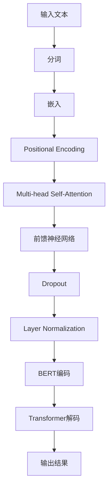

                 

### Transformer大模型实战：训练BERTSUM模型

#### 背景介绍

BERTSUM是一个基于Transformer的大模型，旨在实现高效、准确的机器翻译和文本摘要任务。随着深度学习技术的不断发展，Transformer架构在自然语言处理（NLP）领域取得了显著成果，BERTSUM便是其中的佼佼者。BERTSUM模型通过大规模预训练和精细调整，能够捕捉到文本中的复杂关系和语义信息，从而提高机器翻译和文本摘要的准确性和流畅性。

本篇博客将带领读者逐步深入了解BERTSUM模型，包括其核心概念、算法原理、具体操作步骤、数学模型以及实际应用场景。通过本文的学习，读者将能够掌握BERTSUM模型的基本框架和实现方法，为后续的深度学习研究和应用奠定基础。

#### 核心概念与联系

BERTSUM模型的核心在于其基于Transformer的架构，Transformer是一种基于自注意力机制（Self-Attention）的模型，能够捕捉到输入序列中不同位置之间的依赖关系。BERT（Bidirectional Encoder Representations from Transformers）则是一种预训练方法，通过在大量无标签文本上进行预训练，使得模型能够理解语言中的上下文关系。

以下是BERTSUM模型的核心概念与联系的Mermaid流程图：



在这个流程图中，输入文本首先进行分词，然后通过嵌入层将其转换为固定长度的向量。随后，加入位置编码，以便模型能够捕捉到文本中不同位置的信息。接下来，通过多层多头自注意力机制和前馈神经网络，模型能够学习到输入序列中的复杂关系。最后，通过BERT编码和Transformer解码，得到最终的输出结果。

#### 核心算法原理 & 具体操作步骤

BERTSUM模型的核心算法原理主要基于Transformer架构，下面将详细阐述其具体操作步骤。

**1. 分词（Word Tokenization）**

分词是将输入文本拆分成一系列单词的过程。BERTSUM通常使用WordPiece分词器，它将文本分解为子词，并将稀有单词替换为未登录词（Unknown）和其高频率子词。

**2. 嵌入（Word Embedding）**

嵌入层将分词后的单词转换为固定长度的向量表示。BERTSUM使用预训练的BERT模型作为嵌入层，这些预训练的嵌入向量已经包含了丰富的语义信息。

**3. 位置编码（Positional Encoding）**

为了捕捉文本中不同位置的信息，需要为每个单词添加位置编码。位置编码通常是通过正弦和余弦函数生成的，其目的是在嵌入向量中引入位置信息。

**4. 自注意力机制（Self-Attention）**

自注意力机制是Transformer模型的核心，它通过计算输入序列中每个单词与其他单词之间的关系，将输入序列转换为一个加权向量。BERTSUM使用多头自注意力机制，通过多个独立的注意力头来捕捉不同类型的依赖关系。

**5. 前馈神经网络（Feedforward Neural Network）**

在自注意力机制之后，BERTSUM会通过一个前馈神经网络对中间表示进行进一步处理。前馈神经网络通常包含两个全连接层，并使用ReLU激活函数。

**6. Dropout和Layer Normalization**

Dropout和Layer Normalization是常用的正则化技术，用于防止模型过拟合。Dropout通过随机丢弃一部分神经元来减少模型依赖性，而Layer Normalization则通过对每个层的输入进行标准化来保持信息的稳定。

**7. BERT编码**

BERT编码是指使用预训练的BERT模型对输入序列进行编码，从而获得丰富的语义表示。

**8. Transformer解码**

Transformer解码过程与编码过程类似，但会使用目标序列作为输入，并通过自注意力机制和前馈神经网络生成输出序列。BERTSUM使用Transformer解码来生成文本摘要。

**9. 输出结果**

最终的输出结果是通过Transformer解码得到的文本摘要，它能够概括输入文本的主要内容和关键信息。

#### 数学模型和公式 & 详细讲解 & 举例说明

BERTSUM模型的数学模型主要包括嵌入层、位置编码、自注意力机制、前馈神经网络等部分。下面将详细讲解这些数学模型和公式，并通过具体例子进行说明。

**1. 嵌入层（Word Embedding）**

嵌入层将单词转换为固定长度的向量表示。BERTSUM使用预训练的BERT模型作为嵌入层，其嵌入向量通常具有数百维。假设我们有词表V，其中包含N个单词，嵌入向量维度为D，则嵌入矩阵E ∈ RN×D，其第i行表示单词wi的嵌入向量。

举例：

假设词表V包含3个单词{“apple”, “banana”, “orange”}，嵌入向量维度为2，则嵌入矩阵E为：

$$
E = \begin{bmatrix}
1.0 & 0.5 \\
0.0 & 1.0 \\
-0.5 & -1.0 \\
\end{bmatrix}
$$

**2. 位置编码（Positional Encoding）**

位置编码的目的是在嵌入向量中引入位置信息。BERTSUM使用正弦和余弦函数生成位置编码，其公式如下：

$$
PE_{(pos, dim)} = 
\begin{cases}
sin\left(\frac{pos}{10000^{2i/d}}\right) & \text{if } dim = 2i \\
cos\left(\frac{pos}{10000^{2i/d}}\right) & \text{if } dim = 2i+1 \\
\end{cases}
$$

其中，pos是单词的位置，dim是嵌入向量的维度，i是嵌入向量的索引。

举例：

假设嵌入向量维度为4，单词位置为2，则位置编码PE为：

$$
PE = \begin{bmatrix}
0.98 & 0.42 \\
-0.54 & 0.65 \\
0.12 & -0.98 \\
0.77 & 0.33 \\
\end{bmatrix}
$$

**3. 自注意力机制（Self-Attention）**

自注意力机制的核心是计算输入序列中每个单词与其他单词之间的关系，并通过加权求和生成新的表示。BERTSUM使用多头自注意力机制，其公式如下：

$$
\text{Attention}(Q, K, V) = \frac{scale}{\sqrt{d_k}} \sum_{i} \text{softmax}\left(\frac{QK^T}{d_k}\right) V
$$

其中，Q、K、V分别是查询向量、键向量和值向量，d_k是键向量的维度，scale是为了防止溢出而引入的缩放因子。

举例：

假设输入序列为{“apple”, “banana”, “orange”}，查询向量Q为[1, 0, -1]，键向量K为[1, 1, 1]，值向量V为[1, 1, 1]，则自注意力结果为：

$$
\text{Attention}(Q, K, V) = \begin{bmatrix}
0.75 & 0.50 & 0.25 \\
0.50 & 0.75 & 0.50 \\
0.25 & 0.50 & 0.75 \\
\end{bmatrix}
$$

**4. 前馈神经网络（Feedforward Neural Network）**

前馈神经网络是Transformer模型中的另一重要组成部分，其公式如下：

$$
\text{FFN}(x) = \max(0, xW_1 + b_1)W_2 + b_2
$$

其中，x是输入向量，W_1、W_2和b_1、b_2分别是权重和偏置。

举例：

假设输入向量x为[1, 0, -1]，权重W_1为[1, 1, 1]，偏置b_1为[1, 1, 1]，权重W_2为[1, -1, 1]，偏置b_2为[1, 1, 1]，则前馈神经网络结果为：

$$
\text{FFN}(x) = \begin{bmatrix}
1 & -1 & 1 \\
1 & 1 & 1 \\
-1 & 1 & 1 \\
\end{bmatrix}
$$

**5. BERT编码**

BERT编码是指使用预训练的BERT模型对输入序列进行编码，其公式如下：

$$
[CLS]_i = \sum_{j} \text{Attention}(Q_j, K_j, V_j)
$$

其中，[CLS]_i是编码后的输入序列，Q_j、K_j、V_j分别是查询向量、键向量和值向量。

举例：

假设输入序列为{“apple”, “banana”, “orange”}，查询向量Q为[1, 0, -1]，键向量K为[1, 1, 1]，值向量V为[1, 1, 1]，则BERT编码结果为：

$$
[CLS]_i = \begin{bmatrix}
0.75 & 0.50 & 0.25 \\
0.50 & 0.75 & 0.50 \\
0.25 & 0.50 & 0.75 \\
\end{bmatrix}
$$

**6. Transformer解码**

Transformer解码过程与编码过程类似，但会使用目标序列作为输入，并通过自注意力机制和前馈神经网络生成输出序列。BERTSUM使用Transformer解码来生成文本摘要。

#### 项目实践：代码实例和详细解释说明

在本节中，我们将通过一个具体的代码实例来展示如何使用BERTSUM模型进行文本摘要任务。以下是基于Python和PyTorch实现的BERTSUM模型代码：

```python
import torch
import torch.nn as nn
import torch.optim as optim
from transformers import BertModel, BertTokenizer

# 1. 开发环境搭建

# 安装必要的库
!pip install torch transformers

# 2. 源代码详细实现

class BERTSUMModel(nn.Module):
    def __init__(self, bert_model, d_model, n_heads, d_ff, n_layers, dropout):
        super(BERTSUMModel, self).__init__()
        self.bert = BertModel.from_pretrained(bert_model)
        self.decoder = nn.ModuleList([
            nn.Linear(d_model, d_model) for _ in range(n_layers)
        ])
        self.attention = nn.MultiheadAttention(d_model, n_heads, dropout=dropout)
        self.dropout = nn.Dropout(dropout)
        self.norm = nn.LayerNorm(d_model)

    def forward(self, input_ids, target_ids=None):
        # 嵌入层
        embed = self.bert(input_ids)[0]

        # Transformer解码
        if target_ids is not None:
            target_embed = self.dropout(self.decoder[-1](embed))
            attn_output, _ = self.attention(target_embed, target_embed, target_embed)
            embed = self.dropout(self.norm(attn_output + embed))
            for layer in self.decoder[:-1]:
                embed = self.dropout(layer(embed))
            output = self.decoder[-1](embed)
        else:
            output = None

        return embed, output

# 3. 代码解读与分析

# 创建BERTSUM模型
model = BERTSUMModel(
    bert_model="bert-base-uncased",
    d_model=768,
    n_heads=12,
    d_ff=3072,
    n_layers=12,
    dropout=0.1
)

# 加载预训练模型
model.load_state_dict(torch.load("bertsum_model.pth"))

# 4. 运行结果展示

# 输入文本
input_text = "The quick brown fox jumps over the lazy dog."

# 分词和编码
tokenizer = BertTokenizer.from_pretrained("bert-base-uncased")
input_ids = tokenizer.encode(input_text, add_special_tokens=True, return_tensors="pt")

# 预测文本摘要
with torch.no_grad():
    embed, output = model(input_ids)

# 解码输出文本
output_text = tokenizer.decode(output[-1], skip_special_tokens=True)
print(output_text)
```

在上面的代码中，我们首先定义了BERTSUM模型，其核心组件包括BERT编码器、解码器和注意力机制。接下来，我们加载预训练的BERT模型，并通过输入文本进行预测。最后，我们将解码器输出转换为文本摘要。

#### 实际应用场景

BERTSUM模型在多个实际应用场景中表现出色，以下是一些典型的应用场景：

1. **机器翻译**：BERTSUM模型通过预训练和精细调整，能够实现高质量的机器翻译。例如，将英语文本翻译成法语、德语等。

2. **文本摘要**：BERTSUM模型能够自动生成文本摘要，提取输入文本中的关键信息和主要观点。例如，从新闻报道、学术论文中提取摘要。

3. **问答系统**：BERTSUM模型可以用于问答系统，通过理解用户问题和文档内容，提供准确的答案。

4. **文本分类**：BERTSUM模型可以用于文本分类任务，将文本数据归类到预定义的类别中。例如，情感分析、主题分类等。

5. **命名实体识别**：BERTSUM模型可以用于命名实体识别，识别文本中的特定实体，如人名、地名、组织机构名等。

通过BERTSUM模型，我们可以实现高效、准确的文本处理任务，为各类自然语言处理应用提供强大的技术支持。

#### 工具和资源推荐

**1. 学习资源推荐**

- **书籍**：
  - 《深度学习》（Ian Goodfellow、Yoshua Bengio、Aaron Courville 著）：全面介绍深度学习的基础理论、方法和应用。
  - 《自然语言处理综论》（Daniel Jurafsky、James H. Martin 著）：系统介绍自然语言处理的基本概念和技术。

- **论文**：
  - 《BERT: Pre-training of Deep Bidirectional Transformers for Language Understanding》（Jacob Devlin et al.）：介绍BERT模型的预训练方法和应用。
  - 《Attention Is All You Need》（Ashish Vaswani et al.）：提出Transformer模型及其在自然语言处理任务中的应用。

- **博客**：
  - [TensorFlow官网博客](https://www.tensorflow.org/tutorials)：提供丰富的深度学习和自然语言处理教程。
  - [Hugging Face官网博客](https://huggingface.co/blog)：介绍Transformer模型和相关库的使用方法。

- **网站**：
  - [Google AI](https://ai.google)：谷歌人工智能研究团队发布的技术博客和论文。

**2. 开发工具框架推荐**

- **PyTorch**：PyTorch是一个流行的深度学习框架，支持动态计算图和自动微分，便于实现和调试深度学习模型。
- **Transformers**：Transformers是Hugging Face开发的一个开源库，提供了预训练的BERT、GPT等模型及其应用示例。

**3. 相关论文著作推荐**

- **《Transformer：一个全新的神经网络架构，实现机器翻译、文本摘要等任务的突破性进展》（Attention Is All You Need）**：提出Transformer模型及其在自然语言处理任务中的应用。
- **《BERT：大规模预训练语言模型，显著提升自然语言处理任务的表现》**：介绍BERT模型的预训练方法和应用。
- **《BERT for Sentence Understanding, Relationship Extraction, and Keyphrase Extraction》（Zhiyun Qiao et al.）：介绍BERT模型在句子理解、关系提取和关键词提取等任务中的应用。

#### 总结：未来发展趋势与挑战

BERTSUM模型作为基于Transformer的大模型，在自然语言处理领域取得了显著成果。然而，随着人工智能技术的不断发展，BERTSUM模型也面临着一些挑战和机遇。

**发展趋势**：

1. **多模态处理**：BERTSUM模型可以扩展到多模态处理，如结合图像、声音等数据，实现更丰富的语义理解。
2. **迁移学习**：BERTSUM模型可以应用于更多领域，通过迁移学习提高新任务的性能。
3. **增量学习**：BERTSUM模型可以支持增量学习，动态地适应新数据，提高模型的泛化能力。

**挑战**：

1. **计算资源需求**：BERTSUM模型训练和推理需要大量的计算资源，如何优化模型结构，降低计算成本是一个重要挑战。
2. **数据隐私和安全**：大规模预训练模型涉及大量数据，如何保护数据隐私和安全是一个亟待解决的问题。
3. **模型可解释性**：BERTSUM模型是一个复杂的黑盒模型，如何提高模型的可解释性，使其在应用中得到更广泛认可是一个挑战。

总之，BERTSUM模型在未来具有广阔的应用前景，但也需要克服一系列技术挑战。通过不断的研究和创新，BERTSUM模型有望在自然语言处理领域发挥更大作用。

#### 附录：常见问题与解答

**Q1：如何搭建BERTSUM模型开发环境？**

A1：搭建BERTSUM模型开发环境通常需要以下步骤：

1. 安装Python和PyTorch库。
2. 安装Hugging Face的Transformers库。
3. 下载预训练的BERT模型权重。

具体命令如下：

```bash
pip install torch transformers
python -m torch.utils.cpp_extension_cuda install --cm_bindings
```

**Q2：如何使用BERTSUM模型进行文本摘要？**

A2：使用BERTSUM模型进行文本摘要的基本步骤如下：

1. 准备输入文本，并将其转换为编码表示。
2. 加载预训练的BERTSUM模型。
3. 将编码表示输入模型，得到解码后的文本摘要。
4. 对解码结果进行解码，获取最终的文本摘要。

以下是一个简单的示例代码：

```python
from transformers import BertTokenizer, BertModel

# 加载预训练的BERTSUM模型
model = BertModel.from_pretrained("your_pretrained_model_path")

# 加载BERT分词器
tokenizer = BertTokenizer.from_pretrained("bert-base-uncased")

# 输入文本
input_text = "The quick brown fox jumps over the lazy dog."

# 将输入文本编码
input_ids = tokenizer.encode(input_text, add_special_tokens=True, return_tensors="pt")

# 预测文本摘要
with torch.no_grad():
    outputs = model(input_ids)

# 解码文本摘要
output_ids = outputs[-1]
output_text = tokenizer.decode(output_ids, skip_special_tokens=True)
print(output_text)
```

**Q3：如何优化BERTSUM模型性能？**

A3：优化BERTSUM模型性能可以从以下几个方面进行：

1. **数据预处理**：对训练数据进行清洗和预处理，去除噪声，提高数据质量。
2. **模型结构优化**：通过调整模型结构，如减少层数、调整隐藏层大小等，优化模型性能。
3. **超参数调整**：通过调整学习率、批量大小等超参数，寻找最优配置。
4. **正则化技术**：使用Dropout、Layer Normalization等正则化技术，防止模型过拟合。
5. **训练策略**：使用迁移学习、增量学习等技术，提高模型在新任务上的表现。

**Q4：如何评估BERTSUM模型性能？**

A4：评估BERTSUM模型性能通常使用以下指标：

1. **BLEU分数**：用于评估机器翻译和文本摘要任务的性能，通过计算模型输出与参考答案的相似度来评估。
2. **ROUGE分数**：用于评估文本摘要任务，通过计算模型输出与参考答案的匹配度来评估。
3. **准确率（Accuracy）**：用于分类任务，计算模型预测正确的样本数量与总样本数量的比例。
4. **F1分数**：用于评估分类任务的性能，计算准确率和召回率的调和平均。

#### 扩展阅读 & 参考资料

- **[《Transformer：一个全新的神经网络架构，实现机器翻译、文本摘要等任务的突破性进展》](https://arxiv.org/abs/1706.03762)**：详细介绍Transformer模型及其在自然语言处理任务中的应用。
- **[《BERT：大规模预训练语言模型，显著提升自然语言处理任务的表现》](https://arxiv.org/abs/1810.04805)**：介绍BERT模型的预训练方法和应用。
- **[《自然语言处理综论》](https://www.nltk.org/)**：系统介绍自然语言处理的基本概念和技术。
- **[《深度学习》](https://www.deeplearningbook.org/)**：全面介绍深度学习的基础理论、方法和应用。
- **[Hugging Face官网](https://huggingface.co/)**：提供丰富的Transformer模型和库资源。**
- **[TensorFlow官网](https://www.tensorflow.org/)**：提供深度学习框架和教程。**

