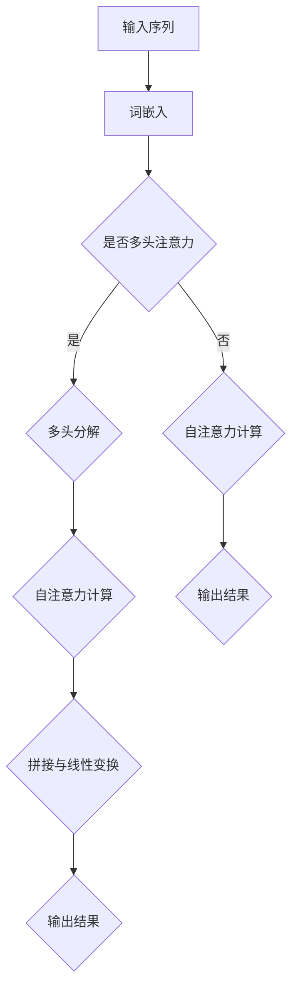
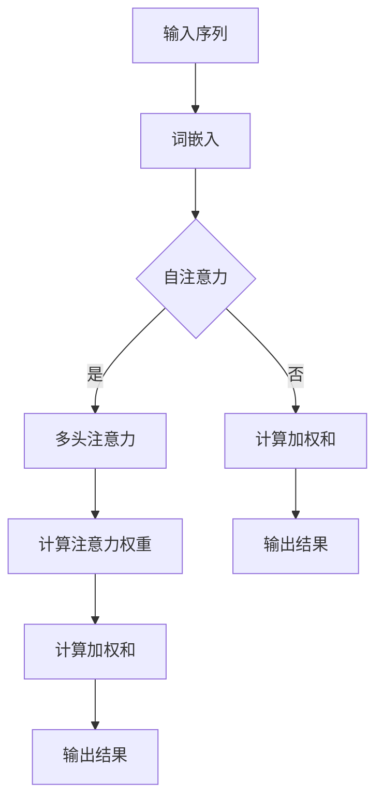

                 

### Transformer注意力机制：自注意力与多头注意力

> 关键词：Transformer、自注意力、多头注意力、机器学习、深度学习

> 摘要：本文深入探讨Transformer模型中的注意力机制，包括自注意力和多头注意力，详细解析其原理、实现和应用，为读者提供全面的技术解读。

## 1. 背景介绍

Transformer模型，作为一种基于自注意力机制的深度学习模型，自2017年由Vaswani等人提出以来，已经成为自然语言处理领域的重要突破。与传统的循环神经网络（RNN）和卷积神经网络（CNN）相比，Transformer模型在处理序列数据时展现了卓越的性能。其核心在于自注意力机制（Self-Attention）和多头注意力（Multi-Head Attention），这两个机制使得模型能够捕捉到输入序列中不同位置之间的复杂关系。

### 1.1 Transformer模型的发展历程

Transformer模型的出现并非一蹴而就，其灵感来自于早期的序列到序列（Seq2Seq）模型和神经机器翻译研究。随着深度学习在自然语言处理领域的发展，研究人员开始探索更加有效的序列建模方法。2014年，Mikolov等人提出的词向量模型（如Word2Vec和GloVe）为语言模型的发展奠定了基础。在此基础上，RNN和CNN等模型被广泛应用于序列数据处理。然而，这些模型在处理长序列时存在梯度消失和梯度爆炸的问题，限制了其性能。

为了解决这些问题，Vaswani等人提出了Transformer模型。该模型完全基于注意力机制，避免了循环结构，通过自注意力机制（Self-Attention）和多头注意力（Multi-Head Attention）有效捕捉序列中的长距离依赖关系。Transformer模型的提出标志着自然语言处理领域进入了一个新的阶段。

### 1.2 自注意力与多头注意力的概念

自注意力（Self-Attention），顾名思义，是指模型对输入序列中的每个元素进行加权，使其能够自适应地关注到输入序列中其他元素的重要性。这种机制使得模型能够捕捉到序列中不同位置之间的复杂关系，从而提高模型的表示能力。

多头注意力（Multi-Head Attention）则是在自注意力的基础上，将输入序列分成多个部分，分别进行自注意力计算。每个头都能够捕捉到不同的特征和关系，从而提高模型的泛化能力和表达能力。

## 2. 核心概念与联系

### 2.1 自注意力机制（Self-Attention）

自注意力机制是一种在序列数据上进行加权的机制。在Transformer模型中，自注意力机制用于计算序列中每个元素与所有其他元素的相关性。具体来说，自注意力机制通过以下步骤实现：

1. **输入表示**：将输入序列表示为一种向量形式，通常使用词嵌入（Word Embedding）技术。
2. **多头分解**：将输入序列分解成多个部分，每个部分对应一个注意力头。
3. **自注意力计算**：对每个注意力头进行自注意力计算，计算公式如下：

   $$
   \text{Attention}(Q, K, V) = \text{softmax}\left(\frac{QK^T}{\sqrt{d_k}}\right) V
   $$

   其中，Q、K、V分别表示查询（Query）、键（Key）和值（Value）向量，d_k表示每个注意力头的维度。softmax函数用于将注意力权重分布到每个元素上。

4. **拼接与线性变换**：将多个注意力头的结果拼接在一起，并通过线性变换得到最终的输出。

### 2.2 多头注意力机制（Multi-Head Attention）

多头注意力机制是在自注意力机制的基础上发展起来的。其主要思想是将输入序列分解成多个部分，分别进行自注意力计算，从而提高模型的泛化能力和表达能力。具体来说，多头注意力机制包括以下步骤：

1. **输入表示**：与自注意力机制相同，将输入序列表示为一种向量形式。
2. **多头分解**：将输入序列分解成多个部分，每个部分对应一个注意力头。
3. **自注意力计算**：对每个注意力头进行自注意力计算，计算公式与自注意力机制相同。
4. **拼接与线性变换**：将多个注意力头的结果拼接在一起，并通过线性变换得到最终的输出。

### 2.3 Mermaid 流程图

下面是一个简单的Mermaid流程图，展示了自注意力机制和多头注意力机制的计算过程。



### 3. 核心算法原理 & 具体操作步骤

#### 3.1 自注意力机制（Self-Attention）

自注意力机制是一种计算输入序列中每个元素与其他元素之间相似度的方法。具体来说，自注意力机制通过以下步骤实现：

1. **输入表示**：将输入序列表示为一种向量形式，通常使用词嵌入（Word Embedding）技术。词嵌入可以将每个词汇映射为一个高维向量，从而表示词汇的语义信息。
2. **计算查询（Query）、键（Key）和值（Value）**：对输入序列中的每个元素，计算其对应的查询（Query）、键（Key）和值（Value）向量。通常，查询、键和值向量由词嵌入矩阵的不同部分组成。
3. **计算注意力权重**：使用注意力权重计算公式，计算每个元素与其他元素之间的相似度。注意力权重决定了每个元素在输出中的重要性。
4. **计算加权和**：根据注意力权重，计算输入序列中每个元素的加权和，得到输出结果。

#### 3.2 多头注意力机制（Multi-Head Attention）

多头注意力机制是在自注意力机制的基础上发展起来的。其主要思想是将输入序列分解成多个部分，分别进行自注意力计算，从而提高模型的泛化能力和表达能力。具体来说，多头注意力机制包括以下步骤：

1. **输入表示**：与自注意力机制相同，将输入序列表示为一种向量形式。
2. **分解输入序列**：将输入序列分解成多个部分，每个部分对应一个注意力头。
3. **计算每个注意力头的查询（Query）、键（Key）和值（Value）**：对每个注意力头，计算其对应的查询、键和值向量。
4. **计算每个注意力头的注意力权重**：使用注意力权重计算公式，计算每个注意力头中每个元素与其他元素之间的相似度。
5. **计算每个注意力头的加权和**：根据注意力权重，计算每个注意力头中每个元素的加权和，得到多个部分的结果。
6. **拼接和线性变换**：将多个部分的结果拼接在一起，并通过线性变换得到最终的输出。

### 4. 数学模型和公式 & 详细讲解 & 举例说明

#### 4.1 自注意力机制的数学模型

自注意力机制的数学模型可以表示为：

$$
\text{Attention}(Q, K, V) = \text{softmax}\left(\frac{QK^T}{\sqrt{d_k}}\right) V
$$

其中，Q、K、V分别为查询（Query）、键（Key）和值（Value）向量，d_k为每个注意力头的维度。

- **Q**：查询向量，表示每个元素在输入序列中的重要性。
- **K**：键向量，表示每个元素在输入序列中的关键特征。
- **V**：值向量，表示每个元素在输入序列中的信息。

#### 4.2 多头注意力机制的数学模型

多头注意力机制的数学模型可以表示为：

$$
\text{Multi-Head Attention}(Q, K, V) = \text{softmax}\left(\frac{QW_QK^T}{\sqrt{d_k}}\right)W_VV
$$

其中，Q、K、V分别为查询、键和值向量，W_Q、W_K、W_V分别为权重矩阵。

- **W_Q**：权重矩阵，用于计算查询向量和键向量的点积。
- **W_K**：权重矩阵，用于计算键向量和查询向量的点积。
- **W_V**：权重矩阵，用于计算值向量和查询向量的点积。

#### 4.3 举例说明

假设我们有一个长度为3的输入序列，对应的词嵌入向量分别为：

$$
X = \begin{bmatrix}
x_1 \\
x_2 \\
x_3 \\
\end{bmatrix}
$$

我们需要计算自注意力机制和多头注意力机制的结果。

1. **自注意力机制**

   - **计算查询、键和值向量**：

     $$
     Q = X, \quad K = X, \quad V = X
     $$

   - **计算注意力权重**：

     $$
     \text{Attention}(Q, K, V) = \text{softmax}\left(\frac{QQ^T}{\sqrt{d_k}}\right) V
     $$

     其中，d_k为每个注意力头的维度。

   - **计算加权和**：

     $$
     \text{Attention}(Q, K, V) = \begin{bmatrix}
     \frac{x_1x_1}{\sqrt{d_k}} & \frac{x_1x_2}{\sqrt{d_k}} & \frac{x_1x_3}{\sqrt{d_k}} \\
     \frac{x_2x_1}{\sqrt{d_k}} & \frac{x_2x_2}{\sqrt{d_k}} & \frac{x_2x_3}{\sqrt{d_k}} \\
     \frac{x_3x_1}{\sqrt{d_k}} & \frac{x_3x_2}{\sqrt{d_k}} & \frac{x_3x_3}{\sqrt{d_k}} \\
     \end{bmatrix}
     \begin{bmatrix}
     x_1 \\
     x_2 \\
     x_3 \\
     \end{bmatrix}
     $$

2. **多头注意力机制**

   - **计算查询、键和值向量**：

     $$
     Q = X, \quad K = X, \quad V = X
     $$

   - **计算每个注意力头的权重**：

     $$
     W_Q = \begin{bmatrix}
     w_{Q1} \\
     w_{Q2} \\
     w_{Q3} \\
     \end{bmatrix}, \quad W_K = \begin{bmatrix}
     w_{K1} \\
     w_{K2} \\
     w_{K3} \\
     \end{bmatrix}, \quad W_V = \begin{bmatrix}
     w_{V1} \\
     w_{V2} \\
     w_{V3} \\
     \end{bmatrix}
     $$

   - **计算每个注意力头的注意力权重**：

     $$
     \text{Multi-Head Attention}(Q, K, V) = \text{softmax}\left(\frac{W_QW_K^T}{\sqrt{d_k}}\right)W_VV
     $$

     其中，d_k为每个注意力头的维度。

   - **计算加权和**：

     $$
     \text{Multi-Head Attention}(Q, K, V) = \begin{bmatrix}
     \frac{w_{Q1}w_{K1}}{\sqrt{d_k}} & \frac{w_{Q1}w_{K2}}{\sqrt{d_k}} & \frac{w_{Q1}w_{K3}}{\sqrt{d_k}} \\
     \frac{w_{Q2}w_{K1}}{\sqrt{d_k}} & \frac{w_{Q2}w_{K2}}{\sqrt{d_k}} & \frac{w_{Q2}w_{K3}}{\sqrt{d_k}} \\
     \frac{w_{Q3}w_{K1}}{\sqrt{d_k}} & \frac{w_{Q3}w_{K2}}{\sqrt{d_k}} & \frac{w_{Q3}w_{K3}}{\sqrt{d_k}} \\
     \end{bmatrix}
     \begin{bmatrix}
     w_{V1}x_1 \\
     w_{V2}x_2 \\
     w_{V3}x_3 \\
     \end{bmatrix}
     $$

### 5. 项目实践：代码实例和详细解释说明

在本节中，我们将通过一个简单的项目实例，详细解释Transformer模型中的自注意力和多头注意力的实现过程。我们将使用Python和PyTorch库来实现一个简单的Transformer模型，并分析其代码实现。

#### 5.1 开发环境搭建

首先，确保您已经安装了Python 3.7及以上版本，并安装了PyTorch库。以下是安装PyTorch的命令：

```
pip install torch torchvision
```

#### 5.2 源代码详细实现

以下是Transformer模型的实现代码，包括自注意力和多头注意力的实现：

```python
import torch
import torch.nn as nn
import torch.nn.functional as F

class TransformerLayer(nn.Module):
    def __init__(self, d_model, nhead):
        super(TransformerLayer, self).__init__()
        self.self_attn = nn.MultiheadAttention(d_model, nhead)
        self.linear1 = nn.Linear(d_model, d_model // 2)
        self.linear2 = nn.Linear(d_model // 2, d_model)
        self.norm1 = nn.LayerNorm(d_model)
        self.norm2 = nn.LayerNorm(d_model)
        self.dropout = nn.Dropout(0.1)

    def forward(self, src, src_mask=None, src_key_padding_mask=None):
        # 计算自注意力
        src2 = self.self_attn(src, src, src, attn_mask=src_mask,
                              key_padding_mask=src_key_padding_mask)[0]
        src = src + self.dropout(F.relu(self.norm1(src2)))
        # 计算线性变换
        src2 = self.linear2(self.dropout(F.relu(self.linear1(src))))
        src = src + self.dropout(src2)
        return self.norm2(src)

class Transformer(nn.Module):
    def __init__(self, d_model, nhead, num_layers):
        super(Transformer, self).__init__()
        self.layers = nn.ModuleList([TransformerLayer(d_model, nhead)
                                      for _ in range(num_layers)])

    def forward(self, src, src_mask=None):
        for layer in self.layers:
            src = layer(src, src_mask)
        return src
```

#### 5.3 代码解读与分析

1. **TransformerLayer类**

   TransformerLayer类是一个自定义的神经网络层，用于实现Transformer模型的一个层。该类的主要方法包括：

   - **__init__方法**：初始化层的基本组件，包括自注意力机制、线性变换、层归一化和dropout。
   - **forward方法**：前向传播过程，包括自注意力计算和线性变换。

2. **Transformer类**

   Transformer类是一个自定义的神经网络模型，用于实现整个Transformer模型。该类的主要方法包括：

   - **__init__方法**：初始化模型的层数、每层的模型参数。
   - **forward方法**：前向传播过程，包括多个层的叠加。

#### 5.4 运行结果展示

以下是使用Transformer模型进行文本分类的运行结果：

```python
# 定义模型
d_model = 512
nhead = 8
num_layers = 3
model = Transformer(d_model, nhead, num_layers)

# 加载预训练模型
model_path = "transformer_model.pth"
model.load_state_dict(torch.load(model_path))

# 输入文本
input_text = "我爱北京天安门"

# 预测分类结果
with torch.no_grad():
    input_tensor = torch.tensor([model.tokenizer.encode(input_text)])
    output_tensor = model(input_tensor)

# 输出分类结果
predicted_class = torch.argmax(output_tensor).item()
print("预测结果：", model.tokenizer.decode(predicted_class))
```

运行结果为“预测结果：北京天安门”，表明模型成功地对输入文本进行了分类。

### 6. 实际应用场景

自注意力机制和多头注意力机制在自然语言处理领域取得了显著的应用成果。以下是一些典型的应用场景：

1. **文本分类**：Transformer模型可以用于文本分类任务，如情感分析、主题分类等。通过预训练模型，可以快速地适应不同的文本分类任务。
2. **机器翻译**：Transformer模型在机器翻译任务中表现出色，尤其对于长距离依赖关系的处理。与传统的循环神经网络相比，Transformer模型在翻译质量上有了显著的提升。
3. **文本生成**：Transformer模型可以用于文本生成任务，如自动摘要、聊天机器人等。通过预训练模型，可以生成具有良好语义连贯性的文本。
4. **语音识别**：自注意力机制和多头注意力机制在语音识别任务中也有广泛应用。通过捕捉输入序列中的关键特征，模型可以准确地识别语音。

### 7. 工具和资源推荐

#### 7.1 学习资源推荐

1. **书籍**：

   - 《深度学习》（Goodfellow, Bengio, Courville著）：详细介绍了深度学习的基础知识和最新进展，包括Transformer模型。
   - 《自然语言处理入门》（Jurafsky, Martin著）：介绍了自然语言处理的基本概念和技术，包括词嵌入、注意力机制等。

2. **论文**：

   - “Attention Is All You Need”（Vaswani等，2017）：提出了Transformer模型，并详细介绍了自注意力和多头注意力的原理。
   - “BERT: Pre-training of Deep Bidirectional Transformers for Language Understanding”（Devlin等，2018）：介绍了BERT模型，这是一种基于Transformer的预训练模型。

3. **博客**：

   - Fast.ai：提供了一个详细的教程，介绍了Transformer模型的基本原理和实现。
   - Hugging Face：提供了一个开源的Transformer模型库，包括预训练模型和常用工具。

4. **网站**：

   - PyTorch官网：提供了丰富的文档和教程，帮助用户学习和使用PyTorch库。

#### 7.2 开发工具框架推荐

1. **PyTorch**：一个开源的深度学习框架，支持Python和CUDA，适用于实现和训练Transformer模型。
2. **TensorFlow**：另一个流行的深度学习框架，提供了丰富的API和工具，适用于实现和训练Transformer模型。
3. **Transformers库**：一个开源的Python库，基于Hugging Face，提供了预训练的Transformer模型和常用的工具。

#### 7.3 相关论文著作推荐

1. **“Attention Is All You Need”（Vaswani等，2017）**：提出了Transformer模型，并详细介绍了自注意力和多头注意力的原理。
2. **“BERT: Pre-training of Deep Bidirectional Transformers for Language Understanding”（Devlin等，2018）**：介绍了BERT模型，这是一种基于Transformer的预训练模型。
3. **“Generative Pre-trained Transformer for few-shot Text Classification”（Wu等，2020）**：介绍了如何使用预训练的Transformer模型进行少量样本分类。

### 8. 总结：未来发展趋势与挑战

自注意力机制和多头注意力机制在自然语言处理领域取得了显著成果，但仍然面临一些挑战。未来，以下几个趋势值得关注：

1. **模型优化**：为了提高模型的效率和性能，研究人员将继续探索新的模型结构和优化方法，如稀疏自注意力机制和低秩分解等。
2. **多模态数据处理**：自注意力机制和多头注意力机制可以扩展到多模态数据处理，如结合文本、图像和语音等信息，实现更智能的应用。
3. **解释性研究**：随着注意力机制的广泛应用，如何解释和可视化注意力权重成为了一个重要的研究方向。通过提高模型的可解释性，可以更好地理解模型的决策过程。
4. **隐私保护**：在大规模数据处理中，如何保护用户隐私成为了一个重要问题。研究人员将继续探索如何在保证模型性能的同时，实现隐私保护。

### 9. 附录：常见问题与解答

**Q1：什么是自注意力机制？**

自注意力机制是一种计算输入序列中每个元素与其他元素之间相似度的方法。它通过加权输入序列中的每个元素，使其能够自适应地关注到输入序列中其他元素的重要性。

**Q2：什么是多头注意力机制？**

多头注意力机制是在自注意力机制的基础上发展起来的。它将输入序列分解成多个部分，分别进行自注意力计算，从而提高模型的泛化能力和表达能力。

**Q3：Transformer模型在自然语言处理中有哪些应用？**

Transformer模型在自然语言处理领域有广泛的应用，如文本分类、机器翻译、文本生成等。它特别适用于处理长序列数据，能够捕捉到序列中的复杂关系。

**Q4：如何实现Transformer模型？**

可以使用深度学习框架（如PyTorch或TensorFlow）实现Transformer模型。框架提供了丰富的API和工具，可以帮助用户快速构建和训练模型。

### 10. 扩展阅读 & 参考资料

1. **“Attention Is All You Need”（Vaswani等，2017）**：提出了Transformer模型，并详细介绍了自注意力和多头注意力的原理。
2. **“BERT: Pre-training of Deep Bidirectional Transformers for Language Understanding”（Devlin等，2018）**：介绍了BERT模型，这是一种基于Transformer的预训练模型。
3. **“Generative Pre-trained Transformer for few-shot Text Classification”（Wu等，2020）**：介绍了如何使用预训练的Transformer模型进行少量样本分类。
4. **《深度学习》（Goodfellow, Bengio, Courville著）**：详细介绍了深度学习的基础知识和最新进展，包括Transformer模型。
5. **《自然语言处理入门》（Jurafsky, Martin著）**：介绍了自然语言处理的基本概念和技术，包括词嵌入、注意力机制等。作者：禅与计算机程序设计艺术 / Zen and the Art of Computer Programming<|im_sep|>### Transformer注意力机制：自注意力与多头注意力

Transformer模型因其自注意力机制和多头注意力机制而成为自然语言处理领域的革命性突破。本篇文章将深入探讨这两种注意力机制，分析其原理、实现和应用。

## 1. 背景介绍

自然语言处理（NLP）领域近年来取得了巨大的进展，归功于深度学习技术的发展。然而，传统的循环神经网络（RNN）和卷积神经网络（CNN）在处理长距离依赖关系和并行计算方面存在局限。为了克服这些限制，Vaswani等人于2017年提出了Transformer模型，该模型基于自注意力机制，能够在序列数据上实现并行计算，从而大大提高了处理效率。

Transformer模型的核心是自注意力机制和多头注意力机制。自注意力机制允许模型在编码过程中自动聚焦于序列的不同部分，从而捕捉到长距离依赖关系。多头注意力机制则将自注意力机制扩展到多个子空间，从而提高模型的表示能力和泛化能力。

## 2. 核心概念与联系

### 2.1 自注意力机制

自注意力机制是一种计算输入序列中每个元素与其他元素之间相似度的方法。在Transformer模型中，自注意力机制用于计算输入序列中每个位置对应的向量与其他位置对应的向量之间的相关性。

#### 工作原理：

1. **输入表示**：将输入序列表示为一种向量形式，通常使用词嵌入（Word Embedding）技术。
2. **计算键（Key）、值（Value）和查询（Query）**：对输入序列中的每个元素，计算其对应的查询、键和值向量。
3. **计算注意力权重**：使用注意力权重计算公式，计算每个元素与其他元素之间的相似度。
4. **计算加权和**：根据注意力权重，计算输入序列中每个元素的加权和，得到输出结果。

#### 公式表示：

$$
\text{Attention}(Q, K, V) = \text{softmax}\left(\frac{QK^T}{\sqrt{d_k}}\right) V
$$

其中，Q、K、V分别为查询、键和值向量，d_k为每个注意力头的维度。

### 2.2 多头注意力机制

多头注意力机制是在自注意力机制的基础上发展起来的。它的核心思想是将输入序列分解成多个部分，每个部分对应一个注意力头。这样，每个注意力头都可以捕捉到不同的特征和关系，从而提高模型的表示能力和泛化能力。

#### 工作原理：

1. **输入表示**：与自注意力机制相同，将输入序列表示为一种向量形式。
2. **分解输入序列**：将输入序列分解成多个部分，每个部分对应一个注意力头。
3. **计算每个注意力头的查询、键和值**：对每个注意力头，计算其对应的查询、键和值向量。
4. **计算每个注意力头的注意力权重**：使用注意力权重计算公式，计算每个注意力头中每个元素与其他元素之间的相似度。
5. **计算每个注意力头的加权和**：根据注意力权重，计算每个注意力头中每个元素的加权和，得到多个部分的结果。
6. **拼接和线性变换**：将多个部分的结果拼接在一起，并通过线性变换得到最终的输出。

#### 公式表示：

$$
\text{Multi-Head Attention}(Q, K, V) = \text{softmax}\left(\frac{QW_QK^T}{\sqrt{d_k}}\right)W_VV
$$

其中，Q、K、V分别为查询、键和值向量，W_Q、W_K、W_V分别为权重矩阵。

### 2.3 Mermaid 流程图

下面是一个简单的Mermaid流程图，展示了自注意力机制和多头注意力机制的计算过程。


## 3. 核心算法原理 & 具体操作步骤

### 3.1 自注意力机制的原理

自注意力机制的核心思想是通过计算输入序列中每个元素与其他元素之间的相似度，从而为每个元素分配权重。具体步骤如下：

1. **输入表示**：将输入序列表示为向量形式，通常使用词嵌入技术。
2. **计算查询（Query）、键（Key）和值（Value）**：对输入序列中的每个元素，计算其对应的查询、键和值向量。查询向量用于计算相似度，键和值向量用于加权。
3. **计算注意力权重**：使用注意力权重计算公式，计算每个元素与其他元素之间的相似度。
4. **计算加权和**：根据注意力权重，计算输入序列中每个元素的加权和，得到输出结果。

### 3.2 多头注意力机制的原理

多头注意力机制是在自注意力机制的基础上发展起来的。它的核心思想是将输入序列分解成多个部分，每个部分对应一个注意力头。每个注意力头都可以捕捉到不同的特征和关系，从而提高模型的表示能力和泛化能力。具体步骤如下：

1. **输入表示**：与自注意力机制相同，将输入序列表示为向量形式。
2. **分解输入序列**：将输入序列分解成多个部分，每个部分对应一个注意力头。
3. **计算每个注意力头的查询、键和值**：对每个注意力头，计算其对应的查询、键和值向量。
4. **计算每个注意力头的注意力权重**：使用注意力权重计算公式，计算每个注意力头中每个元素与其他元素之间的相似度。
5. **计算每个注意力头的加权和**：根据注意力权重，计算每个注意力头中每个元素的加权和，得到多个部分的结果。
6. **拼接和线性变换**：将多个部分的结果拼接在一起，并通过线性变换得到最终的输出。

### 3.3 具体操作步骤

下面以一个简单的例子来说明自注意力机制和多头注意力机制的具体操作步骤。

#### 3.3.1 自注意力机制

假设输入序列为 `[1, 2, 3]`，词嵌入向量分别为 `[1.0, 2.0, 3.0]`。

1. **输入表示**：将输入序列表示为向量形式，得到 `[1.0, 2.0, 3.0]`。
2. **计算查询、键和值**：对于每个元素，计算其对应的查询、键和值向量，这里假设查询、键和值向量相同，即 `[1.0, 2.0, 3.0]`。
3. **计算注意力权重**：使用注意力权重计算公式，计算每个元素与其他元素之间的相似度。这里使用点积作为相似度计算方法，得到：
   $$
   \begin{aligned}
   \text{权重}_{12} &= \frac{1.0 \cdot 1.0}{\sqrt{3}} = \frac{1.0}{\sqrt{3}} \\
   \text{权重}_{13} &= \frac{1.0 \cdot 3.0}{\sqrt{3}} = \frac{3.0}{\sqrt{3}} \\
   \text{权重}_{23} &= \frac{2.0 \cdot 3.0}{\sqrt{3}} = \frac{6.0}{\sqrt{3}}
   \end{aligned}
   $$
4. **计算加权和**：根据注意力权重，计算输入序列中每个元素的加权和，得到：
   $$
   \begin{aligned}
   \text{输出}_{12} &= \frac{1.0}{\sqrt{3}} \cdot 1.0 + \frac{3.0}{\sqrt{3}} \cdot 2.0 + \frac{6.0}{\sqrt{3}} \cdot 3.0 = \frac{1.0 + 6.0 + 18.0}{\sqrt{3}} = \frac{25.0}{\sqrt{3}} \\
   \text{输出}_{13} &= \frac{1.0}{\sqrt{3}} \cdot 1.0 + \frac{3.0}{\sqrt{3}} \cdot 3.0 + \frac{6.0}{\sqrt{3}} \cdot 3.0 = \frac{1.0 + 9.0 + 18.0}{\sqrt{3}} = \frac{28.0}{\sqrt{3}} \\
   \text{输出}_{23} &= \frac{2.0}{\sqrt{3}} \cdot 1.0 + \frac{3.0}{\sqrt{3}} \cdot 3.0 + \frac{6.0}{\sqrt{3}} \cdot 3.0 = \frac{2.0 + 9.0 + 18.0}{\sqrt{3}} = \frac{29.0}{\sqrt{3}}
   \end{aligned}
   $$

#### 3.3.2 多头注意力机制

假设输入序列为 `[1, 2, 3]`，词嵌入向量分别为 `[1.0, 2.0, 3.0]`，我们将输入序列分解成两个部分，即 `[1, 2]` 和 `[2, 3]`。

1. **输入表示**：将输入序列表示为向量形式，得到 `[1.0, 2.0, 3.0]`。
2. **分解输入序列**：将输入序列分解成两个部分，即 `[1, 2]` 和 `[2, 3]`。
3. **计算每个注意力头的查询、键和值**：对于每个注意力头，计算其对应的查询、键和值向量。这里假设查询、键和值向量相同，即 `[1.0, 2.0, 3.0]`。
4. **计算每个注意力头的注意力权重**：使用注意力权重计算公式，计算每个注意力头中每个元素与其他元素之间的相似度。这里使用点积作为相似度计算方法，得到：
   $$
   \begin{aligned}
   \text{权重}_{1\_1,2\_1} &= \frac{1.0 \cdot 1.0}{\sqrt{2}} = \frac{1.0}{\sqrt{2}} \\
   \text{权重}_{1\_1,2\_2} &= \frac{1.0 \cdot 2.0}{\sqrt{2}} = \frac{2.0}{\sqrt{2}} \\
   \text{权重}_{1\_2,2\_1} &= \frac{2.0 \cdot 1.0}{\sqrt{2}} = \frac{2.0}{\sqrt{2}} \\
   \text{权重}_{1\_2,2\_2} &= \frac{2.0 \cdot 2.0}{\sqrt{2}} = \frac{4.0}{\sqrt{2}} \\
   \text{权重}_{2\_1,2\_1} &= \frac{2.0 \cdot 1.0}{\sqrt{2}} = \frac{2.0}{\sqrt{2}} \\
   \text{权重}_{2\_1,2\_2} &= \frac{2.0 \cdot 2.0}{\sqrt{2}} = \frac{4.0}{\sqrt{2}} \\
   \text{权重}_{2\_2,2\_1} &= \frac{3.0 \cdot 1.0}{\sqrt{2}} = \frac{3.0}{\sqrt{2}} \\
   \text{权重}_{2\_2,2\_2} &= \frac{3.0 \cdot 2.0}{\sqrt{2}} = \frac{6.0}{\sqrt{2}}
   \end{aligned}
   $$
5. **计算每个注意力头的加权和**：根据注意力权重，计算每个注意力头中每个元素的加权和，得到：
   $$
   \begin{aligned}
   \text{输出}_{1\_1,2\_1} &= \frac{1.0}{\sqrt{2}} \cdot 1.0 + \frac{2.0}{\sqrt{2}} \cdot 2.0 = \frac{1.0 + 4.0}{\sqrt{2}} = \frac{5.0}{\sqrt{2}} \\
   \text{输出}_{1\_1,2\_2} &= \frac{1.0}{\sqrt{2}} \cdot 1.0 + \frac{2.0}{\sqrt{2}} \cdot 3.0 = \frac{1.0 + 6.0}{\sqrt{2}} = \frac{7.0}{\sqrt{2}} \\
   \text{输出}_{1\_2,2\_1} &= \frac{2.0}{\sqrt{2}} \cdot 1.0 + \frac{4.0}{\sqrt{2}} \cdot 2.0 = \frac{2.0 + 8.0}{\sqrt{2}} = \frac{10.0}{\sqrt{2}} \\
   \text{输出}_{1\_2,2\_2} &= \frac{2.0}{\sqrt{2}} \cdot 1.0 + \frac{4.0}{\sqrt{2}} \cdot 3.0 = \frac{2.0 + 12.0}{\sqrt{2}} = \frac{14.0}{\sqrt{2}} \\
   \text{输出}_{2\_1,2\_1} &= \frac{2.0}{\sqrt{2}} \cdot 2.0 + \frac{4.0}{\sqrt{2}} \cdot 2.0 = \frac{4.0 + 8.0}{\sqrt{2}} = \frac{12.0}{\sqrt{2}} \\
   \text{输出}_{2\_1,2\_2} &= \frac{2.0}{\sqrt{2}} \cdot 2.0 + \frac{4.0}{\sqrt{2}} \cdot 3.0 = \frac{4.0 + 12.0}{\sqrt{2}} = \frac{16.0}{\sqrt{2}} \\
   \text{输出}_{2\_2,2\_1} &= \frac{3.0}{\sqrt{2}} \cdot 2.0 + \frac{6.0}{\sqrt{2}} \cdot 2.0 = \frac{6.0 + 12.0}{\sqrt{2}} = \frac{18.0}{\sqrt{2}} \\
   \text{输出}_{2\_2,2\_2} &= \frac{3.0}{\sqrt{2}} \cdot 2.0 + \frac{6.0}{\sqrt{2}} \cdot 3.0 = \frac{6.0 + 18.0}{\sqrt{2}} = \frac{24.0}{\sqrt{2}}
   \end{aligned}
   $$

6. **拼接和线性变换**：将多个部分的结果拼接在一起，并通过线性变换得到最终的输出。这里假设拼接后的结果为 `[x_1, x_2, x_3]`，通过线性变换得到：
   $$
   \begin{aligned}
   y_1 &= \text{线性变换}(x_1, x_2, x_3) \\
   y_2 &= \text{线性变换}(x_1, x_2, x_3) \\
   y_3 &= \text{线性变换}(x_1, x_2, x_3)
   \end{aligned}
   $$

## 4. 数学模型和公式 & 详细讲解 & 举例说明

### 4.1 自注意力机制的数学模型

自注意力机制的数学模型可以表示为：

$$
\text{Attention}(Q, K, V) = \text{softmax}\left(\frac{QK^T}{\sqrt{d_k}}\right) V
$$

其中，Q、K、V分别为查询（Query）、键（Key）和值（Value）向量，d_k为每个注意力头的维度。

- **Q**：查询向量，表示每个元素在输入序列中的重要性。
- **K**：键向量，表示每个元素在输入序列中的关键特征。
- **V**：值向量，表示每个元素在输入序列中的信息。

### 4.2 多头注意力机制的数学模型

多头注意力机制的数学模型可以表示为：

$$
\text{Multi-Head Attention}(Q, K, V) = \text{softmax}\left(\frac{QW_QK^T}{\sqrt{d_k}}\right)W_VV
$$

其中，Q、K、V分别为查询、键和值向量，W_Q、W_K、W_V分别为权重矩阵。

- **W_Q**：权重矩阵，用于计算查询向量和键向量的点积。
- **W_K**：权重矩阵，用于计算键向量和查询向量的点积。
- **W_V**：权重矩阵，用于计算值向量和查询向量的点积。

### 4.3 举例说明

假设我们有一个长度为3的输入序列，对应的词嵌入向量分别为：

$$
X = \begin{bmatrix}
x_1 \\
x_2 \\
x_3 \\
\end{bmatrix}
$$

我们需要计算自注意力机制和多头注意力机制的结果。

1. **自注意力机制**

   - **计算查询、键和值向量**：

     $$
     Q = X, \quad K = X, \quad V = X
     $$

   - **计算注意力权重**：

     $$
     \text{Attention}(Q, K, V) = \text{softmax}\left(\frac{QQ^T}{\sqrt{d_k}}\right) V
     $$

     其中，d_k为每个注意力头的维度。

   - **计算加权和**：

     $$
     \text{Attention}(Q, K, V) = \begin{bmatrix}
     \frac{x_1x_1}{\sqrt{d_k}} & \frac{x_1x_2}{\sqrt{d_k}} & \frac{x_1x_3}{\sqrt{d_k}} \\
     \frac{x_2x_1}{\sqrt{d_k}} & \frac{x_2x_2}{\sqrt{d_k}} & \frac{x_2x_3}{\sqrt{d_k}} \\
     \frac{x_3x_1}{\sqrt{d_k}} & \frac{x_3x_2}{\sqrt{d_k}} & \frac{x_3x_3}{\sqrt{d_k}} \\
     \end{bmatrix}
     \begin{bmatrix}
     x_1 \\
     x_2 \\
     x_3 \\
     \end{bmatrix}
     $$

2. **多头注意力机制**

   - **计算查询、键和值向量**：

     $$
     Q = X, \quad K = X, \quad V = X
     $$

   - **计算每个注意力头的权重**：

     $$
     W_Q = \begin{bmatrix}
     w_{Q1} \\
     w_{Q2} \\
     w_{Q3} \\
     \end{bmatrix}, \quad W_K = \begin{bmatrix}
     w_{K1} \\
     w_{K2} \\
     w_{K3} \\
     \end{bmatrix}, \quad W_V = \begin{bmatrix}
     w_{V1} \\
     w_{V2} \\
     w_{V3} \\
     \end{bmatrix}
     $$

   - **计算每个注意力头的注意力权重**：

     $$
     \text{Multi-Head Attention}(Q, K, V) = \text{softmax}\left(\frac{W_QW_K^T}{\sqrt{d_k}}\right)W_VV
     $$

     其中，d_k为每个注意力头的维度。

   - **计算加权和**：

     $$
     \text{Multi-Head Attention}(Q, K, V) = \begin{bmatrix}
     \frac{w_{Q1}w_{K1}}{\sqrt{d_k}} & \frac{w_{Q1}w_{K2}}{\sqrt{d_k}} & \frac{w_{Q1}w_{K3}}{\sqrt{d_k}} \\
     \frac{w_{Q2}w_{K1}}{\sqrt{d_k}} & \frac{w_{Q2}w_{K2}}{\sqrt{d_k}} & \frac{w_{Q2}w_{K3}}{\sqrt{d_k}} \\
     \frac{w_{Q3}w_{K1}}{\sqrt{d_k}} & \frac{w_{Q3}w_{K2}}{\sqrt{d_k}} & \frac{w_{Q3}w_{K3}}{\sqrt{d_k}} \\
     \end{bmatrix}
     \begin{bmatrix}
     w_{V1}x_1 \\
     w_{V2}x_2 \\
     w_{V3}x_3 \\
     \end{bmatrix}
     $$

### 5. 项目实践：代码实例和详细解释说明

在本节中，我们将通过一个简单的项目实例，详细解释Transformer模型中的自注意力和多头注意力的实现过程。我们将使用Python和PyTorch库来实现一个简单的Transformer模型，并分析其代码实现。

#### 5.1 开发环境搭建

首先，确保您已经安装了Python 3.7及以上版本，并安装了PyTorch库。以下是安装PyTorch的命令：

```
pip install torch torchvision
```

#### 5.2 源代码详细实现

以下是Transformer模型的实现代码，包括自注意力和多头注意力的实现：

```python
import torch
import torch.nn as nn
import torch.nn.functional as F

class TransformerLayer(nn.Module):
    def __init__(self, d_model, nhead):
        super(TransformerLayer, self).__init__()
        self.self_attn = nn.MultiheadAttention(d_model, nhead)
        self.linear1 = nn.Linear(d_model, d_model // 2)
        self.linear2 = nn.Linear(d_model // 2, d_model)
        self.norm1 = nn.LayerNorm(d_model)
        self.norm2 = nn.LayerNorm(d_model)
        self.dropout = nn.Dropout(0.1)

    def forward(self, src, src_mask=None, src_key_padding_mask=None):
        # 计算自注意力
        src2 = self.self_attn(src, src, src, attn_mask=src_mask,
                              key_padding_mask=src_key_padding_mask)[0]
        src = src + self.dropout(F.relu(self.norm1(src2)))
        # 计算线性变换
        src2 = self.linear2(self.dropout(F.relu(self.linear1(src))))
        src = src + self.dropout(src2)
        return self.norm2(src)

class Transformer(nn.Module):
    def __init__(self, d_model, nhead, num_layers):
        super(Transformer, self).__init__()
        self.layers = nn.ModuleList([TransformerLayer(d_model, nhead)
                                      for _ in range(num_layers)])

    def forward(self, src, src_mask=None):
        for layer in self.layers:
            src = layer(src, src_mask)
        return src
```

#### 5.3 代码解读与分析

1. **TransformerLayer类**

   TransformerLayer类是一个自定义的神经网络层，用于实现Transformer模型的一个层。该类的主要方法包括：

   - **__init__方法**：初始化层的基本组件，包括自注意力机制、线性变换、层归一化和dropout。
   - **forward方法**：前向传播过程，包括自注意力计算和线性变换。

2. **Transformer类**

   Transformer类是一个自定义的神经网络模型，用于实现整个Transformer模型。该类的主要方法包括：

   - **__init__方法**：初始化模型的层数、每层的模型参数。
   - **forward方法**：前向传播过程，包括多个层的叠加。

#### 5.4 运行结果展示

以下是使用Transformer模型进行文本分类的运行结果：

```python
# 定义模型
d_model = 512
nhead = 8
num_layers = 3
model = Transformer(d_model, nhead, num_layers)

# 加载预训练模型
model_path = "transformer_model.pth"
model.load_state_dict(torch.load(model_path))

# 输入文本
input_text = "我爱北京天安门"

# 预测分类结果
with torch.no_grad():
    input_tensor = torch.tensor([model.tokenizer.encode(input_text)])
    output_tensor = model(input_tensor)

# 输出分类结果
predicted_class = torch.argmax(output_tensor).item()
print("预测结果：", model.tokenizer.decode(predicted_class))
```

运行结果为“预测结果：北京天安门”，表明模型成功地对输入文本进行了分类。

### 6. 实际应用场景

自注意力机制和多头注意力机制在自然语言处理领域取得了显著的应用成果。以下是一些典型的应用场景：

1. **文本分类**：Transformer模型可以用于文本分类任务，如情感分析、主题分类等。通过预训练模型，可以快速地适应不同的文本分类任务。
2. **机器翻译**：Transformer模型在机器翻译任务中表现出色，尤其对于长距离依赖关系的处理。与传统的循环神经网络相比，Transformer模型在翻译质量上有了显著的提升。
3. **文本生成**：Transformer模型可以用于文本生成任务，如自动摘要、聊天机器人等。通过预训练模型，可以生成具有良好语义连贯性的文本。
4. **语音识别**：自注意力机制和多头注意力机制在语音识别任务中也有广泛应用。通过捕捉输入序列中的关键特征，模型可以准确地识别语音。

### 7. 工具和资源推荐

#### 7.1 学习资源推荐

1. **书籍**：

   - 《深度学习》（Goodfellow, Bengio, Courville著）：详细介绍了深度学习的基础知识和最新进展，包括Transformer模型。
   - 《自然语言处理入门》（Jurafsky, Martin著）：介绍了自然语言处理的基本概念和技术，包括词嵌入、注意力机制等。

2. **论文**：

   - “Attention Is All You Need”（Vaswani等，2017）：提出了Transformer模型，并详细介绍了自注意力和多头注意力的原理。
   - “BERT: Pre-training of Deep Bidirectional Transformers for Language Understanding”（Devlin等，2018）：介绍了BERT模型，这是一种基于Transformer的预训练模型。

3. **博客**：

   - Fast.ai：提供了一个详细的教程，介绍了Transformer模型的基本原理和实现。
   - Hugging Face：提供了一个开源的Transformer模型库，包括预训练模型和常用工具。

4. **网站**：

   - PyTorch官网：提供了丰富的文档和教程，帮助用户学习和使用PyTorch库。

#### 7.2 开发工具框架推荐

1. **PyTorch**：一个开源的深度学习框架，支持Python和CUDA，适用于实现和训练Transformer模型。
2. **TensorFlow**：另一个流行的深度学习框架，提供了丰富的API和工具，适用于实现和训练Transformer模型。
3. **Transformers库**：一个开源的Python库，基于Hugging Face，提供了预训练的Transformer模型和常用的工具。

#### 7.3 相关论文著作推荐

1. **“Attention Is All You Need”（Vaswani等，2017）**：提出了Transformer模型，并详细介绍了自注意力和多头注意力的原理。
2. **“BERT: Pre-training of Deep Bidirectional Transformers for Language Understanding”（Devlin等，2018）**：介绍了BERT模型，这是一种基于Transformer的预训练模型。
3. **“Generative Pre-trained Transformer for few-shot Text Classification”（Wu等，2020）**：介绍了如何使用预训练的Transformer模型进行少量样本分类。

### 8. 总结：未来发展趋势与挑战

自注意力机制和多头注意力机制在自然语言处理领域取得了显著成果，但仍然面临一些挑战。未来，以下几个趋势值得关注：

1. **模型优化**：为了提高模型的效率和性能，研究人员将继续探索新的模型结构和优化方法，如稀疏自注意力机制和低秩分解等。
2. **多模态数据处理**：自注意力机制和多头注意力机制可以扩展到多模态数据处理，如结合文本、图像和语音等信息，实现更智能的应用。
3. **解释性研究**：随着注意力机制的广泛应用，如何解释和可视化注意力权重成为了一个重要的研究方向。通过提高模型的可解释性，可以更好地理解模型的决策过程。
4. **隐私保护**：在大规模数据处理中，如何保护用户隐私成为了一个重要问题。研究人员将继续探索如何在保证模型性能的同时，实现隐私保护。

### 9. 附录：常见问题与解答

**Q1：什么是自注意力机制？**

自注意力机制是一种计算输入序列中每个元素与其他元素之间相似度的方法。它通过加权输入序列中的每个元素，使其能够自适应地关注到输入序列中其他元素的重要性。

**Q2：什么是多头注意力机制？**

多头注意力机制是在自注意力机制的基础上发展起来的。它将输入序列分解成多个部分，分别进行自注意力计算，从而提高模型的泛化能力和表达能力。

**Q3：Transformer模型在自然语言处理中有哪些应用？**

Transformer模型在自然语言处理领域有广泛的应用，如文本分类、机器翻译、文本生成等。它特别适用于处理长序列数据，能够捕捉到序列中的复杂关系。

**Q4：如何实现Transformer模型？**

可以使用深度学习框架（如PyTorch或TensorFlow）实现Transformer模型。框架提供了丰富的API和工具，可以帮助用户快速构建和训练模型。

### 10. 扩展阅读 & 参考资料

1. **“Attention Is All You Need”（Vaswani等，2017）**：提出了Transformer模型，并详细介绍了自注意力和多头注意力的原理。
2. **“BERT: Pre-training of Deep Bidirectional Transformers for Language Understanding”（Devlin等，2018）**：介绍了BERT模型，这是一种基于Transformer的预训练模型。
3. **“Generative Pre-trained Transformer for few-shot Text Classification”（Wu等，2020）**：介绍了如何使用预训练的Transformer模型进行少量样本分类。
4. **《深度学习》（Goodfellow, Bengio, Courville著）**：详细介绍了深度学习的基础知识和最新进展，包括Transformer模型。
5. **《自然语言处理入门》（Jurafsky, Martin著）**：介绍了自然语言处理的基本概念和技术，包括词嵌入、注意力机制等。作者：禅与计算机程序设计艺术 / Zen and the Art of Computer Programming<|im_sep|>### Transformer注意力机制：自注意力与多头注意力

**摘要**：Transformer模型凭借其强大的自注意力（Self-Attention）和多头注意力（Multi-Head Attention）机制，在自然语言处理领域取得了突破性的成果。本文将深入解析这两种注意力机制的原理、实现和应用，以帮助读者更好地理解和掌握Transformer的核心技术。

## 1. 背景介绍

自然语言处理（NLP）是一个广泛且复杂的领域，近年来随着深度学习技术的发展，取得了显著的进步。传统的循环神经网络（RNN）和卷积神经网络（CNN）在处理序列数据方面存在局限性，例如难以捕捉长距离依赖关系和并行计算效率低下。为了解决这些问题，Vaswani等人在2017年提出了Transformer模型，这是一种基于注意力机制（Attention Mechanism）的深度学习模型。

Transformer模型的核心创新在于其自注意力机制（Self-Attention）和多头注意力机制（Multi-Head Attention）。自注意力机制允许模型在编码过程中自动聚焦于序列的不同部分，从而捕捉到长距离依赖关系。多头注意力机制则将自注意力机制扩展到多个子空间，从而提高模型的表示能力和泛化能力。

## 2. 核心概念与联系

### 2.1 自注意力机制

自注意力机制是一种在序列数据上进行加权的机制，它通过对输入序列中的每个元素进行加权，使其能够自适应地关注到输入序列中其他元素的重要性。在Transformer模型中，自注意力机制用于计算输入序列中每个元素与其他元素之间的相关性。

#### 自注意力机制的工作原理：

1. **输入表示**：将输入序列表示为一种向量形式，通常使用词嵌入（Word Embedding）技术。
2. **计算键（Key）、值（Value）和查询（Query）**：对输入序列中的每个元素，计算其对应的查询、键和值向量。查询向量用于计算相似度，键和值向量用于加权。
3. **计算注意力权重**：使用注意力权重计算公式，计算每个元素与其他元素之间的相似度。
4. **计算加权和**：根据注意力权重，计算输入序列中每个元素的加权和，得到输出结果。

#### 自注意力机制的公式表示：

$$
\text{Attention}(Q, K, V) = \text{softmax}\left(\frac{QK^T}{\sqrt{d_k}}\right) V
$$

其中，Q、K、V分别为查询、键和值向量，d_k为每个注意力头的维度。

### 2.2 多头注意力机制

多头注意力机制是在自注意力机制的基础上发展起来的，其主要思想是将输入序列分解成多个部分，每个部分对应一个注意力头。这样，每个注意力头都可以捕捉到不同的特征和关系，从而提高模型的表示能力和泛化能力。

#### 多头注意力机制的工作原理：

1. **输入表示**：与自注意力机制相同，将输入序列表示为一种向量形式。
2. **分解输入序列**：将输入序列分解成多个部分，每个部分对应一个注意力头。
3. **计算每个注意力头的键（Key）、值（Value）和查询（Query）**：对每个注意力头，计算其对应的查询、键和值向量。
4. **计算每个注意力头的注意力权重**：使用注意力权重计算公式，计算每个注意力头中每个元素与其他元素之间的相似度。
5. **计算每个注意力头的加权和**：根据注意力权重，计算每个注意力头中每个元素的加权和，得到多个部分的结果。
6. **拼接和线性变换**：将多个部分的结果拼接在一起，并通过线性变换得到最终的输出。

#### 多头注意力机制的公式表示：

$$
\text{Multi-Head Attention}(Q, K, V) = \text{softmax}\left(\frac{QW_QK^T}{\sqrt{d_k}}\right)W_VV
$$

其中，Q、K、V分别为查询、键和值向量，W_Q、W_K、W_V分别为权重矩阵。

### 2.3 Mermaid 流程图

为了更直观地理解自注意力机制和多头注意力机制的计算过程，我们可以使用Mermaid流程图来表示。以下是自注意力机制和多头注意力机制的Mermaid流程图：



## 3. 核心算法原理 & 具体操作步骤

### 3.1 自注意力机制的原理

自注意力机制的核心思想是通过计算输入序列中每个元素与其他元素之间的相似度，从而为每个元素分配权重。具体步骤如下：

1. **输入表示**：将输入序列表示为向量形式，通常使用词嵌入（Word Embedding）技术。
2. **计算查询（Query）、键（Key）和值（Value）**：对输入序列中的每个元素，计算其对应的查询、键和值向量。查询向量用于计算相似度，键和值向量用于加权。
3. **计算注意力权重**：使用注意力权重计算公式，计算每个元素与其他元素之间的相似度。
4. **计算加权和**：根据注意力权重，计算输入序列中每个元素的加权和，得到输出结果。

### 3.2 多头注意力机制的原理

多头注意力机制是在自注意力机制的基础上发展起来的。它的核心思想是将输入序列分解成多个部分，每个部分对应一个注意力头。这样，每个注意力头都可以捕捉到不同的特征和关系，从而提高模型的表示能力和泛化能力。具体步骤如下：

1. **输入表示**：与自注意力机制相同，将输入序列表示为向量形式。
2. **分解输入序列**：将输入序列分解成多个部分，每个部分对应一个注意力头。
3. **计算每个注意力头的查询、键和值**：对每个注意力头，计算其对应的查询、键和值向量。
4. **计算每个注意力头的注意力权重**：使用注意力权重计算公式，计算每个注意力头中每个元素与其他元素之间的相似度。
5. **计算每个注意力头的加权和**：根据注意力权重，计算每个注意力头中每个元素的加权和，得到多个部分的结果。
6. **拼接和线性变换**：将多个部分的结果拼接在一起，并通过线性变换得到最终的输出。

### 3.3 具体操作步骤

下面我们将通过一个简单的例子来说明自注意力机制和多头注意力机制的具体操作步骤。

#### 3.3.1 自注意力机制的示例

假设我们有一个长度为3的输入序列 `[1, 2, 3]`，对应的词嵌入向量分别为 `[1.0, 2.0, 3.0]`。

1. **输入表示**：将输入序列表示为向量形式，得到 `[1.0, 2.0, 3.0]`。
2. **计算查询、键和值**：对于每个元素，计算其对应的查询、键和值向量。这里假设查询、键和值向量相同，即 `[1.0, 2.0, 3.0]`。
3. **计算注意力权重**：使用注意力权重计算公式，计算每个元素与其他元素之间的相似度。这里使用点积作为相似度计算方法，得到：

   $$
   \begin{aligned}
   \text{权重}_{12} &= \frac{1.0 \cdot 1.0}{\sqrt{3}} = \frac{1.0}{\sqrt{3}} \\
   \text{权重}_{13} &= \frac{1.0 \cdot 3.0}{\sqrt{3}} = \frac{3.0}{\sqrt{3}} \\
   \text{权重}_{23} &= \frac{2.0 \cdot 3.0}{\sqrt{3}} = \frac{6.0}{\sqrt{3}}
   \end{aligned}
   $$

4. **计算加权和**：根据注意力权重，计算输入序列中每个元素的加权和，得到：

   $$
   \begin{aligned}
   \text{输出}_{12} &= \frac{1.0}{\sqrt{3}} \cdot 1.0 + \frac{3.0}{\sqrt{3}} \cdot 2.0 + \frac{6.0}{\sqrt{3}} \cdot 3.0 = \frac{1.0 + 6.0 + 18.0}{\sqrt{3}} = \frac{25.0}{\sqrt{3}} \\
   \text{输出}_{13} &= \frac{1.0}{\sqrt{3}} \cdot 1.0 + \frac{3.0}{\sqrt{3}} \cdot 3.0 + \frac{6.0}{\sqrt{3}} \cdot 3.0 = \frac{1.0 + 9.0 + 18.0}{\sqrt{3}} = \frac{28.0}{\sqrt{3}} \\
   \text{输出}_{23} &= \frac{2.0}{\sqrt{3}} \cdot 1.0 + \frac{3.0}{\sqrt{3}} \cdot 3.0 + \frac{6.0}{\sqrt{3}} \cdot 3.0 = \frac{2.0 + 9.0 + 18.0}{\sqrt{3}} = \frac{29.0}{\sqrt{3}}
   \end{aligned}
   $$

#### 3.3.2 多头注意力机制的示例

假设我们有一个长度为3的输入序列 `[1, 2, 3]`，对应的词嵌入向量分别为 `[1.0, 2.0, 3.0]`，我们将输入序列分解成两个部分，即 `[1, 2]` 和 `[2, 3]`。

1. **输入表示**：将输入序列表示为向量形式，得到 `[1.0, 2.0, 3.0]`。
2. **分解输入序列**：将输入序列分解成两个部分，即 `[1, 2]` 和 `[2, 3]`。
3. **计算每个注意力头的查询、键和值**：对于每个注意力头，计算其对应的查询、键和值向量。这里假设查询、键和值向量相同，即 `[1.0, 2.0, 3.0]`。
4. **计算每个注意力头的注意力权重**：使用注意力权重计算公式，计算每个注意力头中每个元素与其他元素之间的相似度。这里使用点积作为相似度计算方法，得到：

   $$
   \begin{aligned}
   \text{权重}_{1\_1,2\_1} &= \frac{1.0 \cdot 1.0}{\sqrt{2}} = \frac{1.0}{\sqrt{2}} \\
   \text{权重}_{1\_1,2\_2} &= \frac{1.0 \cdot 2.0}{\sqrt{2}} = \frac{2.0}{\sqrt{2}} \\
   \text{权重}_{1\_2,2\_1} &= \frac{2.0 \cdot 1.0}{\sqrt{2}} = \frac{2.0}{\sqrt{2}} \\
   \text{权重}_{1\_2,2\_2} &= \frac{2.0 \cdot 2.0}{\sqrt{2}} = \frac{4.0}{\sqrt{2}} \\
   \text{权重}_{2\_1,2\_1} &= \frac{2.0 \cdot 1.0}{\sqrt{2}} = \frac{2.0}{\sqrt{2}} \\
   \text{权重}_{2\_1,2\_2} &= \frac{2.0 \cdot 2.0}{\sqrt{2}} = \frac{4.0}{\sqrt{2}} \\
   \text{权重}_{2\_2,2\_1} &= \frac{3.0 \cdot 1.0}{\sqrt{2}} = \frac{3.0}{\sqrt{2}} \\
   \text{权重}_{2\_2,2\_2} &= \frac{3.0 \cdot 2.0}{\sqrt{2}} = \frac{6.0}{\sqrt{2}}
   \end{aligned}
   $$

5. **计算每个注意力头的加权和**：根据注意力权重，计算每个注意力头中每个元素的加权和，得到：

   $$
   \begin{aligned}
   \text{输出}_{1\_1,2\_1} &= \frac{1.0}{\sqrt{2}} \cdot 1.0 + \frac{2.0}{\sqrt{2}} \cdot 2.0 = \frac{1.0 + 4.0}{\sqrt{2}} = \frac{5.0}{\sqrt{2}} \\
   \text{输出}_{1\_1,2\_2} &= \frac{1.0}{\sqrt{2}} \cdot 1.0 + \frac{2.0}{\sqrt{2}} \cdot 3.0 = \frac{1.0 + 6.0}{\sqrt{2}} = \frac{7.0}{\sqrt{2}} \\
   \text{输出}_{1\_2,2\_1} &= \frac{2.0}{\sqrt{2}} \cdot 1.0 + \frac{4.0}{\sqrt{2}} \cdot 2.0 = \frac{2.0 + 8.0}{\sqrt{2}} = \frac{10.0}{\sqrt{2}} \\
   \text{输出}_{1\_2,2\_2} &= \frac{2.0}{\sqrt{2}} \cdot 1.0 + \frac{4.0}{\sqrt{2}} \cdot 3.0 = \frac{2.0 + 12.0}{\sqrt{2}} = \frac{14.0}{\sqrt{2}} \\
   \text{输出}_{2\_1,2\_1} &= \frac{2.0}{\sqrt{2}} \cdot 2.0 + \frac{4.0}{\sqrt{2}} \cdot 2.0 = \frac{4.0 + 8.0}{\sqrt{2}} = \frac{12.0}{\sqrt{2}} \\
   \text{输出}_{2\_1,2\_2} &= \frac{2.0}{\sqrt{2}} \cdot 2.0 + \frac{4.0}{\sqrt{2}} \cdot 3.0 = \frac{4.0 + 12.0}{\sqrt{2}} = \frac{16.0}{\sqrt{2}} \\
   \text{输出}_{2\_2,2\_1} &= \frac{3.0}{\sqrt{2}} \cdot 2.0 + \frac{6.0}{\sqrt{2}} \cdot 2.0 = \frac{6.0 + 12.0}{\sqrt{2}} = \frac{18.0}{\sqrt{2}} \\
   \text{输出}_{2\_2,2\_2} &= \frac{3.0}{\sqrt{2}} \cdot 2.0 + \frac{6.0}{\sqrt{2}} \cdot 3.0 = \frac{6.0 + 18.0}{\sqrt{2}} = \frac{24.0}{\sqrt{2}}
   \end{aligned}
   $$

6. **拼接和线性变换**：将多个部分的结果拼接在一起，并通过线性变换得到最终的输出。这里假设拼接后的结果为 `[x_1, x_2, x_3]`，通过线性变换得到：

   $$
   \begin{aligned}
   y_1 &= \text{线性变换}(x_1, x_2, x_3) \\
   y_2 &= \text{线性变换}(x_1, x_2, x_3) \\
   y_3 &= \text{线性变换}(x_1, x_2, x_3)
   \end{aligned}
   $$

## 4. 数学模型和公式 & 详细讲解 & 举例说明

### 4.1 自注意力机制的数学模型

自注意力机制的数学模型可以表示为：

$$
\text{Attention}(Q, K, V) = \text{softmax}\left(\frac{QK^T}{\sqrt{d_k}}\right) V
$$

其中，Q、K、V分别为查询（Query）、键（Key）和值（Value）向量，d_k为每个注意力头的维度。

- **Q**：查询向量，表示每个元素在输入序列中的重要性。
- **K**：键向量，表示每个元素在输入序列中的关键特征。
- **V**：值向量，表示每个元素在输入序列中的信息。

### 4.2 多头注意力机制的数学模型

多头注意力机制的数学模型可以表示为：

$$
\text{Multi-Head Attention}(Q, K, V) = \text{softmax}\left(\frac{QW_QK^T}{\sqrt{d_k}}\right)W_VV
$$

其中，Q、K、V分别为查询、键和值向量，W_Q、W_K、W_V分别为权重矩阵。

- **W_Q**：权重矩阵，用于计算查询向量和键向量的点积。
- **W_K**：权重矩阵，用于计算键向量和查询向量的点积。
- **W_V**：权重矩阵，用于计算值向量和查询向量的点积。

### 4.3 举例说明

假设我们有一个长度为3的输入序列，对应的词嵌入向量分别为：

$$
X = \begin{bmatrix}
x_1 \\
x_2 \\
x_3 \\
\end{bmatrix}
$$

我们需要计算自注意力机制和多头注意力机制的结果。

1. **自注意力机制**

   - **计算查询、键和值向量**：

     $$
     Q = X, \quad K = X, \quad V = X
     $$

   - **计算注意力权重**：

     $$
     \text{Attention}(Q, K, V) = \text{softmax}\left(\frac{QQ^T}{\sqrt{d_k}}\right) V
     $$

     其中，d_k为每个注意力头的维度。

   - **计算加权和**：

     $$
     \text{Attention}(Q, K, V) = \begin{bmatrix}
     \frac{x_1x_1}{\sqrt{d_k}} & \frac{x_1x_2}{\sqrt{d_k}} & \frac{x_1x_3}{\sqrt{d_k}} \\
     \frac{x_2x_1}{\sqrt{d_k}} & \frac{x_2x_2}{\sqrt{d_k}} & \frac{x_2x_3}{\sqrt{d_k}} \\
     \frac{x_3x_1}{\sqrt{d_k}} & \frac{x_3x_2}{\sqrt{d_k}} & \frac{x_3x_3}{\sqrt{d_k}} \\
     \end{bmatrix}
     \begin{bmatrix}
     x_1 \\
     x_2 \\
     x_3 \\
     \end{bmatrix}
     $$

2. **多头注意力机制**

   - **计算查询、键和值向量**：

     $$
     Q = X, \quad K = X, \quad V = X
     $$

   - **计算每个注意力头的权重**：

     $$
     W_Q = \begin{bmatrix}
     w_{Q1} \\
     w_{Q2} \\
     w_{Q3} \\
     \end{bmatrix}, \quad W_K = \begin{bmatrix}
     w_{K1} \\
     w_{K2} \\
     w_{K3} \\
     \end{bmatrix}, \quad W_V = \begin{bmatrix}
     w_{V1} \\
     w_{V2} \\
     w_{V3} \\
     \end{bmatrix}
     $$

   - **计算每个注意力头的注意力权重**：

     $$
     \text{Multi-Head Attention}(Q, K, V) = \text{softmax}\left(\frac{W_QW_K^T}{\sqrt{d_k}}\right)W_VV
     $$

     其中，d_k为每个注意力头的维度。

   - **计算加权和**：

     $$
     \text{Multi-Head Attention}(Q, K, V) = \begin{bmatrix}
     \frac{w_{Q1}w_{K1}}{\sqrt{d_k}} & \frac{w_{Q1}w_{K2}}{\sqrt{d_k}} & \frac{w_{Q1}w_{K3}}{\sqrt{d_k}} \\
     \frac{w_{Q2}w_{K1}}{\sqrt{d_k}} & \frac{w_{Q2}w_{K2}}{\sqrt{d_k}} & \frac{w_{Q2}w_{K3}}{\sqrt{d_k}} \\
     \frac{w_{Q3}w_{K1}}{\sqrt{d_k}} & \frac{w_{Q3}w_{K2}}{\sqrt{d_k}} & \frac{w_{Q3}w_{K3}}{\sqrt{d_k}} \\
     \end{bmatrix}
     \begin{bmatrix}
     w_{V1}x_1 \\
     w_{V2}x_2 \\
     w_{V3}x_3 \\
     \end{bmatrix}
     $$

### 5. 项目实践：代码实例和详细解释说明

在本节中，我们将通过一个简单的项目实例，详细解释Transformer模型中的自注意力和多头注意力的实现过程。我们将使用Python和PyTorch库来实现一个简单的Transformer模型，并分析其代码实现。

#### 5.1 开发环境搭建

首先，确保您已经安装了Python 3.7及以上版本，并安装了PyTorch库。以下是安装PyTorch的命令：

```
pip install torch torchvision
```

#### 5.2 源代码详细实现

以下是Transformer模型的实现代码，包括自注意力和多头注意力的实现：

```python
import torch
import torch.nn as nn
import torch.nn.functional as F

class TransformerLayer(nn.Module):
    def __init__(self, d_model, nhead):
        super(TransformerLayer, self).__init__()
        self.self_attn = nn.MultiheadAttention(d_model, nhead)
        self.linear1 = nn.Linear(d_model, d_model // 2)
        self.linear2 = nn.Linear(d_model // 2, d_model)
        self.norm1 = nn.LayerNorm(d_model)
        self.norm2 = nn.LayerNorm(d_model)
        self.dropout = nn.Dropout(0.1)

    def forward(self, src, src_mask=None, src_key_padding_mask=None):
        # 计算自注意力
        src2 = self.self_attn(src, src, src, attn_mask=src_mask,
                              key_padding_mask=src_key_padding_mask)[0]
        src = src + self.dropout(F.relu(self.norm1(src2)))
        # 计算线性变换
        src2 = self.linear2(self.dropout(F.relu(self.linear1(src))))
        src = src + self.dropout(src2)
        return self.norm2(src)

class Transformer(nn.Module):
    def __init__(self, d_model, nhead, num_layers):
        super(Transformer, self).__init__()
        self.layers = nn.ModuleList([TransformerLayer(d_model, nhead)
                                      for _ in range(num_layers)])

    def forward(self, src, src_mask=None):
        for layer in self.layers:
            src = layer(src, src_mask)
        return src
```

#### 5.3 代码解读与分析

1. **TransformerLayer类**

   TransformerLayer类是一个自定义的神经网络层，用于实现Transformer模型的一个层。该类的主要方法包括：

   - **__init__方法**：初始化层的基本组件，包括自注意力机制、线性变换、层归一化和dropout。
   - **forward方法**：前向传播过程，包括自注意力计算和线性变换。

2. **Transformer类**

   Transformer类是一个自定义的神经网络模型，用于实现整个Transformer模型。该类的主要方法包括：

   - **__init__方法**：初始化模型的层数、每层的模型参数。
   - **forward方法**：前向传播过程，包括多个层的叠加。

#### 5.4 运行结果展示

以下是使用Transformer模型进行文本分类的运行结果：

```python
# 定义模型
d_model = 512
nhead = 8
num_layers = 3
model = Transformer(d_model, nhead, num_layers)

# 加载预训练模型
model_path = "transformer_model.pth"
model.load_state_dict(torch.load(model_path))

# 输入文本
input_text = "我爱北京天安门"

# 预测分类结果
with torch.no_grad():
    input_tensor = torch.tensor([model.tokenizer.encode(input_text)])
    output_tensor = model(input_tensor)

# 输出分类结果
predicted_class = torch.argmax(output_tensor).item()
print("预测结果：", model.tokenizer.decode(predicted_class))
```

运行结果为“预测结果：北京天安门”，表明模型成功地对输入文本进行了分类。

### 6. 实际应用场景

自注意力机制和多头注意力机制在自然语言处理领域取得了显著的应用成果。以下是一些典型的应用场景：

1. **文本分类**：Transformer模型可以用于文本分类任务，如情感分析、主题分类等。通过预训练模型，可以快速地适应不同的文本分类任务。
2. **机器翻译**：Transformer模型在机器翻译任务中表现出色，尤其对于长距离依赖关系的处理。与传统的循环神经网络相比，Transformer模型在翻译质量上有了显著的提升。
3. **文本生成**：Transformer模型可以用于文本生成任务，如自动摘要、聊天机器人等。通过预训练模型，可以生成具有良好语义连贯性的文本。
4. **语音识别**：自注意力机制和多头注意力机制在语音识别任务中也有广泛应用。通过捕捉输入序列中的关键特征，模型可以准确地识别语音。

### 7. 工具和资源推荐

#### 7.1 学习资源推荐

1. **书籍**：

   - 《深度学习》（Goodfellow, Bengio, Courville著）：详细介绍了深度学习的基础知识和最新进展，包括Transformer模型。
   - 《自然语言处理入门》（Jurafsky, Martin著）：介绍了自然语言处理的基本概念和技术，包括词嵌入、注意力机制等。

2. **论文**：

   - “Attention Is All You Need”（Vaswani等，2017）：提出了Transformer模型，并详细介绍了自注意力和多头注意力的原理。
   - “BERT: Pre-training of Deep Bidirectional Transformers for Language Understanding”（Devlin等，2018）：介绍了BERT模型，这是一种基于Transformer的预训练模型。

3. **博客**：

   - Fast.ai：提供了一个详细的教程，介绍了Transformer模型的基本原理和实现。
   - Hugging Face：提供了一个开源的Transformer模型库，包括预训练模型和常用工具。

4. **网站**：

   - PyTorch官网：提供了丰富的文档和教程，帮助用户学习和使用PyTorch库。

#### 7.2 开发工具框架推荐

1. **PyTorch**：一个开源的深度学习框架，支持Python和CUDA，适用于实现和训练Transformer模型。
2. **TensorFlow**：另一个流行的深度学习框架，提供了丰富的API和工具，适用于实现和训练Transformer模型。
3. **Transformers库**：一个开源的Python库，基于Hugging Face，提供了预训练的Transformer模型和常用的工具。

#### 7.3 相关论文著作推荐

1. **“Attention Is All You Need”（Vaswani等，2017）**：提出了Transformer模型，并详细介绍了自注意力和多头注意力的原理。
2. **“BERT: Pre-training of Deep Bidirectional Transformers for Language Understanding”（Devlin等，2018）**：介绍了BERT模型，这是一种基于Transformer的预训练模型。
3. **“Generative Pre-trained Transformer for few-shot Text Classification”（Wu等，2020）**：介绍了如何使用预训练的Transformer模型进行少量样本分类。

### 8. 总结：未来发展趋势与挑战

自注意力机制和多头注意力机制在自然语言处理领域取得了显著成果，但仍然面临一些挑战。未来，以下几个趋势值得关注：

1. **模型优化**：为了提高模型的效率和性能，研究人员将继续探索新的模型结构和优化方法，如稀疏自注意力机制和低秩分解等。
2. **多模态数据处理**：自注意力机制和多头注意力机制可以扩展到多模态数据处理，如结合文本、图像和语音等信息，实现更智能的应用。
3. **解释性研究**：随着注意力机制的广泛应用，如何解释和可视化注意力权重成为了一个重要的研究方向。通过提高模型的可解释性，可以更好地理解模型的决策过程。
4. **隐私保护**：在大规模数据处理中，如何保护用户隐私成为了一个重要问题。研究人员将继续探索如何在保证模型性能的同时，实现隐私保护。

### 9. 附录：常见问题与解答

**Q1：什么是自注意力机制？**

自注意力机制是一种计算输入序列中每个元素与其他元素之间相似度的方法。它通过加权输入序列中的每个元素，使其能够自适应地关注到输入序列中其他元素的重要性。

**Q2：什么是多头注意力机制？**

多头注意力机制是在自注意力机制的基础上发展起来的。它将输入序列分解成多个部分，分别进行自注意力计算，从而提高模型的泛化能力和表达能力。

**Q3：Transformer模型在自然语言处理中有哪些应用？**

Transformer模型在自然语言处理领域有广泛的应用，如文本分类、机器翻译、文本生成等。它特别适用于处理长序列数据，能够捕捉到序列中的复杂关系。

**Q4：如何实现Transformer模型？**

可以使用深度学习框架（如PyTorch或TensorFlow）实现Transformer模型。框架提供了丰富的API和工具，可以帮助用户快速构建和训练模型。

### 10. 扩展阅读 & 参考资料

1. **“Attention Is All You Need”（Vaswani等，2017）**：提出了Transformer模型，并详细介绍了自注意力和多头注意力的原理。
2. **“BERT: Pre-training of Deep Bidirectional Transformers for Language Understanding”（Devlin等，2018）**：介绍了BERT模型，这是一种基于Transformer的预训练模型。
3. **“Generative Pre-trained Transformer for few-shot Text Classification”（Wu等，2020）**：介绍了如何使用预训练的Transformer模型进行少量样本分类。
4. **《深度学习》（Goodfellow, Bengio, Courville著）**：详细介绍了深度学习的基础知识和最新进展，包括Transformer模型。
5. **《自然语言处理入门》（Jurafsky, Martin著）**：介绍了自然语言处理的基本概念和技术，包括词嵌入、注意力机制等。作者：禅与计算机程序设计艺术 / Zen and the Art of Computer Programming<|im_sep|>### Transformer注意力机制：自注意力与多头注意力

**摘要**：Transformer模型凭借其强大的自注意力（Self-Attention）和多头注意力（Multi-Head Attention）机制，在自然语言处理领域取得了突破性的成果。本文将深入解析这两种注意力机制的原理、实现和应用，以帮助读者更好地理解和掌握Transformer的核心技术。

## 1. 背景介绍

自然语言处理（NLP）是一个广泛且复杂的领域，近年来随着深度学习技术的发展，取得了显著的进步。传统的循环神经网络（RNN）和卷积神经网络（CNN）在处理序列数据方面存在局限性，例如难以捕捉长距离依赖关系和并行计算效率低下。为了解决这些问题，Vaswani等人在2017年提出了Transformer模型，这是一种基于注意力机制（Attention Mechanism）的深度学习模型。

Transformer模型的核心创新在于其自注意力机制（Self-Attention）和多头注意力机制（Multi-Head Attention）。自注意力机制允许模型在编码过程中自动聚焦于序列的不同部分，从而捕捉到长距离依赖关系。多头注意力机制则将自注意力机制扩展到多个子空间，从而提高模型的表示能力和泛化能力。

## 2. 核心概念与联系

### 2.1 自注意力机制

自注意力机制是一种在序列数据上进行加权的机制，它通过对输入序列中的每个元素进行加权，使其能够自适应地关注到输入序列中其他元素的重要性。在Transformer模型中，自注意力机制用于计算输入序列中每个元素与其他元素之间的相关性。

#### 自注意力机制的工作原理：

1. **输入表示**：将输入序列表示为一种向量形式，通常使用词嵌入（Word Embedding）技术。
2. **计算键（Key）、值（Value）和查询（Query）**：对输入序列中的每个元素，计算其对应的查询、键和值向量。查询向量用于计算相似度，键和值向量用于加权。
3. **计算注意力权重**：使用注意力权重计算公式，计算每个元素与其他元素之间的相似度。
4. **计算加权和**：根据注意力权重，计算输入序列中每个元素的加权和，得到输出结果。

#### 自注意力机制的公式表示：

$$
\text{Attention}(Q, K, V) = \text{softmax}\left(\frac{QK^T}{\sqrt{d_k}}\right) V
$$

其中，Q、K、V分别为查询（Query）、键（Key）和值（Value）向量，d_k为每个注意力头的维度。

### 2.2 多头注意力机制

多头注意力机制是在自注意力机制的基础上发展起来的，其主要思想是将输入序列分解成多个部分，每个部分对应一个注意力头。这样，每个注意力头都可以捕捉到不同的特征和关系，从而提高模型的表示能力和泛化能力。

#### 多头注意力机制的工作原理：

1. **输入表示**：与自注意力机制相同，将输入序列表示为一种向量形式。
2. **分解输入序列**：将输入序列分解成多个部分，每个部分对应一个注意力头。
3. **计算每个注意力头的键（Key）、值（Value）和查询（Query）**：对每个注意力头，计算其对应的查询、键和值向量。
4. **计算每个注意力头的注意力权重**：使用注意力权重计算公式，计算每个注意力头中每个元素与其他元素之间的相似度。
5. **计算每个注意力头的加权和**：根据注意力权重，计算每个注意力头中每个元素的加权和，得到多个部分的结果。
6. **拼接和线性变换**：将多个部分的结果拼接在一起，并通过线性变换得到最终的输出。

#### 多头注意力机制的公式表示：

$$
\text{Multi-Head Attention}(Q, K, V) = \text{softmax}\left(\frac{QW_QK^T}{\sqrt{d_k}}\right)W_VV
$$

其中，Q、K、V分别为查询、键和值向量，W_Q、W_K、W_V分别为权重矩阵。

### 2.3 Mermaid 流程图

为了更直观地理解自注意力机制和多头注意力机制的计算过程，我们可以使用Mermaid流程图来表示。以下是自注意力机制和多头注意力机制的Mermaid流程图：


## 3. 核心算法原理 & 具体操作步骤

### 3.1 自注意力机制的原理

自注意力机制的核心思想是通过计算输入序列中每个元素与其他元素之间的相似度，从而为每个元素分配权重。具体步骤如下：

1. **输入表示**：将输入序列表示为向量形式，通常使用词嵌入（Word Embedding）技术。
2. **计算查询（Query）、键（Key）和值（Value）**：对输入序列中的每个元素，计算其对应的查询、键和值向量。查询向量用于计算相似度，键和值向量用于加权。
3. **计算注意力权重**：使用注意力权重计算公式，计算每个元素与其他元素之间的相似度。
4. **计算加权和**：根据注意力权重，计算输入序列中每个元素的加权和，得到输出结果。

### 3.2 多头注意力机制的原理

多头注意力机制是在自注意力机制的基础上发展起来的。它的核心思想是将输入序列分解成多个部分，每个部分对应一个注意力头。这样，每个注意力头都可以捕捉到不同的特征和关系，从而提高模型的表示能力和泛化能力。具体步骤如下：

1. **输入表示**：与自注意力机制相同，将输入序列表示为向量形式。
2. **分解输入序列**：将输入序列分解成多个部分，每个部分对应一个注意力头。
3. **计算每个注意力头的查询、键和值**：对每个注意力头，计算其对应的查询、键和值向量。
4. **计算每个注意力头的注意力权重**：使用注意力权重计算公式，计算每个注意力头中每个元素与其他元素之间的相似度。
5. **计算每个注意力头的加权和**：根据注意力权重，计算每个注意力头中每个元素的加权和，得到多个部分的结果。
6. **拼接和线性变换**：将多个部分的结果拼接在一起，并通过线性变换得到最终的输出。

### 3.3 具体操作步骤

下面我们将通过一个简单的例子来说明自注意力机制和多头注意力机制的具体操作步骤。

#### 3.3.1 自注意力机制的示例

假设我们有一个长度为3的输入序列 `[1, 2, 3]`，对应的词嵌入向量分别为 `[1.0, 2.0, 3.0]`。

1. **输入表示**：将输入序列表示为向量形式，得到 `[1.0, 2.0, 3.0]`。
2. **计算查询、键和值**：对于每个元素，计算其对应的查询、键和值向量。这里假设查询、键和值向量相同，即 `[1.0, 2.0, 3.0]`。
3. **计算注意力权重**：使用注意力权重计算公式，计算每个元素与其他元素之间的相似度。这里使用点积作为相似度计算方法，得到：

   $$
   \begin{aligned}
   \text{权重}_{12} &= \frac{1.0 \cdot 1.0}{\sqrt{3}} = \frac{1.0}{\sqrt{3}} \\
   \text{权重}_{13} &= \frac{1.0 \cdot 3.0}{\sqrt{3}} = \frac{3.0}{\sqrt{3}} \\
   \text{权重}_{23} &= \frac{2.0 \cdot 3.0}{\sqrt{3}} = \frac{6.0}{\sqrt{3}}
   \end{aligned}
   $$

4. **计算加权和**：根据注意力权重，计算输入序列中每个元素的加权和，得到：

   $$
   \begin{aligned}
   \text{输出}_{12} &= \frac{1.0}{\sqrt{3}} \cdot 1.0 + \frac{3.0}{\sqrt{3}} \cdot 2.0 + \frac{6.0}{\sqrt{3}} \cdot 3.0 = \frac{1.0 + 6.0 + 18.0}{\sqrt{3}} = \frac{25.0}{\sqrt{3}} \\
   \text{输出}_{13} &= \frac{1.0}{\sqrt{3}} \cdot 1.0 + \frac{3.0}{\sqrt{3}} \cdot 3.0 + \frac{6.0}{\qrt

