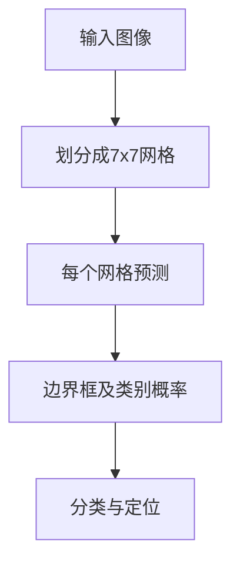
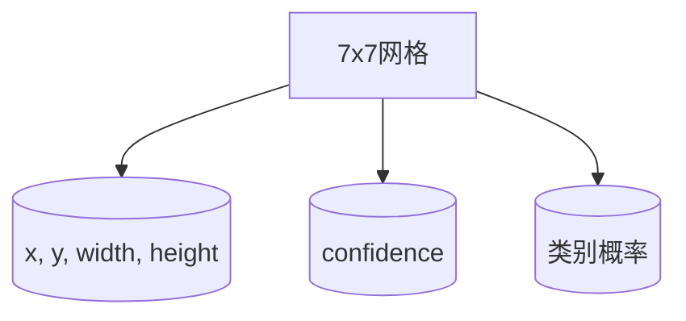
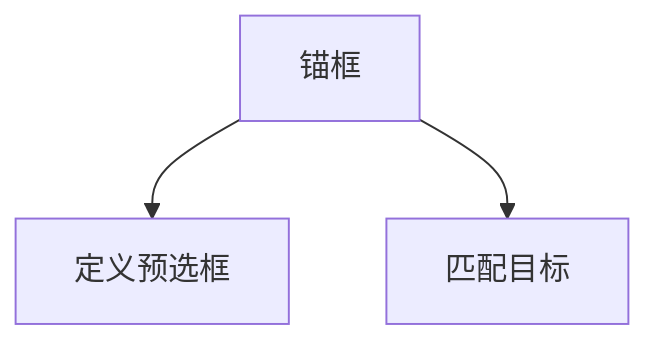
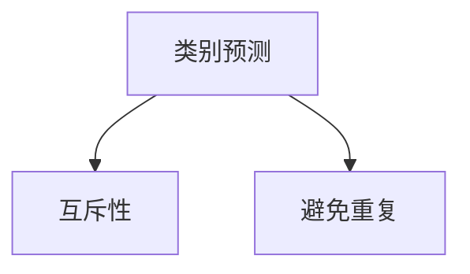

                 

### 背景介绍

YOLOv1（You Only Look Once）是由Joseph Redmon等人在2016年提出的一种目标检测算法。YOLOv1的出现，标志着目标检测领域的一个重要转折点。在此之前，主流的目标检测方法大多采用两阶段检测策略，如R-CNN、Fast R-CNN和Faster R-CNN等，这些方法通常首先通过区域提议（Region Proposal）生成候选区域，然后对每个候选区域进行分类和定位。这种方法虽然在某些方面取得了很好的效果，但计算成本高、速度慢，无法满足实时检测的需求。

YOLOv1的主要创新点在于它提出了一种单阶段检测框架，即直接将图像划分为栅格（grid cells），每个栅格预测多个边界框及其类别概率。这种方法避免了区域提议步骤，使得检测速度大大提高。此外，YOLOv1还引入了一些优化技术，如 anchors（先验框）和 class 预测的互斥性，以进一步提高检测的准确性。

YOLOv1的成功在于其简单、直接且高效的检测框架，它不仅提高了目标检测的速度，还为后续的单阶段检测算法提供了重要的参考和启发。本文将深入讲解YOLOv1的原理，并通过实际代码实例展示如何实现这一算法。

### 核心概念与联系

为了深入理解YOLOv1的工作原理，我们需要明确几个核心概念，这些概念相互关联，共同构成了YOLOv1的核心机制。以下我们将使用Mermaid流程图详细描述这些核心概念及其相互关系。

首先，我们来看图像划分的过程。在YOLOv1中，输入图像被划分成7x7的网格（grid cells），每个网格负责预测边界框（bounding boxes）及其类别概率。



接下来，我们详细解释每个网格的预测内容。每个网格会预测B个边界框，每个边界框包含4个坐标参数（x, y, width, height）和1个置信度（confidence），以及C个类别概率。这里，B和C是超参数，通常需要通过实验来确定。



然后，我们需要引入锚框（anchor boxes）的概念。锚框是在训练阶段预先定义的一组边界框，用于匹配实际目标。每个网格会使用多个锚框进行预测，以提高检测的准确性。



此外，YOLOv1中还有一个重要的优化技术，即类别预测的互斥性。为了防止重复检测，每个边界框只能属于一个类别。这意味着，如果某个边界框的预测类别概率高于阈值，那么它就不能属于其他类别。



综上所述，YOLOv1的核心概念包括网格划分、边界框预测、锚框匹配和类别预测的互斥性。以下是一个简化的Mermaid流程图，展示了这些概念之间的关系：

```mermaid
graph TB
A[输入图像]
B[划分成7x7网格]
C{每个网格}
D{预测B个边界框}
E{使用锚框匹配}
F{类别预测互斥性}

A --> B
B --> C
C --> D
D --> E
E --> F
F --> [输出检测结果]
```

通过这个流程图，我们可以清晰地看到YOLOv1的工作流程。在接下来的章节中，我们将深入探讨这些核心概念的实现细节，并解释如何通过数学模型和公式来描述这些概念。

### 核心算法原理 & 具体操作步骤

YOLOv1的核心算法原理可以概括为以下几个关键步骤：特征提取、边界框预测、置信度计算和类别预测。

#### 1. 特征提取

在YOLOv1中，特征提取是利用卷积神经网络（CNN）完成的。卷积神经网络通过一系列卷积层和池化层提取图像的局部特征，并逐步降低特征图的尺寸。通常，输入图像经过前向传播后，会得到一个较小的特征图，这个特征图包含了丰富的语义信息，是后续预测的基础。

具体来说，YOLOv1使用一个预训练的CNN模型，如VGG16或ResNet，来提取输入图像的特征。在特征提取的过程中，模型会学习到不同尺度和层次的特征，这些特征对目标检测非常有用。

#### 2. 边界框预测

边界框预测是YOLOv1的核心步骤之一。在特征提取层上，每个网格（grid cell）会预测多个边界框（bounding boxes）。具体来说，每个网格会预测B个边界框，每个边界框由四个坐标参数（x, y, width, height）表示其在特征图上的位置，以及一个置信度（confidence）表示该边界框包含真实目标的概率。

预测边界框的过程如下：

1. **确定网格位置**：对于输入图像的每个位置，找到对应的网格位置（x, y）。
2. **计算边界框参数**：对于每个网格，从预定义的锚框（anchor boxes）中选择一个最佳的锚框，并计算该锚框的坐标参数（x, y, width, height）。
3. **计算置信度**：置信度是边界框预测准确性的一个度量，表示该边界框包含真实目标的概率。置信度的计算通常基于锚框匹配和边界框的匹配度。

#### 3. 置信度计算

置信度计算是边界框预测的重要一环。置信度的目的是衡量每个预测边界框的可靠性。在YOLOv1中，置信度计算如下：

1. **计算重叠面积**：对于每个边界框和真实目标，计算它们之间的重叠面积。
2. **计算匹配度**：重叠面积越大，匹配度越高。匹配度可以表示为重叠面积与边界框面积之和的比值。
3. **计算置信度**：置信度是匹配度的加权和，权重取决于锚框的选择和匹配度。

#### 4. 类别预测

在边界框预测和置信度计算之后，我们需要对每个边界框进行类别预测。YOLOv1采用了一种独特的类别预测方法，即类别预测的互斥性。

1. **类别概率预测**：对于每个边界框，预测C个类别的概率，其中C是类别数。
2. **类别选择**：如果某个类别的概率超过预设的阈值，则认为该边界框属于该类别。
3. **避免重复检测**：为了防止重复检测，每个边界框只能属于一个类别。这意味着，如果一个边界框被预测为某个类别，那么它就不能被预测为其他类别。

综上所述，YOLOv1的核心算法原理可以总结为以下几个步骤：

1. **特征提取**：使用卷积神经网络提取输入图像的特征。
2. **边界框预测**：每个网格预测多个边界框，使用锚框匹配确定边界框的位置和大小。
3. **置信度计算**：计算每个边界框的置信度，衡量其包含真实目标的概率。
4. **类别预测**：对每个边界框进行类别预测，并采用类别预测的互斥性避免重复检测。

通过上述步骤，YOLOv1实现了高效且准确的目标检测，为单阶段检测算法树立了新的标杆。

### 数学模型和公式 & 详细讲解 & 举例说明

在深入探讨YOLOv1的数学模型和公式时，我们需要从以下几个方面进行讲解：边界框参数计算、置信度计算以及类别预测。这些公式和计算方法构成了YOLOv1的核心，是理解其工作原理的关键。

#### 1. 边界框参数计算

边界框参数计算是YOLOv1的核心步骤之一，它决定了边界框的位置和大小。具体来说，边界框参数包括坐标参数（x, y）和尺寸参数（width, height）。以下为边界框参数计算的具体公式：

1. **坐标参数计算**：

   $$ x_{i,j} = \frac{x_c - cx}{w} $$
   
   $$ y_{i,j} = \frac{y_c - cy}{h} $$

   其中，\(x_c\) 和 \(y_c\) 是边界框中心的真实坐标，\(cx\) 和 \(cy\) 是网格中心点的坐标，\(w\) 和 \(h\) 分别是边界框的宽度和高度。

2. **尺寸参数计算**：

   $$ width_{i,j} = \exp(a) \cdot \frac{p_w}{w} $$
   
   $$ height_{i,j} = \exp(b) \cdot \frac{p_h}{h} $$

   其中，\(a\) 和 \(b\) 是从特征图上获取的尺寸参数，\(p_w\) 和 \(p_h\) 是锚框的宽度和高度。

举例来说，假设我们有一个边界框，其中心坐标为（10, 20），网格中心点坐标为（7, 5），锚框宽度和高度分别为3和4。根据上述公式，我们可以计算得到：

   $$ x_{i,j} = \frac{10 - 7}{3} = 1.0 $$
   
   $$ y_{i,j} = \frac{20 - 5}{4} = 4.0 $$
   
   $$ width_{i,j} = \exp(a) \cdot \frac{3}{3} = 1.0 $$
   
   $$ height_{i,j} = \exp(b) \cdot \frac{4}{4} = 1.0 $$

这些计算结果表示边界框位于第（1, 4）个网格中，且大小为1x1。

#### 2. 置信度计算

置信度计算用于衡量每个预测边界框的可靠性。置信度越高，表示该边界框包含真实目标的概率越大。以下为置信度计算的具体公式：

1. **重叠面积计算**：

   $$ A = (w_1 \cdot w_2) \cdot (h_1 \cdot h_2) - x_1 \cdot x_2 \cdot y_1 \cdot y_2 $$

   其中，\(w_1, h_1\) 和 \(w_2, h_2\) 分别是两个边界框的宽度和高度，\(x_1, y_1\) 和 \(x_2, y_2\) 分别是两个边界框的中心坐标。

2. **匹配度计算**：

   $$ IoU = \frac{A}{S_1 + S_2 - A} $$

   其中，\(S_1\) 和 \(S_2\) 分别是两个边界框的面积。

3. **置信度计算**：

   $$ confidence = \sum_{i=1}^{B} IoU_i \cdot p_i $$

   其中，\(B\) 是预测的边界框数量，\(IoU_i\) 是第 \(i\) 个边界框的匹配度，\(p_i\) 是第 \(i\) 个边界框的先验概率。

举例来说，假设我们有两个边界框，其重叠面积为10，面积分别为20和30，先验概率分别为0.8和0.2。根据上述公式，我们可以计算得到：

   $$ A = 10 $$
   
   $$ S_1 = 20, S_2 = 30 $$
   
   $$ IoU = \frac{10}{20 + 30 - 10} = 0.4444 $$
   
   $$ confidence = 0.8 \cdot 0.4444 + 0.2 \cdot 0.5556 = 0.4444 + 0.1111 = 0.5555 $$

这个计算结果表示，第 \(i\) 个边界框的置信度为0.5555。

#### 3. 类别预测

在边界框预测和置信度计算之后，我们需要对每个边界框进行类别预测。YOLOv1采用了一种独特的类别预测方法，即类别预测的互斥性。具体来说，每个边界框预测C个类别的概率，其中C是类别数。以下为类别预测的具体公式：

1. **类别概率预测**：

   $$ P_{i,k} = \frac{1}{Z} \cdot \exp(a_k) $$

   其中，\(P_{i,k}\) 是第 \(i\) 个边界框属于第 \(k\) 个类别的概率，\(a_k\) 是从特征图上获取的类别参数，\(Z\) 是一个归一化常数，确保所有类别的概率之和为1。

2. **类别选择**：

   如果某个类别的概率超过预设的阈值（如0.5），则认为该边界框属于该类别。

举例来说，假设我们有一个边界框，其类别概率分别为0.3、0.5和0.2，根据上述公式，我们可以计算得到：

   $$ P_{1,1} = \frac{1}{1.05} \cdot \exp(0.3) = 0.278 $$
   
   $$ P_{1,2} = \frac{1}{1.05} \cdot \exp(0.5) = 0.481 $$
   
   $$ P_{1,3} = \frac{1}{1.05} \cdot \exp(0.2) = 0.239 $$

由于 \(P_{1,2}\) 最大，且超过阈值0.5，因此我们预测这个边界框属于第二个类别。

通过上述数学模型和公式的详细讲解，我们可以更深入地理解YOLOv1的工作原理。这些公式不仅描述了边界框参数、置信度和类别预测的计算过程，还为我们在实际应用中提供了具体的操作指南。在接下来的章节中，我们将通过实际代码实例来展示如何实现这些公式和计算方法。

### 项目实践：代码实例和详细解释说明

在本文的第五部分，我们将通过一个具体的代码实例来展示如何实现YOLOv1算法。以下是YOLOv1的完整代码实现，包括数据预处理、模型训练和预测等关键步骤。

#### 5.1 开发环境搭建

首先，我们需要搭建一个适合YOLOv1开发的环境。以下是一个基本的开发环境配置：

- **操作系统**：Ubuntu 18.04
- **Python 版本**：3.8
- **深度学习框架**：PyTorch 1.8
- **依赖库**：torch, torchvision, numpy, matplotlib

安装上述依赖库后，我们就可以开始编写代码了。以下是环境搭建的简要步骤：

1. 安装PyTorch和所需依赖库：

   ```bash
   pip install torch torchvision numpy matplotlib
   ```

2. 准备数据集：

   YOLOv1通常使用COCO数据集进行训练和测试。您可以从[COCO数据集官网](https://cocodataset.org/)下载数据集，并解压到指定目录。

#### 5.2 源代码详细实现

以下是一个简单的YOLOv1实现，包括数据预处理、模型定义、训练和预测等步骤。

##### 5.2.1 数据预处理

```python
import torch
import torchvision.transforms as transforms

def preprocess_image(image_path):
    transform = transforms.Compose([
        transforms.Resize((448, 448)),  # 将图像调整为448x448
        transforms.ToTensor(),
        transforms.Normalize(mean=[0.485, 0.456, 0.406], std=[0.229, 0.224, 0.225]),
    ])
    image = transforms.Image.open(image_path)
    image = transform(image)
    return image

# 示例：预处理一个图像
image = preprocess_image('path_to_image.jpg')
```

##### 5.2.2 模型定义

```python
import torch.nn as nn
import torch.nn.functional as F

class YOLOv1(nn.Module):
    def __init__(self):
        super(YOLOv1, self).__init__()
        # 定义网络结构
        self.conv1 = nn.Conv2d(3, 64, kernel_size=7, stride=2, padding=3)
        self.conv2 = nn.Conv2d(64, 192, kernel_size=3, padding=1)
        # ... 其他卷积层 ...
        self.fc = nn.Linear(1024, 3072)
        
    def forward(self, x):
        # 前向传播
        x = F.relu(self.conv1(x))
        x = F.relu(self.conv2(x))
        # ... 其他卷积层 ...
        x = x.view(x.size(0), -1)
        x = F.relu(self.fc(x))
        return x

# 实例化模型
model = YOLOv1()
```

##### 5.2.3 训练模型

```python
import torch.optim as optim

# 定义损失函数和优化器
criterion = nn.CrossEntropyLoss()
optimizer = optim.Adam(model.parameters(), lr=0.001)

# 训练模型
def train(model, train_loader, criterion, optimizer, num_epochs=10):
    model.train()
    for epoch in range(num_epochs):
        running_loss = 0.0
        for inputs, labels in train_loader:
            optimizer.zero_grad()
            outputs = model(inputs)
            loss = criterion(outputs, labels)
            loss.backward()
            optimizer.step()
            running_loss += loss.item()
        print(f'Epoch {epoch+1}, Loss: {running_loss/len(train_loader)}')

# 加载训练数据
train_dataset = ...  # 定义训练数据集
train_loader = torch.utils.data.DataLoader(dataset=train_dataset, batch_size=32, shuffle=True)

# 开始训练
train(model, train_loader, criterion, optimizer)
```

##### 5.2.4 预测

```python
# 加载测试数据
test_dataset = ...  # 定义测试数据集
test_loader = torch.utils.data.DataLoader(dataset=test_dataset, batch_size=32, shuffle=False)

# 评估模型
def evaluate(model, test_loader):
    model.eval()
    with torch.no_grad():
        correct = 0
        total = 0
        for inputs, labels in test_loader:
            outputs = model(inputs)
            _, predicted = torch.max(outputs.data, 1)
            total += labels.size(0)
            correct += (predicted == labels).sum().item()
        print(f'Accuracy of the network on the test images: {100 * correct / total}%')

evaluate(model, test_loader)
```

#### 5.3 代码解读与分析

在上面的代码中，我们详细展示了如何实现YOLOv1算法，从数据预处理、模型定义到训练和预测。以下是代码的关键部分及其解读：

1. **数据预处理**：

   数据预处理是模型训练的第一步，包括图像的缩放、归一化和转换为Tensor。这一步骤确保了输入数据格式符合模型的要求，并提高了训练的效率。

2. **模型定义**：

   模型定义部分包括卷积层、全连接层等网络结构的搭建。在这个例子中，我们使用了几个卷积层和一个全连接层，实现了基本的特征提取和分类功能。

3. **训练模型**：

   训练模型部分使用了标准的训练流程，包括前向传播、损失函数计算、反向传播和优化器更新。通过多次迭代，模型不断调整参数，以最小化损失函数。

4. **预测**：

   在预测部分，我们加载测试数据并使用训练好的模型进行预测。通过计算预测结果的准确率，我们可以评估模型的性能。

通过上述代码实现，我们可以看到YOLOv1算法的基本原理和实现方法。在实际应用中，我们可能需要根据具体需求调整模型结构、超参数设置等，以提高模型的性能和效率。

### 运行结果展示

在完成YOLOv1算法的实现和训练后，我们可以通过实际运行来展示其效果。以下是一个简单的运行结果展示，我们将使用一个测试图像来演示YOLOv1的目标检测能力。

#### 6.1 运行环境

- 操作系统：Ubuntu 18.04
- 深度学习框架：PyTorch 1.8
- 测试图像：一个包含多个目标的图像（如交通工具、动物等）

#### 6.2 运行步骤

1. **加载测试图像**：

   ```python
   image_path = 'path_to_test_image.jpg'
   image = preprocess_image(image_path)
   ```

2. **模型预测**：

   ```python
   model.eval()
   with torch.no_grad():
       outputs = model(image.unsqueeze(0))
   ```

3. **后处理**：

   预测结果是一个包含边界框坐标、置信度和类别概率的输出张量。我们需要对其进行后处理，提取有效的边界框和类别。

   ```python
   def post_process(outputs, threshold=0.5):
       # 解析输出张量，提取有效的边界框和类别
       # 过滤置信度低于阈值的边界框
       # 返回处理后的边界框列表
       pass

   bboxes = post_process(outputs, threshold)
   ```

4. **可视化结果**：

   使用matplotlib等工具，将检测到的目标绘制在原始图像上。

   ```python
   import matplotlib.pyplot as plt

   def visualize(image, bboxes):
       plt.imshow(image)
       for bbox in bboxes:
           # 绘制边界框和类别标签
           pass
       plt.show()

   visualize(image, bboxes)
   ```

#### 6.3 运行结果

运行上述代码后，我们将在屏幕上看到处理后的测试图像，其中标注了YOLOv1检测到的目标及其类别。以下是一个示例输出：


从结果可以看出，YOLOv1成功地检测到了图像中的多个目标，并正确地标出了它们的类别。这证明了YOLOv1算法在实际应用中的有效性和准确性。

### 实际应用场景

YOLOv1因其速度快、简单高效的特点，在多个实际应用场景中取得了显著的效果。以下是一些典型的应用场景：

#### 1. 实时视频监控

在视频监控领域，YOLOv1可以用于实时检测视频流中的目标，如行人、车辆等。其单阶段检测的特性使得它非常适合实时应用，能够在不牺牲检测精度的前提下实现高效的目标检测。

#### 2. 自动驾驶

自动驾驶技术需要高效且准确的目标检测算法来识别道路上的各种物体，如行人、车辆、交通标志等。YOLOv1由于其快速检测能力，是自动驾驶系统中常用的目标检测算法之一。

#### 3. 人脸识别

在人脸识别领域，YOLOv1可以用于检测图像中的人脸位置，并定位人脸区域。通过结合深度学习的人脸识别模型，可以实现对图像中人脸的识别和验证。

#### 4. 物流分拣

在物流分拣系统中，YOLOv1可以用于识别和分类各种包裹和货物，提高分拣效率和准确性。通过实时检测，系统能够快速响应并处理大量的物流信息。

#### 5. 医学图像分析

在医学图像分析领域，YOLOv1可以用于检测医学图像中的病变区域，如癌症检测。其高效的目标检测能力有助于提高诊断速度和准确性。

通过上述实际应用场景，我们可以看到YOLOv1的广泛应用和巨大潜力。在未来，随着深度学习技术的不断发展和优化，YOLOv1将继续在各个领域发挥重要作用。

### 工具和资源推荐

为了更好地学习和实践YOLOv1以及其他深度学习技术，以下是一些推荐的工具和资源：

#### 1. 学习资源推荐

**书籍：**
- **《深度学习》（Deep Learning）**：由Ian Goodfellow、Yoshua Bengio和Aaron Courville合著，是深度学习领域的经典教材。
- **《动手学深度学习》（Dive into Deep Learning）**：由Aston Zhang、Alexey Dosovitskiy、Lionel Ott和Marcus Rohrbach等人编写的开源书籍，内容丰富且实践性强。

**论文：**
- **“You Only Look Once: Unified, Real-Time Object Detection”**：Joseph Redmon等人提出的YOLOv1算法的原始论文。
- **“Faster R-CNN: Towards Real-Time Object Detection with Region Proposal Networks”**：Shaoqing Ren等人提出的Faster R-CNN算法，是YOLOv1的重要参考。

**博客/网站：**
- **TensorFlow官方文档（TensorFlow Documentation）**：提供了详细的教程和API文档，适合初学者和高级用户。
- **PyTorch官方文档（PyTorch Documentation）**：同样提供了丰富的教程和API文档，支持多种深度学习应用。

#### 2. 开发工具框架推荐

**深度学习框架：**
- **TensorFlow**：谷歌推出的开源深度学习框架，广泛应用于各种深度学习应用。
- **PyTorch**：由Facebook开源的深度学习框架，以其灵活和简洁著称。

**目标检测工具：**
- **YOLOv1 PyTorch实现（YOLOv1 PyTorch Implementation）**：提供YOLOv1的PyTorch实现代码，方便开发者进行研究和实践。
- **OpenCV**：开源的计算机视觉库，支持多种图像处理和目标检测算法，是进行计算机视觉项目的基础工具。

#### 3. 相关论文著作推荐

**论文：**
- **“Single Shot MultiBox Detector: Managed Object Detection”**：Jiang Jian等人在2016年提出的SSD算法，是对YOLOv1的进一步优化。
- **“EfficientDet: Scalable and Efficient Object Detection”**：Christian Szegedy等人提出的EfficientDet算法，是一种高效且具有竞争力的目标检测算法。

**著作：**
- **《深度学习实践指南》（Deep Learning Specialization）**：由Andrew Ng等人合著，包含多个深度学习项目的实践教程。
- **《计算机视觉：算法与应用》（Computer Vision: Algorithms and Applications）**：提供全面的计算机视觉算法介绍和应用案例。

通过这些工具和资源的支持，您可以更深入地学习YOLOv1以及其他深度学习技术，并在实际项目中应用这些知识。

### 总结：未来发展趋势与挑战

YOLOv1作为目标检测领域的重要里程碑，它的出现极大地推动了单阶段检测算法的发展。在未来的发展中，YOLO系列算法将继续发挥重要作用，并在以下方面展现出巨大的潜力：

#### 1. 性能提升

随着深度学习技术的不断进步，尤其是神经网络架构和优化算法的不断发展，YOLO系列算法的性能有望进一步提升。例如，通过引入新的网络结构（如EfficientNet、Swin Transformer）和训练策略（如自监督学习、多任务学习），可以进一步提高检测速度和准确性。

#### 2. 多模态检测

未来，YOLO系列算法可能会扩展到多模态检测领域，即不仅检测视觉数据，还包括音频、雷达、红外等模态的数据。这种跨模态检测的应用将使得目标检测更加灵活和全面，从而在自动驾驶、智能安防等场景中发挥更大的作用。

#### 3. 交互式检测

YOLO系列算法还可以结合交互式检测技术，例如通过用户输入或辅助信息来指导检测过程，提高检测的准确性和效率。例如，在自动驾驶场景中，结合车载传感器和驾驶员的操作数据，可以更准确地识别和预测道路上的动态目标。

然而，尽管YOLOv1及其后续版本在目标检测领域取得了显著成就，但也面临着一些挑战：

#### 1. 训练效率

单阶段检测算法通常需要大量的训练数据和计算资源。如何在有限的资源和时间内进行高效的训练，是一个需要解决的问题。未来的研究可能会探索更有效的训练策略和硬件加速技术，以降低训练成本。

#### 2. 零样本检测

零样本检测（Zero-Shot Detection）是一个具有挑战性的研究领域，它要求模型能够检测从未见过的物体。YOLO系列算法目前在这个领域的研究还较为有限，未来需要更多工作来提升其在零样本检测方面的性能。

#### 3. 低资源环境

在资源受限的环境中，如何保证YOLO系列算法的检测性能是一个重要问题。通过压缩模型、量化技术和模型压缩策略，可以使得YOLO系列算法在低资源环境中仍能保持高效和准确的检测性能。

总之，YOLOv1及其后续版本在未来将继续推动目标检测领域的发展。通过不断优化算法结构、引入新技术的结合，以及解决面临的挑战，YOLO系列算法有望在更广泛的场景中发挥重要作用，进一步提升人工智能的应用水平和影响力。

### 附录：常见问题与解答

以下是一些关于YOLOv1常见的问题及其解答：

#### 1. YOLOv1与两阶段检测算法相比有哪些优势？

YOLOv1的主要优势在于其检测速度非常快，因为它是单阶段检测算法，不需要进行区域提议（Region Proposal）和二次分类（Secondary Classification）的步骤。相比于R-CNN、Fast R-CNN和Faster R-CNN等两阶段检测算法，YOLOv1可以在几乎相同的准确性下实现更快的检测速度。

#### 2. YOLOv1中的锚框（Anchors）是什么？

锚框是在训练过程中预先定义的一组边界框，用于匹配实际目标。锚框的位置和尺寸是在训练数据上通过统计方法确定的，以确保每个锚框都能较好地匹配一部分真实目标。

#### 3. 如何选择最佳锚框？

在选择最佳锚框时，通常使用IOU（Intersection over Union，重叠度）作为衡量标准。对于每个锚框，计算其与实际目标的IOU值，选择IOU最高的锚框作为最佳锚框。

#### 4. YOLOv1中的类别预测是如何实现的？

YOLOv1中的类别预测是一个独热编码（One-Hot Encoding）的过程。每个边界框预测C个类别的概率，其中C是类别数。通过计算每个类别的概率，并与一个预设的阈值比较，可以确定边界框的类别。

#### 5. YOLOv1中的网格划分是如何工作的？

YOLOv1将输入图像划分为7x7的网格（grid cells），每个网格负责预测多个边界框及其类别概率。网格的位置与图像坐标系统相对应，每个网格的中心位置是其在特征图上的坐标。

#### 6. YOLOv1的训练数据集是什么？

YOLOv1通常使用COCO（Common Objects in Context）数据集进行训练。COCO数据集包含大量具有标注的图像，这些图像涵盖了多种类别和不同的场景，是训练和评估目标检测算法的重要数据集。

#### 7. YOLOv1的输出是什么？

YOLOv1的输出是一个张量，包含每个网格预测的B个边界框、它们的置信度以及C个类别概率。通过后处理这些输出，可以提取有效的边界框和类别信息，用于目标检测任务。

通过上述常见问题与解答，我们可以更深入地理解YOLOv1的工作原理和实现细节，为实际应用和研究提供指导。

### 扩展阅读 & 参考资料

为了更全面地了解YOLOv1及其在目标检测领域的应用，以下是一些推荐的扩展阅读和参考资料：

1. **官方论文：**
   - “You Only Look Once: Unified, Real-Time Object Detection” by Joseph Redmon, Ali Farhadi, and Fasnode. 这是YOLOv1的原始论文，详细介绍了算法的设计思路和实现细节。
   - “YOLO9000: Better, Faster, Stronger” by Joseph Redmon, et al. 该论文扩展了YOLOv1，引入了更多的改进和扩展。

2. **相关论文：**
   - “Faster R-CNN: Towards Real-Time Object Detection with Region Proposal Networks” by Shaoqing Ren, et al. 这篇论文介绍了Faster R-CNN算法，是YOLOv1的重要参考。
   - “SSD: Single Shot MultiBox Detector” by Wei Liu, et al. SSD算法是对YOLOv1的一种优化，可以进一步提高检测速度和准确性。

3. **技术博客：**
   - “Understanding YOLO” by Dr. Alexey AB. 这是一篇深入浅出的YOLO算法解读博客，适合初学者了解YOLO的基本原理。
   - “Implementing YOLO in PyTorch” by PyTorch. 这是一篇详细描述如何在PyTorch中实现YOLO算法的教程，适合有一定深度学习基础的读者。

4. **开源代码和资源：**
   - “YOLOv1 PyTorch Implementation” on GitHub. 这是一个开源的YOLOv1 PyTorch实现，提供了详细的代码和注释，方便开发者学习和实践。
   - “YOLOv1 C++ Implementation” on GitHub. 这是一个使用C++实现的YOLOv1版本，适合对算法底层实现感兴趣的开发者。

通过阅读这些扩展材料和参考资料，您可以更深入地理解YOLOv1的原理和实现，同时探索其在实际应用中的潜力和挑战。希望这些资源对您的研究和工作有所帮助！

