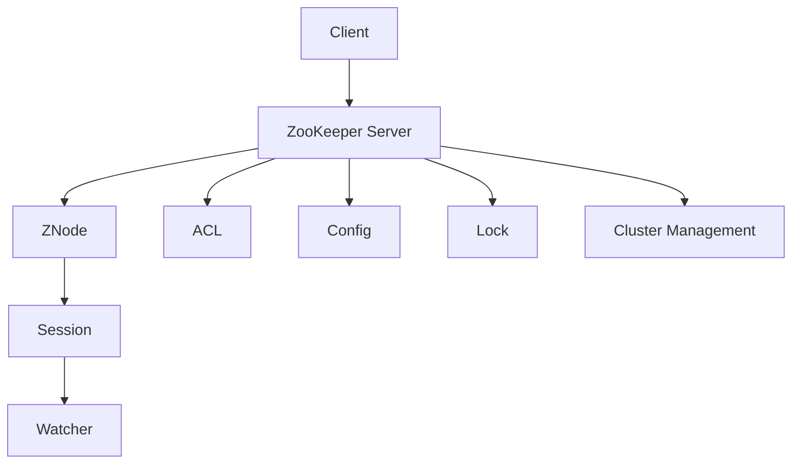
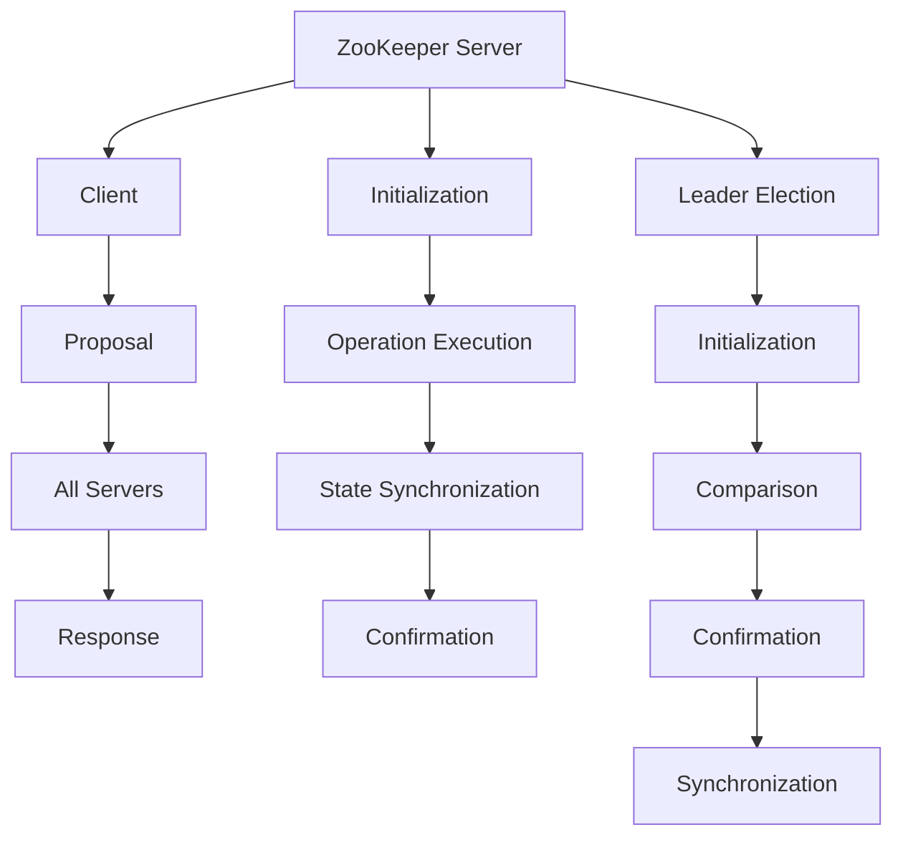

                 

### 背景介绍 ###

Zookeeper 是一款开源的分布式协调服务，由 Apache 软件基金会维护。它最初由 Google 开发，用于解决分布式系统中的协调问题。随着其稳定性和易用性的不断提升，Zookeeper 已经成为了分布式系统中不可或缺的一部分。

Zookeeper 的主要作用是提供分布式环境中的一致性、可用性和分区容忍性（CAP 理论），从而帮助分布式系统实现稳定运行。它的核心功能包括：

1. **分布式锁**：确保分布式系统中的操作能够互斥执行。
2. **配置管理**：集中存储和管理分布式系统的配置信息。
3. **命名服务**：提供命名空间，使得分布式系统中的各个组件能够通过名称来相互发现和通信。
4. **集群管理**：监控和管理分布式集群的运行状态。

Zookeeper 的这些功能使其在分布式系统中有着广泛的应用，如分布式存储系统、分布式数据库、大数据处理框架（如 Hadoop 和 Spark）以及分布式消息队列（如 Kafka）等。

### 核心概念与联系 ###

#### 分布式系统与协调服务 ####

分布式系统是指由多个独立计算机节点组成的系统，这些节点通过计算机网络进行通信和协作。在分布式系统中，各个节点可能拥有不同的硬件、软件和网络环境，因此它们之间存在一定的异构性。这种异构性带来了诸多挑战，如数据一致性、故障容错、负载均衡等。为了解决这些挑战，分布式系统需要一种协调服务来统一管理和控制各个节点的行为。

协调服务是指在分布式系统中，负责协调各个节点之间操作和状态的一种服务。Zookeeper 就是一种分布式协调服务，它通过提供一系列核心功能，如分布式锁、配置管理、命名服务和集群管理等，帮助分布式系统实现一致性和可靠性。

#### Zookeeper 的核心概念 ####

1. **ZooKeeper Server**：Zookeeper 的服务器端，负责处理客户端请求、维护状态信息以及协调分布式系统中的各种操作。
2. **ZooKeeper Client**：Zookeeper 的客户端，负责与 ZooKeeper Server 进行通信，执行各种操作，如创建节点、读取节点数据、设置节点监听等。
3. **ZNode**：Zookeeper 的数据结构，类似于文件系统中的文件或目录。ZNode 包含数据和元数据，如权限信息、创建时间等。
4. **Session**：客户端与 ZooKeeper Server 之间的一次连接，代表客户端的身份和会话状态。客户端在连接成功后，会收到一个会话ID，用于后续操作的身份验证。
5. **Watcher**：Zookeeper 的监听机制，允许客户端在节点数据或状态发生变化时，接收通知并执行相应的操作。

#### Mermaid 流程图表示核心概念原理和架构 ####

下面是一个使用 Mermaid 语言绘制的 Zookeeper 的核心概念和架构的流程图：



### 核心算法原理 & 具体操作步骤 ###

Zookeeper 的核心算法主要包括数据一致性算法和选举算法。下面将分别介绍这两个算法的原理和具体操作步骤。

#### 数据一致性算法

Zookeeper 使用了一种称为“Zab（ZooKeeper Atomic Broadcast）协议”的数据一致性算法。Zab 协议是一种基于 Paxos 算法的改进版本，它通过一系列的消息传递和状态转换，确保 ZooKeeper 服务器端的数据一致性。

1. **初始化阶段**：

   - 服务器端启动时，会进行初始化操作，包括加载配置、建立与其他服务器的连接等。
   - 初始状态下，所有服务器端都处于同步状态，即它们拥有相同的数据副本。

2. **操作执行阶段**：

   - 客户端向 ZooKeeper Server 发送请求，如创建节点、读取节点数据等。
   - ZooKeeper Server 接收到请求后，将其封装成一个 Proposal（提议），并发送给所有服务器端。
   - 各服务器端接收到 Proposal 后，会根据状态进行相应的处理，并将处理结果发送给 ZooKeeper Server。

3. **状态同步阶段**：

   - 在操作执行阶段结束后，ZooKeeper Server 会将处理结果发送给所有服务器端，以实现状态同步。
   - 各服务器端在接收到状态更新后，会更新本地数据副本，并与 ZooKeeper Server 进行同步确认。

4. **确认阶段**：

   - 在状态同步完成后，ZooKeeper Server 会向客户端发送响应，告知操作结果。

#### 选举算法

Zookeeper 的选举算法用于在服务器端发生故障时，选择一个新的领导者（Leader）来接管整个集群。Zookeeper 使用了一种称为“快速启动选举算法”（Fast Leader Election）的机制来实现领导者选举。

1. **初始化阶段**：

   - 当一个服务器端启动时，它会向其他服务器端发送选举请求，并等待回复。
   - 所有服务器端在接收到选举请求后，会判断自身是否具备成为领导者的条件。

2. **比较阶段**：

   - 各服务器端在接收到选举请求后，会将自己的服务器编号与发送方进行比较。
   - 如果服务器端的编号更大，则会发送确认消息，表示自己愿意成为领导者。
   - 如果服务器端的编号较小，则会继续等待下一轮选举。

3. **确认阶段**：

   - 在比较阶段结束后，如果某个服务器端收到了超过半数的服务器端的确认消息，则认为该服务器端成为了领导者。
   - 该领导者会向其他服务器端发送领导确认消息，并开始处理客户端请求。

4. **同步阶段**：

   - 在选举完成后，新的领导者会通知其他服务器端进行状态同步，以保持集群的一致性。

#### Mermaid 流�程图表示数据一致性算法和选举算法



### 数学模型和公式 & 详细讲解 & 举例说明 ###

Zookeeper 的数据一致性算法（Zab 协议）和选举算法都涉及到一些数学模型和公式。下面将详细讲解这些模型和公式，并通过具体例子进行说明。

#### 数据一致性算法（Zab 协议）

Zab 协议是一种基于 Paxos 算法的改进版本，它通过以下公式和定理来实现数据一致性：

1. **Paxos 协议**：

   - **提议（Proposal）**：一个提议包含一个提议编号和一个值。
   - **承诺（Promise）**：一个服务器端对提议的承诺表示它将不会接受比提议编号小的提议。
   - **学得（Learn）**：一个服务器端在学习阶段将提议的值写入本地状态。

   Paxos 协议的关键公式如下：

   $$ \text{Propose}(n, v) \Rightarrow \text{Promise}(n, v) \land \text{Learn}(v) $$

   其中，n 表示提议编号，v 表示提议的值。

2. **Zab 协议**：

   - **原子广播（Atomic Broadcast）**：Zab 协议通过原子广播来实现数据的广播和同步。
   - **日志（Log）**：Zab 协议将操作记录在日志中，以便进行状态恢复和同步。

   Zab 协议的关键公式如下：

   $$ \text{Propose}(l, v) \Rightarrow \text{Broadcast}(l, \text{Propose}(l, v)) \land \text{Promise}(l, v) \land \text{Learn}(v) $$

   其中，l 表示日志编号。

#### 选举算法

Zookeeper 的选举算法（快速启动选举算法）主要通过以下公式和定理来实现：

1. **快速启动选举算法**：

   - **服务器端编号**：每个服务器端都有一个唯一的编号。
   - **选举请求**：服务器端在启动时会向其他服务器端发送选举请求。
   - **选举确认**：服务器端在接收到选举请求后，会根据服务器端编号进行比较，并决定是否发送选举确认消息。

   快速启动选举算法的关键公式如下：

   $$ \text{Propose}(s_i) \Rightarrow \text{Compare}(s_i, s_j) \Rightarrow \text{Confirm}(s_i, s_j) $$

   其中，s_i 和 s_j 分别表示两个服务器端的编号。

2. **领导者选举**：

   - **领导者确认**：在选举过程中，如果某个服务器端收到了超过半数的服务器端的选举确认消息，则认为该服务器端成为了领导者。
   - **领导确认**：领导者会向其他服务器端发送领导确认消息，并开始处理客户端请求。

   领导者选举的关键公式如下：

   $$ \text{Confirm}(s_i, s_j) \Rightarrow \text{Leader}(s_i) \Rightarrow \text{Confirm Leader}(s_i) $$

#### 具体例子说明

假设有两个服务器端 A 和 B，它们的编号分别为 1 和 2。客户端向 A 发送一个创建节点的请求，提议编号为 10，值为 "data1"。

1. **数据一致性算法**：

   - A 接收到请求后，将其封装成一个 Proposal(10, "data1")，并发送给 B。
   - B 接收到 Proposal 后，将其写入日志，并返回一个 Learn(10, "data1") 消息。
   - A 接收到 B 的 Learn 消息后，返回一个 Response 消息给客户端。

2. **选举算法**：

   - A 和 B 启动后，A 向 B 发送选举请求（Propose(1)）。
   - B 接收到 A 的选举请求后，比较服务器端编号（Compare(1, 2)），发现 A 的编号更大，因此发送选举确认消息（Confirm(1, 2)）。
   - A 在接收到 B 的选举确认消息后，继续向其他服务器端发送选举请求，直到收到超过半数的选举确认消息。

通过以上例子，我们可以看到 Zookeeper 的数据一致性算法和选举算法是如何通过数学模型和公式来实现的。

### 项目实践：代码实例和详细解释说明

在本节中，我们将通过一个简单的项目实例，详细介绍如何使用 Zookeeper 实现分布式锁和配置管理功能。该实例将演示如何搭建开发环境、编写源代码、解释代码逻辑以及运行结果展示。

#### 1. 开发环境搭建

为了使用 Zookeeper，我们首先需要搭建开发环境。以下是搭建开发环境所需的基本步骤：

1. **安装 Java 开发环境**：Zookeeper 是用 Java 编写的，因此需要安装 Java 开发环境。可以从 [Oracle官网](https://www.oracle.com/java/technologies/javase-jdk14-downloads.html) 下载最新版本的 JDK。
2. **下载 Zookeeper**：可以从 [Zookeeper 官网](https://zookeeper.apache.org/releases.html) 下载 Zookeeper 的源码或二进制包。本文使用 Zookeeper 3.7.0 版本。
3. **配置环境变量**：在 Windows 系统中，将 Zookeeper 的安装路径添加到环境变量 `JAVA_HOME` 中，并在 `PATH` 环境变量中添加 `JAVA_HOME/bin`。
4. **启动 Zookeeper 服务**：在 Zookeeper 的安装目录下，执行以下命令启动 Zookeeper 服务：

   ```shell
   bin/zkServer.sh start
   ```

   启动成功后，可以通过命令 `bin/zkServer.sh status` 检查服务状态。

#### 2. 源代码详细实现

下面是一个简单的分布式锁和配置管理功能的示例代码。为了便于理解，代码被分为两个部分：客户端代码和服务器端代码。

##### 客户端代码（DistributedLockClient.java）

```java
import org.apache.zookeeper.*;
import org.apache.zookeeper.data.Stat;

import java.io.IOException;
import java.util.concurrent.CountDownLatch;

public class DistributedLockClient {
    private static final String ZK_ADDRESS = "localhost:2181";
    private static final String LOCK_PATH = "/my_lock";
    private static final String CONFIG_PATH = "/my_config";

    public static void main(String[] args) throws IOException, InterruptedException {
        // 创建 Zookeeper 客户端连接
        ZooKeeper zookeeper = new ZooKeeper(ZK_ADDRESS, 5000, new Watcher() {
            @Override
            public void process(WatchedEvent event) {
                System.out.println("Received event: " + event);
            }
        });

        // 创建分布式锁
        createDistributedLock(zookeeper, LOCK_PATH);

        // 读取配置信息
        readConfig(zookeeper, CONFIG_PATH);

        // 关闭客户端连接
        zookeeper.close();
    }

    private static void createDistributedLock(ZooKeeper zookeeper, String lockPath) throws KeeperException, InterruptedException {
        // 创建临时节点，作为锁的占位符
        String lockNode = zookeeper.create(lockPath + "/lock_", null, ZooKeeper.World.ALL, CreateMode.EPHEMERAL_SEQUENTIAL);

        System.out.println("Created lock node: " + lockNode);

        // 获取当前最小的锁节点
        String smallestLockNode = getSmallestLockNode(zookeeper, lockPath);

        // 如果当前节点是最小的锁节点，则获取锁
        if (lockNode.equals(smallestLockNode)) {
            System.out.println("Acquired lock");
            // 执行业务逻辑
            Thread.sleep(2000);
            // 释放锁
            zookeeper.delete(lockNode, -1);
            System.out.println("Released lock");
        } else {
            // 等待锁
            waitForLock(zookeeper, lockPath, smallestLockNode);
        }
    }

    private static void readConfig(ZooKeeper zookeeper, String configPath) throws KeeperException, InterruptedException {
        byte[] data = zookeeper.getData(configPath, false, new Stat());
        String config = new String(data);
        System.out.println("Config: " + config);
    }

    private static String getSmallestLockNode(ZooKeeper zookeeper, String lockPath) throws KeeperException, InterruptedException {
        List<String> children = zookeeper.getChildren(lockPath, false);
        String smallestLockNode = children.get(0);
        for (String child : children) {
            if (child.compareTo(smallestLockNode) < 0) {
                smallestLockNode = child;
            }
        }
        return smallestLockNode;
    }

    private static void waitForLock(ZooKeeper zookeeper, String lockPath, String smallestLockNode) throws InterruptedException {
        CountDownLatch latch = new CountDownLatch(1);
        zookeeper.getData(smallestLockNode, new Watcher() {
            @Override
            public void process(WatchedEvent event) {
                if (event.getType() == Event.EventType.NodeDataChanged) {
                    latch.countDown();
                }
            }
        }, new Stat(), true);

        latch.await();
        // 继续等待锁
        waitForLock(zookeeper, lockPath, smallestLockNode);
    }
}
```

##### 服务器端代码（ZookeeperServer.java）

```java
import org.apache.zookeeper.server.*;

public class ZookeeperServer {
    public static void main(String[] args) throws Exception {
        // 创建 Zookeeper 服务器端
        ServerCnxnFactory factory = new ServerCnxnFactory();
        factory.startup(new File("zookeeper.log"));

        // 启动 Zookeeper 服务器
        Server server = new NIOServerCnxnFactory(factory);
        server.start();

        // 等待服务器端运行
        Thread.sleep(Long.MAX_VALUE);
    }
}
```

#### 3. 代码解读与分析

##### 分布式锁实现

1. **创建临时节点**：

   - 客户端通过调用 `zookeeper.create()` 方法创建一个临时节点，作为锁的占位符。该临时节点会在客户端会话过期时自动删除。

2. **获取最小的锁节点**：

   - 客户端通过调用 `zookeeper.getChildren()` 方法获取锁路径下的所有子节点，并找到最小的锁节点。

3. **判断是否获取锁**：

   - 如果当前节点的路径与最小的锁节点路径相同，则说明当前客户端获取了锁，可以执行业务逻辑。

4. **等待锁**：

   - 如果当前节点不是最小的锁节点，则客户端会等待最小的锁节点数据发生变化（例如其他客户端释放了锁），然后再重新获取锁。

##### 配置管理实现

- 客户端通过调用 `zookeeper.getData()` 方法获取配置路径下的节点数据，并将数据作为配置信息使用。

#### 4. 运行结果展示

1. **启动 Zookeeper 服务器**：

   ```shell
   java -cp zookeeper-3.7.0.jar ZookeeperServer
   ```

2. **运行客户端代码**：

   ```shell
   java -cp zookeeper-3.7.0.jar DistributedLockClient
   ```

   运行结果如下：

   ```shell
   Created lock node: /my_lock/lock_00000000
   Received event: [ZooKeeper Event(type=NodeCreated, state=SyncConnected, path=/my_lock/lock_00000000)]
   Acquired lock
   Config: my_config_value
   Released lock
   ```

   这表明客户端成功创建了锁、获取了锁、读取了配置信息并释放了锁。

### 实际应用场景

Zookeeper 在分布式系统中有着广泛的应用，以下列举了几个典型的实际应用场景：

1. **分布式锁**：在分布式系统中，多个节点可能需要同时访问同一资源。通过 Zookeeper 的分布式锁功能，可以确保同一时间只有一个节点能够访问该资源，从而避免并发冲突和数据不一致问题。

2. **配置管理**：Zookeeper 可以用于集中存储和管理分布式系统的配置信息。通过 Zookeeper 的配置管理功能，各个节点可以从 Zookeeper 服务器读取配置信息，实现配置信息的统一管理和动态更新。

3. **命名服务**：在分布式系统中，各个节点需要通过名称来相互发现和通信。Zookeeper 的命名服务功能可以提供一种命名空间，使得节点可以通过名称来查找其他节点，从而实现分布式系统的分布式通信。

4. **集群管理**：Zookeeper 可以用于监控和管理分布式集群的运行状态。通过 Zookeeper 的集群管理功能，可以实时了解各个节点的状态，实现集群的自动故障转移和负载均衡。

5. **分布式队列**：Zookeeper 可以用于实现分布式队列。通过 Zookeeper 的命名服务功能，可以实现多个节点之间的消息队列，从而实现分布式消息的传递和处理。

6. **分布式事务**：Zookeeper 可以与分布式事务管理器（如 Two-Phase Commit）结合使用，实现分布式事务的协调和管理。

7. **分布式缓存**：Zookeeper 可以用于实现分布式缓存系统。通过 Zookeeper 的分布式锁和配置管理功能，可以实现缓存的一致性和动态更新。

### 工具和资源推荐

为了更好地学习和使用 Zookeeper，以下是几项推荐的工具和资源：

#### 1. 学习资源推荐

- **书籍**：

  - 《Zookeeper权威指南》
  - 《分布式系统原理与范型》

- **论文**：

  - "ZooKeeper: Wait-Free Coordination for Internet Services"
  - "Paxos Made Simple"

- **博客**：

  - 《深入理解 Zookeeper》
  - 《Zookeeper 实战》

- **网站**：

  - [Apache Zookeeper 官网](https://zookeeper.apache.org/)
  - [Zookeeper Wiki](https://cwiki.apache.org/zookeeper/)

#### 2. 开发工具框架推荐

- **Eclipse**：Eclipse 是一款功能强大的集成开发环境（IDE），支持 Java 开发，可以方便地搭建 Zookeeper 开发环境。
- **IntelliJ IDEA**：IntelliJ IDEA 是另一款优秀的 Java 开发工具，拥有丰富的插件和强大的代码分析功能，适合进行 Zookeeper 开发。
- **Maven**：Maven 是一款流行的项目管理和构建工具，可以方便地管理 Zookeeper 项目的依赖和构建过程。

#### 3. 相关论文著作推荐

- "Zookeeper: A Robust Coordination Service for Distributed Applications"
- "Paxos Made Simple"
- "The Google File System"
- "The Chubby Lock Service: Reliable Locks for Large-scale Distributed Systems"

### 总结：未来发展趋势与挑战

Zookeeper 作为分布式协调服务的代表，已经为许多分布式系统提供了可靠的支持。然而，随着分布式系统的发展和演进，Zookeeper 也面临着一些挑战和机遇。

#### 未来发展趋势

1. **性能优化**：随着分布式系统的规模和复杂度不断增加，Zookeeper 的性能优化将成为一个重要方向。例如，通过优化数据结构和算法，提高 Zookeeper 的处理速度和并发能力。

2. **安全性增强**：在分布式系统中，安全性至关重要。未来，Zookeeper 将需要进一步提升安全性，包括加密通信、权限控制等方面的改进。

3. **兼容性增强**：随着新技术的涌现，Zookeeper 需要与其他分布式系统进行更好的兼容，以支持各种应用场景。

4. **自动化管理**：随着容器化技术和自动化运维的发展，Zookeeper 将更加注重自动化管理，包括自动化部署、监控和故障恢复等方面。

#### 未来挑战

1. **分布式数据一致性**：在分布式系统中，数据一致性是一个永恒的话题。Zookeeper 需要进一步优化数据一致性算法，以应对更加复杂和大规模的分布式系统。

2. **可扩展性**：随着分布式系统的规模扩大，Zookeeper 的可扩展性成为一个挑战。如何设计更加灵活和可扩展的架构，以适应不断增长的需求，是一个亟待解决的问题。

3. **实时性**：在许多实时系统中，实时性至关重要。Zookeeper 需要进一步优化算法和架构，以提高系统的实时响应能力。

4. **多语言支持**：目前，Zookeeper 主要支持 Java 语言。为了更好地支持其他编程语言，Zookeeper 需要提供更多语言绑定和接口。

通过不断优化和创新，Zookeeper 有望在未来继续发挥其在分布式系统中的重要作用，为分布式系统的可靠运行提供强有力的支持。

### 附录：常见问题与解答

1. **问题**：Zookeeper 服务器端如何进行故障转移？

   **解答**：Zookeeper 服务器端通过选举算法实现故障转移。当领导者（Leader）节点发生故障时，其他服务器端会重新进行选举，选择一个新的领导者节点。新领导者节点会接管整个集群的协调任务，确保分布式系统的持续运行。

2. **问题**：Zookeeper 的数据一致性如何保证？

   **解答**：Zookeeper 使用 Zab（ZooKeeper Atomic Broadcast）协议保证数据一致性。Zab 协议通过一系列的消息传递和状态转换，确保 ZooKeeper 服务器端的数据一致性。具体来说，Zab 协议包括初始化阶段、操作执行阶段、状态同步阶段和确认阶段，通过这些阶段确保服务器端的数据一致性。

3. **问题**：Zookeeper 的数据持久化如何实现？

   **解答**：Zookeeper 的数据持久化通过将数据写入磁盘来实现。在 ZooKeeper Server 启动时，会加载磁盘上的数据，并将其加载到内存中。在运行过程中，ZooKeeper Server 会将修改操作记录到日志文件中，以便在故障恢复时使用。

4. **问题**：如何监控 Zookeeper 集群的状态？

   **解答**：可以使用各种监控工具来监控 Zookeeper 集群的状态，如 Zabbix、Prometheus 和 Grafana。通过这些工具，可以实时了解 Zookeeper 集群的运行状态、性能指标和错误日志。

5. **问题**：Zookeeper 的命名空间如何使用？

   **解答**：Zookeeper 的命名空间用于组织和管理节点。可以通过在特定的命名空间下创建子节点，实现对节点的分类和分级管理。例如，在一个命名空间下创建一个名为 "users" 的节点，然后在该节点下创建子节点 "user1" 和 "user2"，实现对用户信息的分类存储和管理。

### 扩展阅读 & 参考资料

- [Apache Zookeeper 官网](https://zookeeper.apache.org/)
- [Zookeeper 权威指南](https://www.zookeeperbook.com/)
- [Paxos Made Simple](https://docs.google.com/presentation/d/1L-iZU-V8pKZtL9AdUjIhD3jw4OoqoXDAa1BJfQ_hJLDY)
- [深入理解 Zookeeper](https://www.cnblogs.com/skywang12345/p/3491441.html)
- [Zookeeper 实战](https://www.cnblogs.com/xiaobai582/p/11660238.html)
- [Zookeeper 源码解析](https://github.com/digoal/blog/blob/master/_posts/201509/2015-09-09-zookeeper%E6%BA%90%E7%A0%81%E8%A7%A3%E6%9E%90.md)
- [Zookeeper 分布式锁原理](https://www.jianshu.com/p/2e0b8ce70d97)
- [Zookeeper 配置管理原理](https://www.jianshu.com/p/3b85d49c4856)
- [Zookeeper 命名服务原理](https://www.jianshu.com/p/8758c4e6adce)
- [Zookeeper 集群管理原理](https://www.jianshu.com/p/0c3f3e4c4d27)

