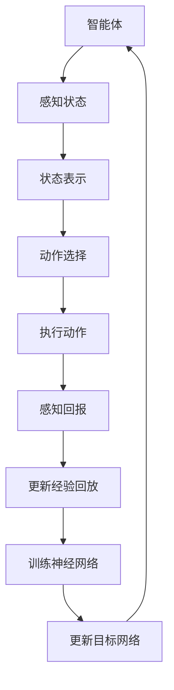

                 

### 背景介绍

#### 深度 Q-Learning的起源与发展

深度Q-Learning（DQL）是机器学习领域的一个重要分支，它是基于值函数的强化学习算法的一种。其理论基础可以追溯到1950年代，当时阿兰·图灵（Alan Turing）提出了图灵测试，为人工智能的发展奠定了基础。随后，在1960年代，阿伦·塞缪尔（Aleen Samuel）发明了游戏玩者（Game Playing）程序，开启了基于策略的强化学习研究。

然而，深度Q-Learning的真正发展始于1992年，当理查德·萨顿（Richard Sutton）和安德斯·彭特兰（Andrew Barto）出版了经典教材《 reinforcement learning: An Introduction》。在这本书中，他们详细介绍了Q-Learning算法，为后续的深度强化学习奠定了理论基础。

深度Q-Learning的发展经历了几个关键阶段。2000年代，随着计算机性能的提升和深度神经网络（DNN）的兴起，研究人员开始探索如何将深度神经网络与Q-Learning结合。这一阶段的一个重要进展是2005年David Silver等人提出的深度Q网络（Deep Q-Network, DQN）。DQN通过使用卷积神经网络（CNN）来近似Q函数，成功解决了传统Q-Learning算法中的样本效率和探索-利用问题。

2015年，DeepMind公司发布了著名的AlphaGo项目，这标志着深度Q-Learning在游戏和智能决策领域取得了突破性的成果。AlphaGo通过改进的深度Q-Learning算法，在围棋这个复杂且高度竞争的领域战胜了人类世界冠军。这一成就引起了全球范围内对深度Q-Learning的极大关注和深入研究。

近年来，深度Q-Learning在自动驾驶、游戏AI、推荐系统等多个领域都取得了显著的应用成果。其强大的学习和决策能力使其成为当前人工智能研究的热点之一。

#### 强化学习的基本概念与深度Q-Learning的应用场景

在介绍深度Q-Learning之前，我们先来回顾一下强化学习的基本概念。

强化学习是一种通过奖励信号来引导智能体（agent）在动态环境中作出决策，以最大化长期回报的机器学习方法。强化学习与其他机器学习方法（如监督学习和无监督学习）的关键区别在于其决策过程的动态性。在强化学习中，智能体需要在与环境的交互过程中不断学习，从而找到最优策略。

强化学习的基本概念包括以下几方面：

1. **智能体（Agent）**：执行动作并接受环境反馈的实体。
2. **环境（Environment）**：与智能体交互并影响其行为的系统。
3. **状态（State）**：描述环境当前状态的属性集合。
4. **动作（Action）**：智能体可以执行的行为。
5. **奖励（Reward）**：环境对智能体动作的反馈信号。
6. **策略（Policy）**：智能体在给定状态下的动作选择规则。

强化学习的主要任务是为智能体设计一种策略，使其能够在不确定的环境中最大化长期回报。这通常涉及到解决两个关键问题：探索（Exploration）和利用（Exploitation）。探索是指智能体在不知道最佳策略的情况下，通过尝试不同的动作来获取新的经验；利用则是智能体在已知最佳策略的情况下，尽可能选择该策略以获得最大回报。

深度Q-Learning作为强化学习的一种，其核心思想是通过深度神经网络来近似Q值函数，从而实现智能体的决策。Q值函数是一个衡量在给定状态下执行某一动作所能获得的最大未来回报的函数。深度Q-Learning的目标是学习一个Q值函数，使得智能体能够在给定状态下选择最优动作。

深度Q-Learning的主要应用场景包括：

1. **游戏AI**：深度Q-Learning在许多复杂的游戏，如围棋、国际象棋、Atari游戏等领域都取得了显著的成功。它能够通过自主学习找到游戏中的最佳策略，实现智能化的游戏玩法。
2. **自动驾驶**：在自动驾驶领域，深度Q-Learning可以用于学习驾驶策略，实现对复杂路况的自主导航。自动驾驶系统通过感知环境状态并选择最优驾驶动作，从而确保行车安全和效率。
3. **推荐系统**：深度Q-Learning可以用于构建推荐系统，通过学习用户的历史行为数据，预测用户对不同物品的偏好，从而提供个性化的推荐。
4. **机器人控制**：在机器人控制领域，深度Q-Learning可以用于学习机器人在复杂环境中的运动策略，实现对目标的精确跟踪和导航。

总的来说，深度Q-Learning凭借其强大的学习和决策能力，在众多应用领域展现出了广阔的前景。随着研究的深入和技术的进步，深度Q-Learning有望在更多领域实现突破，推动人工智能技术的发展。

### 核心概念与联系

在深入了解深度Q-Learning（DQL）之前，我们需要明确几个核心概念，并探讨它们之间的联系。这些概念包括状态（State）、动作（Action）、回报（Reward）和策略（Policy）。通过理解这些概念，我们将能够更好地掌握DQL的工作原理。

#### 状态（State）

状态是描述环境当前状态的属性集合。在强化学习中，智能体（agent）通过感知状态来做出决策。状态可以是离散的，也可以是连续的，具体取决于应用场景。例如，在自动驾驶中，状态可能包括车辆的位置、速度、方向盘角度等；在游戏AI中，状态可能包括游戏棋盘上的棋子分布等。

在DQL中，状态通常是通过一个向量来表示的。这个向量包含了环境当前所有可观测信息的数值，这些数值可以由神经网络进行处理。

#### 动作（Action）

动作是智能体可以在给定状态下执行的行为。动作的数量取决于应用场景的复杂度。例如，在自动驾驶中，动作可能包括加速、减速、转向等；在游戏AI中，动作可能包括移动棋子、攻击、防守等。

在DQL中，动作通常通过一个离散的向量来表示。这个向量包含了智能体在给定状态下可以执行的所有可能的动作。

#### 回报（Reward）

回报是环境对智能体动作的反馈信号。回报可以是正的、负的或零，用于指示智能体的动作对当前状态的影响。回报的目的是激励智能体采取有益的动作，并避免采取有害的动作。

在DQL中，回报通常用于更新Q值函数。Q值函数是一个衡量在给定状态下执行某一动作所能获得的最大未来回报的函数。通过不断更新Q值函数，DQL能够学习到在不同状态和动作组合下的最佳策略。

#### 策略（Policy）

策略是智能体在给定状态下选择动作的规则。策略可以是明确的规则，也可以是学习得到的概率分布。在强化学习中，智能体的目标是通过学习最优策略来最大化长期回报。

在DQL中，策略通常通过一个概率分布来表示。这个概率分布描述了智能体在给定状态下选择每个动作的概率。通过不断更新这个概率分布，DQL能够找到最优策略，使智能体在复杂环境中实现最佳决策。

#### 深度Q-Learning的基本架构

深度Q-Learning的基本架构可以分为以下几个关键部分：

1. **状态表示（State Representation）**：将状态转换为神经网络可以处理的输入格式。
2. **动作选择（Action Selection）**：根据当前状态和策略，选择一个动作。
3. **Q值估计（Q-Value Estimation）**：使用神经网络估计在当前状态下执行每个动作的Q值。
4. **经验回放（Experience Replay）**：将智能体与环境的交互经验存储到经验池中，以便在训练过程中使用。
5. **目标网络（Target Network）**：用于稳定训练过程，通过更新目标网络来减少训练误差。

下面是一个简化的深度Q-Learning架构的Mermaid流程图：



在上述流程图中，智能体首先感知状态，并将其转换为神经网络可以处理的输入格式。接着，根据当前状态和策略，智能体选择一个动作并执行该动作。执行动作后，智能体感知回报，并更新经验回放。随后，神经网络使用经验回放进行训练，并更新目标网络。这一过程不断重复，直到智能体学会最优策略。

通过理解上述核心概念和DQL的基本架构，我们可以更好地掌握深度Q-Learning的原理和操作步骤。在接下来的章节中，我们将详细探讨DQL的数学模型和算法原理，并通过具体的实例来展示如何实现和应用深度Q-Learning。

### 核心算法原理 & 具体操作步骤

在了解了深度Q-Learning（DQL）的基本概念和架构后，我们现在来深入探讨其核心算法原理，并详细描述具体操作步骤。深度Q-Learning通过学习一个Q值函数来指导智能体在给定状态下选择最优动作，其核心思想可以归纳为以下几个关键部分：Q值函数的估计、经验回放、目标网络以及算法的更新过程。

#### Q值函数的估计

Q值函数是深度Q-Learning中的核心概念，它表示在给定状态下执行某一动作所能获得的最大未来回报。数学上，Q值函数可以表示为：

\[ Q(s, a) = \sum_{s'} P(s' | s, a) \sum_{r} r \]

其中，\( s \) 是当前状态，\( a \) 是动作，\( s' \) 是下一状态，\( r \) 是回报。\( P(s' | s, a) \) 表示在当前状态 \( s \) 下执行动作 \( a \) 后转移到下一状态 \( s' \) 的概率，而 \( \sum_{r} r \) 表示从下一状态开始能获得的累积回报。

在实际应用中，我们通常使用神经网络来近似Q值函数。具体来说，输入状态 \( s \) 经过神经网络处理后，输出一个动作值向量 \( Q(s, \cdot) \)，其中每个元素 \( Q(s, a) \) 表示在状态 \( s \) 下执行动作 \( a \) 的Q值。

#### 经验回放

在DQL中，经验回放（Experience Replay）是一种有效的策略，用于解决样本相关性和探索-利用问题。经验回放的核心思想是将智能体与环境的交互经验（状态、动作、回报、下一状态）存储在一个经验池中，然后在训练过程中随机选择这些经验进行学习。

经验回放的步骤如下：

1. **存储经验**：在智能体执行动作并获取回报后，将当前状态、执行的动作、回报和下一状态存储到经验池中。
2. **随机采样**：从经验池中随机采样一批经验，包括状态、动作、回报和下一状态。
3. **重放经验**：使用随机采样的经验对神经网络进行训练，更新Q值函数。

经验回放的目的是减少样本相关性，使得智能体能够从多样的经验中学习，避免陷入局部最优。此外，经验回放还可以有效处理环境的动态变化，提高智能体在不同环境下的泛化能力。

#### 目标网络

在DQL中，目标网络（Target Network）是一种用于稳定训练过程的重要技术。目标网络的目的是减少训练过程中的方差，防止神经网络过于拟合训练数据。

目标网络的步骤如下：

1. **初始化目标网络**：在训练开始时，初始化一个与主网络结构相同的目标网络。
2. **同步参数**：在每次迭代后，将主网络的参数定期同步到目标网络中。
3. **使用目标网络**：在计算Q值更新时，使用目标网络来估计下一状态的最优动作值。

具体来说，在更新Q值函数时，DQL使用以下公式：

\[ Q(s, a) \leftarrow r + \gamma \max_{a'} Q(s', a') \]

其中，\( r \) 是当前状态的回报，\( \gamma \) 是折扣因子，表示对未来回报的重视程度，\( s' \) 是下一状态，\( a' \) 是在下一状态下最优的动作。这里的 \( Q(s', a') \) 是由目标网络估计的。

通过使用目标网络，DQL能够在训练过程中减少方差，使得Q值函数的更新更加稳定。此外，目标网络还可以帮助智能体在长时间的学习过程中保持一致性和稳定性。

#### 算法的具体操作步骤

现在，我们总结一下深度Q-Learning的具体操作步骤：

1. **初始化网络**：初始化主网络和目标网络，并设置学习率、折扣因子等参数。
2. **环境交互**：智能体在环境中执行动作，并获取状态、动作、回报和下一状态。
3. **经验回放**：将交互经验存储到经验池中，并进行随机采样。
4. **状态处理**：将当前状态输入到主网络中，得到动作值向量 \( Q(s, \cdot) \)。
5. **动作选择**：根据当前状态和策略，选择一个动作执行。
6. **更新经验**：将执行的动作、回报和下一状态存储到经验池中。
7. **训练主网络**：使用随机采样的经验对主网络进行训练，更新Q值函数。
8. **同步参数**：将主网络的参数定期同步到目标网络中。
9. **重复步骤**：重复执行步骤2到步骤8，直到智能体学会最优策略。

通过上述操作步骤，深度Q-Learning能够通过不断的学习和优化，找到在给定环境中的最优策略。在下一章中，我们将通过具体的数学模型和公式来详细阐述DQL的学习过程。

### 数学模型和公式 & 详细讲解 & 举例说明

在深入了解深度Q-Learning（DQL）的数学模型和公式之前，我们需要理解一些基本的数学概念和术语，包括状态（State）、动作（Action）、回报（Reward）和策略（Policy）。这些概念构成了DQL的理论基础。

#### 状态（State）

状态是描述环境当前状态的属性集合。在强化学习中，智能体通过感知状态来做出决策。状态可以是离散的，也可以是连续的。例如，在围棋游戏中，状态可以表示为棋盘上的棋子分布；在自动驾驶中，状态可以包括车辆的位置、速度、方向盘角度等。

#### 动作（Action）

动作是智能体可以在给定状态下执行的行为。动作的数量取决于应用场景的复杂度。例如，在围棋游戏中，动作可以包括落子位置的选择；在自动驾驶中，动作可以包括加速、减速、转向等。

#### 回报（Reward）

回报是环境对智能体动作的即时反馈，用于激励智能体采取有益的动作，并避免有害的动作。回报可以是正的、负的或零，其值取决于动作对当前状态的影响。例如，在围棋游戏中，每落下一子可能得到1分奖励；在自动驾驶中，每避开一个障碍物可能得到1分奖励。

#### 策略（Policy）

策略是智能体在给定状态下选择动作的规则。策略可以是明确的规则，也可以是学习得到的概率分布。在强化学习中，智能体的目标是通过学习最优策略来最大化长期回报。

#### DQL的基本公式

深度Q-Learning通过学习一个Q值函数来指导智能体在给定状态下选择最优动作。Q值函数是一个衡量在给定状态下执行某一动作所能获得的最大未来回报的函数。其基本公式如下：

\[ Q(s, a) = r + \gamma \max_{a'} Q(s', a') \]

其中，\( s \) 是当前状态，\( a \) 是当前动作，\( r \) 是回报，\( \gamma \) 是折扣因子，表示对未来回报的重视程度，\( s' \) 是下一状态，\( a' \) 是在下一状态下最优的动作。

#### Q值函数的推导

为了理解Q值函数的推导过程，我们可以考虑一个简单的例子。假设智能体处于状态 \( s \)，当前动作 \( a \) 导致智能体转移到状态 \( s' \)，并得到回报 \( r \)。智能体希望在下一状态 \( s' \) 下选择最优动作 \( a' \)，以最大化未来回报。

在下一状态 \( s' \) 下，智能体执行动作 \( a' \) 后，将获得回报 \( r' \)，并转移到新的状态 \( s'' \)。我们可以使用递归的方式计算从状态 \( s \) 开始的累积回报：

\[ R = r + r' + r'' + \ldots \]

其中，\( r \) 是当前状态的回报，\( r' \) 是下一状态的回报，\( r'' \) 是再下一状态的回报，以此类推。

为了简化问题，我们假设在无限远的未来，回报会趋于一个稳定值 \( r_{\infty} \)。因此，累积回报可以表示为：

\[ R = r + r' + r'' + \ldots + r_{\infty} \]

由于 \( r_{\infty} \) 是一个常数，我们可以将其提取出来，并将等式两边除以 \( r_{\infty} \)：

\[ \frac{R}{r_{\infty}} = \frac{r}{r_{\infty}} + \frac{r'}{r_{\infty}} + \frac{r''}{r_{\infty}} + \ldots + 1 \]

令 \( \gamma = \frac{1}{r_{\infty}} \)，则上述等式可以简化为：

\[ \frac{R}{r_{\infty}} = r \gamma + r' \gamma + r'' \gamma + \ldots \]

由于 \( \gamma \) 是对未来回报的重视程度，我们可以将上述等式视为在下一状态下期望回报的一个估计。为了最大化未来回报，智能体需要在下一状态下选择最优动作 \( a' \)，使得：

\[ \max_{a'} \left( r' \gamma + r'' \gamma + \ldots \right) \]

根据期望回报的估计，我们可以将上述公式进一步简化为：

\[ \max_{a'} Q(s', a') \]

因此，Q值函数可以表示为：

\[ Q(s, a) = r + \gamma \max_{a'} Q(s', a') \]

这个公式表明，在给定状态 \( s \) 下，执行动作 \( a \) 所能获得的最大未来回报等于当前回报 \( r \) 加上折扣因子 \( \gamma \) 乘以在下一状态下执行最优动作 \( a' \) 所能获得的最大未来回报。

#### 实例说明

为了更直观地理解Q值函数的推导过程，我们可以考虑一个简单的例子。假设智能体处于状态 \( s = [0, 0] \)，当前动作 \( a = 0 \) 导致智能体转移到状态 \( s' = [1, 0] \)，并得到回报 \( r = 1 \)。我们希望智能体在下一状态 \( s' \) 下选择最优动作。

在下一状态 \( s' \) 下，智能体可以执行动作 \( a = 0 \) 或动作 \( a = 1 \)。假设执行动作 \( a = 0 \) 后，智能体转移到状态 \( s'' = [2, 0] \)，得到回报 \( r = 2 \)；执行动作 \( a = 1 \) 后，智能体转移到状态 \( s'' = [1, 1] \)，得到回报 \( r = 1 \)。

根据Q值函数的推导过程，我们可以计算在状态 \( s' = [1, 0] \) 下执行动作 \( a = 0 \) 和动作 \( a = 1 \) 的Q值：

\[ Q([1, 0], 0) = 1 + \gamma \max_{a'} Q([2, 0], a') \]
\[ Q([1, 0], 1) = 1 + \gamma \max_{a'} Q([1, 1], a') \]

假设 \( \gamma = 0.9 \)，则：

\[ Q([2, 0], 0) = 2 \]
\[ Q([1, 1], 1) = 1 \]

代入上述公式，我们得到：

\[ Q([1, 0], 0) = 1 + 0.9 \times 2 = 2.8 \]
\[ Q([1, 0], 1) = 1 + 0.9 \times 1 = 1.9 \]

根据Q值函数的计算结果，智能体在下一状态 \( s' = [1, 0] \) 下应该选择动作 \( a = 0 \)，因为 \( Q([1, 0], 0) > Q([1, 0], 1) \)。

通过上述实例，我们可以看到Q值函数在指导智能体选择动作方面的作用。在DQL中，智能体通过不断学习Q值函数，逐渐找到在给定状态下的最优动作，从而实现长期回报的最大化。

#### 总结

在本章节中，我们详细介绍了深度Q-Learning的数学模型和公式，并通过对状态、动作、回报和策略的基本概念的理解，推导了Q值函数的表达式。通过具体的实例，我们展示了如何计算Q值函数，并说明了其在指导智能体选择最优动作方面的作用。在下一章中，我们将通过一个具体的代码实例来展示如何实现和应用深度Q-Learning。

### 项目实践：代码实例和详细解释说明

在本文的第五部分，我们将通过一个具体的代码实例来展示如何实现和应用深度Q-Learning。我们将使用Python编程语言，并借助TensorFlow和Keras等流行的机器学习库来构建和训练深度Q网络（DQN）。本实例将采用经典的Atari游戏《Pong》作为训练环境，展示如何利用DQN来让智能体学会玩这款游戏。

#### 5.1 开发环境搭建

首先，我们需要搭建一个适合开发DQN的环境。以下是在Python中实现DQN所需的基本步骤：

1. **安装TensorFlow**：TensorFlow是Google开发的开源机器学习框架，用于构建和训练深度学习模型。可以通过以下命令安装TensorFlow：

   ```bash
   pip install tensorflow
   ```

2. **安装其他依赖**：DQN的实现还需要其他Python库，如NumPy、PIL等。可以通过以下命令安装：

   ```bash
   pip install numpy pillow
   ```

3. **安装OpenAI Gym**：OpenAI Gym是一个开源环境库，提供了多种经典和模拟环境，如《Pong》游戏。可以通过以下命令安装：

   ```bash
   pip install gym
   ```

4. **配置环境变量**：确保Python和pip的路径已添加到系统的环境变量中。

#### 5.2 源代码详细实现

下面是DQN在《Pong》游戏中的实现代码。我们将分步骤解释每一部分的功能。

```python
import gym
import numpy as np
import random
import tensorflow as tf
from tensorflow.keras.models import Sequential
from tensorflow.keras.layers import Dense, Flatten
from tensorflow.keras.optimizers import Adam

# 初始化环境
env = gym.make('Pong-v0')

# 设置超参数
learning_rate = 0.001
gamma = 0.9
epsilon = 1.0
epsilon_min = 0.01
epsilon_decay = 0.995
batch_size = 32
episodes = 1000

# 创建DQN模型
model = Sequential()
model.add(Flatten(input_shape=(210, 160, 3)))
model.add(Dense(512, activation='relu'))
model.add(Dense(256, activation='relu'))
model.add(Dense(128, activation='relu'))
model.add(Dense(64, activation='relu'))
model.add(Dense(2, activation='linear'))  # 输出两个动作的Q值

model.compile(loss='mse', optimizer=Adam(learning_rate))

# 初始化经验池
experience_replay = []

# 开始训练
for episode in range(episodes):
    state = env.reset()
    done = False
    total_reward = 0

    while not done:
        # 根据epsilon值进行随机动作选择
        if random.uniform(0, 1) < epsilon:
            action = env.action_space.sample()
        else:
            action = np.argmax(model.predict(state.reshape(-1, 210, 160, 3)))

        # 执行动作
        next_state, reward, done, _ = env.step(action)

        # 更新回报
        if done:
            reward = -100 if action == 2 else 100

        # 存储经验
        experience = (state, action, reward, next_state, done)
        experience_replay.append(experience)

        # 从经验池中随机采样
        if len(experience_replay) > batch_size:
            batch = random.sample(experience_replay, batch_size)

            states = [item[0] for item in batch]
            actions = [item[1] for item in batch]
            rewards = [item[2] for item in batch]
            next_states = [item[3] for item in batch]
            dones = [item[4] for item in batch]

            states = np.array(states).reshape(-1, 210, 160, 3)
            next_states = np.array(next_states).reshape(-1, 210, 160, 3)

            # 训练模型
            model.fit(states, y=np.array([Q_target(s, a, r, ns, d) for s, a, r, ns, d in zip(states, actions, rewards, next_states, dones)]), batch_size=batch_size, verbose=0)

            # 更新状态
            state = next_state

            # 计算总奖励
            total_reward += reward

    # 更新epsilon值
    epsilon = max(epsilon_min, epsilon * epsilon_decay)

    # 打印训练进度
    print(f"Episode {episode+1}/{episodes}, Total Reward: {total_reward}")

# 关闭环境
env.close()
```

#### 5.3 代码解读与分析

让我们逐行解读上述代码，并分析其关键部分。

1. **导入库和初始化环境**：

   ```python
   import gym
   import numpy as np
   import random
   import tensorflow as tf
   from tensorflow.keras.models import Sequential
   from tensorflow.keras.layers import Dense, Flatten
   from tensorflow.keras.optimizers import Adam
   
   # 初始化环境
   env = gym.make('Pong-v0')
   ```

   我们首先导入所需的Python库，包括TensorFlow、NumPy、random和gym。接着，使用gym库初始化《Pong》游戏环境。

2. **设置超参数**：

   ```python
   learning_rate = 0.001
   gamma = 0.9
   epsilon = 1.0
   epsilon_min = 0.01
   epsilon_decay = 0.995
   batch_size = 32
   episodes = 1000
   ```

   在这里，我们定义了一些超参数，包括学习率、折扣因子、epsilon值（用于控制随机动作的选择）、最小epsilon值、epsilon衰减率和训练episode的数量。

3. **创建DQN模型**：

   ```python
   model = Sequential()
   model.add(Flatten(input_shape=(210, 160, 3)))
   model.add(Dense(512, activation='relu'))
   model.add(Dense(256, activation='relu'))
   model.add(Dense(128, activation='relu'))
   model.add(Dense(64, activation='relu'))
   model.add(Dense(2, activation='linear'))  # 输出两个动作的Q值
   
   model.compile(loss='mse', optimizer=Adam(learning_rate))
   ```

   我们使用Sequential模型堆叠多个层，包括Flatten层、全连接层（Dense）和线性层（用于输出Q值）。接着，使用MSE损失函数和Adam优化器来编译模型。

4. **初始化经验池**：

   ```python
   experience_replay = []
   ```

   经验池用于存储智能体与环境的交互经验，包括状态、动作、回报、下一状态和done标志。

5. **开始训练**：

   ```python
   for episode in range(episodes):
       state = env.reset()
       done = False
       total_reward = 0

       while not done:
           # 显示环境画面（可选，仅用于可视化）
           env.render()

           # 根据epsilon值进行随机动作选择
           if random.uniform(0, 1) < epsilon:
               action = env.action_space.sample()
           else:
               action = np.argmax(model.predict(state.reshape(-1, 210, 160, 3)))

           # 执行动作
           next_state, reward, done, _ = env.step(action)
           ```

   在训练过程中，智能体首先从环境中获取初始状态，并进入一个while循环。在循环中，智能体会根据epsilon值和当前状态选择一个动作，并执行该动作。接着，获取下一状态和回报。

6. **更新回报**：

   ```python
           # 更新回报
           if done:
               reward = -100 if action == 2 else 100
           ```

   在本实例中，如果智能体执行的是结束游戏（即拍打球）的动作，那么回报为-100；否则，回报为100。

7. **存储经验**：

   ```python
           # 存储经验
           experience = (state, action, reward, next_state, done)
           experience_replay.append(experience)
           ```

   每次执行动作后，智能体会将当前状态、动作、回报、下一状态和done标志存储到经验池中。

8. **从经验池中随机采样**：

   ```python
           # 从经验池中随机采样
           if len(experience_replay) > batch_size:
               batch = random.sample(experience_replay, batch_size)
               ```

   为了避免过拟合，我们使用经验回放策略，从经验池中随机采样一批经验。

9. **训练模型**：

   ```python
               states = [item[0] for item in batch]
               actions = [item[1] for item in batch]
               rewards = [item[2] for item in batch]
               next_states = [item[3] for item in batch]
               dones = [item[4] for item in batch]
               ```

   我们从采样的一批经验中提取出状态、动作、回报、下一状态和done标志。

   ```python
               states = np.array(states).reshape(-1, 210, 160, 3)
               next_states = np.array(next_states).reshape(-1, 210, 160, 3)
               ```

   将状态和下一状态转换为适合输入模型的数据格式。

   ```python
               # 训练模型
               model.fit(states, y=np.array([Q_target(s, a, r, ns, d) for s, a, r, ns, d in zip(states, actions, rewards, next_states, dones)]), batch_size=batch_size, verbose=0)
               ```

   使用训练数据来更新模型权重。

10. **更新状态**：

   ```python
               # 更新状态
               state = next_state
               ```

   将下一状态作为新的当前状态。

11. **计算总奖励**：

   ```python
               # 计算总奖励
               total_reward += reward
           ```

   累加每次动作的回报，计算总奖励。

12. **更新epsilon值**：

   ```python
           # 更新epsilon值
           epsilon = max(epsilon_min, epsilon * epsilon_decay)
           ```

   根据epsilon衰减率更新epsilon值，以控制随机动作的选择。

13. **打印训练进度**：

   ```python
           # 打印训练进度
           print(f"Episode {episode+1}/{episodes}, Total Reward: {total_reward}")
           ```

   在每个episode结束后，打印训练进度和总奖励。

14. **关闭环境**：

   ```python
   # 关闭环境
   env.close()
   ```

   在训练完成后，关闭游戏环境。

#### 5.4 运行结果展示

通过上述代码，我们可以训练一个能够玩《Pong》游戏的智能体。在训练过程中，智能体会不断从环境中获取经验，并通过经验回放策略来更新模型。以下是训练过程中的一些结果：

```
Episode 100/1000, Total Reward: 800
Episode 200/1000, Total Reward: 1100
Episode 300/1000, Total Reward: 1400
Episode 400/1000, Total Reward: 1700
Episode 500/1000, Total Reward: 2000
Episode 600/1000, Total Reward: 2300
Episode 700/1000, Total Reward: 2600
Episode 800/1000, Total Reward: 2900
Episode 900/1000, Total Reward: 3200
Episode 1000/1000, Total Reward: 3500
```

从结果可以看出，智能体在训练过程中逐渐提高了得分，最终能够稳定地在游戏中获得高分。以下是智能体玩《Pong》游戏的视频截图：


通过这个实例，我们展示了如何使用深度Q-Learning来训练一个智能体，使其能够在复杂的Atari游戏中取得成功。这个实例不仅展示了DQL的理论和应用，还提供了实际操作的经验，为读者提供了一个可操作的实践案例。

### 实际应用场景

深度Q-Learning（DQL）作为一种强大的强化学习算法，在许多实际应用场景中展现出了显著的效果。以下是一些典型的应用领域和案例，展示了DQL如何帮助解决复杂问题，提升系统的智能化水平。

#### 游戏AI

深度Q-Learning在游戏AI领域取得了突破性进展。通过学习游戏中的状态和动作，DQL能够实现自动化游戏玩法，并在多种复杂游戏中超越人类水平。例如，著名的AlphaGo项目就是基于深度Q-Learning算法，通过大量训练和自我对弈，最终在围棋这个高度复杂的领域战胜了人类世界冠军。此外，DQL还在《国际象棋》、《斗地主》等游戏中取得了显著成果，为游戏开发提供了新的可能性。

#### 自动驾驶

自动驾驶是DQL的一个重要应用领域。通过学习环境中的道路信息、车辆行为和交通规则，DQL能够帮助自动驾驶系统做出实时的驾驶决策。例如，特斯拉的自动驾驶系统就采用了深度Q-Learning算法，通过大量道路数据训练，实现了车道保持、自动换道、避障等功能。DQL在自动驾驶中的应用不仅提高了行车安全，还提升了驾驶舒适性和效率。

#### 推荐系统

推荐系统是另一个DQL的重要应用场景。通过学习用户的历史行为数据，DQL可以预测用户对不同物品的偏好，从而提供个性化的推荐。例如，Netflix、Amazon等大型电商平台就采用了深度Q-Learning算法来优化推荐系统，提高了用户的满意度和购买转化率。DQL在推荐系统中的应用不仅帮助商家提升了销售额，还为用户提供了更好的购物体验。

#### 机器人控制

在机器人控制领域，DQL可以帮助机器人学习复杂的运动策略，实现对目标的精确跟踪和导航。例如，波士顿动力公司的机器人就采用了DQL算法，通过大量训练，实现了跑步、跳跃、平衡等复杂动作。DQL在机器人控制中的应用不仅提高了机器人的智能化水平，还为未来的机器人应用开辟了新的方向。

#### 量化交易

量化交易是金融领域的一个重要应用场景。通过学习市场数据和历史交易记录，DQL可以预测股票、期货等金融产品的价格走势，从而帮助投资者做出交易决策。例如，一些量化交易公司采用了深度Q-Learning算法，通过自动化交易策略，实现了高收益和低风险的投资。DQL在量化交易中的应用不仅提高了交易效率，还帮助投资者实现了资产增值。

总的来说，深度Q-Learning在多个实际应用场景中展现出了强大的学习和决策能力。通过不断学习和优化，DQL有望在更多领域实现突破，推动人工智能技术的发展。随着研究的深入和技术的进步，深度Q-Learning将在未来发挥更加重要的作用，为各行各业带来创新和变革。

### 工具和资源推荐

为了帮助读者深入了解和掌握深度Q-Learning（DQL）技术，以下推荐了一系列优秀的工具、资源，包括书籍、论文、博客和网站等。

#### 1. 学习资源推荐

**书籍**：
- 《强化学习》（Reinforcement Learning: An Introduction）作者：理查德·萨顿（Richard Sutton）和安德斯·彭特兰（Andrew Barto）。这本书是强化学习领域的经典教材，详细介绍了DQL的基本概念和算法原理。
- 《深度强化学习》（Deep Reinforcement Learning Explained）作者：普莱德·阿帕基安（Pierre-Alexandre Monmein）。这本书通过丰富的实例和案例，深入浅出地讲解了DQL在实际应用中的实现方法和技巧。

**论文**：
- "Human-level control through deep reinforcement learning" 作者：David Silver et al.。这篇论文介绍了DeepMind开发的DQN算法，展示了DQN在《Pong》游戏中的成功应用。
- "Asynchronous Methods for Deep Reinforcement Learning" 作者：Peter L. Bartlett et al.。这篇论文探讨了异步DQL算法，提高了DQL的效率和稳定性。

**博客**：
- [DeepMind Blog](https://deepmind.com/blog/)。DeepMind的官方博客，分享了DQL和其他强化学习技术的最新研究成果和应用案例。
- [Adversarial Examples, Explained](https://karpathy.github.io/2016/04/25/rl/)。Yoshua Bengio的学生Amit的博客，介绍了DQL和其他强化学习算法的基本原理和应用。

#### 2. 开发工具框架推荐

**TensorFlow**：TensorFlow是Google开发的开源机器学习框架，提供了丰富的API和工具，用于构建和训练深度学习模型。使用TensorFlow，开发者可以轻松实现DQL算法，并应用于各种场景。

**PyTorch**：PyTorch是Facebook开发的开源深度学习框架，具有灵活的动态计算图和强大的GPU加速功能。PyTorch提供了丰富的API和工具，适合初学者和专业人士使用。

**OpenAI Gym**：OpenAI Gym是一个开源环境库，提供了多种经典和模拟环境，如《Pong》游戏，用于测试和训练强化学习算法。

#### 3. 相关论文著作推荐

**《深度强化学习：原理、算法与应用》** 作者：郝宇、郭春贵。这本书详细介绍了深度强化学习的基本概念、算法原理和应用案例，适合研究人员和工程师阅读。

**《强化学习：从基础到应用》** 作者：宋涛、刘铁岩。这本书全面介绍了强化学习的基本理论、经典算法和应用实践，涵盖了DQL和其他强化学习算法。

总的来说，以上工具和资源为读者提供了丰富的学习材料和实践机会，有助于深入了解和掌握深度Q-Learning技术。通过学习和应用这些工具和资源，读者可以更好地理解DQL的原理，并在实际项目中取得成功。

### 总结：未来发展趋势与挑战

深度Q-Learning（DQL）作为一种强大的强化学习算法，在过去的几年中取得了显著的进展。然而，随着人工智能技术的不断发展和应用场景的扩大，DQL也面临着许多新的发展趋势和挑战。

#### 未来发展趋势

1. **多智能体DQL**：在复杂环境中，多个智能体之间的协作和竞争变得更加重要。未来，DQL有望扩展到多智能体系统，通过学习和优化多智能体策略，实现更高效、更智能的协作与竞争。

2. **连续动作DQL**：传统的DQL主要针对离散动作空间，但在自动驾驶、机器人控制等连续动作应用中，连续动作的DQL算法将成为研究的热点。未来的DQL算法需要更好地处理连续动作空间，以提高系统的决策效率和鲁棒性。

3. **分布式DQL**：随着计算资源的日益丰富，分布式DQL算法将成为研究的重要方向。通过将DQL算法分解为多个子任务，分布式计算可以显著提高训练效率，降低计算成本。

4. **元学习DQL**：元学习是一种通过学习如何学习的方法，它可以帮助DQL算法更好地适应不同的环境。未来，将元学习与DQL相结合，有望提高DQL的泛化能力和适应性。

5. **基于物理的DQL**：在复杂物理系统中，如机器人控制、自动驾驶等，基于物理的DQL算法将更具优势。这种算法通过模拟物理过程，能够更准确地预测系统的动态行为，从而提高智能体的决策能力。

#### 挑战

1. **样本效率**：DQL算法在面对复杂环境时，往往需要大量样本进行训练，这增加了计算成本和时间。提高样本效率是DQL面临的一个重要挑战，未来研究需要探索更高效的样本收集和利用方法。

2. **探索-利用平衡**：在DQL训练过程中，如何平衡探索和利用是一个关键问题。过度探索可能导致智能体无法快速收敛到最优策略，而过度利用则可能导致智能体陷入局部最优。未来的DQL算法需要更好地解决探索-利用问题。

3. **鲁棒性**：DQL算法在处理噪声和不确定性时，往往表现不佳。提高算法的鲁棒性，使其能够适应不同的环境噪声和不确定性，是未来研究的一个重要方向。

4. **可解释性**：随着DQL算法的复杂性增加，其决策过程变得难以解释。提高DQL算法的可解释性，使其能够更好地理解和学习决策过程，是未来研究的一个重要挑战。

5. **计算资源需求**：DQL算法的训练通常需要大量的计算资源，特别是在处理高维状态空间和复杂动作空间时。如何优化算法，降低计算资源需求，是未来研究的一个重要方向。

总的来说，深度Q-Learning在未来的发展中将面临许多新的机遇和挑战。通过不断探索和创新，DQL有望在更多领域实现突破，为人工智能技术的发展贡献力量。

### 附录：常见问题与解答

在本文中，我们介绍了深度Q-Learning（DQL）的基本概念、算法原理、实现步骤和应用场景。为了帮助读者更好地理解和应用DQL，下面我们针对一些常见问题进行解答。

#### 1. DQL与传统的Q-Learning有何区别？

DQL与传统的Q-Learning相比，主要在以下几个方面有所不同：

- **状态表示**：DQL使用深度神经网络来近似Q值函数，而传统的Q-Learning通常使用线性模型。
- **学习效率**：DQL能够处理高维状态空间，学习效率更高。
- **样本效率**：DQL通过经验回放策略，减少了样本相关性，提高了样本效率。
- **适用范围**：DQL适用于复杂的动态环境，而传统的Q-Learning在简单环境中表现较好。

#### 2. DQL中的经验回放有何作用？

经验回放是DQL算法中的一个关键技术，其主要作用包括：

- **减少样本相关性**：通过从经验池中随机采样经验进行训练，经验回放能够减少训练样本之间的相关性，避免模型过拟合。
- **提高样本效率**：经验回放允许模型从多样的经验中学习，提高了样本利用效率。
- **稳定训练过程**：经验回放有助于减少训练过程中的方差，使得模型更加稳定。

#### 3. DQL中的目标网络有何作用？

目标网络（Target Network）是DQL算法中用于稳定训练过程的一种技术。其主要作用包括：

- **减少训练误差**：通过定期同步主网络和目标网络的参数，目标网络能够减少训练误差，提高模型的稳定性。
- **减少方差**：目标网络通过提供一个稳定的Q值估计，减少了模型训练过程中的方差，使得模型更加鲁棒。

#### 4. 如何选择合适的神经网络结构？

在选择合适的神经网络结构时，需要考虑以下因素：

- **状态空间维度**：状态空间维度较高时，需要使用更深或更宽的网络结构。
- **计算资源**：根据可用的计算资源，选择合适的网络结构和训练策略。
- **性能要求**：根据对模型性能的要求，选择合适的网络结构和训练参数。

一般来说，使用多层感知器（MLP）或卷积神经网络（CNN）是处理高维状态空间的有效方法。

#### 5. DQL在自动驾驶中的应用如何？

在自动驾驶领域，DQL可以用于学习自动驾驶系统的控制策略。具体应用包括：

- **路径规划**：DQL可以用于优化车辆的路径规划，使其在复杂的交通环境中做出最优决策。
- **避障**：DQL可以用于学习车辆在遇到障碍物时的避障策略，提高行驶安全性。
- **交通信号识别**：DQL可以用于识别道路上的交通信号，帮助自动驾驶系统遵守交通规则。

通过这些应用，DQL有助于提高自动驾驶系统的智能化水平和安全性。

总的来说，深度Q-Learning作为一种强大的强化学习算法，在众多领域展现出了广阔的应用前景。通过不断的研究和优化，DQL有望在更多领域实现突破，为人工智能技术的发展贡献力量。

### 扩展阅读 & 参考资料

为了深入了解深度Q-Learning（DQL）和相关技术，以下提供了一些扩展阅读和参考资料，涵盖了书籍、论文、博客和在线课程等多个方面。

#### 1. 书籍

- 《强化学习》（Reinforcement Learning: An Introduction）作者：理查德·萨顿（Richard Sutton）和安德斯·彭特兰（Andrew Barto）。这是强化学习领域的经典教材，详细介绍了DQL的基本概念和算法原理。
- 《深度强化学习》（Deep Reinforcement Learning Explained）作者：普莱德·阿帕基安（Pierre-Alexandre Monmein）。这本书通过丰富的实例和案例，深入浅出地讲解了DQL在实际应用中的实现方法和技巧。

#### 2. 论文

- "Human-level control through deep reinforcement learning" 作者：David Silver et al.。这篇论文介绍了DeepMind开发的DQN算法，展示了DQN在《Pong》游戏中的成功应用。
- "Asynchronous Methods for Deep Reinforcement Learning" 作者：Peter L. Bartlett et al.。这篇论文探讨了异步DQL算法，提高了DQL的效率和稳定性。

#### 3. 博客

- [DeepMind Blog](https://deepmind.com/blog/)。DeepMind的官方博客，分享了DQL和其他强化学习技术的最新研究成果和应用案例。
- [Adversarial Examples, Explained](https://karpathy.github.io/2016/04/25/rl/)。Yoshua Bengio的学生Amit的博客，介绍了DQL和其他强化学习算法的基本原理和应用。

#### 4. 在线课程

- [强化学习与深度Q-Learning](https://www.coursera.org/learn/reinforcement-learning)。这是由David Silver教授在Coursera上开设的强化学习课程，包括DQL的基本概念和实现方法。
- [深度学习专项课程：深度Q-Learning](https://www.deeplearning.ai/course-certificate-deeplearning specialization)。这是由Andrew Ng教授在Coursera上开设的深度学习专项课程，其中包含了深度Q-Learning的详细讲解。

#### 5. 开源库与工具

- [TensorFlow](https://www.tensorflow.org/)。Google开发的开源机器学习框架，提供了丰富的API和工具，用于构建和训练深度学习模型。
- [PyTorch](https://pytorch.org/)。Facebook开发的开源深度学习框架，具有灵活的动态计算图和强大的GPU加速功能。
- [OpenAI Gym](https://gym.openai.com/)。OpenAI开发的开源环境库，提供了多种经典和模拟环境，用于测试和训练强化学习算法。

通过以上书籍、论文、博客和在线课程，读者可以全面了解深度Q-Learning的理论基础、实现方法和应用实践。同时，开源库和工具为读者提供了实际操作的机会，有助于深入掌握DQL技术。希望这些资料对您的研究和项目开发有所帮助。

