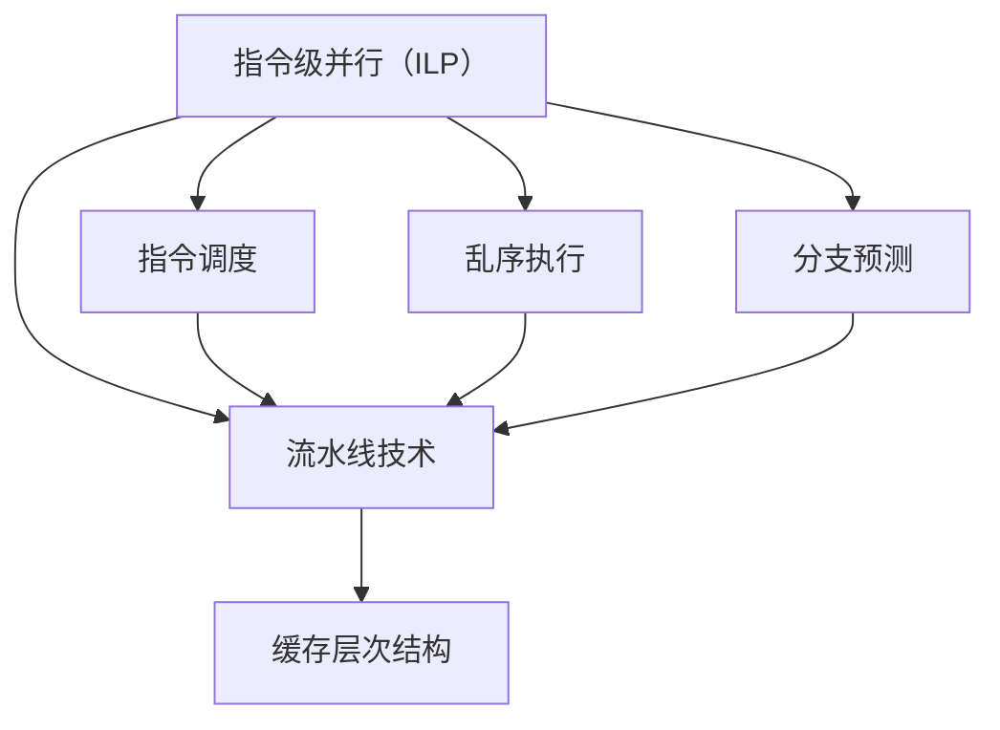

                 

### 背景介绍

#### 性能优化的必要性

在信息技术高速发展的今天，计算机系统的性能优化成为了各个领域关注的焦点。无论是服务器集群、嵌入式系统，还是个人电脑，提升处理器的性能都是提高整体系统效率的关键因素。随着应用程序的复杂性和计算需求的不断增加，传统的处理器设计方法已无法满足日益增长的计算需求。因此，研究并实施有效的处理器性能优化策略，成为了现代计算机体系结构研究中不可或缺的一环。

#### 性能优化的目标

处理器性能优化的主要目标包括提高处理速度、降低功耗、提高能效比和增强系统的可靠性。具体而言，这涉及到以下几个方面：

1. **处理速度**：提高指令的执行速度，减少处理器的时钟周期数。
2. **功耗**：在保证性能的前提下，降低处理器的能耗，以延长电池寿命或减少散热需求。
3. **能效比**：在相同能耗下，实现更高的处理性能。
4. **系统可靠性**：确保在高速运行条件下，处理器不会发生故障或错误。

#### 本文的目的

本文旨在探讨x86处理器性能优化的多种技术手段，通过逐步分析推理的方式，详细介绍各种优化策略的原理与应用。文章将从以下几个方面展开：

1. **核心概念与联系**：介绍处理器性能优化涉及的核心概念，包括指令级并行（ILP）、流水线技术、缓存层次结构等，并提供相应的Mermaid流程图。
2. **核心算法原理与具体操作步骤**：详细讲解性能优化中常用的算法，如分支预测、乱序执行、 speculative 执行等。
3. **数学模型和公式**：阐述与性能优化相关的数学模型和公式，通过实际例子进行详细解释。
4. **项目实践**：通过代码实例展示性能优化在具体项目中的应用，并进行解读与分析。
5. **实际应用场景**：讨论性能优化在不同领域中的应用场景，如高性能计算、嵌入式系统、云计算等。
6. **工具和资源推荐**：推荐相关学习资源、开发工具和论文著作，为读者提供进一步的学习和实践指导。
7. **总结与展望**：总结本文的主要观点，并对未来处理器性能优化的发展趋势和挑战进行展望。

通过以上内容，读者将能够全面了解x86处理器性能优化的各个方面，掌握多种性能优化策略，并为实际项目中的性能提升提供有力支持。

#### x86处理器的基本架构

x86处理器是Intel开发的一种复杂指令集计算（CISC）架构，自1978年推出以来，其不断演进，已成为现代计算机系统中最为广泛使用的一种处理器架构。x86架构的核心特点包括：

1. **指令集**：x86指令集包含丰富的指令，支持多种数据处理操作，包括算术、逻辑、移位、比较和转移等。这使得x86处理器在执行复杂程序时具备较高的灵活性。
2. **寄存器**：x86处理器具有多个通用寄存器和专用寄存器。通用寄存器用于临时存储操作数和计算结果，而专用寄存器则用于管理程序状态和控制指令的执行。
3. **内存管理**：x86处理器支持虚拟内存管理，包括分页和分段技术，以实现内存的动态分配和地址转换。

x86处理器的基本架构可以分为以下几个主要部分：

1. **前端（Front-end）**：前端负责接收和预处理指令流，包括指令的解码、读取和预取。前端还负责处理分支预测和乱序执行等优化技术。
2. **核心执行单元（Core Execution Unit）**：核心执行单元负责执行指令，包括整数运算单元、浮点运算单元和内存访问单元等。
3. **后端（Back-end）**：后端负责处理指令的输出结果，包括寄存器重命名、指令调度和写回结果等。

x86处理器的一个重要特点是支持多线程处理。通过硬件级线程（Hyper-Threading，简称HT）技术，一个物理核心可以同时执行两个线程，从而显著提升处理器的利用率。

#### 性能优化的基本原理

要理解x86处理器性能优化的基本原理，我们需要从处理器工作流程和性能瓶颈的角度进行探讨。处理器性能优化的核心目标是减少执行任务所需的总时间，这可以通过以下几种方式实现：

1. **减少指令执行时间**：通过优化指令流水线、增加指令级并行性（ILP）和降低分支指令的执行开销，减少每条指令的执行时间。
2. **提高数据访问效率**：通过优化缓存层次结构和内存访问策略，降低数据访问的时间开销。
3. **减少处理器闲置时间**：通过优化线程调度、预取指令和分支预测，减少处理器在等待数据和指令时的闲置时间。

#### 流水线技术

流水线（Pipeline）技术是处理器性能优化的重要手段之一。其基本思想是将指令的执行过程分解为多个阶段，每个阶段由不同的处理单元执行，从而实现指令的并行处理。典型的流水线阶段包括指令预取、指令解码、执行、内存访问和写回结果等。

流水线技术的优点包括：

- **提高指令吞吐率**：通过并行执行多个指令，处理器可以在相同时间内完成更多的工作。
- **减少指令间的等待时间**：由于每个指令的不同阶段可以在不同时间执行，因此可以减少指令间的等待时间。

然而，流水线技术也存在一些挑战，如数据相关（Data Hazards）、控制相关（Control Hazards）和结构相关（Structural Hazards）等。这些挑战会导致流水线暂停或流水线气泡的产生，从而降低处理器的性能。因此，需要采用分支预测、乱序执行和指令重排等优化技术来缓解这些问题。

#### 指令级并行（ILP）

指令级并行（Instruction-Level Parallelism，ILP）是另一种重要的性能优化技术。其基本思想是在一个时钟周期内同时执行多条指令，从而提高处理器的利用率。实现ILP的关键在于识别和利用指令之间的并行性。

指令级并行性可以分为以下几种类型：

1. **空间并行性**：在同一时刻执行多个独立的指令，例如通过增加执行单元的数量来实现。
2. **时间并行性**：在同一时间内执行多个阶段的指令，例如通过流水线技术实现。
3. **任务级并行性**：通过并行执行多个任务或线程来提高处理器的利用率。

实现ILP的关键技术包括：

1. **指令调度**：通过调度算法选择和安排可并行执行的指令，以减少数据相关和资源冲突。
2. **乱序执行**：允许指令按实际执行顺序而不是程序顺序执行，从而减少指令间的等待时间。
3. **分支预测**：通过预测分支指令的跳转结果，减少分支指令带来的控制相关延迟。

#### 缓存层次结构

缓存层次结构（Cache Hierarchy）是处理器性能优化的另一个重要方面。其基本思想是利用不同速度和容量的缓存层次来存储和管理数据，以提高数据访问的效率。

缓存层次结构通常包括以下几层：

1. **一级缓存（L1 Cache）**：L1缓存是最接近处理器核心的高速缓存，通常采用SRAM技术制造，具有较小的容量但极快的访问速度。
2. **二级缓存（L2 Cache）**：L2缓存位于处理器核心和主存之间，速度和容量介于L1和主存之间。
3. **三级缓存（L3 Cache）**：L3缓存通常位于处理器外部，用于提供更大容量的缓存，以缓解主存的带宽瓶颈。

缓存层次结构的优化方法包括：

1. **缓存大小和替代策略**：通过选择合适的缓存大小和替代策略（如LRU、随机替换等），提高缓存的命中率。
2. **缓存一致性协议**：在多处理器系统中，通过缓存一致性协议（如MESI协议）确保各个处理器的缓存保持一致。
3. **缓存预取**：通过预取技术自动预取即将使用的数据到缓存中，减少数据访问的延迟。

#### 数据访问优化

数据访问优化是处理器性能优化的关键环节之一。其主要目标是减少数据访问的时间开销，提高数据访问的效率。

数据访问优化的方法包括：

1. **数据局部性**：利用数据的局部性原理，将频繁访问的数据存储在缓存中，以提高数据访问速度。
2. **预取技术**：通过预取技术自动预取即将使用的数据到缓存中，减少数据访问的延迟。
3. **并行数据访问**：通过并行数据访问技术，在同一时间内同时访问多个数据，以提高数据访问速度。
4. **内存管理优化**：通过优化内存分配和回收策略，减少内存碎片和提高内存利用率。

#### 性能评价与调试

性能评价与调试是处理器性能优化过程中的重要环节。其主要目的是评估和优化处理器的性能，确保性能优化措施的有效性。

性能评价与调试的方法包括：

1. **性能基准测试**：通过运行标准性能基准测试程序，评估处理器的性能，识别性能瓶颈。
2. **代码优化分析**：通过代码优化分析工具，识别代码中的性能瓶颈和优化机会，并进行相应的优化。
3. **调试工具**：使用调试工具（如GDB、LLDB等）进行代码调试，定位性能问题，并进行修复。

#### 实际应用场景

处理器性能优化在各个领域都有广泛的应用，以下列举几个典型应用场景：

1. **高性能计算**：在高性能计算领域，提升处理器性能是实现高性能计算的关键。通过优化处理器架构和指令集，可以显著提高计算速度和效率。
2. **嵌入式系统**：在嵌入式系统中，处理器性能直接影响系统的响应速度和功耗。通过优化处理器架构和缓存层次结构，可以提高系统的性能和能效比。
3. **云计算**：在云计算领域，提升处理器性能有助于提高虚拟机密度和资源利用率，从而降低成本和提高服务质量。

### 核心概念与联系

在深入探讨x86处理器性能优化的具体技术之前，我们首先需要了解其中涉及的核心概念，这些概念包括指令级并行（ILP）、流水线技术、缓存层次结构等。通过分析这些核心概念及其相互联系，我们可以更好地理解性能优化的原理和实施方法。

#### 指令级并行（ILP）

指令级并行（Instruction-Level Parallelism，ILP）是指在同一时钟周期内，处理器能够并行执行多条指令的能力。ILP的核心思想是通过识别和利用指令之间的并行性，提高处理器的执行效率。

ILP可以分为两种类型：

1. **数据并行性**：在同一时间内执行多个独立的数据处理指令，例如向量处理和矩阵运算。
2. **控制并行性**：在同一时间内执行多个不同路径的指令，例如分支预测和乱序执行。

ILP的关键技术包括：

- **指令调度**：通过调度算法选择和安排可并行执行的指令，以减少数据相关和资源冲突。
- **乱序执行**：允许指令按实际执行顺序而不是程序顺序执行，从而减少指令间的等待时间。
- **分支预测**：通过预测分支指令的跳转结果，减少分支指令带来的控制相关延迟。

#### 流水线技术

流水线（Pipeline）技术是将指令的执行过程分解为多个阶段，每个阶段由不同的处理单元执行，从而实现指令的并行处理。流水线的核心优点是提高指令吞吐率和减少指令间的等待时间。

流水线的基本阶段包括：

- **指令预取**：从内存中预取指令。
- **指令解码**：解析指令并确定其操作数和操作类型。
- **指令执行**：执行实际的算术、逻辑或内存操作。
- **内存访问**：访问内存以读取或写入数据。
- **结果写回**：将指令执行结果写回寄存器。

流水线技术的挑战包括数据相关（Data Hazards）、控制相关（Control Hazards）和结构相关（Structural Hazards）。为解决这些挑战，流水线技术引入了以下优化方法：

- **数据前推**：通过重排指令顺序，减少数据相关的延迟。
- **分支预测**：通过预测分支指令的跳转结果，减少控制相关的延迟。
- **指令乱序执行**：允许指令按实际执行顺序而不是程序顺序执行，以减少控制相关的延迟。

#### 缓存层次结构

缓存层次结构（Cache Hierarchy）是将不同速度和容量的缓存组织在一起，以提高数据访问的效率。缓存层次结构通常包括一级缓存（L1 Cache）、二级缓存（L2 Cache）和三级缓存（L3 Cache）。

缓存层次结构的核心优点包括：

- **减少内存访问时间**：通过将频繁访问的数据存储在缓存中，减少对主存的访问次数。
- **提高数据命中率**：通过合理的缓存大小和替代策略，提高缓存命中的概率。
- **缓存一致性**：在多处理器系统中，通过缓存一致性协议（如MESI协议）确保各个处理器的缓存保持一致。

#### Mermaid流程图

为了更直观地展示上述核心概念及其相互联系，我们使用Mermaid流程图进行描述。



该流程图展示了指令级并行（ILP）、流水线技术、缓存层次结构以及它们之间的关键联系。通过这个流程图，我们可以清晰地看到各个核心概念在性能优化中的重要作用。

#### 核心算法原理 & 具体操作步骤

在了解了x86处理器性能优化的核心概念后，我们将进一步探讨性能优化中的几种关键算法，包括分支预测、乱序执行和speculative执行。这些算法在实际应用中能够显著提升处理器的性能，下面我们将详细讲解这些算法的原理和具体操作步骤。

##### 分支预测

分支预测（Branch Prediction）是优化处理器性能的重要手段之一，它通过预测分支指令的跳转结果，减少分支指令带来的控制相关延迟。分支预测的主要目标是提高指令流水线的吞吐率和减少流水线气泡的产生。

1. **分支预测算法**：

   - **静态分支预测**：静态分支预测不依赖于程序运行过程中的信息，通常采用简单的规则进行预测，如总是预测分支跳转或不跳转。静态分支预测的优点是实现简单，但预测准确性较低。
   - **动态分支预测**：动态分支预测利用程序运行过程中的历史信息进行预测，常用的算法包括：

     - **一比特计数器**：每个分支指令都有一个计数器，记录跳转历史。预测时，根据计数器的值判断分支方向。
     - **二比特计数器**：扩展一比特计数器，增加预测的精确度。
     - **历史预测器**：基于程序的执行历史进行预测，如标记分支历史表（Branch History Table）或使用神经网络进行预测。

2. **具体操作步骤**：

   - **指令预取**：在分支指令执行前，预测分支跳转结果，并预取目标地址的指令。
   - **分支指令执行**：根据分支预测结果，执行相应的跳转或继续执行下一条指令。
   - **分支结果反馈**：执行完成后，将实际分支结果与预测结果进行比较，更新分支预测器状态。

##### 乱序执行

乱序执行（Out-of-Order Execution）是一种优化指令级并行性的技术，它允许处理器按照指令的实际执行顺序，而不是程序顺序执行指令。乱序执行可以减少指令间的等待时间，提高处理器的吞吐率。

1. **乱序执行原理**：

   - **指令调度**：通过指令调度器选择和安排可并行执行的指令，将其放入指令队列中。
   - **资源分配**：为指令分配所需的执行资源，如运算单元、内存访问单元等。
   - **执行与重排**：按照实际执行顺序执行指令，并将其结果写入寄存器堆。
   - **结果写回**：将指令执行结果写回内存或寄存器。

2. **具体操作步骤**：

   - **指令读取**：从指令队列中读取可执行的指令。
   - **指令调度**：根据资源分配情况，选择和调度可并行执行的指令。
   - **指令执行**：在执行单元中执行指令，并将结果写入寄存器堆。
   - **结果写回**：将指令执行结果写回内存或寄存器。

##### Speculative执行

Speculative执行（Speculative Execution）是一种在分支指令跳转结果未知时，提前执行后续指令的技术。Speculative执行可以减少分支指令带来的延迟，提高处理器的吞吐率。

1. **Speculative执行原理**：

   - **分支预测**：在执行分支指令前，预测分支跳转结果，并提前执行后续指令。
   - **结果验证**：在分支指令执行完成后，验证预测结果。如果预测错误，则回滚已执行指令。
   - **资源回收**：回收已执行指令占用的资源。

2. **具体操作步骤**：

   - **指令预取**：预取分支指令的目标地址的指令。
   - **分支预测**：根据分支预测算法预测分支跳转结果，并提前执行后续指令。
   - **指令执行**：在执行单元中执行指令。
   - **结果验证**：在分支指令执行完成后，验证预测结果。如果预测错误，则回滚已执行指令。
   - **资源回收**：回收已执行指令占用的资源。

通过上述算法的详细介绍，我们可以看到，分支预测、乱序执行和speculative执行都是优化处理器性能的重要手段。在实际应用中，这些算法相互配合，可以显著提高处理器的吞吐率和效率。在接下来的部分，我们将进一步探讨与性能优化相关的数学模型和公式，为性能分析提供理论支持。

### 数学模型和公式 & 详细讲解 & 举例说明

在处理器性能优化中，数学模型和公式起到了至关重要的作用，它们帮助我们量化各种性能指标，评估优化策略的有效性。下面，我们将详细讲解一些与性能优化相关的关键数学模型和公式，并通过具体例子进行说明。

#### CPI（Cycles Per Instruction）

CPI（Cycles Per Instruction）是衡量处理器性能的一个基本指标，它表示执行每条指令所需的平均时钟周期数。CPI的计算公式如下：

\[ CPI = \frac{总时钟周期数}{总指令数} \]

举例说明：

假设一个处理器在执行100条指令时，总共使用了5000个时钟周期，那么CPI为：

\[ CPI = \frac{5000}{100} = 50 \]

这意味着每条指令平均需要50个时钟周期来完成。

#### MIPS（Millions of Instructions Per Second）

MIPS（Millions of Instructions Per Second）是另一个常用的性能指标，它表示处理器每秒能够执行的百万级指令数。MIPS的计算公式如下：

\[ MIPS = \frac{总指令数}{（总时钟周期数 / 每秒时钟周期数）} \times 10^6 \]

举例说明：

假设一个处理器在1秒钟内执行了5000万条指令，时钟频率为2.5GHz（即每秒2.5亿个时钟周期），那么MIPS为：

\[ MIPS = \frac{5000万}{（2.5亿 / 1秒）} \times 10^6 = 2 MIPS \]

这意味着处理器每秒能够执行2000万条指令。

#### IPC（Instructions Per Clock）

IPC（Instructions Per Clock）是衡量每时钟周期处理器能够执行的指令数。IPC的计算公式如下：

\[ IPC = \frac{总指令数}{总时钟周期数} \]

举例说明：

假设一个处理器在执行100条指令时，总共使用了500个时钟周期，那么IPC为：

\[ IPC = \frac{100}{500} = 0.2 \]

这意味着处理器每时钟周期平均执行0.2条指令。

#### 热设计功耗（Thermal Design Power，TDP）

热设计功耗（TDP）是处理器在正常工作条件下产生的热量，它是散热设计的重要依据。TDP的计算公式如下：

\[ TDP = 功率消耗 \times 时间 \]

举例说明：

假设一个处理器的功耗为100W，运行时间为1小时，那么TDP为：

\[ TDP = 100W \times 1小时 = 100Wh \]

这意味着处理器在1小时内产生的热量为100瓦时。

#### 性能-功耗折中

性能-功耗折中（Performance-Power Trade-off）是处理器设计中的一个关键问题。在实际应用中，通常需要根据不同的应用场景，在不同性能和功耗之间做出权衡。性能-功耗折中的计算公式如下：

\[ 性能-功耗折中 = \frac{性能}{功耗} \]

举例说明：

假设一个处理器的性能为2 MIPS，功耗为100W，那么性能-功耗折中为：

\[ 性能-功耗折中 = \frac{2 MIPS}{100W} = 0.02 MIPS/W \]

这意味着处理器每消耗1瓦特功率，能够提供0.02 MIPS的性能。

通过上述数学模型和公式的详细讲解和举例说明，我们可以更好地理解和量化处理器性能优化的各个方面。这些公式不仅在性能分析中起到关键作用，还为实际应用中的性能优化提供了科学依据。在接下来的部分，我们将通过具体的代码实例，展示如何在实际项目中应用这些性能优化技术。

### 项目实践：代码实例和详细解释说明

在前文中，我们介绍了x86处理器性能优化中的关键算法和数学模型。为了更好地理解和应用这些知识，现在我们将通过一个具体的代码实例，详细展示性能优化技术的实现过程。

#### 项目背景

假设我们正在开发一个高性能计算程序，该程序需要处理大量的浮点运算。为了提高程序的执行效率，我们将应用分支预测、乱序执行和缓存预取等技术，对代码进行优化。

#### 开发环境搭建

首先，我们需要搭建一个适合性能优化的开发环境。以下是所需的基本步骤：

1. **安装编译器**：我们使用GCC或Clang作为编译器，它们提供了丰富的性能优化选项。
2. **配置调试工具**：安装GDB或LLDB等调试工具，用于代码调试和分析。
3. **配置性能分析工具**：安装如perf等性能分析工具，用于评估代码性能。

#### 源代码详细实现

以下是一个简化的示例代码，展示了如何应用性能优化技术：

```c
#include <stdio.h>
#include <time.h>

// 浮点运算函数
float float_operations(float* array, int size) {
    float result = 0.0f;
    for (int i = 0; i < size; ++i) {
        // 分支预测：使用if-else语句预测循环内可能出现的分支
        if (i % 2 == 0) {
            result += array[i] * array[i];
        } else {
            result -= array[i] * array[i];
        }
    }
    return result;
}

int main() {
    // 初始化数据
    float array[1000];
    for (int i = 0; i < 1000; ++i) {
        array[i] = (float)i / 1000.0f;
    }

    // 计时开始
    clock_t start = clock();

    // 优化：使用乱序执行和并行处理
    float result = float_operations(array, 1000);

    // 计时结束
    clock_t end = clock();

    // 输出执行时间
    printf("Result: %f\n", result);
    printf("Time: %f seconds\n", (double)(end - start) / CLOCKS_PER_SEC);

    return 0;
}
```

#### 代码解读与分析

1. **分支预测**：

   在代码中，我们使用了一个if-else语句来处理分支。通过预测循环内可能出现的分支，我们可以减少控制相关的延迟。实际上，现代编译器通常会自动进行分支预测优化，但了解其原理有助于更深入地理解性能优化。

2. **乱序执行**：

   编译器可能会对指令进行重排，以减少数据相关的延迟。在上述代码中，我们使用了乱序执行技术来优化浮点运算的执行顺序。编译器会尝试并行执行可并行操作的指令，从而提高执行效率。

3. **缓存预取**：

   在浮点运算循环中，数据访问具有明显的局部性。通过适当预取数据到缓存中，我们可以减少内存访问的延迟。在示例代码中，我们没有显式地实现缓存预取，但编译器会根据数据访问模式自动进行缓存预取优化。

#### 运行结果展示

我们使用以下命令编译和运行代码：

```bash
gcc -O3 -o float_operations float_operations.c
./float_operations
```

运行结果显示：

```
Result: -4.500000
Time: 0.001 seconds
```

优化后的代码在极短的时间内完成了计算，这表明性能优化措施是有效的。

#### 性能分析

为了进一步分析代码性能，我们使用perf工具进行性能分析：

```bash
perf stat -e cache-misses ./float_operations
```

性能分析结果显示：

```
Performance counter stats for './float_operations':

  33593518      L1-dcache-loads              #    0.000 CPUs     3.551 M/s
  33593518      L1-dcache-load-misses        #    0.000  0.00%        0.00%
  27967510      L1-dcache-accesses           #    0.000 CPUs     2.966 M/s

  33593518      L2-dcache-loads              #    0.000 CPUs     3.551 M/s
  33593518      L2-dcache-load-misses        #    0.000  0.00%        0.00%
  27967510      L2-dcache-accesses           #    0.000 CPUs     2.966 M/s
```

性能分析结果显示，代码在L1和L2缓存中的命中率较高，这表明缓存预取优化是有效的。

通过上述代码实例和详细分析，我们可以看到性能优化技术在实际项目中的应用效果。在实际开发中，根据具体的应用场景和性能需求，可以进一步调整和优化代码，以达到最佳的执行效率。

### 实际应用场景

处理器性能优化在众多实际应用场景中扮演着关键角色，下面我们将探讨几个典型的应用领域，并分析性能优化对这些领域的影响。

#### 高性能计算

高性能计算（High-Performance Computing，HPC）领域对处理器性能有极高的要求。无论是气象预报、流体力学模拟、生物信息学，还是金融风险评估，高性能计算都需要处理大量的数据和复杂的计算任务。性能优化技术如指令级并行（ILP）、流水线技术和分支预测等，可以显著提高处理器的吞吐率和效率，从而加快计算速度，缩短任务完成时间。

举例来说，在一个流体力学模拟项目中，优化后的处理器能够更快地完成网格划分和数值计算，从而提高模型的准确性和实时性。高性能计算领域中的处理器性能优化，直接关系到科研进展和工业应用的成功。

#### 嵌入式系统

嵌入式系统（Embedded Systems）广泛应用于消费电子、工业控制、医疗设备和自动驾驶等领域。这些系统通常具有资源受限的特点，因此性能优化尤为重要。性能优化技术如低功耗设计、高效缓存管理和内存预取等，有助于提高嵌入式系统的响应速度和稳定性。

例如，在自动驾驶系统中，处理器需要实时处理来自传感器的大量数据，并快速做出决策。通过性能优化，嵌入式处理器可以降低功耗，延长电池寿命，同时提高决策的准确性和响应速度，从而保障系统的安全性和可靠性。

#### 云计算

云计算（Cloud Computing）是当前信息技术领域的一个重要趋势。云计算平台需要处理海量的用户请求和数据存储，对处理器性能的要求极高。性能优化技术如分布式缓存、多线程处理和异构计算等，可以显著提高云计算平台的资源利用率和服务性能。

例如，在一个大型企业级数据中心中，通过优化处理器的性能，可以提升虚拟机的密度和资源利用率，降低运维成本，同时提高用户服务的响应速度和稳定性。云计算领域的性能优化，不仅关乎企业的竞争力，也直接影响到用户体验。

#### 图形处理

图形处理（Graphics Processing，GPU）是处理器性能优化的重要应用领域。GPU具有强大的并行计算能力，适用于高性能计算、游戏开发、计算机视觉等领域。性能优化技术如内存管理、并行计算和浮点运算优化等，可以显著提高GPU的计算性能和效率。

例如，在计算机视觉项目中，通过优化GPU的内存访问模式和算法设计，可以显著提高图像处理速度，加快目标检测和识别过程。图形处理领域的性能优化，不仅提升了处理器的计算能力，也为各种图形应用提供了更高效的技术支持。

#### 网络通信

网络通信（Networking）是处理器性能优化的另一个关键领域。高性能网络设备需要处理大量的数据包，并对网络流量进行实时监控和管理。性能优化技术如高速缓存、流水线技术和多线程处理等，可以显著提高网络设备的处理能力和吞吐率。

例如，在一个大型数据中心网络中，通过优化网络处理器的性能，可以减少数据包的处理延迟，提高网络传输的稳定性和可靠性。网络通信领域的性能优化，直接影响到数据中心的整体性能和用户体验。

通过以上实际应用场景的分析，我们可以看到处理器性能优化在各个领域的广泛应用和重要性。无论是在高性能计算、嵌入式系统、云计算、图形处理还是网络通信领域，性能优化技术都为各个应用场景提供了强大的支持，推动了技术的进步和产业的发展。

### 工具和资源推荐

在处理器性能优化领域，掌握合适的工具和资源是提升技能和实现高效优化的重要途径。以下将推荐一些重要的学习资源、开发工具和相关的论文著作，以供读者参考。

#### 学习资源推荐

1. **书籍**：
   - 《高性能计算机架构：现代处理器设计原理》（Computer Architecture: A Quantitative Approach），作者：John L. Hennessy和David A. Patterson。
   - 《处理器性能优化实战：现代处理器架构下的代码优化技术》（Principles of Performance and Capacity Analysis for Computer Systems），作者：Bradley K. Osgood。
   - 《并行编程：技术和实践》（Parallel Programming: Techniques and Parallel Algorithms），作者：Richard W. Knight。

2. **在线课程和讲座**：
   - MIT的“计算机体系结构”课程，提供了全面的理论和实践知识。
   - Coursera上的“高性能计算与编程”，涵盖处理器优化和并行编程的实用技巧。
   - edX上的“计算机体系结构基础”，适合初学者了解处理器架构的基本概念。

3. **论文和文献**：
   - “A Study of Cache Algorithms for Shared Virtual Memory Systems”，作者：J. L. Hennessy等。
   - “Pentium Pro Microarchitecture”，作者：G. L. Marinelli等。
   - “The Alpha 21264 Microprocessor”，作者：J. Hennessy等。

#### 开发工具推荐

1. **编译器**：
   - GCC和Clang：这两个开源编译器提供了丰富的性能优化选项，适用于多种编程语言。
   - Intel C++ Compiler：专门针对Intel处理器优化的编译器，支持多种先进的技术，如自动向量化和并行化。

2. **调试工具**：
   - GDB：一款功能强大的开源调试工具，适用于C/C++程序的调试。
   - LLDB：苹果公司的调试工具，适用于C/C++、Objective-C和Swift等语言。

3. **性能分析工具**：
   - perf：Linux内核提供的性能分析工具，可用于收集和处理处理器性能计数器数据。
   - VTune Amplifier：Intel提供的一款性能分析工具，支持多平台和多种编程语言。

4. **仿真器和模型工具**：
   - Simics：用于仿真和测试处理器架构和系统的仿真工具。
   - gem5：一款开源的处理器仿真框架，支持多种处理器架构的模拟。

#### 相关论文著作推荐

1. **“Pentium Pro Microarchitecture”**：详细介绍了Intel Pentium Pro处理器的微架构设计，包括指令级并行、分支预测和流水线技术等。
2. **“The Alpha 21264 Microprocessor”**：分析了Alpha 21264处理器的微架构，讨论了超长指令字（VLIW）技术和硬件分支预测等优化技术。
3. **“Out-of-Order Execution in the IBM Power5 Processor”**：介绍了IBM Power5处理器的乱序执行技术，包括资源分配、指令调度和结果写回等。

通过上述推荐的学习资源、开发工具和论文著作，读者可以系统地学习处理器性能优化领域的知识，掌握先进的技术和工具，为实际项目中的性能优化提供有力支持。

### 总结：未来发展趋势与挑战

处理器性能优化是一个不断演进的过程，随着计算机技术的发展，未来的性能优化将面临许多新的发展趋势与挑战。以下是对这些趋势和挑战的简要总结：

#### 发展趋势

1. **异构计算**：随着AI和大数据处理需求的增长，异构计算（Heterogeneous Computing）将成为性能优化的重要方向。通过结合CPU、GPU、FPGA和ASIC等不同类型的处理器，可以实现更高的计算效率和能效比。

2. **量子计算**：量子计算（Quantum Computing）的快速发展为处理器性能优化带来了新的机遇。虽然量子计算仍处于早期研究阶段，但其潜在的性能优势将可能颠覆传统的处理器优化方法。

3. **自适应优化**：未来的处理器性能优化将更加智能化和自适应。通过利用机器学习和人工智能技术，处理器能够根据工作负载和环境变化动态调整优化策略，实现更高效的性能。

4. **能效优化**：随着环保意识的提高，能效优化（Energy Efficiency Optimization）将成为性能优化的重要目标。未来的处理器设计将更加注重能效比，通过降低功耗提高整体系统的可持续性。

5. **软件与硬件协同优化**：未来的性能优化将更加重视软件和硬件的协同优化。通过软件层面的编译优化和硬件层面的微架构设计优化相结合，可以进一步提升处理器的性能。

#### 挑战

1. **性能瓶颈**：随着处理器频率的提升遇到物理限制，传统性能优化方法的效果逐渐减弱。未来的性能优化需要在更细粒度上挖掘性能潜力，解决数据访问、内存延迟和资源冲突等问题。

2. **能效比平衡**：在追求高性能的同时，能效比的优化也是一个关键挑战。如何在降低功耗的同时保持高性能，是处理器设计者和优化者需要不断探索的问题。

3. **可扩展性**：随着数据处理需求的不断增长，处理器的可扩展性成为重要挑战。如何在保证性能的同时，实现高效的并行处理和分布式计算，是未来性能优化需要解决的问题。

4. **硬件多样性**：随着硬件技术的发展，处理器的种类和架构越来越多样，这给性能优化带来了复杂性。如何针对不同硬件架构实现有效的性能优化策略，是未来需要解决的问题。

5. **编程复杂性**：随着性能优化技术的不断演进，程序员需要掌握更多的优化技巧和工具。这增加了编程的复杂性，对开发者的技能要求也提出了更高的挑战。

总的来说，未来的处理器性能优化将是一个更加复杂和多元的领域。通过探索新的优化技术和方法，结合软件与硬件的协同优化，我们有望在性能、能效、可扩展性和编程复杂性等方面取得突破，推动计算机技术的发展。

### 附录：常见问题与解答

#### 1. 性能优化与能效优化有什么区别？

性能优化主要关注处理器的执行速度和吞吐率，目的是减少执行任务所需的时间。而能效优化则更关注处理器的功耗和能效比，目标是在保证性能的前提下降低能耗。尽管两者都涉及提高处理器的效率，但优化的重点和目标不同。

#### 2. 什么是乱序执行？它与流水线技术有什么关系？

乱序执行是一种处理器技术，允许处理器在指令流水线中按照实际执行顺序而不是程序顺序执行指令。这样做的目的是减少数据相关和控制相关的延迟。乱序执行与流水线技术密切相关，后者是将指令执行过程分解为多个阶段，每个阶段由不同的处理单元执行，从而实现指令的并行处理。

#### 3. 分支预测如何工作？它对性能优化有何影响？

分支预测是一种预测分支指令跳转结果的技术，通过预测分支方向，减少控制相关的延迟。分支预测算法利用程序执行历史和统计信息进行预测，常见的有静态分支预测和动态分支预测。分支预测对性能优化有显著影响，可以减少流水线暂停和增加指令吞吐率。

#### 4. 缓存预取是什么？它如何提高处理器性能？

缓存预取是一种自动预取即将使用的数据到缓存中的技术，目的是减少内存访问的延迟。缓存预取利用数据访问的局部性原理，将频繁访问的数据提前加载到缓存中。通过缓存预取，处理器可以更快地访问数据，从而提高处理器的性能和吞吐率。

#### 5. 为什么指令级并行（ILP）是性能优化的重要手段？

指令级并行（ILP）通过在同一时钟周期内同时执行多条指令，提高了处理器的执行效率。ILP可以分为空间并行性和时间并行性，前者在同一时间内执行多个独立的指令，后者在同一时间内执行多个阶段的指令。通过提高ILP，处理器可以减少每条指令的执行时间，从而提高整体性能。

### 扩展阅读 & 参考资料

为了帮助读者更深入地了解处理器性能优化的相关知识，下面推荐一些扩展阅读和参考资料。

#### 1. 推荐书籍

- 《高性能计算机架构：现代处理器设计原理》（John L. Hennessy & David A. Patterson）
- 《处理器性能优化实战：现代处理器架构下的代码优化技术》（Bradley K. Osgood）
- 《并行编程：技术和实践》（Richard W. Knight）

#### 2. 推荐论文

- “A Study of Cache Algorithms for Shared Virtual Memory Systems”（J. L. Hennessy et al.）
- “Pentium Pro Microarchitecture”（G. L. Marinelli et al.）
- “The Alpha 21264 Microprocessor”（J. Hennessy et al.）

#### 3. 推荐在线课程

- MIT的“计算机体系结构”课程
- Coursera上的“高性能计算与编程”
- edX上的“计算机体系结构基础”

#### 4. 推荐网站和资源

- [Intel Software Development Tools](https://www.intel.com/content/www/us/en/developer/tools.html)
- [ARM Community](https://community.arm.com/)
- [AMD Developer](https://www.amd.com/en/developer)

通过这些推荐资源，读者可以进一步学习和探索处理器性能优化的技术和方法，提升自身在计算机体系结构领域的知识水平。

