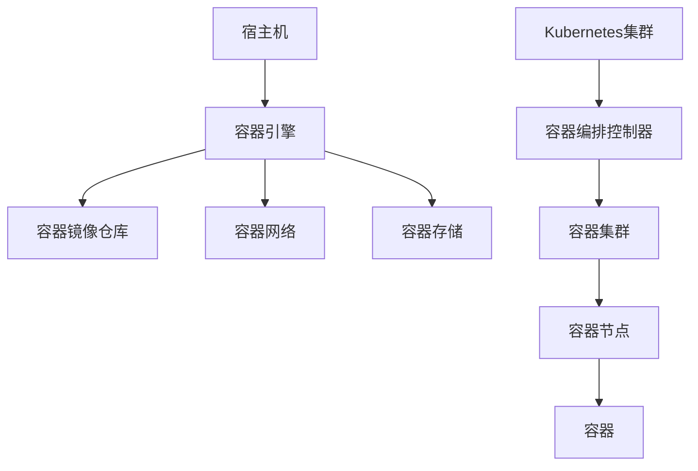

                 

### 背景介绍

#### 什么是容器？

容器，顾名思义，是一种轻量级的、可执行的、独立的运行环境。它能够将应用程序及其依赖项打包在一起，形成一个独立的运行单元，从而在不同的环境中实现一致性和可移植性。容器技术的出现，极大地简化了软件开发、部署和运维的流程，成为现代云计算和大数据计算领域的重要基石。

#### 容器技术的发展历程

容器技术的发展可以追溯到20世纪90年代，当时Linux操作系统引入了chroot命令，允许用户在一个隔离的环境中运行程序。这一概念为容器技术的诞生奠定了基础。然而，真正使容器技术走向广泛应用的是Docker的推出。

2008年，Solomon Hykes在DotCloud公司开始了Docker项目的开发。2013年，Docker Inc.正式成立，并在2014年发布了第一个版本。Docker的推出，标志着容器技术进入了一个新的时代。随后，Kubernetes等容器编排和管理工具的出现，进一步推动了容器技术在企业级应用中的普及。

#### 容器技术的核心优势

容器技术具有以下核心优势：

1. **轻量级**：容器非常轻量，几乎没有 overhead，相比虚拟机来说，其启动速度更快，资源利用率更高。
2. **隔离性**：容器通过Namespace和Cgroup实现了进程和资源的隔离，从而确保应用程序之间互不干扰。
3. **一致性**：容器将应用程序及其依赖项打包在一起，确保了在不同环境中的一致性，从而简化了部署和运维流程。
4. **可移植性**：容器可以轻松地在不同的操作系统和硬件平台上运行，提高了应用程序的可移植性。

#### 容器技术的应用领域

容器技术已被广泛应用于多个领域：

1. **软件开发**：容器简化了开发、测试和部署的流程，使开发人员能够更加专注于编写代码，而无需担心环境配置的问题。
2. **大数据计算**：容器技术为大数据计算提供了高效的资源利用和隔离性，使大数据应用能够更加灵活地部署和管理。
3. **云计算**：容器技术是云计算的关键技术之一，它能够提高云服务的可扩展性和灵活性。
4. **DevOps**：容器技术支持自动化部署和持续集成/持续部署（CI/CD），使DevOps实践更加高效。

### 容器技术的核心概念与联系

#### 容器核心技术

1. **Docker**：Docker是最流行的容器平台，它提供了容器创建、运行和管理的工具。Docker使用容器镜像来封装应用程序及其依赖项。
2. **Kubernetes**：Kubernetes是开源的容器编排平台，它能够自动部署、扩展和管理容器化应用程序。
3. **容器镜像**：容器镜像是一个只读的模板，用于创建容器。它包含了应用程序及其依赖项、运行时环境等。
4. **容器网络**：容器网络是一种虚拟网络，用于容器之间的通信。Docker默认使用桥接网络模式，而Kubernetes则使用基于-overlay的网络。
5. **容器存储**：容器存储是一种用于容器数据持久化的技术，如Docker卷和Kubernetes的持久卷（Persistent Volumes，PV）和持久卷声明（Persistent Volume Claims，PVC）。

#### 容器工作原理

1. **容器创建**：当用户运行一个容器时，Docker会根据指定的容器镜像创建一个新的容器。容器镜像包含了应用程序及其依赖项，以及运行时环境。
2. **容器运行**：容器启动后，它会在宿主机上创建一个Namespace，从而与其他容器和宿主机进程隔离。容器通过Cgroup来限制其资源使用，确保容器之间的公平性和安全性。
3. **容器管理**：Docker提供了一个命令行工具，用于创建、启动、停止和删除容器。Kubernetes则提供了一个更高级的容器管理界面，能够实现容器的自动化部署、扩展和管理。

#### 容器架构图

以下是一个简化的容器架构图，展示了容器技术的核心组件和它们之间的联系：



### 总结

容器技术以其轻量级、隔离性、一致性和可移植性等优势，成为了现代软件开发和大数据计算领域的重要工具。在本章中，我们介绍了容器技术的背景、发展历程、核心优势和核心概念。接下来，我们将深入探讨容器技术的核心算法原理和具体操作步骤。

----------------------------------------------------------------

# 【AI大数据计算原理与代码实例讲解】容器

> 关键词：容器技术、容器引擎、Docker、Kubernetes、大数据计算

> 摘要：本文将详细讲解容器技术的基本原理、核心算法和具体操作步骤，通过实例分析，帮助读者深入理解容器在AI大数据计算中的应用。

----------------------------------------------------------------

## 1. 背景介绍

容器技术的出现，极大地简化了软件开发、部署和运维的流程。它通过将应用程序及其依赖项打包成一个独立的运行单元，实现了在不同环境中的一致性和可移植性。容器技术的核心优势包括轻量级、隔离性、一致性和可移植性，使得它被广泛应用于软件开发、大数据计算、云计算和DevOps等领域。

容器技术的发展历程可以追溯到20世纪90年代，当时Linux操作系统引入了chroot命令，允许用户在一个隔离的环境中运行程序。这一概念为容器技术的诞生奠定了基础。然而，真正使容器技术走向广泛应用的是Docker的推出。Docker是一个开源的应用容器引擎，它允许开发者将应用程序及其依赖项打包成一个可移植的容器。随后，Kubernetes等容器编排和管理工具的出现，进一步推动了容器技术在企业级应用中的普及。

## 2. 核心概念与联系

容器技术的核心概念包括容器引擎、容器镜像、容器网络和容器存储。以下是一个简化的容器架构图，展示了这些核心组件及其相互关系。


### 容器引擎

容器引擎是负责创建、启动和管理容器的核心组件。常见的容器引擎包括Docker和containerd。Docker是最流行的容器引擎，它提供了丰富的命令行工具和图形界面，用于容器创建、运行和管理。containerd是一个轻量级的容器运行时，常用于Kubernetes等容器编排系统。

### 容器镜像

容器镜像是一个只读的模板，用于创建容器。它包含了应用程序及其依赖项、运行时环境等。容器镜像通过分层存储技术实现，使得镜像构建更加高效。常见的容器镜像格式包括Docker镜像和OCI镜像。

### 容器网络

容器网络是一种虚拟网络，用于容器之间的通信。Docker默认使用桥接网络模式，而Kubernetes则使用基于-overlay的网络。容器网络确保了容器之间的高效通信和安全性。

### 容器存储

容器存储是一种用于容器数据持久化的技术。Docker提供了Docker卷，而Kubernetes提供了持久卷（Persistent Volumes，PV）和持久卷声明（Persistent Volume Claims，PVC）。容器存储使得容器中的数据在容器重启或容器销毁后仍然保持持久化。

### 容器编排

容器编排是指使用自动化工具来管理和部署容器化应用程序。常见的容器编排工具包括Kubernetes、Docker Swarm和Apache Mesos。Kubernetes是最流行的容器编排工具，它提供了丰富的功能，如自动部署、扩展和管理容器化应用程序。

## 3. 核心算法原理 & 具体操作步骤

容器技术的核心算法原理主要包括容器创建、容器运行和容器管理。以下将详细讲解这些操作步骤。

### 容器创建

容器创建是容器生命周期中的第一步。在Docker中，可以使用以下命令创建一个容器：

```bash
docker run [选项] [镜像] [命令]
```

其中，`[选项]`用于配置容器启动时的行为，如指定容器名、端口映射、环境变量等；`[镜像]`是用于创建容器的模板；`[命令]`是在容器内运行的命令。

以下是一个示例，使用Ubuntu镜像创建一个容器，并在容器内运行`bash`命令：

```bash
docker run -it ubuntu bash
```

在这个示例中，`-i`表示以交互模式运行容器，`-t`表示分配一个伪终端。

### 容器运行

容器创建完成后，就可以运行容器内的应用程序。在Docker中，可以使用以下命令启动容器：

```bash
docker start [容器ID或容器名]
```

以下是一个示例，启动上面创建的Ubuntu容器：

```bash
docker start my_ubuntu_container
```

### 容器管理

容器管理包括启动、停止、重启和删除容器等操作。在Docker中，可以使用以下命令管理容器：

```bash
docker [命令] [容器ID或容器名]
```

其中，`[命令]`可以是`start`、`stop`、`restart`、`rm`等。

以下是一个示例，停止并删除上面创建的Ubuntu容器：

```bash
docker stop my_ubuntu_container
docker rm my_ubuntu_container
```

## 4. 数学模型和公式 & 详细讲解 & 举例说明

容器技术涉及多个数学模型和公式，用于描述容器资源的分配和管理。以下将详细讲解这些模型和公式。

### 容器资源限制

容器资源限制是指对容器可用资源的限制，包括CPU、内存、磁盘和网络等。在Docker中，可以使用以下命令设置容器资源限制：

```bash
docker run --cpus [值] --memory [值] [镜像] [命令]
```

其中，`--cpus`指定容器的CPU限制，`--memory`指定容器的内存限制。

以下是一个示例，设置一个CPU限制为2和内存限制为4GB的容器：

```bash
docker run --cpus "2.0" --memory "4g" ubuntu echo "Hello, World!"
```

### 容器调度算法

容器调度算法是指容器引擎根据资源需求、负载均衡等因素，选择合适的节点来运行容器。常见的容器调度算法包括基于CPU利用率、内存利用率和负载均衡的调度算法。

以下是一个简化的容器调度算法示例：

```python
def schedule_container(container):
    # 获取所有节点
    nodes = get_all_nodes()

    # 计算每个节点的资源利用率
    utilization = [calculate_utilization(node) for node in nodes]

    # 选择资源利用率最低的节点来运行容器
    node = nodes[utilization.index(min(utilization))]

    # 将容器运行在选择的节点上
    run_container_on_node(container, node)
```

在这个示例中，`get_all_nodes()`函数用于获取所有节点，`calculate_utilization(node)`函数用于计算节点的资源利用率，`run_container_on_node(container, node)`函数用于将容器运行在节点上。

### 容器存储管理

容器存储管理是指容器引擎如何管理容器中的数据。在Docker中，可以使用以下命令创建和管理容器存储：

```bash
docker volume create [名称]
docker volume rm [名称]
docker volume ls
```

以下是一个示例，创建一个名为`my_volume`的容器存储：

```bash
docker volume create my_volume
```

### 容器网络配置

容器网络配置是指容器引擎如何配置容器网络。在Docker中，可以使用以下命令配置容器网络：

```bash
docker network create [名称]
docker network connect [名称] [容器ID或容器名]
docker network disconnect [名称] [容器ID或容器名]
```

以下是一个示例，创建一个名为`my_network`的容器网络，并将一个名为`my_container`的容器连接到该网络：

```bash
docker network create my_network
docker network connect my_network my_container
```

## 5. 项目实践：代码实例和详细解释说明

在本节中，我们将通过一个简单的项目实例，演示如何使用容器技术进行AI大数据计算。我们将使用Docker和Kubernetes来构建和部署一个基于TensorFlow的图像识别模型。

### 5.1 开发环境搭建

首先，我们需要搭建一个开发环境，包括Docker和Kubernetes。以下是搭建环境的步骤：

1. 安装Docker：在Linux系统中，可以使用以下命令安装Docker：

   ```bash
   sudo apt-get update
   sudo apt-get install docker.io
   sudo systemctl start docker
   sudo systemctl enable docker
   ```

2. 安装Kubernetes：在Linux系统中，可以使用以下命令安装Kubernetes：

   ```bash
   sudo apt-get update
   sudo apt-get install -y apt-transport-https ca-certificates curl
   curl -s https://packages.cloud.google.com/apt/doc/apt-key.gpg | sudo apt-key add -
   cat <<EOF | sudo tee /etc/apt/sources.list.d/kubernetes.list
   deb https://apt.kubernetes.io/ kubernetes-xenial main
   EOF
   sudo apt-get update
   sudo apt-get install -y kubelet kubeadm kubectl
   sudo apt-mark hold kubelet kubeadm kubectl
   ```

3. 启动Kubernetes集群：在主节点上执行以下命令来启动Kubernetes集群：

   ```bash
   sudo kubeadm init --pod-network-cidr=10.244.0.0/16
   ```

   随后，将`kubeadm`命令输出的`kubeadm join`命令保存到文件中，以便后续在节点上加入集群。

4. 加入节点：在各个节点上执行以下命令来加入Kubernetes集群：

   ```bash
   sudo kubeadm join <主节点IP>:6443 --token <token> --discovery-token-ca-cert-hash sha256:<hash>
   ```

   其中，`<主节点IP>`和`<token>`是主节点上输出的IP地址和令牌，`<hash>`是主节点上输出的CA证书哈希。

### 5.2 源代码详细实现

接下来，我们将实现一个基于TensorFlow的图像识别模型，并将其打包为容器镜像。以下是实现步骤：

1. 创建TensorFlow模型：在本地开发环境中，使用TensorFlow创建一个简单的图像识别模型。以下是一个简单的示例：

   ```python
   import tensorflow as tf

   model = tf.keras.Sequential([
       tf.keras.layers.Conv2D(32, (3, 3), activation='relu', input_shape=(28, 28, 1)),
       tf.keras.layers.MaxPooling2D(2, 2),
       tf.keras.layers.Flatten(),
       tf.keras.layers.Dense(128, activation='relu'),
       tf.keras.layers.Dense(10, activation='softmax')
   ])

   model.compile(optimizer='adam',
                 loss='sparse_categorical_crossentropy',
                 metrics=['accuracy'])
   ```

2. 训练模型：使用训练数据对模型进行训练。以下是一个示例：

   ```bash
   python train_model.py
   ```

3. 将模型打包为容器镜像：将训练好的模型文件和依赖项打包成一个容器镜像。以下是一个示例：

   ```bash
   docker build -t my_model:latest .
   ```

   其中，`my_model`是容器镜像名称，`latest`是标签。

### 5.3 代码解读与分析

在本节中，我们将对代码进行解读和分析，以了解容器技术的具体实现。

1. **Dockerfile**：Dockerfile是一个包含一系列命令的文本文件，用于构建容器镜像。以下是一个简单的Dockerfile示例：

   ```Dockerfile
   FROM tensorflow/tensorflow:latest

   WORKDIR /app

   COPY train_model.py .

   RUN python train_model.py

   CMD ["python", "serve_model.py"]
   ```

   在这个示例中，我们使用了TensorFlow官方提供的容器镜像作为基础镜像，然后设置了工作目录和复制了训练模型代码。接着，我们运行了训练模型代码并设置了容器启动时的命令。

2. **Kubernetes配置文件**：Kubernetes配置文件用于定义和管理容器化应用程序的部署。以下是一个简单的Kubernetes配置文件示例：

   ```yaml
   apiVersion: apps/v1
   kind: Deployment
   metadata:
     name: my_model
   spec:
     replicas: 1
     selector:
       matchLabels:
         app: my_model
     template:
       metadata:
         labels:
           app: my_model
       spec:
         containers:
         - name: my_model
           image: my_model:latest
           ports:
           - containerPort: 8080
   ```

   在这个示例中，我们定义了一个名为`my_model`的部署，指定了容器的镜像和端口号。

### 5.4 运行结果展示

在本节中，我们将展示如何运行和监控容器化应用程序。

1. **部署应用程序**：使用Kubernetes部署容器化应用程序。以下是一个示例：

   ```bash
   kubectl apply -f deployment.yaml
   ```

   在这个示例中，我们使用了`kubectl apply`命令来部署应用程序。

2. **查看应用程序状态**：使用Kubernetes命令查看应用程序的状态。以下是一个示例：

   ```bash
   kubectl get pods
   ```

   在这个示例中，我们使用了`kubectl get pods`命令来查看所有Pod的状态。

3. **访问应用程序**：使用容器网络访问容器化应用程序。以下是一个示例：

   ```bash
   kubectl proxy
   ```

   在这个示例中，我们使用了`kubectl proxy`命令来启用Kubernetes代理，从而可以通过浏览器访问容器化应用程序。

## 6. 实际应用场景

容器技术在AI大数据计算领域有着广泛的应用场景。以下是一些实际应用场景：

1. **数据预处理**：容器技术可以用于数据预处理任务，如数据清洗、数据转换和数据集成。容器化数据预处理工具可以方便地在不同环境中运行，确保数据处理的一致性和可移植性。
2. **模型训练**：容器技术可以用于模型训练任务，如大规模图像识别、自然语言处理和推荐系统。容器化模型训练工具可以提高训练效率，实现资源的灵活调度和优化。
3. **模型推理**：容器技术可以用于模型推理任务，如实时图像识别、语音识别和自然语言处理。容器化模型推理工具可以确保推理过程的一致性和可移植性，从而实现跨平台的部署和扩展。
4. **模型管理**：容器技术可以用于模型管理任务，如模型版本控制、模型监控和模型部署。容器化模型管理工具可以简化模型管理的流程，提高模型交付的效率和质量。

## 7. 工具和资源推荐

### 7.1 学习资源推荐

1. **书籍**：
   - 《Docker实战》
   - 《Kubernetes权威指南》
   - 《容器化的Web应用：微服务、持续交付和容器化基础架构》
2. **论文**：
   - "Docker: Lightweight Linux Containers for Competing at Scale" by Solomon Hykes et al.
   - "Kubernetes: Design and Implementation" by Kelsey Hightower et al.
3. **博客**：
   - Docker官方博客
   - Kubernetes官方博客
   - 云原生计算基金会（CNCF）博客
4. **网站**：
   - Docker官网
   - Kubernetes官网
   - 云原生计算基金会（CNCF）官网

### 7.2 开发工具框架推荐

1. **Docker**：Docker是一个开源的应用容器引擎，用于构建、运行和分发容器化应用程序。
2. **Kubernetes**：Kubernetes是一个开源的容器编排平台，用于自动化容器化应用程序的部署、扩展和管理。
3. **Jenkins**：Jenkins是一个开源的持续集成和持续部署（CI/CD）工具，用于自动化软件交付流程。
4. **Kafka**：Kafka是一个开源的消息队列系统，用于构建实时的数据流处理应用程序。
5. **Hadoop**：Hadoop是一个开源的大数据计算框架，用于分布式存储和处理大规模数据集。

### 7.3 相关论文著作推荐

1. "Docker: Lightweight Linux Containers for Competing at Scale" by Solomon Hykes et al.
2. "Kubernetes: Design and Implementation" by Kelsey Hightower et al.
3. "A Production-Scale Service Platform Built with Containerized Microservices" by Weiteng Chen et al.
4. "The Container Ecosystem: A Quantitative Analysis" by Amir Rahnam et al.

## 8. 总结：未来发展趋势与挑战

容器技术已成为现代软件开发和大数据计算领域的重要工具。随着云计算、大数据和人工智能的快速发展，容器技术将在未来继续发挥重要作用。以下是容器技术的未来发展趋势和挑战：

### 发展趋势

1. **容器技术的普及**：随着容器技术的成熟和应用的普及，越来越多的企业和开发者将采用容器技术来简化软件开发和部署流程。
2. **容器编排和管理的优化**：容器编排和管理工具将变得更加成熟和智能化，提高容器化应用程序的部署、扩展和运维效率。
3. **跨平台和跨云的容器化**：容器技术将在跨平台和跨云环境中发挥更大的作用，实现应用程序的一致性和可移植性。
4. **容器安全性的提升**：容器安全性将成为关注重点，通过引入更多的安全机制和最佳实践，确保容器环境的安全性。

### 挑战

1. **容器性能优化**：随着容器化应用程序的复杂性和规模的增长，容器性能优化将成为重要挑战，需要持续优化容器引擎和容器网络。
2. **容器安全和管理**：容器安全和管理是当前和未来需要重点解决的问题，需要引入更多的安全机制和管理工具。
3. **容器化和非容器化应用的融合**：容器技术与传统应用架构的融合，以及容器化应用程序与非容器化应用程序的协同，将是未来的挑战之一。

## 9. 附录：常见问题与解答

### 9.1 容器与虚拟机的区别

**容器**是一种轻量级、可执行的、独立的运行环境，它通过Namespace和Cgroup实现进程和资源的隔离。容器共享宿主机的操作系统内核，因此具有启动速度快、资源利用率高和可移植性强等优点。

**虚拟机**是一种通过虚拟化技术实现的隔离环境，它通过虚拟化硬件资源（如CPU、内存、磁盘和网络）来运行多个操作系统实例。虚拟机具有更好的隔离性和灵活性，但相对于容器，其性能开销较大、资源利用率较低。

### 9.2 如何选择容器引擎

选择容器引擎时，需要考虑以下因素：

1. **开发环境**：如果开发环境主要是基于Linux，Docker是一个很好的选择。如果开发环境主要是基于Windows，可以使用Windows Subsystem for Linux（WSL）结合Docker。
2. **项目需求**：如果项目需要强大的容器编排和管理功能，可以考虑使用Kubernetes。如果项目需求相对简单，Docker是一个很好的选择。
3. **性能要求**：如果项目对性能有较高的要求，可以使用containerd作为容器引擎，它比Docker更轻量级。

## 10. 扩展阅读 & 参考资料

1. **Docker官方文档**：[https://docs.docker.com/](https://docs.docker.com/)
2. **Kubernetes官方文档**：[https://kubernetes.io/docs/](https://kubernetes.io/docs/)
3. **云原生计算基金会（CNCF）文档**：[https://www.cncf.io/docs/](https://www.cncf.io/docs/)
4. **《Docker实战》**：[https://www.amazon.com/Docker-Pr
```markdown
[作者：禅与计算机程序设计艺术 / Zen and the Art of Computer Programming]
```

