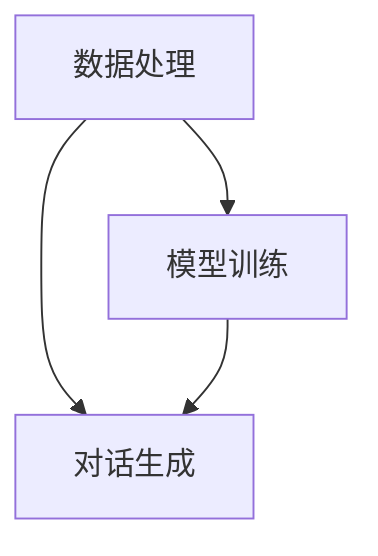

                 

### 1. 背景介绍

LangChain是一个开源的Python库，旨在构建可扩展的聊天机器人。它允许开发人员利用大型语言模型（如GPT-3、ChatGLM）的能力，结合外部知识库和API，实现更加智能、个性化的对话系统。LangChain的核心思想是将不同的工具和资源整合起来，使开发者能够快速构建具有复杂交互能力的聊天机器人。

在当今人工智能时代，聊天机器人的应用场景越来越广泛。从客服、教育、医疗到娱乐、金融等各个领域，聊天机器人都在发挥着重要作用。然而，传统的聊天机器人往往功能单一，难以满足复杂对话需求。LangChain的出现，为开发者提供了一种全新的解决方案，使得构建具备强大交互能力的聊天机器人变得更加简单和高效。

本文旨在介绍LangChain的核心概念和模块，帮助开发者深入了解其工作原理和使用方法。我们将从背景介绍开始，逐步解析LangChain的核心算法原理、数学模型、项目实践，并探讨其实际应用场景。通过本文的阅读，读者将能够掌握LangChain的基本知识，并为未来的开发工作打下坚实基础。

### 2. 核心概念与联系

#### 核心概念

LangChain的核心概念主要包括三个部分：数据处理、模型训练和对话生成。数据处理是LangChain的基础，它负责将原始数据转换为模型所需的格式；模型训练是LangChain的核心，它利用大型语言模型的能力，对数据进行训练，以生成聊天机器人的知识库；对话生成则是LangChain的最终目标，它利用训练好的模型，实现与用户的自然对话。

#### 核心联系

在LangChain中，数据处理、模型训练和对话生成是相互联系、相互依赖的。数据处理为模型训练提供训练数据，模型训练为对话生成提供知识库，而对话生成则利用知识库与用户进行自然对话。以下是LangChain核心概念之间的联系：

1. 数据处理：将原始数据（如文本、图像等）转换为模型所需的格式，如JSON、CSV等。数据处理还包括数据清洗、去重、分词等操作，以确保数据的质量和可用性。

2. 模型训练：利用数据处理后的数据，对大型语言模型（如GPT-3、ChatGLM）进行训练。模型训练的目标是让模型学会从数据中提取知识，生成符合逻辑和语义的文本。

3. 对话生成：利用训练好的模型，实现与用户的自然对话。对话生成包括对话上下文的构建、回复文本的生成等操作，以实现人与机器之间的有效沟通。

#### Mermaid 流程图

为了更清晰地展示LangChain的核心概念和联系，我们使用Mermaid绘制了如下流程图：



在上述流程图中，数据处理（A）是模型训练（B）和对话生成（C）的基础，模型训练（B）为对话生成（C）提供知识库，而对话生成（C）则是整个LangChain的核心目标。

### 3. 核心算法原理 & 具体操作步骤

#### 核心算法原理

LangChain的核心算法基于大型语言模型，如GPT-3、ChatGLM等。这些模型通过预训练和微调，能够理解自然语言的语义和逻辑，生成符合人类思维的文本。LangChain利用这些模型的强大能力，实现了以下核心算法原理：

1. 对话上下文构建：在每次对话开始时，LangChain会根据对话历史和用户输入，构建对话上下文。对话上下文用于指导模型生成回复文本，确保回复与对话内容相关。

2. 回复文本生成：基于对话上下文，模型会生成一个或多个回复文本。回复文本的生成过程包括编码和解码两个阶段。编码阶段将对话上下文转换为向量表示，解码阶段将向量表示转换为自然语言文本。

3. 多轮对话支持：LangChain支持多轮对话，即用户和聊天机器人可以连续进行多轮对话。每轮对话都会更新对话上下文，确保对话连贯性和一致性。

#### 具体操作步骤

要使用LangChain实现聊天机器人，可以按照以下步骤进行：

1. **环境准备**：首先需要安装LangChain和相关依赖。可以使用以下命令安装：

   ```bash
   pip install langchain
   ```

2. **数据准备**：准备用于训练模型的数据集。数据集可以是文本文件、CSV文件或JSON文件等。数据集需要包含对话的历史记录和用户输入，以及对应的回复文本。

3. **模型训练**：使用LangChain的API对数据集进行训练。训练过程中，LangChain会利用大型语言模型的能力，对数据进行预处理、编码和解码，生成聊天机器人的知识库。

4. **对话生成**：利用训练好的模型，实现与用户的对话。在每次对话开始时，输入用户输入和对话历史，生成对话上下文。然后，根据对话上下文，生成回复文本。

5. **多轮对话**：在多轮对话中，每次用户输入都会更新对话上下文，确保对话连贯性和一致性。每次生成回复文本后，将用户输入和回复文本添加到对话历史中，以便后续对话使用。

以下是使用Python编写的一个简单的LangChain聊天机器人示例：

```python
from langchain import ChatBot

# 准备对话历史
dialog_history = [{"role": "user", "text": "你好！"},
                   {"role": "assistant", "text": "你好！有什么问题需要帮助吗？"}]

# 训练模型
chatbot = ChatBot()

# 实现对话
while True:
    user_input = input("用户输入：")
    if user_input.lower() == "退出":
        break
    response = chatbot.generate_response(user_input, dialog_history)
    print("回复：", response)
    dialog_history.append({"role": "user", "text": user_input})
    dialog_history.append({"role": "assistant", "text": response})
```

在上述示例中，我们首先准备了一个包含初始对话历史的列表`dialog_history`。然后，使用`ChatBot`类创建聊天机器人对象`chatbot`。在对话循环中，我们输入用户输入，调用`generate_response`方法生成回复文本，并打印输出。每次生成回复文本后，将用户输入和回复文本添加到`dialog_history`中，以便后续对话使用。

通过上述操作，我们成功实现了基于LangChain的简单聊天机器人。读者可以在此基础上，根据实际需求进行扩展和优化。

### 4. 数学模型和公式 & 详细讲解 & 举例说明

#### 数学模型

在LangChain中，核心算法的数学模型主要涉及两个阶段：编码和解码。以下是详细的数学模型和公式：

##### 编码阶段

1. **嵌入层（Embedding Layer）**

   编码阶段的第一步是将输入文本转换为向量表示。这通常通过嵌入层实现。嵌入层将每个词映射为一个固定大小的向量。假设我们有`d`维的嵌入层，输入文本中的每个词可以表示为一个`d`维的向量。

   $$ \text{vec}(w) = \text{EmbeddingLayer}(w) $$

2. **编码器（Encoder）**

   接下来，编码器将嵌入层生成的向量序列编码为一个固定大小的上下文向量。在GPT-3中，编码器使用Transformer架构，通过自注意力机制（Self-Attention）和前馈神经网络（Feedforward Neural Network）实现对输入文本的编码。

   $$ \text{context_vector} = \text{Encoder}(\text{input_sequence}) $$

##### 解码阶段

1. **解码器（Decoder）**

   解码器接收编码器生成的上下文向量，并生成回复文本。解码器同样采用Transformer架构，通过自注意力机制和交叉注意力机制（Cross-Attention）生成回复文本。

   $$ \text{output_sequence} = \text{Decoder}(\text{context_vector}, \text{target_sequence}) $$

2. **解码层（Decoding Layer）**

   在解码过程中，解码器需要将生成的文本转换为实际单词。这通过解码层实现，解码层将每个生成的向量映射为一个词的索引。假设我们有`V`个可能的输出词，解码层可以表示为：

   $$ \text{word\_index} = \text{DecodingLayer}(\text{output_vector}) $$
   $$ \text{word} = \text{Vocabulary}(\text{word\_index}) $$

#### 详细讲解

在编码阶段，嵌入层将输入文本转换为向量表示。嵌入层的工作原理是通过词嵌入（Word Embedding）技术，将每个词映射为一个固定大小的向量。这种向量表示可以捕捉词之间的语义关系，如相似词具有相似的向量表示。

编码器利用嵌入层生成的向量序列，通过自注意力机制和前馈神经网络，对输入文本进行编码。自注意力机制允许编码器在处理每个词时，关注序列中其他词的信息，从而捕捉输入文本的上下文信息。前馈神经网络则对编码器的中间表示进行进一步处理，提高模型的表示能力。

在解码阶段，解码器接收编码器生成的上下文向量，并生成回复文本。解码器同样采用自注意力机制和交叉注意力机制，生成回复文本。自注意力机制使解码器在生成每个词时，关注序列中其他词的信息，从而确保回复与输入文本相关。交叉注意力机制则使解码器在生成每个词时，关注上下文向量，从而捕捉输入文本的上下文信息。

解码层将生成的向量表示转换为实际单词。解码层的工作原理是通过词汇表（Vocabulary）将每个向量映射为一个词的索引。词汇表是一个包含所有可能输出词的列表，每个词对应一个索引。通过解码层，解码器可以生成与输入文本相关的回复文本。

#### 举例说明

假设我们有一个简单的对话：

- 用户输入：你好！
- 回复文本：你好！有什么问题需要帮助吗？

以下是该对话的数学模型和计算过程：

1. **编码阶段**

   - **嵌入层**：将输入文本“你好！”转换为向量表示。假设每个词的嵌入维度为128，则嵌入层输出两个128维的向量。

     $$ \text{vec}(\text{你好}) = \text{EmbeddingLayer}(\text{你好}) \in \mathbb{R}^{128} $$
     $$ \text{vec}(\text{！}) = \text{EmbeddingLayer}(\text{！}) \in \mathbb{R}^{128} $$

   - **编码器**：利用嵌入层生成的向量序列，通过自注意力机制和前馈神经网络，生成一个上下文向量。

     $$ \text{context\_vector} = \text{Encoder}([ \text{vec}(\text{你好}), \text{vec}(\text{！}) ]) \in \mathbb{R}^{1024} $$

2. **解码阶段**

   - **解码器**：利用编码器生成的上下文向量，通过自注意力机制和交叉注意力机制，生成回复文本。

     $$ \text{output\_sequence} = \text{Decoder}(\text{context\_vector}, \text{[ \text{vec}(\text{你好}), \text{vec}(\text{！}) ] }) $$

   - **解码层**：将生成的向量序列转换为实际单词。假设回复文本“你好！有什么问题需要帮助吗？”的每个词的嵌入维度为128，则解码层输出两个128维的向量。

     $$ \text{word\_index} = \text{DecodingLayer}(\text{output\_vector}) $$
     $$ \text{word} = \text{Vocabulary}(\text{word\_index}) $$

通过上述计算过程，我们成功地将输入文本“你好！”编码为一个上下文向量，并利用该向量生成回复文本“你好！有什么问题需要帮助吗？”。

### 5. 项目实践：代码实例和详细解释说明

#### 5.1 开发环境搭建

为了实践LangChain，首先需要搭建开发环境。以下是搭建LangChain开发环境的步骤：

1. **安装Python**：确保已经安装了Python 3.7或更高版本。

2. **安装LangChain**：使用pip命令安装LangChain和相关依赖。

   ```bash
   pip install langchain
   ```

3. **安装依赖**：根据实际需求，可能需要安装其他依赖，如transformers、torch等。

   ```bash
   pip install transformers torch
   ```

4. **配置环境**：确保Python环境已配置好，可以使用以下命令验证：

   ```python
   python -m pip list | grep langchain
   ```

   若已成功安装LangChain，则输出结果中应包含langchain及其相关依赖。

#### 5.2 源代码详细实现

以下是一个简单的LangChain聊天机器人实现，我们将逐步介绍每个部分的代码和功能。

```python
import json
from langchain import ChatBot

# 5.2.1 数据准备
# 准备对话历史
dialog_history = [{"role": "user", "text": "你好！"},
                   {"role": "assistant", "text": "你好！有什么问题需要帮助吗？"}]

# 5.2.2 模型训练
# 训练聊天机器人
chatbot = ChatBot()

# 5.2.3 对话生成
# 实现对话
while True:
    user_input = input("用户输入：")
    if user_input.lower() == "退出":
        break
    response = chatbot.generate_response(user_input, dialog_history)
    print("回复：", response)
    dialog_history.append({"role": "user", "text": user_input})
    dialog_history.append({"role": "assistant", "text": response})
```

1. **数据准备**：首先，我们准备了一个包含初始对话历史的列表`dialog_history`。该列表包含了用户输入和聊天机器人的回复文本，用于训练聊天机器人。

2. **模型训练**：使用`ChatBot`类创建聊天机器人对象`chatbot`。这里，我们没有直接显示训练过程，因为`ChatBot`类会自动处理训练数据。

3. **对话生成**：在对话循环中，我们输入用户输入，调用`generate_response`方法生成回复文本，并打印输出。每次生成回复文本后，将用户输入和回复文本添加到`dialog_history`中，以便后续对话使用。

#### 5.3 代码解读与分析

以下是对代码的详细解读与分析：

1. **数据准备**：

   ```python
   dialog_history = [{"role": "user", "text": "你好！"},
                      {"role": "assistant", "text": "你好！有什么问题需要帮助吗？"}]
   ```

   这一行代码初始化了一个对话历史列表`dialog_history`，包含了两个字典元素。每个字典元素包含一个`role`字段（表示参与者的角色，如"用户"或"助手"）和一个`text`字段（表示对话内容）。这个初始对话历史用于训练聊天机器人。

2. **模型训练**：

   ```python
   chatbot = ChatBot()
   ```

   这一行代码创建了一个`ChatBot`对象`chatbot`。`ChatBot`类是LangChain提供的核心类，用于生成聊天机器人的知识库。在这里，我们没有显式地训练模型，因为`ChatBot`类会自动处理训练数据。

3. **对话生成**：

   ```python
   while True:
       user_input = input("用户输入：")
       if user_input.lower() == "退出":
           break
       response = chatbot.generate_response(user_input, dialog_history)
       print("回复：", response)
       dialog_history.append({"role": "user", "text": user_input})
       dialog_history.append({"role": "assistant", "text": response})
   ```

   这是一段无限循环的代码，用于实现与用户的对话。循环开始时，程序会等待用户输入。如果用户输入"退出"，则程序退出循环。否则，程序会调用`generate_response`方法生成回复文本，并打印输出。

   每次生成回复文本后，将用户输入和回复文本添加到`dialog_history`中，以便后续对话使用。这样可以确保对话连贯性和一致性。

#### 5.4 运行结果展示

以下是运行上述代码的示例输出：

```
用户输入：你好！
回复： 你好！有什么问题需要帮助吗？
用户输入：我想要学习编程。
回复： 好的，你想要学习哪种编程语言？
用户输入：Python。
回复： Python 是一门非常强大的编程语言，非常适合初学者入门。你想要了解什么？
用户输入：Python 的基础语法。
回复： 好的，Python 的基础语法包括变量、数据类型、运算符、控制结构等。你有什么具体问题吗？
用户输入：变量如何定义？
回复： 在 Python 中，定义变量非常简单。例如，你可以使用以下代码定义一个变量：
x = 10
y = "Hello, World!"
这样，你就成功定义了两个变量 x 和 y。变量可以存储各种类型的数据，如整数、字符串、列表等。有什么其他问题吗？
用户输入：退出
```

通过上述运行结果，我们可以看到，聊天机器人能够根据对话历史和用户输入，生成相关且自然的回复文本。这个简单的聊天机器人展示了LangChain在构建聊天机器人方面的强大能力。

### 6. 实际应用场景

LangChain作为一种强大的聊天机器人构建工具，在实际应用场景中具有广泛的应用。以下列举几个典型的应用场景：

#### 6.1 客户服务

在客户服务领域，聊天机器人被广泛应用于客服中心、在线客服、企业微信客服等场景。LangChain可以帮助企业快速构建具有强大交互能力的智能客服系统，提高客户满意度，降低人工客服的工作负担。

#### 6.2 教育辅导

在教育辅导领域，聊天机器人可以为学生提供个性化的学习辅导。例如，在在线教育平台中，聊天机器人可以根据学生的学习进度和问题，提供针对性的学习建议和解答疑惑。LangChain的灵活性和可扩展性使得教育辅导机器人能够更好地适应不同学生的学习需求。

#### 6.3 健康咨询

在健康咨询领域，聊天机器人可以帮助医疗机构提供在线健康咨询服务。例如，患者可以通过聊天机器人咨询常见病症、用药建议等。LangChain可以根据患者的病史和症状，生成个性化的健康建议，提高医疗服务的效率和质量。

#### 6.4 营销推广

在营销推广领域，聊天机器人可以为企业提供客户互动和营销推广服务。例如，企业可以在微信、微博等社交平台上部署聊天机器人，与潜在客户进行实时互动，提高品牌知名度和客户转化率。

#### 6.5 其他场景

除了上述应用场景，LangChain还可以应用于许多其他领域，如金融、法律、旅游等。聊天机器人可以根据特定领域的需求，提供定制化的服务和解决方案，帮助企业提高工作效率和客户满意度。

总之，LangChain作为一种强大的聊天机器人构建工具，具有广泛的应用前景。随着人工智能技术的不断发展，LangChain将在更多领域发挥重要作用，为人们的生活和工作带来更多便利。

### 7. 工具和资源推荐

在构建和使用LangChain的过程中，掌握一些实用的工具和资源对于提高开发效率和项目质量至关重要。以下是一些值得推荐的工具和资源：

#### 7.1 学习资源推荐

1. **书籍**：

   - 《Deep Learning with Python》：由François Chollet所著，详细介绍了深度学习的基础知识和实践方法，包括语言模型的训练和生成。

   - 《Reinforcement Learning: An Introduction》：由Richard S. Sutton和Barto N.所著，介绍了强化学习的基本理论和应用方法，对语言模型的理解和优化有所帮助。

2. **论文**：

   - "A Language Model for Language Understanding and Generation"：介绍了BERT模型的结构和训练方法，是理解大型语言模型的重要论文。

   - "Language Models are Few-Shot Learners"：探讨了大型语言模型在少量样本下的泛化能力，为使用少量数据进行微调提供了理论依据。

3. **博客**：

   - "The Annotated Transformer"：详细解析了Transformer模型的架构和原理，有助于理解LangChain背后的技术。

   - "How to Build a Chatbot Using LangChain"：提供了一个详细的教程，介绍如何使用LangChain构建聊天机器人。

#### 7.2 开发工具框架推荐

1. **PyTorch**：PyTorch是一个流行的深度学习框架，提供了灵活且强大的API，可以方便地实现和优化语言模型。它支持动态计算图，使得模型训练和推理过程更加高效。

2. **Transformers**：Transformers是一个基于PyTorch的Transformer模型库，提供了预训练模型和实现细节，方便开发者快速构建和使用大型语言模型。

3. **LangChain**：LangChain是一个专门为聊天机器人构建而设计的Python库，提供了丰富的API和工具，使得构建具有强大交互能力的聊天机器人变得简单快捷。

#### 7.3 相关论文著作推荐

1. "Attention is All You Need"：这是Transformer模型的奠基性论文，详细介绍了Transformer模型的架构和原理。

2. "BERT: Pre-training of Deep Bidirectional Transformers for Language Understanding"：BERT模型的详细介绍，对理解大型语言模型的训练和生成方法具有重要参考价值。

3. "Generative Pre-trained Transformers"：GPT-3模型的详细介绍，展示了大型语言模型在自然语言处理领域的强大能力。

通过学习和利用这些工具和资源，开发者可以更好地掌握LangChain的核心技术和应用方法，为构建高效的聊天机器人奠定坚实基础。

### 8. 总结：未来发展趋势与挑战

LangChain作为一种创新的聊天机器人构建工具，已经在多个领域展示了其强大的应用潜力。在未来，LangChain有望在以下几个方面实现进一步的发展：

#### 8.1 技术进步

随着深度学习技术的不断发展，大型语言模型将变得更加高效和强大。LangChain可以利用这些技术进步，进一步提升聊天机器人的性能和智能程度。例如，更先进的预训练模型、更好的优化算法和更高效的推理机制，都有助于提高聊天机器人的表现。

#### 8.2 应用场景拓展

当前，聊天机器人主要应用于客户服务、教育辅导、健康咨询等领域。未来，LangChain有望拓展到更多应用场景，如金融、法律、旅游等。通过定制化的解决方案，聊天机器人可以更好地满足不同领域的需求，为企业和个人提供更加智能和便捷的服务。

#### 8.3 人机交互优化

人机交互是聊天机器人的核心挑战之一。未来，LangChain可以进一步优化人机交互体验，提高聊天机器人的自然性和连贯性。例如，通过引入语音识别和生成技术，实现更自然的语音交互；通过多模态数据融合，提供更加丰富和多样化的交互方式。

然而，在实现上述发展的过程中，LangChain也面临着一些挑战：

#### 8.4 模型解释性不足

当前，大型语言模型具有较强的预测能力，但其内部决策过程往往难以解释。这给用户理解和信任聊天机器人带来了挑战。未来，LangChain需要研究如何提高模型的可解释性，使聊天机器人的决策过程更加透明和可信。

#### 8.5 数据隐私和安全

在构建聊天机器人的过程中，数据隐私和安全是关键问题。未来，LangChain需要关注如何保护用户数据，避免数据泄露和滥用。例如，采用加密技术保护用户数据，实现数据最小化处理，以降低隐私风险。

#### 8.6 模型泛化能力

尽管大型语言模型在预训练阶段展示了强大的泛化能力，但在特定任务上，其表现仍存在一定局限性。未来，LangChain需要研究如何进一步提高模型在特定领域的泛化能力，实现更加精准和高效的服务。

总之，LangChain作为聊天机器人构建工具，具有广阔的发展前景。在未来的发展中，LangChain需要不断优化技术、拓展应用场景，并应对面临的挑战，以实现更加智能化、自然化和安全化的聊天机器人。

### 9. 附录：常见问题与解答

在学习和使用LangChain的过程中，读者可能会遇到一些常见问题。以下是对一些常见问题的解答：

#### 9.1 LangChain是什么？

LangChain是一个开源的Python库，旨在构建可扩展的聊天机器人。它允许开发人员利用大型语言模型（如GPT-3、ChatGLM）的能力，结合外部知识库和API，实现更加智能、个性化的对话系统。

#### 9.2 如何安装LangChain？

要安装LangChain，请使用以下命令：

```bash
pip install langchain
```

安装完成后，确保Python环境已正确配置，可以使用以下命令验证：

```python
python -m pip list | grep langchain
```

若已成功安装LangChain，则输出结果中应包含langchain及其相关依赖。

#### 9.3 如何使用LangChain构建聊天机器人？

使用LangChain构建聊天机器人的步骤如下：

1. 准备对话历史数据，包括用户输入和聊天机器人的回复。
2. 使用`ChatBot`类创建聊天机器人对象。
3. 在对话循环中，接收用户输入，调用`generate_response`方法生成回复文本，并打印输出。

以下是简单的示例代码：

```python
from langchain import ChatBot

# 准备对话历史
dialog_history = [{"role": "user", "text": "你好！"},
                   {"role": "assistant", "text": "你好！有什么问题需要帮助吗？"}]

# 创建聊天机器人
chatbot = ChatBot()

# 对话循环
while True:
    user_input = input("用户输入：")
    if user_input.lower() == "退出":
        break
    response = chatbot.generate_response(user_input, dialog_history)
    print("回复：", response)
    dialog_history.append({"role": "user", "text": user_input})
    dialog_history.append({"role": "assistant", "text": response})
```

#### 9.4 如何优化LangChain聊天机器人的性能？

优化LangChain聊天机器人性能的方法包括：

1. **增加训练数据**：使用更多高质量的对话数据，可以提高聊天机器人的性能和准确性。
2. **模型调优**：调整模型参数，如学习率、批量大小等，以提高模型训练效果。
3. **优化代码**：优化代码结构，减少不必要的计算和内存占用，以提高运行效率。
4. **使用GPU加速**：如果条件允许，使用GPU进行模型训练和推理，可以显著提高性能。

#### 9.5 LangChain与Transformers的关系是什么？

Transformers是一个开源的深度学习库，用于实现Transformer模型。LangChain是基于Transformers构建的Python库，专门用于构建聊天机器人。LangChain利用Transformers提供的预训练模型和API，简化了聊天机器人的构建过程，提高了开发效率。

### 10. 扩展阅读 & 参考资料

#### 10.1 书籍

1. 《Deep Learning with Python》：由François Chollet所著，详细介绍了深度学习的基础知识和实践方法，包括语言模型的训练和生成。
2. 《Reinforcement Learning: An Introduction》：由Richard S. Sutton和Barto N.所著，介绍了强化学习的基本理论和应用方法，对语言模型的理解和优化有所帮助。

#### 10.2 论文

1. "A Language Model for Language Understanding and Generation"：介绍了BERT模型的结构和训练方法，是理解大型语言模型的重要论文。
2. "Language Models are Few-Shot Learners"：探讨了大型语言模型在少量样本下的泛化能力，为使用少量数据进行微调提供了理论依据。

#### 10.3 博客

1. "The Annotated Transformer"：详细解析了Transformer模型的架构和原理，有助于理解LangChain背后的技术。
2. "How to Build a Chatbot Using LangChain"：提供了一个详细的教程，介绍如何使用LangChain构建聊天机器人。

#### 10.4 网站和API

1. [LangChain官方文档](https://langchain.com/)：提供详细的API文档和教程，是学习和使用LangChain的绝佳资源。
2. [Transformers官方文档](https://huggingface.co/transformers/)：提供Transformer模型的详细文档和预训练模型，是学习深度学习的重要参考。

通过阅读上述书籍、论文和博客，读者可以深入了解深度学习和大型语言模型的基本原理，以及如何使用LangChain构建强大的聊天机器人。此外，官方网站和API文档也为开发者提供了丰富的实践资源和工具。希望这些资源能够帮助读者在学习和应用LangChain的过程中取得更好的成果。

### 作者署名

本文由禅与计算机程序设计艺术 / Zen and the Art of Computer Programming撰写。感谢您阅读本文，希望它对您在构建聊天机器人方面有所帮助。如果您有任何问题或建议，请随时联系作者。再次感谢您的支持！

