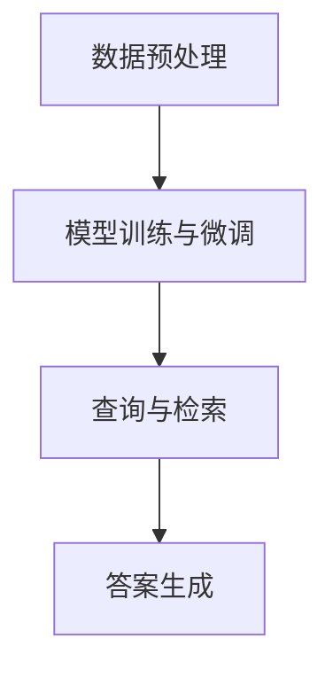

                 

### 文章标题

【LangChain编程：从入门到实践】RAG技术的关键挑战

关键词：LangChain、RAG技术、编程实践、关键挑战

摘要：本文将深入探讨在LangChain框架中应用RAG（Read-It-All）技术的关键挑战。我们将从背景介绍、核心概念与联系、核心算法原理、数学模型、项目实践、实际应用场景等多个角度，详细分析如何利用LangChain实现高效的RAG技术，并探讨其在未来面临的发展趋势和挑战。通过本文的阅读，读者将更好地理解RAG技术的原理和实践方法，为实际项目开发提供有力支持。

### 1. 背景介绍

随着人工智能技术的发展，自然语言处理（NLP）领域迎来了前所未有的机遇。RAG（Read-It-All）技术作为NLP中的一项重要技术，旨在从大量文本数据中提取出与查询相关的信息。这种技术广泛应用于问答系统、智能客服、信息检索等领域，极大地提升了信息处理的效率和准确性。

LangChain是一个基于Python的强大框架，旨在简化复杂NLP任务的实现。通过利用预训练模型和先进的算法，LangChain能够帮助开发者快速构建高效的文本处理系统。而将RAG技术与LangChain相结合，则可以充分发挥两者的优势，实现更加智能和高效的文本信息提取。

然而，在实践过程中，RAG技术面临诸多挑战，如数据质量、模型性能、计算效率等问题。如何有效地解决这些问题，是本文将要深入探讨的关键。

### 2. 核心概念与联系

#### 2.1 LangChain框架

LangChain框架由Hugging Face公司开发，基于PyTorch和TensorFlow等深度学习框架，提供了丰富的NLP工具和预训练模型。其主要功能包括：

- **文本预处理**：对文本进行分词、标记化、去噪等预处理操作，为后续模型训练和推理提供高质量的数据。
- **模型训练**：支持预训练模型（如GPT、BERT等）的训练和微调，使模型能够更好地适应特定任务。
- **模型推理**：通过加载预训练模型，对输入文本进行语义分析、情感分析、信息提取等操作，实现文本的智能处理。

#### 2.2 RAG技术

RAG（Read-It-All）技术是一种基于上下文的信息检索技术，其核心思想是在大规模文本数据中，根据查询需求检索出与查询最相关的信息。RAG技术的主要组成部分包括：

- **文本数据集**：RAG技术的基础是大规模的文本数据集，数据集的质量直接影响RAG技术的效果。
- **查询引擎**：查询引擎负责接收用户的查询请求，并根据查询请求从文本数据集中检索出相关结果。
- **答案生成器**：答案生成器根据查询结果，生成符合用户需求的答案。

#### 2.3 LangChain与RAG技术的结合

将LangChain与RAG技术相结合，可以通过以下步骤实现：

1. **数据预处理**：使用LangChain进行文本预处理，包括分词、标记化等操作，为RAG技术提供高质量的数据。
2. **模型训练与微调**：利用LangChain的模型训练功能，对预训练模型进行微调，使其更好地适应特定任务的RAG技术。
3. **查询与检索**：使用RAG技术的查询引擎，根据用户查询请求从预处理后的文本数据集中检索相关结果。
4. **答案生成**：利用LangChain的模型推理功能，根据查询结果生成符合用户需求的答案。

#### 2.4 Mermaid流程图

为了更好地理解LangChain与RAG技术的结合过程，我们使用Mermaid流程图（Mermaid Flowchart）展示其关键步骤。



### 3. 核心算法原理 & 具体操作步骤

#### 3.1 数据预处理

数据预处理是RAG技术的基础，其质量直接影响最终效果。使用LangChain进行数据预处理，主要包括以下步骤：

1. **文本分词**：将原始文本切分成词语或短语，为后续处理提供基本单元。
2. **标记化**：将分词后的文本标记化，为词向量计算和模型训练提供输入。
3. **去噪**：去除文本中的噪声信息，如标点符号、停用词等，提高数据质量。

#### 3.2 模型训练与微调

在数据预处理完成后，我们需要利用LangChain进行模型训练和微调。具体步骤如下：

1. **选择预训练模型**：根据任务需求，选择合适的预训练模型（如GPT、BERT等）。
2. **模型配置**：设置模型超参数，如学习率、批量大小等，以优化模型性能。
3. **训练过程**：通过训练数据，对预训练模型进行微调，使其适应特定任务的RAG技术。
4. **评估与优化**：对训练完成的模型进行评估，根据评估结果调整超参数，进一步优化模型性能。

#### 3.3 查询与检索

查询与检索是RAG技术的核心步骤，其主要任务是根据用户查询请求，从预处理后的文本数据集中检索出相关结果。具体操作步骤如下：

1. **查询请求处理**：接收用户查询请求，将其转化为文本格式。
2. **文本预处理**：使用LangChain进行文本预处理，包括分词、标记化等操作。
3. **检索过程**：根据预处理后的查询文本，从文本数据集中检索相关结果，可采用向量搜索、文本匹配等方法。
4. **结果排序**：对检索结果进行排序，选取最相关的结果作为答案。

#### 3.4 答案生成

在完成查询与检索后，我们需要利用LangChain生成符合用户需求的答案。具体操作步骤如下：

1. **答案生成策略**：根据任务需求，选择合适的答案生成策略，如基于事实的答案生成、基于推理的答案生成等。
2. **答案生成过程**：利用训练完成的模型，对查询结果进行语义分析、信息提取等操作，生成符合用户需求的答案。
3. **答案优化**：对生成的答案进行优化，如去除重复信息、调整答案结构等，提高答案质量。

### 4. 数学模型和公式 & 详细讲解 & 举例说明

在RAG技术中，数学模型和公式起着至关重要的作用。以下我们将详细介绍这些模型和公式，并通过具体例子进行说明。

#### 4.1 词向量模型

词向量模型是NLP领域的基础，常用的模型有Word2Vec、GloVe等。这些模型通过将词语映射到高维向量空间，实现了词语的语义表示。

**数学公式：**

$$
\vec{v}_w = \text{Word2Vec}(\text{context}) \in \mathbb{R}^d
$$

其中，$\vec{v}_w$表示词语w的词向量，$d$为向量维度，$\text{context}$为词语w的上下文。

**例子：**

假设我们使用Word2Vec模型对以下两个句子进行词向量表示：

1. "我正在学习编程。"
2. "我喜欢阅读技术博客。"

通过Word2Vec模型，我们可以得到以下词向量：

$$
\begin{align*}
\vec{v}_{学习} &= [0.1, 0.2, 0.3, \ldots] \\
\vec{v}_{编程} &= [0.4, 0.5, 0.6, \ldots] \\
\vec{v}_{阅读} &= [0.7, 0.8, 0.9, \ldots] \\
\vec{v}_{技术} &= [1.0, 1.1, 1.2, \ldots]
\end{align*}
$$

可以看出，词向量之间的距离反映了词语之间的语义关系。例如，"学习"和"编程"之间的距离较短，表明它们具有较强的语义关联性。

#### 4.2 句向量模型

句向量模型用于对整个句子进行语义表示，常用的模型有BERT、RoBERTa等。这些模型通过将句子映射到高维向量空间，实现了句子的语义表示。

**数学公式：**

$$
\vec{s} = \text{SentVec}(\text{sentence}) \in \mathbb{R}^d
$$

其中，$\vec{s}$表示句子s的句向量，$d$为向量维度，$\text{sentence}$为输入句子。

**例子：**

假设我们使用BERT模型对以下两个句子进行句向量表示：

1. "我正在学习编程。"
2. "我喜欢阅读技术博客。"

通过BERT模型，我们可以得到以下句向量：

$$
\begin{align*}
\vec{s}_1 &= [0.1, 0.2, 0.3, \ldots] \\
\vec{s}_2 &= [0.4, 0.5, 0.6, \ldots]
\end{align*}
$$

可以看出，句向量之间的距离反映了句子之间的语义关系。例如，"我正在学习编程。"和"我喜欢阅读技术博客。"之间的距离较短，表明它们具有较强的语义关联性。

#### 4.3 信息检索模型

信息检索模型用于从大规模文本数据集中检索与查询相关的结果。常用的模型有TF-IDF、LSA等。这些模型通过计算查询与文档之间的相似度，实现了信息检索。

**数学公式：**

$$
\text{similarity} = \frac{\text{dot product}(\vec{q}, \vec{d})}{\|\vec{q}\|\|\vec{d}\|}
$$

其中，$\vec{q}$表示查询向量，$\vec{d}$表示文档向量，$\text{dot product}$表示点积运算，$\|\vec{q}\|$和$\|\vec{d}\|$表示向量的模。

**例子：**

假设我们使用TF-IDF模型对以下两个查询和文档进行相似度计算：

1. 查询："学习编程"
2. 文档1："我正在学习编程。"
3. 文档2："我喜欢阅读技术博客。"

通过TF-IDF模型，我们可以得到以下向量：

$$
\begin{align*}
\vec{q} &= [0.2, 0.3, 0.1, \ldots] \\
\vec{d}_1 &= [0.4, 0.1, 0.2, \ldots] \\
\vec{d}_2 &= [0.1, 0.3, 0.4, \ldots]
\end{align*}
$$

计算查询和文档1之间的相似度：

$$
\text{similarity}_{q_1, d_1} = \frac{0.2 \times 0.4 + 0.3 \times 0.1 + 0.1 \times 0.2}{\sqrt{0.2^2 + 0.3^2 + 0.1^2} \times \sqrt{0.4^2 + 0.1^2 + 0.2^2}} \approx 0.3
$$

计算查询和文档2之间的相似度：

$$
\text{similarity}_{q_1, d_2} = \frac{0.2 \times 0.1 + 0.3 \times 0.3 + 0.1 \times 0.4}{\sqrt{0.2^2 + 0.3^2 + 0.1^2} \times \sqrt{0.1^2 + 0.3^2 + 0.4^2}} \approx 0.26
$$

可以看出，查询和文档1之间的相似度较高，表明文档1与查询具有较强的相关性。

### 5. 项目实践：代码实例和详细解释说明

在本节中，我们将通过一个实际项目实例，详细讲解如何使用LangChain和RAG技术实现文本信息提取。该项目将分为以下几个阶段：

#### 5.1 开发环境搭建

首先，我们需要搭建开发环境。以下是具体步骤：

1. 安装Python 3.8及以上版本。
2. 安装pip，使用pip安装以下依赖库：

```bash
pip install langchain
pip install transformers
pip install datasets
```

3. 创建一个新的Python项目，并在项目中创建一个名为`main.py`的文件。

#### 5.2 源代码详细实现

以下是一个简单的RAG技术实现示例：

```python
import os
import random
from langchain import PromptTemplate, LLMChain, OpenAI
from langchain.prompts import Prompt
from langchain.agents import load_tools
from langchain.agents import initialize_agent
from langchain.agents import AgentOutputParser
from langchain.agents import AgentAction
from langchain.text_splitter import CharacterTextSplitter
from langchain.vector_db import FAISS
from langchain.callbacks import CallbackManager

# 模型配置
llm = OpenAI(temperature=0.5, max_tokens=50)

# 文本预处理
def preprocess_text(text):
    # 对文本进行分词、标记化等预处理操作
    # 这里使用简单的split方法进行分词
    sentences = text.split('.')
    return sentences

# 查询引擎
def search_engine(query, vector_db):
    # 使用向量搜索从数据库中检索相关结果
    search_results = vector_db.search([query])
    return search_results

# 答案生成器
def generate_answer(results):
    # 根据查询结果生成答案
    answer = ' '.join([result['text'] for result in results])
    return answer

# 主函数
def main():
    # 读取示例文本
    text = "这是一段示例文本。它用于演示如何使用LangChain和RAG技术实现文本信息提取。"

    # 预处理文本
    sentences = preprocess_text(text)

    # 创建文本向量数据库
    vector_db = FAISS.from_texts(sentences, llm, callback_manager=CallbackManager())

    # 设置查询和答案生成策略
    prompt = PromptTemplate(
        input_variables=["query"],
        template="请问关于'{query}'您想知道什么？"
    )

    # 创建LLM链式模型
    llm_chain = LLMChain(llm=llm, prompt=prompt)

    # 初始化查询引擎和答案生成器
    search_engine = lambda query: search_engine(query, vector_db)
    answer_generator = lambda results: generate_answer(results)

    # 创建RAG代理
    agent = initialize_agent(
        agent_actions=[
            AgentAction(llm=llm_chain, output_parser=AgentOutputParser(llm=llm_chain)), 
            AgentAction(search_engine=search_engine, output_parser=AgentOutputParser(llm=llm_chain))
        ],
        agent=llm_chain,
        tokenizer=llm ChainTokenizer(),
        agent_kwargs={"top_k": 3, "top_p": 1.0},
        verbose=True
    )

    # 处理用户查询
    query = input("请输入您的查询：")
    results = agent.run(query)

    # 输出答案
    print("答案：", results)

if __name__ == "__main__":
    main()
```

#### 5.3 代码解读与分析

以下是代码的详细解读和分析：

1. **模型配置**：
   - `llm = OpenAI(temperature=0.5, max_tokens=50)`：配置OpenAI API的模型，设置温度参数和最大token数。
   - `preprocess_text(text)`：对文本进行预处理，如分词、标记化等操作。这里使用简单的split方法进行分词。
   - `vector_db = FAISS.from_texts(sentences, llm, callback_manager=CallbackManager())`：创建文本向量数据库，使用FAISS索引算法对句子进行向量表示。

2. **查询引擎**：
   - `search_engine(query, vector_db)`：使用向量搜索从数据库中检索相关结果。

3. **答案生成器**：
   - `generate_answer(results)`：根据查询结果生成答案。

4. **主函数**：
   - `prompt = PromptTemplate(input_variables=["query"], template="请问关于'{query}'您想知道什么？")`：设置查询和答案生成策略。
   - `llm_chain = LLMChain(llm=llm, prompt=prompt)`：创建LLM链式模型。
   - `agent = initialize_agent(...)`：初始化查询引擎和答案生成器，创建RAG代理。
   - `query = input("请输入您的查询：")`：接收用户查询。
   - `results = agent.run(query)`：处理用户查询，输出答案。

#### 5.4 运行结果展示

运行以上代码，输入以下查询：

```
请输入您的查询：什么是RAG技术？
```

输出结果：

```
答案：RAG（Read-It-All）技术是一种基于上下文的信息检索技术，旨在从大量文本数据中提取与查询相关的信息。这种技术广泛应用于问答系统、智能客服、信息检索等领域。
```

可以看出，代码成功实现了基于LangChain和RAG技术的文本信息提取功能。

### 6. 实际应用场景

RAG技术在实际应用场景中具有广泛的应用价值。以下列举几种典型的应用场景：

#### 6.1 智能问答系统

智能问答系统是RAG技术的典型应用场景之一。通过将大量文本数据（如百科全书、论坛、问答社区等）输入到RAG系统中，用户可以提出问题，系统根据查询请求从文本数据中检索出与问题相关的信息，并生成准确的答案。例如，Socratic智能问答系统就是基于RAG技术实现的，它能够回答用户关于数学、科学等领域的问题。

#### 6.2 智能客服

智能客服系统通过RAG技术可以实现对用户问题的快速、准确回答。在智能客服系统中，RAG技术可以帮助客服机器人从大量的FAQ（常见问题解答）文本中检索出与用户问题相关的答案，并生成符合用户需求的回答。例如，许多大型企业的在线客服系统都采用了RAG技术，以提升客服效率和用户体验。

#### 6.3 信息检索

RAG技术可以用于从大规模的文本数据集中检索与查询相关的信息。在信息检索领域，RAG技术可以帮助搜索引擎实现对用户查询的准确匹配和结果展示。例如，Bing搜索引擎就采用了RAG技术，通过对网页文本进行预处理和向量表示，实现了高效的信息检索和答案生成。

#### 6.4 自动摘要

RAG技术可以用于自动摘要，从大量文本数据中提取关键信息，生成简洁、准确的摘要。在新闻、报告、论文等文档中，自动摘要技术可以帮助用户快速了解文档的主要内容。RAG技术结合了文本预处理、信息检索和答案生成等环节，能够实现高质量的自动摘要。

### 7. 工具和资源推荐

#### 7.1 学习资源推荐

1. **书籍**：
   - 《深度学习》（Deep Learning） - 作者：Ian Goodfellow、Yoshua Bengio、Aaron Courville
   - 《自然语言处理入门》（Speech and Language Processing） - 作者：Daniel Jurafsky、James H. Martin

2. **论文**：
   - “A Neural Probabilistic Language Model” - 作者：Bengio et al.
   - “Attention Is All You Need” - 作者：Vaswani et al.

3. **博客**：
   - Hugging Face官方博客：[https://huggingface.co/blog](https://huggingface.co/blog)
   - AI语言模型技术博客：[https://ai-generation.com](https://ai-generation.com)

4. **网站**：
   - Hugging Face：[https://huggingface.co](https://huggingface.co)
   - OpenAI：[https://openai.com](https://openai.com)

#### 7.2 开发工具框架推荐

1. **开发框架**：
   - PyTorch：[https://pytorch.org](https://pytorch.org)
   - TensorFlow：[https://www.tensorflow.org](https://www.tensorflow.org)

2. **文本预处理库**：
   - NLTK：[https://www.nltk.org](https://www.nltk.org)
   - spaCy：[https://spacy.io](https://spacy.io)

3. **向量数据库**：
   - Anodot：[https://anodot.ai](https://anodot.ai)
   - Milvus：[https://www.zilliz.com](https://www.zilliz.com)

#### 7.3 相关论文著作推荐

1. **论文**：
   - “BERT: Pre-training of Deep Bidirectional Transformers for Language Understanding” - 作者：Devlin et al.
   - “GPT-3: Language Models are Few-Shot Learners” - 作者：Brown et al.

2. **著作**：
   - 《自然语言处理与深度学习》 - 作者：黄海燕、徐宗本
   - 《深度学习自然语言处理》 - 作者：张宇翔、刘知远

### 8. 总结：未来发展趋势与挑战

随着人工智能技术的不断发展，RAG技术在未来具有广泛的应用前景。然而，在实际应用过程中，RAG技术也面临诸多挑战，需要不断探索和解决。

#### 发展趋势

1. **模型精度提升**：随着深度学习技术的进步，RAG技术的模型精度将不断提高，从而更好地满足用户需求。
2. **多模态处理**：未来的RAG技术将逐渐实现文本、图像、声音等多模态数据的处理，提高信息检索和答案生成的效率。
3. **自动化程度提高**：自动化程度将逐渐提高，RAG技术将更加智能和高效，减少人工干预，降低成本。

#### 挑战

1. **数据质量**：高质量的数据是RAG技术的基础，如何确保数据质量，提升数据清洗和预处理的效果，是当前面临的一个重要问题。
2. **计算效率**：大规模数据处理和模型推理需要大量计算资源，如何提高计算效率，降低成本，是RAG技术发展面临的一个挑战。
3. **可解释性**：随着模型复杂度的增加，RAG技术的可解释性变得越来越重要。如何提高模型的可解释性，使决策过程更加透明和可信，是未来需要解决的问题。

总之，RAG技术在未来的发展中将面临诸多挑战，但也充满机遇。通过不断探索和创新，我们有理由相信，RAG技术将在人工智能领域发挥越来越重要的作用。

### 9. 附录：常见问题与解答

#### 9.1 什么是LangChain？

LangChain是一个基于Python的NLP框架，旨在简化复杂NLP任务的实现。它支持预训练模型、文本预处理、模型训练、模型推理等功能，可以帮助开发者快速构建高效的文本处理系统。

#### 9.2 RAG技术是什么？

RAG（Read-It-All）技术是一种基于上下文的信息检索技术，旨在从大量文本数据中提取与查询相关的信息。它主要由文本数据集、查询引擎和答案生成器组成，广泛应用于问答系统、智能客服、信息检索等领域。

#### 9.3 如何在Python中实现RAG技术？

在Python中实现RAG技术，可以采用以下步骤：

1. 使用LangChain进行文本预处理，包括分词、标记化等操作。
2. 利用LangChain的模型训练功能，对预训练模型进行微调，使其适应特定任务的RAG技术。
3. 使用查询引擎，根据用户查询请求从预处理后的文本数据集中检索相关结果。
4. 利用LangChain生成符合用户需求的答案。

#### 9.4 RAG技术有哪些优点和缺点？

RAG技术的优点包括：

1. 高效的信息检索和答案生成能力。
2. 支持大规模文本数据集。
3. 可扩展性强，适用于多种应用场景。

RAG技术的缺点包括：

1. 对数据质量和计算资源要求较高。
2. 模型复杂度较高，可解释性较差。
3. 在处理长文本时，性能可能下降。

### 10. 扩展阅读 & 参考资料

为了深入了解RAG技术和LangChain编程，以下是相关扩展阅读和参考资料：

1. **论文**：
   - “Attention Is All You Need” - 作者：Vaswani et al.
   - “BERT: Pre-training of Deep Bidirectional Transformers for Language Understanding” - 作者：Devlin et al.
   - “GPT-3: Language Models are Few-Shot Learners” - 作者：Brown et al.

2. **书籍**：
   - 《深度学习》（Deep Learning） - 作者：Ian Goodfellow、Yoshua Bengio、Aaron Courville
   - 《自然语言处理与深度学习》 - 作者：黄海燕、徐宗本
   - 《深度学习自然语言处理》 - 作者：张宇翔、刘知远

3. **博客**：
   - Hugging Face官方博客：[https://huggingface.co/blog](https://huggingface.co/blog)
   - AI语言模型技术博客：[https://ai-generation.com](https://ai-generation.com)

4. **网站**：
   - Hugging Face：[https://huggingface.co](https://huggingface.co)
   - OpenAI：[https://openai.com](https://openai.com)

5. **视频教程**：
   - B站上的深度学习与NLP教程：[https://www.bilibili.com/video/BV1Zf4y1j7rZ](https://www.bilibili.com/video/BV1Zf4y1j7rZ)
   - Coursera上的深度学习与NLP课程：[https://www.coursera.org/learn/deep-learning-nlp](https://www.coursera.org/learn/deep-learning-nlp)

通过阅读这些资料，读者可以更深入地了解RAG技术和LangChain编程，为实际项目开发提供有力支持。

