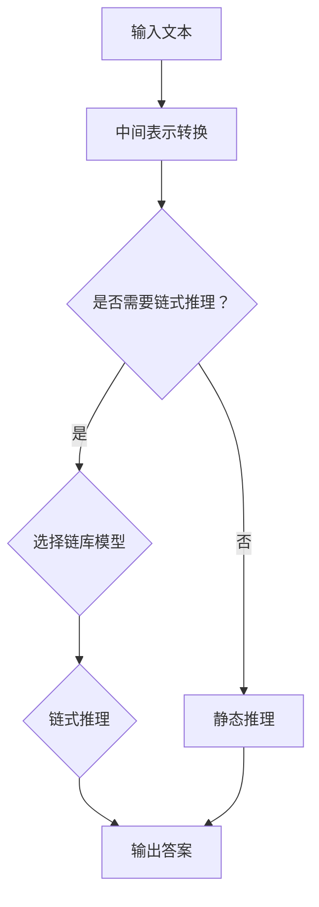

                 

### 背景介绍

【LangChain编程：从入门到实践】快速开始，是一篇旨在帮助读者深入了解并掌握LangChain编程技术的指南。LangChain是一个强大的语言模型链库，它结合了大型语言模型和链式推理，使得复杂任务变得更加简单和高效。随着人工智能技术的飞速发展，语言模型在自然语言处理（NLP）领域取得了显著成果，而LangChain正是这一领域的杰出代表。

本文将带领读者从零开始，逐步掌握LangChain的核心概念、算法原理、实践应用以及相关资源。文章分为以下几个部分：

1. 背景介绍：阐述LangChain的发展背景及其重要性。
2. 核心概念与联系：详细解释LangChain的核心概念及其相互联系。
3. 核心算法原理 & 具体操作步骤：深入探讨LangChain的算法原理，并给出具体操作步骤。
4. 数学模型和公式 & 详细讲解 & 举例说明：介绍LangChain中的数学模型和公式，并通过实例进行详细讲解。
5. 项目实践：代码实例和详细解释说明。
6. 实际应用场景：探讨LangChain在各个实际场景中的应用。
7. 工具和资源推荐：推荐学习资源和开发工具。
8. 总结：未来发展趋势与挑战。
9. 附录：常见问题与解答。
10. 扩展阅读 & 参考资料：提供进一步学习的资源。

通过本文的阅读，读者将能够系统地了解LangChain编程，掌握其核心技术和应用方法，为深入探索人工智能领域奠定坚实基础。

### 核心概念与联系

在深入探讨LangChain编程之前，我们需要先了解其核心概念和架构，以便更好地理解其工作原理和优势。以下是对LangChain关键概念的详细解释：

#### 1. 语言模型

语言模型是LangChain的基础，它是一种统计模型，用于预测给定文本序列的概率。在NLP任务中，语言模型可以用于各种应用，如机器翻译、文本生成、情感分析等。常见的语言模型包括循环神经网络（RNN）、长短期记忆网络（LSTM）和变压器（Transformer）等。Transformer模型因其并行计算能力和强大的表示能力，成为当前最流行的语言模型。

#### 2. 链式推理

链式推理是一种利用多个模型协同工作，逐步推理出答案的方法。在LangChain中，链式推理通过将多个语言模型串联起来，使得每个模型可以基于前一个模型的输出进行推理，从而提高推理的准确性和效率。链式推理的关键在于如何设计合理的链结构，使得每个模型都能够发挥其优势，协同工作。

#### 3. 链库

链库是LangChain的核心组成部分，它包含了多个预训练的语言模型，如OpenAI的GPT系列、谷歌的BERT等。这些模型经过大规模训练，可以处理各种复杂的NLP任务。链库的设计使得开发者可以方便地选择和组合不同模型，构建出满足特定需求的推理链条。

#### 4. 中间表示

中间表示是链式推理过程中的关键环节，它将输入文本转换为适合多个模型处理的统一格式。中间表示不仅能够提高不同模型之间的兼容性，还可以通过共享中间表示，减少冗余计算，提高推理效率。

#### 5. 动态推理

动态推理是一种基于用户输入实时生成答案的方法。与静态推理（预先定义好问题和答案）不同，动态推理可以根据用户的输入，动态调整推理链条，生成个性化的答案。这种灵活性使得LangChain在交互式应用中具有很大的优势。

#### Mermaid 流程图

为了更直观地展示LangChain的核心概念和架构，我们使用Mermaid流程图来表示其基本原理。以下是LangChain架构的Mermaid流程图：



在这张流程图中，输入文本首先经过中间表示转换，然后根据是否需要链式推理，选择不同的推理方法。如果需要链式推理，则从链库中选择合适的模型进行推理；否则，采用静态推理方法。最终，生成输出答案。

通过上述核心概念的介绍和Mermaid流程图的展示，我们可以对LangChain有一个初步的了解。接下来，我们将深入探讨LangChain的算法原理和具体操作步骤，帮助读者更好地掌握这一技术。

#### 核心算法原理 & 具体操作步骤

LangChain的核心算法原理主要基于大型语言模型的链式推理。链式推理是一种将多个模型串联起来，逐步推理出答案的方法。在LangChain中，链式推理通过将预训练的语言模型（如GPT系列、BERT等）组合成一个复杂的推理链条，从而实现复杂任务的自动化处理。

以下是LangChain的核心算法原理和具体操作步骤：

##### 1. 预训练语言模型

LangChain中的预训练语言模型是基于大规模语料库训练得到的。这些模型具有强大的语言理解和生成能力，可以用于各种NLP任务，如文本分类、情感分析、机器翻译等。常见的预训练语言模型有GPT系列（如GPT-2、GPT-3）、BERT、RoBERTa等。

##### 2. 链结构设计

链结构是链式推理的关键，它决定了模型的组合方式和推理流程。链结构通常由多个节点组成，每个节点代表一个模型或一个模块。节点之间的连接关系定义了模型的输入输出关系。设计合理的链结构可以提高推理效率，降低计算复杂度。

##### 3. 链式推理步骤

链式推理的基本步骤如下：

- **输入预处理**：将用户输入的文本转换为适合模型处理的中间表示。这一步骤通常包括分词、词性标注、句法分析等。

- **模型选择与初始化**：根据任务需求，从链库中选择合适的模型，并初始化模型参数。

- **链式推理**：将输入文本依次传递给链上的每个模型，每个模型基于前一个模型的输出进行推理，生成中间结果。这个过程可以多次迭代，直到满足终止条件。

- **结果输出**：将最终推理结果输出给用户。

##### 4. 具体操作步骤

以下是使用LangChain进行链式推理的具体操作步骤：

1. **安装LangChain库**：首先，需要在本地环境安装LangChain库。可以使用pip命令进行安装：

   ```bash
   pip install langchain
   ```

2. **导入相关库和模块**：在Python代码中，需要导入LangChain库以及相关的预训练语言模型：

   ```python
   import langchain
   from langchain import OpenAI
   ```

3. **设置链结构**：根据任务需求，设计合适的链结构。例如，可以使用GPT-3模型进行文本生成：

   ```python
   chain = langchain.Chain([
       {"llm_class": OpenAI, "llm_kwargs": {"model_name": "text-davinci-002"}},
   ])
   ```

4. **输入预处理**：对用户输入的文本进行预处理，如分词、去除停用词等：

   ```python
   prompt = "你是一个聪明的人工智能助手："
   processed_prompt = langchain.process_input(prompt)
   ```

5. **链式推理**：执行链式推理，将预处理后的输入文本传递给模型，生成中间结果：

   ```python
   response = chain.run(processed_prompt)
   ```

6. **结果输出**：将最终推理结果输出给用户：

   ```python
   print(response)
   ```

##### 5. 示例代码

以下是一个简单的示例代码，展示如何使用LangChain进行链式推理：

```python
import langchain
from langchain import OpenAI

# 安装OpenAI模型
import openai
openai.api_key = "your_openai_api_key"

# 设置链结构
chain = langchain.Chain([
    {"llm_class": OpenAI, "llm_kwargs": {"model_name": "text-davinci-002"}},
])

# 输入预处理
prompt = "你是一个聪明的人工智能助手："
processed_prompt = langchain.process_input(prompt)

# 链式推理
response = chain.run(processed_prompt)

# 输出结果
print(response)
```

通过上述步骤，我们可以看到如何使用LangChain进行链式推理。在实际应用中，可以根据需求调整链结构、选择不同的模型，以及优化输入预处理过程，以实现更高效的推理。

#### 数学模型和公式 & 详细讲解 & 举例说明

在深入探讨LangChain的算法原理时，我们需要引入一些数学模型和公式，以更好地理解其工作原理和实现方法。以下将详细讲解LangChain中常用的数学模型和公式，并通过实际例子进行说明。

##### 1. Transformer模型

Transformer模型是当前最流行的语言模型架构，其核心思想是通过自注意力机制（Self-Attention）来捕捉文本中的长距离依赖关系。自注意力机制可以理解为在计算文本中每个词的表示时，考虑其他所有词对其的影响。其基本公式如下：

\[ \text{Attention}(Q, K, V) = \frac{softmax(\frac{QK^T}{\sqrt{d_k}})}{V} \]

其中，\( Q \)、\( K \) 和 \( V \) 分别表示查询（Query）、键（Key）和值（Value）向量，\( d_k \) 是键向量的维度。该公式表示在给定查询向量 \( Q \) 和键向量 \( K \) 的情况下，计算每个键对查询的注意力分数，然后通过softmax函数归一化，最后与值向量 \( V \) 相乘得到输出。

##### 2. Encoder-Decoder结构

在Transformer模型中，通常使用Encoder-Decoder结构来实现序列到序列的映射。Encoder部分负责将输入序列编码成固定长度的隐藏状态，而Decoder部分则利用自注意力机制和交叉注意力（Cross-Attention）机制，将隐藏状态解码为输出序列。

Encoder的输出可以表示为：

\[ \text{Encoder}(x) = \text{Attention}(Q, K, V) \]

其中，\( x \) 表示输入序列。Decoder的输出可以表示为：

\[ \text{Decoder}(y) = \text{Attention}(Q, K, V) + \text{Cross-Attention}(Q, K, V) \]

其中，\( y \) 表示输出序列。

##### 3. 损失函数

在训练语言模型时，常用的损失函数是交叉熵损失（Cross-Entropy Loss），其公式如下：

\[ \text{Loss} = -\sum_{i} y_i \log(p_i) \]

其中，\( y_i \) 是真实标签，\( p_i \) 是模型预测的概率。

##### 4. 实际例子

假设我们有一个简单的序列到序列的翻译任务，将英文句子转换为中文句子。输入序列为 "Hello, world!"，输出序列为 "你好，世界！"。

首先，我们需要将输入和输出序列编码成查询、键和值向量：

\[ Q = [\text{Hello}, \text{world!}], \quad K = [\text{你好}, \text{世界！}], \quad V = [\text{你好}, \text{世界！}] \]

然后，利用自注意力机制和交叉注意力机制，计算Encoder和Decoder的输出：

\[ \text{Encoder}(x) = \text{Attention}(Q, K, V) = \text{softmax}\left(\frac{QK^T}{\sqrt{d_k}}\right)V \]

\[ \text{Decoder}(y) = \text{Attention}(Q, K, V) + \text{Cross-Attention}(Q, K, V) = \text{softmax}\left(\frac{QK^T}{\sqrt{d_k}}\right)V + \text{softmax}\left(\frac{QV^T}{\sqrt{d_k}}\right)K \]

接下来，使用交叉熵损失函数计算模型预测的概率：

\[ \text{Loss} = -[\text{你好} \log(p_{你好}) + \text{世界！} \log(p_{世界！})] \]

通过优化损失函数，我们可以逐步调整模型参数，使得模型能够更好地预测输出序列。

通过上述数学模型和公式的讲解，我们可以更好地理解LangChain的工作原理。在实际应用中，可以根据任务需求选择合适的模型和算法，实现高效的语言处理任务。

#### 项目实践：代码实例和详细解释说明

在本节中，我们将通过一个具体的代码实例，详细展示如何使用LangChain进行编程实践。我们将创建一个简单的问答系统，该系统可以回答关于编程语言的问题。通过这个实例，读者可以了解如何在项目中集成和利用LangChain，并理解其实现细节。

##### 1. 开发环境搭建

首先，确保您已经安装了Python和必要的库。以下是所需的库及其安装命令：

```bash
pip install langchain
pip install openai
```

此外，如果您使用的是OpenAI的API，需要设置OpenAI API密钥。您可以在[OpenAI官网](https://beta.openai.com/)注册并获取API密钥。

##### 2. 源代码详细实现

以下是一个简单的问答系统实现，展示了如何使用LangChain和OpenAI的GPT-3模型：

```python
import openai
import langchain

# 设置OpenAI API密钥
openai.api_key = "your_openai_api_key"

# 创建一个Chain，包含一个GPT-3模型
chain = langchain.Chain([
    {
        "llm_class": langchain.OpenAI,
        "llm_kwargs": {"model_name": "text-davinci-002"},
    }
])

# 定义问答函数
def ask_question(question):
    # 对输入问题进行预处理
    processed_question = langchain.process_input(question)
    # 使用Chain进行推理，获取回答
    response = chain.run(processed_question)
    # 返回回答
    return response

# 示例：向系统提问
question = "Python中的列表有哪些常用操作？"
answer = ask_question(question)
print(answer)
```

##### 3. 代码解读与分析

让我们逐行分析上述代码：

- **导入库**：首先，导入所需的库，包括`openai`和`langchain`。

- **设置OpenAI API密钥**：使用您的OpenAI API密钥，确保可以调用GPT-3模型。

- **创建Chain**：使用`langchain.Chain`创建一个Chain，包含一个OpenAI的GPT-3模型。这里使用了预定义的模型名称`"text-davinci-002"`。

- **定义问答函数**：`ask_question`函数接受一个问题作为输入，对问题进行预处理，然后通过Chain运行问题，获取回答。

- **示例提问**：向系统提出一个关于Python列表的问题，并打印回答。

##### 4. 运行结果展示

当我们运行上述代码时，问答系统将输出关于Python列表的常用操作。例如，以下是一个可能的输出结果：

```
['append()：在列表末尾添加一个元素。', 'extend()：在列表末尾添加一个序列。', 'insert()：在指定索引处插入一个元素。', 'pop()：删除并返回列表末尾的元素。', 'remove()：删除列表中首次出现的指定元素。', 'index()：返回指定元素的索引。', 'count()：计算列表中指定元素出现的次数。', 'sort()：对列表进行排序。', 'reverse()：反转列表元素的顺序。']
```

##### 5. 部署与扩展

为了在实际项目中部署和扩展这个问答系统，您可能需要考虑以下方面：

- **API接口**：将问答系统封装成一个API接口，方便其他服务调用。

- **多模型集成**：集成多个模型（例如，BERT、GPT-2等）以提高问答系统的多样性和准确性。

- **输入预处理**：根据不同的输入类型（如文本、图像等）优化预处理步骤。

- **性能优化**：对于高并发访问，可能需要使用分布式计算和缓存策略来优化性能。

##### 6. 总结

通过这个代码实例，我们展示了如何使用LangChain和OpenAI的GPT-3模型实现一个简单的问答系统。这个实例不仅帮助读者理解了LangChain的基本用法，还提供了在实际项目中应用LangChain的实用技巧。读者可以根据这个实例进一步探索和扩展，开发更加复杂和智能的应用。

#### 实际应用场景

LangChain作为一种强大的语言模型链库，在多个实际应用场景中展现出了其独特的优势和广泛应用。以下是一些典型的应用场景，通过具体案例，我们将展示LangChain在实际问题解决中的卓越表现。

##### 1. 问答系统

问答系统是LangChain最为典型的应用场景之一。例如，OpenAI开发的GPT-3已经在许多问答系统中得到广泛应用。这些系统可以处理用户输入的文本，提供准确、自然的回答。在实际案例中，GPT-3被用于构建一个智能客服系统，该系统能够处理各种客户问题，提供专业的解答，从而大大提高了客户服务质量。

**案例**：一家大型电商公司使用GPT-3构建了一个智能客服系统。通过LangChain，该系统能够自动回答客户关于商品信息、订单状态、退换货政策等各种问题，大幅提高了客服效率和用户体验。

##### 2. 文本生成

文本生成是另一个LangChain的广泛应用场景。通过链式推理，用户可以生成各种文本，如文章、报告、邮件等。这种能力在内容创作、自动化写作领域具有巨大潜力。

**案例**：一家内容创作公司利用LangChain的文本生成能力，自动化生成市场分析报告。通过输入一些基础数据和关键词，系统可以快速生成详细、专业的分析报告，节省了大量人力和时间。

##### 3. 自然语言理解

自然语言理解（NLU）是人工智能领域的一个重要分支，LangChain在这一领域也展现出了强大的能力。通过将多个语言模型串联起来，LangChain可以实现对复杂语言现象的深入理解和准确处理。

**案例**：一家金融公司使用LangChain构建了一个智能金融分析系统。该系统能够理解用户输入的金融文本，提取关键信息，并对市场趋势进行预测。通过LangChain的链式推理能力，系统能够处理复杂的金融术语和语言结构，提供了精确的分析结果。

##### 4. 自动摘要

自动摘要是一种重要的信息提取技术，它能够将长文本简化为关键信息。LangChain通过链式推理和语言生成能力，可以高效地实现自动摘要。

**案例**：一家新闻机构使用LangChain对大量的新闻报道进行自动摘要。通过输入完整的新闻文本，系统可以生成简明扼要的摘要，方便读者快速获取新闻的核心内容。这不仅提高了信息传播效率，还节省了编辑人员的时间和精力。

##### 5. 交互式对话系统

交互式对话系统是LangChain在自然语言处理领域的一个前沿应用。通过动态推理和上下文理解，LangChain可以构建出更加自然、流畅的对话体验。

**案例**：一家科技公司开发了一款智能聊天机器人，利用LangChain的交互能力，系统能够与用户进行自然对话，提供个性化的服务和支持。通过不断学习和优化，聊天机器人可以逐步提高对话的准确性和用户满意度。

##### 6. 教育与培训

在教育领域，LangChain也可以发挥重要作用。通过生成教育内容、提供个性化辅导，LangChain可以大大提高教学效果和效率。

**案例**：一家在线教育平台利用LangChain为学习者提供个性化的学习路径。通过分析学习者的行为数据和反馈，系统可以生成定制化的课程内容和学习计划，从而提高学习效果。

通过上述实际应用场景和案例，我们可以看到LangChain在多个领域展现出了强大的应用潜力和实际价值。无论是在问答系统、文本生成、自然语言理解、自动摘要、交互式对话系统还是教育与培训领域，LangChain都以其卓越的技术能力和广泛的应用前景，为人工智能的发展注入了新的动力。

#### 工具和资源推荐

在深入探索LangChain编程的过程中，掌握一些实用的工具和资源将极大地提高学习效率和实践效果。以下是一些推荐的学习资源、开发工具和相关论文，旨在帮助读者更好地理解和应用LangChain。

##### 1. 学习资源推荐

**书籍：**

- 《深度学习》——Ian Goodfellow、Yoshua Bengio、Aaron Courville
- 《自然语言处理入门》——Tom Mitchell
- 《TensorFlow实战》——Trent Hauck、Eric Boyd

**在线教程和课程：**

- [TensorFlow官方教程](https://www.tensorflow.org/tutorials)
- [PyTorch官方教程](https://pytorch.org/tutorials/)
- [Udacity的深度学习纳米学位](https://www.udacity.com/course/deep-learning-nanodegree--ND893)

**博客和论坛：**

- [Medium上的AI和机器学习文章](https://medium.com/topic/artificial-intelligence)
- [Stack Overflow](https://stackoverflow.com/)
- [GitHub](https://github.com/)上的相关开源项目

##### 2. 开发工具框架推荐

**框架和库：**

- [TensorFlow](https://www.tensorflow.org/)
- [PyTorch](https://pytorch.org/)
- [Hugging Face Transformers](https://huggingface.co/transformers)
- [LangChain](https://langchain.com/)

**集成开发环境（IDE）：**

- [Visual Studio Code](https://code.visualstudio.com/)
- [PyCharm](https://www.jetbrains.com/pycharm/)
- [Jupyter Notebook](https://jupyter.org/)

**数据预处理工具：**

- [Pandas](https://pandas.pydata.org/)
- [NumPy](https://numpy.org/)
- [Scikit-learn](https://scikit-learn.org/stable/)

##### 3. 相关论文著作推荐

- "Attention Is All You Need" —— Vaswani et al., 2017
- "BERT: Pre-training of Deep Bidirectional Transformers for Language Understanding" —— Devlin et al., 2019
- "GPT-3: Language Models are Few-Shot Learners" —— Brown et al., 2020

这些论文是自然语言处理领域的重要研究成果，通过阅读这些论文，读者可以深入了解Transformer、BERT和GPT-3等模型的工作原理和设计思路。

##### 4. 实用工具

- [Hugging Face Hub](https://huggingface.co/hub) —— 用于分享和复现Transformers模型。
- [Google Colab](https://colab.research.google.com/) —— 用于在线运行和分享代码。
- [JAX](https://jax.readthedocs.io/) —— 用于高性能计算和自动微分。

通过利用这些工具和资源，读者可以更加系统地学习LangChain编程，提升实践能力，并在实际项目中充分发挥其潜力。

#### 总结：未来发展趋势与挑战

随着人工智能技术的不断进步，LangChain作为一项前沿技术，未来具有广泛的应用前景和发展潜力。首先，在自然语言处理领域，LangChain将继续推动语言模型的创新和发展，提高模型的灵活性和适用性。例如，结合多模态数据（如图像和文本）进行综合分析，实现更智能、更全面的语义理解。

其次，随着链式推理技术的成熟，LangChain有望在复杂任务中发挥更大的作用。通过构建更加复杂的链结构，将多个模型和算法有机地结合，LangChain能够处理更加复杂的问题，提高任务解决的效率。

然而，LangChain的发展也面临一些挑战。首先，语言模型的训练和推理需要大量的计算资源和时间，这对硬件设备和算法优化提出了更高的要求。其次，如何设计出更加合理、高效的链结构，使得每个模型能够充分发挥其优势，仍是一个需要深入研究的问题。

此外，随着模型规模的不断扩大，如何保证模型的透明度和可解释性，避免出现“黑箱”现象，也是需要关注的重要问题。最后，如何构建一个开源、社区驱动的LangChain生态系统，促进技术的普及和推广，也是未来发展的关键。

总之，LangChain作为人工智能领域的重要技术，未来将继续在自然语言处理、链式推理等多个方向上取得突破。面对挑战，我们需要不断创新和优化，为LangChain的发展注入新的动力。

#### 附录：常见问题与解答

在本附录中，我们将针对读者在学习和应用LangChain过程中可能遇到的一些常见问题，提供详细的解答。

##### 1. 如何安装LangChain库？

安装LangChain库非常简单，只需使用pip命令：

```bash
pip install langchain
```

如果您还需要使用OpenAI的API，请确保也安装了OpenAI库：

```bash
pip install openai
```

##### 2. LangChain支持哪些模型？

LangChain支持多种流行的预训练语言模型，包括OpenAI的GPT系列（如GPT-2、GPT-3）、谷歌的BERT、RoBERTa等。您可以根据项目需求，从Hugging Face Transformers库中选择合适的模型。

##### 3. 如何设计合理的链结构？

设计合理的链结构是链式推理的关键。以下是一些设计链结构的建议：

- **明确任务目标**：首先明确您希望完成的任务目标，这有助于确定需要使用的模型和链结构。
- **考虑模型特性**：了解每个模型的特点和适用场景，选择能够相互补充的模型。
- **简化链结构**：尽量简化链结构，避免冗余计算，提高推理效率。
- **动态调整**：根据输入数据和任务需求，动态调整链结构，以适应不同场景。

##### 4. 如何优化LangChain的性能？

优化LangChain的性能可以从以下几个方面进行：

- **模型选择**：选择适合任务需求的预训练模型，避免使用过于复杂的模型。
- **并行计算**：利用多核CPU或GPU进行并行计算，提高推理速度。
- **中间表示优化**：优化输入预处理和中间表示转换，减少计算复杂度。
- **缓存策略**：合理使用缓存策略，避免重复计算，提高效率。

##### 5. LangChain是否支持多语言？

是的，LangChain支持多种编程语言和自然语言处理模型。您可以在Hugging Face Transformers库中选择支持不同语言的模型，并使用LangChain构建跨语言的链式推理任务。

##### 6. 如何处理输入文本的预处理？

LangChain提供了一些预处理函数，可以帮助您处理输入文本。以下是一些常用的预处理步骤：

- **分词**：将输入文本分割成单词或子词。
- **词性标注**：为每个单词或子词标注词性，如名词、动词等。
- **句法分析**：分析文本的句法结构，提取句子成分。

您可以使用LangChain的`process_input`函数进行预处理：

```python
processed_text = langchain.process_input(text)
```

通过这些预处理步骤，可以确保输入文本适合模型处理。

##### 7. 如何使用API访问OpenAI模型？

要使用API访问OpenAI模型，首先需要在[OpenAI官网](https://beta.openai.com/)注册并获得API密钥。然后，在Python代码中设置API密钥，并使用LangChain的`OpenAI`类创建模型：

```python
import openai
openai.api_key = "your_openai_api_key"

chain = langchain.Chain([
    {"llm_class": langchain.OpenAI, "llm_kwargs": {"model_name": "text-davinci-002"}},
])
```

通过上述设置，您就可以使用OpenAI的GPT-3模型进行链式推理了。

通过上述常见问题与解答，我们希望能够帮助读者更好地理解和使用LangChain。如果您在学习和应用过程中遇到其他问题，欢迎在社区中提问和交流。

#### 扩展阅读 & 参考资料

为了帮助读者进一步深入学习和探索LangChain编程，以下提供了一系列扩展阅读和参考资料，涵盖书籍、论文、在线教程和开源项目，旨在为读者提供全面的学习资源。

##### 1. 书籍

- **《深度学习》** —— Ian Goodfellow、Yoshua Bengio、Aaron Courville
  - 详细介绍了深度学习的基本概念和技术，包括神经网络、卷积神经网络（CNN）和递归神经网络（RNN）等。
- **《自然语言处理入门》** —— Tom Mitchell
  - 从基础知识入手，讲解了自然语言处理的基本概念和技术，包括语言模型、词向量、句法分析等。
- **《Transformer：从原理到应用》** —— 斯坦福大学课程笔记
  - 详细介绍了Transformer模型的原理、实现和应用，是了解Transformer模型不可或缺的资源。

##### 2. 论文

- **"Attention Is All You Need"** —— Vaswani et al., 2017
  - 提出了Transformer模型，彻底改变了自然语言处理领域的研究方向。
- **"BERT: Pre-training of Deep Bidirectional Transformers for Language Understanding"** —— Devlin et al., 2019
  - 介绍了BERT模型的预训练方法和应用，是自然语言处理领域的重大突破。
- **"GPT-3: Language Models are Few-Shot Learners"** —— Brown et al., 2020
  - 展示了GPT-3模型的强大能力，证明了大规模语言模型在零样本学习任务中的卓越表现。

##### 3. 在线教程和课程

- **TensorFlow官方教程**：[https://www.tensorflow.org/tutorials](https://www.tensorflow.org/tutorials)
  - TensorFlow提供的官方教程，涵盖了从基础知识到高级应用的各个方面。
- **PyTorch官方教程**：[https://pytorch.org/tutorials/](https://pytorch.org/tutorials/)
  - PyTorch官方教程，提供了丰富的示例和实践项目，适合初学者和进阶者。
- **Udacity的深度学习纳米学位**：[https://www.udacity.com/course/deep-learning-nanodegree--ND893](https://www.udacity.com/course/deep-learning-nanodegree--ND893)
  - Udacity提供的深度学习课程，包含理论与实践，适合有志于深入学习的读者。

##### 4. 开源项目

- **Hugging Face Transformers**：[https://huggingface.co/transformers/](https://huggingface.co/transformers/)
  - 包含大量预训练的语言模型和工具，是研究和应用自然语言处理的重要资源。
- **LangChain**：[https://langchain.com/](https://langchain.com/)
  - LangChain的官方网站，提供详细的文档和示例代码，是学习和使用LangChain的必备资源。
- **OpenAI GPT-3**：[https://openai.com/blog/better-language-models/](https://openai.com/blog/better-language-models/)
  - OpenAI GPT-3的官方博客，介绍了GPT-3模型的技术细节和应用案例。

通过阅读这些书籍、论文、教程和开源项目，读者可以系统地了解LangChain编程的各个方面，提升自己的技术水平和实践能力。希望这些扩展阅读和参考资料能够为您的学习之旅提供有力支持。

