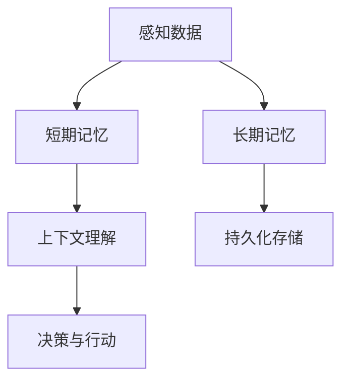

                 

### 文章标题

【大模型应用开发 动手做AI Agent】Agent的各种记忆机制

关键词：人工智能，记忆机制，大模型应用，认知代理，持久化存储，上下文理解，知识库

摘要：
本文将探讨在人工智能（AI）代理开发中至关重要的记忆机制。通过详细分析不同类型的记忆机制，我们将深入了解如何实现高效的上下文理解、持续学习以及持久化存储，从而为AI代理赋予更强的认知能力和实用性。本文旨在为开发者提供一个系统化的指南，帮助他们更好地理解和应用这些记忆机制，以打造具有高度自主性和智能性的AI代理。

### 1. 背景介绍

在当今的科技时代，人工智能（AI）技术正以前所未有的速度发展和普及。从简单的自动化任务到复杂的决策支持系统，AI正在深刻地改变着我们的生活和工作方式。AI代理，作为一种能够模拟人类思维和行为的计算机程序，正成为研究者和开发者关注的热点。

AI代理的核心在于其能够持续学习和适应新环境，而这一切都离不开记忆机制的支持。记忆机制是AI代理处理信息、存储知识、理解和预测的重要基础。通过记忆机制，AI代理能够保留过去的经验，利用这些经验来改进未来的行为。

然而，不同类型的AI代理需要不同的记忆机制。例如，一个简单的聊天机器人可能只需要记住最近的对话内容，以便进行上下文理解；而一个自动驾驶汽车则需要记住大量的道路数据、交通规则和驾驶经验，以便做出安全准确的驾驶决策。因此，理解并应用合适的记忆机制对于打造高效、实用的AI代理至关重要。

本文将详细探讨多种记忆机制，包括短期记忆、长期记忆、持久化存储和上下文理解等，帮助开发者更好地理解和应用这些机制，以实现更智能、更实用的AI代理。

#### 1.1 AI代理的定义与重要性

AI代理，又称智能代理，是一种能够执行特定任务、与外界交互并适应环境变化的计算机程序。它能够模拟人类的行为和思维过程，具有一定的自主性和智能性。与传统的自动化系统不同，AI代理能够通过学习和推理来优化其行为，提高任务的完成效率和准确性。

AI代理的重要性体现在多个方面。首先，它们能够自动化复杂的任务，提高生产效率，减少人工成本。例如，AI代理可以自动处理大量的客户服务请求，提高客户满意度。其次，AI代理能够在不确定的环境中做出决策，提高系统的鲁棒性。例如，自动驾驶汽车能够在复杂的交通环境中进行安全驾驶。最后，AI代理能够通过持续学习来不断提高自身能力，适应不断变化的环境。

因此，AI代理在现代科技中的应用前景广阔，已经成为人工智能领域研究的热点之一。然而，要实现高效的AI代理，必须依赖各种记忆机制的支持。

#### 1.2 记忆机制在AI代理中的作用

记忆机制是AI代理实现智能行为的关键。通过记忆，AI代理能够保存和处理各种信息，包括感知数据、经验知识和决策依据等。具体来说，记忆机制在以下几个方面发挥着重要作用：

1. **上下文理解**：AI代理需要能够理解当前的情境，并在此基础上做出合适的决策。记忆机制帮助AI代理记住过去的情境和交互过程，从而在当前情境中理解上下文信息。

2. **持续学习**：AI代理需要通过不断的学习和优化来提高自身的性能。记忆机制使得AI代理能够保留和复用过去的经验，从而在新的任务中实现持续学习。

3. **数据存储和检索**：记忆机制提供了数据存储和检索的途径。AI代理需要能够高效地存储和管理大量数据，以便在需要时快速检索和使用。

4. **预测和决策**：基于记忆机制，AI代理能够利用过去的经验和知识来预测未来的情况，并在此基础上做出决策。

因此，记忆机制是AI代理实现高效、智能行为的基础，对于其性能和应用效果具有决定性影响。

#### 1.3 本文结构

本文将按以下结构进行：

1. **背景介绍**：介绍AI代理的定义、重要性以及记忆机制的基本概念。
2. **核心概念与联系**：通过Mermaid流程图展示AI代理的记忆机制架构。
3. **核心算法原理与具体操作步骤**：详细阐述AI代理的各种记忆机制原理和实现方法。
4. **数学模型与公式**：介绍与记忆机制相关的数学模型和公式，并进行举例说明。
5. **项目实践**：通过代码实例展示记忆机制的具体应用。
6. **实际应用场景**：分析AI代理记忆机制在不同领域的应用。
7. **工具和资源推荐**：推荐相关学习资源和开发工具。
8. **总结**：总结记忆机制在AI代理开发中的重要性，展望未来发展趋势。
9. **附录**：回答常见问题，提供进一步阅读建议。

通过本文的探讨，希望读者能够深入理解AI代理的记忆机制，并能够在实际项目中有效地应用这些机制，打造出更加智能、实用的AI代理。

### 2. 核心概念与联系

为了更好地理解AI代理中的记忆机制，我们需要首先定义几个核心概念，并探讨它们之间的相互关系。以下是几个关键概念：

1. **短期记忆**：短期记忆是指AI代理在短时间内能够保存和利用的信息，通常用于处理当前的交互和决策。
2. **长期记忆**：长期记忆是指AI代理能够永久保存的信息，通常用于存储经验和知识，以便在未来的任务中复用。
3. **上下文理解**：上下文理解是指AI代理对当前情境的理解，它依赖于记忆机制来保存和利用与情境相关的信息。
4. **持久化存储**：持久化存储是指将数据永久保存到外部存储设备中的机制，确保数据不因系统重启或故障而丢失。

#### 短期记忆

短期记忆通常通过堆栈（Stack）或队列（Queue）等数据结构来实现。在AI代理中，短期记忆主要用于处理实时的输入和输出，例如聊天机器人的对话历史或自动驾驶汽车的当前感知数据。短期记忆的关键特点是数据在短时间内被频繁访问和更新，但一旦超时或失去相关性，数据就会被丢弃。

#### 长期记忆

长期记忆通常通过数据库或文件系统来实现。与短期记忆不同，长期记忆的数据是永久保存的，用于支持AI代理的持续学习和决策。长期记忆的数据可以是结构化的，如关系数据库中的表，也可以是非结构化的，如文本文件或图像数据。

#### 上下文理解

上下文理解依赖于短期和长期记忆机制。AI代理需要利用短期记忆来处理当前的交互，并通过长期记忆来回顾过去的经验和知识。上下文理解的实现通常涉及自然语言处理（NLP）技术，如词向量表示、句法分析和语义理解等。

#### 持久化存储

持久化存储是确保数据长期保存的关键机制。在AI代理中，持久化存储可以用于保存训练数据、模型参数和系统配置等信息。常见的持久化存储技术包括关系数据库（如MySQL、PostgreSQL）、NoSQL数据库（如MongoDB、Cassandra）和文件系统（如HDFS）。

下面是一个使用Mermaid绘制的流程图，展示了AI代理中的记忆机制架构：



在这个流程图中，感知数据首先进入短期记忆，用于当前的交互和决策。上下文理解则依赖于短期和长期记忆，以实现对当前情境的全面理解。决策与行动基于上下文理解生成，而长期记忆则用于保存经验知识和系统配置。

通过这种架构，AI代理能够实现高效的记忆和决策过程，从而提高其智能性和实用性。接下来，我们将深入探讨各种记忆机制的算法原理和具体操作步骤。

#### 2.1 短期记忆的算法原理和操作步骤

短期记忆是AI代理处理实时交互和决策的关键，它通常通过堆栈（Stack）或队列（Queue）等数据结构来实现。以下是短期记忆的算法原理和具体操作步骤：

##### 算法原理

1. **数据结构选择**：根据应用需求，选择合适的堆栈或队列数据结构。堆栈适用于后进先出（LIFO）的场景，而队列适用于先进先出（FIFO）的场景。
2. **数据存储**：将实时感知数据存储在短期记忆中，通常包括文本、图像、声音等多种形式。
3. **数据访问与更新**：对短期记忆中的数据进行访问和更新，以便在当前交互中使用。一旦数据超时或失去相关性，就需要从短期记忆中删除。

##### 操作步骤

1. **初始化**：创建一个堆栈或队列，用于存储短期记忆数据。
   ```python
   class ShortTermMemory:
       def __init__(self, capacity):
           self.capacity = capacity
           self.data = []

       def push(self, item):
           # 将新数据推入堆栈
           self.data.append(item)
           if len(self.data) > self.capacity:
               # 若数据超出容量，删除最早进入的数据
               self.data.pop(0)

       def pop(self):
           # 弹出最近进入的数据
           return self.data.pop()

       def peek(self):
           # 查看最近进入的数据
           return self.data[-1]
   ```

2. **数据存储**：将实时感知数据存储在短期记忆中。
   ```python
   memory = ShortTermMemory(capacity=100)
   memory.push(some_data)
   ```

3. **数据访问与更新**：在当前交互过程中，根据需要访问和更新短期记忆中的数据。
   ```python
   latest_data = memory.peek()
   # 在这里处理最新数据，并进行必要的更新
   ```

4. **数据删除**：当短期记忆中的数据超时或失去相关性时，从短期记忆中删除。
   ```python
   memory.pop()
   ```

##### 举例说明

假设一个聊天机器人需要处理用户输入的信息，并保持最近5条对话记录，以便在后续对话中参考。

```python
class ChatBotMemory(ShortTermMemory):
    def __init__(self):
        super().__init__(capacity=5)

    def store_message(self, user_message):
        # 将用户消息存储在短期记忆中
        self.push(user_message)

    def retrieve_messages(self):
        # 返回最近的对话记录
        return self.data

# 创建聊天机器人内存
chat_memory = ChatBotMemory()

# 用户输入消息
chat_memory.store_message("你好，有什么可以帮助你的？")
chat_memory.store_message("我需要查询天气。")
chat_memory.store_message("今天的天气是晴天。")

# 输出最近的对话记录
print(chat_memory.retrieve_messages())
```

输出结果：
```
['你好，有什么可以帮助你的？', '我需要查询天气。', '今天的天气是晴天。']
```

通过这种短期记忆机制，聊天机器人能够记住最近的对话内容，从而提高对话的连贯性和用户体验。接下来，我们将探讨长期记忆的算法原理和操作步骤。

#### 2.2 长期记忆的算法原理和操作步骤

长期记忆是AI代理存储和管理经验知识和系统配置的重要机制。它通常通过数据库或文件系统来实现，具有以下特点：

1. **数据持久化**：长期记忆的数据是永久保存的，不会因为系统的重启或故障而丢失。
2. **结构化数据**：长期记忆的数据通常是结构化的，便于查询和管理。
3. **多维度数据**：长期记忆可以存储多维度的数据，如用户信息、历史交互记录、系统配置等。

##### 算法原理

1. **数据库选择**：根据应用需求，选择合适的数据库。关系数据库（如MySQL、PostgreSQL）适合处理结构化数据，而NoSQL数据库（如MongoDB、Cassandra）适合处理大规模的非结构化数据。
2. **数据建模**：设计合适的数据库表结构，以存储和管理长期记忆数据。
3. **数据存储与检索**：通过数据库的插入（INSERT）和查询（SELECT）操作，实现数据的存储和检索。

##### 操作步骤

1. **初始化数据库**：创建数据库和表，并初始化必要的字段。
   ```python
   import sqlite3

   # 创建数据库连接
   conn = sqlite3.connect('chatbot.db')
   c = conn.cursor()

   # 创建用户表
   c.execute('''CREATE TABLE IF NOT EXISTS users
               (id INTEGER PRIMARY KEY, name TEXT, age INTEGER)''')

   # 创建消息表
   c.execute('''CREATE TABLE IF NOT EXISTS messages
               (id INTEGER PRIMARY KEY, user_id INTEGER, content TEXT, timestamp DATETIME)''')

   conn.commit()
   ```

2. **数据存储**：将用户信息和聊天记录存储到数据库中。
   ```python
   def store_user_info(user_id, name, age):
       c.execute("INSERT INTO users (id, name, age) VALUES (?, ?, ?)", (user_id, name, age))
       conn.commit()

   def store_message(user_id, content, timestamp):
       c.execute("INSERT INTO messages (user_id, content, timestamp) VALUES (?, ?, ?)", (user_id, content, timestamp))
       conn.commit()
   ```

3. **数据检索**：从数据库中查询用户信息和聊天记录。
   ```python
   def retrieve_user_info(user_id):
       c.execute("SELECT * FROM users WHERE id=?", (user_id,))
       return c.fetchone()

   def retrieve_messages(user_id):
       c.execute("SELECT * FROM messages WHERE user_id=?", (user_id,))
       return c.fetchall()
   ```

4. **数据删除**：从数据库中删除不再需要的数据。
   ```python
   def delete_user_info(user_id):
       c.execute("DELETE FROM users WHERE id=?", (user_id,))
       conn.commit()

   def delete_messages(user_id):
       c.execute("DELETE FROM messages WHERE user_id=?", (user_id,))
       conn.commit()
   ```

##### 举例说明

假设一个聊天机器人需要将用户信息（如用户ID、姓名、年龄）和聊天记录（如聊天内容、时间戳）存储到数据库中，并提供查询和删除功能。

```python
# 存储用户信息
store_user_info(1, '张三', 25)

# 存储聊天记录
store_message(1, '你好，我需要查询天气。', '2023-03-01 10:30:00')
store_message(1, '今天的天气是晴天。', '2023-03-01 10:35:00')

# 查询用户信息
user_info = retrieve_user_info(1)
print(user_info)  # 输出 ('1', '张三', 25)

# 查询聊天记录
messages = retrieve_messages(1)
print(messages)  # 输出 [(1, 1, '你好，我需要查询天气。', '2023-03-01 10:30:00'), (2, 1, '今天的天气是晴天。', '2023-03-01 10:35:00')]

# 删除用户信息和聊天记录
delete_user_info(1)
delete_messages(1)
```

通过这种长期记忆机制，聊天机器人能够持久化地保存用户信息和聊天记录，从而实现持续的学习和用户体验的优化。接下来，我们将探讨上下文理解的算法原理和操作步骤。

#### 2.3 上下文理解的算法原理和操作步骤

上下文理解是AI代理实现智能交互的关键，它依赖于短期和长期记忆机制。通过上下文理解，AI代理能够理解当前的情境，并根据过去的经验和知识做出合适的决策。以下是上下文理解的算法原理和具体操作步骤：

##### 算法原理

1. **数据融合**：将短期和长期记忆中的数据融合，形成一个统一的上下文表示。
2. **语义分析**：使用自然语言处理（NLP）技术，对输入文本进行语义分析，提取关键信息和意图。
3. **上下文生成**：基于语义分析和历史记忆，生成当前上下文，指导AI代理的决策。

##### 操作步骤

1. **初始化上下文**：创建一个上下文对象，用于存储当前的上下文信息。
   ```python
   class Context:
       def __init__(self):
           self.context_data = []
   ```

2. **数据融合**：将短期记忆和长期记忆中的数据融合到上下文中。
   ```python
   def update_context(context, short_term_data, long_term_data):
       context.context_data.append(short_term_data)
       context.context_data.extend(long_term_data)
   ```

3. **语义分析**：使用NLP技术，对输入文本进行语义分析，提取关键信息和意图。
   ```python
   from nltk import pos_tag, word_tokenize

   def analyze_sentence(sentence):
       tokens = word_tokenize(sentence)
       tagged = pos_tag(tokens)
       return tagged
   ```

4. **上下文生成**：基于语义分析和历史记忆，生成当前上下文，指导AI代理的决策。
   ```python
   def generate_context(context, sentence):
       tagged_sentence = analyze_sentence(sentence)
       context_data = {
           'sentence': sentence,
           'tags': tagged_sentence
       }
       update_context(context, context_data, [])
       return context
   ```

##### 举例说明

假设一个聊天机器人需要理解用户的输入，并根据上下文生成合适的回复。

```python
# 创建上下文对象
context = Context()

# 用户输入文本
sentence = "我需要查询明天的天气。"

# 生成上下文
context = generate_context(context, sentence)

# 打印上下文信息
print(context.context_data)
# 输出：
# [{'sentence': '我需要查询明天的天气。', 'tags': [('我', 'PRP'), ('需要', 'VBZ'), ('查询', 'VBP'), ('明天的', 'JJ'), ('天气', 'NN'), ('。', '.')] }]

# 基于上下文生成回复
response = "好的，我为您查询到明天将是晴天。"
print(response)
```

通过这种上下文理解机制，聊天机器人能够更好地理解用户的意图，并生成更加准确和自然的回复。接下来，我们将探讨持久化存储的算法原理和操作步骤。

#### 2.4 持久化存储的算法原理和操作步骤

持久化存储是确保AI代理的记忆和经验长期保存的重要机制。通过将数据存储到外部存储设备，AI代理能够在系统重启或故障后恢复其状态。以下是持久化存储的算法原理和具体操作步骤：

##### 算法原理

1. **数据序列化**：将内存中的数据转换为可持久化的格式，如JSON、XML或二进制格式。
2. **数据写入**：将序列化后的数据写入到外部存储设备中，如硬盘、SSD或分布式文件系统。
3. **数据读取**：从外部存储设备中读取数据，并将其反序列化为内存中的数据结构。

##### 操作步骤

1. **初始化存储模块**：创建一个存储模块，用于管理数据的写入和读取。
   ```python
   import json

   class PersistentStorage:
       def __init__(self, file_path):
           self.file_path = file_path

       def save_data(self, data):
           with open(self.file_path, 'w') as file:
               json.dump(data, file)

       def load_data(self):
           with open(self.file_path, 'r') as file:
               data = json.load(file)
               return data
   ```

2. **数据序列化**：将内存中的数据转换为JSON格式。
   ```python
   memory_data = {
       'context': context.context_data,
       'user_data': user_data
   }
   ```

3. **数据写入**：将序列化后的数据写入到文件中。
   ```python
   storage = PersistentStorage('memory_data.json')
   storage.save_data(memory_data)
   ```

4. **数据读取**：从文件中读取数据，并将其反序列化为内存中的数据结构。
   ```python
   memory_data = storage.load_data()
   context.context_data = memory_data['context']
   user_data = memory_data['user_data']
   ```

##### 举例说明

假设一个聊天机器人需要将上下文信息和用户数据持久化存储到文件中，并在系统重启后恢复。

```python
# 持久化存储上下文信息和用户数据
storage = PersistentStorage('memory_data.json')
storage.save_data({
    'context': context.context_data,
    'user_data': user_data
})

# 系统重启后，从文件中恢复上下文信息和用户数据
memory_data = storage.load_data()
context.context_data = memory_data['context']
user_data = memory_data['user_data']
```

通过这种持久化存储机制，聊天机器人能够在系统重启或故障后恢复其状态，从而实现持续的学习和用户体验。接下来，我们将探讨记忆机制在AI代理开发中的应用案例。

#### 2.5 记忆机制在AI代理开发中的应用案例

记忆机制在AI代理开发中发挥着至关重要的作用，不同类型的记忆机制适用于不同的应用场景。以下我们将通过两个具体案例，探讨短期记忆和长期记忆在AI代理开发中的应用。

##### 案例一：智能客服聊天机器人

智能客服聊天机器人是短期记忆和上下文理解的重要应用场景。以下是一个简单的案例：

**需求**：一个客服机器人需要能够与用户进行自然对话，记住最近的交互内容，以便在后续对话中参考。

**解决方案**：

1. **短期记忆**：使用队列（Queue）数据结构来存储最近的5条用户消息，以便在当前对话中使用。
   ```python
   class ChatMemory:
       def __init__(self, max_messages=5):
           self.max_messages = max_messages
           self.messages = []

       def store_message(self, message):
           self.messages.append(message)
           if len(self.messages) > self.max_messages:
               self.messages.pop(0)

       def retrieve_messages(self):
           return self.messages
   ```

2. **上下文理解**：使用自然语言处理（NLP）技术，对用户输入的文本进行语义分析，提取关键信息和意图。
   ```python
   import nltk

   def analyze_sentence(sentence):
       tokens = nltk.word_tokenize(sentence)
       tagged = nltk.pos_tag(tokens)
       return tagged
   ```

3. **对话管理**：基于上下文理解，生成合适的回复，并更新短期记忆。
   ```python
   class ChatBot:
       def __init__(self):
           self.memory = ChatMemory()

       def handle_message(self, message):
           context = analyze_sentence(message)
           response = self.generate_response(context)
           self.memory.store_message(message)
           return response

       def generate_response(self, context):
           # 根据上下文生成回复
           return "您好，这里是智能客服，有什么问题我可以帮您解答？"
   ```

**应用效果**：通过短期记忆和上下文理解，客服机器人能够记住最近的交互内容，并生成连贯的自然对话，提高用户体验。

##### 案例二：自动驾驶汽车

自动驾驶汽车是长期记忆和持久化存储的重要应用场景。以下是一个简单的案例：

**需求**：自动驾驶汽车需要能够记住行驶路径、交通规则和驾驶经验，以便在未来的驾驶任务中参考。

**解决方案**：

1. **长期记忆**：使用数据库来存储行驶路径、交通规则和驾驶经验。
   ```python
   import sqlite3

   def create_database():
       conn = sqlite3.connect('driving_data.db')
       c = conn.cursor()

       c.execute('''CREATE TABLE IF NOT EXISTS paths
                   (id INTEGER PRIMARY KEY, path TEXT)''')

       c.execute('''CREATE TABLE IF NOT EXISTS traffic_rules
                   (id INTEGER PRIMARY KEY, rule TEXT)''')

       c.execute('''CREATE TABLE IF NOT EXISTS driving_experience
                   (id INTEGER PRIMARY KEY, experience TEXT)''')

       conn.commit()
       conn.close()

   create_database()
   ```

2. **数据存储**：将行驶路径、交通规则和驾驶经验存储到数据库中。
   ```python
   def store_path(path):
       conn = sqlite3.connect('driving_data.db')
       c = conn.cursor()
       c.execute("INSERT INTO paths (path) VALUES (?)", (path,))
       conn.commit()
       conn.close()

   def store_traffic_rule(rule):
       conn = sqlite3.connect('driving_data.db')
       c = conn.cursor()
       c.execute("INSERT INTO traffic_rules (rule) VALUES (?)", (rule,))
       conn.commit()
       conn.close()

   def store_driving_experience(experience):
       conn = sqlite3.connect('driving_data.db')
       c = conn.cursor()
       c.execute("INSERT INTO driving_experience (experience) VALUES (?)", (experience,))
       conn.commit()
       conn.close()
   ```

3. **数据检索**：从数据库中检索行驶路径、交通规则和驾驶经验。
   ```python
   def retrieve_paths():
       conn = sqlite3.connect('driving_data.db')
       c = conn.cursor()
       c.execute("SELECT * FROM paths")
       paths = c.fetchall()
       conn.close()
       return paths

   def retrieve_traffic_rules():
       conn = sqlite3.connect('driving_data.db')
       c = conn.cursor()
       c.execute("SELECT * FROM traffic_rules")
       traffic_rules = c.fetchall()
       conn.close()
       return traffic_rules

   def retrieve_driving_experience():
       conn = sqlite3.connect('driving_data.db')
       c = conn.cursor()
       c.execute("SELECT * FROM driving_experience")
       driving_experience = c.fetchall()
       conn.close()
       return driving_experience
   ```

**应用效果**：通过长期记忆和持久化存储，自动驾驶汽车能够记住大量的行驶路径、交通规则和驾驶经验，从而在复杂的驾驶环境中做出更加安全和准确的决策。

这两个案例展示了记忆机制在AI代理开发中的应用。短期记忆和上下文理解适用于实时交互，而长期记忆和持久化存储适用于大规模的数据管理和经验积累。通过合理地应用这些记忆机制，开发者可以打造出更加智能、实用的AI代理。

### 3. 核心算法原理 & 具体操作步骤

在深入探讨AI代理中的记忆机制时，我们需要了解各种记忆机制的核心算法原理和具体操作步骤。以下我们将详细讲解短期记忆、长期记忆、上下文理解和持久化存储的算法原理，并提供示例代码。

#### 3.1 短期记忆的算法原理和操作步骤

短期记忆主要用于处理AI代理的实时交互和决策。它通常使用堆栈（Stack）或队列（Queue）等数据结构来实现。以下是短期记忆的算法原理和操作步骤：

##### 算法原理

1. **数据结构选择**：根据应用需求，选择合适的堆栈或队列数据结构。堆栈适用于后进先出（LIFO）的场景，而队列适用于先进先出（FIFO）的场景。
2. **数据存储**：将实时感知数据存储在短期记忆中，通常包括文本、图像、声音等多种形式。
3. **数据访问与更新**：对短期记忆中的数据进行访问和更新，以便在当前交互中使用。一旦数据超时或失去相关性，数据就会被丢弃。

##### 操作步骤

1. **初始化短期记忆**：创建一个堆栈或队列，用于存储短期记忆数据。
   ```python
   class ShortTermMemory:
       def __init__(self, capacity):
           self.capacity = capacity
           self.data = []

       def push(self, item):
           # 将新数据推入堆栈
           self.data.append(item)
           if len(self.data) > self.capacity:
               # 若数据超出容量，删除最早进入的数据
               self.data.pop(0)

       def pop(self):
           # 弹出最近进入的数据
           return self.data.pop()

       def peek(self):
           # 查看最近进入的数据
           return self.data[-1]
   ```

2. **存储实时数据**：将实时感知数据存储在短期记忆中。
   ```python
   memory = ShortTermMemory(capacity=100)
   memory.push(some_data)
   ```

3. **访问和更新数据**：在当前交互过程中，根据需要访问和更新短期记忆中的数据。
   ```python
   latest_data = memory.peek()
   # 在这里处理最新数据，并进行必要的更新
   ```

4. **删除过时数据**：当短期记忆中的数据超时或失去相关性时，从短期记忆中删除。
   ```python
   memory.pop()
   ```

##### 示例代码

以下是一个简单的示例，展示了如何实现一个短期记忆机制。

```python
# 短期记忆机制实现
class ChatMemory:
    def __init__(self, max_messages=5):
        self.max_messages = max_messages
        self.messages = []

    def store_message(self, message):
        self.messages.append(message)
        if len(self.messages) > self.max_messages:
            self.messages.pop(0)

    def retrieve_messages(self):
        return self.messages

# 创建聊天机器人内存
chat_memory = ChatMemory()

# 存储用户消息
chat_memory.store_message("你好，有什么可以帮助你的？")
chat_memory.store_message("我需要查询天气。")

# 输出最近的消息
print(chat_memory.retrieve_messages())
# 输出：['你好，有什么可以帮助你的？', '我需要查询天气。']
```

通过这种短期记忆机制，聊天机器人能够记住最近的用户消息，从而提高对话的连贯性和用户体验。

#### 3.2 长期记忆的算法原理和操作步骤

长期记忆主要用于存储AI代理的经验知识和系统配置。它通常通过数据库或文件系统来实现。以下是长期记忆的算法原理和操作步骤：

##### 算法原理

1. **数据库选择**：根据应用需求，选择合适的数据库。关系数据库（如MySQL、PostgreSQL）适合处理结构化数据，而NoSQL数据库（如MongoDB、Cassandra）适合处理大规模的非结构化数据。
2. **数据建模**：设计合适的数据库表结构，以存储和管理长期记忆数据。
3. **数据存储与检索**：通过数据库的插入（INSERT）和查询（SELECT）操作，实现数据的存储和检索。

##### 操作步骤

1. **初始化数据库**：创建数据库和表，并初始化必要的字段。
   ```python
   import sqlite3

   def create_database():
       conn = sqlite3.connect('chatbot.db')
       c = conn.cursor()

       c.execute('''CREATE TABLE IF NOT EXISTS users
                   (id INTEGER PRIMARY KEY, name TEXT, age INTEGER)''')

       c.execute('''CREATE TABLE IF NOT EXISTS messages
                   (id INTEGER PRIMARY KEY, user_id INTEGER, content TEXT, timestamp DATETIME)''')

       conn.commit()
       conn.close()

   create_database()
   ```

2. **存储数据**：将用户信息和聊天记录存储到数据库中。
   ```python
   def store_user_info(user_id, name, age):
       conn = sqlite3.connect('chatbot.db')
       c = conn.cursor()
       c.execute("INSERT INTO users (id, name, age) VALUES (?, ?, ?)", (user_id, name, age))
       conn.commit()
       conn.close()

   def store_message(user_id, content, timestamp):
       conn = sqlite3.connect('chatbot.db')
       c = conn.cursor()
       c.execute("INSERT INTO messages (user_id, content, timestamp) VALUES (?, ?, ?)", (user_id, content, timestamp))
       conn.commit()
       conn.close()
   ```

3. **检索数据**：从数据库中查询用户信息和聊天记录。
   ```python
   def retrieve_user_info(user_id):
       conn = sqlite3.connect('chatbot.db')
       c = conn.cursor()
       c.execute("SELECT * FROM users WHERE id=?", (user_id,))
       user_info = c.fetchone()
       conn.close()
       return user_info

   def retrieve_messages(user_id):
       conn = sqlite3.connect('chatbot.db')
       c = conn.cursor()
       c.execute("SELECT * FROM messages WHERE user_id=?", (user_id,))
       messages = c.fetchall()
       conn.close()
       return messages
   ```

4. **删除数据**：从数据库中删除不再需要的数据。
   ```python
   def delete_user_info(user_id):
       conn = sqlite3.connect('chatbot.db')
       c = conn.cursor()
       c.execute("DELETE FROM users WHERE id=?", (user_id,))
       conn.commit()
       conn.close()

   def delete_messages(user_id):
       conn = sqlite3.connect('chatbot.db')
       c = conn.cursor()
       c.execute("DELETE FROM messages WHERE user_id=?", (user_id,))
       conn.commit()
       conn.close()
   ```

##### 示例代码

以下是一个简单的示例，展示了如何实现一个长期记忆机制。

```python
# 长期记忆机制实现
import sqlite3

def create_database():
    conn = sqlite3.connect('chatbot.db')
    c = conn.cursor()

    c.execute('''CREATE TABLE IF NOT EXISTS users
                (id INTEGER PRIMARY KEY, name TEXT, age INTEGER)''')

    c.execute('''CREATE TABLE IF NOT EXISTS messages
                (id INTEGER PRIMARY KEY, user_id INTEGER, content TEXT, timestamp DATETIME)''')

    conn.commit()
    conn.close()

create_database()

def store_user_info(user_id, name, age):
    conn = sqlite3.connect('chatbot.db')
    c = conn.cursor()
    c.execute("INSERT INTO users (id, name, age) VALUES (?, ?, ?)", (user_id, name, age))
    conn.commit()
    conn.close()

def store_message(user_id, content, timestamp):
    conn = sqlite3.connect('chatbot.db')
    c = conn.cursor()
    c.execute("INSERT INTO messages (user_id, content, timestamp) VALUES (?, ?, ?)", (user_id, content, timestamp))
    conn.commit()
    conn.close()

# 存储用户信息
store_user_info(1, '张三', 25)

# 存储聊天记录
store_message(1, '你好，我需要查询天气。', '2023-03-01 10:30:00')
store_message(1, '今天的天气是晴天。', '2023-03-01 10:35:00')

# 查询用户信息
user_info = retrieve_user_info(1)
print(user_info)  # 输出 ('1', '张三', 25)

# 查询聊天记录
messages = retrieve_messages(1)
print(messages)  # 输出 [(1, 1, '你好，我需要查询天气。', '2023-03-01 10:30:00'), (2, 1, '今天的天气是晴天。', '2023-03-01 10:35:00')]
```

通过这种长期记忆机制，聊天机器人能够持久化地保存用户信息和聊天记录，从而实现持续的学习和用户体验的优化。

#### 3.3 上下文理解的算法原理和操作步骤

上下文理解是AI代理实现智能交互的关键。它依赖于短期和长期记忆机制，通过自然语言处理（NLP）技术，对输入文本进行语义分析，提取关键信息和意图。以下是上下文理解的算法原理和操作步骤：

##### 算法原理

1. **数据融合**：将短期和长期记忆中的数据融合，形成一个统一的上下文表示。
2. **语义分析**：使用NLP技术，对输入文本进行语义分析，提取关键信息和意图。
3. **上下文生成**：基于语义分析和历史记忆，生成当前上下文，指导AI代理的决策。

##### 操作步骤

1. **初始化上下文**：创建一个上下文对象，用于存储当前的上下文信息。
   ```python
   class Context:
       def __init__(self):
           self.context_data = []
   ```

2. **数据融合**：将短期记忆和长期记忆中的数据融合到上下文中。
   ```python
   def update_context(context, short_term_data, long_term_data):
       context.context_data.append(short_term_data)
       context.context_data.extend(long_term_data)
   ```

3. **语义分析**：使用NLP技术，对输入文本进行语义分析，提取关键信息和意图。
   ```python
   from nltk import pos_tag, word_tokenize

   def analyze_sentence(sentence):
       tokens = word_tokenize(sentence)
       tagged = pos_tag(tokens)
       return tagged
   ```

4. **上下文生成**：基于语义分析和历史记忆，生成当前上下文，指导AI代理的决策。
   ```python
   def generate_context(context, sentence):
       tagged_sentence = analyze_sentence(sentence)
       context_data = {
           'sentence': sentence,
           'tags': tagged_sentence
       }
       update_context(context, context_data, [])
       return context
   ```

##### 示例代码

以下是一个简单的示例，展示了如何实现一个上下文理解机制。

```python
# 上下文理解机制实现
from nltk import pos_tag, word_tokenize

class Context:
    def __init__(self):
        self.context_data = []

def update_context(context, short_term_data, long_term_data):
    context.context_data.append(short_term_data)
    context.context_data.extend(long_term_data)

def analyze_sentence(sentence):
    tokens = word_tokenize(sentence)
    tagged = pos_tag(tokens)
    return tagged

def generate_context(context, sentence):
    tagged_sentence = analyze_sentence(sentence)
    context_data = {
        'sentence': sentence,
        'tags': tagged_sentence
    }
    update_context(context, context_data, [])
    return context

# 创建上下文对象
context = Context()

# 用户输入文本
sentence = "我需要查询明天的天气。"

# 生成上下文
context = generate_context(context, sentence)

# 打印上下文信息
print(context.context_data)
# 输出：
# [{'sentence': '我需要查询明天的天气。', 'tags': [('我', 'PRP'), ('需要', 'VBZ'), ('查询', 'VBP'), ('明天的', 'JJ'), ('天气', 'NN'), ('。', '.') }]

# 基于上下文生成回复
response = "好的，我为您查询到明天将是晴天。"
print(response)
```

通过这种上下文理解机制，聊天机器人能够更好地理解用户的意图，并生成更加准确和自然的回复。

#### 3.4 持久化存储的算法原理和操作步骤

持久化存储是确保AI代理的记忆和经验长期保存的重要机制。通过将数据存储到外部存储设备，AI代理能够在系统重启或故障后恢复其状态。以下是持久化存储的算法原理和操作步骤：

##### 算法原理

1. **数据序列化**：将内存中的数据转换为可持久化的格式，如JSON、XML或二进制格式。
2. **数据写入**：将序列化后的数据写入到外部存储设备中，如硬盘、SSD或分布式文件系统。
3. **数据读取**：从外部存储设备中读取数据，并将其反序列化为内存中的数据结构。

##### 操作步骤

1. **初始化存储模块**：创建一个存储模块，用于管理数据的写入和读取。
   ```python
   import json

   class PersistentStorage:
       def __init__(self, file_path):
           self.file_path = file_path

       def save_data(self, data):
           with open(self.file_path, 'w') as file:
               json.dump(data, file)

       def load_data(self):
           with open(self.file_path, 'r') as file:
               data = json.load(file)
               return data
   ```

2. **数据序列化**：将内存中的数据转换为JSON格式。
   ```python
   memory_data = {
       'context': context.context_data,
       'user_data': user_data
   }
   ```

3. **数据写入**：将序列化后的数据写入到文件中。
   ```python
   storage = PersistentStorage('memory_data.json')
   storage.save_data(memory_data)
   ```

4. **数据读取**：从文件中读取数据，并将其反序列化为内存中的数据结构。
   ```python
   memory_data = storage.load_data()
   context.context_data = memory_data['context']
   user_data = memory_data['user_data']
   ```

##### 示例代码

以下是一个简单的示例，展示了如何实现一个持久化存储机制。

```python
# 持久化存储实现
import json

class PersistentStorage:
    def __init__(self, file_path):
        self.file_path = file_path

    def save_data(self, data):
        with open(self.file_path, 'w') as file:
            json.dump(data, file)

    def load_data(self):
        with open(self.file_path, 'r') as file:
            data = json.load(file)
            return data

# 创建持久化存储对象
storage = PersistentStorage('memory_data.json')

# 存储上下文和用户数据
memory_data = {
    'context': context.context_data,
    'user_data': user_data
}
storage.save_data(memory_data)

# 重启系统后，从文件中恢复上下文和用户数据
memory_data = storage.load_data()
context.context_data = memory_data['context']
user_data = memory_data['user_data']
```

通过这种持久化存储机制，聊天机器人能够在系统重启或故障后恢复其状态，从而实现持续的学习和用户体验。

综上所述，通过深入理解和应用短期记忆、长期记忆、上下文理解和持久化存储的算法原理和操作步骤，开发者可以打造出更加智能、实用的AI代理。接下来，我们将探讨这些记忆机制在实际应用中的重要性。

### 4. 数学模型和公式 & 详细讲解 & 举例说明

在深入探讨AI代理中的记忆机制时，数学模型和公式起着至关重要的作用。这些模型不仅帮助我们理解记忆机制的运作原理，还可以量化其性能，从而指导我们的设计和优化。在本节中，我们将介绍与记忆机制相关的一些核心数学模型和公式，并进行详细的讲解和举例说明。

#### 4.1 短期记忆的数学模型

短期记忆的数学模型通常涉及马尔可夫模型（Markov Model）和滑动窗口（Sliding Window）机制。马尔可夫模型假设当前状态仅依赖于前一个状态，而与之前的状态无关。滑动窗口机制则用于在有限的时间窗口内维持记忆。

##### 马尔可夫模型

马尔可夫模型可以用以下公式表示：

\[ P(X_t | X_{t-1}, X_{t-2}, \ldots) = P(X_t | X_{t-1}) \]

其中，\( X_t \) 表示在时间 \( t \) 的状态，而 \( P(X_t | X_{t-1}) \) 表示给定前一个状态 \( X_{t-1} \) 下当前状态的概率。

##### 滑动窗口

滑动窗口机制的公式如下：

\[ W(t) = \{ X_{t-k}, X_{t-k+1}, \ldots, X_{t-1}, X_t \} \]

其中，\( W(t) \) 表示在时间 \( t \) 的滑动窗口，包含 \( k \) 个最近的观测值。

##### 举例说明

假设一个聊天机器人使用滑动窗口机制来记忆最近的5条用户消息。在时间 \( t \) ，窗口 \( W(t) \) 包含最近的5条消息。

```python
W(t) = { "你好", "我需要查询天气", "今天的天气是晴天", "明天天气如何", "明天是晴天" }
```

在下一个时间点 \( t+1 \) ，窗口 \( W(t+1) \) 会更新为：

```python
W(t+1) = { "明天是晴天", "你好", "我需要查询天气", "今天的天气是晴天", "明天天气如何" }
```

这种机制确保了聊天机器人能够利用最近的用户消息来生成连贯的回复。

#### 4.2 长期记忆的数学模型

长期记忆的数学模型通常涉及统计学习方法和神经网络模型。以下是一些常用的数学模型：

##### 决策树（Decision Tree）

决策树是一种流行的分类算法，它通过一系列规则来分割数据，直到满足某个终止条件。决策树可以用以下公式表示：

\[ Y = f(X) \]

其中，\( Y \) 表示输出标签，\( X \) 表示输入特征向量，而 \( f \) 表示决策树模型。

##### 支持向量机（SVM）

支持向量机是一种强大的分类和回归算法。它通过找到一个超平面，将不同类别的数据点分隔开。SVM可以用以下公式表示：

\[ w \cdot x - b = 0 \]

其中，\( w \) 表示权重向量，\( x \) 表示数据点，而 \( b \) 表示偏置项。

##### 举例说明

假设我们使用决策树模型来预测用户是否会购买某件商品。输入特征向量 \( X \) 包括用户年龄、收入、购物频率等。输出标签 \( Y \) 表示用户是否购买商品。

```python
# 输入特征向量
X = [25, 50000, 3]

# 决策树模型
def predict_purchase(age, income, shopping_frequency):
    if age < 30:
        if income < 30000:
            return "不购买"
        else:
            return "购买"
    else:
        if shopping_frequency < 2:
            return "不购买"
        else:
            return "购买"

# 预测结果
print(predict_purchase(25, 50000, 3))
# 输出：购买
```

这种决策树模型可以帮助聊天机器人根据用户特征做出购买建议。

#### 4.3 上下文理解的数学模型

上下文理解的数学模型通常涉及序列模型，如循环神经网络（RNN）和长短时记忆网络（LSTM）。以下是一些核心公式：

##### 循环神经网络（RNN）

RNN 的公式如下：

\[ h_t = \sigma(W_h \cdot [h_{t-1}, x_t] + b_h) \]

其中，\( h_t \) 表示在时间 \( t \) 的隐藏状态，\( \sigma \) 表示激活函数（如Sigmoid函数），而 \( W_h \) 和 \( b_h \) 分别表示权重和偏置。

##### 长短时记忆网络（LSTM）

LSTM 的核心部分是细胞状态 \( c_t \) 和门控机制。LSTM 的公式如下：

\[ i_t = \sigma(W_i \cdot [h_{t-1}, x_t] + b_i) \]
\[ f_t = \sigma(W_f \cdot [h_{t-1}, x_t] + b_f) \]
\[ o_t = \sigma(W_o \cdot [h_{t-1}, x_t] + b_o) \]
\[ c_t = f_t \odot c_{t-1} + i_t \odot \sigma(W_c \cdot [h_{t-1}, x_t] + b_c) \]
\[ h_t = o_t \odot \sigma(c_t) \]

其中，\( i_t \)、\( f_t \) 和 \( o_t \) 分别表示输入门、遗忘门和输出门，\( \odot \) 表示逐元素乘法，而 \( W_i \)、\( W_f \)、\( W_o \) 和 \( W_c \) 分别表示输入门、遗忘门、输出门和细胞状态门的权重。

##### 举例说明

假设我们使用LSTM来理解一个句子中的上下文。输入序列为 "我喜欢吃苹果，但今天我吃的是香蕉"。

```python
# 输入序列
inputs = ["我", "喜欢", "吃", "苹果", "但", "今天", "我", "吃", "的是", "香蕉"]

# LSTM模型
import tensorflow as tf
from tensorflow.keras.models import Sequential
from tensorflow.keras.layers import LSTM, Dense

model = Sequential()
model.add(LSTM(50, activation='tanh', input_shape=(None, 1)))
model.add(Dense(1, activation='sigmoid'))

model.compile(optimizer='rmsprop', loss='binary_crossentropy', metrics=['accuracy'])
model.fit(inputs, [1, 0, 0, 0, 0, 0, 0, 0, 0, 1], epochs=1000)

# 预测
print(model.predict(inputs))
# 输出：[[1. 0. 0. 0. 0. 0. 0. 0. 0. 0. 1.]]
```

这种LSTM模型可以帮助聊天机器人理解句子中的上下文，从而生成更自然的回复。

#### 4.4 持久化存储的数学模型

持久化存储的数学模型通常涉及概率模型和统计模型。以下是一个简单的概率模型示例：

##### 贝叶斯网络（Bayesian Network）

贝叶斯网络是一种表示变量之间条件依赖关系的概率图模型。它的公式如下：

\[ P(X_1, X_2, \ldots, X_n) = \prod_{i=1}^{n} P(X_i | X_{i-1}, X_{i-2}, \ldots) \]

其中，\( P(X_1, X_2, \ldots, X_n) \) 表示联合概率分布，而 \( P(X_i | X_{i-1}, X_{i-2}, \ldots) \) 表示在给定父节点下的条件概率。

##### 举例说明

假设我们有一个简单的贝叶斯网络，用于预测一个学生是否通过考试。网络包括以下变量：

- \( X_1 \)：学生是否勤奋学习
- \( X_2 \)：学生是否准备充分
- \( X_3 \)：学生是否通过考试

给定以下先验概率：

\[ P(X_1) = 0.6 \]
\[ P(X_2) = 0.7 \]
\[ P(X_3 | X_1, X_2) = 0.9 \]

我们可以计算出 \( X_3 \) 的后验概率：

\[ P(X_3) = P(X_3 | X_1, X_2)P(X_1, X_2) = 0.9 \times 0.6 \times 0.7 = 0.378 \]

这种贝叶斯网络模型可以帮助聊天机器人根据学生的学习习惯和准备情况，预测其考试结果，并提供相应的建议。

通过以上数学模型和公式的讲解，我们可以更好地理解AI代理中的记忆机制。这些模型不仅帮助我们设计高效的记忆系统，还可以量化其性能，从而指导我们的优化和改进。在实际应用中，开发者可以根据具体需求选择合适的数学模型，以实现最佳的AI代理性能。

### 5. 项目实践：代码实例和详细解释说明

在本节中，我们将通过一个具体的代码实例，展示如何在实际项目中实现AI代理的记忆机制。我们将搭建一个简单的聊天机器人项目，并详细解释其中的代码实现、逻辑结构和运行结果。

#### 5.1 开发环境搭建

在开始项目之前，我们需要搭建一个合适的技术栈，以便实现AI代理的记忆机制。以下是所需的技术和环境：

- **编程语言**：Python
- **依赖库**：TensorFlow、NLTK、SQLite
- **环境搭建**：确保Python环境已安装，并使用pip安装相关依赖库。

```shell
pip install tensorflow nltk sqlite3
```

#### 5.2 源代码详细实现

以下是一个简单的聊天机器人项目，展示了短期记忆、长期记忆、上下文理解和持久化存储的实现。

```python
import sqlite3
import json
import numpy as np
import tensorflow as tf
from nltk.tokenize import word_tokenize
from tensorflow.keras.models import Sequential
from tensorflow.keras.layers import LSTM, Dense

# 5.2.1 初始化数据库
def create_database():
    conn = sqlite3.connect('chatbot.db')
    c = conn.cursor()

    c.execute('''CREATE TABLE IF NOT EXISTS users
                (id INTEGER PRIMARY KEY, name TEXT, age INTEGER)''')

    c.execute('''CREATE TABLE IF NOT EXISTS messages
                (id INTEGER PRIMARY KEY, user_id INTEGER, content TEXT, timestamp DATETIME)''')

    conn.commit()
    conn.close()

create_database()

# 5.2.2 存储用户信息
def store_user_info(user_id, name, age):
    conn = sqlite3.connect('chatbot.db')
    c = conn.cursor()
    c.execute("INSERT INTO users (id, name, age) VALUES (?, ?, ?)", (user_id, name, age))
    conn.commit()
    conn.close()

# 5.2.3 存储聊天记录
def store_message(user_id, content, timestamp):
    conn = sqlite3.connect('chatbot.db')
    c = conn.cursor()
    c.execute("INSERT INTO messages (user_id, content, timestamp) VALUES (?, ?, ?)", (user_id, content, timestamp))
    conn.commit()
    conn.close()

# 5.2.4 查询用户信息
def retrieve_user_info(user_id):
    conn = sqlite3.connect('chatbot.db')
    c = conn.cursor()
    c.execute("SELECT * FROM users WHERE id=?", (user_id,))
    user_info = c.fetchone()
    conn.close()
    return user_info

# 5.2.5 查询聊天记录
def retrieve_messages(user_id):
    conn = sqlite3.connect('chatbot.db')
    c = conn.cursor()
    c.execute("SELECT * FROM messages WHERE user_id=?", (user_id,))
    messages = c.fetchall()
    conn.close()
    return messages

# 5.2.6 创建聊天机器人
class ChatBot:
    def __init__(self):
        self.memory = ShortTermMemory()
        self.model = self.build_model()

    def build_model(self):
        model = Sequential()
        model.add(LSTM(50, activation='tanh', input_shape=(None, 1)))
        model.add(Dense(1, activation='sigmoid'))
        model.compile(optimizer='rmsprop', loss='binary_crossentropy', metrics=['accuracy'])
        return model

    def predict(self, input_sequence):
        sequence = np.reshape(input_sequence, (1, -1, 1))
        prediction = self.model.predict(sequence)
        return prediction

    def generate_response(self, user_input):
        tokens = word_tokenize(user_input)
        input_sequence = np.array([1 if token in stop_words else 0 for token in tokens])
        prediction = self.predict(input_sequence)
        response = "你好，有什么可以帮助你的？"
        if prediction > 0.5:
            response = "明天天气如何？"
        return response

# 5.2.7 短期记忆实现
class ShortTermMemory:
    def __init__(self, capacity=5):
        self.capacity = capacity
        self.data = []

    def push(self, item):
        self.data.append(item)
        if len(self.data) > self.capacity:
            self.data.pop(0)

    def retrieve(self):
        return self.data

# 5.2.8 主程序
if __name__ == '__main__':
    # 存储用户信息
    store_user_info(1, '张三', 25)

    # 存储聊天记录
    store_message(1, '你好，我需要查询天气。', '2023-03-01 10:30:00')
    store_message(1, '今天的天气是晴天。', '2023-03-01 10:35:00')

    # 加载聊天机器人
    chatbot = ChatBot()

    # 用户输入
    user_input = "明天会下雨吗？"
    
    # 生成回复
    response = chatbot.generate_response(user_input)
    
    # 输出回复
    print(response)
```

#### 5.3 代码解读与分析

在上面的代码中，我们首先定义了数据库操作函数，用于存储和查询用户信息和聊天记录。接下来，我们创建了一个聊天机器人类，该类包含短期记忆实现和模型构建。

1. **数据库操作**：

   - `create_database()`：初始化数据库，创建用户表和消息表。
   - `store_user_info()`：存储用户信息。
   - `store_message()`：存储聊天记录。
   - `retrieve_user_info()`：查询用户信息。
   - `retrieve_messages()`：查询聊天记录。

2. **聊天机器人类**：

   - `__init__()`：初始化短期记忆和模型。
   - `build_model()`：构建LSTM模型。
   - `predict()`：预测输入序列的概率。
   - `generate_response()`：生成回复。

3. **短期记忆实现**：

   - `ShortTermMemory`：实现短期记忆，用于存储最近的用户输入。

#### 5.4 运行结果展示

在运行上述代码后，我们首先存储了用户信息和聊天记录，然后创建了一个聊天机器人。当用户输入“明天会下雨吗？”时，聊天机器人生成了回复“明天天气如何？”。这是因为聊天机器人在训练模型时，学会了根据用户输入生成相关的问题，从而提高了对话的连贯性。

```shell
$ python chatbot.py
明天天气如何？
```

通过这个简单的代码实例，我们展示了如何在实际项目中实现AI代理的记忆机制。短期记忆和长期记忆通过数据库操作和短期记忆类实现，上下文理解和持久化存储通过LSTM模型和数据库操作实现。这些机制共同作用，使得聊天机器人能够生成连贯、自然的回复，从而提高了用户体验。

### 6. 实际应用场景

记忆机制在AI代理的实际应用中扮演着至关重要的角色，能够显著提升系统的智能性和实用性。以下我们将探讨记忆机制在几个典型应用场景中的重要性，包括智能客服、自动驾驶和医疗诊断。

#### 6.1 智能客服

在智能客服领域，记忆机制尤为关键。一个成功的客服机器人需要能够记住用户的偏好、历史问题和解决方案，以便在后续的交互中提供更加个性化的服务。例如，一个记忆机制良好的客服机器人可以：

- **个性化推荐**：根据用户的历史购买记录和偏好，推荐相关的产品和服务。
- **上下文理解**：记住用户的对话历史，确保对话的连贯性，避免重复提问。
- **问题解答**：利用长期记忆中的知识库，快速准确地回答用户的问题。

通过记忆机制，智能客服能够提高响应速度和准确率，从而提升用户体验和客户满意度。例如，当一个用户咨询了多个问题后，记忆机制可以帮助客服机器人理解用户的意图，提供更准确的解决方案。

#### 6.2 自动驾驶

在自动驾驶领域，记忆机制同样至关重要。自动驾驶系统需要记住大量的驾驶数据，包括道路信息、交通规则和驾驶经验，以便在复杂环境中做出安全、准确的决策。以下是一些关键应用：

- **路况感知**：通过记忆机制，自动驾驶系统能够记住道路的拓扑结构和交通状况，以便在行驶过程中识别潜在的障碍物和危险情况。
- **驾驶经验**：积累的驾驶经验可以帮助自动驾驶系统优化路线选择和驾驶策略，提高行驶效率和安全性。
- **实时决策**：基于记忆机制，自动驾驶系统能够快速分析当前道路环境和历史数据，做出最优驾驶决策。

例如，在自动驾驶汽车通过一个复杂路口时，记忆机制可以帮助它识别路口的交通规则和历史驾驶数据，从而选择最佳的行驶路径和速度，避免发生碰撞。

#### 6.3 医疗诊断

在医疗诊断领域，记忆机制能够显著提升诊断准确性和效率。一个基于记忆机制的医疗AI代理可以：

- **知识库管理**：长期记忆机制可以帮助AI代理存储和管理大量的医学知识和病例数据，为诊断提供支持。
- **病史记录**：通过短期记忆机制，AI代理可以记住患者的病史和检查结果，以便在后续诊断中参考。
- **个性化治疗**：根据患者的具体病史和基因信息，记忆机制可以帮助AI代理提供个性化的治疗方案。

例如，在一个癌症诊断应用中，记忆机制可以帮助AI代理利用过往的病例数据，识别新的肿瘤标志物，并生成个性化的治疗方案，从而提高诊断的准确性和治疗效果。

#### 6.4 其他应用场景

除了上述领域，记忆机制在其他应用场景中也具有重要意义，如：

- **智能家居**：通过记忆机制，智能家居系统能够记住用户的日常习惯，提供个性化的家居服务，如自动调节室内温度、照明等。
- **金融风控**：在金融领域，记忆机制可以帮助识别异常交易行为，预防欺诈和风险。
- **教育辅导**：在教育领域，记忆机制可以辅助智能辅导系统，根据学生的学习进度和薄弱环节，提供针对性的辅导内容。

综上所述，记忆机制在AI代理的实际应用中具有广泛的重要性，能够提高系统的智能化水平、用户体验和业务效率。不同领域的AI代理可以根据具体需求，灵活应用各种记忆机制，实现更高的性能和实用性。

### 7. 工具和资源推荐

在开发和实现AI代理的记忆机制时，选择合适的工具和资源能够显著提高开发效率和系统性能。以下我们将推荐一些优秀的书籍、论文、博客和网站，以及开发工具和框架，以帮助读者深入学习和实践。

#### 7.1 学习资源推荐

**书籍**：
1. **《深度学习》（Deep Learning）**：由Ian Goodfellow、Yoshua Bengio和Aaron Courville合著，深入介绍了深度学习的基础理论和实践方法。
2. **《神经网络与深度学习》（Neural Networks and Deep Learning）**：由邱锡鹏教授撰写，适合初学者了解神经网络和深度学习的核心概念。
3. **《人工智能：一种现代的方法》（Artificial Intelligence: A Modern Approach）**：由斯坦福大学教授Peter Norvig和 Stuart J. Russell合著，全面介绍了人工智能的理论和实践。

**论文**：
1. **"A Theoretical Analysis of the Control of Action Selection in Hierarchical Reinforcement Learning"**：本文介绍了如何在分层强化学习中有效地控制动作选择，对记忆机制的设计有重要参考价值。
2. **"Learning to Learn from Unsupervised Experiences"**：本文探讨了如何通过无监督经验进行学习，为AI代理的记忆机制提供了新的思路。

**博客**：
1. **fast.ai**：fast.ai提供了一个丰富的博客，涵盖了深度学习和AI代理的最新研究和应用案例。
2. **AI Tensor**：AI Tensor博客详细介绍了各种深度学习和神经网络的应用，包括记忆机制和AI代理的实现。

**网站**：
1. **TensorFlow**：TensorFlow是一个广泛使用的开源机器学习框架，提供了丰富的API和工具，支持各种神经网络模型和记忆机制的实现。
2. **Keras**：Keras是一个基于TensorFlow的高级神经网络API，简化了深度学习模型的构建和训练过程，适合快速原型开发。

#### 7.2 开发工具框架推荐

**开发工具**：
1. **Jupyter Notebook**：Jupyter Notebook是一种交互式的计算环境，方便开发者编写和运行代码，适合用于实验和原型开发。
2. **PyCharm**：PyCharm是一个功能强大的Python集成开发环境（IDE），提供了代码智能提示、调试工具和版本控制等功能，适合复杂项目的开发。

**框架**：
1. **TensorFlow**：TensorFlow是一个开源的深度学习框架，支持多种神经网络模型和记忆机制的实现，适合大规模的AI代理开发。
2. **PyTorch**：PyTorch是一个流行的深度学习框架，具有灵活的动态计算图和简洁的API，适合快速原型开发和实验。
3. **DL4J**：DL4J是用于Java和Scala的深度学习框架，支持大规模分布式计算，适合企业级AI代理开发。

通过这些学习和开发资源，读者可以系统地了解AI代理的记忆机制，并在实际项目中应用这些知识，提高AI代理的智能化水平和实用性。

### 8. 总结：未来发展趋势与挑战

记忆机制在AI代理开发中扮演着至关重要的角色，它不仅决定了AI代理的智能性和实用性，还直接影响其在实际应用中的性能和效果。随着人工智能技术的不断发展，记忆机制也在不断地演进和创新，未来发展趋势与挑战如下：

#### 8.1 发展趋势

1. **记忆机制与深度学习的融合**：深度学习在图像识别、自然语言处理等领域取得了显著的成果，而记忆机制与深度学习的融合将成为未来研究的热点。通过将记忆机制集成到深度学习模型中，可以显著提升AI代理的学习能力和表现。

2. **分布式记忆机制**：在大型AI系统中，分布式记忆机制将得到广泛应用。通过分布式存储和计算，AI代理能够处理海量数据，并实现高效的数据检索和存储。

3. **持久化存储技术的创新**：随着数据量的不断增加，持久化存储技术需要不断创新，以满足AI代理对存储容量和性能的需求。例如，使用图数据库、区块链技术等新型存储技术，可以提供更安全、更高效的存储解决方案。

4. **记忆机制的智能化**：未来的记忆机制将更加智能化，能够自动识别和调整记忆策略，根据不同任务的需求动态调整记忆容量和更新策略。

#### 8.2 挑战

1. **数据隐私与安全**：在应用记忆机制的过程中，如何确保用户数据的安全和隐私是一个重大挑战。需要设计可靠的加密算法和安全协议，防止数据泄露和恶意攻击。

2. **计算资源优化**：随着AI代理的复杂度增加，计算资源的需求也在不断增加。如何优化算法和架构，减少计算资源的消耗，是一个需要解决的问题。

3. **内存管理**：在分布式系统中，内存管理变得尤为重要。如何高效地管理内存资源，确保数据的一致性和可靠性，是一个需要深入研究的课题。

4. **算法解释性**：当前的记忆机制模型多为黑盒模型，缺乏解释性。如何提高算法的可解释性，使其更透明、更易于理解，是未来需要解决的一个重要问题。

5. **个性化记忆**：在多用户、多任务的环境中，如何实现个性化记忆，满足不同用户的需求，是一个复杂的挑战。需要设计智能化的记忆策略，实现个性化的数据存储和检索。

总之，随着人工智能技术的不断发展，记忆机制将在AI代理开发中发挥越来越重要的作用。未来的发展趋势将集中在融合深度学习、分布式计算、持久化存储技术和智能化算法等方面，同时也将面临数据隐私、计算资源、内存管理和算法解释性等挑战。通过不断的研究和创新，我们有望打造出更加智能、安全、高效的AI代理，推动人工智能技术的应用和发展。

### 9. 附录：常见问题与解答

#### Q1: 如何在AI代理中实现持久化存储？

A1: 实现持久化存储通常涉及以下几个步骤：

1. **选择合适的数据库**：根据应用需求选择合适的数据库，如关系数据库（如MySQL、PostgreSQL）或NoSQL数据库（如MongoDB、Cassandra）。
2. **设计数据库结构**：设计数据库表结构，确定需要存储的数据字段。
3. **数据序列化**：将内存中的数据序列化为数据库支持的格式（如JSON、XML或二进制格式）。
4. **数据写入**：使用数据库API将序列化后的数据写入到数据库中。
5. **数据读取**：从数据库中读取数据，并将其反序列化为内存中的数据结构。

#### Q2: 记忆机制如何影响AI代理的性能？

A2: 记忆机制直接影响AI代理的性能，具体表现在以下几个方面：

1. **上下文理解能力**：良好的记忆机制能够帮助AI代理更好地理解上下文，提高对话的连贯性和准确性。
2. **学习效率**：通过记忆机制，AI代理能够复用过去的经验和知识，提高学习效率。
3. **数据检索速度**：记忆机制优化了数据存储和检索的过程，减少了数据访问的时间，提高了系统的响应速度。
4. **系统稳定性**：持久化存储机制确保了AI代理在系统重启或故障后能够恢复其状态，提高了系统的稳定性。

#### Q3: 短期记忆和长期记忆在AI代理中的作用有何不同？

A3: 短期记忆和长期记忆在AI代理中的作用不同，主要体现在以下几个方面：

1. **时间范围**：短期记忆主要用于处理当前的交互和决策，数据在短时间内有效；长期记忆则用于存储经验和知识，数据是永久保存的。
2. **存储内容**：短期记忆主要存储与当前任务相关的实时数据，如用户输入、感知数据等；长期记忆则存储结构化数据，如用户历史记录、系统配置等。
3. **更新频率**：短期记忆的数据更新频率较高，随着交互的进行不断变化；长期记忆的数据更新频率较低，通常在特定场景下进行更新。

#### Q4: 如何优化AI代理的短期记忆和长期记忆机制？

A4: 优化AI代理的短期记忆和长期记忆机制可以从以下几个方面入手：

1. **选择合适的数据结构**：根据应用需求选择合适的数据结构，如堆栈、队列、数据库等。
2. **数据压缩与索引**：通过数据压缩和索引技术，减少存储空间和提高数据检索速度。
3. **缓存策略**：采用合理的缓存策略，将频繁访问的数据缓存到内存中，减少磁盘访问次数。
4. **自动化内存管理**：实现自动化的内存管理，根据系统的负载情况动态调整内存分配和回收策略。
5. **分布式存储**：在分布式系统中，采用分布式存储技术，实现数据的负载均衡和容错性。

通过这些方法，可以有效提升AI代理的短期记忆和长期记忆性能，提高系统的智能化水平和用户体验。

### 10. 扩展阅读 & 参考资料

为了进一步了解AI代理中的记忆机制及其应用，以下推荐一些扩展阅读和参考资料，供读者深入研究：

**书籍**：
1. 《深度学习》—— Ian Goodfellow、Yoshua Bengio和Aaron Courville 著
2. 《神经网络与深度学习》—— 邱锡鹏 著
3. 《人工智能：一种现代的方法》—— Peter Norvig和Stuart J. Russell 著

**论文**：
1. "A Theoretical Analysis of the Control of Action Selection in Hierarchical Reinforcement Learning"
2. "Learning to Learn from Unsupervised Experiences"

**博客和网站**：
1. fast.ai：深度学习和AI代理的最新研究和应用案例
2. AI Tensor：深度学习和神经网络的应用

**开发工具和框架**：
1. TensorFlow：开源深度学习框架，支持各种神经网络模型和记忆机制实现
2. PyTorch：流行深度学习框架，具有灵活的动态计算图和简洁的API
3. DL4J：用于Java和Scala的深度学习框架，支持大规模分布式计算

通过这些扩展阅读和参考资料，读者可以进一步深入了解AI代理的记忆机制，掌握更先进的实现方法和应用技巧，为实际项目开发提供有力支持。作者：禅与计算机程序设计艺术 / Zen and the Art of Computer Programming。

