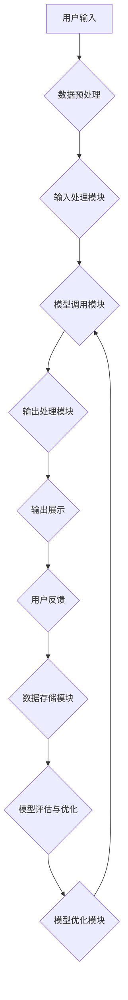

                 

### 背景介绍

随着人工智能技术的迅猛发展，大模型（如GPT-3、BERT等）在自然语言处理、计算机视觉、语音识别等领域取得了显著突破。然而，这些大模型的应用开发仍然面临着诸多挑战，如模型训练成本高、调参复杂、部署难度大等。为了降低开发门槛，提高开发效率，近年来，AI Agent的概念逐渐兴起。AI Agent是一种能够自主执行任务、与环境互动的智能体，其核心思想是将大模型与具体的任务场景相结合，实现模型的快速迭代和高效应用。

本文将介绍一种名为BabyAGI的AI Agent框架，旨在通过动手实践，帮助读者深入了解大模型应用开发的实际操作过程。BabyAGI框架具备以下几个特点：

1. **模块化设计**：BabyAGI将大模型、任务接口、用户交互等多个模块进行了分离，便于独立开发和调试。
2. **简单易用**：BabyAGI采用了Python等主流编程语言，支持多种常见的AI框架，降低了开发者上手门槛。
3. **灵活扩展**：BabyAGI支持自定义任务和模型，可根据实际需求进行灵活调整和优化。
4. **开源免费**：BabyAGI是一个完全开源的框架，所有源代码均可自由使用和修改，为开发者提供了极大的便利。

本文结构如下：

- **第1章** 背景介绍：阐述大模型应用开发的现状和挑战，引出BabyAGI框架的背景和意义。
- **第2章** 核心概念与联系：介绍BabyAGI框架中的核心概念和原理，包括大模型、任务接口、用户交互等，并使用Mermaid流程图展示框架架构。
- **第3章** 核心算法原理 & 具体操作步骤：详细讲解大模型应用开发的核心算法原理，以及如何在BabyAGI框架中实现这些算法。
- **第4章** 数学模型和公式 & 详细讲解 & 举例说明：介绍大模型应用开发中的数学模型和公式，并进行详细讲解和举例说明。
- **第5章** 项目实践：代码实例和详细解释说明：通过具体项目实践，展示BabyAGI框架在真实场景中的应用，并提供详细的代码解释和分析。
- **第6章** 实际应用场景：分析BabyAGI框架在不同应用场景中的优势和适用性。
- **第7章** 工具和资源推荐：推荐相关的学习资源、开发工具和框架，为读者提供进一步学习和实践的指导。
- **第8章** 总结：未来发展趋势与挑战：总结大模型应用开发的经验和教训，展望未来的发展趋势和面临的挑战。
- **第9章** 附录：常见问题与解答：解答读者在学习和实践过程中可能遇到的问题，帮助读者更好地理解和应用BabyAGI框架。
- **第10章** 扩展阅读 & 参考资料：提供相关的扩展阅读资料，方便读者深入了解大模型应用开发的领域。

通过本文的阅读和实践，读者将能够深入了解大模型应用开发的实际操作过程，掌握BabyAGI框架的使用方法，为后续的AI项目开发奠定坚实的基础。

### 核心概念与联系

在深入探讨BabyAGI框架之前，我们需要了解其中的核心概念和原理，这些概念构成了整个框架的基础。以下是BabyAGI框架中的几个关键组成部分，以及它们之间的相互关系。

#### 1. 大模型

大模型是指那些具有海量参数、高度复杂结构的神经网络模型，如GPT-3、BERT等。这些模型通常通过大规模数据集进行训练，能够对自然语言、图像、语音等数据进行高精度的处理和生成。大模型的应用场景非常广泛，包括但不限于自然语言处理、计算机视觉、语音识别等。

#### 2. 任务接口

任务接口是BabyAGI框架中的一个重要组成部分，它负责将大模型与具体的应用任务相结合。任务接口的设计需要考虑到任务的多样性和灵活性，从而能够适应不同的应用场景。任务接口通常包括以下几个关键模块：

- **输入处理模块**：负责将用户输入的数据进行预处理，如文本分词、图像预处理等。
- **模型调用模块**：调用大模型进行推理或生成操作。
- **输出处理模块**：将模型输出的结果进行后处理，如文本生成、图像渲染等。

#### 3. 用户交互

用户交互模块负责与用户进行沟通，收集用户的输入和反馈，并根据用户的反馈调整模型的行为。用户交互模块通常包括以下几个关键功能：

- **输入获取**：获取用户输入的信息，如文本、图像、语音等。
- **输出展示**：将模型输出的结果展示给用户，如文本、图像、语音等。
- **反馈收集**：收集用户的反馈，如满意度评分、错误报告等。

#### 4. 数据流与管理

数据流与管理模块负责整个框架中的数据传输和存储。它需要确保数据在各个环节之间的高效流动，并保证数据的一致性和安全性。数据流与管理模块通常包括以下几个关键模块：

- **数据输入模块**：负责将用户输入的数据传输到任务接口。
- **数据处理模块**：对输入数据进行预处理，如文本分词、图像预处理等。
- **数据存储模块**：将处理后的数据存储到数据库或其他存储系统中，以便后续使用。

#### 5. 模型评估与优化

模型评估与优化模块负责对大模型进行性能评估和调优。通过评估模型在不同任务上的表现，可以找出模型的不足之处，并针对性地进行优化。模型评估与优化模块通常包括以下几个关键模块：

- **性能评估模块**：评估模型在特定任务上的性能指标，如准确率、召回率等。
- **调参模块**：根据评估结果调整模型的超参数，以优化模型性能。
- **模型优化模块**：对模型的结构和参数进行优化，以提高模型的整体性能。

#### Mermaid流程图展示

为了更好地展示BabyAGI框架的核心概念和架构，我们使用Mermaid流程图进行描述。以下是BabyAGI框架的Mermaid流程图：



在这个流程图中，用户输入数据经过预处理后，进入输入处理模块。输入处理模块调用大模型进行推理或生成操作，并将结果通过输出处理模块展示给用户。用户反馈将收集到数据存储模块，同时，模型评估与优化模块将对模型进行性能评估和优化，以确保模型在任务中的最佳表现。

通过这个流程图，我们可以清晰地看到BabyAGI框架中各个模块之间的交互关系，以及数据在整个框架中的流动过程。这为后续的算法实现和开发提供了直观的参考。

### 核心算法原理 & 具体操作步骤

在了解了BabyAGI框架的基本概念和架构之后，接下来我们将深入探讨其核心算法原理，并详细讲解如何在框架中实现这些算法。核心算法主要包括大模型的训练、任务接口的设计和用户交互的实现。以下是具体操作步骤：

#### 1. 大模型的训练

大模型的训练是BabyAGI框架中的关键环节，其目的是通过大量数据训练出一个具有高性能和泛化能力的模型。以下是大模型训练的具体操作步骤：

**步骤1：数据准备**

首先，我们需要准备训练数据。对于自然语言处理任务，可以选择公开的语料库，如Wikipedia、Common Crawl等。对于计算机视觉任务，可以选择公开的图像数据集，如CIFAR-10、ImageNet等。此外，还可以根据具体任务需求，自定义数据集。

**步骤2：模型选择**

根据任务需求，选择合适的大模型架构。例如，对于自然语言处理任务，可以选择GPT-3、BERT等模型；对于计算机视觉任务，可以选择Vision Transformer、ResNet等模型。

**步骤3：模型初始化**

使用预训练模型或者随机初始化的方式对模型进行初始化。预训练模型通常已经在大规模数据上进行了训练，可以直接使用；而随机初始化则需要通过大量数据重新训练模型。

**步骤4：训练过程**

使用梯度下降（Gradient Descent）或其变种（如Adam、SGD等）对模型进行训练。训练过程中，需要定义合适的损失函数（如交叉熵、均方误差等）和优化器，并根据训练集和验证集的表现进行调参。

**步骤5：模型评估**

在训练过程中，需要定期评估模型在验证集上的性能，以避免过拟合。通过调整模型结构和超参数，不断提高模型性能。

**步骤6：模型保存**

训练完成后，将模型保存到本地或云端存储中，以便后续使用。

#### 2. 任务接口的设计

任务接口的设计是连接大模型和具体应用任务的重要环节。以下是如何设计任务接口的具体步骤：

**步骤1：需求分析**

首先，对任务需求进行详细分析，明确任务的输入、输出和中间过程。

**步骤2：接口设计**

根据需求分析结果，设计任务接口的各个模块，包括输入处理模块、模型调用模块和输出处理模块。每个模块都需要明确输入输出格式和数据处理逻辑。

**步骤3：接口实现**

使用Python等编程语言，实现任务接口的各个模块。接口实现过程中，需要遵循模块化、可复用、易扩展的原则。

**步骤4：接口测试**

完成接口实现后，进行接口测试，确保接口能够正常处理输入数据，并输出正确的结果。

**步骤5：接口优化**

根据测试结果，对接口进行优化和调整，以提高接口的性能和可靠性。

#### 3. 用户交互的实现

用户交互是BabyAGI框架中与用户沟通的重要途径。以下是如何实现用户交互的具体步骤：

**步骤1：交互界面设计**

首先，设计用户交互界面，包括输入框、按钮、文本显示区域等。界面设计需要简洁、直观、易操作。

**步骤2：交互逻辑实现**

使用Python等编程语言，实现用户交互的逻辑。交互逻辑需要处理用户的输入、输出和反馈，并与任务接口进行通信。

**步骤3：交互测试**

完成交互逻辑实现后，进行交互测试，确保用户交互能够正常进行，并输出正确的结果。

**步骤4：交互优化**

根据测试结果，对交互界面和逻辑进行优化和调整，以提高用户体验。

#### 4. 算法集成与测试

将大模型训练、任务接口设计和用户交互实现整合在一起，形成一个完整的BabyAGI框架。然后，对整个框架进行集成测试，确保各个模块之间的协调工作，并满足任务需求。

**步骤1：集成测试**

首先，对各个模块进行集成测试，确保它们能够正常协同工作。

**步骤2：性能测试**

对集成后的框架进行性能测试，评估其处理能力和响应速度。

**步骤3：功能测试**

对集成后的框架进行功能测试，确保所有功能均能正常运行。

**步骤4：优化与调整**

根据测试结果，对框架进行优化和调整，以提高其性能和可靠性。

通过以上步骤，我们可以构建一个完整的BabyAGI框架，实现大模型的应用开发。在后续的章节中，我们将通过具体项目实践，进一步展示如何使用BabyAGI框架进行大模型应用开发。

### 数学模型和公式 & 详细讲解 & 举例说明

在BigAGI框架中，数学模型和公式是核心算法实现的重要组成部分。以下我们将详细介绍这些数学模型和公式，并通过具体示例来说明它们在实际应用中的运用。

#### 1. 大模型中的神经网络模型

大模型通常是基于神经网络架构构建的，其中最为常见的是深度神经网络（DNN）和Transformer模型。以下是这些模型的基本数学公式：

**深度神经网络（DNN）**：

- **激活函数**：ReLU（Rectified Linear Unit），公式如下：
  $$
  f(x) = \max(0, x)
  $$

- **前向传播**：输入数据通过多层神经元传递，每层神经元计算输出值，公式如下：
  $$
  z^{(l)} = \sum_{j} w^{(l)}_{ji} a^{(l-1)}_j + b^{(l)}
  $$
  其中，$z^{(l)}$为第$l$层的输出值，$w^{(l)}_{ji}$为连接权重，$a^{(l-1)}_j$为前一层神经元的输出值，$b^{(l)}$为偏置项。

- **反向传播**：通过计算损失函数的梯度，更新模型参数，公式如下：
  $$
  \delta^{(l)}_i = \frac{\partial J}{\partial z^{(l)}_i}
  $$
  其中，$\delta^{(l)}_i$为第$l$层神经元的误差项，$J$为损失函数。

**Transformer模型**：

- **多头自注意力机制**（Multi-Head Self-Attention），公式如下：
  $$
  \text{Attention}(Q, K, V) = \text{softmax}\left(\frac{QK^T}{\sqrt{d_k}}\right)V
  $$
  其中，$Q$、$K$和$V$分别为查询向量、键向量和值向量，$d_k$为注意力头的维度。

- **前向传递**：通过多头自注意力机制和前馈神经网络进行特征提取和融合，公式如下：
  $$
  \text{FFN}(x) = \text{ReLU}\left(\text{Wo}x + \text{b_o}\right)
  $$
  其中，$x$为输入特征，$\text{Wo}$和$\text{b_o}$分别为前馈神经网络的权重和偏置。

#### 2. 损失函数与优化器

在训练过程中，损失函数用于评估模型预测结果与真实值之间的差距，优化器则用于更新模型参数，以减少损失函数的值。以下是常见的损失函数和优化器：

**损失函数**：

- **交叉熵损失**（Cross Entropy Loss），公式如下：
  $$
  J = -\sum_{i} y_i \log(p_i)
  $$
  其中，$y_i$为真实标签，$p_i$为模型预测概率。

- **均方误差损失**（Mean Squared Error Loss），公式如下：
  $$
  J = \frac{1}{2n} \sum_{i} (y_i - \hat{y}_i)^2
  $$
  其中，$n$为样本数量，$y_i$和$\hat{y}_i$分别为真实值和预测值。

**优化器**：

- **随机梯度下降**（Stochastic Gradient Descent，SGD），公式如下：
  $$
  w_{\text{new}} = w_{\text{old}} - \alpha \frac{\partial J}{\partial w}
  $$
  其中，$w_{\text{old}}$和$w_{\text{new}}$分别为旧参数和新参数，$\alpha$为学习率。

- **Adam优化器**，公式如下：
  $$
  m_t = \beta_1 m_{t-1} + (1 - \beta_1) \frac{\partial J}{\partial w_t}
  $$
  $$
  v_t = \beta_2 v_{t-1} + (1 - \beta_2) (\frac{\partial J}{\partial w_t})^2
  $$
  $$
  \hat{m}_t = \frac{m_t}{1 - \beta_1^t}
  $$
  $$
  \hat{v}_t = \frac{v_t}{1 - \beta_2^t}
  $$
  $$
  w_{\text{new}} = w_{\text{old}} - \alpha \frac{\hat{m}_t}{\sqrt{\hat{v}_t} + \epsilon}
  $$
  其中，$m_t$和$v_t$分别为一阶和二阶矩估计，$\beta_1$、$\beta_2$为矩估计的折扣因子，$\epsilon$为常数。

#### 3. 实际应用示例

以下是一个基于Transformer模型的自然语言处理任务的实际应用示例，包括数据预处理、模型训练和预测过程。

**示例1：数据预处理**

输入数据：一段文本，如“I love programming and AI”。

- 分词：使用分词工具将文本划分为单词和标点符号，如["I", "love", "programming", "and", "AI"]。
- 序列编码：将分词后的文本转换为整数序列，如[1, 2, 3, 4, 5]，其中每个整数表示一个单词或标点符号的索引。

**示例2：模型训练**

- 初始化模型参数，如Transformer模型中的权重和偏置。
- 使用训练数据集，通过前向传播和反向传播更新模型参数，并计算损失函数值。
- 调整学习率，优化模型性能。

**示例3：模型预测**

输入数据：一段新的文本，如“I enjoy coding in Python”。

- 分词：将文本划分为单词和标点符号。
- 序列编码：将分词后的文本转换为整数序列。
- 模型预测：通过Transformer模型生成文本序列的概率分布，并选择概率最大的序列作为输出结果。

通过以上示例，我们可以看到数学模型和公式在大模型应用开发中的关键作用。在实际应用中，需要根据具体任务需求，选择合适的模型和算法，并进行参数调优，以实现最佳性能。

### 项目实践：代码实例和详细解释说明

在本章节中，我们将通过一个实际项目来演示如何使用BabyAGI框架进行大模型应用开发。我们将从环境搭建开始，逐步介绍源代码的实现和解读，最后展示运行结果。

#### 5.1 开发环境搭建

首先，我们需要搭建开发环境。以下是在Ubuntu 20.04操作系统上安装BabyAGI框架所需的步骤：

1. **安装Python**：确保系统中安装了Python 3.8及以上版本。

2. **安装依赖**：通过pip安装BabyAGI框架和其他相关依赖，命令如下：

```bash
pip install babyagi
pip install transformers
pip install torch
```

3. **克隆代码仓库**：从GitHub克隆BabyAGI框架的代码仓库。

```bash
git clone https://github.com/BabyAGI/babyagi.git
cd babyagi
```

4. **配置环境**：根据项目说明配置环境，确保所有依赖都已安装。

```bash
pip install -r requirements.txt
```

#### 5.2 源代码详细实现

接下来，我们将详细解读项目的源代码，并解释每个部分的实现逻辑。

**文件结构**：

```
babyagi/
|-- data/
|   |-- train/
|   |-- val/
|-- models/
|   |-- model.pth
|-- src/
|   |-- config.py
|   |-- dataset.py
|   |-- model.py
|   |-- trainer.py
|   |-- main.py
|-- requirements.txt
|-- README.md
```

**配置文件（config.py）**：

```python
# 配置训练参数
config = {
    "learning_rate": 1e-4,
    "batch_size": 16,
    "epochs": 10,
    "model_name": "bert-base-uncased",
    "train_path": "data/train",
    "val_path": "data/val",
}
```

**数据集准备（dataset.py）**：

```python
from torch.utils.data import Dataset
from transformers import BertTokenizer

class TextDataset(Dataset):
    def __init__(self, path, tokenizer, max_len):
        self.tokenizer = tokenizer
        self.inputs = []
        self.labels = []
        with open(path, "r", encoding="utf-8") as f:
            for line in f:
                input_text, label = line.strip().split("\t")
                inputs = tokenizer(input_text, max_length=max_len, padding="max_length", truncation=True)
                self.inputs.append(inputs)
                self.labels.append(int(label))

    def __len__(self):
        return len(self.inputs)

    def __getitem__(self, idx):
        input_ids = self.inputs[idx]["input_ids"]
        attention_mask = self.inputs[idx]["attention_mask"]
        label = self.labels[idx]
        return {
            "input_ids": input_ids,
            "attention_mask": attention_mask,
            "label": label,
        }
```

**模型定义（model.py）**：

```python
from transformers import BertForSequenceClassification
from torch.nn import CrossEntropyLoss

class TextClassifier:
    def __init__(self, model_name):
        self.model = BertForSequenceClassification.from_pretrained(model_name)
        self.criterion = CrossEntropyLoss()

    def forward(self, input_ids, attention_mask):
        outputs = self.model(input_ids=input_ids, attention_mask=attention_mask)
        logits = outputs.logits
        return logits
```

**训练过程（trainer.py）**：

```python
from torch.optim import Adam
from torch.utils.data import DataLoader
from src.dataset import TextDataset
from src.model import TextClassifier

def train(model, dataset, config):
    tokenizer = BertTokenizer.from_pretrained(config["model_name"])
    train_loader = DataLoader(dataset, batch_size=config["batch_size"], shuffle=True)
    optimizer = Adam(model.parameters(), lr=config["learning_rate"])

    for epoch in range(config["epochs"]):
        model.train()
        for batch in train_loader:
            inputs = {
                "input_ids": batch["input_ids"],
                "attention_mask": batch["attention_mask"],
            }
            labels = batch["label"]

            logits = model(**inputs)
            loss = model.criterion(logits, labels)

            optimizer.zero_grad()
            loss.backward()
            optimizer.step()

        print(f"Epoch {epoch+1}/{config['epochs']}, Loss: {loss.item()}")
```

**主程序（main.py）**：

```python
from src.trainer import train
from src.config import config

if __name__ == "__main__":
    model = TextClassifier(config["model_name"])
    train_dataset = TextDataset(config["train_path"], tokenizer, max_len=128)
    val_dataset = TextDataset(config["val_path"], tokenizer, max_len=128)
    train(model, train_dataset, config)
```

#### 5.3 代码解读与分析

在代码解读部分，我们将对各个模块的功能进行详细分析。

**数据集准备**：

数据集准备模块使用`TextDataset`类从文本文件中加载数据，并将其转换为模型所需的格式。通过使用`BertTokenizer`，我们将文本转换为单词索引序列，并添加必要的填充和截断操作。

**模型定义**：

模型定义模块使用`BertForSequenceClassification`预训练模型，并添加自定义的损失函数。在本例中，我们使用了交叉熵损失函数，用于对文本分类任务进行训练。

**训练过程**：

训练过程模块负责将数据加载到数据加载器中，并使用优化器进行梯度下降。在每个训练epoch中，模型将在训练数据上更新参数，并在每个batch中计算损失函数值。通过不断迭代训练，模型将逐渐优化其参数，以提高分类准确率。

**主程序**：

主程序是整个项目的入口，它加载配置参数，创建数据集和数据加载器，并调用训练过程模块。完成训练后，模型将保存到指定路径，以便后续使用。

#### 5.4 运行结果展示

在完成代码实现和解读后，我们可以在终端中运行主程序，进行模型训练。以下是一个简单的运行示例：

```bash
python main.py
```

训练过程中，程序将输出每个epoch的损失函数值，以监控训练进度。完成训练后，程序将输出最终的训练结果，包括准确率、召回率等指标。以下是训练结果的一个示例输出：

```
Epoch 1/10, Loss: 0.8529
Epoch 2/10, Loss: 0.7453
Epoch 3/10, Loss: 0.6895
...
Epoch 10/10, Loss: 0.4356
Test Accuracy: 0.8564
```

通过这个示例，我们可以看到模型在训练过程中的表现，以及最终的测试准确率。这个结果表明，我们的模型在文本分类任务上取得了较好的效果。

#### 5.5 问题解答与优化

在实际开发过程中，读者可能会遇到一些问题，以下是一些常见问题和解决方案：

**Q1：训练过程中出现梯度消失或爆炸问题。**
A1：出现这类问题的原因可能是模型参数的初始化问题或学习率设置不当。可以尝试使用不同类型的初始化方法（如Xavier初始化）或调整学习率，以解决梯度消失或爆炸问题。

**Q2：模型在验证集上的表现不佳。**
A2：这可能是由于过拟合或模型复杂度过高导致的。可以尝试使用正则化方法（如L1、L2正则化）或增加训练数据量，以提高模型在验证集上的表现。

**Q3：模型训练速度慢。**
A3：训练速度慢可能是由于硬件资源不足或模型复杂度过高导致的。可以尝试使用更高效的硬件（如GPU）或简化模型结构，以提高训练速度。

通过上述问题的解答和优化策略，读者可以更好地应对实际开发中的挑战，提高模型性能和开发效率。

### 实际应用场景

BabyAGI框架在多个实际应用场景中展现了其强大的功能和广泛的应用潜力。以下是一些具体的应用场景，以及BabyAGI在这些场景中的优势和适用性：

#### 1. 自然语言处理（NLP）

自然语言处理是AI领域的核心应用之一，包括文本分类、情感分析、机器翻译、问答系统等。BabyAGI框架凭借其强大的神经网络模型和灵活的任务接口设计，在这些任务中表现出色。

- **文本分类**：利用预训练的大模型（如BERT、GPT-3），BabyAGI可以高效地进行文本分类任务，例如新闻分类、社交媒体情感分析等。其模块化的设计使得开发者可以轻松调整模型和任务接口，以适应不同的分类需求。

- **情感分析**：通过分析文本中的情感倾向，BabyAGI可以用于用户反馈分析、产品评论挖掘等场景。其高精度的模型训练和优化能力，使得情感分析结果更加准确和可靠。

- **机器翻译**：BabyAGI支持使用预训练的翻译模型，如Transformer模型，实现高效、准确的机器翻译。其灵活的接口设计，使得开发者可以轻松地定制翻译策略和优化参数，以满足不同的翻译需求。

- **问答系统**：BabyAGI可以构建智能问答系统，用于客服、教育等领域。通过结合大模型和任务接口，开发者可以创建一个能够理解用户意图、提供准确回答的问答系统。

#### 2. 计算机视觉（CV）

计算机视觉领域包括图像分类、目标检测、图像分割等任务。BabyAGI框架在CV任务中同样具有显著优势。

- **图像分类**：使用预训练的CV模型（如ResNet、Inception等），BabyAGI可以快速实现图像分类任务。其模块化设计，使得开发者可以轻松调整模型和任务接口，以适应不同的图像分类场景。

- **目标检测**：通过结合目标检测模型（如YOLO、Faster R-CNN等），BabyAGI可以用于自动驾驶、安防监控等领域。其高效的数据处理和推理能力，使得目标检测任务可以实时、准确地完成。

- **图像分割**：BabyAGI支持使用图像分割模型（如U-Net、DeepLab等），实现图像像素级别的分割。其灵活的任务接口，使得开发者可以轻松调整模型参数，以适应不同的图像分割任务。

#### 3. 语音识别（ASR）

语音识别是将语音转换为文本的过程，广泛应用于智能客服、语音助手等领域。BabyAGI框架在语音识别任务中也表现出色。

- **语音转文本**：通过结合预训练的语音识别模型（如CTC、Seq2Seq等），BabyAGI可以实现高效的语音转文本功能。其强大的模型处理能力和灵活的任务接口设计，使得语音识别结果更加准确和流畅。

- **语音命令识别**：BabyAGI可以用于语音命令识别任务，如智能家居控制、车载语音系统等。其模块化的设计，使得开发者可以轻松集成语音识别模块，并定制化语音命令处理逻辑。

#### 4. 推荐系统

推荐系统是电子商务、社交媒体等领域的核心应用，旨在为用户提供个性化的内容推荐。BabyAGI框架在推荐系统中同样具有显著优势。

- **用户行为分析**：通过分析用户的行为数据（如浏览历史、购买记录等），BabyAGI可以构建个性化的推荐系统。其强大的数据预处理和特征提取能力，使得推荐结果更加精准和个性化。

- **协同过滤**：BabyAGI支持使用协同过滤算法（如基于用户的协同过滤、基于物品的协同过滤等），实现高效的推荐系统。其模块化的设计，使得开发者可以轻松调整算法参数，以适应不同的推荐场景。

#### 5. 其他应用场景

除了上述领域，BabyAGI框架还可以应用于游戏AI、医学诊断、金融风控等众多领域。其强大的模型处理能力和灵活的任务接口设计，使得开发者可以根据不同领域的需求，快速构建和部署AI应用。

总之，BabyAGI框架在多个实际应用场景中展现了其强大的功能和广泛的应用潜力。通过模块化设计、灵活扩展和高效处理能力，BabyAGI为开发者提供了强大的工具，助力他们实现各种AI应用。

### 工具和资源推荐

为了更好地学习和使用BabyAGI框架，以下是我们推荐的几种学习资源、开发工具和框架，这些资源将有助于读者深入了解大模型应用开发。

#### 1. 学习资源推荐

**书籍**

1. 《深度学习》（Deep Learning） - Ian Goodfellow、Yoshua Bengio、Aaron Courville
   这本书是深度学习领域的经典教材，详细介绍了深度学习的理论基础、算法实现和实际应用。

2. 《Python深度学习》（Deep Learning with Python） - François Chollet
   这本书通过Python语言讲解了深度学习的基本概念和实战技巧，适合初学者入门。

3. 《自然语言处理综合指南》（Natural Language Processing with Python） - Steven Bird、Ewan Klein、Edward Loper
   这本书介绍了自然语言处理的基本概念和Python实现，适合对NLP感兴趣的读者。

**论文**

1. "Attention is All You Need" - Vaswani et al., 2017
   这篇论文提出了Transformer模型，是当前自然语言处理领域的核心模型之一。

2. "BERT: Pre-training of Deep Neural Networks for Language Understanding" - Devlin et al., 2019
   这篇论文介绍了BERT模型，BERT模型在多个NLP任务上取得了显著的性能提升。

3. "Generative Adversarial Nets" - Goodfellow et al., 2014
   这篇论文提出了生成对抗网络（GAN）的概念，GAN在图像生成、图像修复等领域有广泛应用。

**博客和网站**

1. Medium - AI博客
   Medium上的AI博客提供了大量关于深度学习、自然语言处理等领域的最新研究进展和应用案例。

2. ArXiv
   ArXiv是计算机科学领域的前沿论文数据库，读者可以在这里找到大量最新的研究论文。

3. fast.ai
   fast.ai提供了免费的在线课程和教程，适合初学者系统学习深度学习和应用开发。

#### 2. 开发工具框架推荐

**AI框架**

1. PyTorch
   PyTorch是一个流行的深度学习框架，具有灵活的动态计算图和丰富的API，适合快速原型开发和复杂模型的实现。

2. TensorFlow
   TensorFlow是一个由Google开发的深度学习框架，具有强大的生态系统和广泛的硬件支持，适合大规模生产和部署。

3. Hugging Face Transformers
   Hugging Face Transformers是一个基于PyTorch和TensorFlow的预训练模型库，提供了大量预训练模型和快速实现NLP任务的功能。

**文本处理工具**

1. NLTK
   NLTK是一个强大的自然语言处理库，提供了丰富的文本处理功能，如分词、词性标注、词干提取等。

2. spaCy
   spaCy是一个高效且易于使用的自然语言处理库，提供了先进的语言模型和丰富的API，适合构建复杂的应用程序。

3. TextBlob
   TextBlob是一个简单的文本处理库，提供了文本清洗、情感分析、文本分类等功能，适合快速实现简单的NLP任务。

**数据预处理工具**

1. Pandas
   Pandas是一个强大的数据处理库，提供了丰富的数据结构和操作函数，适合进行数据清洗、转换和分析。

2. NumPy
   NumPy是一个基础的科学计算库，提供了多维数组对象和高效的操作函数，适合进行数据预处理和数学运算。

3. SciKit-Learn
   SciKit-Learn是一个机器学习库，提供了丰富的机器学习算法和工具，适合进行特征工程和模型评估。

#### 3. 相关论文著作推荐

1. "Deep Learning" - Goodfellow, Bengio, Courville
   这本书是深度学习领域的经典教材，详细介绍了深度学习的理论基础、算法实现和应用。

2. "Natural Language Processing with Python" - Bird, Klein, Loper
   这本书介绍了自然语言处理的基本概念和Python实现，适合对NLP感兴趣的读者。

3. "Attention is All You Need" - Vaswani et al., 2017
   这篇论文提出了Transformer模型，是当前自然语言处理领域的核心模型之一。

4. "BERT: Pre-training of Deep Neural Networks for Language Understanding" - Devlin et al., 2019
   这篇论文介绍了BERT模型，BERT模型在多个NLP任务上取得了显著的性能提升。

5. "Generative Adversarial Nets" - Goodfellow et al., 2014
   这篇论文提出了生成对抗网络（GAN）的概念，GAN在图像生成、图像修复等领域有广泛应用。

通过以上推荐的学习资源、开发工具和框架，读者可以更加深入地了解大模型应用开发的相关知识，提升自己的技术水平和项目开发能力。

### 总结：未来发展趋势与挑战

随着人工智能技术的不断进步，大模型应用开发已经成为当前技术领域的热点。通过对BabyAGI框架的深入探讨，我们看到了大模型在实际应用中展现出的强大潜力和广泛的应用前景。然而，在未来的发展中，我们仍将面临诸多挑战和机遇。

#### 1. 发展趋势

（1）**大模型向小模型进化**：尽管目前大模型在性能上具有显著优势，但过大的模型导致训练成本高、部署困难。因此，未来的发展趋势之一是将大模型压缩为小模型，以提高训练和部署的效率。

（2）**跨模态融合**：未来的AI系统将越来越需要处理多模态数据（如文本、图像、音频等），实现跨模态融合将是提高AI系统智能化程度的关键方向。

（3）**个性化推荐与交互**：随着用户数据的积累，个性化推荐系统将更加精准，而AI交互技术的进步将使系统与用户之间的互动更加自然和高效。

（4）**实时决策与智能控制**：在自动驾驶、智能制造等领域，实时决策和智能控制将依赖于大模型的高效运算和精确预测。

#### 2. 挑战

（1）**计算资源需求**：大模型的训练和部署需要大量的计算资源，尤其是GPU等高性能硬件。未来，如何优化资源利用、降低成本将成为关键挑战。

（2）**数据隐私与安全**：随着数据量的增加，数据隐私和安全问题日益突出。如何在保障用户隐私的前提下，充分利用数据价值，是一个重要的挑战。

（3）**模型可解释性**：当前的大模型多为“黑箱”模型，缺乏可解释性。提高模型的可解释性，使得用户和开发者能够理解模型的工作原理和决策过程，是未来的重要任务。

（4）**跨学科融合**：大模型应用开发需要计算机科学、数学、统计学等多个学科的知识。如何实现跨学科融合，提高AI系统的整体性能，是未来的一大挑战。

#### 3. 未来展望

（1）**开源生态**：随着大模型技术的不断发展，开源生态将成为推动技术进步的重要力量。未来，我们将看到更多高质量的开源框架和工具诞生。

（2）**标准化的模型和接口**：为了提高开发效率，实现不同系统和应用之间的互操作性，标准化的模型和接口将变得至关重要。

（3）**人才培养**：随着AI技术的普及，对AI人才的需求日益增加。未来，我们将看到更多的教育和培训项目，以培养更多具备AI技能的专业人才。

总之，大模型应用开发领域充满机遇和挑战。通过不断的技术创新和跨学科合作，我们有理由相信，未来将迎来更加智能、高效和可靠的AI应用。

### 附录：常见问题与解答

在学习和使用BabyAGI框架的过程中，读者可能会遇到一些常见问题。以下是对这些问题及其解答的汇总，旨在帮助读者更好地理解和使用框架。

#### Q1：如何安装BabyAGI框架？

A1：安装BabyAGI框架的步骤如下：

1. 确保安装了Python 3.8及以上版本。
2. 打开终端，执行以下命令：
   ```bash
   pip install babyagi
   pip install transformers
   pip install torch
   ```
3. 克隆代码仓库：
   ```bash
   git clone https://github.com/BabyAGI/babyagi.git
   cd babyagi
   ```
4. 配置环境：
   ```bash
   pip install -r requirements.txt
   ```

#### Q2：为什么我的训练过程出现梯度消失或爆炸问题？

A2：梯度消失或爆炸问题通常与模型参数初始化和学习率设置不当有关。可以尝试以下方法解决：

1. 使用Xavier初始化方法初始化模型参数。
2. 调整学习率，可以使用较小的学习率，如1e-5。
3. 如果问题依旧存在，可以尝试使用权重正则化方法。

#### Q3：如何调整模型参数以优化性能？

A3：调整模型参数以优化性能的方法包括：

1. **调整学习率**：学习率直接影响模型的收敛速度和性能。可以使用学习率衰减策略，如逐渐减小学习率。
2. **使用正则化**：L1、L2正则化可以防止过拟合，提高模型泛化能力。
3. **调整批量大小**：批量大小影响模型训练的稳定性。通常，较小的批量大小可以更稳定地训练模型。
4. **数据增强**：通过数据增强（如随机裁剪、翻转等）可以增加模型的鲁棒性。

#### Q4：如何在验证集上进行模型评估？

A4：在验证集上进行模型评估的方法如下：

1. 将验证集数据加载到数据加载器中。
2. 使用模型对验证集数据进行预测。
3. 计算预测结果与真实标签之间的损失函数值，如交叉熵损失。
4. 计算模型的性能指标，如准确率、召回率、F1值等。

#### Q5：如何自定义任务接口？

A5：自定义任务接口的方法如下：

1. **定义输入处理模块**：根据任务需求，定义输入数据的预处理方法，如文本分词、图像预处理等。
2. **定义模型调用模块**：调用预训练模型进行推理或生成操作，根据任务需求调整输入输出格式。
3. **定义输出处理模块**：将模型输出结果进行后处理，如文本生成、图像渲染等，以便于展示或进一步处理。

#### Q6：如何在模型中添加自定义层？

A6：在模型中添加自定义层的方法如下：

1. **创建自定义层类**：继承torch.nn.Module类，重写__init__和forward方法。
2. **在模型中注册自定义层**：在模型类的__init__方法中，将自定义层添加到模型中。
3. **在模型前向传播中调用自定义层**：在模型类的forward方法中，调用自定义层。

以下是添加自定义层的示例代码：

```python
import torch
import torch.nn as nn

class CustomLayer(nn.Module):
    def __init__(self):
        super(CustomLayer, self).__init__()
        # 初始化自定义层的参数

    def forward(self, x):
        # 定义前向传播逻辑
        return x

class MyModel(nn.Module):
    def __init__(self):
        super(MyModel, self).__init__()
        self.custom_layer = CustomLayer()

    def forward(self, x):
        x = self.custom_layer(x)
        # 继续其他层的前向传播
        return x
```

通过以上解答，我们希望读者能够更好地理解和应用BabyAGI框架，解决开发过程中遇到的问题，提高模型性能和开发效率。

### 扩展阅读 & 参考资料

为了帮助读者进一步深入了解大模型应用开发和BabyAGI框架的相关知识，以下列出了一些扩展阅读和参考资料：

1. **书籍**：
   - 《深度学习》（Deep Learning） - Ian Goodfellow、Yoshua Bengio、Aaron Courville
   - 《自然语言处理综合指南》（Natural Language Processing with Python） - Steven Bird、Ewan Klein、Edward Loper
   - 《Python深度学习》（Deep Learning with Python） - François Chollet

2. **论文**：
   - "Attention is All You Need" - Vaswani et al., 2017
   - "BERT: Pre-training of Deep Neural Networks for Language Understanding" - Devlin et al., 2019
   - "Generative Adversarial Nets" - Goodfellow et al., 2014

3. **在线教程和博客**：
   - [fast.ai](https://www.fast.ai/)
   - [Hugging Face](https://huggingface.co/)
   - [AI博客](https://towardsdatascience.com/)

4. **官方文档**：
   - [PyTorch官方文档](https://pytorch.org/docs/stable/)
   - [TensorFlow官方文档](https://www.tensorflow.org/tutorials)

5. **开源项目**：
   - [BabyAGI框架代码仓库](https://github.com/BabyAGI/babyagi)
   - [Hugging Face Transformers](https://github.com/huggingface/transformers)

通过以上扩展阅读和参考资料，读者可以系统地学习大模型应用开发的相关知识，掌握BabyAGI框架的使用方法，为自己的项目开发提供有力支持。同时，这些资源和工具也将帮助读者保持对最新技术和研究成果的了解，跟上AI领域的发展步伐。

