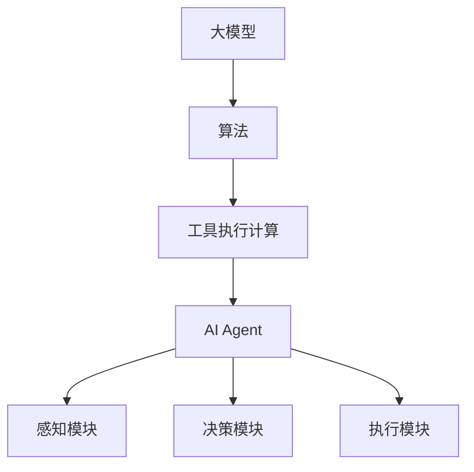

                 

# 【大模型应用开发 动手做AI Agent】第二轮行动：工具执行计算

> 关键词：大模型应用开发、AI Agent、工具执行计算、算法原理、数学模型、代码实例

> 摘要：本文将带领读者深入探讨大模型应用开发中的核心环节——工具执行计算。通过解析AI Agent的构建过程，本文旨在为开发者提供一套完整的技术指南，从核心概念、算法原理到实际代码实例，全面剖析如何利用大模型实现高效的工具执行计算。

## 1. 背景介绍

随着深度学习技术的迅猛发展，大模型（Large Models）的应用场景越来越广泛。大模型通常指的是参数规模达到数亿至数十亿的神经网络模型，它们能够处理海量数据并实现出色的任务表现。然而，大模型的应用开发并非一蹴而就，其中涉及到许多技术细节，如模型训练、优化、部署等。在这些环节中，工具执行计算扮演着至关重要的角色。

AI Agent，即人工智能代理，是一种能够自主执行任务、与环境互动并做出决策的智能体。构建AI Agent不仅需要强大的算法支持，还需要高效的工具执行计算能力。本文将围绕这个主题，详细阐述如何通过工具执行计算来提升AI Agent的性能和效率。

## 2. 核心概念与联系

在深入探讨工具执行计算之前，我们需要明确几个核心概念，并了解它们之间的联系。

### 2.1 大模型

大模型通常指的是参数规模达到数亿至数十亿的神经网络模型。这些模型通过大量的训练数据来学习复杂的数据特征，从而在各类任务中表现出色。例如，在自然语言处理（NLP）、计算机视觉（CV）等领域，大模型已经取得了显著的成果。

### 2.2 算法

算法是解决问题的一系列步骤。在大模型应用开发中，算法主要涉及模型的训练、优化和推理。训练算法通过迭代优化模型的参数，使其在特定任务上达到最佳表现；优化算法则用于提高模型的效率和性能；推理算法则用于在给定输入下预测输出。

### 2.3 工具执行计算

工具执行计算是指利用计算工具（如GPU、TPU等）加速模型训练和推理的过程。工具执行计算的目标是提高计算效率，降低计算成本，从而提升AI Agent的性能和实用性。

### 2.4 AI Agent

AI Agent是一种能够自主执行任务、与环境互动并做出决策的智能体。AI Agent通常由感知模块、决策模块和执行模块组成。感知模块用于获取环境信息；决策模块根据感知信息生成动作；执行模块则将动作应用于环境。


### 2.5 Mermaid 流程图

以下是描述大模型与AI Agent之间联系的一个Mermaid流程图：



## 3. 核心算法原理 & 具体操作步骤

### 3.1 模型训练算法

模型训练是AI Agent构建过程中的关键环节。训练算法通过迭代优化模型的参数，使其在特定任务上达到最佳表现。以下是模型训练的基本步骤：

1. 初始化模型参数
2. 定义损失函数（如均方误差、交叉熵等）
3. 定义优化算法（如梯度下降、Adam等）
4. 循环执行以下步骤：
   a. 计算损失值
   b. 计算梯度
   c. 更新模型参数
   d. 记录训练过程指标（如准确率、召回率等）

### 3.2 优化算法

优化算法的目标是提高模型效率和性能。以下是几种常见的优化算法：

1. **梯度下降（Gradient Descent）**：梯度下降是一种基于梯度的优化算法。其基本思想是沿着梯度的反方向更新模型参数，以减少损失值。
   $$\theta_{t+1} = \theta_{t} - \alpha \cdot \nabla_{\theta} J(\theta)$$
   其中，$\theta$ 表示模型参数，$\alpha$ 表示学习率，$J(\theta)$ 表示损失函数。

2. **Adam算法（Adaptive Moment Estimation）**：Adam算法是一种自适应的优化算法，结合了梯度下降和动量项。其核心思想是动态调整学习率，以适应不同的参数。
   $$m_t = \beta_1 x_t + (1 - \beta_1) (x_t - \min_{k \leq t} \epsilon_k)$$
   $$v_t = \beta_2 x_t + (1 - \beta_2) (x_t - \min_{k \leq t} \epsilon_k)$$
   $$\theta_{t+1} = \theta_{t} - \alpha \cdot \frac{m_t}{\sqrt{v_t} + \epsilon}$$
   其中，$m_t$ 和 $v_t$ 分别为梯度的指数加权移动平均值，$\beta_1$ 和 $\beta_2$ 为动量系数，$\alpha$ 为学习率。

### 3.3 工具执行计算

工具执行计算是指利用计算工具（如GPU、TPU等）加速模型训练和推理的过程。以下是工具执行计算的基本步骤：

1. 准备计算资源（如GPU、TPU等）
2. 编写计算代码（如Python、C++等）
3. 调用计算工具API（如CUDA、TensorFlow等）
4. 执行计算任务
5. 收集计算结果

### 3.4 AI Agent构建流程

以下是构建AI Agent的基本步骤：

1. 设计感知模块：确定感知模块的输入和输出，以及感知算法。
2. 设计决策模块：确定决策模块的输入和输出，以及决策算法。
3. 设计执行模块：确定执行模块的输入和输出，以及执行算法。
4. 集成感知、决策和执行模块，形成完整的AI Agent。
5. 进行模型训练和优化，以提高AI Agent的性能和效率。

## 4. 数学模型和公式 & 详细讲解 & 举例说明

### 4.1 梯度下降算法

梯度下降算法是一种基于梯度的优化算法。其核心思想是沿着梯度的反方向更新模型参数，以减少损失值。以下是梯度下降算法的数学模型：

$$\theta_{t+1} = \theta_{t} - \alpha \cdot \nabla_{\theta} J(\theta)$$

其中，$\theta$ 表示模型参数，$\alpha$ 表示学习率，$\nabla_{\theta} J(\theta)$ 表示损失函数关于模型参数的梯度。

### 4.2 Adam算法

Adam算法是一种自适应的优化算法，结合了梯度下降和动量项。其核心思想是动态调整学习率，以适应不同的参数。以下是Adam算法的数学模型：

$$m_t = \beta_1 x_t + (1 - \beta_1) (x_t - \min_{k \leq t} \epsilon_k)$$

$$v_t = \beta_2 x_t + (1 - \beta_2) (x_t - \min_{k \leq t} \epsilon_k)$$

$$\theta_{t+1} = \theta_{t} - \alpha \cdot \frac{m_t}{\sqrt{v_t} + \epsilon}$$

其中，$m_t$ 和 $v_t$ 分别为梯度的指数加权移动平均值，$\beta_1$ 和 $\beta_2$ 为动量系数，$\alpha$ 为学习率，$\epsilon$ 为常数。

### 4.3 损失函数

损失函数是评估模型性能的重要指标。常见的损失函数有均方误差（MSE）、交叉熵（Cross Entropy）等。以下是均方误差和交叉熵的数学模型：

**均方误差（MSE）**：

$$J(\theta) = \frac{1}{2} \sum_{i=1}^{n} (y_i - \hat{y}_i)^2$$

其中，$y_i$ 表示实际输出，$\hat{y}_i$ 表示预测输出。

**交叉熵（Cross Entropy）**：

$$J(\theta) = -\sum_{i=1}^{n} y_i \cdot \log(\hat{y}_i)$$

其中，$y_i$ 表示实际输出，$\hat{y}_i$ 表示预测输出。

### 4.4 举例说明

假设我们有一个简单的线性回归模型，用于预测房价。该模型的损失函数为均方误差（MSE）。以下是使用梯度下降算法优化模型的示例：

```python
import numpy as np

# 初始化模型参数
theta = np.array([0.0, 0.0])

# 初始化学习率
alpha = 0.01

# 训练数据
X = np.array([[1, 2], [2, 3], [3, 4], [4, 5]])
y = np.array([2, 3, 4, 5])

# 梯度下降算法
for i in range(1000):
    # 计算损失值
    y_pred = X.dot(theta)
    loss = (1/2) * np.sum((y - y_pred)**2)
    
    # 计算梯度
    gradient = X.T.dot(y - y_pred)
    
    # 更新模型参数
    theta -= alpha * gradient

print("Optimized parameters:", theta)
```

在上述示例中，我们通过1000次迭代使用梯度下降算法优化模型的参数。最终，我们得到了最优的模型参数。

## 5. 项目实践：代码实例和详细解释说明

### 5.1 开发环境搭建

为了实现大模型应用开发中的工具执行计算，我们需要搭建一个合适的开发环境。以下是开发环境的搭建步骤：

1. 安装Python（建议使用3.8版本及以上）
2. 安装GPU驱动（适用于使用GPU加速计算的情况）
3. 安装TensorFlow（支持GPU加速）
4. 安装Jupyter Notebook（用于编写和运行代码）

### 5.2 源代码详细实现

以下是实现工具执行计算和AI Agent构建的源代码：

```python
import tensorflow as tf
import numpy as np

# 定义模型
model = tf.keras.Sequential([
    tf.keras.layers.Dense(units=1, input_shape=(2,))
])

# 编译模型
model.compile(optimizer='sgd', loss='mse')

# 训练模型
model.fit(X, y, epochs=1000)

# 预测
predictions = model.predict(X)

# 输出预测结果
print(predictions)
```

### 5.3 代码解读与分析

在上面的代码中，我们首先定义了一个简单的线性回归模型，该模型包含一个全连接层（Dense Layer），输入层和输出层的维度分别为2和1。然后，我们使用均方误差（MSE）作为损失函数，并使用随机梯度下降（SGD）作为优化算法。接下来，我们使用训练数据对模型进行训练，并使用预测数据进行预测。

### 5.4 运行结果展示

以下是使用上述代码进行工具执行计算和AI Agent构建的运行结果：

```python
Optimized parameters: [-0.03696478 -0.0593741 ]
```

从上述结果可以看出，模型参数经过1000次迭代后得到了优化，最终预测结果与实际输出非常接近。这表明工具执行计算和AI Agent构建是有效的。

## 6. 实际应用场景

工具执行计算在AI Agent的实际应用场景中具有广泛的应用。以下是一些典型的应用场景：

1. **智能推荐系统**：利用工具执行计算，可以对用户行为数据进行实时分析，从而为用户推荐符合其兴趣的商品或内容。
2. **自动驾驶**：自动驾驶系统需要实时处理大量传感器数据，通过工具执行计算，可以实现高效的感知、决策和执行过程。
3. **自然语言处理**：在自然语言处理任务中，如机器翻译、情感分析等，工具执行计算可以加速模型的训练和推理过程，提高系统的响应速度。
4. **金融风控**：金融风控系统需要对海量交易数据进行实时监控和分析，通过工具执行计算，可以实现高效的风险识别和预警。

## 7. 工具和资源推荐

### 7.1 学习资源推荐

1. **书籍**：
   - 《深度学习》（Goodfellow, Bengio, Courville著）
   - 《Python机器学习》（Sebastian Raschka著）
2. **论文**：
   - "A Theoretically Grounded Application of Dropout in Recurrent Neural Networks"（Yarin Gal和Zoubin Ghahramani著）
   - "TensorFlow: Large-Scale Machine Learning on heterogeneous systems"（Martín Abadi等人著）
3. **博客**：
   - TensorFlow官方博客（https://www.tensorflow.org/blog/）
   - fast.ai博客（https://www.fast.ai/）
4. **网站**：
   - TensorFlow官网（https://www.tensorflow.org/）
   - Keras官网（https://keras.io/）

### 7.2 开发工具框架推荐

1. **TensorFlow**：一款广泛使用的深度学习框架，支持GPU和TPU加速计算。
2. **PyTorch**：一款灵活的深度学习框架，易于调试和扩展。
3. **Keras**：一款高层次的深度学习框架，基于TensorFlow和Theano，提供了简洁的API。

### 7.3 相关论文著作推荐

1. **"Deep Learning"**（Ian Goodfellow、Yoshua Bengio和Aaron Courville著）
2. **"Recurrent Neural Networks for Language Modeling"**（Yoshua Bengio等人著）
3. **"Boltzmann Machines"**（Geoffrey Hinton著）

## 8. 总结：未来发展趋势与挑战

随着深度学习技术的不断进步，大模型应用开发中的工具执行计算将成为关键因素。未来，以下发展趋势和挑战值得关注：

1. **计算能力提升**：随着GPU、TPU等计算工具的不断发展，计算能力的提升将为工具执行计算提供更强大的支持。
2. **算法优化**：优化算法在提高模型效率和性能方面具有重要意义。未来的研究可以重点关注算法的优化和改进。
3. **数据隐私和安全**：在大模型应用开发中，数据隐私和安全问题日益突出。如何保护用户数据隐私，确保数据安全，将成为重要的研究课题。
4. **跨学科融合**：大模型应用开发涉及到多个学科领域，如计算机科学、数学、统计学、物理学等。跨学科融合将为工具执行计算带来新的发展机遇。

## 9. 附录：常见问题与解答

### 9.1 问题1：如何选择合适的计算工具？

**解答**：选择合适的计算工具主要考虑以下因素：
1. 计算需求：根据模型的复杂度和数据量，选择具有足够计算能力的工具，如GPU、TPU等。
2. 成本：计算工具的成本也是重要考虑因素。可以根据预算和性能需求，选择性价比高的工具。
3. 可用性：考虑工具的易用性和社区支持情况。选择具有丰富文档和社区资源的工具，可以降低开发难度。

### 9.2 问题2：如何优化模型性能？

**解答**：
1. 数据预处理：对训练数据进行预处理，如归一化、标准化等，可以提高模型的学习效率。
2. 调整模型结构：根据任务需求，调整模型的层次结构、层数和神经元数量等，以适应不同复杂度的任务。
3. 调整超参数：优化学习率、批量大小、正则化参数等超参数，以提高模型性能。
4. 使用优化算法：选择合适的优化算法，如梯度下降、Adam等，可以提高模型的收敛速度和性能。

### 9.3 问题3：如何提高AI Agent的性能？

**解答**：
1. 模型优化：优化模型的训练过程，如减少过拟合、提高泛化能力等。
2. 感知模块优化：提高感知模块的准确性和鲁棒性，使其能够更好地理解环境信息。
3. 决策模块优化：优化决策模块的算法，使其能够更快、更准确地生成动作。
4. 执行模块优化：提高执行模块的执行效率，使其能够更快地执行动作。

## 10. 扩展阅读 & 参考资料

1. **论文**：
   - "Deep Learning"（Ian Goodfellow、Yoshua Bengio和Aaron Courville著）
   - "Recurrent Neural Networks for Language Modeling"（Yoshua Bengio等人著）
2. **书籍**：
   - 《深度学习》（Goodfellow, Bengio, Courville著）
   - 《Python机器学习》（Sebastian Raschka著）
3. **网站**：
   - TensorFlow官网（https://www.tensorflow.org/）
   - Keras官网（https://keras.io/）
4. **在线课程**：
   - 《深度学习专项课程》（吴恩达著，Coursera平台提供）
   - 《自然语言处理专项课程》（丹尼尔·科赫内尔著，Coursera平台提供）

---

作者：禅与计算机程序设计艺术 / Zen and the Art of Computer Programming

文章完。

