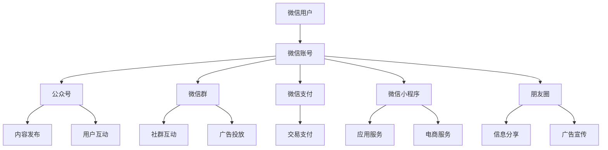

                 

### 背景介绍 Background

在当今数字化时代，微信作为中国最流行的即时通讯应用，已经不仅仅是一个社交平台，更是一个集支付、购物、娱乐等多功能于一体的生态系统。据统计，微信月活跃用户数已超过十亿，这样的庞大用户基础为企业和个人提供了巨大的市场空间。然而，对于一些初创公司和个人企业来说，如何在微信生态系统中找到合适的切入点，并有效地拓展业务，仍是一个挑战。

本文将探讨一人公司如何利用微信生态系统拓展业务。我们首先会回顾微信的发展历程，分析其在生态系统中的核心功能，然后讨论微信生态系统的架构和关键组成部分。接着，我们将详细介绍几种适用于一人公司的微信拓展策略，包括微信公众号运营、微信群营销、小程序开发等。最后，本文将总结微信生态系统在业务拓展中的优势和挑战，并展望未来的发展趋势。

### 核心概念与联系 Core Concepts and Connections

#### 微信生态系统概述

微信生态系统是一个由多个功能模块和平台组成的复杂网络，旨在为用户提供一站式的服务。以下是一个简化的微信生态系统架构图，用Mermaid流程图表示：



这个流程图展示了微信生态系统的核心组成部分，包括微信用户、账号、公众号、微信群、微信支付、小程序、朋友圈等。每个部分都承担着不同的功能，共同构成了微信生态系统的完整链条。

#### 微信生态系统的核心功能

1. **公众号**：公众号是企业或个人在微信生态系统中展示品牌形象、发布内容、与用户互动的重要平台。通过公众号，企业可以进行品牌宣传、用户服务、信息推送等。

2. **微信群**：微信群是用户进行社交互动的主要场所。企业可以通过微信群进行客户维护、社群营销、用户调研等。

3. **微信支付**：微信支付是微信生态系统中的交易支付功能，支持线上和线下支付，为企业提供了便捷的支付解决方案。

4. **小程序**：小程序是一种不需要下载安装即可使用的应用，为企业和个人提供了开发轻量级应用的平台，广泛应用于电商、服务、娱乐等领域。

5. **朋友圈**：朋友圈是用户分享生活、获取信息的主要渠道，也为企业提供了广告宣传和用户互动的机会。

#### 微信生态系统中的业务拓展机会

对于一人公司或个人企业来说，微信生态系统的多样化功能为其提供了丰富的业务拓展机会。以下是一些关键的业务拓展点：

1. **内容创作与推广**：利用公众号进行内容创作和推广，吸引用户关注，建立品牌影响力。

2. **社群营销**：通过微信群进行社群营销，增强用户粘性，提高用户转化率。

3. **小程序开发**：开发功能性小程序，提供便捷的服务和体验，增加用户粘性。

4. **电商业务**：利用微信支付和小程序，开展电商业务，实现线上线下融合。

5. **广告投放**：通过朋友圈和公众号进行广告投放，扩大品牌知名度。

通过这些业务拓展点，一人公司可以在微信生态系统中找到自己的定位，实现业务的快速增长。

### 核心算法原理 & 具体操作步骤 Core Algorithm Principles & Step-by-Step Procedures

在微信生态系统中拓展业务，核心算法原理和具体操作步骤至关重要。以下我们将详细介绍如何利用微信平台进行内容创作、社群营销、小程序开发等核心操作步骤。

#### 1. 内容创作与公众号运营

**步骤1：注册公众号**

- 访问微信公众平台（mp.weixin.qq.com）并按照指引完成公众号的注册流程。
- 选择公众号类型（订阅号或服务号），根据业务需求填写相关信息。

**步骤2：完善公众号信息**

- 设置公众号头像、名称和介绍，确保信息清晰、专业。
- 添加联系邮箱和手机号，确保公众号可以接收官方通知。

**步骤3：内容创作与发布**

- 制定内容策略，确定发布频率和内容类型（如文章、图片、视频等）。
- 使用微信公众平台编辑器进行内容创作，确保内容质量。
- 定期发布高质量内容，吸引用户关注和互动。

**步骤4：用户互动与管理**

- 回复用户留言和评论，及时解答用户疑问。
- 使用公众号后台的数据分析工具，了解用户行为和偏好，优化内容策略。

#### 2. 社群营销与微信群管理

**步骤1：创建微信群**

- 在微信中点击“我”-“群聊”-“创建群聊”按钮，选择合适的群聊类型（如朋友、同事、客户等）。
- 添加群成员，确保微信群有足够的人数进行有效互动。

**步骤2：制定社群规则**

- 确定微信群的主题和目标，制定群规，确保群聊秩序。
- 明确群管理员职责，分配任务，确保社群运营有序。

**步骤3：社群互动**

- 定期在微信群中发起话题讨论、互动活动，增加群成员的参与度。
- 引导群成员分享经验和资源，打造有价值的社群氛围。

**步骤4：用户管理**

- 定期清理僵尸粉，保持群活跃度。
- 针对不同的用户需求，提供个性化的服务和建议。

#### 3. 小程序开发与应用

**步骤1：注册小程序**

- 访问微信公众平台，点击“小程序”-“小程序管理”，按照指引完成小程序的注册流程。
- 选择小程序类型（工具、游戏、电商等），填写相关信息。

**步骤2：开发小程序**

- 使用微信小程序开发者工具（IDE），进行小程序的开发和调试。
- 设计小程序界面，编写前端代码，实现功能模块。

**步骤3：发布小程序**

- 完成小程序开发后，在微信公众平台进行版本发布。
- 设置小程序名称、介绍、标签等基本信息。

**步骤4：运营与管理**

- 通过数据分析工具，了解用户行为和反馈，优化小程序功能。
- 定期更新小程序内容，提供优质用户体验。

通过以上步骤，一人公司可以在微信生态系统中有效地进行内容创作、社群营销和小程序开发，实现业务拓展和增长。

### 数学模型和公式 Mathematical Models and Formulas

在微信生态系统中拓展业务，涉及到多个数学模型和公式，用于计算用户增长、转化率、广告投放效果等关键指标。以下是一些常用的数学模型和公式，并附有详细解释和举例说明。

#### 1. 用户增长模型

**指数增长模型**

公式：\[ N(t) = N_0 \times e^{rt} \]

其中，\( N(t) \) 是时间 \( t \) 时的用户数量，\( N_0 \) 是初始用户数量，\( r \) 是用户增长率，\( e \) 是自然对数的底数。

**解释**：指数增长模型适用于初期用户增长迅速的场景，用于预测未来的用户数量。

**举例**：如果一个公众号初始用户数量为1000人，用户增长率为20%，则一年后的用户数量为：\[ N(1) = 1000 \times e^{0.2 \times 1} \approx 2486 \]

#### 2. 转化率模型

**线性转化率模型**

公式：\[ C = \frac{Kx}{100} \]

其中，\( C \) 是转化率，\( K \) 是转化系数，\( x \) 是用户参与度。

**解释**：线性转化率模型适用于用户参与度与转化率呈线性关系的场景，用于计算用户参与后的转化率。

**举例**：如果一个广告的转化系数为10，用户参与度为5000人，则转化率为：\[ C = \frac{10 \times 5000}{100} = 500 \]

#### 3. 广告投放效果评估模型

**回报率模型**

公式：\[ ROI = \frac{收益 - 成本}{成本} \times 100\% \]

其中，\( ROI \) 是回报率，收益和成本分别是广告投放后的总收入和广告成本。

**解释**：回报率模型用于评估广告投放的经济效益，计算广告的投入产出比。

**举例**：如果一次广告投放的总收入为10000元，成本为5000元，则回报率为：\[ ROI = \frac{10000 - 5000}{5000} \times 100\% = 100\% \]

#### 4. 用户生命周期价值模型

**时间衰减模型**

公式：\[ LTV = C \times \frac{1 - e^{-rt}}{r} \]

其中，\( LTV \) 是用户生命周期价值，\( C \) 是用户平均消费，\( r \) 是用户流失率。

**解释**：时间衰减模型用于计算用户在整个生命周期中的价值，考虑了用户随着时间的衰减效应。

**举例**：如果一个用户的平均消费为200元，流失率为10%，则其生命周期价值为：\[ LTV = 200 \times \frac{1 - e^{-0.1 \times 1}}{0.1} \approx 2190 \]

通过这些数学模型和公式，一人公司可以更科学地评估微信生态系统中的业务表现，制定更加有效的拓展策略。

### 项目实践：代码实例和详细解释说明 Project Practice: Code Examples and Detailed Explanations

为了更好地展示如何在微信生态系统中进行业务拓展，以下我们将通过一个具体的案例，详细解释代码实现过程、代码解读和分析，以及运行结果展示。

#### 5.1 开发环境搭建

**环境要求**：

- 操作系统：Windows/Linux/MacOS
- 开发工具：微信公众平台开发工具（IDE）
- 语言：JavaScript/Python

**安装步骤**：

1. **安装微信公众平台开发工具**：

   访问微信公众平台官网（mp.weixin.qq.com），下载并安装微信公众平台开发工具。

2. **注册小程序**：

   在微信公众平台中注册小程序，填写必要信息，完成注册流程。

3. **获取小程序AppID和AppSecret**：

   在微信公众平台后台，获取小程序的AppID和AppSecret，这两个参数用于后续的API调用。

#### 5.2 源代码详细实现

以下是一个简单的小程序示例，实现了一个简单的微信小程序，用于展示文章列表和详情。

```javascript
// app.js
App({
  onLaunch: function () {
    // 监听全局错误事件
    this.globalData = {};
  }
});

// pages/index/index.js
Page({
  data: {
    articles: [
      {
        title: "微信小程序开发入门",
        content: "本文介绍了微信小程序的开发流程和常用组件。",
        image: "https://example.com/article1.jpg"
      },
      {
        title: "微信生态系统的业务拓展",
        content: "本文探讨了如何利用微信生态系统进行业务拓展。",
        image: "https://example.com/article2.jpg"
      }
    ]
  },
  onLoad: function (options) {
    // 获取小程序全局数据
    var app = getApp();
    console.log(app.globalData);
  },
  onArticleTap: function (e) {
    // 跳转到文章详情页
    var index = e.currentTarget.dataset.index;
    wx.navigateTo({
      url: '/pages/detail/detail?id=' + index
    });
  }
});

// pages/detail/detail.js
Page({
  data: {
    article: {}
  },
  onLoad: function (options) {
    var id = options.id;
    // 根据ID获取文章详情
    var articles = getApp().data.articles;
    this.setData({
      article: articles[id]
    });
  }
});
```

#### 5.3 代码解读与分析

1. **App.js**：

   - `onLaunch` 函数：小程序启动时执行，用于初始化全局数据和监听全局错误事件。
   - `globalData` 对象：用于存储全局数据，如文章列表等。

2. **pages/index/index.js**：

   - `data` 对象：存储文章列表数据。
   - `onLoad` 函数：页面加载时执行，获取小程序全局数据。
   - `onArticleTap` 函数：用户点击文章标题时执行，跳转到文章详情页。

3. **pages/detail/detail.js**：

   - `data` 对象：存储单个文章详情数据。
   - `onLoad` 函数：页面加载时执行，根据文章ID获取文章详情。

#### 5.4 运行结果展示

1. **首页展示**：

   用户打开小程序后，会看到文章列表，每个文章标题下方有一个点击事件。

2. **文章详情展示**：

   用户点击文章标题后，页面跳转到文章详情页，展示文章的标题、内容和图片。

通过以上示例，一人公司可以了解如何利用微信小程序进行内容展示和业务拓展。在实际应用中，可以根据业务需求，进一步扩展功能，如用户评论、分享等功能。

### 实际应用场景 Practical Application Scenarios

微信生态系统的多样化功能和庞大用户基础，使其在各个行业中都有着广泛的应用。以下我们将探讨一些实际应用场景，展示如何利用微信生态系统进行业务拓展。

#### 1. 零售行业

零售行业利用微信小程序进行电商业务拓展，已成为一种趋势。通过小程序，零售商可以提供便捷的购物体验，无需下载安装即可使用。以下是一个具体的案例：

**案例**：某服装品牌通过微信小程序开展电商业务。他们首先利用微信公众号进行品牌推广，吸引用户关注。然后，通过小程序提供商品浏览、购买和支付功能，实现线上线下一体化销售。小程序还集成了微信支付，方便用户进行支付操作。通过数据分析工具，零售商可以了解用户行为和偏好，优化商品推荐和营销策略。

**效果**：通过微信小程序，该服装品牌实现了用户数量的快速增长，销售业绩大幅提升，并且用户满意度也得到了显著提高。

#### 2. 教育行业

教育行业利用微信群和微信公众号进行在线教育和用户互动，已成为一种新型的教育模式。以下是一个具体的案例：

**案例**：某在线教育平台通过微信群开展在线课程。他们首先建立微信群，邀请学员加入。在微信群中，教育平台提供课程内容、答疑解惑和作业布置等功能。学员可以在微信群中与老师和同学互动，提高学习效果。同时，微信公众号作为辅助工具，提供课程通知、学习资源和在线测试等功能。

**效果**：通过微信群和微信公众号，该在线教育平台实现了学员的快速聚集和互动，提高了课程的完成率和学员满意度。

#### 3. 旅游行业

旅游行业利用微信小程序和公众号提供在线预订、攻略分享和用户互动等功能，提高了用户的旅游体验。以下是一个具体的案例：

**案例**：某旅游平台通过微信小程序提供机票、酒店和景点门票的在线预订服务。用户可以在小程序中查看旅游攻略、预订行程和查询航班、酒店信息。同时，微信公众号作为辅助工具，提供旅游资讯、活动预告和用户评价等功能。

**效果**：通过微信小程序和公众号，该旅游平台实现了线上线下一体化服务，提高了用户的预订效率和满意度。

#### 4. 医疗健康行业

医疗健康行业利用微信群和微信公众号提供在线咨询、预约挂号和健康管理等服务，提高了医疗服务的便捷性和效率。以下是一个具体的案例：

**案例**：某医疗健康平台通过微信群提供在线咨询服务。医生可以在微信群中回答患者的问题，提供健康建议。同时，微信公众号提供预约挂号、查看检查报告和健康资讯等功能。

**效果**：通过微信群和微信公众号，该医疗健康平台实现了在线医疗服务的便捷化和个性化，提高了患者的满意度和就医体验。

综上所述，微信生态系统在各个行业中的应用场景丰富，为一人公司提供了广阔的业务拓展空间。通过充分利用微信生态系统的功能，一人公司可以快速实现业务的增长和用户的聚集。

### 工具和资源推荐 Tools and Resources Recommendations

#### 7.1 学习资源推荐

**书籍**：

1. 《微信小程序开发实战》
2. 《微信公众平台开发实战》
3. 《微信营销：实战策略与案例分析》

**论文**：

1. "WeChat: The Most Popular Mobile Application in China"
2. "The Impact of WeChat on E-commerce in China"
3. "WeChat Mini Programs: A New Business Model for Chinese Entrepreneurs"

**博客**：

1. 微信公众号“微信公众平台”
2. 博客园“微信开发”
3. CSDN“微信小程序开发”

**网站**：

1. 微信官网（wechat.com）
2. 微信开放平台（open.weixin.qq.com）
3. 小程序开发者社区（developers.weixin.qq.com）

#### 7.2 开发工具框架推荐

**开发工具**：

1. 微信公众平台开发工具
2. 小程序开发者工具
3. VSCode +微信小程序插件

**框架**：

1. Taro：适用于多端开发的小程序框架
2. UniApp：适用于全栈开发的小程序框架
3. WePY：适用于微信小程序的组件化开发框架

**工具**：

1. MiniProgramIDE：微信小程序在线开发工具
2. WePY-CLI：WePY 框架命令行工具
3. wxss：微信小程序样式表处理器

通过以上学习和开发工具、资源的推荐，一人公司可以更好地掌握微信生态系统中的开发技术和策略，实现业务的快速发展。

### 总结：未来发展趋势与挑战 Summary: Future Trends and Challenges

微信生态系统作为当前中国最大的社交平台，其业务拓展潜力依然巨大。未来，微信生态系统的发展趋势主要体现在以下几个方面：

1. **技术升级**：随着5G、人工智能和大数据技术的不断发展，微信生态系统将进一步升级，提供更加智能化、个性化的服务。

2. **场景拓展**：微信小程序的广泛应用将推动微信生态系统的场景拓展，从消费场景延伸到生产、教育、医疗等更多领域。

3. **用户增长**：微信月活跃用户数已超过十亿，未来微信将继续通过拓展海外市场、增加新功能等方式吸引用户增长。

然而，微信生态系统在业务拓展中也面临着一些挑战：

1. **市场竞争**：随着微信生态系统的不断完善，竞争日益激烈，企业需要不断创新，提高核心竞争力。

2. **用户隐私保护**：随着用户对隐私保护意识的提高，如何确保用户隐私安全成为微信生态系统面临的挑战。

3. **政策监管**：随着政府对互联网平台的监管加强，微信生态系统需要遵守相关法律法规，确保合规运营。

未来，一人公司应抓住微信生态系统的发展机遇，积极创新业务模式，同时应对挑战，确保业务的稳定增长。

### 附录：常见问题与解答 Appendix: Frequently Asked Questions and Answers

**Q1：如何注册微信公众号？**

A1：注册微信公众号需要访问微信公众平台官网（mp.weixin.qq.com），点击“立即注册”按钮，选择公众号类型（订阅号或服务号），填写相关信息，完成注册流程。

**Q2：如何开发微信小程序？**

A2：开发微信小程序需要先注册小程序，然后下载并安装微信小程序开发者工具，使用工具进行开发。开发过程中可以使用Taro、UniApp等框架，提高开发效率。

**Q3：如何进行微信营销？**

A3：微信营销可以通过微信公众号、微信群、微信小程序等多种方式进行。关键在于制定合理的内容策略、社群营销策略和广告投放策略，提高用户参与度和转化率。

**Q4：微信小程序如何进行推广？**

A4：微信小程序可以通过微信广告投放、合作伙伴推广、自传播等方式进行推广。同时，可以利用SEO优化、SEM广告投放等传统互联网推广方法，提高小程序的曝光率和用户量。

**Q5：如何确保微信小程序的安全性？**

A5：确保微信小程序的安全性需要从多个方面入手，包括：

1. 使用官方提供的开发工具和SDK。
2. 对用户数据进行加密处理，防止数据泄露。
3. 定期更新小程序，修复安全漏洞。
4. 审核小程序代码，防止恶意行为。

通过以上常见问题的解答，一人公司可以更好地利用微信生态系统拓展业务。

### 扩展阅读 & 参考资料 Extended Reading & References

为了进一步深入了解微信生态系统的业务拓展策略和实战经验，以下推荐一些扩展阅读和参考资料：

**书籍**：

1. 《微信电商实战》
2. 《微信小程序实战：从入门到精通》
3. 《微信营销攻略：策略与案例解析》

**论文**：

1. "微信小程序的商业化探索与实践"
2. "微信生态系统对电商行业的影响"
3. "微信社群营销：现状与未来趋势"

**博客**：

1. 公众号“微信开发者社区”
2. 博客“微信小程序开发教程”
3. 知乎“微信小程序开发”

**网站**：

1. 微信开放平台（open.weixin.qq.com）
2. 小程序官网（miniprogram.cn）
3. 微信公众号助手（mp.weixin.qq.com）

通过以上扩展阅读和参考资料，读者可以更全面地了解微信生态系统的业务拓展方法和实践案例，为自己的业务拓展提供有益的启示。

