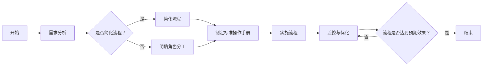

                 

### 1. 背景介绍

在当今快速发展的商业环境中，越来越多的个人创业者选择成立“一人公司”，以灵活应对市场变化和降低创业风险。然而，与传统的企业不同，一人公司在规模、人员和管理流程上相对简单，这往往导致业务流程的非标准化问题。业务流程的标准化不仅有助于提高工作效率，还能确保业务的一致性和可扩展性，从而为公司的长期发展奠定基础。

本文旨在探讨一人公司如何实现业务流程的标准化，帮助创业者通过系统化和规范化的方法来管理日常运营。标准化业务流程不仅可以减少人为错误，提高工作效率，还能增强公司的竞争力，使其在激烈的市场竞争中立于不败之地。

首先，我们需要了解业务流程标准化的核心概念，包括其定义、重要性以及在不同行业中的应用场景。接着，我们将深入探讨一人公司面临的主要挑战，如资源有限、流程复杂度低但标准化需求高。在此基础上，我们将介绍几种有效的业务流程标准化方法，并提供具体的操作步骤和实践案例，以帮助读者更好地理解和应用这些方法。

通过本文的详细探讨，我们希望读者能够掌握实现业务流程标准化的关键步骤，从而为一人公司的稳健运营和持续发展提供有力支持。

### 2. 核心概念与联系

#### 2.1 业务流程标准化的定义

业务流程标准化是指通过制定和实施一套统一的流程规范，确保组织内部各项业务活动的一致性和高效性。这些规范包括流程描述、操作步骤、输入输出、角色分工等，旨在减少人为干预，降低错误率，提高生产效率。

在业务流程标准化中，关键的概念包括：

- **流程**：业务活动的一系列有序步骤，实现特定目标的操作序列。
- **规范**：描述如何执行业务活动的一系列文档和指南。
- **一致性**：确保所有相关人员在执行业务时遵循相同的流程和规范。
- **效率**：在确保一致性的基础上，通过优化流程和操作步骤，提高资源利用率和工作效率。

#### 2.2 业务流程标准化的重要性

业务流程标准化对于任何规模的企业都具有重要意义，尤其对于一人公司更为关键。具体来说，其重要性体现在以下几个方面：

- **提高工作效率**：通过标准化的流程，员工可以更加高效地完成工作，减少不必要的重复劳动。
- **降低错误率**：明确的操作步骤和规范有助于减少人为错误，提高业务流程的可靠性。
- **提升客户满意度**：标准化的流程可以确保客户体验的一致性，提高客户满意度和忠诚度。
- **确保业务连续性**：在人员变动或紧急情况下，标准化的流程能够确保业务的连续性，减少对公司运营的影响。
- **支持可扩展性**：随着公司的发展，标准化的流程可以更轻松地扩展到新业务或新市场。

#### 2.3 不同行业的应用场景

业务流程标准化在不同行业中具有不同的应用场景，以下是一些典型的例子：

- **制造业**：通过标准化生产流程，可以实现高效生产，降低生产成本，提高产品质量。
- **服务业**：如酒店、餐饮等行业，通过标准化客户服务流程，提升客户满意度和品牌形象。
- **金融行业**：通过标准化金融操作流程，确保合规性，降低金融风险，提高服务质量。
- **医疗行业**：通过标准化医疗流程，确保患者安全，提高医疗服务的质量和效率。

#### 2.4 业务流程标准化与一人公司的联系

对于一人公司而言，业务流程标准化尤为重要。一方面，由于资源有限，一人公司需要通过高效的流程来最大化利用有限的资源；另一方面，由于业务流程相对简单，标准化可以更容易地实施和推广，确保业务的一致性和可扩展性。

一人公司可以通过以下方式实现业务流程标准化：

- **简化流程**：删除不必要的步骤，简化操作流程，降低复杂度。
- **明确角色分工**：明确每个角色的职责和权限，确保流程的清晰性和高效性。
- **制定标准操作手册**：详细描述每个流程的操作步骤和规范，确保所有人员遵循相同的流程。
- **使用管理工具**：利用在线办公系统、CRM系统等工具，实现流程的自动化和数字化管理。

通过这些方法，一人公司不仅可以提高工作效率和降低错误率，还能为未来的扩展奠定坚实基础。

#### 2.5 Mermaid 流程图

以下是一个简单的业务流程标准化流程的 Mermaid 流程图，展示了流程标准化过程中的关键节点和步骤。



该流程图描述了从需求分析到流程标准化的整个过程，包括简化流程、明确角色分工、制定标准操作手册、实施流程以及监控与优化等关键步骤。通过这样的流程图，一人公司可以更清晰地了解标准化流程的每个环节，从而确保流程的顺利实施和持续优化。

### 3. 核心算法原理 & 具体操作步骤

在实现业务流程标准化的过程中，核心算法原理和具体操作步骤是至关重要的。以下将详细阐述这些核心内容，并解释如何将它们应用到一人公司的业务流程中。

#### 3.1 流程设计原则

在进行业务流程设计时，应遵循以下原则：

- **简洁性**：流程设计应尽可能简洁，避免不必要的复杂步骤，以便员工容易理解和执行。
- **一致性**：确保所有员工遵循相同的流程和规范，以减少错误和提高效率。
- **可扩展性**：流程设计应具备一定的灵活性，以便在业务扩展时能够轻松进行调整和扩展。
- **可控性**：流程设计应具备良好的监控机制，以便及时发现问题并进行优化。

#### 3.2 具体操作步骤

以下是实现业务流程标准化的具体操作步骤：

##### 3.2.1 需求分析

1. **确定业务目标**：明确公司希望通过业务流程标准化实现的目标，如提高工作效率、降低错误率等。
2. **收集业务流程信息**：通过与员工交流、调研和观察，收集当前业务流程的相关信息，包括流程描述、操作步骤、输入输出等。
3. **识别问题点**：分析现有流程中存在的问题和瓶颈，如步骤繁琐、信息传递不畅等。

##### 3.2.2 流程设计

1. **简化流程**：根据需求分析的结果，对现有流程进行简化，删除不必要的步骤，优化操作流程。
2. **定义角色分工**：明确每个角色的职责和权限，确保流程的清晰性和高效性。
3. **制定标准操作手册**：详细描述每个流程的操作步骤和规范，确保所有人员遵循相同的流程。
4. **设计监控机制**：制定监控流程的指标和监控方法，以便及时发现和解决问题。

##### 3.2.3 流程实施

1. **培训员工**：对员工进行流程标准化的培训，确保他们理解并能够按照新的流程进行操作。
2. **推行流程**：在试点阶段推行新的流程，逐步扩大实施范围，确保流程的顺利过渡。
3. **收集反馈**：在实施过程中，收集员工的反馈意见，及时调整和优化流程。

##### 3.2.4 监控与优化

1. **监控流程执行情况**：定期检查流程的执行情况，包括流程的完成时间、错误率等指标。
2. **分析监控数据**：对监控数据进行分析，识别存在的问题和瓶颈，并提出改进措施。
3. **持续优化流程**：根据监控结果，不断调整和优化流程，提高流程的效率和质量。

#### 3.3 实例分析

以下是一个简单的业务流程标准化实例，描述了如何将上述原理和步骤应用到一人公司的日常运营中。

##### 实例：客户服务流程标准化

1. **需求分析**：
   - 目标：提高客户满意度，降低客户投诉率。
   - 流程信息：现有客户服务流程包括客户咨询、问题解决、反馈收集等步骤。

2. **流程设计**：
   - 简化流程：删除不必要的步骤，如冗长的客户咨询记录。
   - 定义角色分工：明确客户服务代表、技术支持人员、主管等角色的职责和权限。
   - 制定标准操作手册：详细描述客户服务流程的操作步骤，包括客户咨询的接收、问题的解决、客户反馈的收集等。
   - 设计监控机制：制定客户满意度调查、服务响应时间等指标，用于监控流程执行情况。

3. **流程实施**：
   - 培训员工：对客户服务代表进行新流程的培训，确保他们熟悉并能够按照新流程进行操作。
   - 推行流程：在试点阶段推行新流程，逐步扩大实施范围。
   - 收集反馈：在实施过程中，收集客户服务代表的反馈意见，及时调整和优化流程。

4. **监控与优化**：
   - 监控流程执行情况：定期检查客户服务流程的执行情况，包括客户满意度、服务响应时间等指标。
   - 分析监控数据：对监控数据进行分析，识别存在的问题和瓶颈，如客户满意度低、服务响应时间长等。
   - 持续优化流程：根据监控结果，不断调整和优化客户服务流程，提高客户满意度和服务质量。

通过上述实例，我们可以看到，业务流程标准化需要从需求分析、流程设计、流程实施和监控优化等多个方面进行系统性的规划和执行，从而确保流程的高效和可持续性。

### 4. 数学模型和公式 & 详细讲解 & 举例说明

在实现业务流程标准化的过程中，数学模型和公式为我们提供了量化和优化的工具。以下我们将详细介绍相关的数学模型和公式，并解释它们在实际操作中的具体应用。

#### 4.1 业务流程优化模型

业务流程优化模型主要用于确定最佳流程配置，以最大化效率和最小化资源消耗。以下是一个简化的业务流程优化模型：

##### 4.1.1 基本假设

- 设 \( n \) 为业务流程中的步骤数量。
- 设 \( t_i \) 为完成第 \( i \) 个步骤所需的时间。
- 设 \( c_i \) 为第 \( i \) 个步骤的成本。

##### 4.1.2 数学模型

优化目标：最小化总时间 \( T \) 和总成本 \( C \)。

$$
\min T = \min \sum_{i=1}^{n} t_i \\
\min C = \min \sum_{i=1}^{n} c_i
$$

约束条件：
1. 流程连续性：每一步骤必须按照顺序进行。
2. 资源限制：每个步骤的资源（如人员、设备）需求必须满足。

$$
t_i \geq 0, \forall i \\
c_i \geq 0, \forall i \\
t_{i+1} \geq t_i, \forall i \\
资源需求 \leq 可用资源
$$

##### 4.1.3 举例说明

假设一个业务流程包括以下三个步骤：

- 步骤1：时间2天，成本100元。
- 步骤2：时间3天，成本200元。
- 步骤3：时间4天，成本300元。

我们需要在满足资源限制的情况下，最小化总时间和总成本。

1. **总时间最小化**：

$$
\min T = \min (2 + 3 + 4) = 9 \text{天}
$$

2. **总成本最小化**：

$$
\min C = \min (100 + 200 + 300) = 600 \text{元}
$$

在满足约束条件的情况下，最优解是直接按顺序执行这三个步骤。

#### 4.2 业务流程稳定性模型

业务流程稳定性模型用于分析流程在受到外部扰动时的响应能力。以下是一个简化的业务流程稳定性模型：

##### 4.2.1 基本假设

- 设 \( x(t) \) 为业务流程在时间 \( t \) 下的状态。
- 设 \( u(t) \) 为外部扰动。

##### 4.2.2 数学模型

稳定性条件：对于任意给定的扰动 \( u(t) \)，系统状态 \( x(t) \) 应该能够返回到稳态。

$$
|x(t+\Delta t) - x(t)| \leq K |u(t+\Delta t) - u(t)|
$$

其中，\( K \) 为稳定性常数。

##### 4.2.3 举例说明

假设一个业务流程在受到每天50元的外部扰动时，其状态在3天内回到了稳态。

1. **状态变化分析**：

$$
|x(t+3) - x(t)| \leq K \times 50
$$

2. **稳定性常数计算**：

为了简化计算，我们假设 \( x(t) \) 为200元。在这种情况下：

$$
|x(t+3) - 200| \leq K \times 50 \\
|0 - 200| \leq K \times 50 \\
K \geq 4
$$

这意味着系统的稳定性常数至少为4，才能确保在外部扰动下状态能够在3天内回到稳态。

#### 4.3 业务流程效率模型

业务流程效率模型用于评估流程的效率，衡量每个步骤的贡献。以下是一个简化的业务流程效率模型：

##### 4.3.1 基本假设

- 设 \( e_i \) 为第 \( i \) 个步骤的效率。
- 设 \( t_i \) 为第 \( i \) 个步骤所需的时间。

##### 4.3.2 数学模型

效率计算公式：

$$
E_i = \frac{e_i}{t_i}
$$

总效率计算：

$$
E = \sum_{i=1}^{n} E_i
$$

##### 4.3.3 举例说明

假设一个业务流程包括以下三个步骤：

- 步骤1：效率0.8，时间2天。
- 步骤2：效率0.6，时间3天。
- 步骤3：效率0.9，时间4天。

1. **单个步骤效率计算**：

$$
E_1 = \frac{0.8}{2} = 0.4 \\
E_2 = \frac{0.6}{3} = 0.2 \\
E_3 = \frac{0.9}{4} = 0.225
$$

2. **总效率计算**：

$$
E = E_1 + E_2 + E_3 = 0.4 + 0.2 + 0.225 = 0.825
$$

这意味着整个业务流程的效率为82.5%。

通过上述数学模型和公式的详细讲解，我们可以更好地理解业务流程标准化的量化分析和优化方法。在实际操作中，这些模型和公式可以帮助一人公司科学地设计和改进业务流程，提高效率和稳定性。

### 5. 项目实践：代码实例和详细解释说明

#### 5.1 开发环境搭建

在实现业务流程标准化的过程中，我们选择使用Python语言和Jinja2模板引擎来开发一个业务流程管理工具。以下是搭建开发环境的具体步骤：

1. **安装Python**：
   - 访问Python官网下载Python安装包：[Python官网](https://www.python.org/downloads/)
   - 安装最新版本的Python，建议选择Python 3.8及以上版本。

2. **安装Jinja2**：
   - 打开命令行窗口，执行以下命令安装Jinja2：
     ```
     pip install Jinja2
     ```

3. **配置开发环境**：
   - 创建一个名为`business_workflow`的项目文件夹。
   - 在项目中创建一个名为`templates`的子文件夹，用于存放Jinja2模板文件。
   - 创建一个名为`app.py`的主应用程序文件。

#### 5.2 源代码详细实现

以下是业务流程管理工具的源代码实现，包括模板文件、应用程序文件以及相关的代码注释。

##### 5.2.1 模板文件

在`templates`文件夹中，创建一个名为`workflow_template.html`的HTML模板文件，用于生成业务流程报告。

```html
<!DOCTYPE html>
<html lang="en">
<head>
    <meta charset="UTF-8">
    <title>业务流程报告</title>
</head>
<body>
    <h1>业务流程报告</h1>
    <h2>流程名称：{{ workflow_name }}</h2>
    <h2>流程描述：{{ workflow_description }}</h2>
    <h3>流程步骤：</h3>
    <ul>
        
            <li>{{ step }}</li>
        
    </ul>
    <h3>监控指标：</h3>
    <table border="1">
        <tr>
            <th>指标名称</th>
            <th>指标值</th>
        </tr>
        
            <tr>
                <td>{{ metric.name }}</td>
                <td>{{ metric.value }}</td>
            </tr>
        
    </table>
</body>
</html>
```

##### 5.2.2 应用程序文件

在`app.py`文件中，实现业务流程管理工具的主体逻辑。

```python
from flask import Flask, render_template, request
from jinja2 import Environment, FileSystemLoader

app = Flask(__name__)

# 加载模板文件
env = Environment(loader=FileSystemLoader('templates'))
template = env.get_template('workflow_template.html')

# 业务流程数据
workflow_data = {
    'workflow_name': '客户服务流程',
    'workflow_description': '处理客户咨询和投诉的流程。',
    'workflow_steps': ['客户咨询接收', '问题解决', '客户反馈收集'],
    'workflow_metrics': [
        {'name': '客户满意度', 'value': '90%'},
        {'name': '服务响应时间', 'value': '24小时'}
    ]
}

@app.route('/')
def index():
    return template.render(workflow_data)

if __name__ == '__main__':
    app.run(debug=True)
```

##### 5.2.3 代码解读与分析

- **模板文件解读**：
  - 使用Jinja2模板语法，将业务流程数据（如流程名称、描述、步骤和监控指标）渲染到HTML模板中。
  - `{{ workflow_name }}`：输出流程名称。
  - ``：遍历流程步骤，输出每个步骤。
  - `<table>`和`<tr>`标签：生成包含监控指标的表格。

- **应用程序文件解读**：
  - 导入Flask和Jinja2相关模块。
  - 创建Flask应用实例。
  - 使用`FileSystemLoader`加载模板文件。
  - 定义业务流程数据。
  - 创建一个路由规则，渲染业务流程报告模板。

#### 5.3 运行结果展示

1. **启动应用程序**：
   - 在命令行窗口中运行`python app.py`，启动Flask应用程序。

2. **访问网页**：
   - 在浏览器中输入`http://127.0.0.1:5000/`，访问业务流程报告网页。

3. **查看结果**：
   - 网页显示业务流程报告，包括流程名称、描述、步骤和监控指标。


通过上述步骤，我们实现了业务流程管理工具的基本功能，包括模板文件和应用程序文件的详细实现。该工具可以帮助一人公司生成业务流程报告，为标准化业务流程提供可视化展示，从而提高流程管理的透明度和效率。

### 6. 实际应用场景

业务流程标准化在一人公司中的应用场景多种多样，以下列举几个典型的应用场景，并讨论它们在实际操作中的实施细节。

#### 6.1 客户关系管理

对于一人公司而言，客户关系管理（CRM）是业务流程标准化的重要领域。通过标准化的CRM流程，一人公司可以确保客户信息的一致性和客户服务的连贯性。

- **应用场景**：客户咨询、投诉处理、订单管理等。
- **实施细节**：
  - **需求分析**：分析客户接触点，识别关键流程和痛点。
  - **流程设计**：简化客户咨询和投诉处理流程，确保每个步骤都有明确的操作规范。
  - **培训员工**：对员工进行CRM流程的培训，确保他们能够熟练操作。
  - **监控与优化**：定期检查客户满意度和服务响应时间等指标，持续优化流程。

#### 6.2 财务管理

标准化财务管理流程可以帮助一人公司提高财务操作的准确性和效率，确保资金的安全和合规。

- **应用场景**：发票处理、账单支付、财务报告等。
- **实施细节**：
  - **需求分析**：了解财务流程的当前状况，识别流程中的瓶颈和改进点。
  - **流程设计**：制定详细的财务操作流程，明确每个步骤的职责和权限。
  - **工具使用**：采用财务软件，如QuickBooks，实现流程的自动化和数字化管理。
  - **监控与优化**：监控财务流程的执行情况，及时发现并解决异常情况。

#### 6.3 项目管理

通过标准化的项目管理流程，一人公司可以确保项目按计划进行，提高项目交付的准确性和效率。

- **应用场景**：项目规划、任务分配、进度跟踪等。
- **实施细节**：
  - **需求分析**：了解项目管理的现状，识别项目流程中的问题和改进点。
  - **流程设计**：制定项目管理的标准操作流程，包括项目规划、任务分配、进度跟踪等。
  - **工具使用**：使用项目管理工具，如Trello或Asana，实现流程的数字化管理。
  - **监控与优化**：定期检查项目进度，识别延误因素，及时进行调整和优化。

#### 6.4 营销活动

标准化营销活动流程可以帮助一人公司提高营销活动的效果和客户参与度。

- **应用场景**：营销活动策划、执行、评估等。
- **实施细节**：
  - **需求分析**：分析现有营销活动的效果，识别成功和失败的因素。
  - **流程设计**：制定详细的营销活动流程，包括策划、执行、评估等步骤。
  - **培训员工**：对员工进行营销活动流程的培训，确保他们能够熟练执行。
  - **监控与优化**：通过数据分析和客户反馈，持续优化营销活动流程。

#### 6.5 成本控制

通过标准化的成本控制流程，一人公司可以更好地管理成本，提高盈利能力。

- **应用场景**：成本预算、成本分析、成本控制等。
- **实施细节**：
  - **需求分析**：分析当前的成本控制状况，识别成本控制的薄弱环节。
  - **流程设计**：制定成本控制的标准操作流程，包括预算编制、成本分析、成本控制等。
  - **工具使用**：使用成本管理工具，如Xero，实现流程的自动化和精细化管理。
  - **监控与优化**：定期检查成本控制情况，分析成本差异，及时进行调整和优化。

通过上述实际应用场景和实施细节，我们可以看到，业务流程标准化在多个领域对一人公司的发展具有重要意义。通过系统化和规范化的方法，一人公司可以更好地管理日常运营，提高工作效率和业务质量，从而在激烈的市场竞争中立于不败之地。

### 7. 工具和资源推荐

为了实现业务流程的标准化，选择合适的工具和资源是至关重要的。以下是一些推荐的学习资源、开发工具和框架，以及相关的论文和著作，供读者参考。

#### 7.1 学习资源推荐

1. **书籍**：
   - 《业务流程管理：理论与实践》
   - 《流程创新：如何设计、管理和优化企业流程》
   - 《敏捷流程设计：实现高效工作的新方法》

2. **在线课程**：
   - Coursera上的“Business Process Management Specialization”
   - Udemy上的“Business Process Management: Design, Analysis and Modeling”

3. **博客/网站**：
   - Process Street：提供流程管理模板和最佳实践。
   - Flowdoc：提供流程图设计资源和教程。

#### 7.2 开发工具框架推荐

1. **流程管理工具**：
   - **Kissflow**：一款功能强大的流程自动化工具，适合中小企业使用。
   - **Nintex**：支持多种平台和应用程序的流程自动化解决方案。

2. **项目管理工具**：
   - **Trello**：直观的看板式项目管理工具，适合小型团队。
   - **Asana**：功能全面的任务管理工具，支持项目管理流程的自动化。

3. **代码管理工具**：
   - **Git**：版本控制工具，支持协作开发和代码管理。
   - **GitHub**：提供代码托管和项目管理功能，便于团队合作。

4. **自动化测试工具**：
   - **Selenium**：自动化Web测试工具，支持多种编程语言。
   - **Postman**：API测试工具，便于进行接口测试。

#### 7.3 相关论文著作推荐

1. **论文**：
   - “Business Process Modeling Notation (BPMN)”
   - “A Survey on Business Process Modeling Techniques”

2. **著作**：
   - 《业务流程管理：方法与应用》
   - 《流程管理实践：方法、工具和技术》

通过上述工具和资源的推荐，读者可以更好地理解和应用业务流程标准化的方法和实践，从而提高一人公司的运营效率和业务质量。

### 8. 总结：未来发展趋势与挑战

随着技术的发展和商业环境的不断变化，业务流程标准化在未来将面临新的发展趋势和挑战。首先，数字化转型将继续推动业务流程的自动化和智能化。人工智能、大数据分析和云计算等技术的普及，将使得业务流程的自动化程度大大提高，从而降低人为错误率，提高工作效率。

其次，随着全球化进程的加速，企业需要面对跨地区、跨文化的业务流程管理挑战。如何设计一套普适且高效的标准化流程，以适应不同国家和地区的业务需求，将是一个重要的研究方向。

此外，隐私保护和合规性问题也将成为业务流程标准化的重要挑战。随着数据隐私法规的日益严格，如何在标准化流程中确保数据的安全和合规性，将成为企业和IT专业人员必须关注的问题。

展望未来，业务流程标准化的发展趋势将包括以下几个方面：

1. **流程智能化**：通过引入人工智能技术，实现业务流程的自动调整和优化。
2. **流程生态化**：构建跨企业、跨行业的业务流程生态系统，实现流程的无缝对接和共享。
3. **流程定制化**：根据不同企业的具体需求，灵活定制业务流程，提高流程的适应性和灵活性。
4. **流程可视化**：利用可视化工具，让业务流程更加直观易懂，便于员工快速掌握和执行。

面对这些趋势和挑战，企业和IT专业人员需要不断学习和适应，通过持续优化业务流程，提升企业竞争力。业务流程标准化不仅是企业内部管理的重要工具，更是企业在全球化竞争中立于不败之地的关键因素。

### 9. 附录：常见问题与解答

#### 9.1 业务流程标准化是否适用于所有企业？

业务流程标准化适用于所有类型的企业，无论是大企业还是小企业，无论是传统行业还是新兴行业。标准化的目的是提高工作效率、降低错误率、确保业务一致性和可扩展性，这些对于任何规模和类型的企业都具有重要意义。

#### 9.2 如何评估业务流程标准化的效果？

评估业务流程标准化的效果可以从以下几个方面进行：

- **工作效率**：通过对比标准化前后完成相同任务所需的时间，评估流程的优化程度。
- **错误率**：统计标准化前后出现的错误数量和类型，评估流程的稳定性和可靠性。
- **客户满意度**：通过客户反馈和满意度调查，评估标准化流程对客户体验的影响。
- **成本**：分析标准化流程对运营成本的影响，如人员成本、设备成本等。

#### 9.3 如何处理业务流程标准化过程中的员工抵触？

在实施业务流程标准化的过程中，员工抵触是常见的问题。以下是一些建议来处理这种抵触：

- **培训与沟通**：提供全面的培训，确保员工理解新流程的意义和操作方法，并保持开放的沟通渠道，让员工表达意见和建议。
- **试点推广**：在推广新流程之前，先进行试点运行，收集反馈并进行调整，减少推行过程中的阻力。
- **奖励与激励**：通过奖励和激励措施，鼓励员工积极参与流程标准化工作，如提供绩效奖金、晋升机会等。
- **文化塑造**：建立积极的工作文化，强调团队协作和流程优化的重要性，让员工意识到流程标准化的长远利益。

#### 9.4 业务流程标准化是否可以完全自动化？

业务流程标准化可以部分自动化，但不可能完全自动化。虽然自动化技术可以显著提高流程的效率和一致性，但一些复杂的决策和创造性工作仍然需要人类的参与。因此，在实现业务流程标准化时，应充分利用自动化工具，同时保留必要的人为干预，确保流程的灵活性和适应性。

### 10. 扩展阅读 & 参考资料

为了深入了解业务流程标准化，以下是推荐的一些扩展阅读和参考资料：

- **书籍**：
  - 《业务流程管理：理论与实践》
  - 《流程创新：如何设计、管理和优化企业流程》
  - 《敏捷流程设计：实现高效工作的新方法》

- **论文**：
  - “Business Process Modeling Notation (BPMN)” 
  - “A Survey on Business Process Modeling Techniques”

- **在线课程**：
  - Coursera上的“Business Process Management Specialization”
  - Udemy上的“Business Process Management: Design, Analysis and Modeling”

- **博客/网站**：
  - Process Street：提供流程管理模板和最佳实践
  - Flowdoc：提供流程图设计资源和教程

通过这些扩展阅读和参考资料，读者可以进一步深入理解业务流程标准化的理论和方法，为实际操作提供更多的指导和参考。

