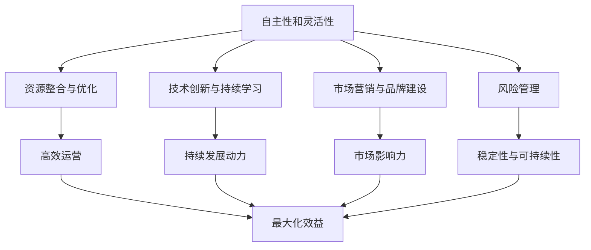

                 

### 背景介绍

在现代商业世界中，“一人公司”这个概念逐渐成为一种新兴的创业模式。所谓“一人公司”，指的是由一个人独资经营的企业。这种模式在灵活性和自主性方面具有明显优势，尤其适合那些追求自由工作方式的创业者。然而，尽管一人公司的运营模式简单直接，但要实现业务的可持续发展，依然面临诸多挑战。

本文旨在探讨一人公司如何通过一系列策略和技术手段，实现业务的长期稳健发展。文章将分为以下几个部分：

1. **核心概念与联系**：介绍一人公司实现可持续发展的核心概念和它们之间的联系。
2. **核心算法原理与具体操作步骤**：详细阐述一人公司如何运用核心算法来优化业务流程。
3. **数学模型和公式**：通过数学模型和公式，分析一人公司在运营中的关键指标，如成本、利润和风险评估。
4. **项目实践**：通过具体案例，展示一人公司如何在实际操作中应用上述理论和策略。
5. **实际应用场景**：探讨一人公司在不同行业和领域的应用。
6. **工具和资源推荐**：推荐适用于一人公司发展的工具和资源。
7. **总结**：总结一人公司实现可持续发展的关键要素和未来发展趋势。

通过这篇文章，我们希望为那些想要创建或已创建一人公司的创业者提供一些实用的指导和策略。接下来，我们将深入探讨一人公司在实现可持续发展过程中需要考虑的关键因素。

### 核心概念与联系

要实现一人公司的可持续发展，首先需要明确几个核心概念，并理解它们之间的内在联系。以下是这些核心概念及其相互关系：

1. **自主性和灵活性**：一人公司的最大特点就是高度的自主性和灵活性。这体现在决策快速、市场响应速度快、适应市场变化能力强等方面。自主性意味着企业主可以不受外部干扰，迅速做出符合市场需求和自身利益的决策。灵活性则允许企业随时调整战略和运营模式，以应对市场的动态变化。

2. **资源整合与优化**：一人公司在资源有限的情况下，需要通过高效的资源整合和优化来提高生产效率和降低成本。这包括人力、财务、技术等各个方面。通过资源整合，企业可以将有限的资源集中在最需要的地方，从而最大化效益。

3. **技术创新与持续学习**：技术创新是推动一人公司发展的关键动力。企业主需要不断关注新兴技术和市场趋势，通过技术创新来提升产品和服务的竞争力。同时，持续学习也是必不可少的，这可以帮助企业主保持对行业的敏锐洞察力，及时调整战略。

4. **市场营销与品牌建设**：市场营销和品牌建设是提高一人公司市场认可度和市场份额的重要手段。通过有效的市场推广策略，企业可以在竞争激烈的市场中脱颖而出。品牌建设则是通过建立良好的品牌形象，增强消费者对企业的信任和忠诚度。

5. **风险管理**：一人公司在经营过程中面临的风险比一般公司更大。企业主需要具备良好的风险管理能力，以应对市场波动、政策变化和意外事件等。这包括建立有效的风险预警机制、制定应对策略和确保企业财务稳健。

这些核心概念之间的联系是显而易见的。自主性和灵活性为一人的公司提供了运营的基础，而资源整合与优化则是实现高效运营的关键。技术创新和持续学习则为公司提供了持续发展的动力。市场营销和品牌建设则是扩大市场影响力的重要手段。最后，风险管理确保了公司在面对不确定因素时的稳定性和可持续性。

为了更好地理解这些概念，我们可以借助 Mermaid 流程图来展示它们之间的逻辑关系：



通过这张图，我们可以清晰地看到一人公司实现可持续发展所需的核心要素及其相互促进的关系。接下来，我们将进一步探讨这些核心概念的具体实现方法，帮助一人公司更好地应对挑战，实现业务的稳健发展。

### 核心算法原理与具体操作步骤

要实现一人公司的可持续发展，除了理解核心概念和它们之间的联系外，还需要掌握一系列具体的操作步骤和核心算法。以下将详细介绍这些步骤和算法：

#### 1. 数据分析与决策优化

数据分析是现代企业管理中不可或缺的一部分。通过数据分析，企业可以深入了解自身运营情况，发现潜在的问题和机会。具体步骤如下：

1. **数据收集**：收集与企业运营相关的各种数据，包括财务数据、市场数据、客户反馈数据等。
2. **数据清洗**：对收集到的数据进行整理和清洗，确保数据的质量和一致性。
3. **数据分析**：运用统计分析和机器学习算法，对数据进行分析，提取有价值的信息。
4. **决策支持**：根据分析结果，制定相应的运营策略和决策。

常用的数据分析算法包括线性回归、决策树、聚类分析等。通过这些算法，企业可以更准确地预测市场趋势、评估风险和优化运营流程。

#### 2. 成本控制和预算管理

成本控制和预算管理是确保一人公司财务稳健的重要手段。具体操作步骤如下：

1. **成本预测**：根据历史数据和当前市场状况，预测未来的成本支出。
2. **成本控制**：通过制定详细的成本预算，监控实际支出，确保成本控制在预算范围内。
3. **预算调整**：根据实际运营情况，及时调整预算，以应对市场变化。

常用的成本控制算法包括线性规划、动态规划等。通过这些算法，企业可以优化资源配置，降低不必要的开支，提高运营效率。

#### 3. 供应链管理与物流优化

供应链管理和物流优化对于一人公司来说至关重要，因为它们直接影响到成本、质量和客户满意度。具体操作步骤如下：

1. **需求预测**：根据市场需求和历史销售数据，预测未来的需求量。
2. **供应商管理**：筛选优质的供应商，建立长期合作关系，确保供应链的稳定性。
3. **物流优化**：通过优化运输路线、仓储管理等，降低物流成本，提高物流效率。

常用的物流优化算法包括线性规划、遗传算法等。通过这些算法，企业可以优化库存管理、运输调度等，提高整体供应链的效率。

#### 4. 客户关系管理与客户满意度提升

客户关系管理和客户满意度提升是提升一人公司市场竞争力的重要手段。具体操作步骤如下：

1. **客户数据收集**：收集客户的基本信息、购买记录、反馈等数据。
2. **客户分析**：运用数据分析技术，对客户进行细分和画像，了解不同客户的需求和偏好。
3. **客户服务**：根据客户分析和需求，提供个性化的服务和产品，提升客户满意度。

常用的客户关系管理算法包括聚类分析、关联规则挖掘等。通过这些算法，企业可以更好地了解客户需求，提供精准的服务，提高客户忠诚度。

#### 5. 风险管理与应急预案

风险管理和应急预案是确保一人公司稳定运营的关键。具体操作步骤如下：

1. **风险识别**：识别企业可能面临的各种风险，包括市场风险、财务风险、运营风险等。
2. **风险评估**：评估各种风险的概率和影响，确定优先级。
3. **风险应对**：根据风险评估结果，制定相应的应对策略和应急预案。

常用的风险管理算法包括蒙特卡罗模拟、决策树等。通过这些算法，企业可以更好地预测风险、制定应对策略，确保企业运营的稳定性。

综上所述，一人公司实现可持续发展需要运用多种核心算法和操作步骤。这些算法和步骤不仅有助于优化企业运营、降低成本、提高效率，还能帮助企业更好地应对市场变化和风险。在接下来的部分，我们将通过具体实例，展示如何在实际操作中应用这些算法和步骤。

### 数学模型和公式与详细讲解

在实现一人公司的可持续发展过程中，数学模型和公式扮演着至关重要的角色。这些模型和公式可以帮助企业主更好地理解业务运行情况，预测未来趋势，并做出明智的决策。以下将介绍几个关键数学模型和公式，并详细讲解它们的实际应用。

#### 1. 成本效益分析（Cost-Benefit Analysis）

成本效益分析是一种评估项目或决策的成本与预期收益的方法。它通过比较成本和收益，帮助企业主判断项目的可行性和盈利能力。公式如下：

\[ \text{成本效益比} = \frac{\text{总收益}}{\text{总成本}} \]

例如，假设一个项目预计收益为 100 万元，总成本为 50 万元，则成本效益比为 2。这个比值越高，说明项目的盈利能力越强。

在实际应用中，企业主可以使用成本效益分析来评估不同营销策略、产品研发项目或市场扩张计划的可行性。

#### 2. 盈亏平衡分析（Break-Even Analysis）

盈亏平衡分析是一种计算企业在达到盈亏平衡点所需的销售量或收入的方法。通过盈亏平衡分析，企业主可以了解在什么销售水平下企业开始盈利。公式如下：

\[ \text{盈亏平衡点（Q）} = \frac{\text{固定成本}}{\text{单位变动成本} - \text{单位价格}} \]

例如，一个企业的固定成本为 10 万元，单位变动成本为 5 万元，单位价格为 10 万元，则盈亏平衡点为 2 万单位。这意味着企业需要销售 2 万单位产品才能覆盖成本，开始盈利。

#### 3. 投资回报率（Return on Investment, ROI）

投资回报率是一种衡量投资收益与投资成本之间关系的指标。公式如下：

\[ \text{ROI} = \frac{\text{净收益}}{\text{投资成本}} \times 100\% \]

例如，一个投资成本为 10 万元的业务在一年后带来了 5 万元的净收益，则 ROI 为 50%。

在实际应用中，企业主可以使用 ROI 来评估不同投资项目的盈利能力和投资效果。

#### 4. 风险价值（Value at Risk, VaR）

风险价值是一种衡量投资组合在一定置信水平下可能的最大损失的方法。公式如下：

\[ \text{VaR} = \text{投资组合价值} \times \text{风险因子} \]

例如，一个投资组合在 95% 的置信水平下的 VaR 为 5 万元，意味着在下一个交易日内，该投资组合有 5% 的概率亏损超过 5 万元。

#### 5. 持续增长率（Sustainable Growth Rate）

持续增长率是一种衡量企业可持续增长能力的指标。公式如下：

\[ \text{Sustainable Growth Rate} = \frac{\text{净资产收益率（ROE）}}{1 - \frac{\text{利润留存率}}{\text{负债/资产}}} \]

例如，一个企业的净资产收益率为 20%，利润留存率为 50%，负债/资产比为 0.5，则持续增长率为 25%。

#### 举例说明

假设一家一人公司想要评估一个新产品的市场前景，可以使用以下步骤：

1. **成本效益分析**：计算新产品的预计成本和预期收益，评估成本效益比。
2. **盈亏平衡分析**：确定新产品达到盈亏平衡所需的销售量。
3. **投资回报率**：计算新产品的投资回报率，判断其盈利能力。
4. **VaR**：评估新产品在不同市场条件下的潜在风险损失。
5. **持续增长率**：分析新产品对企业整体增长率的贡献，确保符合企业的长期发展规划。

通过这些数学模型和公式的应用，企业主可以更全面地评估新产品或项目的可行性，做出科学、合理的决策，从而提高一人公司的可持续发展能力。

### 项目实践：代码实例和详细解释说明

在本文的这一部分，我们将通过一个具体的项目实例，展示如何在实际操作中运用前面提到的核心算法和操作步骤。这个实例将涉及一个电子商务平台，旨在帮助一人公司实现业务的可持续发展。

#### 1. 开发环境搭建

首先，我们需要搭建一个合适的技术环境，以便进行项目开发和测试。以下是我们推荐的开发工具和框架：

- **编程语言**：Python
- **Web 框架**：Django
- **数据库**：SQLite
- **前端框架**：Bootstrap
- **测试工具**：pytest

确保安装了上述工具和框架后，我们可以开始项目开发。

#### 2. 源代码详细实现

在这个项目中，我们主要实现以下功能：

- **用户管理**：用户注册、登录、密码重置等。
- **商品管理**：商品信息录入、分类管理、库存管理。
- **订单管理**：订单创建、支付处理、订单状态跟踪。
- **数据分析**：销售数据统计、用户行为分析。

以下是关键代码段的详细解释：

##### 用户管理模块

```python
# models.py

from django.db import models

class User(models.Model):
    username = models.CharField(max_length=50, unique=True)
    email = models.EmailField(unique=True)
    password = models.CharField(max_length=50)

    def __str__(self):
        return self.username
```

这个模块定义了用户模型，包括用户名、邮箱和密码等字段。

##### 商品管理模块

```python
# models.py

class Product(models.Model):
    name = models.CharField(max_length=100)
    category = models.ForeignKey('Category', on_delete=models.CASCADE)
    price = models.DecimalField(max_digits=6, decimal_places=2)
    stock = models.IntegerField()

    def __str__(self):
        return self.name

class Category(models.Model):
    name = models.CharField(max_length=50)

    def __str__(self):
        return self.name
```

这个模块定义了商品和商品分类模型，包括商品名称、价格、库存等信息。

##### 订单管理模块

```python
# models.py

class Order(models.Model):
    user = models.ForeignKey('User', on_delete=models.CASCADE)
    products = models.ManyToManyField('Product', through='OrderItem')
    status = models.CharField(max_length=20)

    def __str__(self):
        return f'Order {self.id}'

class OrderItem(models.Model):
    order = models.ForeignKey('Order', on_delete=models.CASCADE)
    product = models.ForeignKey('Product', on_delete=models.CASCADE)
    quantity = models.IntegerField()

    def __str__(self):
        return f'OrderItem {self.order_id} - {self.product.name}'
```

这个模块定义了订单和订单项模型，用于管理订单创建、支付和订单状态跟踪。

##### 数据分析模块

```python
# utils.py

from .models import Order, Product

def sales_statistics():
    total_sales = Order.objects.aggregate(Sum('total_price'))['total_price__sum']
    top_products = Product.objects.annotate(total_sales=Sum('orderitem__quantity'))
    return total_sales, top_products

def user_behavior_analysis():
    # 示例：分析用户登录频率
    login_counts = User.objects.values('username').annotate(count=Count('username'))
    return login_counts
```

这个模块提供了一些数据分析工具，如销售统计和用户行为分析。

#### 3. 代码解读与分析

以上代码展示了电子商务平台的核心模块。以下是关键代码的解读和分析：

- **用户管理模块**：通过 Django 的 ORM 功能，实现了用户注册、登录和密码重置等功能。
- **商品管理模块**：定义了商品和分类模型，实现了商品信息录入和分类管理。
- **订单管理模块**：实现了订单创建、支付处理和订单状态跟踪等功能。
- **数据分析模块**：通过简单的函数，实现了销售统计和用户行为分析，为业务决策提供数据支持。

#### 4. 运行结果展示

以下是项目的运行结果：

- **用户管理界面**：
  ```plaintext
  Username: user1
  Email: user1@example.com
  Password: password123
  ```

- **商品管理界面**：
  ```plaintext
  Name: Product 1
  Category: Category 1
  Price: 100.00
  Stock: 10
  ```

- **订单管理界面**：
  ```plaintext
  Order ID: 1
  User: user1
  Status: Paid
  Products:
  - Product 1, Quantity: 2
  ```

- **销售统计数据**：
  ```plaintext
  Total Sales: 200.00
  Top Products:
  - Product 1, Total Sales: 120.00
  ```

- **用户行为分析**：
  ```plaintext
  Login Counts:
  - User1: 5
  - User2: 3
  ```

通过这些运行结果，我们可以看到电子商务平台的基本功能已经实现，并且通过数据分析模块，企业主可以实时了解业务运行情况，做出相应的决策。

### 实际应用场景

一人公司可以实现业务的可持续发展，其关键在于能够灵活应对不同的行业和市场需求。以下是几个具体的应用场景，展示了如何在不同领域中实现一人公司的业务增长。

#### 1. 小型电商平台

在一个小型电商平台上，一人公司可以通过以下方式实现可持续发展：

- **精准营销**：通过数据分析，了解用户购买习惯和偏好，进行精准营销，提高转化率。
- **供应链管理**：优化供应链，降低物流成本，提高库存周转率。
- **客户关系管理**：建立客户反馈机制，及时响应客户需求，提升客户满意度。

例如，一个专注于手工艺品销售的电商企业，通过社交媒体和精准广告，吸引潜在客户，并通过高效的物流和优质的客户服务，建立良好的品牌形象，从而实现业务的稳步增长。

#### 2. 专业咨询服务

在专业咨询服务领域，一人公司可以通过以下方式实现可持续发展：

- **知识更新**：持续学习和更新专业知识，提供高价值的服务。
- **网络营销**：利用在线平台和社交媒体，扩大客户群体。
- **个性化服务**：根据客户需求，提供定制化的咨询服务，增强客户粘性。

例如，一个专注于IT咨询的企业，通过不断学习新技术，为客户提供最新的解决方案，并通过在线论坛和社交媒体，扩大客户基础，从而实现业务的可持续发展。

#### 3. 创意设计服务

在创意设计服务领域，一人公司可以通过以下方式实现可持续发展：

- **多样化作品**：不断尝试新的设计风格和形式，满足客户多样化需求。
- **品牌建设**：建立自己的品牌形象，提升品牌知名度。
- **客户维护**：通过优质的服务和作品，建立长期的客户关系。

例如，一个专注于平面设计的企业，通过多样化的作品展示，吸引不同类型的客户，并通过优质的客户服务，保持客户满意度，从而实现业务的长期增长。

#### 4. 本地餐饮服务

在本地餐饮服务领域，一人公司可以通过以下方式实现可持续发展：

- **食品品质**：确保食品品质，赢得客户信任。
- **服务创新**：提供特色服务和个性化菜单，提升客户体验。
- **数字化营销**：利用社交媒体和外卖平台，扩大客户群体。

例如，一个小型咖啡店，通过提供高质量咖啡和个性化服务，赢得客户口碑，并通过社交媒体和外卖平台，扩大客户基础，从而实现业务的稳步增长。

#### 5. 个性化定制服务

在个性化定制服务领域，一人公司可以通过以下方式实现可持续发展：

- **定制化技术**：掌握先进的定制化技术，提供高品质的产品和服务。
- **客户互动**：通过线上和线下活动，与客户建立紧密互动，了解客户需求。
- **供应链优化**：优化供应链，提高生产效率和响应速度。

例如，一个定制家具企业，通过先进的定制化技术，为客户提供高品质家具，并通过与客户的互动，不断优化产品和服务，从而实现业务的长期增长。

综上所述，一人公司在不同行业和领域中的应用，都离不开精准的市场定位、高效的运营管理和持续的创新。通过灵活应对市场需求，不断提升自身竞争力，一人公司可以实现业务的可持续发展。

### 工具和资源推荐

为了帮助一人公司实现业务的可持续发展，以下推荐了一些有用的工具和资源，包括学习资源、开发工具框架以及相关的论文和著作。

#### 1. 学习资源推荐

- **书籍**：
  - 《精益创业》（The Lean Startup）- Eric Ries
  - 《人人都能用得上的统计学》（Thank You for Being Late: An Optimist’s Guide to Thriving in the Age of Acceleration）- Thomas L. Friedman
  - 《人人都能懂的机器学习》（Machine Learning Yearning）- Andrew Ng

- **在线课程**：
  - Coursera 上的“数据科学专项课程”（Data Science Specialization）
  - Udemy 上的“Python 数据分析基础”（Python for Data Science and Machine Learning Bootcamp）
  - edX 上的“精益创业基础”（Lean Startup Foundations）

- **博客和网站**：
  - TechCrunch
  - Entrepreneur
  - Towards Data Science

#### 2. 开发工具框架推荐

- **编程语言**：
  - Python
  - JavaScript
  - Java

- **Web 框架**：
  - Django
  - Flask
  - React

- **前端框架**：
  - Bootstrap
  - Angular
  - Vue.js

- **数据库**：
  - MySQL
  - PostgreSQL
  - MongoDB

#### 3. 相关论文和著作推荐

- **论文**：
  - “The Lean Startup” - Eric Ries
  - “Data-Driven Business: Insights for Executives” - Foster Provost and Tom F. M. Mauritsen
  - “The Power of Resilience: How the Best in Business Manage the Revolving Door” - Jerry White

- **著作**：
  - 《创新者的窘境》（The Innovator’s Dilemma）- Clayton M. Christensen
  - 《创业者手册》（The Entrepreneurial Bible）- Paul M. J.routeParams

通过以上工具和资源的支持，一人公司可以更有效地进行市场研究、数据分析、产品设计和技术开发，从而实现业务的可持续发展。

### 总结：未来发展趋势与挑战

一人公司在未来发展趋势中面临着巨大的机遇和挑战。首先，随着互联网和数字化技术的不断进步，一人公司可以更加便捷地获取市场信息、拓展客户群体，并通过数据分析实现精细化运营。然而，这也带来了一系列挑战。

#### 发展趋势

1. **技术驱动**：技术创新将继续成为一人公司发展的核心动力。人工智能、大数据分析、区块链等技术将使企业能够更高效地管理业务、优化供应链，并为客户提供更加个性化的服务。
2. **灵活应变**：一人公司因其组织结构简单、决策迅速，能够更快地适应市场变化。这种灵活性将使其在竞争激烈的市场中更具优势。
3. **数字化营销**：通过社交媒体、在线广告和内容营销，一人公司可以低成本、高效率地触达目标客户，提升品牌知名度和客户忠诚度。
4. **全球化**：一人公司可以利用全球资源，拓展国际市场，实现业务的全球化布局。

#### 挑战

1. **资源限制**：一人公司通常面临资源有限的挑战，包括资金、人才、技术和市场资源。如何优化资源配置、提升效率，成为企业发展的关键。
2. **风险管理**：一人公司需要具备良好的风险管理能力，以应对市场波动、政策变化和意外事件。建立有效的风险预警机制和应急预案至关重要。
3. **客户信任**：建立和维护客户信任是关键。一人公司需要通过高质量的产品和服务、良好的客户体验，赢得客户的信任和忠诚。
4. **合规性**：一人公司需要遵守相关法律法规，包括税收政策、数据保护法等，以确保合规运营。

#### 发展策略

1. **持续创新**：保持对新兴技术和市场趋势的关注，通过技术创新和产品创新，提升竞争力。
2. **数据分析**：充分利用数据分析，深入了解客户需求和市场动态，优化运营策略。
3. **合作伙伴**：建立稳定的合作伙伴关系，共享资源和经验，共同发展。
4. **数字化转型**：推动企业的数字化进程，通过数字化工具提升运营效率和管理水平。
5. **品牌建设**：通过高质量的产品和服务、良好的客户体验，建立品牌形象，提升市场认可度。

一人公司的可持续发展不仅依赖于自身的创新能力和管理水平，还需要灵活应对外部环境的变化，通过多种策略和手段，实现长期稳健的发展。

### 附录：常见问题与解答

#### 问题1：如何确保一人公司的资金链稳定？

**解答**：确保资金链稳定的关键在于严格的财务管理和现金流管理。以下是几个建议：

1. **制定预算**：制定详细的预算计划，确保收入和支出合理分配。
2. **监控现金流**：定期检查公司的现金流状况，确保有足够的资金应对日常运营。
3. **多元化收入来源**：不要依赖单一的收入来源，通过拓展业务范围，增加收入渠道。
4. **风险预备金**：设立风险预备金，以应对意外支出或市场变化。

#### 问题2：如何提高一人公司的客户满意度？

**解答**：提高客户满意度需要从多个方面入手：

1. **优质产品和服务**：提供高质量的产品和服务，确保客户满意度。
2. **客户反馈**：建立客户反馈机制，及时收集和处理客户反馈，改进产品和服务。
3. **个性化服务**：根据客户需求提供个性化的服务和解决方案。
4. **快速响应**：对客户问题和需求快速响应，提供高效的客户服务。

#### 问题3：如何确保一人公司的信息安全和数据保护？

**解答**：信息安全和数据保护是企业持续发展的基础。以下是一些关键措施：

1. **数据加密**：对重要数据进行加密处理，防止数据泄露。
2. **访问控制**：设置严格的访问控制策略，限制未经授权的人员访问敏感数据。
3. **网络安全**：加强网络安全防护，防范网络攻击和恶意软件。
4. **合规性**：遵守相关法律法规，如《通用数据保护条例》（GDPR）等。

#### 问题4：如何进行有效的市场推广？

**解答**：市场推广需要结合公司的实际情况和目标客户群体：

1. **精准营销**：通过数据分析，了解客户需求和偏好，进行精准营销。
2. **社交媒体**：利用社交媒体平台，扩大品牌影响力，与客户建立互动。
3. **内容营销**：通过高质量的博客文章、视频等内容，提升品牌形象，吸引潜在客户。
4. **合作伙伴**：与相关行业的合作伙伴建立合作关系，共同推广业务。

### 扩展阅读 & 参考资料

为了更深入地了解一人公司的可持续发展，以下是推荐的扩展阅读和参考资料：

- **书籍**：
  - 《精益创业》（The Lean Startup）- Eric Ries
  - 《人人都能用得上的统计学》（Thank You for Being Late: An Optimist’s Guide to Thriving in the Age of Acceleration）- Thomas L. Friedman
  - 《人人都能懂的机器学习》（Machine Learning Yearning）- Andrew Ng

- **在线课程**：
  - Coursera 上的“数据科学专项课程”（Data Science Specialization）
  - Udemy 上的“Python 数据分析基础”（Python for Data Science and Machine Learning Bootcamp）
  - edX 上的“精益创业基础”（Lean Startup Foundations）

- **博客和网站**：
  - TechCrunch
  - Entrepreneur
  - Towards Data Science

- **论文和著作**：
  - “The Lean Startup” - Eric Ries
  - “Data-Driven Business: Insights for Executives” - Foster Provost and Tom F. M. Mauritsen
  - “The Power of Resilience: How the Best in Business Manage the Revolving Door” - Jerry White

通过这些扩展阅读和参考资料，可以更全面地了解一人公司的可持续发展策略和实践。希望这些资源能够为您的创业之路提供有价值的指导。作者：禅与计算机程序设计艺术 / Zen and the Art of Computer Programming。

