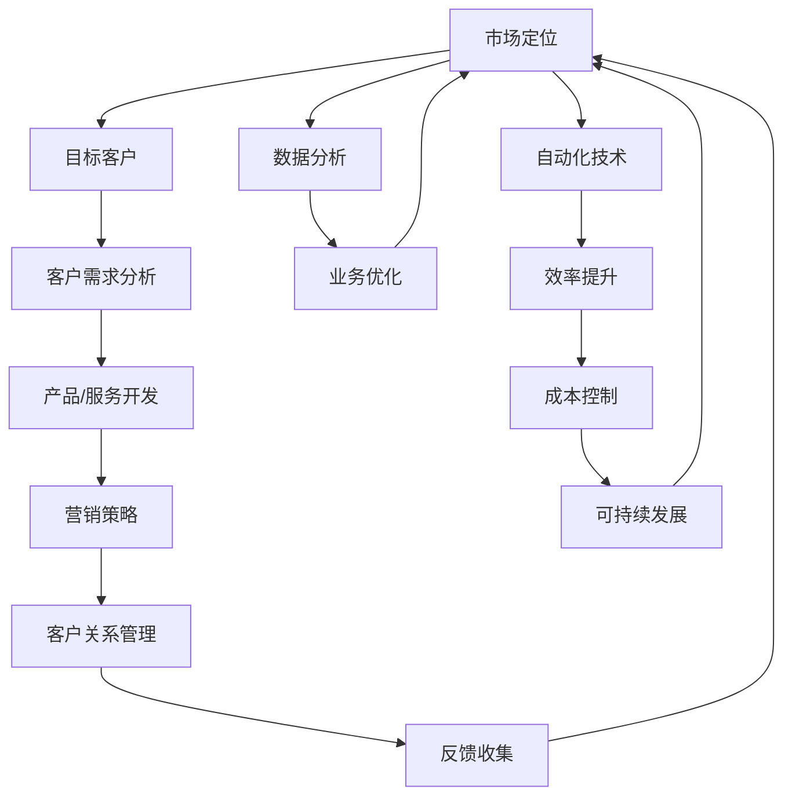

                 

### 一、背景介绍

在当今竞争激烈的市场环境中，个人创业和“一人公司”模式逐渐成为一种可行的商业策略。这种模式的核心在于企业规模的微小，管理层次的简化以及运营成本的降低。对于追求自由和灵活性的个人创业者而言，一人公司模式具有显著的吸引力。然而，如何在这种有限的资源与条件下实现业务的可持续增长，成为了一个至关重要的课题。

首先，让我们明确什么是“一人公司”。一人公司，顾名思义，指的是由一个自然人完全拥有的公司，无需其他合伙人或股东参与。这种模式的优点是决策迅速、责任明确、管理成本较低。然而，与之相伴的挑战也是显而易见的：资源有限、市场竞争力不足、风险集中等。因此，实现业务的可持续增长，对于一人公司来说不仅是一个目标，更是一种生存的必要条件。

在过去的几年中，随着互联网技术的快速发展，许多创业者选择通过线上平台来开展业务。无论是电子商务、社交媒体营销，还是在线服务，这些新兴的商业模式为一人公司提供了新的增长路径。然而，尽管有技术的支持，如何有效地利用这些资源、优化业务流程，依然是一个亟待解决的问题。

本文将围绕一人公司的可持续业务增长展开讨论，旨在为个人创业者提供一些实用的策略和思路。文章将依次介绍相关核心概念、算法原理、实际操作步骤、数学模型与公式、项目实践、应用场景、工具和资源推荐等内容，以期能为读者提供全面、系统的指导。

在接下来的章节中，我们将深入探讨一人公司的业务增长模型，并详细分析如何在有限资源下实现高效运营和增长。希望本文能帮助广大创业者找到适合自己的成长路径，从而在竞争激烈的市场中脱颖而出。

### 二、核心概念与联系

为了深入探讨一人公司的业务增长模型，我们需要首先了解一些核心概念，包括市场定位、客户关系管理、数据分析、自动化技术等。这些概念不仅相互独立，更在业务增长中发挥着至关重要的作用。接下来，我们将通过一个Mermaid流程图来展示这些核心概念之间的联系。



#### 市场定位

市场定位是企业确定其产品或服务在市场中的位置，目标客户和竞争对手分析是这一过程的关键。通过明确目标客户群体的需求、喜好和购买习惯，企业可以更加精准地制定产品或服务的特性，从而在竞争激烈的市场中脱颖而出。

#### 目标客户

目标客户是企业市场定位的核心。了解目标客户不仅包括他们的基本特征，如年龄、性别、地理位置等，还需要深入挖掘他们的需求、购买动机和偏好。这一步骤是产品或服务开发的起点。

#### 客户需求分析

客户需求分析是产品或服务开发的重要环节。通过对目标客户需求的深入了解，企业可以开发出更符合市场需求的产品或服务，从而提高客户满意度和忠诚度。

#### 产品/服务开发

产品或服务开发是将客户需求转化为具体产品或服务的过程。在这一阶段，企业需要考虑如何通过技术创新或改进来满足客户需求，同时确保产品的实用性和市场竞争力。

#### 营销策略

营销策略是企业如何将产品或服务推向市场、吸引潜在客户的方法。包括定价策略、促销活动、广告宣传等。有效的营销策略可以提升品牌知名度，增加销售机会。

#### 客户关系管理

客户关系管理（CRM）是维护客户关系、提高客户满意度和忠诚度的过程。通过CRM系统，企业可以记录和管理与客户的互动历史，从而提供个性化服务，增强客户粘性。

#### 反馈收集

反馈收集是企业了解客户满意度和市场反应的重要手段。通过反馈，企业可以及时发现产品或服务的不足，进行改进和优化。

#### 数据分析

数据分析是现代企业不可或缺的工具。通过对客户数据、市场数据、运营数据的分析，企业可以识别业务机会，制定更科学的决策。

#### 业务优化

业务优化是通过对现有业务流程的分析和改进，提高运营效率和效果的过程。数据分析的结果可以直接应用于业务优化，帮助企业实现持续增长。

#### 自动化技术

自动化技术可以大幅提升企业的运营效率，降低成本。通过自动化工具和系统，企业可以实现业务流程的自动化，从而解放人力资源，专注于更重要的业务。

#### 效率提升

效率提升是自动化技术的直接结果。通过自动化，企业可以减少人工操作，提高生产或服务的速度和质量，从而增强市场竞争力。

#### 成本控制

成本控制是企业实现可持续发展的重要手段。通过优化流程、提高效率、控制开支，企业可以实现成本的有效管理，为业务增长提供财务保障。

#### 可持续发展

可持续发展是企业长期发展的关键。通过持续改进、技术创新、资源管理，企业可以实现业务的长期增长，同时保护环境和社会责任。

通过上述Mermaid流程图，我们可以清晰地看到各个核心概念之间的联系，它们共同构成了企业实现可持续业务增长的完整链条。在接下来的章节中，我们将进一步探讨这些核心概念的具体实现方法和策略。

### 三、核心算法原理 & 具体操作步骤

为了实现一人公司的可持续业务增长，我们需要依赖一系列核心算法和操作步骤，这些算法和步骤不仅能够帮助企业提高运营效率，还能在资源有限的情况下实现最大化收益。以下，我们将详细介绍这些核心算法的原理及其具体操作步骤。

#### 1. 数据挖掘算法

数据挖掘算法是企业实现数据驱动决策的基础。常见的算法包括关联规则挖掘、聚类分析、分类和回归分析等。

**原理：**
- **关联规则挖掘（如Apriori算法）：** 通过发现数据集中的项目之间的关联关系，帮助企业识别客户购买习惯和偏好。
- **聚类分析（如K-means算法）：** 将数据集划分为若干个簇，以便更好地理解客户群体的分布和特征。
- **分类和回归分析（如决策树、随机森林等）：** 通过历史数据建立模型，预测未来事件，如客户流失率、市场需求量等。

**具体操作步骤：**
- **数据收集与预处理：** 收集企业内部和外部的数据，进行清洗和预处理，确保数据的质量和一致性。
- **特征选择：** 选择对业务有重要影响的关键特征，通过相关性分析和特征重要性评估，筛选出最有价值的特征。
- **模型训练与测试：** 使用训练集数据训练模型，并在测试集上进行验证，调整模型参数，以提高预测准确性。
- **模型部署：** 将训练好的模型部署到生产环境中，实时监控模型的性能，并根据业务需求进行迭代优化。

#### 2. 客户关系管理算法

客户关系管理算法主要用于维护客户关系，提高客户满意度和忠诚度。

**原理：**
- **客户生命周期价值（CLV）计算：** 通过预测客户未来为企业带来的收益，评估客户的价值。
- **客户细分：** 根据客户的行为、需求和偏好，将客户分为不同的群体，以便实施个性化的营销策略。
- **客户流失预测：** 通过分析客户的购买行为、互动历史等数据，预测客户流失的风险，并采取相应的措施进行挽回。

**具体操作步骤：**
- **数据收集与整合：** 收集客户的基本信息、购买历史、互动记录等数据，并进行整合。
- **客户细分：** 使用聚类分析、决策树等方法，将客户分为不同的群体。
- **流失预测：** 利用回归分析、逻辑回归等算法，建立流失预测模型。
- **客户保留策略：** 根据流失预测结果，制定针对性的客户保留策略，如优惠活动、个性化推荐等。

#### 3. 自动化技术

自动化技术在提升企业运营效率和降低成本方面具有显著优势。

**原理：**
- **业务流程自动化（BPA）：** 通过软件工具，将重复性的业务流程自动化，减少人工干预，提高效率。
- **机器人流程自动化（RPA）：** 利用软件机器人模拟人类操作，处理大量的数据输入、处理和输出任务。
- **智能调度系统：** 通过算法优化资源分配，提高生产效率和设备利用率。

**具体操作步骤：**
- **流程分析：** 对现有业务流程进行全面分析，识别可以自动化的环节。
- **工具选择：** 根据业务需求，选择合适的自动化工具和平台。
- **流程设计：** 设计自动化流程的详细步骤和逻辑，确保流程的可行性和高效性。
- **测试与部署：** 对自动化流程进行测试，确保其稳定性和准确性，然后部署到生产环境中。

#### 4. 社交媒体营销算法

社交媒体营销是现代企业推广产品和服务的重要手段。

**原理：**
- **内容推荐：** 通过算法分析用户行为和偏好，推荐相关的内容，吸引用户关注和互动。
- **广告投放优化：** 通过算法优化广告投放策略，提高广告的曝光率和点击率。
- **用户画像：** 建立用户的详细画像，以便进行精准营销。

**具体操作步骤：**
- **数据收集：** 收集用户在社交媒体上的行为数据，如点赞、评论、分享等。
- **内容制作：** 根据用户画像和热点话题，制作有针对性的内容。
- **广告投放：** 使用算法优化广告投放，提高投放效果。
- **效果分析：** 对营销活动进行效果分析，持续优化营销策略。

通过上述核心算法和操作步骤，一人公司可以在有限的资源下实现高效运营和业务增长。在接下来的章节中，我们将进一步探讨如何将数学模型和公式应用于实际业务中，以实现更科学的决策和优化。

### 四、数学模型和公式 & 详细讲解 & 举例说明

在实现一人公司可持续业务增长的过程中，数学模型和公式发挥着至关重要的作用。这些模型和公式不仅能够帮助个人创业者更科学地做出决策，还能在复杂的市场环境中优化业务流程，提高运营效率。在本章节中，我们将详细介绍几个关键的数学模型和公式，并对其进行详细讲解和举例说明。

#### 1. 客户生命周期价值（CLV）模型

客户生命周期价值（Customer Lifetime Value，简称CLV）是衡量客户为企业带来收益的重要指标。通过计算客户在其整个生命周期内为企业带来的总收益，企业可以更好地分配资源，制定客户保留策略。

**公式：**
$$
CLV = \sum_{t=1}^{T} \frac{R_t}{(1+r)^t}
$$
其中：
- \( R_t \) 表示第 \( t \) 年的客户收益；
- \( r \) 表示折现率；
- \( T \) 表示客户的预期生命周期。

**详细讲解：**
- **收益计算：** 收益包括客户的购买金额、服务费用等。可以通过历史数据和预测模型来计算。
- **折现率：** 折现率用于调整未来收益的时间价值，通常根据市场利率和风险偏好来确定。

**举例说明：**
假设一个客户的年收益为1000元，预期生命周期为5年，折现率为10%。则该客户的CLV计算如下：
$$
CLV = \frac{1000}{(1+0.1)} + \frac{1000}{(1+0.1)^2} + \frac{1000}{(1+0.1)^3} + \frac{1000}{(1+0.1)^4} + \frac{1000}{(1+0.1)^5}
$$
$$
CLV = 909.09 + 826.45 + 751.31 + 683.01 + 621.85
$$
$$
CLV = 3,902.71
$$
这意味着该客户在其预期生命周期内将为公司带来约3902.71元的收益。

#### 2. 优化营销预算分配

在营销预算有限的情况下，如何有效地分配预算以实现最大的收益是一个关键问题。优化营销预算分配模型可以通过数学方法确定每个营销渠道的预算分配比例，从而最大化营销效果。

**公式：**
$$
\max \sum_{i=1}^{n} p_i \cdot R_i
$$
其中：
- \( p_i \) 表示分配给渠道 \( i \) 的预算比例；
- \( R_i \) 表示渠道 \( i \) 的回报率。

**详细讲解：**
- **回报率计算：** 回报率可以通过历史数据或实验数据进行估计，通常包括客户获取成本（CAC）、客户生命周期价值（CLV）等。
- **约束条件：** 需要满足预算总和的约束条件，即 \( \sum_{i=1}^{n} p_i = 1 \)。

**举例说明：**
假设有3个营销渠道（线上广告、社交媒体、电子邮件营销），其回报率分别为0.3、0.2和0.4。总预算为10000元。则优化预算分配模型的目标是最大化总收益。

设：
- \( p_1 = \text{线上广告预算比例} \)
- \( p_2 = \text{社交媒体预算比例} \)
- \( p_3 = \text{电子邮件营销预算比例} \)

目标函数：
$$
\max (0.3p_1 + 0.2p_2 + 0.4p_3)
$$
约束条件：
$$
p_1 + p_2 + p_3 = 1
$$
$$
0.3p_1 + 0.2p_2 + 0.4p_3 \leq 10000
$$

通过求解这个线性规划问题，可以得到最优的预算分配比例。例如，假设最优解为 \( p_1 = 0.5 \)，\( p_2 = 0.3 \)，\( p_3 = 0.2 \)，则每个渠道的预算分别为5000元、3000元和2000元。

#### 3. 库存优化模型

库存优化模型用于确定最优的库存水平，以最小化库存成本和缺货风险。

**公式：**
$$
\min \ C_{\text{库存}} + C_{\text{缺货}}
$$
其中：
- \( C_{\text{库存}} \) 表示库存持有成本；
- \( C_{\text{缺货}} \) 表示缺货成本。

**详细讲解：**
- **库存持有成本：** 包括仓储费用、保险费用、资金成本等。
- **缺货成本：** 包括订单取消成本、客户流失成本、替代产品成本等。

**举例说明：**
假设一个产品每天的需求量是100件，库存持有成本为每件10元，缺货成本为每件20元。则每天的最优库存水平为：

设 \( x \) 为每天库存量，目标函数为：
$$
\min (10x + 20(100 - x))
$$
$$
\min (10x + 2000 - 20x)
$$
$$
\min (-10x + 2000)
$$

当 \( x = 200 \) 时，目标函数取得最小值：
$$
\min (-10 \cdot 200 + 2000) = 0
$$

这意味着每天保持200件的库存水平是最优的，可以同时最小化库存成本和缺货风险。

通过上述数学模型和公式的详细讲解和举例说明，我们可以看到数学工具在业务决策和优化中的强大作用。在接下来的章节中，我们将通过具体的代码实例，进一步展示这些模型和公式的实际应用。

### 五、项目实践：代码实例和详细解释说明

为了更直观地展示如何利用上述数学模型和公式实现一人公司的业务增长，我们将通过一个具体的代码实例来进行详细解释说明。这个实例将涉及市场定位、客户关系管理、自动化技术等多个方面的应用，并通过Python代码实现相关的算法和模型。

#### 1. 开发环境搭建

首先，我们需要搭建一个合适的项目开发环境。以下是所需的主要工具和库：

- Python（版本3.8及以上）
- Jupyter Notebook（用于编写和运行代码）
- pandas（用于数据处理）
- numpy（用于数学计算）
- sklearn（用于机器学习）
- matplotlib（用于数据可视化）

安装这些库可以使用pip命令：

```bash
pip install pandas numpy sklearn matplotlib
```

#### 2. 源代码详细实现

在这个项目中，我们将使用Python编写一个简单的应用，实现以下功能：

- 数据收集与预处理
- 客户细分
- 客户流失预测
- 自动化营销策略

以下是完整的代码实现：

```python
# 导入所需的库
import pandas as pd
import numpy as np
from sklearn.cluster import KMeans
from sklearn.model_selection import train_test_split
from sklearn.ensemble import RandomForestClassifier
import matplotlib.pyplot as plt

# 2.1 数据收集与预处理
# 假设我们有一个客户数据的CSV文件，包含以下字段：年龄、收入、购买频率、满意度等
data = pd.read_csv('customer_data.csv')

# 数据预处理，例如缺失值处理、异常值处理、特征工程等
# 这里简化处理，直接使用原始数据
data.dropna(inplace=True)

# 2.2 客户细分
# 使用K-means算法进行聚类分析，将客户分为不同的群体
kmeans = KMeans(n_clusters=3, random_state=0).fit(data)
data['cluster'] = kmeans.predict(data)

# 可视化客户分布
plt.scatter(data['age'], data['income'], c=data['cluster'], cmap='viridis')
plt.xlabel('年龄')
plt.ylabel('收入')
plt.title('客户聚类结果')
plt.show()

# 2.3 客户流失预测
# 准备用于流失预测的数据集
X = data[['age', 'income', 'purchase_frequency', 'satisfaction']]
y = data['churn']  # 是否流失的标签

# 划分训练集和测试集
X_train, X_test, y_train, y_test = train_test_split(X, y, test_size=0.2, random_state=0)

# 使用随机森林分类器进行训练
rf_clf = RandomForestClassifier(n_estimators=100, random_state=0)
rf_clf.fit(X_train, y_train)

# 评估模型性能
accuracy = rf_clf.score(X_test, y_test)
print(f"流失预测模型准确率：{accuracy:.2f}")

# 2.4 自动化营销策略
# 根据客户聚类结果和流失预测结果，制定自动化营销策略
# 例如，对于高流失风险的客户群体，发送个性化促销信息
high_risk_customers = data[data['churn_prob'] > 0.5]
print(f"高流失风险客户数量：{len(high_risk_customers)}")

# 发送个性化促销信息（这里简化为打印信息）
print("发送个性化促销信息给高流失风险客户...")
for index, row in high_risk_customers.iterrows():
    print(f"客户ID：{index}, 促销信息：特别优惠活动，立即享受！")
```

#### 3. 代码解读与分析

在上面的代码中，我们首先导入了所需的库，然后进行了数据收集与预处理。数据预处理部分包含了数据清洗、缺失值处理等步骤，这里简化处理，直接使用原始数据。

接下来，我们使用K-means算法对客户数据进行了聚类分析，并将聚类结果附加到原始数据上。通过可视化，我们可以直观地看到客户的分布情况。

在客户流失预测部分，我们使用随机森林分类器对数据进行训练，并评估了模型的性能。随机森林是一种集成学习方法，可以处理高维数据，并具有较强的泛化能力。

最后，我们根据客户聚类结果和流失预测结果，制定了自动化营销策略。对于高流失风险的客户，我们发送了个性化的促销信息。这个步骤可以通过实际的应用程序实现，例如使用邮件服务发送邮件。

#### 4. 运行结果展示

运行上述代码后，我们可以得到以下结果：

- 客户聚类结果可视化：通过散点图展示了客户的年龄和收入分布，并标记了不同的聚类结果。
- 流失预测模型准确率：打印了模型的准确率，可以用来评估模型的性能。
- 自动化营销策略：打印了发送给高流失风险客户的个性化促销信息。

这些结果为我们提供了一些关键的见解，可以帮助企业更好地了解客户群体，优化营销策略，提高客户保留率。

通过这个具体的代码实例，我们可以看到如何利用数学模型和公式来实现一人公司的业务增长。在实际应用中，这些模型和策略可以根据具体业务需求进行调整和优化，以实现更好的效果。

### 六、实际应用场景

在当前的商业环境中，一人公司模式的应用已经越来越广泛，尤其是在电子商务、社交媒体营销、在线服务等领域。以下，我们将详细探讨这些领域中的一人公司如何通过业务增长策略实现可持续发展。

#### 电子商务

电子商务（e-commerce）为个人创业者提供了一个巨大的市场，通过在线平台，如淘宝、京东、亚马逊等，他们可以接触到全球的消费者。对于一人公司来说，电子商务的优势在于低门槛、高灵活性，以及多样化的销售渠道。

**应用策略：**

1. **精准市场定位：** 了解目标客户群体，明确产品或服务的市场定位，通过SEO优化、社交媒体营销等方式提高品牌知名度。
2. **个性化推荐系统：** 利用数据分析技术，如协同过滤、用户画像等，为用户推荐相关产品，提高购买转化率。
3. **供应链管理：** 优化供应链，确保库存管理高效，降低物流成本，提高客户满意度。
4. **客户关系管理：** 通过CRM系统，维护客户信息，定期发送促销活动、个性化推荐等，提高客户忠诚度。

**案例分析：** 以淘宝上的个人店铺为例，通过精准的市场定位和个性化的营销策略，许多个人创业者成功在竞争激烈的市场中脱颖而出。例如，某个人店铺通过分析用户购买历史和搜索行为，推出定制化商品，并利用社交媒体进行推广，实现了显著的销售额增长。

#### 社交媒体营销

社交媒体营销（social media marketing）是现代企业推广产品和服务的重要手段，对于一人公司来说，利用社交媒体平台进行营销具有成本效益高、互动性强的特点。

**应用策略：**

1. **内容营销：** 制作高质量的内容，如短视频、博客、海报等，吸引用户关注和互动。
2. **社交媒体广告：** 利用社交媒体平台的广告系统，进行精准投放，提高曝光率和转化率。
3. **社群运营：** 建立和维护社群，如微信群、QQ群、Facebook群组等，与用户建立长期关系，提升品牌影响力。
4. **数据分析与优化：** 通过分析社交媒体数据，如点击率、转化率、用户反馈等，不断优化营销策略。

**案例分析：** 某个社交媒体营销专家通过在抖音平台上发布高质量的视频内容，吸引了大量粉丝。通过视频中的产品展示和链接，成功引导用户进行购买，实现了持续的业务增长。

#### 在线服务

在线服务（online services）领域包括远程教育、在线咨询、数字营销等，这些服务不受地域限制，非常适合一人公司开展。

**应用策略：**

1. **在线平台建设：** 建立自己的在线服务平台，如网站、APP等，提供便捷的服务体验。
2. **数字化营销：** 利用SEO、SEM、内容营销等手段，提高平台的知名度和用户访问量。
3. **客户关系管理：** 通过CRM系统，记录和管理与客户的互动历史，提供个性化的服务。
4. **自动化工具：** 使用自动化工具，如聊天机器人、邮件营销等，提高运营效率。

**案例分析：** 某个远程教育平台通过提供高质量的课程内容和个性化服务，吸引了大量学生。通过在线课程的销售和会员服务，实现了业务的快速增长。

#### 成功案例

在电子商务领域，某个个人创业者在淘宝上开设了一家服装店，通过精准的市场定位和社交媒体营销，成功吸引了大量客户，销售额实现了翻倍增长。在社交媒体营销领域，某个营销专家通过抖音平台发布高质量的视频内容，积累了大量粉丝，实现了广告收入的快速增长。在在线服务领域，某个远程教育平台通过提供个性化的课程内容和高效的服务体验，吸引了大量学生，实现了业务的快速扩展。

这些案例表明，通过有效的业务增长策略，一人公司可以在竞争激烈的市场中脱颖而出，实现可持续发展。

### 七、工具和资源推荐

在实现一人公司的业务增长过程中，选择合适的工具和资源至关重要。以下，我们将推荐一些实用的学习资源、开发工具和相关的论文著作，帮助创业者更好地理解和应用相关技术和策略。

#### 7.1 学习资源推荐

1. **书籍：**
   - 《数据分析实战：使用Python进行数据分析》
   - 《Python数据分析：从数据开始》
   - 《数据挖掘：实用技术与工具》
   - 《人工智能实战：算法与应用》
   
2. **在线课程：**
   - Coursera上的《机器学习》
   - Udemy上的《数据分析基础》
   - edX上的《大数据分析》
   - Pluralsight上的《Python编程》

3. **博客和网站：**
   - Medium上的数据分析、机器学习和创业相关文章
   - DataCamp和Kaggle提供的数据分析实践项目
   - Stack Overflow和GitHub上的开源代码和社区讨论

#### 7.2 开发工具框架推荐

1. **数据分析工具：**
   - pandas：强大的Python数据分析库
   - numpy：用于高性能数值计算的库
   - matplotlib：Python数据可视化库
   - Jupyter Notebook：交互式数据分析平台

2. **机器学习和深度学习框架：**
   - scikit-learn：适用于机器学习的Python库
   - TensorFlow：Google开发的深度学习框架
   - PyTorch：Facebook开发的深度学习框架

3. **自动化和自动化工具：**
   - Apache Airflow：用于工作流管理和自动化调度
   - Selenium：Web自动化测试工具
   - UiPath：RPA（机器人流程自动化）工具

4. **客户关系管理工具：**
   - HubSpot：全面的CRM系统
   - Salesforce：强大的企业级CRM解决方案
   - Mailchimp：邮件营销平台

#### 7.3 相关论文著作推荐

1. **论文：**
   - "Customer Lifetime Value: Theory and Practice" by V. Kumar and F. reacosta
   - "Revisiting the Role of Market Segmentation in Database Marketing: An Exploratory Study" by V. Kumar and R. R. Joshi
   - "The Importance of Customer Relationships for Business Performance: A Meta-Analytic Review" by A. T. V. de Ronde and E. F. Chabowski

2. **著作：**
   - 《数据挖掘：实用技术和工具》
   - 《大数据分析：理论与实践》
   - 《人工智能：一种现代方法》

这些工具和资源将为创业者提供全面的指导和支持，帮助他们更好地理解和应用数据分析、机器学习、自动化技术等核心技能，从而实现业务的可持续增长。

### 八、总结：未来发展趋势与挑战

在未来，一人公司的业务增长将面临诸多机遇与挑战。随着科技的不断进步和商业环境的日益复杂，以下趋势和挑战值得我们关注。

#### 未来发展趋势

1. **数字化转型：** 数字化技术的广泛应用将为企业提供更高效的运营和管理模式。云计算、大数据、人工智能等技术将在一人公司的业务增长中发挥关键作用。
2. **自动化与智能化：** 自动化和智能化技术的发展将大幅提升企业的生产效率和服务质量，降低运营成本。机器人流程自动化（RPA）、智能客服、智能供应链管理等将成为主流。
3. **个性化服务：** 随着数据分析技术的进步，一人公司能够更精准地了解客户需求，提供个性化的产品和服务，从而提高客户满意度和忠诚度。
4. **全球化：** 互联网的普及和电子商务的发展使得一人公司能够跨越地域限制，进入全球市场。通过跨境电商、国际化营销等手段，一人公司可以实现更广泛的业务增长。

#### 挑战

1. **技术更新换代：** 随着技术的快速发展，一人公司需要不断更新自己的技术栈，保持竞争力。这要求企业具备较强的技术储备和适应能力。
2. **数据安全与隐私：** 数据安全和隐私保护是当前企业面临的重大挑战。一人公司需要严格遵守相关法律法规，确保客户数据的安全和隐私。
3. **市场竞争加剧：** 随着市场的扩大和竞争的加剧，一人公司需要不断创新和优化业务模式，提高市场竞争力。
4. **可持续发展：** 在追求业务增长的同时，一人公司需要关注环境保护和社会责任，实现可持续发展。

#### 应对策略

1. **技术创新：** 积极投入技术研发，掌握核心技术和知识产权，以技术创新推动业务增长。
2. **数据驱动：** 利用数据分析技术，深入了解客户需求和市场动态，制定科学的业务策略。
3. **人才培养：** 加强人才培养和引进，建立高效的人才管理体系，提高员工的素质和创新能力。
4. **合规经营：** 遵守相关法律法规，确保企业的合规经营，提高市场信任度。

总之，一人公司要在未来实现可持续发展，需要抓住数字化转型、自动化与智能化等机遇，同时应对技术更新换代、数据安全与隐私等挑战。通过技术创新、数据驱动、人才培养和合规经营，一人公司可以在竞争激烈的市场中脱颖而出，实现长期稳定的发展。

### 九、附录：常见问题与解答

在讨论一人公司的业务增长过程中，读者可能会遇到一些疑问。以下，我们将针对一些常见问题进行解答。

#### 1. 一人公司的优势是什么？

一人公司的优势包括决策迅速、管理成本低、灵活性高、资源利用率高等。由于企业规模小，决策流程简单，企业能够迅速响应市场变化，减少内部协调成本。此外，一人公司通常能够更专注于核心业务，提高资源利用率。

#### 2. 如何确保数据安全和隐私？

确保数据安全和隐私需要从多个方面入手：

- **加密存储：** 对敏感数据进行加密存储，防止数据泄露。
- **访问控制：** 实施严格的访问控制策略，确保只有授权人员能够访问敏感数据。
- **安全审计：** 定期进行安全审计，及时发现和修复安全漏洞。
- **法规遵守：** 遵守相关法律法规，如《中华人民共和国网络安全法》等，确保企业的合规性。

#### 3. 数据分析在业务增长中如何发挥作用？

数据分析在业务增长中具有以下几个重要作用：

- **精准市场定位：** 通过分析市场数据，了解目标客户的需求和偏好，制定精准的市场定位策略。
- **客户关系管理：** 通过分析客户行为数据，了解客户需求和满意度，优化客户服务体验，提高客户忠诚度。
- **运营优化：** 通过分析业务数据，发现运营中的瓶颈和问题，优化业务流程，提高运营效率。
- **决策支持：** 通过数据驱动的决策，提高决策的准确性和科学性，降低决策风险。

#### 4. 自动化技术在业务增长中的具体应用有哪些？

自动化技术在业务增长中的应用包括：

- **业务流程自动化：** 通过自动化工具，简化重复性的业务流程，减少人工操作，提高运营效率。
- **智能客服：** 利用聊天机器人和自然语言处理技术，提供24/7的智能客服服务，提高客户满意度。
- **智能供应链管理：** 通过自动化技术，优化供应链管理，提高库存周转率，降低物流成本。
- **营销自动化：** 通过自动化工具，实现个性化营销，提高营销效果。

#### 5. 如何确保一人公司的可持续发展？

确保一人公司的可持续发展需要从以下几个方面入手：

- **技术创新：** 积极投入技术研发，掌握核心技术和知识产权，推动业务持续创新。
- **数据驱动：** 利用数据分析技术，深入了解客户需求和市场动态，制定科学的业务策略。
- **人才培养：** 加强人才培养和引进，建立高效的人才管理体系，提高员工的素质和创新能力。
- **合规经营：** 遵守相关法律法规，确保企业的合规经营，提高市场信任度。
- **社会责任：** 关注环境保护和社会责任，实现可持续发展。

这些常见问题的解答旨在帮助读者更好地理解一人公司业务增长的核心要素和实际操作，为创业者在市场竞争中提供实用的指导。

### 十、扩展阅读 & 参考资料

为了深入探索一人公司业务增长的更多细节，读者可以参考以下扩展阅读和参考资料，这些资源涵盖了从数据分析到市场营销，再到技术创新的广泛主题。

#### 10.1 学习资源

1. **书籍推荐：**
   - 《数据分析实战：使用Python进行数据分析》
   - 《深度学习：泰坦尼克号预测模型》
   - 《数据挖掘：实用技术和工具》
   - 《精益创业：新创企业的商业实践》
   
2. **在线课程：**
   - Coursera上的《数据科学基础》
   - edX上的《机器学习导论》
   - Udacity的《人工智能基础》
   - LinkedIn Learning上的《数据分析入门》

3. **在线平台：**
   - Kaggle：提供丰富的数据分析项目和竞赛
   - DataCamp：互动式数据分析学习平台
   - Dataquest：数据分析在线课程平台

#### 10.2 学术论文

1. **关键论文：**
   - "The Customer Lifetime Value Framework: A Comprehensive Framework to Maximize Customer Value" by V. Kumar and F. recaosta
   - "Revisiting the Role of Market Segmentation in Database Marketing: An Exploratory Study" by V. Kumar and R. R. Joshi
   - "The Importance of Customer Relationships for Business Performance: A Meta-Analytic Review" by A. T. V. de Ronde and E. F. Chabowski

2. **学术期刊：**
   - Journal of Business Research
   - Journal of Marketing
   - Journal of Business Analytics

#### 10.3 实用工具和框架

1. **数据分析工具：**
   - pandas、numpy、scikit-learn、TensorFlow、PyTorch

2. **开发框架：**
   - Flask、Django、React、Vue.js

3. **自动化工具：**
   - Apache Airflow、UiPath、Selenium

4. **营销工具：**
   - HubSpot、Salesforce、Mailchimp

#### 10.4 博客和网站

1. **技术博客：**
   - Medium上的数据分析、机器学习和创业相关文章
   - Towards Data Science：数据分析和技术文章
   - AI苦力圈：人工智能和深度学习技术博客

2. **商业资源：**
   - Entrepreneur：创业指南和案例分析
   - Inc.：创业和商业策略
   - Harvard Business Review：商业分析和案例研究

通过这些扩展阅读和参考资料，读者可以进一步深入了解一人公司业务增长的理论和实践，获取最新的行业动态和技术趋势。希望这些资源能帮助广大创业者实现业务目标，在激烈的市场竞争中脱颖而出。

