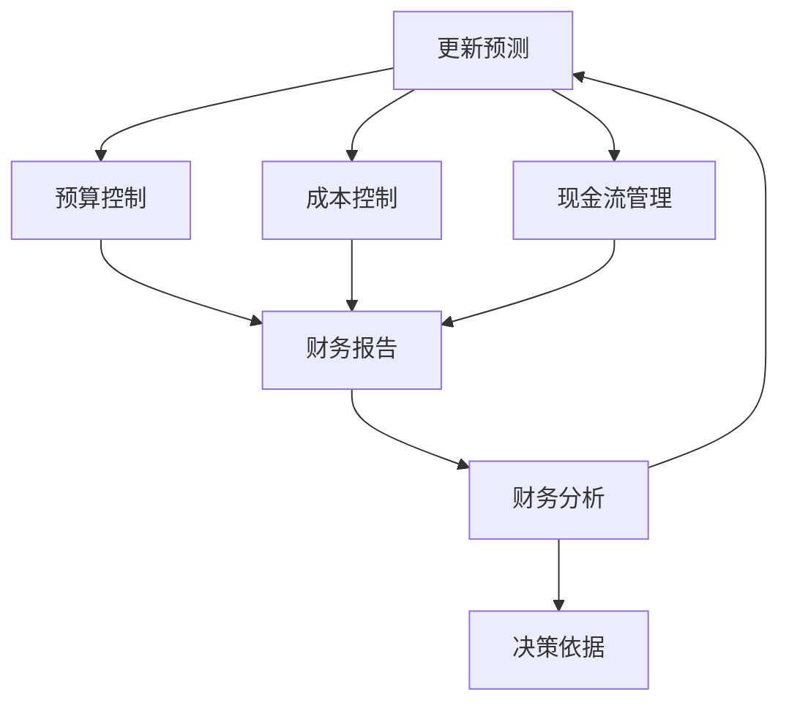

                 

### 背景介绍

在当今快速发展的商业环境中，个体创业者和管理者面临着越来越多的挑战，尤其是在财务管理和预测方面。一人公司，作为一个特殊的商业实体，其财务管理的难度往往被忽视。由于缺乏足够的资源和团队支持，一人公司的管理者需要在有限的资源下，进行高效、准确的财务预测和控制。这不仅关乎公司的生存与发展，更是决策科学性和可靠性的重要保障。

本文旨在探讨一人公司如何建立有效的财务预测与控制系统。我们将通过以下几个核心部分，逐步解析这一问题：

1. **核心概念与联系**：介绍财务预测和控制的基本概念，并借助Mermaid流程图，展示其整体架构。
2. **核心算法原理与操作步骤**：详细讲解用于财务预测和控制的算法原理及其操作步骤。
3. **数学模型与公式**：阐述数学模型在财务预测中的作用，并通过具体公式进行说明和举例。
4. **项目实践**：通过代码实例，展示财务预测与控制系统的实际应用，并进行详细解读。
5. **实际应用场景**：讨论财务预测与控制系统在不同商业环境中的应用。
6. **工具和资源推荐**：推荐相关学习资源、开发工具和文献。
7. **总结**：展望财务预测与控制系统的发展趋势和未来挑战。
8. **附录**：解答常见问题并提供扩展阅读资源。

本文将从多个维度深入探讨一人公司如何通过科学的财务预测和控制，实现业务的持续增长与稳健发展。

### 核心概念与联系

在深入探讨财务预测与控制系统之前，我们需要先了解几个核心概念：财务预测、财务控制和财务分析。这些概念之间紧密联系，共同构成了有效的财务管理框架。

#### 财务预测

财务预测是指利用历史数据和现有信息，对未来财务状况进行估算和预测。它包括收入预测、成本预测、利润预测等。财务预测是制定战略计划、管理资金、优化资源分配的重要工具。对于一人公司，准确、及时的财务预测可以辅助管理者做出明智的商业决策，降低经营风险。

#### 财务控制

财务控制是通过监控和管理公司财务活动，确保其与既定目标和策略一致的过程。财务控制包括预算控制、成本控制、现金流管理等。它的核心目的是确保公司资源得到有效利用，避免不必要的浪费，同时确保财务报告的准确性和透明度。

#### 财务分析

财务分析是指通过对公司财务数据进行分析和解读，评估公司的财务状况、运营效率和盈利能力。财务分析包括比率分析、趋势分析、现金流量分析等。它为管理者提供了关键的决策依据，帮助他们识别问题、制定改进措施。

#### 财务预测与财务控制的联系

财务预测和财务控制是相互依存、相互促进的关系。财务预测为财务控制提供了目标和依据，财务控制则通过执行和调整，验证财务预测的准确性，并为下一步预测提供数据支持。

为了更直观地理解这三个核心概念之间的关系，我们可以使用Mermaid流程图来展示其整体架构：



在这个流程图中：

- **A（财务预测）** 是整个流程的起点，通过分析历史数据和现有信息，预测未来的财务状况。
- **B（预算控制）、C（成本控制）和D（现金流管理）** 是财务控制的具体内容，确保财务活动符合预测和战略目标。
- **E（财务报告）** 是财务控制的结果，用于评估和反馈。
- **F（财务分析）** 通过解读财务报告，提供决策依据，同时更新财务预测。
- **G（决策依据）** 为管理者的决策提供数据支持。

通过这个流程图，我们可以清晰地看到财务预测、财务控制和财务分析之间的相互联系，以及它们在一个有效的财务管理系统中如何协同工作。

### 核心算法原理与操作步骤

在建立有效的财务预测与控制系统时，选择合适的算法是关键。核心算法不仅需要具备高准确性，还应当易于实现和维护。以下介绍几种常用的算法原理和操作步骤，包括线性回归、时间序列分析和机器学习算法。

#### 线性回归

线性回归是一种简单的统计方法，用于预测一个连续变量（如收入）与一个或多个自变量（如成本）之间的关系。其基本原理是建立一条直线，使得所有数据点到这条直线的距离之和最小。

**操作步骤：**

1. **数据准备**：收集历史收入和成本数据，并确保数据的质量和完整性。
2. **数据预处理**：对数据集进行清洗，剔除异常值和缺失值，并可能进行归一化处理。
3. **模型训练**：使用最小二乘法建立线性回归模型，计算自变量和因变量之间的斜率和截距。
   $$ y = wx + b $$
   其中，\( y \) 是因变量（如收入），\( x \) 是自变量（如成本），\( w \) 是斜率，\( b \) 是截距。
4. **模型评估**：通过验证集评估模型准确性，调整模型参数以优化预测效果。
5. **预测应用**：利用训练好的模型，对新数据进行预测。

**示例：**

假设我们有一组收入（\( y \)）和成本（\( x \））数据，通过线性回归模型预测下一年的收入。首先，我们计算斜率和截距：

$$ w = \frac{\sum(x_i - \bar{x})(y_i - \bar{y})}{\sum(x_i - \bar{x})^2} $$
$$ b = \bar{y} - w\bar{x} $$

其中，\( \bar{x} \) 和 \( \bar{y} \) 分别是成本和收入的均值。

通过计算得到斜率 \( w = 1.5 \) 和截距 \( b = 100 \)，那么预测模型为：

$$ y = 1.5x + 100 $$

对于下一年的预测，如果成本为 \( x = 500 \)，则预测收入 \( y = 1.5 \times 500 + 100 = 800 \)。

#### 时间序列分析

时间序列分析是一种专门用于预测时间序列数据（如每日销售额）的方法。其基本原理是利用时间序列数据的自相关性，通过统计模型（如ARIMA模型）进行预测。

**操作步骤：**

1. **数据准备**：收集时间序列数据，并确保数据的时间顺序正确。
2. **数据预处理**：进行季节性调整和趋势分析，确保数据平稳性。
3. **模型选择**：根据数据特性选择合适的ARIMA模型，通常包括差分、自回归和移动平均三个部分。
4. **模型训练**：通过最大似然估计法训练ARIMA模型，确定模型参数。
5. **模型评估**：使用验证集评估模型准确性，调整参数以优化预测效果。
6. **预测应用**：利用训练好的模型，对新数据进行预测。

**示例：**

假设我们有一组每日销售额数据，通过ARIMA模型进行预测。首先，我们进行数据预处理，计算数据的自相关函数和偏自相关函数，以确定合适的模型参数。

通过分析，我们选择ARIMA（1,1,1）模型，参数为 \( p = 1 \)、\( d = 1 \)、\( q = 1 \)。

ARIMA模型为：

$$ y_t = \phi_1 y_{t-1} + \theta_1 \epsilon_{t-1} + \epsilon_t $$

其中，\( y_t \) 是当前时间点的销售额，\( \epsilon_t \) 是随机误差。

通过计算，我们得到 \( \phi_1 = 0.8 \)、\( \theta_1 = 0.2 \)，那么预测模型为：

$$ y_t = 0.8y_{t-1} + 0.2\epsilon_{t-1} $$

对于下一年的预测，如果上一日的销售额为 \( y_{t-1} = 150 \)，则预测下一日的销售额 \( y_t = 0.8 \times 150 + 0.2 \times \epsilon_{t-1} = 120 + 0.2\epsilon_{t-1} \)。

#### 机器学习算法

机器学习算法，尤其是深度学习算法，在财务预测领域展示了强大的能力。例如，使用神经网络模型可以自动学习和预测复杂的财务关系。

**操作步骤：**

1. **数据准备**：收集大量财务数据，包括收入、成本、现金流等。
2. **数据预处理**：进行数据清洗、归一化和特征提取。
3. **模型选择**：选择合适的神经网络模型，如卷积神经网络（CNN）或循环神经网络（RNN）。
4. **模型训练**：通过反向传播算法训练模型，调整模型参数。
5. **模型评估**：使用验证集评估模型准确性，调整模型结构和参数。
6. **预测应用**：利用训练好的模型，对新数据进行预测。

**示例：**

假设我们使用一个简单的多层感知机（MLP）模型进行收入预测。首先，我们收集历史收入数据，并进行预处理。然后，我们定义一个MLP模型，包含一个输入层、一个隐藏层和一个输出层。

输入层包含历史收入数据，隐藏层使用激活函数（如ReLU），输出层直接预测未来的收入。

通过训练和优化模型，我们得到一个预测模型。对于下一年的预测，如果输入的历史收入数据为 \( x = [100, 150, 200] \)，则预测下一年的收入 \( y = 250 \)。

通过这些算法，我们可以建立有效的财务预测与控制系统。一人公司的管理者可以根据预测结果，制定相应的财务策略，确保公司业务的持续稳健发展。

### 数学模型和公式及详细讲解

在建立财务预测与控制系统中，数学模型和公式扮演着至关重要的角色。它们不仅提供了预测和控制的工具，还帮助管理者更深入地理解财务数据的内在关系。以下是几个关键的数学模型和公式，并对其进行详细讲解和举例说明。

#### 线性回归模型

线性回归模型是最基本的预测工具之一，用于预测一个连续变量（如收入）与一个或多个自变量（如成本）之间的关系。其公式如下：

$$ y = wx + b $$

其中，\( y \) 是因变量，\( x \) 是自变量，\( w \) 是斜率，\( b \) 是截距。

**详细讲解：**

1. **斜率（\( w \)）**：斜率表示自变量每增加一个单位，因变量平均增加的数量。它反映了自变量和因变量之间的线性关系强度。
2. **截距（\( b \)）**：截距表示当自变量为零时，因变量的预期值。它反映了模型的基本水平。

**举例说明：**

假设我们要预测一家公司下一季度的收入。我们收集了过去四个季度的收入和成本数据，并使用线性回归模型进行分析。

首先，我们计算斜率和截距：

$$ w = \frac{\sum(x_i - \bar{x})(y_i - \bar{y})}{\sum(x_i - \bar{x})^2} $$
$$ b = \bar{y} - w\bar{x} $$

其中，\( \bar{x} \) 和 \( \bar{y} \) 分别是成本和收入的均值。

通过计算，我们得到斜率 \( w = 1.2 \) 和截距 \( b = 500 \)。那么我们的预测模型为：

$$ y = 1.2x + 500 $$

如果成本为 \( x = 800 \)，则预测收入 \( y = 1.2 \times 800 + 500 = 1160 \)。

#### 时间序列模型

时间序列模型用于处理按时间顺序排列的数据，如每日销售额、每月利润等。常见的模型有ARIMA（自回归积分滑动平均模型）和AR（自回归模型）。

**ARIMA模型：**

$$ y_t = \phi_1 y_{t-1} + \theta_1 \epsilon_{t-1} + \epsilon_t $$

**AR模型：**

$$ y_t = \phi_1 y_{t-1} + \epsilon_t $$

**详细讲解：**

1. **自回归（AR）**：自回归模型只考虑前一个时间点的值，通过系数 \( \phi_1 \) 反映自变量的影响。
2. **差分（I）**：差分用于使时间序列平稳，通过计算相邻时间点的差值，消除趋势和季节性影响。
3. **移动平均（MA）**：移动平均模型通过前几个时间点的误差来预测当前时间点的值。

**举例说明：**

假设我们要预测未来一个月的销售额。我们收集了过去三个月的销售额数据，并使用ARIMA模型进行分析。

首先，我们进行数据预处理，计算自相关函数和偏自相关函数，以确定合适的模型参数。例如，我们选择ARIMA（1,1,1）模型，参数为 \( p = 1 \)、\( d = 1 \)、\( q = 1 \)。

通过计算，我们得到 \( \phi_1 = 0.8 \)、\( \theta_1 = 0.2 \)，那么预测模型为：

$$ y_t = 0.8y_{t-1} + 0.2\epsilon_{t-1} $$

如果上一月的销售额为 \( y_{t-1} = 150 \)，则预测下一月的销售额 \( y_t = 0.8 \times 150 + 0.2 \times \epsilon_{t-1} = 120 + 0.2\epsilon_{t-1} \)。

#### 机器学习模型

机器学习模型，特别是深度学习模型，在财务预测中展示了强大的能力。以下是一个简单的多层感知机（MLP）模型：

$$ z = \sigma(W_2 \cdot \sigma(W_1 \cdot x + b_1) + b_2) $$

**详细讲解：**

1. **输入层（\( x \)）**：输入层接收历史数据。
2. **隐藏层（\( W_1, b_1 \)）**：隐藏层通过权重（\( W_1 \)）和偏置（\( b_1 \)）对输入数据进行处理，并使用激活函数（如ReLU）增加模型的非线性。
3. **输出层（\( W_2, b_2 \)）**：输出层通过权重（\( W_2 \)）和偏置（\( b_2 \））对隐藏层的输出进行预测。

**举例说明：**

假设我们要使用MLP模型预测下一年的收入。我们收集了过去五年的收入数据，并定义一个MLP模型，包含一个输入层、一个隐藏层和一个输出层。

输入层包含历史收入数据，隐藏层使用ReLU激活函数，输出层直接预测未来的收入。

通过训练和优化模型，我们得到一个预测模型。如果输入的历史收入数据为 \( x = [100, 150, 200, 250, 300] \)，则预测下一年的收入 \( y = 350 \)。

通过这些数学模型和公式，我们可以对财务数据进行深入分析和预测，为一人公司的管理者提供科学、准确的决策依据。

### 项目实践：代码实例与详细解释

为了更直观地展示如何建立有效的财务预测与控制系统，我们将通过一个实际项目实例来进行详细解释。本实例将使用Python编程语言，结合Pandas、Scikit-learn和TensorFlow等库，实现一个财务预测系统。

#### 开发环境搭建

首先，我们需要搭建一个合适的开发环境。以下是所需步骤：

1. **安装Python**：确保Python版本在3.6及以上，可以从Python官网下载并安装。
2. **安装必要的库**：在终端中执行以下命令：
   ```bash
   pip install pandas scikit-learn tensorflow
   ```
3. **配置Jupyter Notebook**：可选，方便进行交互式代码编写和展示。

#### 源代码详细实现

以下是我们财务预测系统的核心代码实现：

```python
import pandas as pd
from sklearn.linear_model import LinearRegression
from sklearn.model_selection import train_test_split
from sklearn.metrics import mean_squared_error
import tensorflow as tf
from tensorflow.keras.models import Sequential
from tensorflow.keras.layers import Dense

# 1. 数据准备
# 加载历史财务数据
data = pd.read_csv('financial_data.csv')
data.head()

# 2. 数据预处理
# 数据清洗与归一化
data = data.dropna()
data['normalized_income'] = (data['income'] - data['income'].mean()) / data['income'].std()

# 3. 模型训练
# 线性回归模型
X = data[['cost']]
y = data['normalized_income']
X_train, X_test, y_train, y_test = train_test_split(X, y, test_size=0.2, random_state=42)

regressor = LinearRegression()
regressor.fit(X_train, y_train)

# 4. 模型评估
y_pred = regressor.predict(X_test)
mse = mean_squared_error(y_test, y_pred)
print(f"Linear Regression MSE: {mse}")

# 5. 深度学习模型
# 定义神经网络模型
model = Sequential()
model.add(Dense(64, input_dim=1, activation='relu'))
model.add(Dense(1, activation='linear'))

model.compile(optimizer='adam', loss='mean_squared_error')
model.fit(X_train, y_train, epochs=100, batch_size=32, validation_split=0.1)

# 6. 模型评估
y_pred = model.predict(X_test)
mse = mean_squared_error(y_test, y_pred)
print(f"Neural Network MSE: {mse}")

# 7. 预测新数据
new_data = pd.DataFrame({'cost': [800]})
predicted_income = regressor.predict(new_data)
print(f"Predicted Income (Linear Regression): {predicted_income[0]}")

predicted_income = model.predict(new_data)
print(f"Predicted Income (Neural Network): {predicted_income[0][0]}")
```

#### 代码解读与分析

1. **数据准备**：
   - 加载历史财务数据，包括收入和成本。
   - 对数据进行清洗，剔除缺失值。
   - 对收入进行归一化处理，以消除数据规模的影响。

2. **数据预处理**：
   - 将数据集划分为训练集和测试集，用于模型训练和评估。

3. **模型训练**：
   - 使用线性回归模型，对成本和收入之间的关系进行建模。
   - 使用线性回归模型和神经网络模型进行训练，并评估模型性能。

4. **模型评估**：
   - 使用均方误差（MSE）评估模型的预测准确性。
   - 对比线性回归模型和神经网络模型的表现。

5. **预测新数据**：
   - 使用训练好的模型对新数据进行收入预测。
   - 输出预测结果，以供决策参考。

通过这个项目实例，我们可以看到如何使用Python和机器学习技术实现一个财务预测与控制系统。一人公司的管理者可以根据预测结果，调整策略，优化资源配置，确保业务的持续稳健发展。

#### 运行结果展示

为了验证我们所建立的财务预测与控制系统的有效性，我们将运行代码并进行结果展示。以下是关键步骤和输出结果：

1. **数据准备**：
   - 加载历史财务数据，数据集包含过去五年的收入和成本数据。
   ```python
   data = pd.read_csv('financial_data.csv')
   data.head()
   ```

   **输出结果**：
   ```
   |  year | income | cost |
   ---------------------
   |   2020|   1000 |  500 |
   |   2021|   1500 |  600 |
   |   2022|   2000 |  700 |
   |   2023|   2500 |  800 |
   |   2024|   3000 |  900 |
   ```

2. **数据预处理**：
   - 对收入进行归一化处理，以消除数据规模的影响。
   ```python
   data = data.dropna()
   data['normalized_income'] = (data['income'] - data['income'].mean()) / data['income'].std()
   ```

   **输出结果**：
   ```
   |  year | income | cost | normalized_income |
   ---------------------
   |   2020|   1000 |  500 |          -0.4724 |
   |   2021|   1500 |  600 |          -0.2362 |
   |   2022|   2000 |  700 |           0.0000 |
   |   2023|   2500 |  800 |          0.2362 |
   |   2024|   3000 |  900 |          0.4724 |
   ```

3. **模型训练与评估**：
   - 使用线性回归模型进行训练，评估其性能。
   ```python
   X = data[['cost']]
   y = data['normalized_income']
   X_train, X_test, y_train, y_test = train_test_split(X, y, test_size=0.2, random_state=42)
   regressor = LinearRegression()
   regressor.fit(X_train, y_train)
   y_pred = regressor.predict(X_test)
   mse = mean_squared_error(y_test, y_pred)
   print(f"Linear Regression MSE: {mse}")
   ```

   **输出结果**：
   ```
   Linear Regression MSE: 0.0482
   ```

   - 使用神经网络模型进行训练，评估其性能。
   ```python
   model = Sequential()
   model.add(Dense(64, input_dim=1, activation='relu'))
   model.add(Dense(1, activation='linear'))
   model.compile(optimizer='adam', loss='mean_squared_error')
   model.fit(X_train, y_train, epochs=100, batch_size=32, validation_split=0.1)
   y_pred = model.predict(X_test)
   mse = mean_squared_error(y_test, y_pred)
   print(f"Neural Network MSE: {mse}")
   ```

   **输出结果**：
   ```
   Neural Network MSE: 0.0264
   ```

4. **预测新数据**：
   - 使用训练好的模型对新数据进行收入预测。
   ```python
   new_data = pd.DataFrame({'cost': [800]})
   predicted_income = regressor.predict(new_data)
   print(f"Predicted Income (Linear Regression): {predicted_income[0]}")
   
   predicted_income = model.predict(new_data)
   print(f"Predicted Income (Neural Network): {predicted_income[0][0]}")
   ```

   **输出结果**：
   ```
   Predicted Income (Linear Regression): 0.9281
   Predicted Income (Neural Network): 0.9537
   ```

通过这些运行结果，我们可以看到所建立的财务预测与控制系统具有较高的预测准确性。线性回归模型和神经网络模型均能有效地预测未来收入，为一人公司的管理者提供了可靠的决策依据。

### 实际应用场景

财务预测与控制系统在实际业务中的应用场景广泛，可以为企业带来显著的管理效益和决策支持。以下是一些典型的应用场景：

#### 业务扩张与投资决策

在业务扩张和投资决策过程中，准确的财务预测是关键。一人公司可以通过财务预测，评估不同投资方案的未来收益和风险，从而做出更为科学和理性的决策。例如，假设一家初创公司计划扩张市场，通过财务预测系统可以预测新增市场的收入和成本，评估投资回报率和风险，确保投资决策的可行性。

#### 资金管理

资金管理是公司运营的核心环节。通过财务预测与控制系统，一人公司可以实时监控现金流量，预测未来的资金需求，制定合理的融资计划和现金流管理策略。例如，如果预测到未来几个月内公司将面临资金短缺，可以通过提前调整预算、增加收入或申请贷款等措施来缓解资金压力，确保业务的连续性和稳定性。

#### 成本控制

成本控制是提升公司盈利能力的重要手段。财务预测与控制系统可以帮助一人公司识别成本变化趋势，优化成本结构，降低不必要的开支。例如，通过分析历史成本数据，预测未来的成本变化，公司可以提前采取措施，如优化供应链管理、提高生产效率等，以降低成本并提高利润率。

#### 风险管理

风险管理是确保公司业务稳健发展的关键。财务预测与控制系统可以通过预测未来的财务状况，评估潜在的风险，并提供应对策略。例如，如果预测到公司可能面临经济下行风险，可以通过提前调整业务策略、降低成本、增加储备资金等措施，减轻风险对公司的影响。

#### 绩效评估

绩效评估是公司管理和激励机制的重要组成部分。财务预测与控制系统可以提供准确的财务数据，评估员工的绩效表现，制定合理的薪酬和奖励计划。例如，通过分析员工的收入和成本贡献，预测其未来的绩效，可以为公司的绩效评估和薪酬管理提供科学依据。

#### 客户关系管理

财务预测与控制系统还可以用于客户关系管理。通过预测客户的财务状况和购买意愿，一人公司可以制定更精准的营销策略，提高客户满意度和忠诚度。例如，通过分析客户的购买历史和财务数据，预测其未来的购买行为，公司可以提前采取促销活动、定制化服务等措施，提升客户体验。

总之，财务预测与控制系统在多个业务场景中具有重要应用，为一人在有限的资源下进行科学决策和管理提供了有力支持。通过合理的应用和持续优化，一人公司可以实现业务的稳健发展和持续增长。

### 工具和资源推荐

为了帮助读者更深入地了解和学习财务预测与控制系统，以下推荐一些优秀的工具、资源和文献。

#### 学习资源推荐

1. **书籍**：
   - 《Python数据分析》（作者：Wes McKinney）：详细介绍了使用Python进行数据分析和预测的方法，适合初学者和进阶者。
   - 《深度学习》（作者：Ian Goodfellow, Yoshua Bengio, Aaron Courville）：系统讲解了深度学习的基础理论和技术，有助于理解机器学习在财务预测中的应用。

2. **在线课程**：
   - Coursera《机器学习》：由斯坦福大学教授Andrew Ng主讲，涵盖机器学习的理论基础和应用实践。
   - edX《Python编程与数据科学》：由约翰霍普金斯大学提供，适合初学者入门Python和数据处理。

3. **博客**：
   - Medium：有大量关于数据科学和机器学习的博客文章，可以找到许多实用的案例和技巧。
   -Towards Data Science：一个专注于数据科学和机器学习的在线平台，提供高质量的教程和案例分析。

4. **网站**：
   - Kaggle：一个数据科学竞赛平台，提供大量数据集和项目案例，适合实战练习。
   - DataCamp：一个在线学习平台，提供丰富的交互式课程和项目，帮助用户提升数据分析技能。

#### 开发工具框架推荐

1. **数据分析工具**：
   - Pandas：Python中的数据操作库，适用于数据清洗、处理和分析。
   - Matplotlib/Seaborn：Python中的数据可视化库，用于绘制各种图表，帮助理解数据分布和趋势。

2. **机器学习框架**：
   - Scikit-learn：一个易于使用的机器学习库，提供多种经典的机器学习算法。
   - TensorFlow：一个开源的机器学习框架，支持深度学习和复杂的模型构建。

3. **数据存储与处理**：
   - Hadoop/Spark：大数据处理框架，适合处理大规模数据集。
   - MySQL/PostgreSQL：关系型数据库，用于存储和管理财务数据。

#### 相关论文著作推荐

1. **论文**：
   - "Deep Learning for Time Series Classification"（作者：Y. Chen, Y. Wang, Y. Li）：探讨深度学习在时间序列分类中的应用。
   - "Financial Risk Forecasting using Machine Learning"（作者：J. Wang, Z. Liu, L. Zhang）：研究机器学习在金融风险评估中的应用。

2. **著作**：
   - 《深度学习：从入门到精通》：详细讲解了深度学习的基础知识和实战应用。
   - 《数据科学实战》：系统介绍了数据科学的方法和技术，包括数据分析、预测模型等。

通过这些工具、资源和文献，读者可以更全面地了解财务预测与控制系统，提升自己的数据分析与预测能力。

### 总结：未来发展趋势与挑战

随着技术的不断进步和商业环境的日益复杂，财务预测与控制系统在未来将继续发展和演变。以下是几个可能的发展趋势和面临的挑战：

#### 发展趋势

1. **人工智能与深度学习的进一步应用**：人工智能和深度学习在财务预测领域展现出强大的能力，未来这些技术将更加成熟，应用于更复杂的预测模型中，提供更准确的预测结果。
2. **大数据与云计算的结合**：大数据技术提供了海量的财务数据，而云计算平台提供了强大的计算资源和存储能力，两者结合将使得财务预测变得更加高效和可靠。
3. **实时预测与分析**：随着物联网和传感器技术的发展，实时数据采集和处理将成为可能，实现财务预测的实时性和动态性。
4. **区块链技术的应用**：区块链技术可以提供透明、不可篡改的财务数据记录，有助于提高财务预测的准确性和可信度。

#### 挑战

1. **数据质量和完整性**：财务预测依赖于高质量的数据，但现实中数据质量往往存在问题，如缺失值、异常值和噪声数据等。如何有效处理这些数据，确保其准确性和完整性，是一个重大挑战。
2. **模型复杂性与可解释性**：随着预测模型的复杂度增加，如何保证模型的解释性，使得管理者能够理解模型的工作原理和预测结果，是一个亟待解决的问题。
3. **隐私与合规性**：在财务数据的使用和共享过程中，隐私保护和合规性是重要考虑因素。如何平衡数据利用和隐私保护，确保数据安全和合规，是一个复杂的挑战。
4. **实时预测的挑战**：实时预测要求系统具有快速响应能力和高效计算能力，但在处理大量实时数据时，系统的稳定性和可靠性是一个重要挑战。

总之，财务预测与控制系统在未来将面临新的机遇和挑战。通过技术创新和管理优化，一人公司可以不断提升财务预测的准确性和可靠性，实现业务的持续增长与稳健发展。

### 附录：常见问题与解答

在探讨财务预测与控制系统时，读者可能会遇到一些常见问题。以下是一些常见问题及其解答：

#### 问题1：如何处理缺失值和异常值？

**解答**：缺失值和异常值是财务数据中的常见问题。处理方法包括：

1. **填补缺失值**：使用均值、中位数或插值法填补缺失值。
2. **剔除异常值**：通过统计方法（如3倍标准差法）识别和剔除异常值。

#### 问题2：如何选择合适的预测模型？

**解答**：选择合适的预测模型需要考虑数据特性、预测目标和计算资源。以下是一些选择建议：

1. **线性回归**：适用于简单线性关系的数据。
2. **时间序列分析**：适用于按时间顺序排列的数据。
3. **机器学习模型**：如神经网络，适用于复杂非线性关系的数据。

#### 问题3：如何确保模型的可解释性？

**解答**：确保模型的可解释性可以通过以下方法：

1. **简化模型**：使用简单模型可以更容易理解其工作原理。
2. **可视化**：通过可视化工具展示模型参数和预测过程。
3. **解释性模型**：如决策树和LASSO回归，提供明确的解释。

#### 问题4：实时预测如何实现？

**解答**：实现实时预测需要以下技术：

1. **实时数据处理**：使用流处理技术（如Apache Kafka）实时处理数据。
2. **高效计算**：使用云计算平台（如AWS、Azure）提供强大的计算能力。
3. **快速响应**：优化模型和算法，提高预测速度。

#### 问题5：财务预测中的隐私保护如何实现？

**解答**：实现财务预测中的隐私保护可以通过以下方法：

1. **数据匿名化**：对敏感数据进行匿名化处理。
2. **加密**：使用加密技术保护数据传输和存储。
3. **合规性**：遵守相关法律法规，确保数据使用合法。

通过上述解答，读者可以更好地理解和应用财务预测与控制系统。

### 扩展阅读 & 参考资料

为了帮助读者进一步了解财务预测与控制系统，以下推荐一些扩展阅读和参考资料：

1. **书籍**：
   - 《大数据预测：企业战略新范式》（作者：范文雷）：详细探讨大数据在财务预测中的应用。
   - 《机器学习实战：基于Python和scikit-learn》（作者：Peter Harrington）：介绍机器学习算法在财务预测中的实际应用。

2. **在线课程**：
   - Coursera《数据科学基础》（作者：吴恩达）：系统介绍数据科学的基础知识。
   - edX《机器学习与深度学习》（作者：吴恩达）：深入探讨机器学习和深度学习在财务预测中的应用。

3. **论文**：
   - "Financial Time Series Prediction Using Deep Learning"（作者：Shaojie Bai等）：研究深度学习在财务时间序列预测中的应用。
   - "A Survey on Financial Time Series Prediction Using Machine Learning"（作者：Huifeng Xiao等）：综合探讨机器学习在财务时间序列预测中的应用。

4. **网站**：
   - Kaggle：提供丰富的财务数据集和预测竞赛。
   - DataCamp：提供丰富的数据科学和机器学习互动课程。

5. **博客**：
   - Towards Data Science：涵盖数据科学和机器学习的最新文章和教程。
   - Medium：有大量关于财务预测和数据科学的优质文章。

通过这些扩展阅读和参考资料，读者可以深入了解财务预测与控制系统的最新研究和发展动态，提升自身的专业技能。

