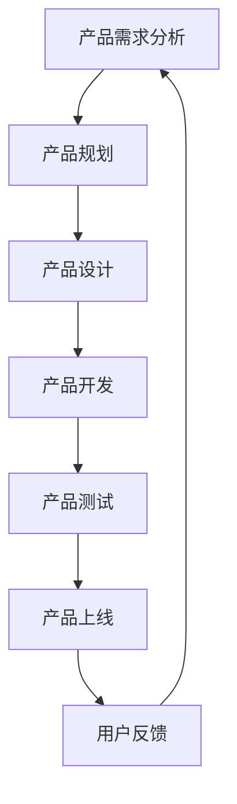

                 

### 1. 背景介绍

在当今充满变革和竞争的商业环境中，一人公司（Solopreneurship）作为一种新型创业模式，正日益受到关注。一人公司，顾名思义，是由一个人创建和运营的公司，没有雇佣员工或合伙人。这种模式具有灵活性强、决策迅速、创业成本低的优点，适合那些追求自由和创新的创业者。

一人公司之所以兴起，主要得益于以下几个因素：

1. **数字化技术的发展**：云计算、远程协作工具和在线市场的兴起，使得创业者可以几乎在任何地方启动和运营业务，不再需要传统的办公室和员工。

2. **经济环境变化**：经济不稳定和就业市场的不确定性使得越来越多的人选择成为自由职业者或创业者。

3. **个人偏好**：一些人出于对独立、灵活和自由的工作生活方式的追求，选择了一条独立创业的道路。

尽管一人公司有诸多优势，但在产品研发和迭代流程上面临着独特的挑战。由于资源的限制，一人公司往往需要在有限的资源和时间内，实现高效的产品研发和迭代。本文将探讨一人公司如何通过系统化的流程和方法，打造高效的产品研发与迭代流程，从而在竞争激烈的市场中脱颖而出。

为了实现这一目标，本文将分为以下几个部分进行详细探讨：

- **核心概念与联系**：介绍一人公司产品研发与迭代流程中的核心概念和它们之间的相互关系。
- **核心算法原理 & 具体操作步骤**：讲解如何在实践中应用这些核心概念，以及具体的操作步骤。
- **数学模型和公式 & 详细讲解 & 举例说明**：通过数学模型和公式，进一步解释产品研发与迭代流程的原理。
- **项目实践：代码实例和详细解释说明**：通过实际代码实例，展示如何将理论应用到实践中。
- **实际应用场景**：探讨产品研发与迭代流程在不同场景下的应用。
- **工具和资源推荐**：推荐一些有助于一人公司提升研发效率的工具和资源。
- **总结：未来发展趋势与挑战**：总结当前产品研发与迭代流程的现状，并探讨未来的发展趋势与挑战。

通过本文的阅读，读者将能够了解并掌握一套适用于一人公司的产品研发与迭代流程，从而提升自己在市场竞争中的优势。

### 2. 核心概念与联系

在探讨如何为一公司构建高效的产品研发与迭代流程之前，首先需要明确其中几个核心概念及其相互之间的联系。以下将分别介绍这些核心概念，并使用Mermaid流程图展示它们之间的相互作用。

#### 2.1 产品需求分析

产品需求分析是产品研发流程的起点。它包括市场调研、用户访谈、竞品分析等环节，旨在明确产品需要解决哪些用户问题，满足哪些用户需求。通过需求分析，可以确保产品的研发方向正确，避免资源浪费。

#### 2.2 产品规划

产品规划是在需求分析的基础上，制定产品研发的详细计划。这包括确定产品的功能、技术实现方案、时间表和资源分配等。产品规划的目标是确保产品能够在预定时间内、以合理的成本和资源完成开发。

#### 2.3 产品设计

产品设计是将产品规划中的功能和技术方案转化为具体的实现方案。这包括界面设计、数据库设计、算法设计等。良好的产品设计不仅能够提高产品的用户体验，还能够降低后期的维护成本。

#### 2.4 产品开发

产品开发是按照设计文档进行编码和测试的过程。一人公司在资源有限的情况下，通常需要采用敏捷开发方法，通过短周期的迭代，快速实现产品功能，并不断优化。

#### 2.5 产品测试

产品测试是确保产品质量的重要环节。通过单元测试、集成测试、系统测试等，可以发现和修复产品中的缺陷，确保产品在发布时能够达到预期质量。

#### 2.6 产品上线

产品上线是将产品发布到生产环境，供用户使用的过程。一人公司需要确保上线过程顺利，减少对用户的影响。

#### 2.7 用户反馈与迭代

用户反馈是产品迭代的重要输入。通过收集和分析用户反馈，可以识别产品的优点和不足，为下一轮迭代提供改进方向。迭代是一个持续的过程，通过不断优化产品，一人公司能够更好地满足用户需求，提升市场竞争力。

#### Mermaid流程图

以下是产品研发与迭代流程的Mermaid流程图：



通过上述核心概念的介绍和Mermaid流程图，我们可以看出，一人公司的产品研发与迭代流程是一个闭环，每个环节都紧密相连，相互影响。理解这些核心概念及其联系，是构建高效产品研发与迭代流程的基础。

### 3. 核心算法原理 & 具体操作步骤

在了解了产品研发与迭代流程的核心概念之后，我们需要深入探讨其中涉及的核心算法原理和具体操作步骤。这些算法原理和步骤将帮助一人公司在有限资源下，高效地实现产品研发与迭代。

#### 3.1 需求分析算法

需求分析是产品研发的第一步，其核心算法是用户访谈和竞品分析。

**用户访谈**：用户访谈是一种通过直接与用户交流，了解其需求和行为的方法。以下是用户访谈的具体操作步骤：

1. **确定访谈对象**：选择目标用户群体，例如产品目标用户、潜在用户等。
2. **准备访谈问题**：设计开放性和封闭性相结合的问题，以了解用户的需求、偏好和行为。
3. **进行访谈**：通过面对面、电话或在线视频等方式与用户进行交流。
4. **记录和分析**：详细记录访谈内容，并进行数据分析和归纳，提取关键需求。

**竞品分析**：竞品分析是通过研究竞争对手的产品，了解其优势和不足，从而指导自己的产品需求分析。具体操作步骤如下：

1. **确定竞品**：选择与自己的产品直接竞争的竞品。
2. **收集竞品信息**：包括功能、设计、用户体验、价格等。
3. **分析竞品**：比较竞品与自己的产品的差异，识别优势和不足。
4. **提取需求**：基于竞品分析，提取对自身产品有益的需求。

#### 3.2 规划与设计算法

在产品规划和设计阶段，核心算法包括功能规划和界面设计。

**功能规划**：功能规划的目标是明确产品的核心功能和技术实现方案。以下是功能规划的具体步骤：

1. **确定产品目标**：明确产品的目标用户、目标和定位。
2. **定义功能需求**：根据用户访谈和竞品分析的结果，确定产品的功能需求。
3. **功能分解**：将功能需求分解为具体的实现任务。
4. **制定时间表和资源分配**：根据功能分解，制定研发时间表和资源分配计划。

**界面设计**：界面设计的目标是提升产品的用户体验。以下是界面设计的具体步骤：

1. **用户研究**：通过用户访谈、问卷调查等方式，了解目标用户的需求和偏好。
2. **原型设计**：使用工具如Figma、Sketch等，创建产品的原型设计。
3. **用户测试**：通过用户测试，收集用户对界面设计的反馈，并进行迭代优化。
4. **设计文档**：编写详细的设计文档，包括界面布局、交互设计等。

#### 3.3 开发与测试算法

在产品开发和测试阶段，核心算法包括敏捷开发和自动化测试。

**敏捷开发**：敏捷开发是一种迭代和增量的软件开发方法，适用于一人公司这种资源有限的情况。以下是敏捷开发的具体步骤：

1. **需求梳理**：将需求分解为小任务，确定每项任务的优先级。
2. **短周期开发**：以两周为一个迭代周期，快速实现和交付功能。
3. **代码审查**：定期进行代码审查，确保代码质量。
4. **用户反馈**：在迭代过程中，收集用户反馈，并根据反馈进行迭代优化。

**自动化测试**：自动化测试是提高产品质量和开发效率的重要手段。以下是自动化测试的具体步骤：

1. **测试规划**：根据需求设计和设计文档，制定测试计划。
2. **编写测试用例**：编写覆盖各种场景的测试用例。
3. **搭建测试环境**：搭建自动化测试环境，包括测试工具、测试数据等。
4. **执行测试**：定期执行自动化测试，发现和修复缺陷。

通过上述核心算法原理和具体操作步骤，一人公司可以构建一套高效的产品研发与迭代流程，从而在竞争激烈的市场中脱颖而出。

### 4. 数学模型和公式 & 详细讲解 & 举例说明

在产品研发与迭代流程中，数学模型和公式可以提供理论支持和优化指导。以下是几个关键模型和公式的详细讲解及其在实践中的应用。

#### 4.1 需求优先级模型

需求优先级模型用于确定哪些需求需要优先实现，以保证资源的高效利用。常用的需求优先级模型包括Kano模型和MoSCoW模型。

**Kano模型**：Kano模型将需求分为五个等级：必备需求（Must-be）、性能需求（Performance）、诱因需求（Attractive）、无差异需求（Indifferent）和反向需求（Reverse）。

- **必备需求**：这些需求是产品正常运行所必需的，如基本功能。
- **性能需求**：这些需求影响产品的性能和用户体验，如加载速度、界面流畅性。
- **诱因需求**：这些需求是吸引用户的关键因素，如独特的设计。
- **无差异需求**：这些需求对用户体验没有明显影响，如文档格式的支持。
- **反向需求**：这些需求会降低用户体验，如复杂的设置。

**MoSCoW模型**：MoSCoW模型将需求分为四个等级：必须的（Mandatory）、应该的（Should）、可以延迟的（Could）和不会做的（Won't）。

- **必须的**：这些需求是产品成功的基石，没有它们产品无法接受。
- **应该的**：这些需求对产品的功能性和用户体验有重要影响，但没有它们产品仍然可以接受。
- **可以延迟的**：这些需求是有价值的，但可以在后续版本中实现。
- **不会做的**：这些需求目前无法实现，或者优先级较低。

**公式**：为了量化需求优先级，可以采用如下公式：

\[ P_i = \frac{R_i \times C_i}{T_i} \]

其中：
- \( P_i \) 是需求 \( i \) 的优先级。
- \( R_i \) 是需求 \( i \) 的重要性（1-10分）。
- \( C_i \) 是需求 \( i \) 的紧迫性（1-10分）。
- \( T_i \) 是需求 \( i \) 的实现时间（1-10分）。

**举例说明**：假设有一人公司正在研发一款在线教育平台，以下是几个需求及其优先级计算：

- **需求1：课程内容管理**，重要性8分，紧迫性9分，实现时间7分。
- **需求2：用户权限管理**，重要性7分，紧迫性8分，实现时间6分。

使用上述公式计算优先级：

\[ P_1 = \frac{8 \times 9 \times 7}{1 + 7} = 63.64 \]
\[ P_2 = \frac{7 \times 8 \times 6}{1 + 6} = 40 \]

需求1的优先级更高，应该优先开发。

#### 4.2 敏捷开发周期模型

敏捷开发周期模型用于规划和管理开发周期，确保产品按时交付。常用的模型包括Scrum和Kanban。

**Scrum模型**：Scrum是一种迭代和增量的软件开发方法，分为多个冲刺（Sprint），每个冲刺通常持续2-4周。

- **冲刺计划**：在每次冲刺开始前，团队制定详细的计划，包括任务、时间表和资源。
- **每日站会**：团队每天进行简短的站会，讨论进展、问题和解决方案。
- **冲刺评审**：在冲刺结束时，团队进行评审，展示成果，收集反馈，并进行迭代优化。
- **冲刺回顾**：在冲刺结束后，团队进行回顾，总结经验教训，改进流程。

**Kanban模型**：Kanban是一种基于看板的可视化工作管理方法，适用于持续交付。

- **看板板**：看板板显示整个工作流程，包括需求、开发、测试、上线等阶段。
- **任务卡片**：任务卡片代表具体的工作任务，包括任务描述、优先级、状态等。
- **限制工作项数量**：通过限制工作项数量，防止工作积压，确保工作流程流畅。
- **持续优化**：通过定期回顾和优化，提高工作效率和质量。

**举例说明**：假设一人公司采用Scrum模型，计划进行两个冲刺，每个冲刺持续四周。以下是冲刺计划：

- **冲刺1**：需求分析、设计和开发。
- **冲刺2**：测试和上线。

在每个冲刺开始时，团队制定详细的任务计划，并在每日站会上跟踪进展。在冲刺结束时，进行评审和回顾，确保按时交付高质量的产品。

#### 4.3 自动化测试覆盖率模型

自动化测试覆盖率模型用于评估测试的全面性，确保产品功能的每个部分都得到充分测试。常用的模型包括代码覆盖率模型和功能覆盖率模型。

**代码覆盖率模型**：代码覆盖率模型通过测量代码执行的百分比来评估测试的全面性。

- **单元测试覆盖率**：测量单元测试对代码的覆盖率，确保每个函数和类都经过测试。
- **集成测试覆盖率**：测量集成测试对代码的覆盖率，确保模块之间的接口和交互正常。
- **系统测试覆盖率**：测量系统测试对代码的覆盖率，确保整个系统的功能正常。

**功能覆盖率模型**：功能覆盖率模型通过测量功能测试对需求的覆盖率来评估测试的全面性。

- **需求覆盖率**：测量功能测试对需求文档中需求的覆盖率，确保每个需求都经过测试。
- **场景覆盖率**：测量功能测试对不同使用场景的覆盖率，确保每个使用场景都经过测试。

**公式**：自动化测试覆盖率可以用以下公式表示：

\[ C = \frac{E \times T}{C} \]

其中：
- \( C \) 是测试覆盖率。
- \( E \) 是通过测试的功能点数。
- \( T \) 是总功能点数。

**举例说明**：假设一人公司研发一款在线教育平台，总共有100个功能点，通过自动化测试覆盖了80个功能点。则自动化测试覆盖率为：

\[ C = \frac{80 \times 100}{100} = 80\% \]

这表明测试覆盖率较高，但仍有20%的功能点需要进一步测试。

通过上述数学模型和公式的详细讲解及举例说明，一人公司可以在产品研发与迭代过程中，更好地理解和应用这些理论工具，从而实现高效的研发和迭代。

### 5. 项目实践：代码实例和详细解释说明

在本文的第五部分，我们将通过一个具体的代码实例，详细解释说明如何在实际项目中应用前面提到的算法和模型，构建高效的产品研发与迭代流程。

#### 5.1 开发环境搭建

在开始编写代码之前，首先需要搭建合适的开发环境。对于本文的实例，我们选择使用Python编程语言，并结合Django框架进行Web应用开发。以下是搭建开发环境的具体步骤：

1. **安装Python**：确保Python环境已安装在本地计算机上，版本建议为3.8或更高。
2. **安装Django**：通过命令行安装Django，命令如下：

   ```bash
   pip install django
   ```

3. **创建Django项目**：在命令行中创建一个名为`online_education`的新Django项目，命令如下：

   ```bash
   django-admin startproject online_education
   ```

4. **创建Django应用**：在项目目录中创建一个名为`course`的新应用，命令如下：

   ```bash
   python manage.py startapp course
   ```

5. **配置数据库**：在`online_education/settings.py`文件中配置数据库，使用SQLite数据库，代码如下：

   ```python
   DATABASES = {
       'default': {
           'ENGINE': 'django.db.backends.sqlite3',
           'NAME': BASE_DIR / 'db.sqlite3',
       }
   }
   ```

6. **运行项目**：在命令行中运行项目，命令如下：

   ```bash
   python manage.py runserver
   ```

项目搭建完成后，我们可以在浏览器中访问`http://127.0.0.1:8000/`，看到Django项目的默认首页。

#### 5.2 源代码详细实现

接下来，我们将逐步实现一个简单的在线教育平台，包括用户管理、课程管理和学习管理等功能。以下是具体实现步骤：

**5.2.1 用户管理**

用户管理是平台的基础模块，用于处理用户的注册、登录和权限验证。

1. **用户模型**：在`course/models.py`文件中创建用户模型，代码如下：

   ```python
   from django.contrib.auth.models import AbstractUser

   class CustomUser(AbstractUser):
       # 增加额外的用户字段
       phone_number = models.CharField(max_length=15, blank=True, null=True)
   ```

2. **用户注册和登录**：在`course/views.py`文件中创建用户注册和登录视图，代码如下：

   ```python
   from django.contrib.auth import authenticate, login
   from django.shortcuts import render, redirect
   from .forms import CustomUserCreationForm

   def register(request):
       if request.method == 'POST':
           form = CustomUserCreationForm(request.POST)
           if form.is_valid():
               user = form.save()
               authenticate(username=user.username, password=form.cleaned_data['password1'])
               login(request, user)
               return redirect('home')
       else:
           form = CustomUserCreationForm()
       return render(request, 'registration/register.html', {'form': form})

   def login(request):
       if request.method == 'POST':
           username = request.POST['username']
           password = request.POST['password']
           user = authenticate(username=username, password=password)
           if user is not None:
               login(request, user)
               return redirect('home')
           else:
               return render(request, 'registration/login.html', {'error_message': 'Invalid login'})
       return render(request, 'registration/login.html')
   ```

**5.2.2 课程管理**

课程管理模块用于管理课程信息，包括课程创建、更新和删除。

1. **课程模型**：在`course/models.py`文件中创建课程模型，代码如下：

   ```python
   from django.db import models

   class Course(models.Model):
       title = models.CharField(max_length=100)
       description = models.TextField()
       price = models.DecimalField(max_digits=6, decimal_places=2)
       instructor = models.ForeignKey(CustomUser, on_delete=models.CASCADE)
   ```

2. **课程视图**：在`course/views.py`文件中创建课程视图，代码如下：

   ```python
   from django.shortcuts import render, get_object_or_404
   from .models import Course

   def course_list(request):
       courses = Course.objects.all()
       return render(request, 'course/course_list.html', {'courses': courses})

   def course_detail(request, pk):
       course = get_object_or_404(Course, pk=pk)
       return render(request, 'course/course_detail.html', {'course': course})
   ```

**5.2.3 学习管理**

学习管理模块用于处理用户的学习进度和课程评价。

1. **学习记录模型**：在`course/models.py`文件中创建学习记录模型，代码如下：

   ```python
   class LearningRecord(models.Model):
       user = models.ForeignKey(CustomUser, on_delete=models.CASCADE)
       course = models.ForeignKey(Course, on_delete=models.CASCADE)
       completed = models.BooleanField(default=False)
   ```

2. **学习记录视图**：在`course/views.py`文件中创建学习记录视图，代码如下：

   ```python
   from django.shortcuts import get_object_or_404, redirect
   from .models import LearningRecord

   def complete_course(request, course_id):
       user = request.user
       course = get_object_or_404(Course, pk=course_id)
       record, created = LearningRecord.objects.get_or_create(user=user, course=course)
       if not created and not record.completed:
           record.completed = True
           record.save()
           return redirect('course_detail', pk=course_id)
       return redirect('course_list')
   ```

#### 5.3 代码解读与分析

在上面的代码实例中，我们通过创建用户模型、视图和表单，实现了用户注册、登录、课程管理和学习管理等功能。以下是关键代码的解读与分析：

**用户管理**

- **用户模型**：自定义用户模型`CustomUser`继承自`AbstractUser`，添加了额外的用户字段`phone_number`。
- **用户注册和登录**：注册视图通过`CustomUserCreationForm`处理用户输入，并使用`authenticate`和`login`函数验证用户身份。

**课程管理**

- **课程模型**：`Course`模型包含课程的基本字段，如`title`、`description`和`price`。
- **课程视图**：`course_list`和`course_detail`视图分别列出所有课程和详细课程信息。

**学习管理**

- **学习记录模型**：`LearningRecord`模型用于记录用户的学习进度，包含`user`和`course`外键字段。
- **学习记录视图**：`complete_course`视图用于更新用户的学习状态，标记课程为完成。

#### 5.4 运行结果展示

搭建完开发环境和实现完代码后，我们可以通过以下步骤查看运行结果：

1. **启动项目**：在命令行中运行`python manage.py runserver`。
2. **用户注册**：在浏览器中访问`http://127.0.0.1:8000/registration/`，注册一个新用户。
3. **用户登录**：在浏览器中访问`http://127.0.0.1:8000/registration/login/`，使用注册的用户登录。
4. **课程管理**：在浏览器中访问`http://127.0.0.1:8000/course/`，查看所有课程，点击课程标题查看课程详情。
5. **学习管理**：在课程详情页，通过点击“完成课程”按钮，更新学习状态。

通过这个实例，我们可以看到如何将理论应用到实践中，构建一个简单的在线教育平台。在实际开发过程中，可以根据需求进一步扩展和优化平台功能。

### 6. 实际应用场景

在构建高效的产品研发与迭代流程中，理解并应用这些流程于实际应用场景至关重要。以下将探讨几个典型的实际应用场景，并说明一人公司如何利用这些流程实现产品研发和迭代。

#### 6.1 在线教育平台

在线教育平台是一个复杂且持续迭代的产品类型。对于一人公司，利用敏捷开发和用户反馈迭代模型，可以迅速响应用户需求，提升用户体验。

**应用案例**：

- **需求分析**：通过用户调研，发现用户需要一个更友好的课程目录界面。使用Kano模型确定这是一个必备需求。
- **规划与设计**：在规划阶段，确定界面优化的功能点，并制定详细的设计文档。
- **开发与测试**：采用Scrum模型，两周为一个迭代周期，快速实现界面优化，并进行自动化测试。
- **上线与反馈**：上线后，通过用户反馈，进一步优化界面设计，提高用户满意度。

#### 6.2 个人健康追踪应用

个人健康追踪应用是一个涉及多个功能模块的产品。一人公司可以通过需求优先级模型和敏捷开发，确保核心功能快速上线，并在后续迭代中逐步完善。

**应用案例**：

- **需求分析**：通过用户访谈和数据分析，确定用户最关心的功能是心率监测和运动记录。
- **规划与设计**：将心率监测和运动记录列为必须需求和性能需求，制定详细的开发计划。
- **开发与测试**：采用敏捷开发，每个迭代周期实现一个功能模块，并进行自动化测试。
- **上线与反馈**：首先上线心率监测功能，通过用户反馈，不断完善运动记录模块。

#### 6.3 小型电商平台

对于小型电商平台，一人公司可以利用产品研发与迭代流程，快速推出核心功能，并通过持续迭代优化用户体验和运营效率。

**应用案例**：

- **需求分析**：通过市场调研和用户访谈，确定用户最需要的购物车、订单管理和支付功能。
- **规划与设计**：将购物车、订单管理和支付功能列为必备需求，并制定详细的功能规划。
- **开发与测试**：采用Scrum模型，快速实现核心功能，并定期进行自动化测试。
- **上线与反馈**：首先上线购物车和订单管理功能，通过用户反馈，优化支付流程，提高转化率。

#### 6.4 知识库管理系统

知识库管理系统通常涉及复杂的权限管理和内容管理。一人公司可以利用需求优先级模型和自动化测试，确保系统的高可靠性和易用性。

**应用案例**：

- **需求分析**：通过用户访谈，确定管理员权限管理和内容分类管理是核心需求。
- **规划与设计**：将管理员权限管理和内容分类管理列为必须需求，并制定详细的功能规划。
- **开发与测试**：采用敏捷开发，逐步实现权限管理和内容管理功能，并进行自动化测试。
- **上线与反馈**：首先上线权限管理，通过用户反馈，不断完善内容管理功能，提高系统安全性。

通过上述实际应用场景的探讨，我们可以看到，一人公司通过系统化的产品研发与迭代流程，可以有效地应对不同类型产品的开发挑战，快速推出高质量的产品，并在市场中获得竞争优势。

### 7. 工具和资源推荐

在构建高效的产品研发与迭代流程时，选择合适的工具和资源是至关重要的。以下将推荐几种对于一人公司特别有帮助的学习资源、开发工具和框架，以及相关的论文著作。

#### 7.1 学习资源推荐

**书籍**：

1. **《敏捷软件开发：原则、模式与实践》（Agile Software Development: Principles, Patterns, and Practices）**：作者：Robert C. Martin。本书详细介绍了敏捷开发的方法和实践，适合希望深入了解敏捷开发的一人公司开发者。

2. **《产品经理手册》（The Product Manager’s Survival Guide）**：作者：Jeff Lash。本书提供了产品管理的基础知识和实践技巧，有助于一人公司更好地进行产品需求分析和规划。

**论文**：

1. **“User Experience Design in Agile Software Development”（用户体验设计在敏捷软件开发中的应用）”**：作者：Thomas Fisher。本文探讨了如何在敏捷开发过程中整合用户体验设计，对提升产品用户体验有重要参考价值。

2. **“Agile Requirements Engineering: An Industrial Case Study”（敏捷需求工程：一个工业案例分析）”**：作者：Pilar Ortega、Yolanda Prado。本文通过案例分析，展示了如何在敏捷环境中进行需求工程，对一人公司需求分析流程有借鉴意义。

**博客**：

1. **Saying No to Features：一篇关于如何优先处理产品功能的博客**：作者：Jason Fried。博客详细阐述了如何在资源有限的情况下，优先处理对用户最有价值的功能。

2. **Product Hunt：一个关于新兴产品和创业故事的平台**：这是一个可以了解最新产品趋势和成功案例的平台，对于一人公司开发者非常有启发性。

#### 7.2 开发工具框架推荐

**开发工具**：

1. **Visual Studio Code**：一个跨平台的开源代码编辑器，支持多种编程语言和开发框架，适合一人公司进行快速开发。

2. **Jenkins**：一个开源的持续集成工具，可以帮助一人公司自动化测试和部署流程，提高开发效率。

**框架**：

1. **Django**：一个高层次的Python Web框架，适合快速开发数据库驱动的网站，非常适合一人公司使用。

2. **React**：一个用于构建用户界面的JavaScript库，通过组件化开发，可以提高代码的可维护性和复用性。

3. **Vue.js**：一个用于构建用户界面的JavaScript框架，相比React更加轻量级，适合小型项目和一人公司使用。

#### 7.3 相关论文著作推荐

1. **“Scrum: The Art of Doing Twice the Work in Half the Time”（Scrum：在半数时间内完成双倍工作量的艺术）”**：作者：Jeff Sutherland。本书详细介绍了Scrum敏捷开发方法，对一人公司实现高效的迭代流程有重要指导意义。

2. **“The Lean Startup”（精益创业）”**：作者：Eric Ries。本书提出了精益创业的方法论，通过快速迭代和用户反馈，帮助一人公司在竞争激烈的市场中找到生存和发展的路径。

通过上述工具和资源的推荐，一人公司可以更好地构建和优化产品研发与迭代流程，提高开发效率和市场竞争力。

### 8. 总结：未来发展趋势与挑战

随着科技的不断进步和市场的快速变化，一人公司的产品研发与迭代流程也将面临新的发展趋势和挑战。以下是未来可能的发展趋势和应对策略：

#### 8.1 发展趋势

**1. 人工智能的广泛应用**：人工智能技术将深入融入产品研发和迭代流程中，通过智能分析用户需求、优化产品设计、自动化测试和持续集成等，提高研发效率和产品质量。

**2. 敏捷开发方法的普及**：敏捷开发方法因其灵活性和快速迭代的特点，将在更多一人公司中得到广泛应用。通过短周期的开发和反馈，一人公司能够更快地适应市场变化，提升竞争力。

**3. 持续学习的文化**：一人公司需要培养持续学习的文化，不断更新知识和技能，以应对快速变化的技术和市场环境。通过在线学习平台、技术社区和行业交流，保持技术前沿的敏锐度。

**4. 跨学科的融合**：一人公司将在产品研发过程中，更多地融合不同学科的知识和技能，如设计、数据分析和市场营销等。这种跨学科的融合，有助于产生更有创意和用户价值的产品。

#### 8.2 挑战

**1. 资源限制**：一人公司通常资源有限，包括资金、人才和时间等。如何在有限资源下，高效地完成产品研发和迭代，是一大挑战。

**2. 用户需求的快速变化**：在高度竞争的市场环境中，用户需求变化速度越来越快。一人公司需要具备快速响应市场变化的能力，以避免被市场淘汰。

**3. 技术更新的压力**：技术日新月异，一人公司需要不断学习新技术，更新知识库，以保持竞争力。同时，如何将新技术快速应用到产品研发中，也是一个挑战。

**4. 人力资源管理的难度**：一人公司通常没有正式的HR团队，人力资源管理面临更大的难度。如何吸引、培养和激励人才，是公司发展的关键。

#### 8.3 应对策略

**1. 利用云计算和远程协作工具**：通过云计算和远程协作工具，一人公司可以突破地理和资源的限制，实现全球化协作和高效开发。

**2. 建立快速反馈机制**：通过用户调研、A/B测试和用户反馈，快速获取市场反馈，并根据反馈调整产品方向，确保产品始终满足用户需求。

**3. 培养技术专才**：通过在线课程、技术社区和内部培训，培养技术专才，提高整体技术水平和研发能力。

**4. 建立灵活的招聘机制**：通过兼职、外包和远程工作等方式，灵活招聘人才，解决人力资源管理的难题。

通过上述策略，一人公司可以更好地应对未来的发展趋势和挑战，实现高效的产品研发与迭代，提升市场竞争力。

### 9. 附录：常见问题与解答

在构建高效的产品研发与迭代流程中，一人公司可能会遇到一些常见问题。以下是一些常见问题及其解答：

**Q1. 如何确保在资源有限的情况下，高效完成产品研发？**

**A1.** 在资源有限的情况下，可以通过以下方法提高研发效率：

- **优先级排序**：使用Kano模型和MoSCoW模型等优先级排序工具，确保资源集中在最关键的特性上。
- **敏捷开发**：采用敏捷开发方法，通过短周期迭代快速交付功能，并进行持续优化。
- **自动化测试**：引入自动化测试，减少手动测试时间，提高测试效率。

**Q2. 如何快速响应用户需求变化？**

**A2.** 为了快速响应用户需求变化，可以采取以下措施：

- **用户调研**：定期进行用户调研，了解用户需求和期望。
- **A/B测试**：在产品上线前，通过A/B测试验证不同设计或功能的用户反馈。
- **快速迭代**：采用敏捷开发，快速迭代产品，并根据用户反馈进行优化。

**Q3. 如何培养技术团队？**

**A3.** 为了培养技术团队，可以采取以下策略：

- **在线课程**：鼓励团队成员参加在线课程，学习新技术和最佳实践。
- **内部培训**：组织内部培训，分享经验和知识。
- **技术社区**：加入技术社区，与其他开发者交流和学习。

**Q4. 如何管理项目进度？**

**A4.** 为了有效管理项目进度，可以采取以下措施：

- **使用项目管理工具**：使用Trello、Jira等项目管理工具，跟踪任务和进度。
- **设立里程碑**：将项目分解为多个里程碑，确保每个里程碑都有明确的目标和时间表。
- **定期回顾**：定期进行项目回顾，总结经验教训，优化流程。

通过解决这些问题，一人公司可以更加高效地构建产品研发与迭代流程，提高产品研发效率和市场竞争力。

### 10. 扩展阅读 & 参考资料

为了深入了解一人公司的产品研发与迭代流程，以下推荐一些扩展阅读和参考资料，涵盖相关书籍、论文和博客，帮助读者进一步学习和研究。

**书籍**：

1. **《敏捷软件开发：原则、模式与实践》（Agile Software Development: Principles, Patterns, and Practices）**：作者：Robert C. Martin。本书详细介绍了敏捷开发的方法和实践，适合希望深入了解敏捷开发的一人公司开发者。

2. **《精益创业》（The Lean Startup）**：作者：Eric Ries。本书提出了精益创业的方法论，通过快速迭代和用户反馈，帮助一人公司在竞争激烈的市场中找到生存和发展的路径。

3. **《用户故事映射》（User Story Mapping）**：作者：Jeff Patton。本书介绍了用户故事映射的方法，帮助开发者更好地理解用户需求，并设计满足用户需求的产品。

**论文**：

1. **“User Experience Design in Agile Software Development”（用户体验设计在敏捷软件开发中的应用）”**：作者：Thomas Fisher。本文探讨了如何在敏捷开发过程中整合用户体验设计，对提升产品用户体验有重要参考价值。

2. **“Agile Requirements Engineering: An Industrial Case Study”（敏捷需求工程：一个工业案例分析）”**：作者：Pilar Ortega、Yolanda Prado。本文通过案例分析，展示了如何在敏捷环境中进行需求工程，对一人公司需求分析流程有借鉴意义。

**博客**：

1. **Saying No to Features：一篇关于如何优先处理产品功能的博客**：作者：Jason Fried。博客详细阐述了如何在资源有限的情况下，优先处理对用户最有价值的功能。

2. **Product Hunt：一个关于新兴产品和创业故事的平台**：这是一个可以了解最新产品趋势和成功案例的平台，对于一人公司开发者非常有启发性。

通过阅读这些书籍、论文和博客，读者可以深入了解产品研发与迭代流程的理论和实践，进一步提升自己在一人公司中的研发和管理能力。

