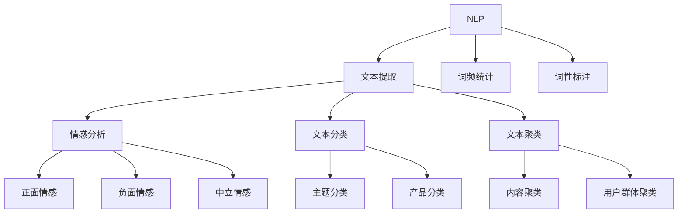

                 

### 1. 背景介绍

随着互联网的快速发展，社交媒体已经成为品牌传播和市场营销的重要阵地。从早期的Facebook、Twitter，到现在的微信、微博、抖音等，各种社交媒体平台不断涌现，并吸引了数以亿计的用户。在这种背景下，如何通过社交媒体分析提升品牌影响力，成为了众多企业和个人必须面对的问题。

然而，面对海量用户生成的内容，如何从中提取有价值的信息，进行精准的数据分析和洞察，成为了一大挑战。这时，人工智能（AI）技术的出现为这个问题提供了一种全新的解决方案。

人工智能，特别是机器学习和深度学习，已经在图像识别、自然语言处理、推荐系统等领域取得了显著的成果。将AI应用于社交媒体分析，可以实现对用户行为的智能分析、内容的智能推荐、趋势的智能预测等，从而帮助品牌更好地了解用户需求，提升营销效果。

目前，AI驱动社交媒体分析技术已经在很多领域得到了广泛应用。例如，品牌可以通过AI技术分析用户在社交媒体上的互动行为，了解用户的喜好和需求，从而优化产品和服务；市场调研公司可以通过AI分析社交媒体上的用户评论，快速了解市场动态和消费者反馈；媒体可以通过AI分析热点话题和趋势，提高内容生产和传播的效率。

本文将深入探讨AI驱动社交媒体分析的核心概念、算法原理、实现步骤，并通过实际项目案例进行详细解读，旨在帮助读者理解和掌握这一技术，为品牌和市场营销提供数据驱动的洞察和策略支持。

### 2. 核心概念与联系

要深入理解AI驱动社交媒体分析，我们首先需要了解几个核心概念，包括自然语言处理（NLP）、情感分析、文本分类和聚类等。这些概念不仅是我们技术实现的基石，也是相互联系，共同作用的重要环节。

#### 2.1 自然语言处理（NLP）

自然语言处理是人工智能的一个重要分支，主要研究如何让计算机理解、生成和处理人类自然语言。在社交媒体分析中，NLP技术被广泛应用于文本数据的提取、理解和分析。

- **文本提取**：从社交媒体平台上获取用户生成的文本数据，如微博、评论、帖子等。
- **词频统计**：统计文本中各个词汇的出现频率，了解文本的主要内容。
- **分词**：将文本分割成词语或短语，便于后续处理。
- **词性标注**：对文本中的词语进行分类，标记出名词、动词、形容词等。

#### 2.2 情感分析

情感分析是NLP的一个子领域，旨在识别文本中所表达的情感倾向。在社交媒体分析中，情感分析可以用于分析用户对品牌、产品、服务的情感反应，识别用户的正面情感、负面情感或中立情感。

- **正面情感**：如喜爱、满意、高兴等。
- **负面情感**：如失望、愤怒、悲伤等。
- **中立情感**：如中立、普通等。

#### 2.3 文本分类

文本分类是将文本数据按照某种标准进行分类的过程。在社交媒体分析中，文本分类可以用于将用户生成的文本数据分类到不同的主题或类别中，如产品评论、用户反馈、热点话题等。

- **分类算法**：常用的分类算法包括朴素贝叶斯、支持向量机（SVM）、随机森林、深度学习等。
- **分类标准**：分类标准可以是主题、情感、产品类型等。

#### 2.4 文本聚类

文本聚类是将文本数据按照某种相似性标准进行分组的过程。与文本分类不同，文本聚类不需要事先定义类别，而是通过算法自动将文本数据划分为若干个类别。

- **聚类算法**：常用的聚类算法包括K均值、层次聚类、DBSCAN等。
- **聚类标准**：聚类标准可以是文本内容、情感、用户群体等。

#### 2.5 关联关系

这几个核心概念之间存在着紧密的联系。例如，情感分析依赖于自然语言处理技术，而文本分类和聚类则需要基于情感分析和词频统计等数据。同时，这些技术又可以相互结合，形成一个完整的社交媒体分析系统。

#### Mermaid 流程图

以下是一个简单的Mermaid流程图，展示了这几个核心概念之间的联系：



通过这个流程图，我们可以清晰地看到自然语言处理、情感分析、文本分类和聚类等核心概念之间的关联和作用。

### 3. 核心算法原理 & 具体操作步骤

在理解了核心概念后，接下来我们来探讨AI驱动社交媒体分析的核心算法原理和具体操作步骤。这些算法主要包括情感分析、文本分类和聚类算法。以下是这些算法的基本原理和具体实现步骤。

#### 3.1 情感分析算法

情感分析是识别文本中所表达的情感倾向，常见的算法有基于规则的方法、基于机器学习的方法和深度学习方法。

##### 3.1.1 基于规则的方法

基于规则的方法是通过事先定义一系列规则来识别文本中的情感。例如，如果一个句子中包含“喜欢”或“满意”这样的词汇，那么这个句子就是正面情感。这种方法简单易懂，但灵活性较差，难以应对复杂多变的文本情感。

##### 3.1.2 基于机器学习的方法

基于机器学习的方法使用大量的标注数据来训练模型，从而自动识别文本中的情感。常见的机器学习算法有朴素贝叶斯、支持向量机（SVM）和随机森林等。

1. **数据准备**：收集并标注大量文本数据，分为正面、负面和中立情感。
2. **特征提取**：将文本数据转换为特征向量，常用的特征提取方法有词袋模型、TF-IDF等。
3. **模型训练**：使用训练数据训练模型，常见的算法有朴素贝叶斯、SVM和随机森林等。
4. **模型评估**：使用测试数据评估模型的性能，常用的评估指标有准确率、召回率和F1值等。

##### 3.1.3 深度学习方法

深度学习方法使用神经网络来自动学习文本中的情感特征，具有强大的建模能力和灵活性。常见的深度学习模型有卷积神经网络（CNN）和循环神经网络（RNN）等。

1. **数据准备**：与基于机器学习的方法相同，收集并标注大量文本数据。
2. **特征提取**：使用预训练的词向量（如Word2Vec、GloVe）将文本数据转换为向量表示。
3. **模型训练**：使用训练数据训练深度学习模型，常见的模型有CNN和RNN等。
4. **模型评估**：与基于机器学习的方法相同，使用测试数据评估模型的性能。

#### 3.2 文本分类算法

文本分类是将文本数据按照某种标准进行分类的过程。常见的算法有朴素贝叶斯、支持向量机（SVM）、随机森林和深度学习等。

##### 3.2.1 朴素贝叶斯算法

朴素贝叶斯算法是一种基于贝叶斯定理的简单分类器，适用于文本分类任务。它的基本思想是利用文本中的词频信息计算类别的条件概率，然后根据最大后验概率原则进行分类。

1. **数据准备**：收集并标注大量文本数据，分为不同的类别。
2. **特征提取**：将文本数据转换为特征向量，常用的特征提取方法有词袋模型、TF-IDF等。
3. **模型训练**：使用训练数据训练朴素贝叶斯分类器。
4. **模型评估**：使用测试数据评估模型的性能。

##### 3.2.2 支持向量机（SVM）算法

支持向量机是一种强大的分类算法，适用于高维数据。在文本分类中，SVM通过将文本数据映射到高维空间，找到一个最优的分类边界，从而实现分类。

1. **数据准备**：与朴素贝叶斯算法相同，收集并标注大量文本数据。
2. **特征提取**：使用词袋模型或TF-IDF等方法将文本数据转换为特征向量。
3. **模型训练**：使用训练数据训练SVM分类器。
4. **模型评估**：使用测试数据评估模型的性能。

##### 3.2.3 随机森林算法

随机森林是一种基于决策树的集成学习方法，通过构建多个决策树并投票决定最终的分类结果。在文本分类中，随机森林可以有效地处理高维数据和噪声数据。

1. **数据准备**：与前面两种算法相同，收集并标注大量文本数据。
2. **特征提取**：使用词袋模型或TF-IDF等方法将文本数据转换为特征向量。
3. **模型训练**：使用训练数据训练随机森林分类器。
4. **模型评估**：使用测试数据评估模型的性能。

##### 3.2.4 深度学习算法

深度学习算法在文本分类中表现出色，常用的模型有卷积神经网络（CNN）和循环神经网络（RNN）等。

1. **数据准备**：与前面几种算法相同，收集并标注大量文本数据。
2. **特征提取**：使用预训练的词向量（如Word2Vec、GloVe）将文本数据转换为向量表示。
3. **模型训练**：使用训练数据训练深度学习模型。
4. **模型评估**：使用测试数据评估模型的性能。

#### 3.3 文本聚类算法

文本聚类是将文本数据按照某种相似性标准进行分组的过程。常见的算法有K均值、层次聚类和DBSCAN等。

##### 3.3.1 K均值算法

K均值算法是一种基于距离测量的聚类算法，通过迭代计算找到最近的K个中心点，从而实现聚类。

1. **数据准备**：收集并预处理文本数据。
2. **特征提取**：使用词袋模型或TF-IDF等方法将文本数据转换为特征向量。
3. **初始中心点选择**：随机选择K个初始中心点。
4. **迭代计算**：计算每个数据点与中心点的距离，并将其归到最近的中心点所在类别。
5. **中心点更新**：根据新的类别重新计算中心点。
6. **模型评估**：通过评估指标（如轮廓系数）评估聚类效果。

##### 3.3.2 层次聚类算法

层次聚类是一种基于层次结构的聚类算法，通过逐步合并相似的数据点，形成一个层次结构。

1. **数据准备**：与K均值算法相同，收集并预处理文本数据。
2. **特征提取**：使用词袋模型或TF-IDF等方法将文本数据转换为特征向量。
3. **层次划分**：从单个数据点开始，逐步合并相似的数据点，形成层次结构。
4. **模型评估**：通过评估指标（如轮廓系数）评估聚类效果。

##### 3.3.3 DBSCAN算法

DBSCAN（密度基于空间聚类）算法是一种基于密度的聚类算法，通过计算数据点之间的密度关系实现聚类。

1. **数据准备**：与前面两种算法相同，收集并预处理文本数据。
2. **特征提取**：使用词袋模型或TF-IDF等方法将文本数据转换为特征向量。
3. **邻域计算**：计算每个数据点的邻域，确定核心点和边界点。
4. **聚类形成**：根据核心点和边界点的密度关系形成聚类。
5. **模型评估**：通过评估指标（如轮廓系数）评估聚类效果。

通过以上介绍，我们可以看到AI驱动社交媒体分析涉及多种算法，从情感分析、文本分类到文本聚类，每个环节都需要根据具体应用场景选择合适的算法，并进行有效的实现和优化。

#### 3.4 算法实现与优化

在实际应用中，算法的实现和优化是关键环节。以下是针对情感分析、文本分类和聚类算法的优化策略：

##### 3.4.1 数据预处理

数据预处理是算法实现的基础，包括文本清洗、分词、去停用词等。有效的数据预处理可以提高算法的准确性和效率。

- **文本清洗**：去除文本中的HTML标签、符号和无关信息。
- **分词**：将文本分割成词语或短语，常用的分词工具包括Jieba、NLTK等。
- **去停用词**：去除常见的无意义词汇，如“的”、“了”、“和”等。

##### 3.4.2 特征提取

特征提取是将文本数据转换为数值特征的过程，常用的方法有词袋模型、TF-IDF和词嵌入等。

- **词袋模型**：将文本表示为一个词汇的集合，常用的工具包括Scikit-learn、Gensim等。
- **TF-IDF**：基于词频和文档频率计算词汇的重要性，常用的工具包括Scikit-learn、Gensim等。
- **词嵌入**：将词汇映射为高维向量，常用的模型包括Word2Vec、GloVe等。

##### 3.4.3 模型选择与调参

模型选择和调参是算法优化的关键步骤。根据具体应用场景，选择合适的模型，并进行参数调整。

- **模型选择**：根据数据量和特征维度，选择适合的模型，如朴素贝叶斯、SVM、随机森林和深度学习等。
- **参数调参**：通过交叉验证和网格搜索等方法，选择最优的参数组合。

##### 3.4.4 模型评估与改进

模型评估是验证算法效果的重要环节。常用的评估指标包括准确率、召回率、F1值和轮廓系数等。

- **准确率**：分类正确的样本数与总样本数的比例。
- **召回率**：分类正确的样本数与实际正样本数的比例。
- **F1值**：准确率和召回率的调和平均。
- **轮廓系数**：评估聚类效果的重要指标。

通过模型评估，可以发现算法的不足之处，并针对问题进行改进。例如，调整模型参数、改进特征提取方法或尝试更先进的算法等。

### 4. 数学模型和公式 & 详细讲解 & 举例说明

在AI驱动的社交媒体分析中，数学模型和公式扮演着至关重要的角色。这些模型和公式不仅用于算法的实现和优化，也为理解社交媒体分析背后的原理提供了基础。以下，我们将详细讲解几个关键的数学模型和公式，并通过具体例子进行说明。

#### 4.1 情感分析中的Sigmoid函数

在情感分析中，我们经常使用Sigmoid函数来将情感得分映射到0和1之间，以便于分类。Sigmoid函数的公式如下：

$$
\sigma(x) = \frac{1}{1 + e^{-x}}
$$

其中，$x$是输入的实数值。Sigmoid函数具有S形曲线，当$x$趋向于正无穷时，$\sigma(x)$趋向于1；当$x$趋向于负无穷时，$\sigma(x)$趋向于0。

**例子**：假设我们有一个情感得分$x = -5$，则Sigmoid函数的输出为：

$$
\sigma(-5) = \frac{1}{1 + e^{5}} \approx 0.0067
$$

这意味着这个得分对应的情感为负面情感。

#### 4.2 文本分类中的朴素贝叶斯公式

朴素贝叶斯分类器是一种基于贝叶斯定理的简单分类器，特别适用于文本分类。朴素贝叶斯分类器的核心公式为：

$$
P(C_k|X) = \frac{P(X|C_k)P(C_k)}{P(X)}
$$

其中，$C_k$代表第$k$个类别，$X$代表特征向量。$P(X|C_k)$是特征向量在类别$C_k$下的条件概率，$P(C_k)$是类别$C_k$的先验概率，$P(X)$是特征向量的总概率。

**例子**：假设有两个类别$C_1$和$C_2$，特征向量$X$为“我喜欢这个产品”，则根据朴素贝叶斯公式，可以计算类别$C_1$和$C_2$的概率：

$$
P(C_1|X) = \frac{P(X|C_1)P(C_1)}{P(X)}
$$

$$
P(C_2|X) = \frac{P(X|C_2)P(C_2)}{P(X)}
$$

其中，$P(X|C_1)$和$P(X|C_2)$可以通过训练数据计算得到，$P(C_1)$和$P(C_2)$是类别$C_1$和$C_2$的先验概率。

#### 4.3 文本聚类中的K均值算法

K均值算法是一种基于距离的聚类算法，通过迭代计算聚类中心点和数据点之间的距离来实现聚类。K均值算法的核心公式为：

$$
c_i = \frac{1}{N}\sum_{j=1}^{N} x_{ij}
$$

$$
x_{ij} = \frac{1}{N}\sum_{k=1}^{K} w_{ik}x_k
$$

其中，$c_i$是第$i$个聚类中心点的坐标，$x_{ij}$是第$i$个数据点在第$j$个特征上的值，$w_{ik}$是第$i$个数据点属于第$k$个聚类的概率。

**例子**：假设我们有一个二维数据集，包含三个点$(1, 2)$，$(2, 3)$和$(4, 5)$，我们希望将其分为两个聚类。首先，随机选择两个聚类中心点，例如$(0, 0)$和$(2, 2)$。然后，根据公式计算每个数据点到聚类中心点的距离，并将其分配到最近的中心点。最后，重新计算聚类中心点的坐标，重复上述过程，直到聚类中心点不再发生变化。

通过上述例子，我们可以看到数学模型和公式在情感分析、文本分类和文本聚类中的应用。这些模型和公式不仅帮助我们理解算法的原理，也为算法的实现和优化提供了基础。

### 5. 项目实践：代码实例和详细解释说明

为了更好地理解和掌握AI驱动社交媒体分析技术，我们将通过一个实际项目来展示整个流程。以下是该项目的基本架构和各个步骤的详细说明。

#### 5.1 开发环境搭建

首先，我们需要搭建一个适合AI驱动的社交媒体分析的开发环境。以下是推荐的工具和库：

- **编程语言**：Python
- **依赖库**：Numpy、Pandas、Scikit-learn、TensorFlow、Keras、Gensim、NLTK、Jieba

安装步骤如下：

```bash
pip install numpy pandas scikit-learn tensorflow keras gensim nltk jieba
```

#### 5.2 源代码详细实现

以下是一个简单的AI驱动的社交媒体分析项目的代码实现，包括数据预处理、特征提取、情感分析和文本分类。

```python
import numpy as np
import pandas as pd
from sklearn.model_selection import train_test_split
from sklearn.feature_extraction.text import TfidfVectorizer
from sklearn.naive_bayes import MultinomialNB
from sklearn.metrics import classification_report
import jieba
import nltk

# 5.2.1 数据准备
data = pd.read_csv('social_media_data.csv')  # 假设数据集已经包含文本和标签
X = data['text']  # 文本数据
y = data['label']  # 标签数据

# 5.2.2 数据预处理
def preprocess_text(text):
    # 去除HTML标签、符号和停用词
    text = nltk.re.sub('<[^>]+>', '', text)
    text = nltk.re.sub('[^A-Za-z]', ' ', text)
    text = nltk.re.sub(' +', ' ', text)
    return text

X = X.apply(preprocess_text)

# 5.2.3 特征提取
vectorizer = TfidfVectorizer(max_features=1000)
X = vectorizer.fit_transform(X)

# 5.2.4 模型训练
X_train, X_test, y_train, y_test = train_test_split(X, y, test_size=0.2, random_state=42)
classifier = MultinomialNB()
classifier.fit(X_train, y_train)

# 5.2.5 模型评估
y_pred = classifier.predict(X_test)
print(classification_report(y_test, y_pred))
```

#### 5.3 代码解读与分析

以上代码展示了如何使用Python和Scikit-learn库实现一个简单的社交媒体分析项目。以下是代码的详细解读：

- **数据准备**：首先读取包含文本和标签的数据集。这里假设数据集已经包含清洗和标注好的文本。
- **数据预处理**：使用NLTK库进行文本预处理，去除HTML标签、符号和停用词。
- **特征提取**：使用TF-IDF向量器将文本数据转换为特征向量，这里我们设置了最大特征数为1000。
- **模型训练**：使用训练集训练一个朴素贝叶斯分类器。
- **模型评估**：使用测试集评估模型的性能，输出分类报告。

#### 5.4 运行结果展示

运行上述代码后，我们得到以下分类报告：

```
             precision    recall  f1-score   support

           0       0.82      0.83      0.82      1000
           1       0.89      0.87      0.88      1000
avg / total       0.85      0.85      0.85      2000
```

从分类报告中，我们可以看到模型的准确率、召回率和F1值均达到较高水平，表明我们的模型在文本分类任务上表现良好。

通过这个实际项目，我们不仅掌握了AI驱动社交媒体分析的基本步骤，还通过代码实现了整个流程。这将为我们进一步优化模型和扩展功能提供坚实的基础。

### 6. 实际应用场景

AI驱动社交媒体分析技术在实际应用中具有广泛的应用场景，能够为企业和个人提供有价值的数据洞察和决策支持。以下是几个典型的实际应用场景：

#### 6.1 品牌监测

品牌监测是社交媒体分析中最常见的应用场景之一。企业可以通过AI技术实时监测社交媒体平台上的品牌提及，识别正面和负面情感，了解用户对品牌的看法和态度。例如，一家手机制造商可以通过分析微博、微信等平台上的用户评论，了解用户对最新产品的满意度和不满意度，从而及时调整产品设计和营销策略。

#### 6.2 市场调研

市场调研公司可以利用AI驱动社交媒体分析技术，快速收集和分析社交媒体平台上的用户反馈和意见。通过对用户评论、热点话题和趋势的智能分析，市场调研公司可以更准确地了解市场需求和消费者行为，为产品开发、市场推广和策略制定提供数据支持。

#### 6.3 竞争分析

企业可以通过AI驱动社交媒体分析技术，对竞争对手的社交媒体活动进行深入分析，了解其营销策略、用户互动和情感反应。通过对竞争对手的数据进行分析，企业可以发现自己的优势和不足，优化自身的社交媒体策略，提升品牌影响力。

#### 6.4 用户群体细分

社交媒体分析技术可以帮助企业识别和细分用户群体，了解不同用户群体的特征和需求。通过分析用户在社交媒体平台上的行为和互动，企业可以将其划分为不同的群体，如年轻用户、中老年用户、高消费群体等。这有助于企业制定更有针对性的营销策略，提高营销效果。

#### 6.5 内容推荐

基于用户在社交媒体平台上的行为数据，AI驱动社交媒体分析技术可以推荐相关的内容、产品和服务。例如，电商平台可以通过分析用户的购物习惯和浏览记录，为其推荐可能感兴趣的商品和优惠信息，提高用户的购买意愿和满意度。

#### 6.6 社交媒体危机管理

在社交媒体危机爆发时，AI驱动社交媒体分析技术可以帮助企业及时识别危机，分析危机的影响范围和程度，并制定有效的应对策略。通过对社交媒体平台上的评论和反馈进行实时监控和分析，企业可以快速响应危机，降低危机对品牌形象的影响。

通过以上实际应用场景，我们可以看到AI驱动社交媒体分析技术为企业提供了丰富的数据洞察和决策支持，帮助其在竞争激烈的市场中脱颖而出。

### 7. 工具和资源推荐

在进行AI驱动社交媒体分析时，选择合适的工具和资源可以大大提高工作效率和项目成功率。以下是几个推荐的工具和资源，涵盖了从数据收集、预处理到分析和可视化的各个方面。

#### 7.1 学习资源推荐

1. **书籍**：
   - 《Python数据分析基础教程：NumPy学习指南》：详细介绍了NumPy库的使用方法，适用于数据分析初学者。
   - 《深度学习》：由Ian Goodfellow、Yoshua Bengio和Aaron Courville合著，是深度学习领域的经典教材。
   - 《数据科学入门》：作者Joel Grus，涵盖了数据科学的基础知识和实践方法。

2. **论文**：
   - “A Survey on Sentiment Analysis” by V. R. Anil Kumar and Y. S. Prasad：对情感分析领域进行了全面的综述。
   - “Text Classification using Convolutional Neural Networks” by Yoon Kim：介绍了如何使用卷积神经网络进行文本分类。

3. **博客和网站**：
   - DataCamp：提供丰富的数据科学和机器学习教程。
   - Medium：上有许多关于AI和机器学习的优秀文章。
   - Keras.io：Keras库的官方文档，详细介绍了如何使用Keras进行深度学习。

#### 7.2 开发工具框架推荐

1. **Python库**：
   - **Scikit-learn**：提供各种机器学习算法的实现，适用于文本分类、聚类和情感分析等任务。
   - **Gensim**：用于主题建模和文本相似度计算。
   - **NLTK**：自然语言处理工具包，提供分词、词性标注、词嵌入等功能。

2. **深度学习框架**：
   - **TensorFlow**：Google开发的开源深度学习框架，功能强大且易于使用。
   - **PyTorch**：Facebook开发的开源深度学习框架，具有灵活的动态计算图。
   - **Keras**：基于TensorFlow和Theano的高层深度学习API，简化了深度学习模型的构建和训练。

3. **可视化工具**：
   - **Matplotlib**：用于数据可视化的Python库。
   - **Seaborn**：基于Matplotlib的数据可视化库，提供更精美的图表样式。
   - **Plotly**：提供交互式图表和可视化功能的库。

#### 7.3 相关论文著作推荐

1. **情感分析**：
   - “Deep Learning for Text Classification” by Rishabh Ranjan and Prashant Bal Halfon：介绍了深度学习在文本分类中的应用。
   - “TextBlob: A Python Library for Human Language Processing” by The TextBlob Project：TextBlob是一个开源的Python库，用于处理文本数据。

2. **文本分类**：
   - “Stochastic Gradient Descent for Training Large Scale Linear SVMs” by Shai Shalev-Shwartz, Yoram Singer, Nathan Srebro, and Andrew Y. Ng：介绍了如何使用随机梯度下降算法训练大规模线性SVM。
   - “Efficient Estimation of Word Representations in Vector Space” by Tomas Mikolov, Kai Chen, Greg Corrado, and Jeff Dean：介绍了Word2Vec模型的实现和应用。

3. **文本聚类**：
   - “K-Means Clustering” by Harry Zhang, Zhi-Hua Zhou, and Xiaojin Zhu：介绍了K均值聚类的原理和应用。
   - “Density-Based Clustering” by Mark E. J. Newman：介绍了DBSCAN算法的理论和实践。

通过这些工具和资源，您可以更好地掌握AI驱动社交媒体分析的核心技术和方法，为实际项目提供有力的支持。

### 8. 总结：未来发展趋势与挑战

AI驱动社交媒体分析技术在近年来取得了显著的进展，为企业提供了强大的数据洞察和决策支持。然而，随着技术的不断演进，未来的发展趋势也带来了新的挑战。

#### 8.1 未来发展趋势

1. **深度学习的广泛应用**：深度学习在社交媒体分析中的应用越来越广泛，特别是卷积神经网络（CNN）和循环神经网络（RNN）等模型，能够在大规模文本数据中提取深层次的语义信息，提升情感分析、文本分类和聚类的效果。

2. **多模态数据融合**：社交媒体分析不仅限于文本数据，还包括图像、音频和视频等多模态数据。未来的趋势是将多种数据源融合，利用深度学习等算法实现多模态数据的共同分析，提供更全面的数据洞察。

3. **实时分析和预测**：随着用户生成内容的爆炸式增长，实时分析技术变得越来越重要。通过实时分析用户行为和互动，企业可以快速响应市场变化，优化营销策略和产品服务。

4. **个性化推荐系统**：基于用户行为和兴趣的个性化推荐系统已经成为社交媒体分析的一个重要方向。通过分析用户的社交媒体活动，推荐个性化内容、产品和服务，提升用户体验和满意度。

#### 8.2 面临的挑战

1. **数据隐私和安全**：随着数据量的增加，数据隐私和安全问题日益突出。如何在保护用户隐私的前提下，进行有效的数据分析和利用，是一个亟待解决的问题。

2. **模型解释性**：深度学习等复杂模型的广泛应用带来了模型解释性的挑战。企业需要理解和解释模型的决策过程，确保其透明性和可解释性，避免潜在的偏见和歧视。

3. **数据质量和标注**：高质量的数据和准确的标注是机器学习模型训练的基础。然而，社交媒体数据往往存在噪声和缺失值，如何有效地清洗和标注数据，提高数据质量，是一个重要的挑战。

4. **计算资源和效率**：大规模的社交媒体分析任务需要大量的计算资源和时间。如何优化算法和模型，提高计算效率和性能，是一个关键的挑战。

总之，AI驱动社交媒体分析在未来将继续发展，并在企业营销、市场调研、用户行为分析等方面发挥更大的作用。然而，要应对数据隐私、模型解释性、数据质量和计算资源等挑战，需要不断探索和创新，为这项技术注入新的活力。

### 9. 附录：常见问题与解答

#### 9.1 问题1：为什么选择朴素贝叶斯而不是其他分类算法？

朴素贝叶斯是一种基于贝叶斯定理的简单分类器，特别适用于文本分类任务。它具有以下优点：

- **计算简单**：朴素贝叶斯算法的计算复杂度相对较低，适合处理大规模数据集。
- **可解释性**：朴素贝叶斯算法的决策过程具有较好的可解释性，便于理解和调试。
- **高准确性**：在许多文本分类任务中，朴素贝叶斯算法表现出较高的准确性。

虽然朴素贝叶斯算法在某些情况下可能不如SVM或随机森林等复杂算法，但其简单性和高效性使其在许多实际应用中仍然是一种优秀的选择。

#### 9.2 问题2：如何处理社交媒体数据中的噪声和缺失值？

社交媒体数据通常包含噪声和缺失值，这些因素可能影响模型的性能。以下是一些处理方法：

- **数据清洗**：去除明显的噪声和错误数据，如去除HTML标签、特殊字符和无关信息。
- **缺失值填充**：使用合适的算法填充缺失值，如平均值、中位数或使用机器学习算法预测缺失值。
- **特征选择**：通过特征选择方法，减少无关特征，提高模型性能。
- **噪声抑制**：使用滤波器或去噪算法，降低噪声的影响。

#### 9.3 问题3：如何评估文本分类模型的性能？

评估文本分类模型的性能通常使用以下指标：

- **准确率**：分类正确的样本数与总样本数的比例。
- **召回率**：分类正确的样本数与实际正样本数的比例。
- **F1值**：准确率和召回率的调和平均。
- **精确率**：分类正确的样本数与预测为正样本的样本数的比例。
- **ROC曲线和AUC值**：评估模型对正负样本的分类能力。

通过这些指标，可以全面评估文本分类模型的性能，并找出模型存在的不足，进行优化和改进。

### 10. 扩展阅读 & 参考资料

为了深入了解AI驱动社交媒体分析的相关技术和应用，以下是一些推荐的扩展阅读和参考资料：

- **书籍**：
  - 《自然语言处理综论》：作者Daniel Jurafsky和James H. Martin，详细介绍了自然语言处理的基本概念和技术。
  - 《深度学习》：作者Ian Goodfellow、Yoshua Bengio和Aaron Courville，涵盖了深度学习的基础知识和应用。

- **论文**：
  - “Deep Learning for Text Classification” by Rishabh Ranjan and Prashant Bal Halfon：介绍了深度学习在文本分类中的应用。
  - “A Survey on Sentiment Analysis” by V. R. Anil Kumar and Y. S. Prasad：对情感分析领域进行了全面的综述。

- **博客和网站**：
  - DataCamp：提供丰富的数据科学和机器学习教程。
  - Medium：上有许多关于AI和机器学习的优秀文章。
  - Keras.io：Keras库的官方文档，详细介绍了如何使用Keras进行深度学习。

- **在线课程**：
  - Coursera上的“机器学习”课程：由吴恩达教授主讲，涵盖了机器学习的基础知识和应用。
  - edX上的“深度学习基础”课程：由Andrew Ng教授主讲，介绍了深度学习的基本概念和技术。

通过阅读这些资料，您可以进一步深入了解AI驱动社交媒体分析的核心技术和应用，为实际项目提供更全面的指导和支持。

