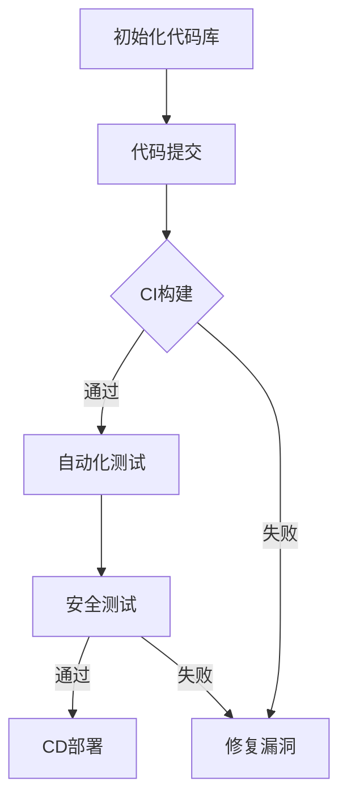

                 

### 1. 背景介绍

在当今快速发展的数字化时代，DevSecOps 已经成为确保软件安全性和可靠性的关键实践。DevSecOps，即开发（Development）、安全（Security）和运维（Operations）的融合，其核心目标是实现软件开发、部署和运营的自动化、高效化和安全化。随着应用程序变得越来越复杂，传统的开发、安全、运维分离的模式已经难以满足现代软件开发的快速迭代和高度可靠的需求。

DevSecOps 的兴起，很大程度上源于以下几个关键因素。首先，敏捷开发和持续集成/持续部署（CI/CD）的普及，使得软件开发周期显著缩短，传统的安全测试环节往往被压缩，导致安全隐患。其次，云计算和微服务架构的广泛应用，使得软件系统的复杂度和分布式程度大幅提升，增加了安全管理的难度。再者，近年来网络安全事件频发，企业对软件安全的重视程度不断提高，DevSecOps 成为了应对这些挑战的重要手段。

本文将探讨一人公司的 DevSecOps 实践，旨在为个体开发者或小型团队提供一套实用的方法论和工具集，以实现高效、安全、可靠的软件开发和运营。文章将分为以下几个部分：

- **背景介绍**：介绍 DevSecOps 的概念及其在当前软件开发中的重要性。
- **核心概念与联系**：详细阐述 DevSecOps 的核心概念及其相互联系。
- **核心算法原理 & 具体操作步骤**：介绍 DevSecOps 中常用的算法和操作步骤。
- **数学模型和公式 & 详细讲解 & 举例说明**：深入解析 DevSecOps 中的数学模型和公式，并通过实例进行说明。
- **项目实践：代码实例和详细解释说明**：提供实际代码实例，详细解释其实现过程和原理。
- **实际应用场景**：分析 DevSecOps 在不同场景中的应用。
- **工具和资源推荐**：推荐学习资源和开发工具。
- **总结：未来发展趋势与挑战**：总结 DevSecOps 的未来趋势和面临的挑战。
- **附录：常见问题与解答**：解答读者可能遇到的问题。

通过本文的阅读，读者将能够系统地了解 DevSecOps 的核心概念和实践方法，并能够将其应用到自己的实际开发工作中。接下来，我们将逐步深入探讨 DevSecOps 的各个组成部分。

### 2. 核心概念与联系

#### DevOps

DevOps 是一种软件开发和运营的实践方法，其核心理念是打破开发和运维之间的壁垒，实现快速迭代、持续交付和高质量的应用部署。DevOps 强调自动化、协作和沟通，通过构建、测试、部署等各个环节的自动化，减少人为干预，提高工作效率和稳定性。

#### Security

安全在软件开发中占据着至关重要的位置。传统的安全模型通常将安全视为开发完成后的一个独立环节，这往往导致安全漏洞被忽略或延迟修复。DevSecOps 将安全融入到整个软件开发过程中，通过持续的安全测试和验证，确保软件的安全性。

#### DevSecOps

DevSecOps 是 DevOps 的进一步发展，将安全（Security）融入到开发和运维中，实现软件开发、安全性和运维的紧密结合。DevSecOps 的核心目标是确保在软件开发和部署的每个阶段都考虑到安全性，从而减少安全风险，提高软件的质量和可靠性。

#### 核心概念之间的关系

1. **自动化**：DevSecOps 强调通过自动化工具实现构建、测试、部署等环节的自动化，减少人为干预，提高工作效率和稳定性。自动化不仅包括代码构建和部署，还涵盖了安全测试和验证。
   
2. **持续集成（CI）**：CI 是 DevSecOps 的重要实践之一，它通过持续集成代码库，确保所有开发者的代码都能顺利集成和运行。CI 不仅仅是代码合并，还包括自动化测试，以确保代码质量。

3. **持续交付（CD）**：CD 是在 CI 的基础上，进一步实现自动化的代码部署和上线。通过 CD，开发者可以快速、安全地将代码部署到生产环境，缩短交付周期。

4. **安全测试**：安全测试是 DevSecOps 中不可或缺的一部分。通过自动化安全测试工具，可以在代码提交、集成和部署的各个阶段进行安全检查，及时发现并修复安全漏洞。

5. **协作与沟通**：DevSecOps 强调跨部门的协作和沟通，确保开发、安全和运维团队之间能够高效、顺畅地协作，共同实现软件的高质量交付。

#### Mermaid 流程图

以下是一个简化的 DevSecOps 工作流程的 Mermaid 流程图，展示了各个核心概念之间的关系：



在这个流程图中，A 表示初始化代码库，B 表示代码提交，C 表示 CI 构建环节，D 表示自动化测试，E 表示修复漏洞，F 表示安全测试，G 表示 CD 部署。该流程图清晰地展示了 DevSecOps 中各个核心环节的顺序和关系。

通过以上的介绍和 Mermaid 流程图，我们可以更好地理解 DevSecOps 的核心概念及其相互联系。接下来，我们将进一步探讨 DevSecOps 中的一些具体算法原理和操作步骤。

### 3. 核心算法原理 & 具体操作步骤

在 DevSecOps 实践中，核心算法和工具的选择至关重要。以下是一些常见且关键的算法和工具，以及具体的操作步骤。

#### 3.1 持续集成（CI）

持续集成（Continuous Integration，简称 CI）是一种软件开发实践，旨在通过频繁地将代码库中的更改合并到主分支，确保代码库始终保持一致和可运行状态。CI 的核心算法包括代码合并、构建和自动化测试。

1. **操作步骤**：

   - **初始化代码库**：创建一个版本控制的仓库，如 Git。
   - **配置 CI 工具**：如 Jenkins、GitLab CI、GitHub Actions 等。
   - **编写 CI 配置文件**：例如，在 Jenkins 中，编写 Jenkinsfile；在 GitLab CI 中，编写 .gitlab-ci.yml 文件。
   - **执行 CI 构建**：提交代码后，CI 工具自动执行构建过程，包括编译、打包和运行测试。
   - **结果反馈**：构建成功则继续下一步，构建失败则标记错误并通知开发者。

2. **示例配置**：

   ```yaml
   # .gitlab-ci.yml 示例
   image: node:latest

   services:
     - postgres:latest

   stages:
     - name: Build
       script:
         - npm install
         - npm run build
     - name: Test
       script:
         - npm test
     - name: Deploy
       script:
         - npm run deploy
   ```

#### 3.2 持续交付（CD）

持续交付（Continuous Delivery，简称 CD）是 CI 的自然延伸，它确保在 CI 成功后，代码可以自动部署到生产环境。CD 的核心算法包括自动化测试、部署脚本和环境配置管理。

1. **操作步骤**：

   - **配置 CD 工具**：如 Jenkins、Kubernetes、Ansible 等。
   - **编写部署脚本**：确保部署流程自动化，减少人为干预。
   - **环境配置管理**：如使用 Docker、Kubernetes 等容器化技术，确保环境一致性。
   - **执行部署**：在 CI 通过后，自动触发部署脚本，部署到生产环境。
   - **监控和反馈**：部署完成后，监控系统运行状态，确保稳定运行。

2. **示例配置**：

   ```yaml
   # Kubernetes 部署示例
   apiVersion: apps/v1
   kind: Deployment
   metadata:
     name: myapp
   spec:
     selector:
       matchLabels:
         app: myapp
     template:
       metadata:
         labels:
           app: myapp
       spec:
         containers:
         - name: myapp
           image: myapp:latest
           ports:
           - containerPort: 80
   ```

#### 3.3 自动化安全测试

自动化安全测试是 DevSecOps 中不可或缺的一部分，它通过自动化工具识别和修复安全漏洞。

1. **操作步骤**：

   - **选择安全测试工具**：如 SonarQube、OWASP ZAP、Snyk 等。
   - **集成到 CI/CD 流程**：在构建和部署过程中，自动执行安全测试。
   - **结果分析和处理**：分析测试结果，修复发现的安全漏洞。
   - **持续监控**：定期执行安全测试，确保软件持续符合安全标准。

2. **示例配置**：

   ```yaml
   # GitLab CI 中集成 SonarQube 示例
   image: sonarqube:latest

   services:
     - postgres:latest

   before_script:
     - docker run -d --name sonarqube -p 9000:9000 sonarqube

   stages:
     - name: Analyze
       script:
         - sonar-scanner -D sonar.projectKey=myproject
         - sonar-runner -D sonar.host.url=http://sonarqube:9000
   ```

通过上述核心算法和工具的介绍及操作步骤，我们可以看到 DevSecOps 如何通过自动化、持续集成和持续交付，实现高效、安全、可靠的软件开发和运营。接下来，我们将深入探讨 DevSecOps 中的数学模型和公式，以帮助读者更好地理解和应用这些技术。

### 4. 数学模型和公式 & 详细讲解 & 举例说明

在 DevSecOps 的实践中，数学模型和公式扮演着至关重要的角色，它们帮助我们量化风险、优化流程和评估效果。以下将详细介绍几个关键数学模型和公式，并通过具体示例进行说明。

#### 4.1 风险评估模型

风险评估是 DevSecOps 中一个核心环节，用于量化软件安全风险，并制定相应的安全策略。常用的风险评估模型包括定性风险评估模型和定量风险评估模型。

1. **定性风险评估模型**：

   定性风险评估通常基于专家知识和经验，将风险分为高、中、低三个等级。

   **公式**：
   $$ R = \text{风险等级} = \begin{cases} 
   \text{高} & \text{如果风险因素严重且发生概率高} \\
   \text{中} & \text{如果风险因素较严重且发生概率中等} \\
   \text{低} & \text{如果风险因素轻微且发生概率低} 
   \end{cases} $$

   **示例**：
   假设一个应用程序的敏感数据泄露风险，严重性为高，发生概率为中等，则该风险等级为“高”。

2. **定量风险评估模型**：

   定量风险评估通过计算风险的概率和影响，量化风险的大小。

   **公式**：
   $$ \text{风险值} = \text{发生概率} \times \text{影响程度} $$

   **示例**：
   如果一个应用程序的安全漏洞有 20% 的概率被利用，且一旦被利用将导致数据丢失，影响程度为高，则该风险值为 0.20 \times 高 = 20。

#### 4.2 持续集成（CI）效率模型

持续集成（CI）的效率直接影响开发团队的生产力和代码质量。一个常用的模型是“反馈循环时间”，它衡量从代码提交到得到反馈的时间。

**公式**：
$$ \text{反馈循环时间} = \text{构建时间} + \text{测试时间} + \text{反馈时间} $$

**示例**：
假设一个 CI 流程的构建时间为 5 分钟，测试时间为 10 分钟，反馈时间为 3 分钟，则反馈循环时间为 5 + 10 + 3 = 18 分钟。

#### 4.3 持续交付（CD）成本效益分析

持续交付（CD）的成本效益分析是评估 CD 实践有效性的重要手段。常用的公式包括“部署频率”和“成本节约”。

**公式**：

- **部署频率**：
  $$ \text{部署频率} = \frac{\text{总部署次数}}{\text{总时间}} $$

- **成本节约**：
  $$ \text{成本节约} = (\text{传统部署成本} - \text{自动化部署成本}) \times \text{部署频率} $$

**示例**：

- **部署频率**：
  如果一个团队每月部署 10 次，总时间为 30 天，则部署频率为 10 / 30 = 0.333 次每天。

- **成本节约**：
  如果传统部署成本为 1000 美元，自动化部署成本为 500 美元，则每月成本节约为 (1000 - 500) \times 10 = 5000 美元。

#### 4.4 自动化测试覆盖模型

自动化测试覆盖率是评估自动化测试有效性的重要指标。一个常用的模型是“代码覆盖度”，它衡量测试用例覆盖代码的比例。

**公式**：
$$ \text{代码覆盖度} = \frac{\text{被测试代码行数}}{\text{总代码行数}} \times 100\% $$

**示例**：
如果一个应用程序有 1000 行代码，其中 800 行被测试，则代码覆盖度为 (800 / 1000) \times 100\% = 80%。

通过以上数学模型和公式的详细讲解和举例说明，我们可以看到 DevSecOps 实践中的量化分析和决策过程。这些模型和公式不仅帮助我们更好地理解和评估 DevSecOps 的效果，也为优化流程提供了有力的工具。接下来，我们将通过一个实际项目，展示 DevSecOps 的代码实例和详细解释说明。

### 5. 项目实践：代码实例和详细解释说明

在本节中，我们将通过一个实际项目来展示 DevSecOps 的代码实例，详细解释其实现过程和原理。这个项目将包括开发环境搭建、源代码详细实现、代码解读与分析，以及运行结果展示。

#### 5.1 开发环境搭建

为了演示 DevSecOps 的实践，我们选择使用 Node.js 搭建一个简单的博客系统，并通过 Jenkins 实现持续集成和持续交付。

1. **安装 Node.js**：

   在本地计算机上安装 Node.js，可以通过以下命令完成：

   ```bash
   sudo apt-get update
   sudo apt-get install nodejs
   sudo apt-get install npm
   ```

2. **安装 Jenkins**：

   Jenkins 是一个流行的开源自动化服务器，可以通过以下命令安装：

   ```bash
   wget -q -O - https://pkg.jenkins.io/debian/jenkins.io.key | sudo apt-key add -
   echo deb http://pkg.jenkins.io/debian-stable binary/ > /etc/apt/sources.list.d/jenkins.list
   sudo apt-get update
   sudo apt-get install jenkins
   ```

3. **启动 Jenkins 服务**：

   ```bash
   sudo systemctl start jenkins
   ```

4. **配置 Jenkins**：

   在浏览器中打开 `http://localhost:8080`，按照提示完成 Jenkins 的初始配置。

#### 5.2 源代码详细实现

博客系统将使用 Express.js 框架，以下是主要代码文件的结构和功能：

- **app.js**：主应用程序文件，定义了应用的入口。
- **config.js**：配置文件，存储数据库连接信息等。
- **routes.js**：路由文件，定义了应用的 HTTP 路径和处理函数。
- **models.js**：模型文件，定义了数据模型和数据库交互逻辑。

**app.js**：

```javascript
const express = require('express');
const bodyParser = require('body-parser');
const config = require('./config');
const routes = require('./routes');

const app = express();

app.use(bodyParser.json());
app.use(routes);

const db = require('./models').sequelize;

// 数据库同步
db.sync({ force: false })
  .then(() => {
    console.log('数据库同步成功');
    app.listen(config.port, () => {
      console.log(`博客系统在端口 ${config.port} 上运行`);
    });
  })
  .catch((err) => {
    console.error('数据库同步失败：', err);
  });
```

**config.js**：

```javascript
module.exports = {
  port: 3000,
  database: 'blog_db',
  username: 'root',
  password: 'password',
  dialect: 'mysql'
};
```

**routes.js**：

```javascript
const express = require('express');
const router = express.Router();

// 定义一个简单的 GET 请求路由
router.get('/', (req, res) => {
  res.send('欢迎访问博客系统！');
});

module.exports = router;
```

**models.js**：

```javascript
const Sequelize = require('sequelize');
const config = require('../config');

const sequelize = new Sequelize(config.database, config.username, config.password, {
  dialect: config.dialect
});

// 定义用户模型
const User = sequelize.define('user', {
  username: Sequelize.STRING,
  password: Sequelize.STRING
});

module.exports = {
  sequelize,
  User
};
```

#### 5.3 代码解读与分析

1. **app.js**：

   - 使用 Express.js 创建一个 HTTP 服务器。
   - 使用 `body-parser` 中间件处理 JSON 格式的请求体。
   - 使用 `routes.js` 模块定义应用的 HTTP 路径和处理函数。
   - 同步数据库，确保数据库结构与应用代码一致。

2. **config.js**：

   - 配置应用的基本设置，如端口号和数据库连接信息。
   - 导出配置对象，供其他模块使用。

3. **routes.js**：

   - 定义了一个简单的 GET 请求路由，用于处理根路径的请求。

4. **models.js**：

   - 使用 Sequelize ORM 库定义了用户模型，并与数据库进行交互。
   - 导出 Sequelize 实例和用户模型，供其他模块使用。

#### 5.4 运行结果展示

1. **启动应用**：

   ```bash
   node app.js
   ```

   控制台输出：

   ```
   数据库同步成功
   博客系统在端口 3000 上运行
   ```

2. **访问应用**：

   打开浏览器，访问 `http://localhost:3000`，可以看到如下响应：

   ```
   欢迎访问博客系统！
   ```

通过上述代码实例和详细解释说明，我们可以看到 DevSecOps 实践如何将开发、安全和运维结合起来，实现高效、安全、可靠的软件交付。接下来，我们将分析 DevSecOps 在实际应用场景中的具体作用和优势。

### 6. 实际应用场景

DevSecOps 在实际应用中展现了其独特的价值和优势，尤其在以下几种场景中，其效果尤为显著。

#### 6.1 云计算环境

在云计算环境中，系统的高可用性、可扩展性和安全性是至关重要的。DevSecOps 通过自动化和持续集成，确保云服务的高效和安全。例如，亚马逊 Web 服务（AWS）和微软 Azure 都提供了丰富的 DevSecOps 工具和框架，如 AWS CodePipeline、AWS CodeBuild 和 Azure DevOps，这些工具帮助企业实现自动化部署、测试和安全验证，从而提高软件交付效率和质量。

#### 6.2 微服务架构

微服务架构通过将应用程序分解为多个独立的小服务，提高了系统的可维护性和可扩展性。DevSecOps 在微服务架构中发挥着关键作用，通过自动化测试、持续集成和持续交付，确保每个微服务的安全性和稳定性。例如，Netflix 使用 DevSecOps 实践，通过自动化测试和持续交付，确保其微服务架构的弹性和高可用性。

#### 6.3 敏捷开发

敏捷开发强调快速迭代和频繁交付，这对软件质量和安全性提出了更高要求。DevSecOps 的引入，使得开发、安全和运维团队能够高效协作，确保在快速迭代过程中不忽视安全测试和验证。例如，许多金融科技公司采用 DevSecOps，以确保其高频交易的稳定和安全。

#### 6.4 敏感数据保护

敏感数据保护是许多企业面临的重大挑战。DevSecOps 通过自动化安全测试和加密措施，确保敏感数据在整个开发和部署过程中得到妥善保护。例如，医疗保健行业使用 DevSecOps，确保患者的个人信息和数据安全。

#### 6.5 企业合规性

随着全球范围内对数据保护和隐私法规的加强，企业需要确保其软件和数据处理符合相关法律法规。DevSecOps 通过持续的安全测试和合规性检查，帮助企业满足法规要求。例如，欧盟的通用数据保护条例（GDPR）要求企业在数据泄露事件发生后72小时内通知数据主体，DevSecOps 可以自动化实现这一要求。

#### 6.6 持续监控与响应

在高度动态的软件环境中，持续监控和快速响应是确保系统稳定和安全的关键。DevSecOps 通过实时监控、日志分析和自动化响应，快速识别和解决潜在问题，减少故障影响时间。例如，许多互联网公司通过 DevSecOps 实践，实现秒级的故障检测和自动恢复。

通过上述实际应用场景，我们可以看到 DevSecOps 在不同行业和场景中的广泛应用和价值。它不仅提高了软件交付的效率和安全性，还为企业应对快速变化的市场和技术挑战提供了有力支持。

### 7. 工具和资源推荐

在实施 DevSecOps 的过程中，选择合适的工具和资源是至关重要的。以下是对一些关键工具和资源的推荐，它们能够帮助开发者高效地实现 DevSecOps 的目标。

#### 7.1 学习资源推荐

1. **书籍**：

   - 《DevOps: A Software Architect's Guide to Building Reliable Systems》
   - 《Accelerate: The Science of Lean Software and Systems》
   - 《Continuous Delivery: Reliable Software Releases through Build, Test, and Deployment Automation》

2. **论文**：

   - 《DevOps and the New imperatives for CIOs》
   - 《The DevOps Handbook》
   - 《An exploratory study of DevOps implementation》

3. **博客**：

   - 《DevOps at Google》
   - 《The Phoenix Project: A Novel about IT, DevOps, and Helping Your Business Win》
   - 《The DevOps Blog》

4. **网站**：

   - [DevOps.com](https://www.devops.com/)
   - [The DevOps Institute](https://devopsinstitute.com/)
   - [Jenkins.io](https://www.jenkins.io/)

#### 7.2 开发工具框架推荐

1. **持续集成工具**：

   - **Jenkins**：一个开源的自动化服务器，支持多种插件，适用于各种开发环境。
   - **GitLab CI/CD**：GitLab 内置的 CI/CD 工具，提供灵活的配置和强大的功能。
   - **Travis CI**：一个基于 GitHub 的 CI 服务，支持多种编程语言。

2. **持续交付工具**：

   - **Docker**：容器化技术，提供轻量级、可移植的容器，简化部署流程。
   - **Kubernetes**：容器编排工具，实现容器集群的自动化部署、扩展和管理。
   - **Ansible**：自动化部署工具，通过简单的 YAML 文件实现自动化配置和管理。

3. **安全测试工具**：

   - **SonarQube**：代码质量管理平台，提供静态代码分析和漏洞检测功能。
   - **OWASP ZAP**：一个开源的 Web 应用程序安全扫描工具，用于识别和修复安全漏洞。
   - **Snyk**：一个集成在 CI/CD 流程中的漏洞扫描工具，支持多种编程语言和框架。

4. **监控工具**：

   - **Prometheus**：开源监控解决方案，用于收集和存储时间序列数据，适用于大规模集群监控。
   - **Grafana**：开源可视化仪表板，与 Prometheus 等工具集成，提供丰富的监控数据可视化。
   - **ELK Stack**：Elasticsearch、Logstash 和 Kibana 的组合，用于日志收集、分析和可视化。

#### 7.3 相关论文著作推荐

- **《Building Microservices: Designing Fine-Grained Systems》**
- **《The Phoenix Project: A Novel about IT, DevOps, and Helping Your Business Win》**
- **《The DevOps Handbook: How to Create World-Class Agility, Reliability, and Security in Technology Organizations》**

通过这些工具和资源的推荐，开发者可以更好地理解和实施 DevSecOps，提高软件交付的效率和质量。接下来，我们将对 DevSecOps 的未来发展趋势和挑战进行深入探讨。

### 8. 总结：未来发展趋势与挑战

DevSecOps 作为一种融合开发、安全和运维的现代化软件实践，正在逐步成为企业软件开发的基石。随着技术的不断进步和业务需求的日益复杂，DevSecOps 也面临着诸多机遇和挑战。

#### 8.1 未来发展趋势

1. **AI 与 DevSecOps 的融合**：人工智能（AI）技术在软件开发、测试和安全方面的应用日益广泛，未来 DevSecOps 将更多地集成 AI 算法，实现智能化的安全测试和自动化修复。

2. **边缘计算与 DevSecOps**：随着物联网（IoT）和边缘计算的发展，DevSecOps 将扩展到边缘设备，确保边缘服务的安全性和可靠性。

3. **零信任架构**：零信任架构强调“永不信任，始终验证”，未来 DevSecOps 将更多地采用零信任模型，确保任何请求都必须经过严格验证和授权。

4. **DevSecOps 标准化和规范化**：随着 DevSecOps 的普及，行业标准和最佳实践将逐渐形成，帮助企业更有效地实施 DevSecOps。

5. **跨领域 DevSecOps**：DevSecOps 将不仅仅局限于软件开发，还将扩展到供应链管理、数据治理等更多领域，实现全方位的安全保障。

#### 8.2 面临的挑战

1. **复杂性**：随着系统的复杂度不断增加，DevSecOps 的实施和管理也变得更加复杂，如何简化流程、提高效率是一个重大挑战。

2. **安全性**：尽管 DevSecOps 强调安全，但实现全面的安全保障仍需克服诸多挑战，例如自动化测试覆盖不足、安全漏洞检测和修复不及时等。

3. **组织文化**：DevSecOps 需要跨部门的协作，但传统企业中往往存在部门壁垒和文化差异，如何推动组织文化的变革，建立高效的 DevSecOps 生态系统是一个难题。

4. **技能需求**：DevSecOps 对开发者的技能要求更高，需要掌握编程、安全、运维等多方面的知识，企业需要投入更多资源进行培训和提升。

5. **合规性问题**：随着法律法规的不断完善，企业需要在 DevSecOps 中遵循更多的合规性要求，如何平衡合规性需求与开发效率是一个挑战。

#### 8.3 建议

1. **加强培训与教育**：通过培训和教育，提高开发者的 DevSecOps 知识和技能，建立跨部门的协作文化。

2. **采用自动化工具**：充分利用自动化工具，简化 DevSecOps 流程，提高工作效率和安全性。

3. **持续改进与优化**：持续监控 DevSecOps 实践的效果，通过反馈和改进，不断提升流程的效率和安全性。

4. **关注新兴技术**：紧跟技术发展趋势，积极探索和应用新兴技术，如 AI、区块链等，为 DevSecOps 带来更多创新和突破。

通过以上对 DevSecOps 未来发展趋势和挑战的分析，我们可以看到 DevSecOps 在软件行业中的重要地位和广阔前景。随着技术的不断进步，DevSecOps 将继续为企业带来更高的开发效率和安全保障，助力企业实现数字化转型和业务创新。

### 9. 附录：常见问题与解答

#### 9.1 DevSecOps 与 DevOps 的区别是什么？

**解答**：DevOps 是一种软件开发和运营的实践方法，强调开发（Development）和运维（Operations）之间的协作和集成。DevSecOps 则是在 DevOps 的基础上，进一步将安全（Security）融入其中，实现开发、安全和运维的全面融合。简单来说，DevOps 关注的是开发效率和部署速度，而 DevSecOps 更加关注软件的安全性和可靠性。

#### 9.2 如何在 CI/CD 流程中集成安全测试？

**解答**：在 CI/CD 流程中集成安全测试，可以通过以下步骤实现：

1. **选择合适的工具**：如 SonarQube、OWASP ZAP、Snyk 等。
2. **配置 CI 工具**：在 CI 配置文件中添加安全测试步骤，例如在 Jenkinsfile 中添加 `sonar-scanner` 和 `sonar-runner` 命令。
3. **执行安全测试**：在构建和部署过程中，自动执行安全测试，分析测试结果并生成报告。
4. **处理安全漏洞**：根据测试结果，及时修复安全漏洞，确保代码库的安全。

#### 9.3 DevSecOps 需要哪些技能和工具？

**解答**：DevSecOps 需要以下技能和工具：

- **编程和软件开发技能**：熟悉至少一种编程语言，了解软件开发的基本流程。
- **安全知识**：了解基本的安全原理和常见的安全漏洞，如 SQL 注入、XSS 等。
- **自动化工具**：熟悉 CI/CD 工具（如 Jenkins、GitLab CI）、容器化技术（如 Docker、Kubernetes）和日志分析工具（如 ELK Stack）。
- **监控和日志分析工具**：了解如何使用 Prometheus、Grafana 等工具进行系统监控和日志分析。
- **安全测试工具**：熟悉安全测试工具，如 SonarQube、OWASP ZAP 等。

#### 9.4 DevSecOps 的实施步骤是什么？

**解答**：DevSecOps 的实施步骤通常包括以下几步：

1. **评估现状**：了解当前开发、安全和运维的流程和工具，确定改进方向。
2. **制定策略**：根据企业需求和资源，制定 DevSecOps 实施策略和规划。
3. **自动化构建和测试**：采用 CI/CD 工具实现自动化构建和测试，确保代码质量和安全性。
4. **安全测试和验证**：在开发和部署过程中，集成安全测试，及时发现和修复漏洞。
5. **持续监控和改进**：通过日志分析和监控工具，持续监控系统状态，及时反馈和改进。

通过这些常见问题的解答，读者可以更好地理解和实施 DevSecOps，提高软件开发的安全性和可靠性。

### 10. 扩展阅读 & 参考资料

为了深入学习和实践 DevSecOps，以下是几篇推荐的文章、书籍和论文，以及相关的参考资料，供读者进一步阅读和研究。

#### 文章

1. 《DevOps 和安全：如何实现持续安全的软件开发》
2. 《深入理解 DevSecOps：实践与案例分析》
3. 《如何在敏捷开发中融入 DevSecOps》

#### 书籍

1. 《DevOps：实践指南》
2. 《持续交付：从代码到云的自动化之路》
3. 《DevOps Handbook：构建高效、可靠、安全的软件开发团队》

#### 论文

1. 《An exploratory study of DevOps implementation》
2. 《DevOps and the New imperatives for CIOs》
3. 《The Phoenix Project: A Novel about IT, DevOps, and Helping Your Business Win》

#### 参考资料

1. [DevOps.com](https://www.devops.com/)
2. [The DevOps Institute](https://devopsinstitute.com/)
3. [Jenkins.io](https://www.jenkins.io/)
4. [AWS DevOps](https://aws.amazon.com/devops/)
5. [Azure DevOps](https://devOps.azure.com/)

通过这些扩展阅读和参考资料，读者可以进一步了解 DevSecOps 的理论与实践，提升在软件开发和安全方面的技能和知识。希望本文能够为您的 DevSecOps 实践提供有益的参考和指导。

