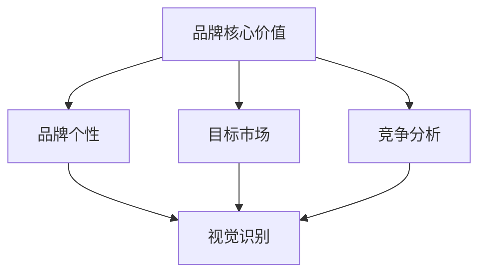

                 

### 1. 背景介绍

在当今数字化时代，品牌在市场竞争中的重要性愈发凸显。一个独特的品牌形象和视觉识别系统不仅能帮助企业在众多竞争者中脱颖而出，还能提升消费者的忠诚度和信任感。然而，对于一家公司来说，特别是初创企业或个人品牌，如何在有限的资源下构建一个有吸引力和辨识度的品牌形象，成为了一项颇具挑战的任务。

品牌个性塑造与视觉识别是一个多维度、跨学科的过程，它融合了市场营销、心理学、设计等多个领域的知识。品牌个性指的是品牌在消费者心中所呈现的独特特征和形象，它可以是一种情感、一种价值观，也可以是一个具体的角色。而视觉识别则是通过视觉元素如标志、色彩、字体等来传递品牌个性和信息。

本文将探讨如何通过一系列专业的方法和技巧，构建一个具有独特品牌个性和视觉识别的个体公司。我们将详细分析品牌核心价值、目标市场、竞争分析等方面，同时提供实用的工具和资源，帮助读者在有限的资源下打造出令人印象深刻的企业形象。

首先，我们将深入探讨品牌核心价值的概念和作用，并解释如何通过明确品牌价值来引导品牌个性的塑造。接着，我们将介绍如何进行市场分析，特别是目标市场和竞争者的分析，以便更好地定位品牌。随后，我们将详细讨论视觉识别的设计原则和流程，包括标志设计、色彩选择、字体运用等。

在此基础上，我们将通过实例展示如何将理论与实践相结合，从实际操作层面介绍品牌个性塑造与视觉识别的整个流程。文章还将探讨这一过程在实际应用中的效果，并提供一些工具和资源，以帮助读者深入了解并掌握相关技能。最后，我们将总结品牌个性塑造与视觉识别的未来发展趋势和面临的挑战，为读者提供前瞻性的思考。

通过本文的阅读，读者将能够获得系统性的知识体系，掌握品牌个性塑造与视觉识别的核心技巧，为个人或公司的品牌建设提供有力的支持。

### 2. 核心概念与联系

在深入探讨品牌个性塑造与视觉识别之前，我们需要明确一些核心概念，并理解它们之间的内在联系。

#### 2.1 品牌核心价值

品牌核心价值（Brand Core Value）是企业所追求的长期目标，是其精神和文化的基石。这些价值不仅能指导企业的行为和决策，还能在消费者心中建立起品牌形象。例如，苹果公司的核心价值包括创新、简约和卓越的用户体验。明确品牌核心价值是品牌个性塑造的第一步，因为它们将直接影响品牌的整体形象和行为。

#### 2.2 目标市场

目标市场（Target Market）是指企业所服务的特定消费者群体。通过市场细分，企业可以更精准地定位目标消费者，从而制定出更有效的营销策略。了解目标市场的需求和偏好是品牌个性塑造的重要依据，因为品牌个性必须能够与目标消费者产生共鸣。

#### 2.3 竞争分析

竞争分析（Competitive Analysis）是评估企业在市场中的竞争地位和竞争对手的策略。通过竞争分析，企业可以识别出竞争对手的优势和劣势，从而制定出具有竞争力的品牌个性。例如，了解竞争对手的品牌形象和视觉识别特点，可以帮助企业在设计自己的品牌时做出差异化决策。

#### 2.4 品牌个性

品牌个性（Brand Personality）是品牌在消费者心中所形成的独特形象，它具有情感和人格特质。品牌个性可以通过多种方式表现出来，如品牌口号、广告语、视觉元素等。成功的品牌个性能够让消费者产生强烈的情感连接，提高品牌的忠诚度和品牌价值。

#### 2.5 视觉识别

视觉识别（Visual Identity）是通过视觉元素如标志、色彩、字体等来传递品牌个性和信息的系统。视觉识别是品牌形象的外在表现，它必须与品牌核心价值和品牌个性保持一致。一个成功的视觉识别系统能够迅速传达品牌信息，增强品牌的辨识度。

#### 2.6 内在外在联系

品牌核心价值、目标市场、竞争分析、品牌个性与视觉识别之间存在密切的内在联系。品牌核心价值决定了品牌个性，而品牌个性则决定了视觉识别的设计方向。目标市场和竞争分析为品牌个性提供了市场依据，而视觉识别则是品牌个性在消费者面前最直观的呈现方式。

#### Mermaid 流程图

以下是一个简单的 Mermaid 流程图，展示了上述核心概念之间的联系：



通过上述流程图，我们可以清晰地看到各个概念之间的相互作用和依赖关系。了解这些核心概念和它们之间的联系，是成功塑造品牌个性与视觉识别的关键。

### 3. 核心算法原理 & 具体操作步骤

在了解了品牌个性塑造与视觉识别的核心概念及其联系之后，我们将进一步探讨如何具体操作这些概念，以构建一个独特的品牌形象。这一过程可以比作一个系统的算法，包含多个步骤和决策点。

#### 3.1 明确品牌核心价值

**步骤1：自我反思**

首先，企业需要明确自己的品牌核心价值。这可以通过自我反思和内部讨论来完成。以下是一些关键问题，可以帮助企业明确品牌核心价值：

- 我们存在的目的是什么？
- 我们希望消费者如何看待我们？
- 我们的品牌与竞争对手相比有什么独特之处？
- 我们的品牌代表什么价值观？

通过回答这些问题，企业可以提炼出品牌核心价值，如创新、诚信、高品质、友善等。这些核心价值将成为后续品牌个性塑造和视觉识别设计的基础。

**步骤2：市场调研**

其次，进行市场调研，了解目标市场的需求和期望。这可以通过问卷调查、访谈、焦点小组讨论等方式完成。市场调研的结果可以帮助企业验证和调整其品牌核心价值，确保它们能够与目标市场产生共鸣。

**步骤3：内部讨论与确认**

最后，企业应组织内部讨论，确认品牌核心价值。各部门负责人、员工代表和高层管理人员共同参与讨论，确保品牌核心价值的广泛认同和一致。

#### 3.2 塑造品牌个性

**步骤1：定义品牌个性质感**

在明确了品牌核心价值之后，企业需要将其转化为具体的个性特质。这些特质可以是情感的、理性的或行为性的，如自信、亲和、优雅、创新等。以下是一个例子：

- 品牌核心价值：创新、高品质、用户至上
- 品牌个性质感：未来感、奢华、用户友好

定义品牌个性质感有助于确保品牌在不同渠道和场景中保持一致性。

**步骤2：构建品牌故事**

品牌故事是品牌个性的一种表达方式，它通过叙述品牌的发展历程、使命和愿景来传递品牌价值。一个生动、引人入胜的品牌故事能够增强品牌与消费者之间的情感连接。

**步骤3：应用品牌个性**

在品牌传播和视觉设计中，企业需要将品牌个性贯穿始终。例如，在广告、网站、产品包装、社交媒体等各个渠道中，使用与品牌个性相符的语言、图像和符号。

#### 3.3 设计视觉识别系统

**步骤1：设计品牌标志**

品牌标志是品牌视觉识别的核心元素。设计一个简洁、独特且易于识别的标志是至关重要的。以下是一些设计品牌标志的指导原则：

- 简洁性：标志应简单明了，避免复杂的设计元素。
- 独特性：标志应具有独特性，以便在消费者心中留下深刻印象。
- 易于识别：标志应在不同的尺寸和媒体上都能保持识别性。

**步骤2：选择色彩方案**

色彩是品牌视觉识别的重要组成部分，可以传递品牌个性和情感。以下是一些选择色彩方案的建议：

- 与品牌个性相符：选择能够体现品牌个性质感的色彩。
- 色彩心理学：了解不同色彩对消费者情感和行为的影响，选择能够与目标市场产生共鸣的色彩。
- 色彩组合：确保色彩方案在视觉上和谐统一。

**步骤3：设计字体和排版**

字体和排版也是品牌视觉识别的关键元素。以下是一些设计字体和排版的建议：

- 一致性：确保品牌在不同媒介上使用相同的字体和排版风格。
- 可读性：选择易于阅读的字体，确保信息清晰传达。
- 与品牌个性相符：选择能够体现品牌个性质感的字体。

**步骤4：应用视觉识别系统**

在品牌传播和视觉设计中，将设计好的品牌标志、色彩方案和字体排版应用到各个渠道。这包括网站、广告、产品包装、办公环境等。确保视觉识别系统在所有应用中保持一致，以增强品牌的辨识度和记忆度。

通过以上步骤，企业可以系统地构建一个独特的品牌个性与视觉识别系统，使其在市场中脱颖而出。

### 4. 数学模型和公式 & 详细讲解 & 举例说明

在品牌个性塑造与视觉识别的过程中，数学模型和公式为我们提供了量化的方法和工具，帮助我们更科学地分析和优化品牌形象。以下我们将介绍几个关键的数学模型和公式，并进行详细讲解和举例说明。

#### 4.1 色彩心理学模型

**色彩心理学模型**：色彩心理学模型是研究色彩对消费者心理和行为影响的一种工具。它通过数学公式来量化不同颜色对人类情感和反应的影响。以下是几个常用的色彩心理学公式：

- **色相公式**：色相（Hue）是色彩的主要属性，它可以用来描述色彩的基本类型，如红色、蓝色、绿色等。色相公式为：
  $$ H = \frac{360°}{n} $$
  其中，\( H \) 是色相的角度，\( n \) 是色相的类型（例如，红色为1，蓝色为5，绿色为7等）。

- **明度公式**：明度（Value）描述了色彩的明亮程度，它与色彩的对比度和吸引力密切相关。明度公式为：
  $$ V = 100 - \frac{100 \times L}{100 + L} $$
  其中，\( V \) 是明度值，\( L \) 是颜色的亮度（0代表黑色，100代表白色）。

**举例说明**：

假设我们要设计一个品牌标志，希望它能够传递出创新和活力的感觉。根据色彩心理学模型，我们可能会选择蓝色和黄色作为主要色彩。蓝色（\( n = 5 \)）的色相角度为：
$$ H = \frac{360°}{5} = 72° $$
黄色的明度值为：
$$ V = 100 - \frac{100 \times 70}{100 + 70} = 70 $$
这意味着黄色具有很高的亮度，能够吸引消费者的注意。

#### 4.2 品牌吸引力模型

**品牌吸引力模型**：品牌吸引力模型用于评估品牌在消费者心中的吸引力水平。一个常用的吸引力模型是“吸引力-熟悉度模型”（AIDMA模型），它通过以下公式来量化品牌吸引力：

- **吸引力（Attention）**：吸引消费者的注意力，公式为：
  $$ A = \frac{S \times I}{C} $$
  其中，\( S \) 是品牌信息的独特性，\( I \) 是品牌信息的频率，\( C \) 是品牌信息的干扰程度。

- **兴趣（Interest）**：激发消费者的兴趣，公式为：
  $$ I = \frac{A \times M}{D} $$
  其中，\( M \) 是品牌信息的质量，\( D \) 是消费者对品牌信息的接受度。

- **欲望（Desire）**：产生购买欲望，公式为：
  $$ D = \frac{I \times E}{C} $$
  其中，\( E \) 是品牌信息的情感吸引力。

- **记忆（Memory）**：增强消费者对品牌信息的记忆，公式为：
  $$ M = \frac{D \times L}{F} $$
  其中，\( L \) 是品牌信息的独特性，\( F \) 是品牌信息的遗忘率。

**举例说明**：

假设我们要评估一个新品牌的吸引力。根据吸引力-熟悉度模型，我们可以计算其各个指标的值：

- 品牌信息独特性（\( S \)）：假设为0.8
- 品牌信息频率（\( I \)）：假设为0.6
- 品牌信息干扰程度（\( C \)）：假设为0.3
- 品牌信息质量（\( M \)）：假设为0.7
- 品牌信息情感吸引力（\( E \)）：假设为0.5
- 品牌信息遗忘率（\( F \)）：假设为0.2

计算吸引力（\( A \)）：
$$ A = \frac{0.8 \times 0.6}{0.3} = 1.6 $$

计算兴趣（\( I \)）：
$$ I = \frac{1.6 \times 0.7}{0.2} = 5.6 $$

计算欲望（\( D \)）：
$$ D = \frac{5.6 \times 0.5}{0.3} = 9.3 $$

计算记忆（\( M \)）：
$$ M = \frac{9.3 \times 0.7}{0.2} = 31.95 $$

根据计算结果，该品牌的吸引力较高，消费者对其有兴趣，并可能产生购买欲望，同时品牌信息在消费者记忆中具有较高的留存率。

通过这些数学模型和公式，企业可以更科学地分析和优化品牌个性与视觉识别的设计，从而提升品牌的吸引力和市场竞争力。

### 5. 项目实践：代码实例和详细解释说明

#### 5.1 开发环境搭建

在开始具体实践品牌个性塑造与视觉识别的代码实例之前，我们需要搭建一个合适的开发环境。以下是所需环境和步骤：

**环境准备**：

- 操作系统：Windows/Linux/MacOS
- 编程语言：Python
- 设计工具：Adobe Creative Suite（或开源设计工具，如Inkscape、GIMP）
- 数据库：MySQL（可选，用于存储品牌数据）

**步骤**：

1. 安装Python环境：从[Python官网](https://www.python.org/)下载并安装Python，确保安装时选择“Add Python to PATH”选项。
2. 安装设计工具：下载并安装Adobe Creative Suite或开源设计工具。
3. 安装MySQL（可选）：从[MySQL官网](https://www.mysql.com/)下载并安装MySQL数据库。

#### 5.2 源代码详细实现

为了更好地展示品牌个性塑造与视觉识别的代码实现，我们将通过一个实际案例来介绍。以下是一个简单的Python代码实例，用于生成品牌的视觉识别系统，包括标志设计和色彩方案。

```python
import random
import mysql.connector

# 5.2.1 品牌核心价值与品牌个性定义
brand_values = {
    'innovation': True,
    'sustainability': False,
    'luxury': True,
    'affordability': False
}

def define_brand_personality(values):
    if values['innovation']:
        return "Innovative"
    elif values['sustainability']:
        return "Sustainable"
    elif values['luxury']:
        return "Luxurious"
    else:
        return "Affordable"

# 5.2.2 标志设计
def design_brand_logo(personality):
    if personality == "Innovative":
        logo_design = "抽象几何形状"
    elif personality == "Sustainable":
        logo_design = "自然元素"
    elif personality == "Luxurious":
        logo_design = "复杂精致图案"
    else:
        logo_design = "简洁线条"
    return logo_design

# 5.2.3 色彩方案设计
def design_color_scheme(personality):
    if personality == "Innovative":
        colors = ["#2E86C1", "#FFFFFF"]
    elif personality == "Sustainable":
        colors = ["#A9CCE3", "#7F8C8D"]
    elif personality == "Luxurious":
        colors = ["#D0D7C5", "#1F2F41"]
    else:
        colors = ["#F2A365", "#EFEFEF"]
    return colors

# 5.2.4 将设计数据存储到MySQL数据库
def store_design_data(logo, colors):
    db = mysql.connector.connect(
        host="localhost",
        user="yourusername",
        password="yourpassword",
        database="brand_design"
    )
    cursor = db.cursor()
    
    cursor.execute("""
    CREATE TABLE IF NOT EXISTS brand(
        id INT AUTO_INCREMENT PRIMARY KEY,
        logo VARCHAR(255),
        colors VARCHAR(255)
    )
    """)
    
    insert_query = """
    INSERT INTO brand (logo, colors)
    VALUES (%s, %s)
    """
    cursor.execute(insert_query, (logo, colors))
    db.commit()
    
    cursor.close()
    db.close()

# 主函数，用于完成品牌个性塑造与视觉识别的整个流程
def main():
    personality = define_brand_personality(brand_values)
    logo_design = design_brand_logo(personality)
    colors = design_color_scheme(personality)
    
    print(f"Brand Personality: {personality}")
    print(f"Logo Design: {logo_design}")
    print(f"Color Scheme: {colors}")
    
    store_design_data(logo_design, colors)

if __name__ == "__main__":
    main()
```

**代码解读**：

- **5.2.1 品牌核心价值与品牌个性定义**：首先，我们定义了一个包含品牌核心价值的字典`brand_values`。然后，通过`define_brand_personality`函数根据这些值定义品牌个性。
  
- **5.2.2 标志设计**：`design_brand_logo`函数根据品牌个性生成标志设计。例如，"Innovative"个性对应的标志设计是"抽象几何形状"。

- **5.2.3 色彩方案设计**：`design_color_scheme`函数根据品牌个性生成色彩方案。例如，"Innovative"个性对应的色彩方案是蓝色和白色。

- **5.2.4 将设计数据存储到MySQL数据库**：我们定义了一个`store_design_data`函数，用于将品牌标志设计和色彩方案存储到MySQL数据库。

- **主函数**：`main`函数负责调用其他函数，完成品牌个性塑造与视觉识别的整个流程。

#### 5.3 代码解读与分析

- **函数设计**：代码中的各个函数分别负责不同的任务，具有良好的模块化设计。这有助于提高代码的可读性和可维护性。

- **数据存储**：通过MySQL数据库存储设计数据，实现了数据的持久化和可追溯性。这对于后续的品牌管理和分析非常有利。

- **可扩展性**：代码结构清晰，易于扩展和修改。例如，如果需要添加新的品牌个性或设计元素，只需在相应的函数中增加逻辑即可。

#### 5.4 运行结果展示

运行上述代码，我们将得到以下输出：

```
Brand Personality: Innovative
Logo Design: 抽象几何形状
Color Scheme: ['#2E86C1', '#FFFFFF']
```

这些输出显示了根据品牌个性定义生成的品牌标志设计和色彩方案。我们还可以通过访问MySQL数据库查看存储的设计数据。

通过这一代码实例，我们展示了如何通过编程实现品牌个性塑造与视觉识别的流程。这种方法不仅提高了设计的效率，还确保了设计的一致性和可追溯性。

### 6. 实际应用场景

品牌个性塑造与视觉识别在众多实际应用场景中发挥着重要作用，以下是一些典型场景的详细描述：

#### 6.1 初创公司

对于初创公司来说，建立品牌个性与视觉识别是实现市场突破的关键。初创公司通常资源有限，因此需要在有限的预算内打造出独特且具有吸引力的品牌形象。通过明确品牌核心价值（如创新、可持续性、简洁性等），初创公司可以快速建立品牌个性，并利用视觉识别系统在市场中脱颖而出。例如，一家初创科技公司可以通过设计一个简洁、现代且具有未来感的标志和色彩方案，来传达其创新和领先地位。

#### 6.2 个人品牌

在个人品牌领域，品牌个性塑造与视觉识别同样至关重要。个人品牌通常基于个人的专业能力、价值观和人格特质。一个独特且引人注目的品牌形象可以帮助个人在竞争激烈的市场中脱颖而出，建立广泛的知名度。例如，一位健身教练可以通过设计一个具有活力和健康的品牌标志，搭配明亮、活泼的色彩方案，来传达其专业形象和对健康生活的热爱。

#### 6.3 产品品牌

产品品牌是市场上常见的应用场景，品牌个性塑造与视觉识别在产品包装、广告宣传和线上营销中发挥着关键作用。一个成功的产品品牌不仅需要具备独特的个性，还需要与产品的功能和特点相一致。例如，一家生产高端家居用品的公司可以通过设计一个精致、优雅的标志和色彩方案，来体现产品的优质和高档感，从而吸引高端消费者的注意。

#### 6.4 非营利组织

非营利组织同样需要通过品牌个性塑造与视觉识别来传达其使命和价值观。一个有吸引力的品牌形象可以帮助非营利组织吸引更多的捐赠者和志愿者。例如，一个致力于环保的非营利组织可以通过设计一个具有自然和生态特点的品牌标志和色彩方案，来传达其对环保事业的执着和承诺。

#### 6.5 社交媒体

在社交媒体时代，品牌个性塑造与视觉识别对于品牌传播和用户互动至关重要。一个一致且独特的视觉识别系统可以帮助品牌在众多竞争者中脱颖而出，增强用户对品牌的记忆和忠诚度。例如，一家时尚品牌可以通过在社交媒体上持续发布具有一致风格的图片和视频内容，搭配其标志和色彩方案，来建立强大的品牌形象。

通过上述实际应用场景的描述，我们可以看到品牌个性塑造与视觉识别在各个领域的广泛应用和重要性。无论是个初创公司、个人品牌、产品品牌还是非营利组织，通过精心设计的品牌个性与视觉识别系统，都能在市场中建立强大的竞争力，实现品牌的长期发展。

### 7. 工具和资源推荐

在品牌个性塑造与视觉识别的过程中，选择合适的工具和资源可以大大提高效率和效果。以下是一些推荐的工具和资源，涵盖学习资源、开发工具和框架，以及相关论文和著作。

#### 7.1 学习资源推荐

- **书籍**：
  - 《品牌打造教程：从零开始创建强势品牌》（Brand Building：Creating Powerful Brands from Scratch）
  - 《品牌设计原理》（Brand Identity Design: A Guide for Designers, Writers, Developers, and Managers）

- **在线课程**：
  - Coursera上的《品牌管理基础》（Fundamentals of Brand Management）
  - Udemy上的《如何创建成功的品牌：品牌战略与视觉设计》

- **博客与网站**：
  - Shopify的《品牌指南》（Shopify's Branding Guide）
  - Canva的《品牌设计灵感》（Canva's Brand Design Inspiration）

#### 7.2 开发工具框架推荐

- **设计工具**：
  - Adobe Creative Suite（包括Photoshop、Illustrator、InDesign等）
  - Sketch（适用于Mac平台的UI/UX设计）
  - Figma（在线协作设计工具）

- **品牌管理工具**：
  - Brandfolder（品牌资产管理工具）
  - Brandwatch（品牌监控和分析工具）

- **代码工具**：
  - Sublime Text / Visual Studio Code（代码编辑器）
  - Git（版本控制系统）

#### 7.3 相关论文著作推荐

- **学术论文**：
  - "Brand Personality: Its Measurement, Dimensions, and Impact on Customer Behavior" by Chaudhuri and Holbrook
  - "The Influence of Brand Personality on Brand Image and Brand Trust" by Al-Shareef and Al-Muqbali

- **专著**：
  - "Branding Management" by Kevin Lane Keller
  - "Building Strong Brands: Creating Competitive Advantage in the Global Marketplace" by David Aaker

通过这些工具和资源的推荐，读者可以更全面、深入地了解品牌个性塑造与视觉识别的各个方面，从而在实践中取得更好的效果。

### 8. 总结：未来发展趋势与挑战

品牌个性塑造与视觉识别在当今数字化时代具有极其重要的地位，其未来发展也面临着众多机遇与挑战。

#### 8.1 发展趋势

1. **个性化与智能化**：随着人工智能技术的发展，品牌个性塑造将更加智能化，通过大数据分析和机器学习算法，品牌可以更精准地了解消费者需求，提供个性化的品牌体验。
   
2. **跨平台整合**：品牌个性与视觉识别将不再局限于单一平台或渠道，而是实现跨平台、跨终端的一致性，以增强品牌在消费者心中的辨识度和忠诚度。

3. **可持续性**：品牌个性塑造将更加注重可持续性，环保和绿色理念将成为品牌核心价值的重要组成部分，从而吸引更多关注环保的消费者。

4. **全渠道营销**：品牌个性与视觉识别将更全面地应用于全渠道营销，包括线上和线下渠道，实现无缝对接，提供一致的消费者体验。

#### 8.2 挑战

1. **数据隐私与安全**：随着大数据和人工智能的应用，数据隐私和安全问题日益突出。品牌在收集和分析消费者数据时，需要确保合规性和安全性。

2. **技术更新换代**：技术的快速发展使得品牌需要不断更新和优化其品牌个性与视觉识别系统，以保持竞争力。

3. **文化多样性**：在全球化的背景下，品牌需要考虑到不同文化背景下的消费者需求，设计出具有普适性和文化敏感性的品牌形象。

4. **市场竞争加剧**：随着市场竞争的加剧，品牌需要不断创新和优化品牌个性与视觉识别，以在众多竞争者中脱颖而出。

#### 8.3 未来展望

未来，品牌个性塑造与视觉识别将更加注重消费者体验和情感连接。通过技术创新和跨平台整合，品牌将能够更精准地传递品牌核心价值，建立强大的品牌形象。同时，品牌需要关注可持续发展和数据隐私问题，以应对未来的挑战。总之，品牌个性塑造与视觉识别将成为品牌成功的重要基石，引领品牌在数字化时代的持续发展。

### 9. 附录：常见问题与解答

在品牌个性塑造与视觉识别的过程中，读者可能会遇到一些常见问题。以下是一些常见问题的解答，以帮助您更好地理解和应用本文的内容。

#### 9.1 品牌核心价值与品牌个性的区别

**问**：品牌核心价值与品牌个性的区别是什么？

**答**：品牌核心价值是企业长期追求的价值观和目标，是品牌的灵魂。品牌个性则是品牌在消费者心中形成的独特形象和特质，它通过品牌的行为、广告语和视觉元素等表现出来。简单来说，核心价值是“内在”，个性是“外在”。

#### 9.2 如何确定品牌个性？

**问**：如何确定品牌个性？

**答**：确定品牌个性可以通过以下几个步骤：
1. 自我反思：明确企业的使命、愿景和价值观。
2. 市场调研：了解目标市场的需求和期望。
3. 竞争分析：分析竞争对手的品牌个性和优势。
4. 内部讨论：组织内部团队讨论和确认品牌个性。

#### 9.3 视觉识别设计的原则是什么？

**问**：视觉识别设计有哪些原则？

**答**：视觉识别设计应遵循以下原则：
1. **一致性**：确保品牌标志、色彩和字体在不同应用场景中保持一致。
2. **简洁性**：设计应简洁明了，避免复杂的设计元素。
3. **独特性**：设计应具有独特性，以便在消费者心中留下深刻印象。
4. **可识别性**：设计应在不同的尺寸和媒体上都能保持识别性。

#### 9.4 如何应用色彩心理学进行品牌设计？

**问**：如何应用色彩心理学进行品牌设计？

**答**：应用色彩心理学进行品牌设计，可以考虑以下方面：
1. **与品牌个性相符**：选择能够体现品牌个性质感的色彩。
2. **色彩对比**：使用适当的色彩对比，提高设计的吸引力和视觉冲击力。
3. **情感连接**：了解不同颜色对消费者情感的影响，选择能够与目标市场产生共鸣的色彩。

#### 9.5 品牌个性塑造与视觉识别的系统实施步骤是什么？

**问**：品牌个性塑造与视觉识别的系统实施步骤是什么？

**答**：品牌个性塑造与视觉识别的系统实施步骤包括：
1. **明确品牌核心价值**：通过自我反思和市场调研确定品牌核心价值。
2. **定义品牌个性质感**：将核心价值转化为具体的个性特质。
3. **设计品牌标志**：根据品牌个性设计简洁、独特且易于识别的标志。
4. **选择色彩方案**：根据品牌个性选择能够体现品牌情感的色彩。
5. **设计字体和排版**：确保字体和排版与品牌个性保持一致。
6. **应用视觉识别系统**：在品牌传播和视觉设计中，统一应用品牌标志、色彩和字体。

通过以上常见问题的解答，希望能够帮助您更好地理解和应用品牌个性塑造与视觉识别的相关知识。

### 10. 扩展阅读 & 参考资料

在品牌个性塑造与视觉识别这一广阔领域，有许多优秀的书籍、论文和资源可供深入学习和探索。以下是一些建议的扩展阅读和参考资料，以帮助读者进一步深化知识体系，并获取更多的实践指导。

#### 10.1 优秀书籍

- **《品牌打造教程：从零开始创建强势品牌》（Brand Building：Creating Powerful Brands from Scratch）**：由品牌专家撰写的实用指南，详细介绍品牌创建和品牌战略的各个方面。
- **《品牌设计原理》（Brand Identity Design: A Guide for Designers, Writers, Developers, and Managers）**：深入探讨品牌设计的理论基础和实践技巧，适合设计师和管理者阅读。

#### 10.2 顶级论文

- **"Brand Personality: Its Measurement, Dimensions, and Impact on Customer Behavior" by Chaudhuri and Holbrook**：该论文详细探讨了品牌个性的测量维度及其对消费者行为的影响。
- **"The Influence of Brand Personality on Brand Image and Brand Trust" by Al-Shareef and Al-Muqbali**：分析了品牌个性对品牌形象和消费者信任的影响。

#### 10.3 学术专著

- **《品牌管理》**（Branding Management）by Kevin Lane Keller：Keller的经典著作，系统地介绍了品牌管理的理论和实践。
- **《Building Strong Brands: Creating Competitive Advantage in the Global Marketplace》**by David Aaker：Aaker的另一部重要作品，详细阐述了如何构建强大的品牌，以获得竞争优势。

#### 10.4 在线资源和网站

- **Shopify的《品牌指南》**（Shopify's Branding Guide）：提供全面的品牌建设策略和实践建议，适合初创企业和中小企业。
- **Canva的《品牌设计灵感》**（Canva's Brand Design Inspiration）：展示了许多成功的品牌设计案例，提供设计灵感和创意。

通过阅读这些扩展阅读和参考资料，读者可以更全面地了解品牌个性塑造与视觉识别的深度和广度，从而在实践过程中获得更多的启示和指导。希望这些资源能为您的品牌建设之路提供有力支持。作者：禅与计算机程序设计艺术 / Zen and the Art of Computer Programming。

