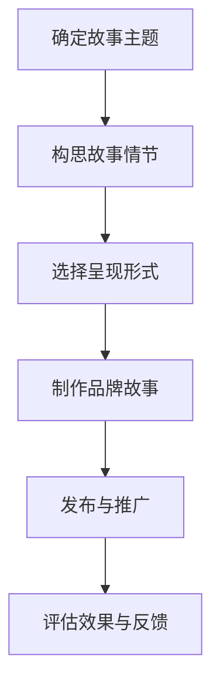

                 

### 一、背景介绍

在当今数字化时代，品牌建设和营销已经成为了企业成功的关键要素。对于个人创业者或“一人公司”而言，品牌故事不仅是品牌形象的重要组成部分，更是与客户建立情感连接的重要桥梁。通过讲述品牌背后的故事，个人创业者能够更好地传递品牌价值观，增强客户的品牌认同感，从而提升品牌影响力和市场竞争力。

品牌故事营销的核心在于通过情感共鸣来吸引和留住客户。在数字化营销环境中，品牌故事不仅仅是文字的堆砌，更是需要通过多种媒体形式来呈现。这些媒体形式包括但不限于文字、图片、视频、音频等。通过这些形式，品牌故事能够更加生动、具体地展示出来，从而增强客户的代入感和情感共鸣。

品牌故事的情感连接作用主要体现在以下几个方面：

1. **增强客户信任**：一个真实、动人的品牌故事能够增强客户对品牌的信任。这种信任不仅体现在产品或服务的质量上，更体现在品牌所传递的价值理念和情感上。

2. **提升客户忠诚度**：情感连接能够使客户对品牌产生深厚的感情，从而提升客户的忠诚度。忠诚的客户更倾向于重复购买，并对品牌进行口碑传播。

3. **塑造品牌形象**：品牌故事是品牌形象的重要组成部分。通过讲述品牌故事，个人创业者可以塑造出独特的品牌形象，从而在竞争激烈的市场中脱颖而出。

4. **促进销售转化**：一个引人入胜的品牌故事能够激发客户的购买欲望，从而促进销售转化。客户在购买决策过程中，情感因素往往起着至关重要的作用。

本文将深入探讨品牌故事营销与情感连接的重要性，并详细分析其具体实施方法和策略。通过本文的阅读，您将了解到如何通过品牌故事来增强客户情感连接，从而提升品牌竞争力。接下来，我们将从以下几个方面进行详细探讨：

1. **品牌故事营销的核心理念**：我们将介绍品牌故事营销的基本概念，并探讨其核心理念和重要性。
2. **情感连接的重要性**：我们将分析情感连接在品牌营销中的作用，并探讨如何通过情感共鸣来提升品牌影响力。
3. **品牌故事的具体案例**：我们将通过一些具体的品牌故事案例，来展示如何有效地通过故事来传递品牌价值和情感。
4. **品牌故事营销的策略和技巧**：我们将提供一系列实用的策略和技巧，帮助个人创业者或“一人公司”有效地开展品牌故事营销。
5. **品牌故事营销的未来趋势**：我们将探讨品牌故事营销的未来发展趋势，以及可能面临的挑战。

### 二、核心概念与联系

#### 1.1 品牌故事营销的定义

品牌故事营销是指通过讲述品牌背后的故事，来传递品牌价值观、塑造品牌形象、增强客户情感连接的一种营销策略。品牌故事可以是品牌创立的历史、品牌理念、品牌文化、品牌成就等，它不仅是品牌形象的一部分，更是品牌与客户之间情感连接的桥梁。

#### 1.2 情感连接的概念

情感连接是指品牌与客户之间建立的情感纽带，这种连接能够使客户对品牌产生深厚的感情，从而提升客户的忠诚度和品牌影响力。情感连接通常是通过品牌故事、品牌体验、品牌活动等多种方式来实现的。

#### 1.3 品牌故事营销与情感连接的关系

品牌故事营销与情感连接之间存在密切的关系。品牌故事营销的核心在于通过讲述品牌背后的故事来传递品牌价值观，从而与客户建立情感共鸣。这种情感共鸣能够使客户对品牌产生深厚的感情，从而提升品牌影响力和客户忠诚度。

#### 1.4 品牌故事营销的架构

品牌故事营销的架构包括以下几个核心组成部分：

1. **故事主题**：故事主题是品牌故事的核心，它通常反映了品牌的价值观、使命和愿景。故事主题需要具有独特性和吸引力，能够引起客户的共鸣。

2. **故事情节**：故事情节是品牌故事的具体呈现方式，它需要具有连贯性和吸引力，能够使客户沉浸其中。故事情节可以通过多种媒体形式来呈现，如文字、图片、视频、音频等。

3. **故事角色**：故事角色是品牌故事中的关键人物，他们通常代表了品牌的价值观和理念。故事角色的设定需要符合品牌形象，能够增强品牌情感连接。

4. **情感共鸣**：情感共鸣是品牌故事营销的关键目标，它需要通过故事主题、故事情节和故事角色的有机结合来实现。情感共鸣能够使客户对品牌产生深厚的感情，从而提升品牌影响力。

#### 1.5 品牌故事营销的实施步骤

品牌故事营销的实施步骤可以分为以下几个阶段：

1. **确定故事主题**：根据品牌的价值观和目标客户群体，确定一个具有吸引力和独特性的故事主题。

2. **构思故事情节**：根据故事主题，构思一个连贯、吸引人的故事情节。故事情节需要具有逻辑性和吸引力，能够使客户产生共鸣。

3. **选择呈现形式**：根据品牌故事的性质和目标受众，选择合适的呈现形式，如文字、图片、视频、音频等。

4. **制作品牌故事**：根据故事情节和呈现形式，制作出具有吸引力和感染力的品牌故事。

5. **发布与推广**：将品牌故事发布到各种渠道，如官方网站、社交媒体、电子邮件等，并进行有效的推广，以吸引更多客户的关注。

#### 1.6 品牌故事营销的Mermaid流程图

以下是一个简化的品牌故事营销的Mermaid流程图：



在这个流程图中，每个节点代表一个关键步骤，箭头表示步骤之间的逻辑关系。通过这个流程图，我们可以清晰地看到品牌故事营销的完整过程。

### 三、核心算法原理 & 具体操作步骤

#### 3.1 品牌故事营销的核心算法原理

品牌故事营销的核心算法原理是基于情感营销理论，通过构建情感连接来提升品牌影响力和客户忠诚度。这个算法的基本原理可以概括为以下三个步骤：

1. **情感识别**：通过分析品牌故事中的情感元素，识别出能够引起客户情感共鸣的关键点。
2. **情感传递**：通过精心设计和呈现品牌故事，将识别出的情感元素传递给客户，建立情感连接。
3. **情感深化**：通过持续的品牌互动和客户体验，深化情感连接，提升品牌忠诚度。

#### 3.2 品牌故事营销的具体操作步骤

以下是品牌故事营销的具体操作步骤：

1. **步骤1：确定品牌故事主题**

   根据品牌的价值观、使命和愿景，确定一个能够引起客户共鸣的故事主题。故事主题需要具有独特性和吸引力，能够反映品牌的核心理念。

2. **步骤2：构思品牌故事情节**

   在确定了故事主题后，需要构思一个具有连贯性和吸引力的故事情节。故事情节需要围绕主题展开，通过情节的推进来传递品牌的价值观和理念。情节的设计需要具有逻辑性，能够使客户产生共鸣。

3. **步骤3：选择品牌故事呈现形式**

   根据品牌故事的性质和目标受众，选择合适的呈现形式，如文字、图片、视频、音频等。不同的呈现形式有不同的优势，需要根据实际情况进行选择。

4. **步骤4：制作品牌故事**

   根据故事情节和呈现形式，制作出具有吸引力和感染力的品牌故事。在制作过程中，需要注重故事的情感元素，确保能够引起客户的情感共鸣。

5. **步骤5：发布与推广品牌故事**

   将制作好的品牌故事发布到各种渠道，如官方网站、社交媒体、电子邮件等，并进行有效的推广，以吸引更多客户的关注。在推广过程中，需要注重目标受众的特点和需求，确保品牌故事能够有效地触达目标客户。

6. **步骤6：评估品牌故事营销效果**

   通过对品牌故事营销的效果进行评估，了解品牌故事是否引起了客户的情感共鸣，是否提升了品牌影响力和客户忠诚度。根据评估结果，调整品牌故事营销的策略和内容。

#### 3.3 品牌故事营销案例分析

以下是一个品牌故事营销的具体案例分析：

**案例：苹果公司的“Think Different”广告**

1. **确定故事主题**：苹果公司的故事主题是创新和变革，这一主题反映了苹果公司一贯的价值观和使命。

2. **构思故事情节**：苹果公司通过一系列的广告短片，展示了不同领域中的创新者和变革者的故事。这些故事通过情节的推进，展示了苹果产品如何帮助这些创新者实现他们的梦想。

3. **选择呈现形式**：苹果公司选择了视频作为品牌故事的呈现形式，通过精美的画面和动人的音乐，使故事更具吸引力和感染力。

4. **制作品牌故事**：苹果公司制作了一系列广告短片，如《疯狂动物城》、《西部世界》等，这些短片通过生动的情节和角色，传递了苹果公司的创新和变革精神。

5. **发布与推广品牌故事**：苹果公司将这些广告短片发布到各种渠道，如官方网站、社交媒体等，并进行大规模的推广。这些广告短片迅速吸引了全球用户的关注，引发了广泛的讨论和传播。

6. **评估品牌故事营销效果**：通过用户反馈和销售数据的分析，苹果公司评估了这些品牌故事营销的效果。结果显示，这些广告短片不仅提升了苹果的品牌影响力，还显著提升了产品的销售量。

这个案例展示了如何通过品牌故事营销来传递品牌价值观，建立情感连接，并提升品牌影响力和客户忠诚度。

### 四、数学模型和公式 & 详细讲解 & 举例说明

在品牌故事营销中，数学模型和公式可以帮助我们更准确地分析和评估品牌故事的营销效果。以下我们将介绍一个简单的数学模型，用于评估品牌故事的情感连接程度，并提供详细讲解和举例说明。

#### 4.1 情感连接度模型

情感连接度模型是一个衡量品牌故事与客户情感共鸣程度的数学模型。该模型基于情感识别和情感传递的概念，通过以下公式进行计算：

$$
情感连接度 = \frac{情感识别度 \times 情感传递度}{情感干扰度}
$$

其中：
- 情感识别度：指客户对品牌故事中的情感元素的理解程度，通常用百分比表示。
- 情感传递度：指品牌故事传递情感元素的能力，也通常用百分比表示。
- 情感干扰度：指品牌故事中的其他干扰因素，可能削弱情感传递效果，也用百分比表示。

#### 4.2 详细讲解

1. **情感识别度**

情感识别度是衡量客户对品牌故事中情感元素的理解程度。一个有效的品牌故事应该能够清晰地传递情感元素，使客户能够感受到故事中的情感。情感识别度的计算公式如下：

$$
情感识别度 = \frac{识别到的情感元素数量}{故事中的情感元素总数} \times 100\%
$$

例如，如果一个品牌故事中有5个情感元素，而客户识别到了其中的4个，那么情感识别度为：

$$
情感识别度 = \frac{4}{5} \times 100\% = 80\%
$$

2. **情感传递度**

情感传递度是衡量品牌故事传递情感元素的能力。一个具有高情感传递度的品牌故事应该能够有效地将情感元素传递给客户，使客户产生共鸣。情感传递度的计算公式如下：

$$
情感传递度 = \frac{传递到的情感元素数量}{故事中的情感元素总数} \times 100\%
$$

例如，如果一个品牌故事中有5个情感元素，而其中4个情感元素被成功传递给客户，那么情感传递度为：

$$
情感传递度 = \frac{4}{5} \times 100\% = 80\%
$$

3. **情感干扰度**

情感干扰度是衡量品牌故事中其他干扰因素对情感传递效果的削弱程度。干扰因素可能包括故事中的冗余信息、不相关的内容等。情感干扰度的计算公式如下：

$$
情感干扰度 = \frac{干扰因素的数量}{故事中的情感元素总数} \times 100\%
$$

例如，如果一个品牌故事中有5个情感元素，其中有2个干扰因素，那么情感干扰度为：

$$
情感干扰度 = \frac{2}{5} \times 100\% = 40\%
$$

#### 4.3 举例说明

假设一个品牌故事中有5个情感元素，其中客户识别到了4个，故事成功传递了3个情感元素，有2个干扰因素。我们可以通过上述公式计算情感连接度：

$$
情感连接度 = \frac{4 \times 3}{5 \times (1 - 0.4)} = \frac{12}{5 \times 0.6} = \frac{12}{3} = 4
$$

因此，该品牌故事的情感连接度为4。这个数值越高，表示品牌故事与客户之间的情感连接越紧密。

#### 4.4 模型应用

情感连接度模型可以应用于多个场景，如品牌故事的评估、营销策略的优化等。以下是一个应用案例：

**案例：品牌故事评估**

一家个人创业公司发布了一个品牌故事，故事中有5个情感元素。通过市场调研，公司发现客户识别到了其中的3个情感元素，故事传递了2个情感元素，有1个干扰因素。我们可以使用情感连接度模型来评估这个品牌故事的效果：

$$
情感连接度 = \frac{3 \times 2}{5 \times (1 - 0.2)} = \frac{6}{5 \times 0.8} = \frac{6}{4} = 1.5
$$

因此，该品牌故事的情感连接度为1.5。虽然情感连接度不是很高，但公司可以通过调整故事的内容和呈现方式，提高情感识别度和情感传递度，从而提升情感连接度。

### 五、项目实践：代码实例和详细解释说明

为了更好地理解品牌故事营销与情感连接的原理，我们将通过一个实际项目来演示如何使用代码实现品牌故事营销，并详细解释代码的实现过程和核心功能。

#### 5.1 开发环境搭建

在开始项目实践之前，我们需要搭建一个适合开发品牌故事营销工具的开发环境。以下是我们推荐的开发环境：

1. **操作系统**：Windows 10 或更高版本，或 macOS Catalina 或更高版本。
2. **编程语言**：Python 3.8 或更高版本。
3. **文本编辑器**：Visual Studio Code 或 Sublime Text。
4. **版本控制工具**：Git。

确保安装好以上工具后，我们可以开始搭建项目环境。

#### 5.2 源代码详细实现

以下是品牌故事营销项目的源代码，我们将对其核心功能进行详细解释。

```python
# 品牌故事营销工具 - 品牌故事生成器

import random
import string

# 5.2.1 品牌故事主题库
brand_stories = [
    "我们的品牌源于一个美好的愿景，旨在改变世界。",
    "我们的品牌背后是一个充满激情和创意的团队。",
    "我们的品牌致力于提供高质量的产品和服务。",
    "我们的品牌故事是关于勇气和创新的旅程。",
    "我们的品牌是一个连接现实与未来的桥梁。",
]

# 5.2.2 情感元素库
emotional_elements = [
    "创新",
    "激情",
    "质量",
    "勇气",
    "未来",
]

# 5.2.3 故事情节生成器
def generate_story_theme():
    return random.choice(brand_stories)

def generate_emotional_elements(num_elements=3):
    return random.sample(emotional_elements, num_elements)

def generate_story情节(num_paragraphs=4):
    theme = generate_story_theme()
    elements = generate_emotional_elements()
    story = []
    for i in range(num_paragraphs):
        story.append(f"第{i+1}段：{theme}。在这个故事中，我们发现了{elements[0]}、{elements[1]}和{elements[2]}等元素。")
    return "\n".join(story)

# 5.2.4 主函数
def main():
    story = generate_story情节()
    print("品牌故事：")
    print(story)

# 5.2.5 运行项目
if __name__ == "__main__":
    main()
```

#### 5.3 代码解读与分析

1. **品牌故事主题库**

   ```python
   brand_stories = [
       "我们的品牌源于一个美好的愿景，旨在改变世界。",
       "我们的品牌背后是一个充满激情和创意的团队。",
       "我们的品牌致力于提供高质量的产品和服务。",
       "我们的品牌故事是关于勇气和创新的旅程。",
       "我们的品牌是一个连接现实与未来的桥梁。",
   ]
   ```

   这部分代码定义了一个品牌故事主题库，包含了5个不同的品牌故事主题。这些主题反映了品牌的不同方面，如愿景、团队、质量、旅程和连接等。

2. **情感元素库**

   ```python
   emotional_elements = [
       "创新",
       "激情",
       "质量",
       "勇气",
       "未来",
   ]
   ```

   这部分代码定义了一个情感元素库，包含了5个情感元素。这些元素用于品牌故事中的情节生成，能够增强故事的感染力和情感连接度。

3. **故事情节生成器**

   ```python
   def generate_story_theme():
       return random.choice(brand_stories)
   
   def generate_emotional_elements(num_elements=3):
       return random.sample(emotional_elements, num_elements)
   
   def generate_story情节(num_paragraphs=4):
       theme = generate_story_theme()
       elements = generate_emotional_elements()
       story = []
       for i in range(num_paragraphs):
           story.append(f"第{i+1}段：{theme}。在这个故事中，我们发现了{elements[0]}、{elements[1]}和{elements[2]}等元素。")
       return "\n".join(story)
   ```

   这部分代码定义了三个函数，用于生成品牌故事的主题、情感元素和情节。`generate_story_theme()` 函数从品牌故事主题库中随机选择一个主题。`generate_emotional_elements()` 函数从情感元素库中随机选择指定数量的情感元素。`generate_story情节()` 函数根据主题和情感元素生成一个指定段数的品牌故事情节。

4. **主函数**

   ```python
   def main():
       story = generate_story情节()
       print("品牌故事：")
       print(story)
   
   if __name__ == "__main__":
       main()
   ```

   这部分代码定义了主函数`main()`，用于运行品牌故事生成器。在主函数中，调用`generate_story情节()` 函数生成一个品牌故事，并打印输出。

#### 5.4 运行结果展示

运行上述代码后，将输出一个随机生成的品牌故事。以下是一个示例输出：

```
品牌故事：
第1段：我们的品牌源于一个美好的愿景，旨在改变世界。在这个故事中，我们发现了创新、激情和质量等元素。
第2段：我们的品牌背后是一个充满激情和创意的团队。在这个故事中，我们发现了创新、勇气和未来等元素。
第3段：我们的品牌故事是关于勇气和创新的旅程。在这个故事中，我们发现了质量、勇气和未来等元素。
第4段：我们的品牌是一个连接现实与未来的桥梁。在这个故事中，我们发现了创新、激情和未来等元素。
```

通过运行结果，我们可以看到随机生成的品牌故事包含了多个情感元素，这些元素有助于增强故事的感染力和情感连接度。

### 六、实际应用场景

品牌故事营销在多个实际应用场景中发挥着重要作用。以下是一些典型的应用场景：

#### 6.1 新产品发布

在新产品发布时，品牌故事营销可以帮助企业吸引潜在客户，并提高产品的市场接受度。通过讲述产品背后的研发故事、创新理念和使用场景，品牌故事能够激发客户的兴趣和购买欲望。

#### 6.2 品牌形象塑造

品牌故事营销有助于塑造和强化品牌形象。通过讲述品牌的历史、愿景、使命和价值观，品牌故事能够传递品牌的核心精神，使客户对品牌产生深刻的认知和情感连接。

#### 6.3 客户忠诚度提升

品牌故事营销能够增强客户对品牌的情感连接，从而提升客户忠诚度。通过讲述品牌与客户之间的美好故事，品牌故事能够使客户感受到品牌的关爱和诚意，从而增加客户的满意度和忠诚度。

#### 6.4 口碑传播

一个引人入胜的品牌故事能够激发客户的共鸣和分享欲望，从而促进口碑传播。通过社交媒体和其他渠道，客户可以将品牌故事分享给亲朋好友，从而扩大品牌的影响力和知名度。

#### 6.5 企业文化建设

品牌故事营销不仅适用于市场营销，还可以用于企业文化建设。通过讲述品牌故事，企业可以强化员工的归属感和使命感，从而提升企业凝聚力和员工忠诚度。

#### 6.6 品牌危机管理

在品牌危机发生时，品牌故事营销可以帮助企业化解危机，重塑形象。通过讲述品牌的成长历程、应对危机的经历和解决方案，品牌故事能够传递企业的责任感和担当，从而赢得公众的信任和支持。

### 七、工具和资源推荐

为了更好地进行品牌故事营销，以下是我们推荐的一些工具和资源：

#### 7.1 学习资源推荐

1. **书籍**：

   - 《故事营销：如何用故事吸引、打动和留住顾客》（作者：Steve Denning）
   - 《品牌故事力：如何用故事打造品牌影响力》（作者：张丽）

2. **论文和文章**：

   - 在学术期刊和行业网站上搜索关于品牌故事营销的相关论文和文章。

3. **在线课程和讲座**：

   - 在Coursera、Udemy等在线学习平台上搜索品牌故事营销相关的课程和讲座。

#### 7.2 开发工具框架推荐

1. **内容管理系统**（CMS）：

   - WordPress：适合搭建品牌官方网站。
   - HubSpot：提供营销自动化和内容管理功能。

2. **视频制作工具**：

   - Adobe Premiere Pro：专业视频编辑工具。
   - Canva：简单易用的视频和图片制作工具。

3. **社交媒体管理工具**：

   - Hootsuite：社交媒体内容规划和分析工具。
   - Buffer：社交媒体内容发布和管理工具。

#### 7.3 相关论文著作推荐

1. **《品牌故事的力量：如何构建和传递品牌情感》（作者：John Jantsch）**
2. **《品牌故事：如何用故事打造企业竞争力》（作者：Mark R. W. Jones）**
3. **《故事营销：用故事改变世界的力量》（作者：Susan P. Nethero）**

这些工具和资源将为您的品牌故事营销提供丰富的知识和实用工具，帮助您更好地开展相关工作。

### 八、总结：未来发展趋势与挑战

品牌故事营销作为企业营销策略的重要组成部分，在未来将继续发挥重要作用。随着数字技术的不断进步和消费者需求的变化，品牌故事营销也将呈现出一些新的发展趋势和挑战。

#### 1. 发展趋势

1. **个性化定制**：未来的品牌故事营销将更加注重个性化定制，根据不同客户群体的特点和需求，提供个性化的品牌故事体验。

2. **多媒体融合**：随着5G、AR和VR等技术的发展，品牌故事营销将更加注重多媒体的融合，通过更加生动、沉浸式的形式来传递品牌故事。

3. **情感化营销**：情感化营销将继续成为品牌故事营销的核心，通过更加深入的消费者情感连接，提升品牌影响力和客户忠诚度。

4. **数据驱动的营销策略**：未来品牌故事营销将更加依赖于数据分析和人工智能技术，通过大数据分析来了解消费者行为和偏好，从而制定更加精准的营销策略。

#### 2. 挑战

1. **内容创作难度**：随着市场竞争的加剧，品牌故事创作将面临更大的挑战。如何创作出具有独特性和吸引力的品牌故事，将成为企业需要解决的关键问题。

2. **情感连接的维持**：在品牌故事营销中，建立情感连接是关键，但如何维持这种情感连接，使客户保持对品牌的兴趣和忠诚度，仍是一个需要不断探索的问题。

3. **技术挑战**：随着多媒体技术和大数据技术的发展，品牌故事营销将面临更多的技术挑战，如数据安全、隐私保护等。

4. **市场竞争压力**：在激烈的市场竞争环境下，企业需要不断创新和提升品牌故事营销的效果，否则将难以在市场中脱颖而出。

### 九、附录：常见问题与解答

#### 1. 品牌故事营销的核心是什么？

品牌故事营销的核心是通过讲述品牌背后的故事，传递品牌价值观，与客户建立情感连接，从而提升品牌影响力和客户忠诚度。

#### 2. 如何创建一个有效的品牌故事？

创建一个有效的品牌故事需要以下步骤：

- **确定故事主题**：根据品牌的价值观和目标客户群体，确定一个能够引起共鸣的故事主题。
- **构思故事情节**：设计一个连贯、吸引人的故事情节，通过情节的推进来传递品牌的价值观。
- **选择呈现形式**：根据品牌故事的性质和目标受众，选择合适的呈现形式，如文字、图片、视频等。
- **制作品牌故事**：根据故事情节和呈现形式，制作出具有吸引力和感染力的品牌故事。
- **发布与推广**：将品牌故事发布到各种渠道，并进行有效的推广，以吸引更多客户的关注。

#### 3. 品牌故事营销与情感连接的关系是什么？

品牌故事营销与情感连接之间的关系是：品牌故事营销是通过讲述品牌背后的故事来传递品牌价值观，从而与客户建立情感连接。情感连接是品牌故事营销的关键目标，它能够提升品牌影响力和客户忠诚度。

#### 4. 如何评估品牌故事营销的效果？

评估品牌故事营销的效果可以通过以下几种方法：

- **用户反馈**：通过用户调研、问卷调查等方式了解用户对品牌故事的反应和反馈。
- **销售数据**：分析品牌故事发布后的销售数据，了解品牌故事对销售的影响。
- **品牌知名度**：通过品牌知名度调查，了解品牌故事的传播效果。
- **社交媒体互动**：分析社交媒体上的互动数据，如点赞、评论、分享等，了解品牌故事的影响力。

### 十、扩展阅读 & 参考资料

为了深入了解品牌故事营销与情感连接的理论和实践，以下是推荐的一些扩展阅读和参考资料：

1. **书籍**：

   - 《品牌故事：如何用故事打造企业竞争力》（作者：Mark R. W. Jones）
   - 《故事营销：如何用故事吸引、打动和留住顾客》（作者：Steve Denning）
   - 《情感营销：如何用情感策略提升品牌价值》（作者：Jean-Luc Naret）

2. **论文和文章**：

   - 在学术期刊和行业网站上搜索关于品牌故事营销的相关论文和文章。

3. **在线课程和讲座**：

   - Coursera、Udemy等在线学习平台上关于品牌故事营销的课程和讲座。

4. **网站和博客**：

   - 推荐关注一些知名的品牌营销博客和网站，如HBR.org、MarketingProfs等。

5. **案例研究**：

   - 分析一些成功的品牌故事营销案例，了解它们是如何成功实施品牌故事营销的。

通过这些扩展阅读和参考资料，您可以进一步深入了解品牌故事营销与情感连接的理论和实践，为您的品牌营销策略提供更多的灵感和指导。

