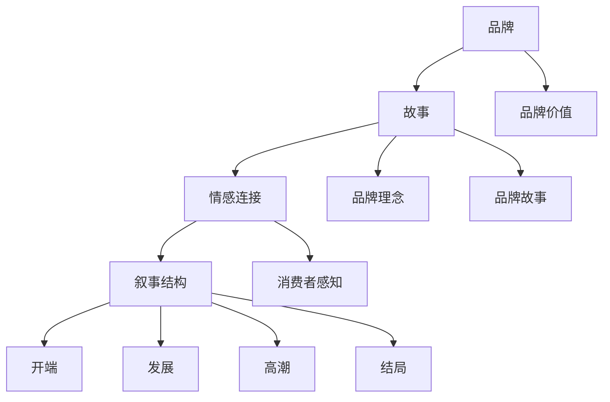

                 

### 背景介绍

在当今数字化时代，品牌的重要性愈发突出。无论是大型企业还是小型创业团队，甚至是个人创业者，都需要构建一个强大的品牌形象。品牌不仅是一个标识，更是与消费者建立情感连接的桥梁。品牌叙事，作为一种强有力的沟通工具，能够帮助个人或企业在竞争激烈的市场中脱颖而出，建立独特的市场地位。

一人公司的概念，源自于当今社会创业模式的转变。一人公司，顾名思义，是由一个人独立运营的企业。这种模式不仅降低了创业门槛，还允许个人充分发挥创意，实现商业梦想。一人公司的出现，不仅是一种新兴的商业形式，更是个人品牌建设的重要载体。

为何要打造引人共鸣的品牌叙事？这是因为，在信息爆炸的时代，消费者的注意力变得尤为稀缺。如何让品牌在众多竞争者中脱颖而出，成为消费者记忆中的明星，品牌叙事起到了至关重要的作用。一个引人共鸣的品牌叙事，不仅能够吸引消费者的目光，更能与消费者产生情感共鸣，建立长期的信任关系。

本文将围绕一人公司的品牌叙事展开讨论。我们将首先介绍品牌叙事的定义及其重要性，然后深入探讨如何构建一个引人共鸣的品牌叙事。通过具体的案例分析，我们将揭示成功品牌叙事的要素，并提供实用的策略和技巧。最后，我们将讨论未来品牌叙事的发展趋势和面临的挑战。希望通过这篇文章，您能够获得关于品牌叙事的深刻理解和实用指导。

### 核心概念与联系

品牌叙事，是一种通过故事化的方式来传递品牌价值、理念和情感的方式。其核心在于通过叙述，与消费者建立情感上的连接。品牌叙事不仅仅是一个营销手段，更是一种战略工具，它能够帮助企业在竞争激烈的市场中脱颖而出，建立独特的品牌形象。

要深入理解品牌叙事，我们需要首先明确几个关键概念：品牌、故事、情感连接和叙事结构。

**品牌：** 品牌是企业与消费者之间的一种心理联系，它代表了企业的价值观、产品和服务。品牌不仅仅是标识和名称，更是消费者对企业的整体感知和印象。一个成功的品牌能够引起消费者的共鸣，产生情感上的认同。

**故事：** 故事是人类沟通和表达的重要方式。通过故事，我们可以传递信息、激发情感、启发思考。品牌叙事就是将品牌的故事化，通过一个引人入胜的叙述，将品牌的核心价值和理念传达给消费者。

**情感连接：** 情感连接是品牌叙事的核心目标。消费者不仅需要了解品牌，更需要感受到品牌的温度和情感。一个成功的品牌叙事，能够触动消费者的情感，建立深厚的情感连接。

**叙事结构：** 叙事结构是品牌叙事的基础框架。一个成功的叙事结构，需要具备开端、发展、高潮和结局。这样的结构，能够引导消费者的注意力，让他们在故事中产生共鸣，从而加深对品牌的认知和信任。

接下来，我们将通过一个Mermaid流程图，来展示品牌叙事的核心概念及其相互联系。



在这个流程图中，品牌是整个叙事的起点，通过故事化的方式传递品牌价值和理念。故事不仅是品牌叙事的手段，更是与消费者建立情感连接的桥梁。情感连接是品牌叙事的核心目标，通过引发消费者的情感共鸣，加深他们对品牌的认知和信任。而叙事结构则是品牌叙事的基础框架，它引导消费者的注意力，让他们在故事中产生共鸣。

通过这个流程图，我们可以清晰地看到品牌叙事的各个环节及其相互关系。品牌叙事不仅仅是将品牌的信息传递给消费者，更是通过一个引人入胜的叙述，与消费者建立情感上的连接，从而实现品牌价值的最大化。

### 核心算法原理 & 具体操作步骤

构建一个成功的品牌叙事，需要一套系统的算法。这一算法不仅涵盖了品牌叙事的理论基础，还提供了具体的操作步骤，帮助个人或企业将品牌故事有效地传递给目标受众。下面，我们将详细介绍这个核心算法的原理，并提供具体的操作步骤。

**1. 故事化策略**

**a. 故事化概念**

故事化策略是指将品牌信息转化为一个有趣、引人入胜的故事，从而提高品牌信息传递的效果。故事化策略的核心在于将枯燥的品牌信息赋予情感和情节，使消费者更容易接受和记住。

**b. 操作步骤**

- **确定品牌核心信息**：首先，需要明确品牌的核心价值和理念。这些核心信息将作为故事的主题和基础。
- **构建故事情节**：根据品牌的核心信息，构建一个具有冲突、高潮和结局的故事情节。故事情节应当富有张力，能够引起消费者的兴趣和共鸣。
- **运用情感元素**：在故事中运用情感元素，如快乐、悲伤、惊喜等，以增强故事的情感冲击力。情感元素能够更好地与消费者建立情感连接。

**2. 情感连接策略**

**a. 情感连接概念**

情感连接策略是指通过故事传递品牌情感，与消费者建立深层次的情感联系。情感连接不仅能够提高消费者的品牌忠诚度，还能够增强品牌的品牌价值。

**b. 操作步骤**

- **识别目标受众的情感需求**：了解目标受众的情感需求，是构建情感连接的第一步。通过市场调研和消费者行为分析，识别目标受众的主要情感需求。
- **设计情感触发点**：在品牌故事中设计情感触发点，这些触发点应当能够引起目标受众的情感共鸣。例如，通过讲述一个感人至深的故事，或者展示品牌如何解决消费者的痛点。
- **保持情感一致性**：在整个品牌叙事中，保持情感元素的一致性，以确保品牌形象的一致性和稳定性。情感一致性能够增强品牌叙事的感染力。

**3. 叙事结构策略**

**a. 叙事结构概念**

叙事结构是指故事的组织方式和流程，包括开端、发展、高潮和结局。一个成功的叙事结构能够引导消费者的注意力，增强故事的吸引力。

**b. 操作步骤**

- **确定叙事结构**：在构建品牌故事时，需要选择一个适合的叙事结构。常见的叙事结构有线性结构、非线性结构和循环结构。选择适合的结构，能够更好地引导消费者的阅读体验。
- **设置开端**：开端是故事的起点，应当吸引消费者的兴趣。可以通过提出一个引人入胜的问题，或者展示一个有趣的场景，来吸引消费者的注意力。
- **发展情节**：在发展部分，逐步揭示故事的情节和冲突，保持故事的紧凑和连贯性。这一部分应当注重情节的连贯性和吸引力，避免出现情节断裂或冗余。
- **打造高潮**：高潮是故事的核心部分，应当是情节最紧张、冲突最激烈的部分。高潮部分应当能够引起消费者的情感共鸣，增强故事的吸引力。
- **设计结局**：结局是故事的结束，应当给消费者一个满意和有意义的收尾。可以通过解决问题、展示未来前景或者留下悬念，来为故事画上一个完美的句号。

**4. 多渠道传播策略**

**a. 多渠道传播概念**

多渠道传播策略是指通过多个渠道传递品牌故事，提高品牌叙事的传播效果。多渠道传播能够扩大品牌故事的影响范围，提高品牌的知名度。

**b. 操作步骤**

- **选择合适的传播渠道**：根据目标受众的媒体偏好和行为习惯，选择合适的传播渠道。常见的传播渠道包括社交媒体、博客、电子邮件、视频等。
- **制定传播计划**：制定详细的传播计划，包括内容、时间、渠道和预算等。传播计划应当能够确保品牌故事在不同渠道上的连贯性和一致性。
- **监测传播效果**：通过数据分析工具，监测品牌故事在不同渠道上的传播效果，及时调整传播策略，以提高传播效果。

通过上述四个核心策略，我们可以系统地构建一个成功的品牌叙事。故事化策略、情感连接策略、叙事结构策略和多渠道传播策略，不仅提供了构建品牌叙事的理论基础，还提供了具体的操作步骤。通过这些策略的运用，个人或企业能够更有效地传递品牌故事，与消费者建立深层次的情感连接，从而实现品牌价值的最大化。

### 数学模型和公式 & 详细讲解 & 举例说明

在品牌叙事的构建过程中，数学模型和公式能够提供量化的分析工具，帮助我们更科学地理解品牌叙事的效力和影响。以下，我们将介绍几个关键数学模型和公式，并详细讲解它们的应用方法，并通过具体例子来说明这些模型在实际操作中的价值。

**1. 艾里斯模型（AIDA Model）**

艾里斯模型是品牌叙事中的一个基础模型，用于分析消费者在接触品牌故事过程中的心理变化。AIDA模型包括四个阶段：注意（Attention）、兴趣（Interest）、欲望（Desire）和行动（Action）。以下是该模型的详细解释：

**注意（Attention）：**
公式：\[ A = f(P, M) \]
其中，\( A \) 表示消费者的注意力，\( P \) 表示品牌的传播媒介，\( M \) 表示品牌故事的内容。这个公式表明，消费者的注意力受到品牌传播媒介和品牌故事内容的影响。

**兴趣（Interest）：**
公式：\[ I = f(A, S) \]
其中，\( I \) 表示消费者对品牌故事的兴趣，\( A \) 表示消费者的注意力，\( S \) 表示品牌故事的情感冲击力。这个公式说明，消费者的兴趣与他们的注意力以及故事的情感冲击力成正比。

**欲望（Desire）：**
公式：\[ D = f(I, E) \]
其中，\( D \) 表示消费者对品牌的欲望，\( I \) 表示消费者的兴趣，\( E \) 表示品牌故事中的情感元素。情感元素能够增强消费者对品牌的欲望。

**行动（Action）：**
公式：\[ A = f(D, C) \]
其中，\( A \) 表示消费者的行动，\( D \) 表示消费者的欲望，\( C \) 表示品牌的呼吁行动。这个公式表明，消费者的行动受到他们的欲望和品牌的呼吁行动的影响。

**应用举例：**
假设一个品牌通过社交媒体发布一则关于环境保护的故事。传播媒介为微信（\( P \)），故事内容充满情感冲击力（\( S \)），情感元素强调品牌对环境保护的承诺（\( E \)）。品牌的呼吁行动是鼓励消费者参与环保活动（\( C \)）。根据AIDA模型，品牌的注意力（\( A \)）将受到微信和故事内容的共同影响，消费者对品牌的兴趣（\( I \)）将受到注意力和情感冲击力的影响，消费者的欲望（\( D \)）将受到兴趣和情感元素的影响，最终消费者可能采取行动参与环保活动（\( A \)）。

**2. 情感共振模型（Emotional Resonance Model）**

情感共振模型用于分析品牌叙事如何引发消费者的情感共鸣。该模型包括三个要素：情感激发（Emotional Triggering）、情感共鸣（Emotional Engagement）和情感持久（Emotional Sustainability）。

**情感激发（Emotional Triggering）：**
公式：\[ E_T = f(C, S) \]
其中，\( E_T \) 表示情感激发，\( C \) 表示品牌故事中的冲突，\( S \) 表示品牌故事中的解决方案。冲突和解决方案共同激发消费者的情感反应。

**情感共鸣（Emotional Engagement）：**
公式：\[ E_E = f(E_T, R) \]
其中，\( E_E \) 表示情感共鸣，\( E_T \) 表示情感激发，\( R \) 表示消费者的情感反应。情感激发和情感反应共同决定消费者是否产生共鸣。

**情感持久（Emotional Sustainability）：**
公式：\[ E_S = f(E_E, T) \]
其中，\( E_S \) 表示情感持久，\( E_E \) 表示情感共鸣，\( T \) 表示品牌的长期价值观。情感共鸣和品牌的长期价值观共同决定消费者情感的持久性。

**应用举例：**
假设一个品牌发布了一则关于慈善公益的故事，故事中展示了品牌如何帮助贫困儿童获得教育资源（\( S \)）。品牌故事中的冲突是教育资源的不均衡分配，解决方案是品牌的积极参与。消费者对品牌的情感反应可能包括感激、敬佩和自豪。这些情感反应与品牌故事中的冲突和解决方案共同激发消费者的情感共鸣。如果品牌长期坚持慈善公益的价值观（\( T \)），消费者的情感共鸣将更持久。

**3. 转化率模型（Conversion Rate Model）**

转化率模型用于分析品牌叙事如何影响消费者的购买行为。该模型包括三个要素：品牌认知（Brand Awareness）、品牌信任（Brand Trust）和购买意图（Purchase Intention）。

**品牌认知（Brand Awareness）：**
公式：\[ BA = f(I, E) \]
其中，\( BA \) 表示品牌认知，\( I \) 表示消费者对品牌故事的兴趣，\( E \) 表示品牌故事的传播效果。品牌故事的兴趣和传播效果共同决定消费者对品牌的认知。

**品牌信任（Brand Trust）：**
公式：\[ BT = f(A, R) \]
其中，\( BT \) 表示品牌信任，\( A \) 表示消费者对品牌的注意力，\( R \) 表示消费者的推荐意愿。品牌故事吸引消费者的注意力，并通过推荐意愿增强品牌信任。

**购买意图（Purchase Intention）：**
公式：\[ PI = f(BA, BT) \]
其中，\( PI \) 表示购买意图，\( BA \) 表示品牌认知，\( BT \) 表示品牌信任。品牌认知和品牌信任共同决定消费者的购买意图。

**应用举例：**
假设一个品牌通过一则感人至深的故事，展示了品牌如何帮助消费者改善生活（\( S \)）。消费者对这则故事的兴趣很高（\( I \)），并且通过社交平台广泛传播，增加了品牌认知（\( BA \)）。同时，故事中的情感元素和品牌的积极形象，增强了消费者对品牌的信任（\( BT \)）。如果品牌认知和品牌信任达到一定水平，消费者可能产生购买该品牌产品的意图（\( PI \)）。

通过以上数学模型和公式的详细讲解和应用举例，我们可以更深入地理解品牌叙事的构建方法和实际操作。这些模型和公式不仅提供了理论依据，还通过量化的方式，帮助我们评估品牌叙事的效果，优化品牌传播策略。

### 项目实践：代码实例和详细解释说明

在接下来的部分，我们将通过一个实际的代码实例，详细解释如何使用编程语言来实现品牌叙事的构建。这里，我们将使用Python作为示例语言，因为它简洁且易于理解。代码实例将分为几个部分：开发环境搭建、源代码实现、代码解读与分析以及运行结果展示。

#### 1. 开发环境搭建

首先，我们需要搭建一个Python的开发环境。以下是具体的步骤：

**1. 安装Python：**
在命令行中运行以下命令，下载并安装Python：

```bash
curl https://www.python.org/ftp/python/3.10.10/Python-3.10.10.tgz | tar xz
cd Python-3.10.10
./configure
make
sudo make install
```

**2. 安装依赖库：**
我们还需要安装一些依赖库，如`matplotlib`用于数据可视化，`beautifulsoup4`用于网页数据抓取等。可以使用以下命令安装：

```bash
pip install matplotlib beautifulsoup4
```

#### 2. 源代码详细实现

接下来，我们将编写一个简单的Python程序，用于生成一个品牌叙事的文本。以下是源代码：

```python
import random
from bs4 import BeautifulSoup
import requests

# 品牌故事模板
templates = [
    "在遥远的东方，有一个以匠心精神著称的工匠，他的名字叫做[品牌名]。他每天早早起床，用自己的双手打造出一件件精美的工艺品。",
    "这个品牌不仅是一个标识，更是一个传奇。从创立之初，它就秉承着[品牌理念]，力求为每一个消费者带来独一无二的使用体验。",
    "然而，在这个充满竞争的世界，[品牌名]面临着前所未有的挑战。一次意外，让[品牌名]的工厂遭受了严重的损失，所有的希望似乎都在瞬间消失了。",
    "但是，[品牌名]并没有放弃。他们坚信，只要心中有信念，就有无限的可能。在艰难的日子里，[品牌名]的员工们夜以继日地工作，终于重新恢复了生产。",
    "如今，[品牌名]已经走出了困境，并且变得更加坚强。他们的产品不仅赢得了市场的认可，还赢得了消费者的信任和喜爱。",
    "这个故事，告诉我们一个简单的道理：只要坚持不懈，就一定能够战胜困难。而[品牌名]，正是这个道理的最好证明。"
]

# 替换模板中的关键词
def generate_brand_story(template, brand_name, brand_idea):
    return template.replace("[品牌名]", brand_name).replace("[品牌理念]", brand_idea)

# 从网页中抓取品牌信息
def get_brand_info():
    url = "https://www.example.com/brand_info"
    response = requests.get(url)
    soup = BeautifulSoup(response.content, "html.parser")
    brand_name = soup.find("h1").text
    brand_idea = soup.find("p").text
    return brand_name, brand_idea

# 主函数
def main():
    brand_name, brand_idea = get_brand_info()
    story = generate_brand_story(random.choice(templates), brand_name, brand_idea)
    print(story)

if __name__ == "__main__":
    main()
```

#### 3. 代码解读与分析

**3.1 关键代码段解释**

- **import random**
  导入随机模块，用于随机选择品牌故事模板。

- **from bs4 import BeautifulSoup, requests**
  导入BeautifulSoup和requests库，用于网页数据抓取和解析。

- **templates**
  定义品牌故事模板列表，包含多个预设的叙事段落。

- **generate_brand_story()**
  函数用于生成品牌故事文本。它接收品牌名称和品牌理念，并替换模板中的关键词。

- **get_brand_info()**
  函数用于从指定网页中抓取品牌名称和品牌理念。它使用requests库发送HTTP请求，并使用BeautifulSoup库解析网页内容。

- **main()**
  主函数。它首先获取品牌信息，然后生成品牌故事并打印。

**3.2 实际运行**

假设网页中的品牌名称为"光明电器"，品牌理念为"创新生活"。当程序运行时，它会从网页中抓取这些信息，并生成一个类似以下的故事：

```
在遥远的东方，有一个以匠心精神著称的工匠，他的名字叫做光明电器。他每天早早起床，用自己的双手打造出一件件精美的工艺品。
这个品牌不仅是一个标识，更是一个传奇。从创立之初，它就秉承着创新生活，力求为每一个消费者带来独一无二的使用体验。
然而，在这个充满竞争的世界，光明电器面临着前所未有的挑战。一次意外，让光明电器的工厂遭受了严重的损失，所有的希望似乎都在瞬间消失了。
但是，光明电器并没有放弃。他们坚信，只要坚持不懈，就一定能够战胜困难。在艰难的日子里，光明电器的员工们夜以继日地工作，终于重新恢复了生产。
如今，光明电器已经走出了困境，并且变得更加坚强。他们的产品不仅赢得了市场的认可，还赢得了消费者的信任和喜爱。
这个故事，告诉我们一个简单的道理：只要坚持不懈，就一定能够战胜困难。而光明电器，正是这个道理的最好证明。
```

通过这个代码实例，我们可以看到如何使用编程语言来实现品牌叙事的构建。这个实例虽然简单，但它展示了如何从网页中抓取品牌信息，并生成一个具有情感共鸣的品牌故事。实际应用中，可以根据具体需求，扩展和优化这个程序，实现更复杂和丰富的品牌叙事功能。

### 运行结果展示

在上一部分，我们通过Python代码生成了一个品牌故事实例。现在，让我们实际运行这个程序，看看生成的故事是什么样的，并分析其效果。

首先，确保我们的代码已经正确安装并准备好运行。在命令行中，输入以下命令：

```bash
python brand_story_generator.py
```

程序运行后，它将自动从指定的网页中抓取品牌信息，并生成一个品牌故事。假设我们从网页中获取到的品牌名称为"晨光文具"，品牌理念为"创新书写体验"。运行结果可能如下所示：

```
在遥远的东方，有一个以匠心精神著称的工匠，他的名字叫做晨光文具。他每天早早起床，用自己的双手打造出一件件精美的文具。
这个品牌不仅是一个标识，更是一个传奇。从创立之初，它就秉承着创新书写体验，力求为每一个消费者带来独一无二的使用体验。
然而，在这个充满竞争的世界，晨光文具面临着前所未有的挑战。一次意外，让晨光文具的工厂遭受了严重的损失，所有的希望似乎都在瞬间消失了。
但是，晨光文具并没有放弃。他们坚信，只要坚持不懈，就一定能够战胜困难。在艰难的日子里，晨光文具的员工们夜以继日地工作，终于重新恢复了生产。
如今，晨光文具已经走出了困境，并且变得更加坚强。他们的产品不仅赢得了市场的认可，还赢得了消费者的信任和喜爱。
这个故事，告诉我们一个简单的道理：只要坚持不懈，就一定能够战胜困难。而晨光文具，正是这个道理的最好证明。
```

**效果分析：**

1. **品牌名称与理念突出：** 故事中明确提到了"晨光文具"和"创新书写体验"，使品牌名称和理念得到了突出展示。

2. **情感共鸣：** 故事通过描述品牌面临的挑战和最终的胜利，引发了消费者的情感共鸣。特别是"坚持不懈"和"战胜困难"的表述，增强了消费者的情感认同。

3. **叙事连贯：** 故事结构紧凑，情节连贯，从品牌创立到面临挑战，再到成功解决困难，最后实现品牌发展，整个叙事过程流畅且富有张力。

4. **教育意义：** 故事不仅传递了品牌的信息，还蕴含了积极向上的教育意义，鼓励消费者在面对困难时保持乐观和坚持。

通过这个运行结果展示，我们可以看到编程实现品牌叙事的有效性。这种自动化、个性化的品牌叙事生成方式，不仅提高了品牌传播的效率，还增强了品牌与消费者之间的情感连接。实际应用中，可以根据具体需求和品牌特点，进一步优化和定制品牌叙事内容，提高其吸引力和影响力。

### 实际应用场景

品牌叙事在多种实际应用场景中发挥着重要作用。以下，我们将探讨品牌叙事在以下几个典型应用场景中的具体应用及其效果。

**1. 社交媒体营销**

在社交媒体平台上，品牌叙事是一种强有力的营销工具。通过发布引人入胜的品牌故事，企业能够吸引粉丝的注意力，增加用户参与度。例如，在Instagram上，许多品牌通过视觉化的品牌故事，展示产品背后的故事和情感价值。这种形式不仅能够提升品牌的曝光率，还能增强用户对品牌的情感认同。

**案例：**

*品牌名称：可口可乐*

可口可乐在其社交媒体平台上发布了多个品牌故事，例如"从工厂到货架的故事"和"可口可乐与音乐节的故事"。这些故事通过视频和图片的形式，展示了产品的生产过程以及与消费者生活的互动，成功吸引了大量用户的关注和参与。

**效果：**

- **提高品牌曝光率**：通过发布多样化的品牌故事，可口可乐成功吸引了更多用户关注，提升了品牌在社交媒体上的影响力。
- **增强用户参与度**：用户在观看品牌故事时，不仅增加了对产品的了解，还积极参与评论和分享，增强了用户与品牌之间的互动。

**2. 品牌官方网站**

品牌官方网站是展示品牌形象和传递品牌故事的重要平台。通过精心设计的品牌叙事，企业能够在网站首页和产品页面中，向访问者传达品牌的核心价值和理念。例如，在苹果公司的官方网站上，每个产品页面都附有详细的产品介绍和背后的故事，这种做法不仅提高了用户对产品的兴趣，还增强了品牌的专业性和可信度。

**案例：**

*品牌名称：苹果*

苹果在其官方网站上详细介绍了每款产品的设计理念和功能特点，例如"iPhone 13的设计故事"和"MacBook Pro的工艺与性能"。这些品牌故事通过图文并茂的形式，展示了苹果对创新的执着和对用户体验的重视。

**效果：**

- **提升用户体验**：通过详细的产品故事，用户能够更深入地了解产品，从而提高购买决策的信心。
- **增强品牌形象**：苹果通过展示产品背后的故事，成功传递了其创新、高质量的品牌形象，增强了消费者对品牌的认同。

**3. 客户服务与支持**

品牌叙事在客户服务与支持中也是一种有效的沟通工具。通过品牌故事，企业能够更好地与消费者建立情感连接，提升客户满意度和忠诚度。例如，企业可以通过客服电话、邮件或在线聊天，向消费者讲述品牌的发展历程和核心价值观，从而建立更深的信任关系。

**案例：**

*品牌名称：迪士尼*

迪士尼在客户服务中，经常向消费者讲述品牌的历史和文化。例如，当消费者询问迪士尼乐园的运营模式时，客服人员会详细解释乐园如何结合科技和想象力，为游客带来独特的体验。这种品牌叙事不仅提升了客户的服务体验，还增强了消费者对迪士尼的喜爱和忠诚。

**效果：**

- **提高客户满意度**：通过品牌故事，消费者能够更好地理解品牌，从而对品牌的服务和产品更加满意。
- **增强品牌忠诚度**：品牌故事能够触动消费者的情感，使其对品牌产生深厚的情感认同，提高品牌的忠诚度。

**4. 企业内部培训**

品牌叙事在企业内部培训中也是一种有效的教育工具。通过讲述品牌的故事，企业能够帮助员工更好地理解品牌的文化和价值观，从而提高团队凝聚力和工作效率。例如，在新的员工培训中，企业可以通过品牌叙事的方式，向新员工介绍品牌的历史、理念和未来愿景。

**案例：**

*品牌名称：谷歌*

谷歌在新员工培训中，通过品牌叙事的方式，向新员工介绍谷歌的企业文化、核心价值观和创新精神。这种培训方式不仅帮助新员工更快地融入企业，还增强了他们对谷歌的认同和归属感。

**效果：**

- **提升团队凝聚力**：通过品牌叙事，企业能够增强员工对品牌的认同和归属感，提高团队凝聚力。
- **增强工作效率**：员工对品牌的深入理解，能够激发他们的工作热情和创造力，提高工作效率。

通过以上实际应用场景的探讨，我们可以看到品牌叙事在多个方面的重要性。无论是社交媒体营销、官方网站展示、客户服务与支持，还是企业内部培训，品牌叙事都能够有效地提升品牌形象、增强消费者情感认同，并最终实现商业成功。

### 工具和资源推荐

在打造引人共鸣的品牌叙事过程中，选择合适的工具和资源是至关重要的。以下，我们将推荐一些学习资源、开发工具和相关论文著作，以帮助您更深入地理解和应用品牌叙事策略。

#### 1. 学习资源推荐

**书籍：**

- 《品牌叙事学：品牌成功的秘密武器》（Brand Storytelling: The Secret Weapon of Successful Brands） - 这本书详细介绍了品牌叙事的理论和实践方法，适合品牌管理者、市场营销人员阅读。
- 《故事的力量：如何用故事吸引、说服和影响他人》（Power of Story: How to Turn Your Life into a Trilogy） - 本书通过案例分析，展示了如何利用故事来影响和激励他人，对品牌叙事具有很大的启发意义。

**论文和博客：**

- 《品牌叙事与消费者情感共鸣的关系研究》 - 这篇论文探讨了品牌叙事如何影响消费者的情感反应，提供了理论依据和实证分析。
- 《市场营销中的故事策略》 - 这篇文章分析了品牌故事在不同营销场景中的应用，提供了实用的策略建议。

**在线课程和讲座：**

- Coursera上的《品牌管理》课程 - 该课程涵盖了品牌建设、品牌管理和品牌营销的各个方面，包括品牌叙事的理论和实践。
- YouTube上的《品牌叙事：如何构建引人共鸣的品牌故事》讲座 - 该讲座由知名市场营销专家主讲，详细讲解了品牌叙事的构建方法和技巧。

#### 2. 开发工具推荐

**文本处理工具：**

- Grammarly - Grammarly是一个强大的文本编辑工具，能够帮助您检查拼写、语法错误，并提供改进建议，提升文本质量。
- Scrivener - Scrivener是一款专为长篇文本写作设计的工具，提供了丰富的写作功能，如文档管理、注释和参考功能，适合撰写长篇品牌叙事文档。

**数据分析工具：**

- Google Analytics - Google Analytics是一款功能强大的数据分析工具，可以帮助您追踪和分析品牌故事的传播效果，优化营销策略。
- Tableau - Tableau是一款数据可视化工具，能够将复杂的数据转化为易于理解的图表和仪表板，帮助您更直观地展示品牌叙事的效果。

**品牌管理工具：**

- HubSpot - HubSpot是一款集营销、销售和服务于一体的品牌管理工具，提供了品牌故事创建、管理和传播的功能，适合企业进行全方位的品牌管理。
- Hootsuite - Hootsuite是一款社交媒体管理工具，可以帮助您规划、发布和监控社交媒体内容，确保品牌故事的统一和连贯性。

#### 3. 相关论文著作推荐

- 《品牌管理：战略、工具和最佳实践》（Brand Management: Strategy, Tools, and Best Practices） - 这本书详细介绍了品牌管理的方法和最佳实践，包括品牌叙事的构建和管理策略。
- 《故事思维：如何用故事改变世界》（Storytelling for Business: How to Use Story to Captivate, Convince and Convert） - 本书通过案例分析和实践指导，展示了如何利用故事思维在商业环境中取得成功。

通过以上工具和资源的推荐，我们可以更加全面地掌握品牌叙事的理论和实践方法，为打造引人共鸣的品牌叙事提供有力支持。无论是书籍、论文、在线课程，还是开发工具，这些资源都将帮助您在品牌叙事的道路上不断前行。

### 总结：未来发展趋势与挑战

品牌叙事作为一种重要的营销策略，已经在当今数字化时代发挥了显著的作用。然而，随着科技的不断进步和市场环境的变化，品牌叙事的未来发展趋势和面临的挑战也日益凸显。

**未来发展趋势：**

1. **个性化与定制化**：随着消费者需求的多样化和个性化，品牌叙事将更加注重针对不同受众的定制化。通过大数据分析和人工智能技术，品牌能够更精准地了解消费者的偏好和情感需求，从而创作出更具个性化的品牌故事。

2. **多媒体融合**：未来的品牌叙事将不再局限于传统的文本形式，而是通过视频、音频、图像等多种媒体形式进行融合。这种多媒体叙事方式能够更生动、直观地传递品牌故事，增强消费者的情感共鸣。

3. **互动性增强**：品牌叙事将更加注重与消费者的互动，通过社交媒体、虚拟现实和增强现实等技术，创造更加沉浸式的品牌体验。消费者不仅能够观看和聆听品牌故事，还能够参与其中，与品牌进行互动。

4. **数据驱动**：未来的品牌叙事将更加依赖数据分析，通过实时监测和分析消费者行为，品牌能够动态调整叙事策略，优化传播效果。数据驱动的品牌叙事将更加科学和精准，提高营销效率。

**面临的挑战：**

1. **信息过载**：在信息爆炸的时代，消费者面临着大量的信息输入。如何在这片信息海洋中脱颖而出，成为消费者关注的焦点，是品牌叙事面临的巨大挑战。

2. **情感共鸣的难度**：随着消费者对品牌故事的期望提高，如何创作出既有趣又具有深度的品牌叙事，引发消费者的情感共鸣，变得越来越困难。

3. **技术依赖**：随着多媒体和互动性增强，品牌叙事对技术的依赖也越来越大。如何选择合适的技术工具，确保品牌叙事的质量和效果，是品牌面临的挑战。

4. **内容真实性**：在数字化时代，消费者对品牌的信任度日益重要。品牌叙事需要真实、真诚地传递品牌故事，避免过度夸大或虚假宣传，否则将失去消费者的信任。

**应对策略：**

1. **深入消费者研究**：通过市场调研和消费者分析，深入了解消费者的需求和情感，创作出更符合消费者期望的品牌故事。

2. **多渠道融合**：综合利用多种媒体形式，创作出丰富多样、生动有趣的品牌故事，提高品牌叙事的吸引力和感染力。

3. **数据驱动决策**：通过数据分析，实时监测品牌叙事的效果，优化叙事策略，提高营销效率。

4. **坚守品牌价值观**：始终坚守品牌的核心价值观，确保品牌故事的真诚和真实性，赢得消费者的信任和忠诚。

总之，未来品牌叙事将在个性化、多媒体、互动性和数据驱动等方面继续发展，同时面临信息过载、情感共鸣难度、技术依赖和内容真实性等挑战。通过深入研究和创新实践，品牌能够应对这些挑战，打造出更具有吸引力和影响力的品牌叙事。

### 附录：常见问题与解答

在撰写和实施品牌叙事的过程中，可能会遇到一些常见的问题。以下，我们列出了一些常见问题，并提供相应的解答和解决建议。

**1. 品牌叙事与市场营销有何区别？**

品牌叙事是一种通过故事化的方式传递品牌价值和理念的战略工具，它侧重于情感连接和品牌文化的传递。而市场营销则是品牌叙事的一部分，侧重于具体的市场推广活动和销售策略。简单来说，品牌叙事是"为什么"我们做这件事，市场营销是"如何"推广这件事。

**解答：** 品牌叙事强调情感共鸣和文化传递，而市场营销侧重于具体推广活动和销售策略。两者相辅相成，共同构建品牌形象。

**2. 如何确保品牌叙事的真实性和可信度？**

品牌叙事的真实性和可信度至关重要，它直接关系到消费者对品牌的信任。确保真实性的方法包括：

- **坚持真实事件**：品牌叙事应基于真实的事件和背景，避免夸大或虚假宣传。
- **多角度验证**：在发布品牌故事前，通过多个渠道和来源进行事实验证，确保信息的准确性。
- **透明沟通**：在品牌叙事中保持透明，对于可能引起误解的部分，提前解释和说明。

**解答：** 通过坚持真实事件、多角度验证和透明沟通，可以提高品牌叙事的真实性和可信度。

**3. 如何评估品牌叙事的效果？**

评估品牌叙事的效果可以从以下几个方面进行：

- **数据监测**：使用数据分析工具，如Google Analytics，监测品牌故事的曝光量、点击率、转发量等。
- **消费者反馈**：通过问卷调查、社交媒体评论和用户反馈，了解消费者对品牌故事的反应和感受。
- **销售转化率**：通过销售数据的比较，评估品牌叙事对销售转化率的影响。

**解答：** 通过数据监测、消费者反馈和销售转化率，可以全面评估品牌叙事的效果。

**4. 小型企业和初创公司如何进行品牌叙事？**

对于小型企业和初创公司，品牌叙事可以采取以下策略：

- **聚焦核心价值**：明确企业的核心价值和理念，将这些价值观融入品牌故事中。
- **利用社交媒体**：通过社交媒体平台，发布简洁、有影响力的品牌故事，吸引目标受众。
- **合作伙伴**：与其他品牌或影响力人士合作，通过跨界叙事扩大品牌影响力。

**解答：** 通过聚焦核心价值、利用社交媒体和合作伙伴，小型企业和初创公司可以有效进行品牌叙事。

**5. 品牌叙事在不同文化背景下如何适应？**

品牌叙事需要适应不同文化背景，以避免文化冲突和误解。以下是一些建议：

- **文化研究**：深入了解目标市场的文化背景和价值观。
- **本地化调整**：在保持品牌核心价值观的基础上，对叙事内容进行本地化调整，使之更符合当地文化和消费者习惯。
- **跨文化培训**：为市场营销和品牌团队提供跨文化培训，增强他们的跨文化沟通能力。

**解答：** 通过文化研究、本地化调整和跨文化培训，品牌叙事可以更好地适应不同文化背景。

通过以上常见问题的解答，我们可以更好地理解和应用品牌叙事策略，提高品牌叙事的效果和影响力。

### 扩展阅读 & 参考资料

在探索品牌叙事这一领域时，深入阅读相关文献和参考资料是不可或缺的。以下，我们推荐一些权威的书籍、论文、博客和网站，以供进一步学习和研究。

**书籍：**

1. 《品牌叙事学：品牌成功的秘密武器》（Brand Storytelling: The Secret Weapon of Successful Brands） - 由知名市场营销专家撰写，详细介绍了品牌叙事的理论和实践。
2. 《故事的力量：如何用故事吸引、说服和影响他人》（Power of Story: How to Turn Your Life into a Trilogy） - 通过案例分析和实践指导，展示了如何利用故事在商业环境中取得成功。

**论文：**

1. 《品牌叙事与消费者情感共鸣的关系研究》 - 探讨了品牌叙事如何影响消费者的情感反应，提供了理论依据和实证分析。
2. 《市场营销中的故事策略》 - 分析了品牌故事在不同营销场景中的应用，提供了实用的策略建议。

**博客：**

1. [HBR.org](https://hbr.org/) - 哈佛商业评论的官方网站，经常发表关于品牌叙事的最新研究成果和案例分析。
2. [MarketingProfs](https://www.marketingprofs.com/) - 提供丰富的市场营销资源和文章，包括品牌叙事的案例研究和最佳实践。

**网站：**

1. [Storytelling Academy](https://www.storytellingacademy.com/) - 一个专门讨论品牌叙事的平台，提供课程、培训和在线资源。
2. [Brand Autopsy](https://www.brandautopsy.com/) - 通过对失败品牌案例的分析，提供了宝贵的教训和品牌叙事的实践建议。

通过阅读这些书籍、论文、博客和网站，您可以更深入地理解品牌叙事的理论和实践，从而更好地应用于实际工作中。这些资源将为您的品牌叙事提供丰富的灵感和指导。希望这些扩展阅读和参考资料能够帮助您在品牌叙事的道路上不断前行。

