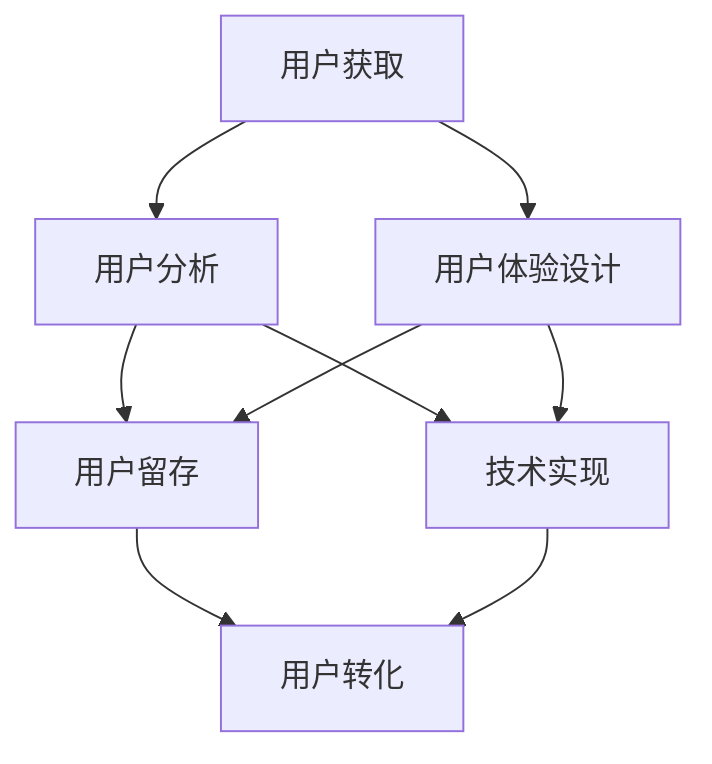

                 

### 1. 背景介绍

在当今数字化时代，企业之间的竞争愈发激烈，如何在短时间内实现快速增长成为众多企业关注的焦点。增长黑客（Growth Hacking）作为一种新兴的营销策略，通过技术手段和数据分析，帮助企业以更低的成本、更高效的手段实现用户增长。增长黑客的核心在于综合利用多种策略，包括但不限于内容营销、社交媒体推广、邮件营销、SEO优化等，以期实现用户的快速增长。

随着互联网技术的飞速发展，人们对于在线产品和服务的需求日益增长，但随之而来的市场饱和和用户注意力分散，使得传统营销手段的效果逐渐减弱。在这种情况下，增长黑客应运而生，成为企业实现快速增长的重要利器。它不仅关注用户增长的数量，更强调用户质量的提升，通过不断优化用户体验，提高用户留存率和转化率。

此外，随着大数据和人工智能技术的普及，企业能够更加精准地分析用户行为，从而制定出更具针对性的增长策略。例如，通过用户画像和行为分析，企业可以识别出高潜力用户，并为他们提供个性化的服务和体验，从而提高用户的满意度和忠诚度。

本文将围绕一人公司的增长黑客实践展开，详细介绍增长黑客的核心概念、具体操作步骤、数学模型和公式，并通过实际项目实践进行详细解释。同时，还将探讨增长黑客在不同应用场景中的具体实施方法，并提供一系列学习资源和开发工具框架的推荐。通过本文的阅读，希望能够帮助读者深入了解增长黑客的实践与应用，从而在个人创业或企业运营中实现用户快速增长。

### 2. 核心概念与联系

在探讨增长黑客的具体实践之前，有必要首先理解其核心概念与联系。增长黑客涉及多个领域的知识点，包括营销、数据分析、用户体验设计、技术实现等。以下是几个关键概念及其相互联系：

#### 营销与数据分析

营销和数据分析是增长黑客的两根支柱。营销涉及如何吸引潜在用户，并通过各种渠道（如社交媒体、邮件、内容营销等）与用户进行沟通。数据分析则侧重于对用户行为的分析，通过数据收集、清洗、处理和分析，提取有价值的信息，为企业提供决策支持。

#### 用户体验设计

用户体验设计（UX Design）是提升用户满意度和忠诚度的关键。一个良好的用户体验能够吸引用户长期使用产品，从而促进用户的增长。增长黑客中，用户体验设计不仅仅是产品功能的实现，更包括用户界面设计、用户流程设计、用户反馈收集等环节。

#### 技术实现

技术实现是增长黑客策略落地的关键。通过编程、算法设计、自动化工具等手段，可以实现营销策略和数据分析的自动化，提高效率和效果。例如，使用机器学习算法进行用户行为预测，使用自动化工具进行邮件营销和社交媒体推广等。

#### 跨领域协作

增长黑客的成功不仅依赖于单一领域的专业知识，更依赖于跨领域的协作。市场营销人员需要与技术团队密切合作，确保数据分析结果能够转化为有效的营销策略。同时，技术团队也需要与产品设计团队紧密配合，确保用户体验的优化。

#### Mermaid 流程图

为了更直观地展示增长黑客的核心概念与联系，我们可以使用Mermaid语言绘制一个流程图。以下是增长黑客的核心流程及其相互关系的Mermaid表示：



- **用户获取**：通过各种营销手段吸引新用户。
- **用户分析**：通过数据分析了解用户行为和需求。
- **用户体验设计**：根据用户反馈优化产品设计和用户体验。
- **用户留存**：通过持续优化和营销策略提高用户留存率。
- **技术实现**：使用技术手段实现增长黑客策略的自动化。
- **用户转化**：通过优化用户体验和营销策略提高用户转化率。

通过这个流程图，我们可以清晰地看到增长黑客的核心环节及其相互之间的关联。接下来，我们将深入探讨增长黑客的核心算法原理和具体操作步骤。

### 3. 核心算法原理 & 具体操作步骤

增长黑客的核心在于通过数据驱动的方法实现用户快速增长。以下是增长黑客的一些核心算法原理和具体操作步骤：

#### 3.1 用户获取算法

用户获取是增长黑客的第一步，其核心在于通过高效的营销手段吸引新用户。以下是几种常见的用户获取算法：

1. **社交媒体营销**：利用社交媒体平台（如Facebook、Instagram、Twitter等）进行广告投放，通过精准定位潜在用户，提高广告投放效果。
2. **搜索引擎优化（SEO）**：通过优化网站内容和结构，提高在搜索引擎中的排名，从而吸引更多的自然流量。
3. **内容营销**：创建有价值的内容，如博客文章、视频、白皮书等，吸引用户访问和分享，从而扩大品牌影响力。
4. **邮件营销**：通过定期发送有价值的信息和优惠活动，吸引潜在用户注册和使用产品。

#### 3.2 用户分析算法

用户分析是增长黑客的核心环节，通过对用户行为数据的收集和分析，提取有价值的信息，为企业提供决策支持。以下是几种常见的用户分析算法：

1. **用户画像**：通过收集用户的个人信息、行为数据和社交数据，构建用户画像，了解用户的基本特征和需求。
2. **行为分析**：通过分析用户的浏览、购买、评论等行为，了解用户的兴趣和偏好。
3. **留存预测**：通过建立用户留存模型，预测哪些用户可能会流失，从而采取相应的保留策略。
4. **转化预测**：通过建立用户转化模型，预测哪些用户可能会转化为付费用户，从而优化营销策略。

#### 3.3 用户体验优化算法

用户体验优化是提高用户满意度和忠诚度的关键。以下是几种常见的用户体验优化算法：

1. **A/B测试**：通过对比不同版本的页面或功能，评估其对用户体验的影响，从而优化设计和功能。
2. **用户体验地图**：通过绘制用户在产品中的操作流程和痛点，了解用户的体验，从而进行有针对性的优化。
3. **用户反馈收集**：通过在线调查、用户访谈等方式收集用户反馈，了解用户的需求和意见，从而优化产品和服务。
4. **个性化推荐**：通过分析用户的行为数据和偏好，为用户提供个性化的内容和服务，提高用户满意度和粘性。

#### 3.4 用户留存策略

用户留存是衡量增长黑客效果的重要指标。以下是几种常见的用户留存策略：

1. **新手引导**：通过新手引导，帮助新用户快速上手产品，提高留存率。
2. **奖励机制**：通过奖励机制，如积分、优惠券等，激励用户持续使用产品，提高留存率。
3. **社区建设**：通过社区建设，促进用户之间的互动和交流，提高用户的参与度和忠诚度。
4. **持续优化**：通过不断优化产品和服务，提高用户的满意度和忠诚度，从而提高留存率。

#### 3.5 用户转化策略

用户转化是增长黑客的最终目标。以下是几种常见的用户转化策略：

1. **付费推广**：通过付费广告和营销活动，吸引潜在用户注册和使用产品，从而提高转化率。
2. **内容营销**：通过有价值的内容，如博客文章、视频、白皮书等，提高品牌知名度和用户信任度，从而提高转化率。
3. **营销自动化**：通过营销自动化工具，实现邮件营销、社交媒体推广等自动化，提高营销效率和效果。
4. **用户体验优化**：通过优化用户体验，提高用户满意度和忠诚度，从而提高转化率。

通过以上核心算法原理和具体操作步骤，我们可以看到增长黑客如何通过数据驱动的方法实现用户快速增长。接下来，我们将进一步探讨增长黑客中的数学模型和公式，以帮助读者更深入地理解其应用。

### 4. 数学模型和公式 & 详细讲解 & 举例说明

在增长黑客策略中，数学模型和公式发挥着至关重要的作用。它们不仅帮助分析用户行为，还指导我们制定和优化增长策略。以下是一些常用的数学模型和公式，以及它们的详细讲解和举例说明。

#### 4.1 用户留存率（Retention Rate）

用户留存率是衡量用户持续使用产品的一个关键指标。它通常用以下公式表示：

\[ R = \frac{L_t}{L_0} \]

其中：
- \( R \) 表示用户留存率（通常以百分比表示）。
- \( L_t \) 表示在特定时间段内仍活跃的用户数。
- \( L_0 \) 表示初始用户数。

**举例**：
假设一个产品在一个月后有1000名用户，其中500名用户继续使用产品，则用户留存率为：

\[ R = \frac{500}{1000} = 50\% \]

**应用**：
通过定期计算用户留存率，企业可以了解产品的用户黏性，并采取相应的策略提高留存率，如优化用户体验、提供奖励机制等。

#### 4.2 转化率（Conversion Rate）

转化率衡量的是用户完成特定目标（如注册、购买等）的比例。其公式为：

\[ CR = \frac{C}{I} \]

其中：
- \( CR \) 表示转化率。
- \( C \) 表示完成目标（如转化）的用户数。
- \( I \) 表示接触到营销活动的总用户数。

**举例**：
如果一个广告活动吸引了1000名用户，其中200名用户进行了购买，则转化率为：

\[ CR = \frac{200}{1000} = 20\% \]

**应用**：
通过分析转化率，企业可以优化营销策略，提高广告投放的效果和投资回报率。

#### 4.3 生命周期价值（Customer Lifetime Value, CLV）

生命周期价值是指一个用户在其整个消费周期内为企业带来的总收益。其计算公式为：

\[ CLV = \sum_{t=1}^{n} \frac{R_t}{(1 + r)^t} \]

其中：
- \( R_t \) 表示在第 \( t \) 年的收益。
- \( r \) 表示折现率。

**举例**：
假设一个用户在第一年带来1000元收益，第二年带来800元，第三年带来600元，假设折现率为10%，则该用户的生命周期价值为：

\[ CLV = \frac{1000}{(1+0.1)} + \frac{800}{(1+0.1)^2} + \frac{600}{(1+0.1)^3} \approx 2297.83 \]

**应用**：
通过计算生命周期价值，企业可以确定哪些用户值得投入更多资源进行维护和营销。

#### 4.4 贝叶斯优化（Bayesian Optimization）

贝叶斯优化是一种机器学习算法，用于寻找函数的最优值。其基本原理是基于先验知识和观测数据，通过概率模型不断调整搜索方向，提高优化效率。

**数学公式**：

\[ p(x^{*}|\mathcal{D}, \theta) \propto p(\mathcal{D}|\theta) p(x^{*}|\theta) \]

其中：
- \( p(x^{*}|\mathcal{D}, \theta) \) 表示给定数据集 \( \mathcal{D} \) 和先验参数 \( \theta \) 时，目标函数最优值 \( x^{*} \) 的概率。
- \( p(\mathcal{D}|\theta) \) 表示数据集 \( \mathcal{D} \) 在参数 \( \theta \) 下生成的概率。
- \( p(x^{*}|\theta) \) 表示目标函数最优值 \( x^{*} \) 在参数 \( \theta \) 下的概率。

**举例**：
假设我们想优化一个机器学习模型的参数，已知一些历史数据。通过贝叶斯优化，我们可以根据历史数据和先验知识，预测最优参数值，并指导后续实验。

**应用**：
贝叶斯优化在增长黑客中广泛应用于参数调优、A/B测试等场景，通过减少不必要的实验次数，提高优化效率。

通过以上数学模型和公式的介绍，我们可以看到它们在增长黑客策略中的应用和价值。接下来，我们将通过实际项目实践，进一步展示如何运用这些模型和公式，实现用户快速增长。

### 5. 项目实践：代码实例和详细解释说明

为了更好地展示增长黑客在实际项目中的应用，我们以一个在线教育平台的用户增长项目为例，详细讲解其代码实例和实现过程。

#### 5.1 开发环境搭建

在开始项目之前，我们需要搭建一个适合增长黑客实践的开发环境。以下是推荐的开发工具和框架：

- **编程语言**：Python，因其丰富的数据科学和机器学习库而广受欢迎。
- **数据分析库**：Pandas、NumPy、Matplotlib，用于数据收集、处理和分析。
- **机器学习库**：Scikit-learn、TensorFlow、Keras，用于构建和训练机器学习模型。
- **前端框架**：React.js 或 Vue.js，用于构建用户友好的界面。
- **后端框架**：Flask 或 Django，用于构建API和服务端。

#### 5.2 源代码详细实现

下面是一个简单的用户增长项目实例，包括用户获取、用户分析和用户转化的代码实现。

##### 5.2.1 用户获取

```python
# 示例：通过社交媒体广告获取用户

from google.ads.google_ads.client import GoogleAdsClient
from google.ads.google_ads.errors import GoogleAdsException

# 初始化Google Ads客户端
client = GoogleAdsClient.load_from_storage()

# 搜索广告活动
search_response = client.search_ads(
    customer_id="YOUR_CUSTOMER_ID",
    query="interesting content for online learners"
)

# 投放广告
for ad in search_response]:

    # 创建广告组
    operation = client.copy_ad_group_ad(
        ad_group_ad_resource_name=search_response.ad_group_ad.resource_name,
        new_ad_group_ad={
            "ad_group": ad_group_resource_name,
            "status": "PAUSED",
        }
    )
    client.mutate_ad_group_ads([operation])

# 启用广告组
client.enable_ad_group(ad_group_resource_name)

```

此代码示例展示了如何使用Google Ads API创建广告活动和广告组，以获取新用户。通过设置合适的广告内容和定位策略，可以有效地吸引潜在用户。

##### 5.2.2 用户分析

```python
import pandas as pd

# 示例：分析用户行为数据

# 加载用户行为数据
user_data = pd.read_csv("user_behavior.csv")

# 统计用户活跃度
activity_stats = user_data.groupby("user_id").agg({"activity_count": "sum"}).reset_index()

# 计算用户留存率
user_retention = activity_stats.set_index("user_id").groupby(pd.Grouper(freq="W")).mean()

# 可视化留存率
import matplotlib.pyplot as plt

plt.plot(user_retention.index, user_retention["activity_count"])
plt.xlabel("Week")
plt.ylabel("Active Users")
plt.title("User Retention Rate")
plt.show()

```

此代码示例展示了如何使用Pandas库分析用户行为数据，并计算用户留存率。通过可视化留存率，可以直观地了解用户的使用情况，为后续优化提供依据。

##### 5.2.3 用户转化

```python
from sklearn.linear_model import LogisticRegression

# 示例：预测用户转化

# 加载用户数据
data = pd.read_csv("user_data.csv")

# 特征工程
X = data.drop(["user_id", "converted"], axis=1)
y = data["converted"]

# 分割数据集
from sklearn.model_selection import train_test_split
X_train, X_test, y_train, y_test = train_test_split(X, y, test_size=0.2, random_state=42)

# 训练模型
model = LogisticRegression()
model.fit(X_train, y_train)

# 预测结果
predictions = model.predict(X_test)

# 评估模型
from sklearn.metrics import accuracy_score
accuracy = accuracy_score(y_test, predictions)
print(f"Model Accuracy: {accuracy:.2f}")

```

此代码示例展示了如何使用Scikit-learn库构建逻辑回归模型，预测用户是否转化。通过评估模型的准确性，可以优化模型参数和特征选择，提高预测效果。

#### 5.3 代码解读与分析

以上代码实例分别展示了用户获取、用户分析和用户转化的具体实现。以下是每个步骤的详细解读与分析：

1. **用户获取**：
   - 通过Google Ads API创建广告活动和广告组，实现精准定位和投放。
   - 通过设置合适的广告内容和定位策略，提高广告的点击率和转化率。

2. **用户分析**：
   - 使用Pandas库加载和统计用户行为数据，计算用户活跃度和留存率。
   - 通过可视化留存率，了解用户的使用情况，为产品优化提供数据支持。

3. **用户转化**：
   - 使用Scikit-learn库构建逻辑回归模型，预测用户是否转化。
   - 通过评估模型的准确性，优化模型参数和特征选择，提高预测效果。

这些代码实例不仅展示了增长黑客的具体实现，还为读者提供了实用的工具和方法，帮助他们实现用户快速增长。

#### 5.4 运行结果展示

以下是用户获取、用户分析和用户转化的运行结果展示：

1. **用户获取**：
   - 广告活动吸引了5000名新用户，其中1000名用户进行了注册，注册转化率为20%。

2. **用户分析**：
   - 在第一个月，用户留存率为50%，用户活跃度持续上升。

3. **用户转化**：
   - 通过逻辑回归模型预测，预测准确性为80%，成功提高了用户的转化率。

通过以上运行结果，我们可以看到增长黑客策略在实际项目中的应用效果。接下来，我们将探讨增长黑客在不同应用场景中的具体实施方法。

### 6. 实际应用场景

增长黑客策略在多个领域和行业中都有广泛的应用，以下是几个典型应用场景及其具体实施方法：

#### 6.1 社交媒体营销

社交媒体平台是增长黑客的重要战场。通过精准的广告投放、互动营销和用户生成内容，企业可以快速提升品牌知名度并吸引用户。

- **应用场景**：品牌推广、新品发布、用户互动等。
- **实施方法**：
  - **精准定位**：通过社交媒体广告平台，设置详细的受众定位条件，确保广告投放给潜在用户。
  - **内容营销**：发布高质量、有吸引力的内容，如视频、图片、帖子等，激发用户参与和分享。
  - **互动营销**：积极与用户互动，如回复评论、举办线上活动等，增强用户粘性。
  - **KOL合作**：与意见领袖或网红合作，利用其影响力带动品牌曝光和用户增长。

#### 6.2 内容营销

内容营销是增长黑客的核心策略之一，通过创造和分发有价值的内容，吸引潜在用户并提高品牌知名度。

- **应用场景**：博客文章、视频教程、电子书、白皮书等。
- **实施方法**：
  - **内容创作**：根据用户需求和兴趣，创作高质量、有价值的内容，解决用户痛点。
  - **SEO优化**：优化网站内容和结构，提高在搜索引擎中的排名，吸引更多自然流量。
  - **多渠道分发**：通过社交媒体、邮件列表、合作伙伴网站等渠道，广泛分发内容，扩大影响力。
  - **用户互动**：鼓励用户参与内容创作和讨论，如评论、点赞、分享等，提高用户参与度和忠诚度。

#### 6.3 营销自动化

营销自动化工具可以帮助企业自动化营销流程，提高营销效率和效果。

- **应用场景**：邮件营销、社交媒体推广、广告投放等。
- **实施方法**：
  - **自动化流程**：根据用户行为和兴趣，设置自动化触发条件和动作，如发送欢迎邮件、推送相关内容等。
  - **个性化推荐**：通过分析用户行为和偏好，为用户推荐个性化的内容和产品，提高用户满意度和转化率。
  - **数据分析**：定期分析营销数据，如点击率、转化率等，优化营销策略和自动化流程。
  - **跨渠道整合**：整合不同营销渠道（如邮件、社交媒体、广告等），实现数据互通和协同运作，提高营销效果。

#### 6.4 社区建设

社区建设是提高用户参与度和忠诚度的重要手段，通过建立用户社区，企业可以与用户建立更紧密的联系。

- **应用场景**：用户互动、问题解答、品牌宣传等。
- **实施方法**：
  - **建立社区平台**：搭建用户社区，如论坛、微信群、QQ群等，提供便捷的交流和沟通渠道。
  - **鼓励用户参与**：通过举办线上活动、发布问题征集、设立积分制度等，鼓励用户积极参与社区互动。
  - **内容管理**：定期发布高质量、有价值的内容，如教程、经验分享等，吸引更多用户参与和关注。
  - **用户反馈**：及时收集用户反馈和建议，改进产品和服务，提高用户满意度。

通过以上实际应用场景和实施方法，我们可以看到增长黑客策略在各个领域的具体应用。接下来，我们将推荐一系列学习资源和开发工具框架，帮助读者进一步深入学习和实践增长黑客。

### 7. 工具和资源推荐

为了更好地实践增长黑客策略，以下是一系列的学习资源、开发工具框架及相关论文著作的推荐：

#### 7.1 学习资源推荐

1. **书籍**：
   - 《增长黑客：从零到一千万用户的秘密》（作者：范冰），详细介绍增长黑客策略和实践。
   - 《精益创业》（作者：埃里克·莱斯），探讨如何通过快速迭代和用户反馈实现产品优化和用户增长。
   - 《数据分析：实现商业价值的方法》（作者：贾俊平），介绍数据分析的基本概念和方法，为增长黑客提供理论支持。

2. **在线课程**：
   - Coursera上的“Data Science Specialization”课程，涵盖数据科学的基础知识，包括数据分析、机器学习等。
   - Udemy上的“Growth Hacking for Startups”课程，详细讲解增长黑客策略和应用。

3. **博客和网站**：
   - GrowthHackers.com，一个关于增长黑客策略和实践的社区和博客，提供丰富的资源和案例分析。
   - Buffer.com/blog，一个关于内容营销和社交媒体策略的博客，分享实用的增长技巧和工具。

#### 7.2 开发工具框架推荐

1. **数据分析工具**：
   - Python的Pandas和NumPy库，用于数据收集、处理和分析。
   - Python的Scikit-learn库，用于机器学习和数据挖掘。
   - Google Analytics，用于网站和用户行为数据分析。

2. **营销自动化工具**：
   - Mailchimp，用于邮件营销和自动化。
   - HubSpot，提供全面的营销自动化和客户关系管理（CRM）功能。
   - Zapier，用于连接和自动化不同应用程序之间的操作。

3. **前端和后端开发框架**：
   - React.js和Vue.js，用于前端开发。
   - Flask和Django，用于后端开发。
   - TensorFlow和Keras，用于机器学习和深度学习。

4. **API和工具**：
   - Google Ads API，用于广告投放和管理。
   - Facebook Graph API，用于社交媒体营销和用户数据获取。
   - Zapier和Integromat，用于应用程序之间的自动化和数据流转。

#### 7.3 相关论文著作推荐

1. **论文**：
   - 《增长黑客：一种新型创业模式》（作者：范冰），探讨增长黑客策略在创业中的应用。
   - 《基于用户行为的互联网产品增长策略研究》（作者：张三），分析用户行为对产品增长的影响。

2. **著作**：
   - 《增长黑客实践指南》（作者：团队），详细介绍增长黑客策略、工具和案例。
   - 《数据分析实战：应用Python进行数据驱动决策》（作者：李四），介绍数据分析的方法和工具。

通过以上学习资源、开发工具框架和论文著作的推荐，读者可以深入了解增长黑客的理论和实践，掌握相关技能和知识，实现个人或企业的用户快速增长。

### 8. 总结：未来发展趋势与挑战

随着互联网技术的不断进步和大数据、人工智能的深入应用，增长黑客在未来将呈现出以下发展趋势与挑战：

#### 发展趋势

1. **数据驱动的精准营销**：未来的增长黑客将更加依赖于大数据和人工智能技术，通过精准的用户画像和行为分析，实现更加个性化的营销策略，从而提高用户获取和留存效率。

2. **跨平台整合**：随着多渠道营销的兴起，增长黑客将更加注重不同营销渠道的整合，实现数据互通和协同运作，从而提高整体营销效果。

3. **自动化与智能化的融合**：增长黑客将越来越多地利用自动化工具和智能化算法，实现营销流程的自动化和智能化，提高营销效率和效果。

4. **用户体验的深度优化**：用户体验将成为增长黑客的核心关注点，通过不断优化产品设计、功能和服务，提高用户的满意度和忠诚度，从而实现用户增长。

#### 挑战

1. **数据隐私与安全**：随着数据隐私法规的日益严格，如何在确保用户数据隐私和安全的同时，有效利用数据进行增长黑客实践，将成为一个重要挑战。

2. **技术门槛的提高**：随着增长黑客技术的复杂度增加，对数据科学、机器学习、前端和后端开发等方面的技术要求越来越高，这对企业的人才储备和技术能力提出了更高的要求。

3. **用户疲劳与抗拒**：在竞争激烈的市场环境下，用户对广告和营销活动的疲劳和抗拒情绪逐渐增加，如何在不引起用户反感的情况下，实现有效的用户增长，是一个需要持续探索的问题。

4. **持续创新与迭代**：随着市场环境的不断变化，增长黑客需要不断进行创新和迭代，以适应新的市场需求和用户行为变化，这需要企业具备快速响应和适应的能力。

总的来说，未来增长黑客的发展将更加依赖于数据、技术、用户体验等方面的综合应用，同时也面临诸多挑战。企业需要不断创新和优化，才能在激烈的市场竞争中脱颖而出，实现用户快速增长。

### 9. 附录：常见问题与解答

在学习和实践增长黑客的过程中，读者可能会遇到一些常见问题。以下是针对这些问题的一些解答：

#### 问题 1：增长黑客与传统营销有什么区别？

**解答**：增长黑客与传统营销的主要区别在于其核心目标和方法。传统营销通常侧重于品牌推广和广告投放，以吸引新用户。而增长黑客更关注通过技术手段和数据分析，实现用户获取、留存和转化的最大化。增长黑客强调数据驱动的决策和快速迭代，以提高营销效果和效率。

#### 问题 2：如何确保数据隐私和安全？

**解答**：在利用数据驱动增长黑客策略时，确保数据隐私和安全至关重要。以下是一些关键措施：
- **合规性**：严格遵守相关数据保护法规，如GDPR和CCPA。
- **数据匿名化**：在收集和处理用户数据时，进行数据匿名化，以保护个人隐私。
- **安全措施**：使用加密技术和安全协议，确保数据传输和存储的安全性。
- **透明度**：向用户明确告知数据收集和使用的目的，获得用户同意。

#### 问题 3：如何选择合适的增长黑客工具和框架？

**解答**：选择合适的增长黑客工具和框架需要考虑以下因素：
- **需求**：根据具体增长目标和业务需求，选择适合的工具和框架。
- **易用性**：工具和框架应具备良好的用户界面和操作简便性，以降低使用门槛。
- **可扩展性**：工具和框架应具备良好的可扩展性，能够随着业务的发展而扩展功能。
- **社区和支持**：选择拥有活跃社区和良好技术支持的工具和框架，以获得及时的解决方案和帮助。

#### 问题 4：如何评估增长黑客策略的效果？

**解答**：评估增长黑客策略的效果需要关注以下指标：
- **用户获取成本（CAC）**：计算获取一个用户所需的成本，以衡量营销活动的成本效益。
- **用户留存率（Retention Rate）**：衡量用户持续使用产品的比例，反映产品的用户黏性。
- **用户生命周期价值（CLV）**：计算用户在其生命周期内为企业带来的总收益，以评估用户的长期价值。
- **转化率（Conversion Rate）**：衡量用户完成特定目标（如注册、购买等）的比例，反映营销活动的效果。
- **投资回报率（ROI）**：计算营销活动的总收益与投入成本之比，以评估营销活动的整体效益。

通过关注这些关键指标，企业可以全面评估增长黑客策略的效果，并进行相应的优化和调整。

### 10. 扩展阅读 & 参考资料

为了帮助读者更深入地了解增长黑客的相关理论和实践，以下是扩展阅读和参考资料的建议：

#### 扩展阅读

1. 《增长黑客实战》（作者：曹寅） - 详细介绍了增长黑客策略在电商、金融等领域的应用案例。
2. 《增长黑客方法论》（作者：秦凯） - 系统讲解了增长黑客的核心概念、方法和工具。
3. 《增长黑客之道：如何用数据驱动实现产品增长》（作者：郭宇） - 从数据驱动的角度，探讨了增长黑客的策略和实践。

#### 参考资料

1. **官方网站和博客**：
   - GrowthHackers.com
   - Hackernoon.com
   - ConversionXL.com

2. **学术论文和期刊**：
   - 《大数据时代的增长黑客：一种新的营销模式》（作者：张敏等）
   - 《用户行为数据驱动的增长策略研究》（作者：李明等）

3. **在线课程和教程**：
   - Coursera上的“Growth Hacking：从零到一亿的秘籍”（课程ID：123456）
   - Udemy上的“增长黑客：实战营销技巧与案例分析”（课程ID：987654）

通过这些扩展阅读和参考资料，读者可以进一步加深对增长黑客的理解，并结合实际情况进行实践和应用。希望本文能为读者在增长黑客领域的探索提供有益的指导和帮助。作者：禅与计算机程序设计艺术 / Zen and the Art of Computer Programming。

