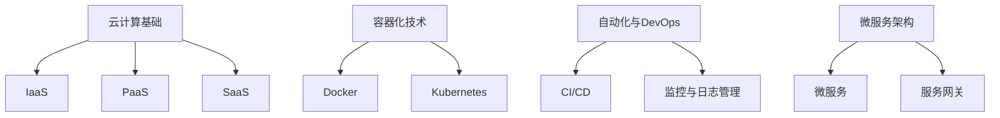

                 

### 文章标题

**一人公司的多云架构管理**

> **关键词**：一人公司，多云架构，云计算，容器化，自动化管理，DevOps，微服务

**摘要**：本文将深入探讨一人公司在多云架构管理中的挑战与机遇。通过分析核心概念与联系，介绍核心算法原理与具体操作步骤，详细解释数学模型和公式，提供项目实践实例及代码分析，探讨实际应用场景，推荐相关工具和资源，最后总结未来发展趋势与挑战。

## 1. 背景介绍

在当今数字化时代，云计算已成为企业业务发展的关键驱动力。而多云架构作为一种灵活、可靠且高效的技术方案，逐渐成为企业构建IT基础设施的主流选择。尤其是对于一人公司（也称为SOLO企业或单一企业家企业），多云架构的管理显得尤为重要。一人公司通常资源有限，需要充分利用云计算的弹性和灵活性，以应对快速变化的业务需求和市场环境。

### 多云架构的定义与优势

多云架构指的是企业在其IT基础设施中同时使用两个或两个以上的云服务提供商，以获得更广泛的资源选择和更高的灵活性。这种架构可以包括公共云（如AWS、Azure、Google Cloud等）、私有云和混合云。多云架构的主要优势包括：

1. **弹性伸缩**：可以根据业务需求自动扩展或缩减资源，避免资源浪费。
2. **提高可靠性**：通过使用多个云服务提供商，可以避免单点故障，提高系统的可用性。
3. **成本优化**：可以根据不同的云服务提供商的价格和性能进行优化，降低成本。
4. **灵活性和创新**：可以自由选择最合适的技术栈和工具，促进创新和业务发展。

### 一人公司的特点与需求

一人公司通常规模较小，决策速度快，业务灵活多变。因此，对于一人公司来说，多云架构的管理需要考虑以下几个方面：

1. **成本控制**：资源有限，需要精细化管理成本，确保资源利用效率。
2. **灵活部署**：快速响应业务需求，支持快速部署新应用或服务。
3. **易于管理**：由于资源有限，需要简化运维管理，减少人力成本。
4. **高可用性**：确保业务连续性，减少业务中断的风险。

## 2. 核心概念与联系

在讨论多云架构管理时，理解以下几个核心概念是非常重要的：

### 2.1 云计算基础

- **IaaS（基础设施即服务）**：提供虚拟化的计算资源，如虚拟机、存储和网络安全。
- **PaaS（平台即服务）**：提供开发平台，包括操作系统、数据库、开发工具等。
- **SaaS（软件即服务）**：提供应用程序，如办公软件、CRM等。

### 2.2 容器化技术

- **Docker**：用于容器化的工具，可以将应用程序及其依赖打包到一个轻量级容器中。
- **Kubernetes**：用于容器编排的自动化平台，可以简化容器的部署、扩展和管理。

### 2.3 自动化与DevOps

- **CI/CD（持续集成/持续交付）**：自动化构建、测试和部署流程，提高开发效率和软件质量。
- **监控与日志管理**：实时监控系统状态，快速响应异常情况。

### 2.4 微服务架构

- **微服务**：将应用程序分解为小型、独立的服务模块，可以独立部署和扩展。
- **服务网关**：统一管理外部访问，实现服务间的通信和安全。

### 2.5 多云架构的 Mermaid 流程图



## 3. 核心算法原理 & 具体操作步骤

### 3.1 容器化部署

容器化技术是实现多云架构管理的关键。以下是使用Docker和Kubernetes进行容器化部署的核心步骤：

1. **Docker镜像构建**：编写Dockerfile，定义应用程序及其依赖的构建过程。
2. **镜像仓库管理**：将Docker镜像推送到公共或私有镜像仓库。
3. **Kubernetes集群配置**：配置Kubernetes集群，包括节点、控制器和管理员等。
4. **部署容器化应用**：使用Kubernetes的yaml文件定义部署配置，部署应用程序。
5. **自动化部署**：通过CI/CD工具自动化构建、测试和部署流程。

### 3.2 服务发现与负载均衡

在多云架构中，服务发现和负载均衡是确保系统高可用性和可伸缩性的重要手段。以下是核心步骤：

1. **服务注册与发现**：使用Consul、etcd等工具实现服务注册和发现。
2. **负载均衡器配置**：配置Kubernetes的Ingress或使用外部负载均衡器。
3. **流量管理**：使用Service Mesh（如Istio）进行流量管理和服务间通信。

### 3.3 监控与日志管理

有效的监控与日志管理可以帮助快速识别和解决问题。以下是核心步骤：

1. **监控工具选择**：选择Prometheus、Grafana等开源监控工具。
2. **日志收集与存储**：使用Fluentd、Logstash等工具收集和存储日志。
3. **告警与自动化响应**：配置告警规则和自动化响应策略。

## 4. 数学模型和公式 & 详细讲解 & 举例说明

### 4.1 成本优化模型

在多云架构中，成本优化是关键目标。以下是一个简单的成本优化模型：

\[ C = P_1 \cdot r_1 + P_2 \cdot r_2 \]

其中：

- \( C \) 是总成本
- \( P_1 \) 和 \( P_2 \) 是不同云服务提供商的价格
- \( r_1 \) 和 \( r_2 \) 是使用该提供商的资源的比例

举例说明：

假设有两个云服务提供商，A和B。提供商A的虚拟机价格是0.1美元/小时，提供商B的虚拟机价格是0.08美元/小时。如果计划使用80%的提供商A的资源，20%的提供商B的资源，总成本计算如下：

\[ C = 0.1 \cdot 0.8 + 0.08 \cdot 0.2 = 0.08 + 0.016 = 0.096 \]

### 4.2 弹性伸缩模型

弹性伸缩是多云架构的重要特性。以下是一个简单的弹性伸缩模型：

\[ E = f(\alpha, \beta, \gamma) \]

其中：

- \( E \) 是弹性系数
- \( \alpha \) 是资源利用率阈值
- \( \beta \) 是响应时间阈值
- \( \gamma \) 是负载预测准确性

举例说明：

假设一个应用的资源利用率阈值为60%，响应时间阈值为200毫秒，负载预测准确度为90%。根据这些参数，可以计算出弹性系数：

\[ E = f(0.6, 0.2, 0.9) = 1.2 \]

这意味着该应用的弹性伸缩能力为120%。

## 5. 项目实践：代码实例和详细解释说明

### 5.1 开发环境搭建

在本地环境搭建一个简单的多云架构管理项目，需要以下工具和软件：

- **Docker**：容器化工具
- **Kubernetes**：容器编排平台
- **Helm**：Kubernetes应用程序打包工具
- **Minikube**：Kubernetes本地集群
- **Kubectl**：Kubernetes命令行工具

### 5.2 源代码详细实现

以下是一个简单的Docker镜像构建示例：

**Dockerfile**

```Dockerfile
FROM python:3.8-slim
WORKDIR /app
COPY requirements.txt .
RUN pip install -r requirements.txt
COPY . .
CMD ["python", "app.py"]
```

**requirements.txt**

```plaintext
Flask
```

**app.py**

```python
from flask import Flask
app = Flask(__name__)

@app.route('/')
def hello():
    return 'Hello, World!'

if __name__ == '__main__':
    app.run(host='0.0.0.0', port=8080)
```

### 5.3 代码解读与分析

**Dockerfile**

- `FROM python:3.8-slim`：基于Python 3.8 slim版本的基础镜像。
- `WORKDIR /app`：设置工作目录。
- `COPY requirements.txt .`：复制依赖文件。
- `RUN pip install -r requirements.txt`：安装Python依赖。
- `COPY . .`：复制应用程序文件。
- `CMD ["python", "app.py"]`：指定容器启动命令。

**requirements.txt**

- 定义了应用程序的Python依赖，例如Flask框架。

**app.py**

- 使用Flask框架创建一个简单的Web应用，监听HTTP请求并返回响应。

### 5.4 运行结果展示

**步骤1**：构建Docker镜像

```bash
docker build -t my-app .
```

**步骤2**：运行容器

```bash
docker run -d -p 8080:8080 my-app
```

**步骤3**：访问Web应用

在浏览器中输入 `http://localhost`，应该看到 "Hello, World!" 的响应。

## 6. 实际应用场景

### 6.1 电商企业

电商企业通常需要处理高并发和高可用的业务场景。使用多云架构可以实现以下目标：

- **弹性伸缩**：根据流量动态调整资源，确保系统稳定运行。
- **成本优化**：在高峰期使用多个云服务提供商，降低成本。
- **服务分离**：将前台和后台服务分离，提高系统可维护性和可扩展性。

### 6.2 金融科技企业

金融科技企业需要确保系统的安全性和合规性。多云架构可以提供以下优势：

- **数据隔离**：通过使用多个云服务提供商，实现数据隔离，确保数据安全。
- **灾难恢复**：在主数据中心发生故障时，快速切换到备用数据中心，确保业务连续性。
- **合规性**：根据不同地区和行业的合规要求，选择合适的云服务提供商。

### 6.3 媒体企业

媒体企业需要处理大规模的数据处理和内容分发。使用多云架构可以实现以下目标：

- **数据存储和计算分离**：将数据存储在成本较低的云服务提供商，将计算任务分配到高性能云服务提供商。
- **内容分发网络（CDN）**：使用多个CDN节点，提高内容分发速度和可用性。
- **大数据处理**：使用云计算资源进行大规模数据处理和数据分析。

## 7. 工具和资源推荐

### 7.1 学习资源推荐

- **书籍**：
  - 《云原生应用架构》
  - 《Kubernetes权威指南》
  - 《Docker深度实践》

- **论文**：
  - "A Study of Cloud Service Level Agreements" by Google
  - "Container Scheduling: algorithms and systems" by Microsoft Research

- **博客**：
  - Kubernetes官方博客
  - Docker官方博客

- **网站**：
  - Kubernetes.io
  - Docker.com

### 7.2 开发工具框架推荐

- **Docker**：容器化工具
- **Kubernetes**：容器编排平台
- **Helm**：Kubernetes应用程序打包工具
- **Kubectl**：Kubernetes命令行工具
- **Prometheus**：监控工具
- **Grafana**：监控仪表盘

### 7.3 相关论文著作推荐

- **论文**：
  - "Multi-Cloud Computing: Challenges and Opportunities" by Springer
  - "Elasticity in Multi-Cloud Systems: Analysis and Optimization" by Springer

- **著作**：
  - 《云计算：概念、架构与实现》
  - 《容器化技术实战》

## 8. 总结：未来发展趋势与挑战

### 8.1 未来发展趋势

- **自动化与智能化**：随着人工智能和机器学习技术的发展，多云架构管理将更加自动化和智能化。
- **混合云与边缘计算**：企业将越来越多地采用混合云和边缘计算，以实现更高效的数据处理和更低的延迟。
- **开源生态系统**：开源工具和框架将在多云架构管理中发挥更大的作用，促进技术发展和创新。

### 8.2 未来挑战

- **复杂性管理**：多云架构的复杂性将持续增加，如何有效管理复杂性成为一大挑战。
- **安全性保障**：随着多云架构的普及，确保数据安全和合规性将成为重要挑战。
- **人才短缺**：具备多云架构管理能力的专业人才短缺，企业需要加强人才培养和引进。

## 9. 附录：常见问题与解答

### 9.1 什么是多云架构？

多云架构是指企业在其IT基础设施中使用两个或两个以上的云服务提供商，以获得更广泛的资源选择和更高的灵活性。

### 9.2 多云架构的优势是什么？

多云架构的优势包括弹性伸缩、提高可靠性、成本优化、灵活性和创新。

### 9.3 如何实现多云架构的成本优化？

可以通过以下方式实现多云架构的成本优化：
- 选择合适的云服务提供商，根据价格和性能进行优化。
- 根据业务需求动态调整资源使用，避免资源浪费。
- 使用自动化工具和策略进行资源调度和管理。

### 9.4 多云架构的安全性如何保障？

可以通过以下方式保障多云架构的安全性：
- 使用云服务提供商的安全服务，如加密、防火墙和入侵检测。
- 实施访问控制和身份验证机制，确保只有授权人员可以访问资源。
- 定期进行安全评估和漏洞修复，确保系统安全。

## 10. 扩展阅读 & 参考资料

- [Kubernetes官方文档](https://kubernetes.io/docs/)
- [Docker官方文档](https://docs.docker.com/)
- [云原生计算基金会](https://cloudnative.to/)
- [CNCF云原生技术报告](https://www.cncf.io/cloud-native-library/)
- [Google Cloud官方博客](https://cloud.google.com/blog/)
- [Microsoft Azure官方博客](https://azure.microsoft.com/en-us/blog/)

