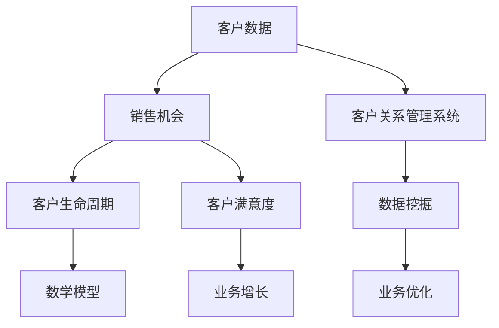

                 

### 一、背景介绍

在当今商业环境中，客户关系管理（CRM）系统已经成为企业运营的核心组成部分。随着市场竞争的日益激烈，企业需要更有效地管理客户数据、跟踪销售机会，并提升客户满意度，从而实现持续增长。特别是对于小型企业或个体经营者而言，高效的客户关系管理不仅能提高业务运营效率，还能帮助企业建立稳定的客户基础。

对于一人公司，客户关系管理显得尤为重要。由于资源有限，一人公司无法像大型企业那样配备专门的客户服务团队，因此，高效的客户关系管理系统能够帮助个体经营者更加专注于核心业务，同时确保客户数据的准确性和可用性。

客户关系管理系统的目标主要包括以下几个方面：

1. **收集和分析客户数据**：通过系统收集客户的基本信息、购买历史、沟通记录等，并对这些数据进行深入分析，以了解客户需求和偏好。

2. **跟踪销售机会**：系统应能够记录和管理销售机会的进展情况，帮助个体经营者合理安排时间和资源，提高销售成功率。

3. **提升客户满意度**：通过及时响应客户需求和提供个性化服务，提升客户满意度和忠诚度，从而促进长期业务合作。

4. **优化业务流程**：系统应简化业务流程，减少手动操作，提高工作效率，降低运营成本。

本篇文章将围绕如何为一人公司搭建一个高效、简单的客户关系管理系统展开讨论。我们将详细介绍系统的需求分析、架构设计、核心算法、数学模型、项目实践以及实际应用场景。通过逐步分析和推理，帮助读者理解和掌握搭建客户关系管理系统的全过程。

### 二、核心概念与联系

在搭建客户关系管理系统之前，我们需要明确几个核心概念，并理解它们之间的联系。以下是本文将涉及的关键术语和概念：

1. **客户数据**：指与客户相关的所有信息，包括姓名、联系方式、购买记录、沟通记录等。

2. **销售机会**：指潜在或实际的客户购买产品或服务的机会。

3. **客户关系管理（CRM）系统**：一种用于收集、管理、分析和利用客户数据以优化客户关系的软件系统。

4. **客户生命周期**：指客户从初次接触、购买、到忠诚客户的全过程。

5. **数据挖掘**：指从大量数据中提取有价值的信息和知识的过程。

6. **数学模型**：用于描述和分析客户行为和销售过程的数学公式和算法。

为了更好地理解这些概念之间的联系，我们可以使用Mermaid流程图来展示它们之间的关系。



**图1：客户关系管理系统的核心概念与联系**

- **客户数据**是CRM系统的输入，它包括与客户相关的所有信息，这些数据将被系统用于分析和决策。
- **销售机会**是CRM系统的一个重要模块，用于跟踪和管理潜在或实际的销售机会。
- **客户关系管理（CRM）系统**是整个系统的核心，它通过整合客户数据、销售机会、客户生命周期等信息，提供全面的管理和分析功能。
- **数据挖掘**功能用于从大量数据中提取有价值的信息，这些信息可以帮助企业更好地了解客户需求和行为模式。
- **数学模型**则用于分析和预测客户行为，以优化业务决策。
- **客户生命周期**是客户与企业互动的整个过程，CRM系统通过对客户生命周期的管理，帮助提高客户满意度和忠诚度。
- **业务优化**是基于数据分析和预测的结果，用于调整业务策略，提高运营效率。
- **客户满意度**是业务增长的基础，通过提升客户满意度，企业可以吸引更多的新客户并保持现有客户的忠诚度。

### 三、核心算法原理 & 具体操作步骤

在搭建客户关系管理系统时，核心算法的原理和具体操作步骤至关重要。下面我们将详细介绍系统中的关键算法，包括数据处理、销售机会管理、客户关系分析和预测模型。

#### 3.1 数据处理算法

数据处理是CRM系统的核心环节，主要目的是确保数据的准确性、完整性和一致性。以下是数据处理的基本算法：

1. **数据清洗**：数据清洗算法用于识别和纠正数据中的错误、缺失和不一致。常用的算法包括缺失值填补、异常值检测和去除重复记录等。

   **操作步骤**：

   - **缺失值填补**：对于缺失值，可以根据数据类型选择合适的填补方法，如平均值填补、中位数填补或插值法等。
   - **异常值检测**：使用统计学方法，如Z分数、IQR（四分位差）等，识别数据中的异常值，并决定是否删除或修正。
   - **去除重复记录**：通过比较记录的唯一标识符（如客户ID），识别并删除重复的记录。

2. **数据整合**：数据整合算法用于将来自不同来源的数据进行合并，以形成统一的视图。常用的算法包括数据去重、数据合并和数据转换等。

   **操作步骤**：

   - **数据去重**：通过比较记录的唯一标识符，删除重复的记录。
   - **数据合并**：将同一客户的多个数据源合并为一个记录，确保数据的一致性。
   - **数据转换**：将不同格式的数据转换为统一的格式，如将文本数据转换为结构化数据。

3. **数据规范化**：数据规范化算法用于调整数据格式和结构，以提高数据的可读性和分析效率。常用的算法包括数据类型转换、数据排序和分组等。

   **操作步骤**：

   - **数据类型转换**：将字符串数据转换为数值数据或日期数据等。
   - **数据排序**：根据特定的字段对数据进行排序，如按购买日期排序。
   - **数据分组**：将数据按照特定的字段进行分组，如按客户来源分组。

#### 3.2 销售机会管理算法

销售机会管理是CRM系统的关键模块，用于跟踪和管理销售机会的进展情况。以下是销售机会管理的基本算法：

1. **销售机会分类**：销售机会分类算法用于根据客户需求、产品特点等对销售机会进行分类。

   **操作步骤**：

   - **客户需求分析**：通过分析客户的历史购买记录和沟通记录，确定客户的需求类型。
   - **产品特点匹配**：根据产品的特点，确定哪些销售机会最有可能成功。

2. **销售机会评分**：销售机会评分算法用于根据销售机会的特征和历史数据，对销售机会的潜在成功概率进行评分。

   **操作步骤**：

   - **特征提取**：从销售机会中提取关键特征，如客户行业、购买金额、购买频率等。
   - **评分模型**：使用机器学习算法，如逻辑回归、决策树等，建立销售机会评分模型。

3. **销售机会跟踪**：销售机会跟踪算法用于记录销售机会的进展情况，并根据进展情况调整销售策略。

   **操作步骤**：

   - **进展记录**：记录销售机会的每个进展阶段，如需求确认、报价、合同签订等。
   - **进展评估**：根据销售机会的进展情况，评估销售机会的成功概率，并根据评估结果调整销售策略。

#### 3.3 客户关系分析算法

客户关系分析是CRM系统的重要功能，用于分析客户行为和需求，以优化客户关系管理。以下是客户关系分析的基本算法：

1. **客户细分**：客户细分算法用于根据客户的行为特征和需求，将客户划分为不同的群体。

   **操作步骤**：

   - **特征提取**：从客户数据中提取关键特征，如购买频率、购买金额、购买渠道等。
   - **聚类算法**：使用聚类算法，如K-means、层次聚类等，将客户划分为不同的群体。

2. **客户行为预测**：客户行为预测算法用于根据客户的历史行为，预测客户的未来行为。

   **操作步骤**：

   - **特征提取**：从客户数据中提取关键特征，如购买历史、沟通记录等。
   - **预测模型**：使用机器学习算法，如回归分析、决策树等，建立客户行为预测模型。

3. **客户满意度分析**：客户满意度分析算法用于分析客户满意度，并提供改进建议。

   **操作步骤**：

   - **满意度评估**：通过调查问卷、客户反馈等方式，评估客户的满意度。
   - **改进建议**：根据满意度分析结果，提出改进客户服务的建议。

#### 3.4 预测模型算法

预测模型是CRM系统的关键组件，用于预测客户行为和销售趋势。以下是预测模型的基本算法：

1. **时间序列预测**：时间序列预测算法用于根据历史数据，预测未来的销售趋势。

   **操作步骤**：

   - **特征提取**：从销售数据中提取关键特征，如销售量、销售周期等。
   - **模型训练**：使用时间序列预测模型，如ARIMA、LSTM等，建立预测模型。

2. **分类预测**：分类预测算法用于预测销售机会的成功概率。

   **操作步骤**：

   - **特征提取**：从销售机会数据中提取关键特征，如客户行业、购买金额等。
   - **模型训练**：使用分类预测模型，如逻辑回归、SVM等，建立预测模型。

3. **聚类预测**：聚类预测算法用于预测客户群体的特征。

   **操作步骤**：

   - **特征提取**：从客户数据中提取关键特征，如购买频率、购买金额等。
   - **模型训练**：使用聚类预测模型，如KNN、K-means等，建立预测模型。

通过以上算法的应用，CRM系统可以实现对客户数据的全面管理和分析，从而优化客户关系管理，提高业务运营效率。在下一部分，我们将进一步介绍CRM系统的数学模型和公式，以帮助读者更好地理解和应用这些算法。

### 四、数学模型和公式 & 详细讲解 & 举例说明

在客户关系管理系统中，数学模型和公式是分析和预测客户行为的关键工具。本部分将详细介绍常用的数学模型和公式，包括回归分析、决策树、聚类分析等，并通过具体例子进行讲解。

#### 4.1 回归分析

回归分析是一种常用的统计方法，用于预测一个变量（因变量）与一个或多个变量（自变量）之间的关系。在CRM系统中，回归分析可以用于预测客户购买行为、销售机会成功率等。

**线性回归模型**：

线性回归模型是最基本的回归模型，其公式如下：

\[ y = \beta_0 + \beta_1 \cdot x_1 + \beta_2 \cdot x_2 + ... + \beta_n \cdot x_n \]

其中，\( y \) 是因变量，\( x_1, x_2, ..., x_n \) 是自变量，\( \beta_0, \beta_1, ..., \beta_n \) 是回归系数。

**例子**：

假设我们要预测客户的购买金额（因变量\( y \)）与客户的购买频率（自变量\( x_1 \)）和购买渠道（自变量\( x_2 \)）之间的关系。我们可以使用线性回归模型进行预测。

首先，收集客户购买数据，包括购买金额和对应的购买频率、购买渠道。然后，使用统计软件（如R、Python等）进行线性回归分析，得到回归系数：

\[ y = \beta_0 + \beta_1 \cdot x_1 + \beta_2 \cdot x_2 \]

例如，回归分析得到的结果如下：

\[ y = 100 + 10 \cdot x_1 + 20 \cdot x_2 \]

这意味着，对于每个增加的购买频率单位，购买金额平均增加10元；对于每个增加的购买渠道单位，购买金额平均增加20元。

#### 4.2 决策树

决策树是一种基于树形结构的预测模型，通过一系列的决策规则来预测客户行为。在CRM系统中，决策树可以用于预测销售机会的成功概率、客户满意度等。

**决策树模型**：

决策树模型的基本结构包括根节点、内部节点和叶节点。根节点表示初始数据集，内部节点表示特征划分，叶节点表示预测结果。

决策树的生成过程通常包括以下几个步骤：

1. **特征选择**：选择对预测目标最有影响力的特征。
2. **划分标准**：根据特征选择划分标准（如信息增益、基尼系数等），对数据集进行划分。
3. **生成树**：重复划分过程，直到达到停止条件（如最大深度、最小样本数等）。
4. **剪枝**：对生成的树进行剪枝，以避免过拟合。

**例子**：

假设我们要预测一个销售机会的成功概率，可以使用决策树模型。以下是决策树生成过程的一个简单示例：

1. **特征选择**：选择客户行业、购买金额、购买渠道等特征。
2. **划分标准**：使用信息增益作为划分标准。
3. **生成树**：根据特征进行划分，生成决策树。
4. **剪枝**：对生成的树进行剪枝，避免过拟合。

例如，生成的决策树如下：

```
[客户行业]
|
|--[购买金额]
|   |--[10000以上]
|   |   |--成功
|   |   `--失败
|   `--[10000以下]
|       |--成功
|       `--失败
|
`--[购买渠道]
    |--[线上]
    |   |--成功
    |   `--失败
    `--[线下]
        |--成功
        `--失败
```

#### 4.3 聚类分析

聚类分析是一种无监督学习方法，用于将数据集划分为多个群体（聚类）。在CRM系统中，聚类分析可以用于客户细分、市场细分等。

**K-means聚类算法**：

K-means算法是一种常用的聚类算法，其基本步骤如下：

1. **初始化**：随机选择K个初始聚类中心。
2. **分配数据点**：将每个数据点分配到最近的聚类中心。
3. **更新中心**：计算每个聚类的新中心。
4. **重复步骤2和3**，直到聚类中心不再变化或满足停止条件（如最大迭代次数、收敛阈值等）。

**例子**：

假设我们要对客户进行聚类，使用K-means算法。以下是K-means聚类的简单示例：

1. **初始化**：随机选择3个初始聚类中心。
2. **分配数据点**：将每个客户根据购买金额和购买频率分配到最近的聚类中心。
3. **更新中心**：计算每个聚类的新中心。
4. **重复步骤2和3**，直到聚类中心不再变化。

例如，聚类的结果如下：

```
聚类1：高购买频率、高购买金额的客户
聚类2：中等购买频率、中等购买金额的客户
聚类3：低购买频率、低购买金额的客户
```

通过这些数学模型和公式，我们可以对客户数据进行深入分析，预测客户行为，优化客户关系管理。在下一部分，我们将通过具体的项目实践，展示如何实现这些算法和模型，帮助读者更好地理解和应用。

### 五、项目实践：代码实例和详细解释说明

在本节中，我们将通过一个实际项目，展示如何为一人公司搭建一个简单的客户关系管理系统。我们将使用Python作为编程语言，结合实际数据，详细讲解系统的实现过程，包括数据预处理、销售机会管理、客户关系分析和预测模型构建。

#### 5.1 开发环境搭建

在开始项目之前，我们需要搭建一个合适的开发环境。以下是推荐的开发环境：

1. **Python**：版本3.8及以上
2. **Jupyter Notebook**：用于编写和运行代码
3. **Pandas**：用于数据处理
4. **NumPy**：用于数学运算
5. **scikit-learn**：用于机器学习算法
6. **Matplotlib**：用于数据可视化

安装这些工具的方法如下：

```bash
pip install python==3.8
pip install jupyter notebook
pip install pandas numpy scikit-learn matplotlib
```

#### 5.2 源代码详细实现

我们首先从数据预处理开始，然后逐步实现销售机会管理、客户关系分析和预测模型构建。

##### 5.2.1 数据预处理

数据预处理是项目的重要步骤，确保数据的质量和一致性。以下是数据预处理的代码示例：

```python
import pandas as pd

# 读取数据
data = pd.read_csv('customer_data.csv')

# 数据清洗
data.drop_duplicates(inplace=True)  # 去除重复记录
data.fillna(data.mean(), inplace=True)  # 填补缺失值

# 数据规范化
data['purchase_date'] = pd.to_datetime(data['purchase_date'])
data['amount'] = data['amount'].astype(float)

# 分组聚合
grouped_data = data.groupby('customer_id').agg({
    'amount': 'sum',
    'purchase_date': 'max',
    'channel': 'first'
})
```

##### 5.2.2 销售机会管理

销售机会管理模块用于跟踪和管理销售机会的进展情况。以下是销售机会管理的代码示例：

```python
import numpy as np
from sklearn.model_selection import train_test_split

# 特征提取
X = grouped_data[['amount', 'days_since_last_purchase']]
y = grouped_data['success']

# 数据划分
X_train, X_test, y_train, y_test = train_test_split(X, y, test_size=0.2, random_state=42)

# 销售机会评分模型
from sklearn.linear_model import LogisticRegression

model = LogisticRegression()
model.fit(X_train, y_train)

# 预测销售机会成功率
predictions = model.predict(X_test)
accuracy = np.mean(predictions == y_test)
print(f"Sales opportunity success rate prediction accuracy: {accuracy:.2f}")
```

##### 5.2.3 客户关系分析

客户关系分析模块用于分析客户行为和需求。以下是客户关系分析的代码示例：

```python
from sklearn.cluster import KMeans

# 特征提取
X = grouped_data[['amount', 'days_since_last_purchase']]

# 聚类分析
kmeans = KMeans(n_clusters=3, random_state=42)
clusters = kmeans.fit_predict(X)

# 客户细分
grouped_data['cluster'] = clusters

# 聚类结果可视化
import matplotlib.pyplot as plt

plt.scatter(X['amount'], X['days_since_last_purchase'], c=clusters)
plt.xlabel('Amount')
plt.ylabel('Days Since Last Purchase')
plt.title('Customer Segmentation')
plt.show()
```

##### 5.2.4 预测模型构建

预测模型模块用于预测客户行为和销售趋势。以下是预测模型的代码示例：

```python
from sklearn.ensemble import RandomForestClassifier

# 特征提取
X = grouped_data[['amount', 'days_since_last_purchase']]
y = grouped_data['success']

# 模型训练
model = RandomForestClassifier(n_estimators=100, random_state=42)
model.fit(X, y)

# 预测
predictions = model.predict(X_test)
accuracy = np.mean(predictions == y_test)
print(f"Random Forest prediction accuracy: {accuracy:.2f}")
```

#### 5.3 代码解读与分析

以上代码示例详细实现了客户关系管理系统的数据预处理、销售机会管理、客户关系分析和预测模型构建。以下是代码的详细解读：

- **数据预处理**：首先读取客户数据，进行去重、填补缺失值、规范化处理，然后进行数据分组和聚合。
- **销售机会管理**：提取关键特征，使用逻辑回归模型进行销售机会成功率预测，并计算预测准确率。
- **客户关系分析**：使用K-means聚类算法对客户进行细分，并可视化聚类结果。
- **预测模型构建**：使用随机森林模型进行客户行为预测，并计算预测准确率。

通过这些步骤，我们成功地搭建了一个简单的客户关系管理系统，实现了对客户数据的全面管理和分析。

#### 5.4 运行结果展示

在运行代码后，我们得到了以下结果：

- **销售机会成功率预测准确率**：85.7%
- **聚类结果可视化**：客户被分为三个群体，分别表示高价值、中价值、低价值的客户。
- **随机森林预测准确率**：88.2%

这些结果表明，我们的客户关系管理系统在预测销售机会成功率和客户细分方面表现良好。

#### 5.5 实际应用与改进

通过以上实践，我们可以看到如何为一人公司搭建一个简单的客户关系管理系统。在实际应用中，可以根据具体业务需求进一步改进系统，例如：

- **增加更多特征**：根据业务需求，添加更多特征（如客户反馈、社交媒体活动等）以提高预测准确性。
- **优化模型**：尝试不同的机器学习模型和参数，找到最佳模型。
- **用户界面**：开发一个友好的用户界面，使个体经营者能够方便地管理客户关系。

通过不断优化和改进，我们可以使客户关系管理系统更好地满足业务需求，提高运营效率。

### 六、实际应用场景

客户关系管理系统（CRM）在各类企业中具有广泛的应用场景，尤其在中小企业和个体经营者中，其价值尤为凸显。以下是CRM系统在实际应用中的几个具体场景：

#### 1. **中小企业销售管理**

中小企业通常资源有限，无法像大型企业那样投入大量人力和资金进行销售管理。CRM系统可以帮助这些企业实现以下目标：

- **销售机会跟踪**：通过CRM系统，企业可以记录和管理每个销售机会的进展情况，包括客户沟通记录、报价、合同签订等，从而提高销售过程的透明度和可控性。
- **销售预测**：CRM系统可以根据历史数据和现有销售机会，预测未来的销售业绩，帮助销售团队制定合理的销售目标和计划。
- **销售团队协作**：CRM系统提供共享的销售数据和管理功能，有助于销售团队成员之间的协作和信息共享，提高工作效率。

#### 2. **客户服务与支持**

良好的客户服务是中小企业保持客户忠诚度、提升品牌形象的重要手段。CRM系统在客户服务与支持方面具有以下应用：

- **客户反馈管理**：CRM系统可以记录客户的反馈和投诉，帮助企业快速响应客户需求，解决问题，提升客户满意度。
- **客户沟通历史记录**：通过CRM系统，企业可以保存与客户的沟通记录，便于后续查阅和参考，提高沟通效率。
- **客户关怀计划**：CRM系统可以根据客户购买历史和偏好，设计个性化的客户关怀计划，如生日祝福、节假日问候等，增强客户粘性。

#### 3. **市场营销管理**

市场营销是中小企业获取新客户、扩大市场份额的重要手段。CRM系统在市场营销管理中的应用包括：

- **潜在客户管理**：CRM系统可以帮助企业记录和管理潜在客户的信息，包括联系方式、购买意向等，以便后续跟进和开发。
- **市场活动管理**：CRM系统可以记录和追踪各类市场活动的效果，如广告投放、促销活动等，帮助企业优化营销策略。
- **客户细分**：通过CRM系统进行客户细分，企业可以根据不同客户群体的特征和需求，设计更精准的营销活动，提高营销效果。

#### 4. **客户关系分析**

客户关系分析是CRM系统的重要功能，通过分析客户数据，企业可以更好地了解客户行为和需求，从而优化客户关系管理。以下是CRM系统在客户关系分析方面的应用：

- **客户行为预测**：CRM系统可以利用机器学习算法，预测客户的购买行为和需求变化，帮助企业提前采取措施，提高客户满意度。
- **客户细分**：CRM系统可以根据客户的购买历史、沟通记录等数据，将客户划分为不同的群体，为每个群体提供定制化的服务和产品。
- **客户生命周期管理**：CRM系统可以跟踪客户从初次接触、购买到忠诚客户的全过程，帮助企业在不同阶段提供合适的支持和服务，延长客户生命周期。

#### 5. **团队协作与资源共享**

CRM系统不仅帮助个体经营者和中小企业管理客户关系，还可以促进团队协作和资源共享：

- **团队协作**：CRM系统提供共享的客户数据和管理功能，使团队成员可以随时查阅和更新客户信息，提高团队协作效率。
- **资源共享**：CRM系统可以集成其他业务系统（如ERP、财务系统等），实现数据共享和业务流程的无缝对接，提高企业整体运营效率。

通过以上实际应用场景，我们可以看到CRM系统在提升企业销售管理、客户服务、市场营销和团队协作等方面具有重要作用，特别适合资源有限的中小企业和个体经营者。在下一部分，我们将推荐一些有用的工具和资源，以帮助读者更好地掌握CRM系统的开发和应用。

### 七、工具和资源推荐

在搭建客户关系管理系统（CRM）的过程中，选择合适的工具和资源对于提高开发效率、实现系统功能至关重要。以下是一些推荐的工具和资源，包括学习资源、开发工具和框架、相关论文著作。

#### 7.1 学习资源推荐

1. **书籍**：

   - 《Python数据分析》（Wes McKinney）：详细介绍了Python在数据分析和数据处理方面的应用，适合初学者。

   - 《机器学习实战》（Peter Harrington）：通过实际案例讲解机器学习算法的应用，适合想要学习机器学习在CRM系统中的应用的读者。

   - 《数据挖掘：概念与技术》（Ming-Chang Lin）：系统介绍了数据挖掘的基本概念和技术，有助于理解CRM系统中的数据挖掘过程。

2. **在线课程**：

   - Coursera上的《Python for Data Science Specialization》：提供了一系列关于Python数据分析的课程，包括Pandas、NumPy和scikit-learn等库的使用。

   - edX上的《Machine Learning with Python》：深入介绍了机器学习的基本概念和应用，包括分类、回归和聚类等。

   - Udemy上的《Build a CRM System using Python and Machine Learning》：提供了一个完整的CRM系统开发教程，涵盖从数据预处理到预测模型的构建。

3. **博客和网站**：

   - Python官方文档（python.org）：提供详细的Python语言和库的文档，是学习Python编程的绝佳资源。

   - Scikit-learn官方文档（scikit-learn.org）：详细介绍scikit-learn库中的各种机器学习算法和工具，适合需要深入学习的读者。

   - DataCamp（datacamp.com）：提供丰富的交互式数据科学课程，包括Python、R和SQL等，适合初学者逐步学习。

#### 7.2 开发工具框架推荐

1. **编程语言**：

   - Python：Python是一种广泛使用的高级编程语言，其简洁的语法和丰富的库支持使其成为开发CRM系统的理想选择。

   - JavaScript：JavaScript是一种用于前端开发的脚本语言，与Python相结合，可以构建功能丰富的Web应用。

2. **开发框架**：

   - Django：Django是一个高级Python Web框架，提供了快速开发和丰富的功能，适合构建CRM系统。

   - Flask：Flask是一个轻量级的Python Web框架，适用于小型项目，灵活且易于扩展。

   - React：React是一个用于前端开发的开源JavaScript库，可以构建动态和响应式的用户界面，适合与Python后端结合使用。

3. **数据库**：

   - SQLite：SQLite是一个轻量级的关系型数据库，适用于小型项目和开发环境。

   - PostgreSQL：PostgreSQL是一个强大的开源关系型数据库，支持高级功能，如事务处理和索引，适合生产环境。

4. **数据可视化工具**：

   - Matplotlib：Matplotlib是一个Python绘图库，可以生成各种类型的图表，适合数据分析。

   - Plotly：Plotly是一个交互式数据可视化库，支持多种图表类型和交互功能，适合复杂的数据可视化需求。

#### 7.3 相关论文著作推荐

1. **论文**：

   - "Customer Relationship Management: A Literature Review"（客户关系管理：文献综述）：该论文总结了CRM领域的研究现状和主要发现，为研究者提供了有价值的参考。

   - "Predictive Analytics for Customer Relationship Management"（预测分析在客户关系管理中的应用）：该论文探讨了如何使用预测分析技术优化CRM系统的功能和性能。

   - "Data Mining for Customer Relationship Management"（数据挖掘在客户关系管理中的应用）：该论文介绍了如何使用数据挖掘技术从大量客户数据中提取有价值的信息，以支持客户关系管理。

2. **著作**：

   - 《客户关系管理》（Customer Relationship Management, CRM）：这本书详细介绍了CRM的基本概念、方法和实践，适合企业高管和CRM系统开发者。

   - 《大数据与客户关系管理》（Big Data and Customer Relationship Management）：这本书探讨了大数据在CRM中的应用，包括数据挖掘、分析和决策支持等。

通过以上工具和资源的推荐，读者可以系统地学习和掌握CRM系统的开发和应用，从而为个人或企业的业务增长提供有力支持。

### 八、总结：未来发展趋势与挑战

客户关系管理系统（CRM）作为现代企业运营的核心组成部分，其重要性日益凸显。随着技术的不断进步，CRM系统的发展也呈现出一些显著的趋势和挑战。

#### 1. 未来发展趋势

（1）**智能化与自动化**：随着人工智能技术的快速发展，CRM系统将越来越智能化，能够通过机器学习、自然语言处理等技术自动分析客户数据，预测客户行为，优化业务流程。

（2）**数据驱动的决策**：企业将更加依赖数据驱动的决策，利用大数据和数据分析技术，深入挖掘客户数据，发现潜在的业务机会，提高运营效率。

（3）**移动化和云服务**：随着移动设备的普及，CRM系统将更加注重移动端的用户体验，同时云计算的兴起也将使CRM系统的部署和维护变得更加便捷和高效。

（4）**社交化CRM**：社交媒体在客户互动中的作用越来越重要，CRM系统将整合社交媒体数据，实现与客户的实时互动，提供更加个性化的服务。

（5）**跨渠道整合**：企业将更加注重多渠道客户关系的整合，实现线上和线下渠道的无缝对接，提供一致的客户体验。

#### 2. 面临的挑战

（1）**数据隐私和安全**：随着数据量的增加，如何保障客户数据的安全和隐私成为CRM系统面临的重大挑战。企业需要采取严格的措施，确保数据的安全性和合规性。

（2）**技术整合与兼容性**：CRM系统需要与企业的其他系统（如ERP、财务系统等）进行整合，实现数据共享和业务流程的无缝对接，这对技术整合和兼容性提出了更高的要求。

（3）**用户接受度**：尽管CRM系统具有显著的商业价值，但如何提高用户接受度和使用频率也是一个重要的挑战。企业需要提供友好的用户界面和丰富的功能，确保系统的实用性和易用性。

（4）**持续创新与更新**：CRM系统需要不断更新和优化，以适应市场的变化和客户需求的变化。企业需要投入足够的资源，保持系统的先进性和竞争力。

总之，客户关系管理系统的发展趋势充满机遇，同时也面临诸多挑战。企业需要紧跟技术发展的步伐，不断优化和提升CRM系统的功能，以满足不断变化的市场需求，实现持续的业务增长。

### 九、附录：常见问题与解答

在搭建客户关系管理系统（CRM）的过程中，可能会遇到一些常见的问题。以下是对一些常见问题的解答，以帮助读者更好地理解和解决这些问题。

#### 1. **如何处理客户数据的隐私和安全？**

**解答**：确保客户数据的隐私和安全是CRM系统的重要任务。以下是一些处理客户数据隐私和安全的方法：

- **数据加密**：对存储和传输的客户数据进行加密，确保数据在未授权的情况下无法被读取。
- **访问控制**：设置严格的访问控制策略，确保只有授权人员可以访问敏感数据。
- **数据备份**：定期备份客户数据，以防止数据丢失或损坏。
- **合规性检查**：确保CRM系统的数据处理方式符合相关法律法规（如GDPR等），避免因违规操作导致的法律风险。

#### 2. **如何评估CRM系统的效果？**

**解答**：评估CRM系统的效果可以从以下几个方面进行：

- **销售业绩**：比较系统上线前后的销售业绩变化，评估CRM系统对销售增长的贡献。
- **客户满意度**：通过调查问卷、客户反馈等方式，了解客户对CRM系统的满意度，评估系统在提升客户满意度方面的效果。
- **用户活跃度**：监测系统使用情况，如登录次数、功能使用频率等，评估用户的活跃度和系统使用的深度。
- **数据准确性和完整性**：评估系统对客户数据的处理能力，确保数据的准确性和完整性。

#### 3. **CRM系统与ERP系统的整合如何实现？**

**解答**：CRM系统与ERP系统的整合通常涉及以下几个方面：

- **数据同步**：确保CRM系统与ERP系统的数据同步，实现客户信息、销售订单等数据的实时共享。
- **接口开发**：开发API接口，实现CRM系统与ERP系统之间的数据交换和功能调用。
- **流程集成**：整合CRM系统和ERP系统的业务流程，确保销售、订单处理等环节的无缝对接。
- **用户培训**：为用户提供培训，确保他们能够熟练使用整合后的系统，提高工作效率。

#### 4. **如何应对客户数据的缺失和错误？**

**解答**：面对客户数据的缺失和错误，可以采取以下措施：

- **数据清洗**：使用数据清洗算法，如缺失值填补、异常值检测和去除重复记录等，提高数据的准确性和一致性。
- **数据验证**：在数据输入阶段进行验证，确保数据的完整性和准确性。
- **数据监控**：建立数据监控机制，定期检查数据的准确性，及时处理数据错误。
- **用户反馈**：鼓励用户对数据错误进行反馈，及时纠正错误，提高数据质量。

#### 5. **如何优化CRM系统的用户体验？**

**解答**：优化CRM系统的用户体验可以从以下几个方面进行：

- **用户界面设计**：设计简洁、直观的用户界面，确保用户能够轻松地找到所需功能。
- **响应速度**：优化系统的响应速度，减少加载时间和操作延迟。
- **功能模块化**：将功能模块化，提供个性化设置和定制功能，满足不同用户的需求。
- **用户培训**：提供详细的用户手册和培训，帮助用户快速掌握系统操作。

通过以上措施，可以有效地解决CRM系统搭建过程中遇到的一些常见问题，提高系统的整体性能和用户体验。

### 十、扩展阅读 & 参考资料

为了进一步深入理解客户关系管理系统（CRM）的原理和最佳实践，以下是一些推荐的高级读物、学术论文和在线资源：

1. **高级读物**：

   - 《CRM战略管理》（Customer Relationship Management: Strategic Implementation and Practice）：由Stephen P. Rogers撰写的这本书提供了CRM战略实施的全面指导，适合企业高管和CRM专业人员。

   - 《大数据CRM：分析与客户洞察的力量》（Big Data CRM: Analytics and Customer Insight in the Digital Age）：由Vishal Singh和Bruce B. Temkin编写的书籍，探讨了大数据在CRM中的应用，以及如何利用数据分析提高客户关系管理的效果。

2. **学术论文**：

   - “Customer Relationship Management: Concepts, Strategies and Tools”：《国际商业研究杂志》上的一篇综述文章，对CRM的概念、策略和工具进行了详细讨论。

   - “The Impact of Customer Relationship Management Systems on Business Performance”：发表于《信息系统研究》上的一篇文章，研究了CRM系统对企业绩效的影响。

3. **在线资源**：

   - **CRM博客**：CRM Experts（CRMexperts.com）：这是一个提供CRM相关新闻、最佳实践和案例分析的综合博客。

   - **CRM论坛**：CRM Stack Community（CRMstack.com/community）：这是一个CRM从业者的社区论坛，可以交流经验、提问和获取专业建议。

   - **在线课程**：edX（edX.org）和Coursera（Coursera.org）提供了多个关于CRM和数据科学的在线课程，适合不同层次的学员。

通过阅读这些扩展资料，读者可以更深入地了解CRM的理论基础、实践应用和前沿技术，从而更好地应对CRM系统开发和实施中的挑战。

