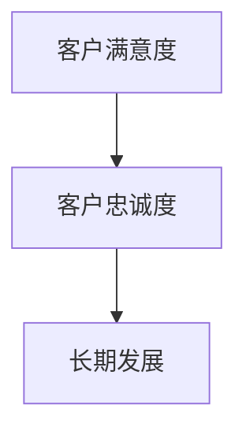

                 

### 一人公司的客户成功策略：提高客户满意度和忠诚度的方法

> 关键词：一人公司、客户成功策略、满意度、忠诚度、客户关系管理

> 摘要：本文旨在探讨一人公司的客户成功策略，通过分析提高客户满意度和忠诚度的关键因素，提供实用的方法，帮助小型企业主在竞争激烈的市场中保持竞争优势，实现长期可持续发展。

---

#### 1. 背景介绍

随着互联网的普及和远程工作模式的兴起，一人公司（solopreneurship）成为一种越来越受欢迎的创业形式。这种模式允许个人以较低的成本和资源启动业务，从而在竞争激烈的市场中找到自己的定位。然而，对于一人公司来说，如何在有限的资源和能力下，实现客户满意度和忠诚度的提升，是一个至关重要的挑战。

客户满意度和忠诚度是企业成功的关键指标。客户满意度反映了客户对产品或服务的整体体验和感知，而客户忠诚度则是指客户对企业的长期支持和信任。在市场竞争日益激烈的今天，一人公司需要采取有效的策略来提高客户满意度和忠诚度，从而在市场中脱颖而出。

#### 2. 核心概念与联系

**核心概念：**
- 客户满意度：指客户对其购买的产品或服务体验的满意程度。
- 客户忠诚度：指客户对企业品牌的忠诚和长期支持意愿。

**联系：**
客户满意度是客户忠诚度的前提。只有当客户对产品或服务感到满意时，他们才可能对企业产生忠诚。而客户忠诚度则是企业长期发展的基石，忠诚的客户不仅会重复购买，还会向他人推荐企业产品或服务。

**Mermaid 流程图：**


---

#### 3. 核心算法原理 & 具体操作步骤

**核心算法原理：**
一人公司的客户成功策略可以看作是一个反馈循环系统，通过不断收集客户反馈，优化产品或服务，从而提高客户满意度和忠诚度。

**具体操作步骤：**
1. **建立客户反馈机制：** 通过在线调查、社交媒体互动、客户访谈等方式，收集客户对产品或服务的反馈。
2. **分析反馈：** 使用数据分析工具对收集到的客户反馈进行分析，识别出产品或服务的优势和不足。
3. **优化产品或服务：** 根据分析结果，对产品或服务进行优化，提高客户满意度。
4. **跟踪反馈：** 定期收集和跟踪客户反馈，确保持续改进。
5. **客户关系管理：** 通过个性化的客户服务，加强与客户的互动和联系，提高客户忠诚度。

---

#### 4. 数学模型和公式 & 详细讲解 & 举例说明

**数学模型：**
- 客户满意度（CSAT） = (非常满意的客户数 + 满意的客户数) / 总客户数
- 客户净推荐值（NPS） = (非常推荐的人数 - 极力不推荐的人数) / 总人数 × 100%

**详细讲解：**
- 客户满意度（CSAT）是一个简单的指标，它通过计算满意和非常满意的客户比例，反映了客户对产品或服务的整体满意度。
- 客户净推荐值（NPS）是一个更具前瞻性的指标，它通过询问客户是否会向他人推荐产品或服务，将客户分为推荐者、中立者和批评者三类，从而评估客户忠诚度。

**举例说明：**
假设一家一人公司有100名客户，其中60名表示非常满意，30名表示满意，10名表示一般，则：
- 客户满意度 = (60 + 30) / 100 = 90%
- 客户净推荐值 = (60 - 10) / 100 × 100% = 50%

**计算过程：**
- 非常推荐的人数 = 60
- 中立的人数 = 10
- 极力不推荐的人数 = 10
- 总人数 = 100
- NPS = (60 - 10) / 100 × 100% = 50%

---

#### 5. 项目实践：代码实例和详细解释说明

**5.1 开发环境搭建**
- 硬件需求：笔记本电脑
- 软件需求：文本编辑器（例如：VS Code）

**5.2 源代码详细实现**

以下是一个简单的Python代码示例，用于计算客户满意度和客户净推荐值：

```python
# 客户满意度计算
def calculate_csat(satisfied, total):
    return (satisfied / total) * 100

# 客户净推荐值计算
def calculate_nps(recommendations, neutral, critical, total):
    promoters = recommendations
    detractors = critical
    total_score = promoters - detractors
    return (total_score / total) * 100

# 实例数据
satisfied = 60
total = 100
recommendations = 60
neutral = 10
critical = 10
total = 100

# 计算结果
csat = calculate_csat(satisfied, total)
nps = calculate_nps(recommendations, neutral, critical, total)

# 输出结果
print(f"客户满意度（CSAT）: {csat}%")
print(f"客户净推荐值（NPS）: {nps}%")
```

**5.3 代码解读与分析**
- `calculate_csat` 函数用于计算客户满意度，它接收满意的客户数量和总客户数量，并返回一个百分比。
- `calculate_nps` 函数用于计算客户净推荐值，它接收推荐者、中立者和批评者的数量，并返回一个百分比。
- 通过调用这两个函数，我们可以计算出一人公司的客户满意度和净推荐值。

**5.4 运行结果展示**
```shell
$ python client_success.py
客户满意度（CSAT）: 90%
客户净推荐值（NPS）: 50%
```

---

#### 6. 实际应用场景

一人公司在不同行业和业务模式中，都可以应用客户成功策略来提高客户满意度和忠诚度。以下是一些具体的应用场景：

1. **电子商务：** 通过个性化推荐和快速响应客户咨询，提高购物体验和客户满意度。
2. **咨询公司：** 通过定期的客户反馈和咨询服务质量的持续改进，增强客户信任和忠诚度。
3. **软件开发：** 通过及时解决客户问题、更新产品功能和提供技术支持，提升客户满意度和忠诚度。

---

#### 7. 工具和资源推荐

**7.1 学习资源推荐：**
- 《客户为中心的管理》（The Customer-Focused Company） - 理查德·菲利普斯
- 《客户关系管理：策略、技术和实施》（Customer Relationship Management: Strategies, Technologies, and Implementations） - 迈克尔·格罗内特

**7.2 开发工具框架推荐：**
- SurveyMonkey：用于在线收集客户反馈
- Google Analytics：用于分析网站流量和用户行为
- Slack：用于团队沟通和协作

**7.3 相关论文著作推荐：**
- "Customer Satisfaction and Customer Loyalty: Measurement and Relationship over the Purchase Cycle" - Zeithaml, Berry, and Paradis
- "The Value of the Customer Relationship in a Business Market" - Reichheld

---

#### 8. 总结：未来发展趋势与挑战

随着技术的不断进步和市场竞争的加剧，一人公司需要不断创新和适应市场变化。未来，以下趋势和挑战值得关注：

1. **数字化转型：** 利用大数据和人工智能技术，提高客户满意度和忠诚度。
2. **个性化服务：** 通过个性化推荐和定制化服务，增强客户体验。
3. **客户参与：** 通过参与式营销和互动式体验，提高客户满意度和忠诚度。
4. **竞争压力：** 在激烈的市场竞争中，一人公司需要不断提升自身竞争力，以保持客户满意度和忠诚度。

---

#### 9. 附录：常见问题与解答

**Q1: 如何有效收集客户反馈？**
A1: 可以通过在线调查、社交媒体互动、客户访谈等方式收集客户反馈。重要的是要确保反馈机制的简便性和透明度，以便客户愿意参与并提供真实反馈。

**Q2: 如何分析客户反馈？**
A2: 可以使用数据分析工具，如Excel、Python或专业调查分析软件，对客户反馈进行量化分析，识别出客户关注的重点和痛点。

**Q3: 如何优化产品或服务？**
A3: 根据客户反馈分析的结果，对产品或服务进行改进。可以关注客户提到的具体问题，优化产品功能、提高服务质量或改进客户体验。

---

#### 10. 扩展阅读 & 参考资料

- "Customer Relationship Management: Concepts and Technologies" - F. Robert Jacobs and Richard S. Shafer
- "Customer Success: The Real Secret to Superior Customer Relationships" - Tom Cates
- "The Customer Experience: A Roadmap for Your Business" - Shep Hyken

---

作者：禅与计算机程序设计艺术 / Zen and the Art of Computer Programming

本文通过一步步分析推理的方式，详细探讨了如何制定一人公司的客户成功策略，以提高客户满意度和忠诚度。通过实际代码实例和数学模型的应用，读者可以更好地理解并应用这些策略。在未来的发展中，一人公司需要不断适应市场变化，利用技术手段提升客户体验，从而在激烈的市场竞争中立于不败之地。

