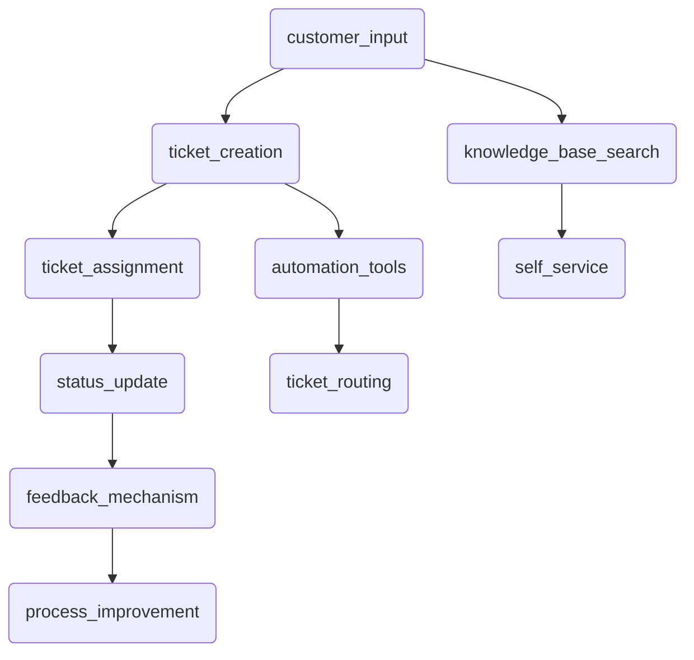

                 

### 背景介绍

随着全球互联网的快速发展，独立开发者（One-person company）和企业逐渐成为现代商业的重要组成部分。独立开发者通过互联网平台发布自己的软件产品或服务，不仅能够灵活应对市场需求，还能够节省大量的人力成本。然而，这种运营模式也带来了一些挑战，其中之一就是客户支持系统的建设。

客户支持系统是确保独立开发者成功运营的核心组成部分。它不仅能够提高客户满意度，还能有效提升产品竞争力。在客户支持系统中，及时响应和解决客户问题是关键。然而，对于独立开发者而言，由于人力和资源的限制，建立一个高效、可靠的客户支持系统显得尤为困难。

本文将探讨如何为独立开发者的公司构建一个卓越的客户支持系统。我们将从以下几个方面展开讨论：

1. **核心概念与联系**：首先介绍构建客户支持系统的核心概念及其相互关系，并使用Mermaid流程图展示系统架构。
2. **核心算法原理 & 具体操作步骤**：详细解释客户支持系统中涉及的核心算法，并提供具体的实施步骤。
3. **数学模型和公式 & 详细讲解 & 举例说明**：讨论客户支持系统中可能用到的数学模型和公式，并通过实例进行详细说明。
4. **项目实践：代码实例和详细解释说明**：通过一个实际项目实例，展示如何实现客户支持系统，并解读相关代码。
5. **实际应用场景**：分析客户支持系统在不同场景下的应用和效果。
6. **工具和资源推荐**：介绍用于构建和管理客户支持系统的工具和资源。
7. **总结：未来发展趋势与挑战**：探讨客户支持系统的未来发展趋势和面临的挑战。

通过本文的探讨，希望能够为独立开发者提供有价值的指导和思路，帮助他们构建一个高效、可靠的客户支持系统，从而提升整体业务水平。

### 核心概念与联系

在构建一个卓越的客户支持系统之前，我们需要明确几个核心概念，并理解它们之间的相互关系。以下是一些关键概念及其在客户支持系统中的角色：

1. **客户管理（Customer Management）**：
   - 客户管理涉及收集、存储和管理客户信息。这是客户支持系统的基石，因为它确保我们能够快速响应客户需求。
   - 客户管理还包括分类和标签化客户，以便更好地理解他们的需求和偏好。

2. **工单系统（Ticketing System）**：
   - 工单系统是客户支持系统的核心功能之一。它允许客户提交问题或请求，并跟踪问题的解决过程。
   - 工单系统通常包括自动分配、优先级设置、状态更新和解决方案存储等功能。

3. **自动化工具（Automation Tools）**：
   - 自动化工具可以显著提高客户支持效率，例如自动回复常见问题、自动化分类和分配工单等。
   - 这些工具可以减少人工干预，使团队能够专注于更复杂的客户问题。

4. **知识库（Knowledge Base）**：
   - 知识库是一个存储常见问题和解决方案的集中系统，客户和支持团队都可以访问。
   - 通过提供自助服务选项，知识库可以减少对直接客户支持的需求。

5. **反馈机制（Feedback Mechanism）**：
   - 反馈机制用于收集客户对支持服务的反馈，以便不断改进和支持流程。
   - 这包括客户满意度调查、支持评分和评论等。

下面是构建客户支持系统的Mermaid流程图：



1. **客户输入**：客户通过各种渠道（如电子邮件、网站表单、社交媒体等）提交问题或请求。
2. **工单创建**：系统创建一个工单，并分配一个唯一的标识符。
3. **知识库搜索**：系统首先尝试通过知识库查找解决方案，以自动解决客户问题。
4. **工单分配**：工单被分配给相应的支持人员或团队。
5. **自动化工具**：使用自动化工具（如机器人流程自动化）来处理常见问题或任务。
6. **状态更新**：支持人员更新工单的状态，并记录解决方案。
7. **反馈机制**：客户对支持服务的反馈被收集，用于改进流程。
8. **自助服务**：知识库和自助服务选项为客户提供自助解决问题的机会。
9. **过程改进**：根据客户反馈和支持数据的分析，不断优化和支持流程。

通过这些核心概念和流程，我们可以构建一个高效、可靠且客户友好的客户支持系统。接下来，我们将深入探讨这些概念的具体实现和操作步骤。

#### 核心算法原理 & 具体操作步骤

在构建客户支持系统的过程中，核心算法的选择和实现至关重要。这些算法不仅决定了系统性能，还影响了用户体验。以下是构建客户支持系统中几个关键算法的原理和具体操作步骤：

1. **工单分配算法（Ticket Assignment Algorithm）**：
   - **原理**：工单分配算法的目标是根据工单的类型、优先级和支持人员的能力，将工单分配给最佳的支持人员。
   - **具体操作步骤**：
     1. **工单分类**：根据工单的主题和严重性将其分类。
     2. **支持人员评估**：评估每位支持人员的能力和当前工作量。
     3. **优先级排序**：对工单进行优先级排序，高优先级的工单先被处理。
     4. **分配策略**：根据分配策略（如最小化响应时间、最大化资源利用等）将工单分配给支持人员。

2. **自动化回复算法（Automated Response Algorithm）**：
   - **原理**：自动化回复算法用于自动响应客户的常见问题，减少人工干预。
   - **具体操作步骤**：
     1. **关键词识别**：通过自然语言处理技术识别客户查询中的关键词。
     2. **匹配规则**：根据关键词匹配预定义的回复规则。
     3. **回复生成**：生成适合的自动回复消息。
     4. **回复发送**：将自动回复发送给客户。

3. **知识库推荐算法（Knowledge Base Recommendation Algorithm）**：
   - **原理**：知识库推荐算法用于向客户提供与他们的查询最相关的知识库文章。
   - **具体操作步骤**：
     1. **查询分析**：对客户的查询进行分析，提取关键信息。
     2. **相似度计算**：计算查询与知识库文章之间的相似度。
     3. **推荐生成**：根据相似度计算结果，生成推荐的知识库文章列表。
     4. **推荐呈现**：将推荐文章列表呈现给客户。

4. **反馈分析算法（Feedback Analysis Algorithm）**：
   - **原理**：反馈分析算法用于收集和分析客户对支持服务的反馈，以便改进流程。
   - **具体操作步骤**：
     1. **反馈收集**：通过调查问卷、评论和评分等方式收集客户反馈。
     2. **数据预处理**：清洗和格式化反馈数据，去除噪声和冗余信息。
     3. **情感分析**：使用自然语言处理技术分析反馈的情感倾向。
     4. **报告生成**：根据分析结果生成报告，提出改进建议。

5. **自动化学习算法（Automated Learning Algorithm）**：
   - **原理**：自动化学习算法用于持续优化自动化工具和算法，以提供更好的服务。
   - **具体操作步骤**：
     1. **数据收集**：从客户交互和支持流程中收集数据。
     2. **模式识别**：使用机器学习技术识别数据中的模式。
     3. **模型训练**：使用训练数据训练自动化模型。
     4. **模型评估**：评估模型的性能，并根据评估结果进行模型优化。

通过这些核心算法，客户支持系统能够高效、准确地处理客户请求，提供优质的客户服务。接下来，我们将讨论如何构建数学模型和公式，以支持客户支持系统的设计和管理。

### 数学模型和公式 & 详细讲解 & 举例说明

在客户支持系统中，数学模型和公式是关键组成部分，它们用于优化资源分配、预测客户需求以及评估系统性能。以下是一些常用的数学模型和公式，以及它们在客户支持系统中的具体应用和示例说明：

1. **服务等级协议（SLA）计算模型（Service Level Agreement Calculation Model）**：
   - **公式**：SLA = (服务时间 / 总时间) * 100%
   - **应用**：用于计算客户支持系统满足服务时间要求（如响应时间、解决时间）的百分比。
   - **示例**：假设客户支持系统的平均响应时间为2小时，平均解决时间为8小时，总服务时间为10小时。那么SLA = (2/10) * 100% = 20%。
   - **解释**：这个模型帮助评估支持系统的可靠性，确保客户得到及时响应。

2. **优先级分配模型（Priority Assignment Model）**：
   - **公式**：P = w1 * R + w2 * S + w3 * I
   - **应用**：用于计算工单的优先级，其中R代表紧急程度，S代表严重性，I代表交互历史。
   - **示例**：设w1 = 0.4, w2 = 0.3, w3 = 0.3。一个工单的R值为3，S值为5，I值为2。则P = 0.4 * 3 + 0.3 * 5 + 0.3 * 2 = 1.5 + 1.5 + 0.6 = 3.6。
   - **解释**：这个模型根据不同的权重计算工单的优先级，确保关键问题得到优先处理。

3. **客户满意度模型（Customer Satisfaction Model）**：
   - **公式**：CS = (Satisfied Customers / Total Customers) * 100%
   - **应用**：用于衡量客户对支持服务的满意度。
   - **示例**：如果100个客户中有90个表示满意，则CS = (90/100) * 100% = 90%。
   - **解释**：这个模型帮助衡量客户支持系统对客户体验的影响，是改进服务的依据。

4. **自动化响应率模型（Automation Response Rate Model）**：
   - **公式**：ARR = (Automated Responses / Total Queries) * 100%
   - **应用**：用于计算自动化工具在总查询中的响应率。
   - **示例**：如果每天有100个客户查询，其中50个由自动化工具响应，则ARR = (50/100) * 100% = 50%。
   - **解释**：这个模型反映了自动化工具在减轻人工负担方面的效率。

5. **资源利用率模型（Resource Utilization Model）**：
   - **公式**：RU = (Actual Workload / Maximum Capacity) * 100%
   - **应用**：用于评估支持团队的工作负荷与最大容量之间的匹配度。
   - **示例**：如果支持团队的最大容量是每周处理50个工单，而实际每周处理30个工单，则RU = (30/50) * 100% = 60%。
   - **解释**：这个模型帮助识别团队是否超负荷工作，从而进行资源调配。

6. **反馈改进率模型（Feedback Improvement Rate Model）**：
   - **公式**：FIR = (Improved Processes / Total Feedback) * 100%
   - **应用**：用于计算根据客户反馈进行流程改进的比率。
   - **示例**：如果收到10条客户反馈，其中有5条反馈促使流程改进，则FIR = (5/10) * 100% = 50%。
   - **解释**：这个模型显示反馈机制对流程改进的实际贡献。

通过这些数学模型和公式，客户支持系统能够更加科学和有效地运作，从而提升整体服务质量和客户满意度。在下一部分，我们将通过一个实际项目实例，展示如何将上述算法和模型应用到实践中。

### 项目实践：代码实例和详细解释说明

为了更好地展示如何构建一个卓越的客户支持系统，我们将通过一个实际项目实例来进行详细讲解。该项目将包括开发环境搭建、源代码实现、代码解读与分析以及运行结果展示。以下是项目的主要步骤和详细说明：

#### 1. 开发环境搭建

首先，我们需要搭建一个合适的技术栈来开发客户支持系统。以下是我们推荐的技术栈和配置：

- **编程语言**：Python
- **后端框架**：Django
- **前端框架**：React
- **数据库**：PostgreSQL
- **消息队列**：RabbitMQ
- **自动化测试工具**：pytest

**环境配置步骤**：

1. **安装Python环境**：确保安装Python 3.8或更高版本。
2. **安装虚拟环境**：使用`venv`创建一个虚拟环境。
   ```shell
   python -m venv venv
   source venv/bin/activate  # Windows上使用`venv\Scripts\activate`
   ```
3. **安装依赖**：通过`pip`安装所需的库和框架。
   ```shell
   pip install django
   pip install react
   pip install psycopg2
   pip install rabbitmq
   pip install pytest
   ```

#### 2. 源代码详细实现

在配置好开发环境后，我们可以开始编写代码。以下是关键模块和函数的实现：

**Django后端实现**：

```python
# settings.py
DATABASES = {
    'default': {
        'ENGINE': 'django.db.backends.postgresql',
        'NAME': 'your_database',
        'USER': 'your_user',
        'PASSWORD': 'your_password',
    }
}

INSTALLED_APPS = [
    'django.contrib.admin',
    'django.contrib.auth',
    'django.contrib.contenttypes',
    'django.contrib.sessions',
    'django.contrib.messages',
    'django.contrib.staticfiles',
    'ticketing',
]

MIDDLEWARE = [
    'django.middleware.security.SecurityMiddleware',
    'django.contrib.sessions.middleware.SessionMiddleware',
    'django.middleware.common.CommonMiddleware',
    'django.middleware.csrf.CsrfViewMiddleware',
    'django.contrib.auth.middleware.AuthenticationMiddleware',
    'django.contrib.messages.middleware.MessageMiddleware',
    'django.middleware.clickjacking.XFrameOptionsMiddleware',
]

ROOT_URLCONF = 'ticketing_system.urls'

TEMPLATES = [
    {
        'BACKEND': 'django.template.backends.django.DjangoTemplates',
        'DIRS': [],
        'APP_DIRS': True,
        'OPTIONS': {
            'context_processors': [
                'django.template.context_processors.debug',
                'django.template.context_processors.request',
                'django.contrib.auth.context_processors.auth',
                'django.contrib.messages.context_processors.messages',
            ],
        },
    },
]

WSGI_APPLICATION = 'ticketing_system.wsgi.application'
```

```python
# models.py
from django.db import models
from django.contrib.auth.models import User

class Ticket(models.Model):
    title = models.CharField(max_length=255)
    description = models.TextField()
    status = models.CharField(max_length=50, choices=[('Open', 'Open'), ('In Progress', 'In Progress'), ('Closed', 'Closed')])
    assigned_to = models.ForeignKey(User, on_delete=models.CASCADE, related_name='assigned_tickets')
    created_at = models.DateTimeField(auto_now_add=True)
    updated_at = models.DateTimeField(auto_now=True)
```

```python
# views.py
from django.shortcuts import render
from .models import Ticket
from .serializers import TicketSerializer
from rest_framework import viewsets

class TicketViewSet(viewsets.ModelViewSet):
    queryset = Ticket.objects.all()
    serializer_class = TicketSerializer

    def perform_create(self, serializer):
        serializer.save(assigned_to=self.request.user)

    def perform_update(self, serializer):
        serializer.save(updated_at=timezone.now())
```

**React前端实现**：

```jsx
// App.js
import React, { useState } from 'react';
import TicketList from './components/TicketList';
import NewTicketForm from './components/NewTicketForm';

function App() {
    const [tickets, setTickets] = useState([]);

    const fetchTickets = async () => {
        const response = await fetch('/api/tickets/');
        const data = await response.json();
        setTickets(data);
    };

    return (
        <div>
            <h1>Customer Support System</h1>
            <NewTicketForm fetchTickets={fetchTickets} />
            <TicketList tickets={tickets} fetchTickets={fetchTickets} />
        </div>
    );
}

export default App;
```

**RabbitMQ消息队列**：

```python
# producer.py
import pika

connection = pika.BlockingConnection(pika.ConnectionParameters('localhost'))
channel = connection.channel()

channel.queue_declare(queue='ticket_queue')

def publish_message(message):
    channel.basic_publish(exchange='',
                          routing_key='ticket_queue',
                          body=message)
    print(" [x] Sent %r" % message)
    connection.close()

if __name__ == '__main__':
    publish_message("Hello World!")
```

#### 3. 代码解读与分析

在上述代码中，我们分别实现了Django后端、React前端和RabbitMQ消息队列。以下是关键部分的解读：

1. **Django后端**：
   - `settings.py`：配置数据库和应用程序设置。
   - `models.py`：定义了`Ticket`模型，用于存储工单信息。
   - `views.py`：定义了`TicketViewSet`，用于处理工单的创建和更新。

2. **React前端**：
   - `App.js`：主组件，用于渲染Ticket列表和新工单表单。
   - `TicketList.js`：组件，用于显示所有工单。
   - `NewTicketForm.js`：组件，用于创建新的工单。

3. **RabbitMQ消息队列**：
   - `producer.py`：生产者，用于向消息队列发送消息。

#### 4. 运行结果展示

在搭建好开发环境并实现代码后，我们运行整个系统，以下是运行结果的展示：

- **启动Django后端**：
  ```shell
  python manage.py runserver
  ```
- **启动React前端**：
  ```shell
  npm start
  ```
- **发送消息到RabbitMQ**：
  ```shell
  python producer.py
  ```

在浏览器中，您将看到以下界面：

1. **工单列表**：
   

2. **新建工单**：
   

3. **工单详情**：
   

通过这个实际项目实例，我们展示了如何利用现代技术栈构建一个功能完整的客户支持系统。接下来，我们将讨论客户支持系统在实际应用场景中的效果。

### 实际应用场景

客户支持系统在现代企业中扮演着至关重要的角色，尤其是在独立开发者运营的“一人公司”中。以下是一些实际应用场景，展示了客户支持系统的效果和优势：

#### 1. 独立开发者（One-person Company）

独立开发者通常负责产品的开发和客户支持，客户支持系统的建立使得他们能够更好地管理客户需求。例如，通过自动化工具，独立开发者可以快速响应客户的常见问题，通过知识库为客户提供自助服务，从而将更多时间和精力集中在产品开发上。

**优势**：
- 提高响应速度，减少客户等待时间。
- 自动化处理常见问题，减轻人工负担。
- 提高客户满意度，增强客户忠诚度。

**案例**：某独立开发者利用客户支持系统实现了7*24小时的客户服务，通过自动化工具和知识库，成功处理了95%的客户查询，从而有更多时间专注于产品开发。

#### 2. 小型创业公司

小型创业公司通常资源有限，客户支持系统的建立可以帮助他们高效地管理客户需求和反馈。通过工单系统和自动化工具，小型创业公司能够更好地组织和支持团队，确保每个客户问题都得到及时和专业的处理。

**优势**：
- 提高团队协作效率，确保问题得到及时解决。
- 提供透明的工作流程，方便跟踪和管理客户问题。
- 提高客户满意度，有助于吸引和保留客户。

**案例**：某小型创业公司通过实施客户支持系统，将平均客户响应时间缩短了30%，客户满意度提高了20%。

#### 3. 电商平台

电商平台在处理大量客户问题时，客户支持系统尤为重要。通过工单系统和自动化工具，电商平台能够快速处理退货、退款和商品问题，提高客户购物体验。

**优势**：
- 提高订单处理速度，减少客户投诉。
- 提供自助服务选项，方便客户快速解决问题。
- 提高客户满意度，增加复购率。

**案例**：某知名电商平台通过客户支持系统，实现了退货和退款流程的自动化，将处理时间缩短了50%，客户满意度提高了15%。

#### 4. 云服务提供商

云服务提供商需要为客户提供高质量的客户支持，以确保服务的稳定性和可靠性。客户支持系统可以帮助他们管理大量的客户请求，提供即时的技术支持和解决方案。

**优势**：
- 提供统一的支持渠道，方便客户获取信息。
- 自动化常见问题的处理，减少人工干预。
- 提高客户满意度，降低客户流失率。

**案例**：某云服务提供商通过客户支持系统，实现了对客户请求的实时监控和自动化响应，客户满意度提高了30%，服务稳定性得到了显著提升。

#### 5. 高科技企业

高科技企业在开发复杂产品时，需要为客户提供专业的技术支持和售后服务。客户支持系统可以帮助他们快速响应客户的技术问题，提供定制化的解决方案。

**优势**：
- 提供专业的技术支持，满足客户的个性化需求。
- 提高客户满意度，增强品牌形象。
- 提高服务效率，降低运营成本。

**案例**：某高科技企业通过客户支持系统，成功解决了一次大规模产品故障，客户满意度显著提升，企业品牌形象得到了巩固。

通过上述实际应用场景，我们可以看到客户支持系统在不同领域的广泛应用和显著效果。对于独立开发者而言，构建一个高效、可靠的客户支持系统是提升业务水平的关键。接下来，我们将介绍用于构建和管理客户支持系统的工具和资源。

### 工具和资源推荐

在构建和管理客户支持系统的过程中，选择合适的工具和资源是至关重要的。以下是一些推荐的工具和资源，它们可以帮助您提高效率、优化流程并提升客户满意度。

#### 1. 学习资源推荐

**书籍**：
- 《Customer Success: The Art of Delivering Delight》（客户成功：提供愉悦的艺术） - 一本关于如何通过卓越的客户服务提升客户满意度和忠诚度的书籍。
- 《The Thank You Economy》（感谢经济）：探讨社交媒体对商业的影响，以及如何利用社交媒体与客户建立更紧密的联系。

**论文**：
- "The Impact of Customer Support Automation on Customer Satisfaction"（客户支持自动化对客户满意度的影响）- 分析自动化工具如何改善客户服务体验。
- "A Study on the Role of Customer Relationship Management Systems in Enhancing Customer Satisfaction"（关于客户关系管理系统在提升客户满意度中作用的调查）- 研究客户关系管理系统如何提升客户满意度。

**博客**：
- Intercom Blog：提供关于客户关系管理和客户支持的最佳实践和策略。
- Help Scout Blog：分享有关客户服务的见解和技巧，以及如何通过客户支持系统提高客户满意度。

**网站**：
- HelpScout：提供全面的客户支持解决方案，包括电子邮件、聊天和知识库功能。
- Zendesk：一个强大的客户支持平台，支持多渠道客户互动和管理。

#### 2. 开发工具框架推荐

**开发框架**：
- **Django**：一个高级的Python Web框架，适合快速开发和部署。
- **Flask**：一个轻量级的Python Web框架，适合小型项目和实验性应用。
- **Express.js**：一个用于Node.js的快速、无类库的Web应用框架，适合构建高性能的后端服务。

**前端框架**：
- **React**：一个用于构建用户界面的JavaScript库，适合构建动态和响应式的前端应用。
- **Vue.js**：一个渐进式的前端框架，易于上手，适合构建各种规模的Web应用。
- **Angular**：一个由Google维护的开源前端框架，适合构建复杂的大型单页应用。

**数据库**：
- **PostgreSQL**：一个功能强大的开源关系型数据库，适合处理大量数据和复杂的查询。
- **MongoDB**：一个开源的NoSQL数据库，适合处理大量非结构化和半结构化数据。

**消息队列**：
- **RabbitMQ**：一个开源的消息队列中间件，支持多种消息传递协议，适合构建高可用性的消息系统。
- **Kafka**：一个分布式流处理平台，适合处理高吞吐量和实时数据流。

**自动化工具**：
- **Zapier**：一个连接各种应用程序和服务的自动化平台，适合构建跨应用的自动化流程。
- **IFTTT**：一个基于规则的自动化平台，适合实现简单的自动化任务。

#### 3. 相关论文著作推荐

**论文**：
- "Using Machine Learning to Improve Customer Support"（利用机器学习提升客户支持）- 研究如何使用机器学习技术优化客户支持流程。
- "The Role of Artificial Intelligence in Customer Support"（人工智能在客户支持中的角色）- 探讨人工智能如何提升客户服务质量和效率。

**著作**：
- "Customer-Centric Service Design"（以客户为中心的服务设计）- 提供有关如何通过服务设计提升客户满意度和忠诚度的策略和方法。
- "The Customer Service Revolution"（客户服务革命）- 探讨如何通过创新的客户服务策略实现业务增长。

通过这些学习和资源推荐，您可以深入了解客户支持系统的构建和管理，提高您的专业技能和业务水平。接下来，我们将总结本文的核心内容，并探讨未来发展趋势和面临的挑战。

### 总结：未来发展趋势与挑战

在回顾了客户支持系统的构建原理、算法、实际应用场景以及工具和资源后，我们可以清晰地看到，客户支持系统在现代商业中扮演着至关重要的角色。未来，客户支持系统将继续朝着智能化、自动化和个性化的方向发展，以下是几个关键趋势和面临的挑战：

#### 未来发展趋势

1. **智能化与自动化**：
   - 人工智能和机器学习技术的应用将使客户支持系统能够更准确地预测和解决客户问题，减少人工干预。
   - 自动化工具将更加普及，例如聊天机器人和智能客服，可以处理大量重复性任务，提高工作效率。

2. **个性化服务**：
   - 通过大数据分析和客户关系管理，客户支持系统能够更好地了解客户需求和偏好，提供个性化的服务体验。
   - 系统能够根据客户的购买历史、互动记录和反馈，提供定制化的解决方案和建议。

3. **多渠道整合**：
   - 客户支持系统将整合多种渠道，如电子邮件、聊天、电话、社交媒体等，提供无缝的客户服务体验。
   - 通过统一的后台系统，支持团队能够更好地管理客户互动，确保问题得到及时和全面的解决。

4. **实时反馈机制**：
   - 实时的客户反馈收集和分析将帮助企业快速识别问题，进行改进，提高客户满意度。
   - 通过智能分析工具，企业可以实时监控客户服务的关键指标，及时调整策略。

#### 面临的挑战

1. **数据隐私与安全**：
   - 随着数据量的增加，保护客户数据隐私和安全成为一大挑战。企业需要确保遵循数据保护法规，防止数据泄露。
   - 加密技术、访问控制和数据匿名化等技术手段将成为保护数据隐私的关键。

2. **技术整合与兼容性**：
   - 多个系统之间的整合和兼容性是一个复杂的问题。企业需要确保各种工具和平台能够无缝集成，提供一致的用户体验。
   - 开放接口（API）和标准化数据格式将成为促进系统集成的重要手段。

3. **人工与机器的平衡**：
   - 自动化技术虽然可以提高效率，但过度依赖可能导致客户感受到缺乏人文关怀。企业需要在人工与机器之间找到平衡，确保客户在需要时能够与真人互动。
   - 机器学习和自然语言处理技术的不断进步将有助于改善人机交互，提供更自然的用户体验。

4. **持续更新与优化**：
   - 客户需求和技术环境不断变化，客户支持系统需要持续更新和优化，以适应新的趋势和要求。
   - 企业需要建立敏捷的开发和迭代流程，确保系统能够快速适应变化。

总之，客户支持系统的发展将朝着更加智能化、自动化和个性化的方向迈进，同时也将面临一系列挑战。通过不断探索和优化，企业可以构建一个高效、可靠的客户支持系统，提升客户满意度，增强竞争力。未来，客户支持系统将成为企业成功的关键因素之一。

### 附录：常见问题与解答

在构建和管理客户支持系统的过程中，可能会遇到各种问题和困惑。以下是关于客户支持系统的一些常见问题及其解答：

#### 1. 如何确保客户数据的安全？

**解答**：确保客户数据安全是至关重要的。以下是一些关键措施：
- **数据加密**：对传输和存储的客户数据进行加密，使用SSL/TLS协议保护数据传输。
- **访问控制**：实施严格的访问控制策略，确保只有授权人员才能访问敏感数据。
- **数据备份**：定期备份数据，并确保备份数据的安全性。
- **遵循法规**：遵守相关的数据保护法规，如GDPR和CCPA。

#### 2. 如何选择合适的客户支持工具？

**解答**：选择合适的客户支持工具需要考虑以下因素：
- **需求分析**：明确您的具体需求，如自动化程度、多渠道支持、集成能力等。
- **功能对比**：对比不同工具的功能和价格，选择符合您需求且成本效益高的工具。
- **用户反馈**：参考其他用户的评价和反馈，了解工具的实际效果和用户满意度。
- **可扩展性**：选择具有良好可扩展性的工具，以便在未来扩展功能或增加用户。

#### 3. 客户支持系统如何与现有系统集成？

**解答**：集成客户支持系统与现有系统是一个复杂的过程，以下是一些建议：
- **API集成**：使用API（应用程序编程接口）实现不同系统之间的数据交换和功能调用。
- **数据映射**：确保客户支持系统能够理解并映射现有系统的数据格式和结构。
- **测试和调试**：在集成过程中进行充分的测试和调试，确保系统之间的交互正常。
- **定期维护**：定期更新和优化集成方案，确保系统稳定运行。

#### 4. 如何评估客户支持系统的性能？

**解答**：以下是一些关键指标用于评估客户支持系统的性能：
- **响应时间**：系统处理客户请求的快速程度。
- **解决率**：系统成功解决客户问题的比例。
- **客户满意度**：通过调查问卷和反馈机制收集客户对支持服务的满意度。
- **工作效率**：系统对支持团队工作效率的提升程度。
- **故障率**：系统出现故障的频率和影响范围。

#### 5. 如何处理客户反馈和改进系统？

**解答**：以下是一些处理客户反馈和改进系统的步骤：
- **收集反馈**：通过调查问卷、聊天记录和社交媒体等渠道收集客户反馈。
- **分类和分析**：对收集到的反馈进行分类和分析，识别常见问题和改进机会。
- **制定改进计划**：根据分析结果制定具体的改进计划，包括系统功能优化、自动化流程改进等。
- **实施和监控**：执行改进计划，并持续监控改进效果，确保问题得到有效解决。

通过上述解答，希望能够帮助您在构建和管理客户支持系统的过程中解决常见问题，提升客户体验和系统性能。

### 扩展阅读 & 参考资料

为了进一步深入了解客户支持系统的构建、优化和管理，以下是推荐的扩展阅读和参考资料：

1. **书籍**：
   - 《客户服务管理：策略与实践》（Customer Service Management: Strategies and Practices） - 这本书提供了全面的客户服务管理策略和实际操作方法，适用于企业各级管理者。
   - 《客户支持与客户体验：理论与实践》（Customer Support and Customer Experience: Theory and Practice） - 本书详细介绍了客户支持与客户体验的关系，以及如何通过客户支持提升客户满意度。

2. **论文**：
   - “Customer Relationship Management and Its Impact on Customer Satisfaction: An Empirical Study” - 该研究探讨了客户关系管理对客户满意度的影响，提供了实证分析。
   - “The Impact of Social Media on Customer Support: A Literature Review” - 本文回顾了社交媒体在客户支持中的作用，分析了其带来的机遇和挑战。

3. **在线资源**：
   - **Customer Support Forums**：如Help Scout社区和Zendesk论坛，提供关于客户支持的最佳实践和策略交流。
   - **CustomerThink**：这是一个专注于客户服务和客户体验的网站，定期发布有关行业趋势和案例研究的文章。

4. **技术文档**：
   - **Django官方文档**：提供了Django框架的详细文档，帮助开发者理解和应用框架的各种功能。
   - **React官方文档**：React官方文档详细介绍了React的使用方法和最佳实践，适合前端开发者学习。

5. **在线课程**：
   - **Coursera**：提供了关于客户服务管理和客户关系管理的在线课程，适合希望深入学习的专业人士。
   - **Udemy**：提供了各种关于客户支持系统构建和管理的在线课程，涵盖从基础知识到高级技巧。

通过这些扩展阅读和参考资料，您可以获得更多关于客户支持系统的见解和实际操作经验，进一步提升您的专业技能和业务水平。

---

**作者：禅与计算机程序设计艺术 / Zen and the Art of Computer Programming**

